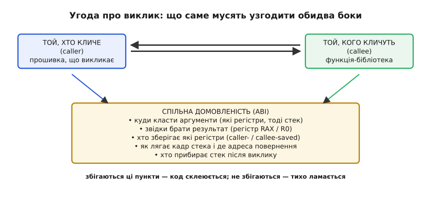
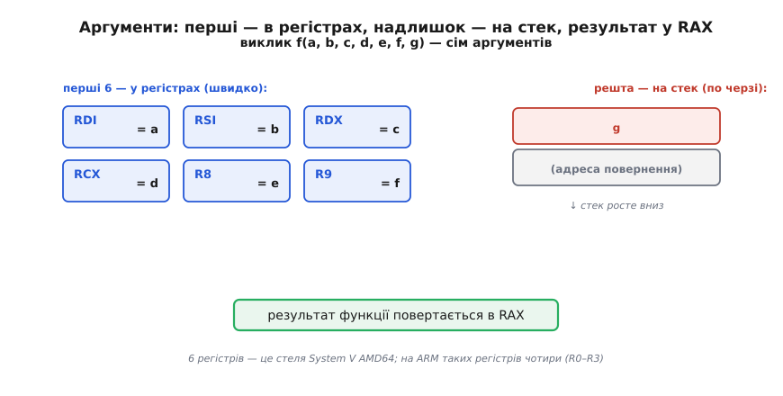
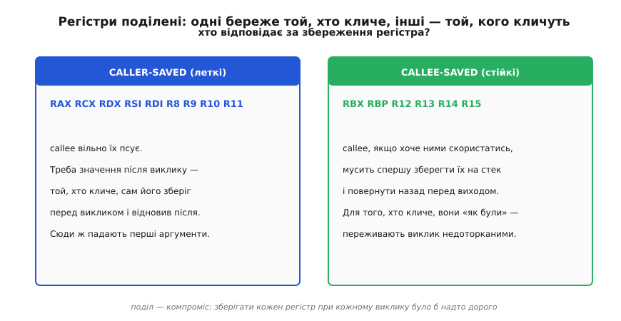
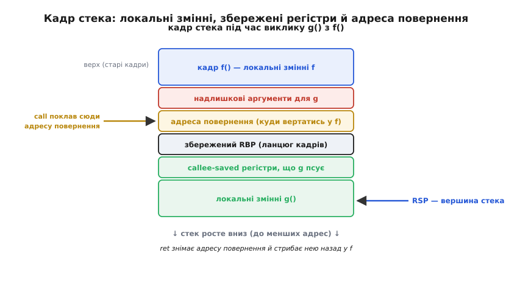

# Угода про виклик (ABI)

Уявіть, що ви пишете функцію, а хтось інший — за рік, іншою мовою, іншим компілятором — її викликає. Ваш код і його код зустрічаються в одній точці машини: одні й ті самі регістри, один і той самий стек. Але процесор не знає слова «аргумент» чи «повернути значення» — [він розуміє лише голі команди](topic:hw-arch/isa): поклади число в регістр, стрибни за адресою, зніми число зі стека. Тож звідки функція знає, **де лежить її перший аргумент**? Звідки той, хто кличе, знає, **де опиниться результат**? Звідки обидва знають, **чи вціліє регістр** після виклику?

Нізвідки — доки нема **домовленості**. Угода про виклик (англ. *calling convention*) — це і є та домовленість: набір жорстких правил, куди класти аргументи, звідки брати результат, хто які регістри береже й хто прибирає стек. Ширша угода, куди виклик входить частиною, зветься **ABI** (англ. *Application Binary Interface* — «двійковий інтерфейс застосунку»): вона додає ще й розміри типів, вирівнювання, розкладку структур — усе, про що мусять однаково думати два шматки скомпільованого коду, щоб склеїтися.

> 🔧 **Навіщо це.** Це те, що дозволяє існувати бібліотекам. Ви лінкуєтеся з `libc`, викликаєте `HAL_UART_Transmit()` зі згенерованого коду STM32, кличете драйвер, скомпільований п'ять років тому іншою версією GCC, — і воно працює **лише тому**, що обидві сторони дотримали тієї самої угоди про виклик. Порушите її (напишете асемблерну вставку, що псує «стійкий» регістр і не відновлює) — і програма впаде далеко від місця помилки, без жодної підказки, чому.

## Чому без угоди ніяк

[Виклик функції](topic:sf-lang/stack-lifo) — це, по суті, «стрибни туди, попрацюй, повернися сюди». Стрибнути й повернутися процесор уміє сам: команда `call` кладе адресу повернення й стрибає, команда `ret` знімає її й вертається. Це механіка, і вона однакова для всіх. Проблема починається там, де треба **передати дані** через цей стрибок.

Розгляньмо найпростіше:

```c
int add(int a, int b) { return a + b; }

int main(void) {
    int x = add(3, 4);
    return x;
}
```

`main` мусить якось вкласти `3` і `4` так, щоб `add` їх звідти дістала. У процесора для цього є лише два місця: **регістри** (кілька надшвидких комірок усередині ядра) і **стек** (ділянка пам'яті). Жодного з них не позначено «сюди перший аргумент». Тож `main` і `add` мусять **заздалегідь погодитись**: скажімо, «перший цілий аргумент — у такому-то регістрі, другий — у такому-то, результат вертай отуди». Якщо `main` покладе `3` в один регістр, а `add` шукатиме його в іншому — функція просто прочитає сміття. Компілятор не помітить: обидві сторони скомпілювалися окремо, кожна «впевнена» у своєму. Тому угода мусить бути **фіксована наперед і однакова для всіх**, хто збирається одне одного викликати.

Найголовніша думка: угода про виклик — це **не властивість процесора**, а **суспільний договір** довкола нього. Той самий чип ARM чи x86 стерпить будь-яку розкладку аргументів; яку саме обрано — вирішує ABI платформи (для Linux на x86-64 це [System V ABI](topic:hw-arch/calling-convention/hist-abi-wars.md), для мікроконтролерів ARM — AAPCS). Обери інакше — і твій код просто не зможе кликати чужий.


*Угода про виклик — договір між двома боками. Той, хто кличе (caller), і той, кого кличуть (callee), окремо скомпільовані й ніколи не «бачать» один одного — їх з'єднує лише набір фіксованих правил ABI. Збігаються ці пункти в обох — код склеюється; розійдеться бодай один — програма ламається тихо, без помилки компіляції.*

## Куди йдуть аргументи: спершу регістри, тоді стек

Ранні угоди клали всі аргументи на стек — просто й одноманітно. Але [стек живе в пам'яті](topic:sf-lang/stack-lifo), а звертання до пам'яті куди повільніше за дію над регістром. Тож сучасні угоди роблять природний хід: **перші кілька аргументів передають у регістрах**, а на стек ідуть лише ті, що не вмістились.

Скільки саме регістрів — вирішує ABI. У System V AMD64 (Linux, macOS, BSD) перші **шість** цілих або вказівникових аргументів ідуть, у цьому порядку, в регістри `RDI`, `RSI`, `RDX`, `RCX`, `R8`, `R9`; числа з плаваючою комою — окремо, у `XMM0…XMM7`. Сьомий і далі лягають на стек. У ARM AAPCS (те, на чому крутиться майже кожен мікроконтролер Cortex-M) таких регістрів чотири: `R0`, `R1`, `R2`, `R3`; п'ятий аргумент і надалі — на стек.


*System V AMD64: перші шість цілих аргументів ідуть у регістри (швидко, без доступу до пам'яті), а надлишок — по черзі на стек. Результат функція повертає в RAX. На ARM таких «регістрових» аргументів чотири (R0–R3), решта механіки та сама.*

Ось той самий `add`, як його бачить машина під System V (спрощено до суті):

```
; add(a, b): a вже в RDI, b — в RSI (так поклав той, хто кликав)
add     edi, esi     ; порахувати a + b (у 32-бітних половинах регістрів)
mov     eax, edi     ; результат — у RAX (тут його чекатиме той, хто кликав)
ret                  ; зняти адресу повернення й стрибнути назад
```

Той, хто кличе, перед `call add` кладе `3` у `RDI`, `4` у `RSI`; після повернення бере відповідь із `RAX`. Ні `add`, ні `main` ніде не «домовляються» в рантаймі — обидва просто **скомпільовані під ту саму угоду**, і тому регістри збігаються самі собою.

**Чому результат — в одному регістрі.** Функція повертає значення там, де його потім чекають: у System V — `RAX`, у ARM — `R0`. Це той самий регістр, що ним прийшов би перший аргумент наступного виклику, і в цьому є логіка: результат майже завжди одразу кудись іде далі, тож нехай уже лежить «під рукою». Якщо повертати треба більше, ніж влазить в один регістр (велику структуру), угода й це передбачає: тоді той, хто кличе, потай передає прихований вказівник на місце, куди callee покладе результат, — але це вже деталь для [детального розбору](topic:hw-arch/calling-convention/detail).

## Хто береже регістри: поділ на «леткі» й «стійкі»

Тут ховається найтонше місце угоди — і найчастіше джерело загадкових багів. Регістрів у процесора мало, а користуватись ними хочуть обидва: і той, хто кличе, і функція, яку він кличе. Виникає конфлікт. `main` тримає щось цінне в регістрі, викликає `foo()`, а `foo` хоче той самий регістр під свої обчислення. Хтось мусить його зберегти й відновити — але **хто**?

Якби зберігати мусив завжди той, хто кличе, він рятував би геть усі регістри перед кожним викликом — навіть ті, яких функція й не торкнеться. Марна робота. Якби завжди callee — те саме навпаки: функція рятувала б регістри, які тому, хто кличе, і не потрібні. Обидві крайності марнотратні. Тому угода ділить регістри **навпіл** — це компроміс, вистражданий десятиліттями:

- **Леткі регістри** (англ. *caller-saved*, «береже той, хто кличе»): функція вільно їх псує. Треба тому, хто кличе, значення й після виклику — хай сам збереже його перед `call` і відновить після. У System V це `RAX`, `RCX`, `RDX`, `RSI`, `RDI`, `R8`–`R11` (сюди ж падають перші аргументи — вони й так «розхідні»).
- **Стійкі регістри** (англ. *callee-saved*, «береже той, кого кличуть»): функція, якщо хоче ними скористатись, **мусить** спершу зберегти їх на стек і повернути перед виходом. Для того, хто кличе, вони переживають виклик недоторканими. У System V це `RBX`, `RBP`, `R12`–`R15`.


*Поділ відповідальності. Леткі (caller-saved) регістри callee трощить без церемоній — хто кличе, той сам рятує потрібне. Стійкі (callee-saved) callee зобов'язаний зберегти на стек і відновити перед виходом — для того, хто кличе, вони «як були». Поділ навпіл — компроміс: рятувати всі регістри при кожному виклику було б надто дорого.*

Механізм видно прямо в коді. Функція, якій треба стійкий регістр `RBX`, починається з його збереження й закінчується відновленням:

```c
int worker(int n) {
    int acc = compute(n);   // виклик усередині — RBX переживе його
    return acc + n;         // n усе ще потрібне ПІСЛЯ виклику
}
```

```
worker:
    push    rbx          ; зберегти RBX — він callee-saved, ми його займаємо
    mov     ebx, edi     ; заникати n у RBX: RBX виживе після виклику compute
    call    compute      ; compute вільно псує RAX, RCX... але RBX не сміє
    add     eax, ebx     ; RAX (результат compute) + n (цілий у RBX)
    pop     rbx          ; відновити RBX перед виходом — обіцянка дотримана
    ret
```

Чому `n` поклали саме в `RBX`, а не лишили в `RDI`? Бо `RDI` — **леткий**, і `compute` мала повне право його затерти; після виклику там могло б бути що завгодно. `RBX` **стійкий** — `compute`, за угодою, зобов'язана лишити його таким, яким узяла. Тож `worker` перекладає цінне `n` у стійкий регістр, платячи за це одним `push`/`pop`. Уся ця бухгалтерія — прямий наслідок угоди; жодна її буква не випадкова.

> 🔧 **Навіщо це.** Найпідступніший клас багів у прошивці — коли асемблерна вставка (або грубо написаний обробник) псує callee-saved регістр і не відновлює його. Компілятор довкола розраховував, що регістр «як був», — і вилітає значення геть в іншому місці, через десяток викликів, без сліду причини. Знаючи, які регістри стійкі, ви знаєте, що саме зобов'язані зберегти. Той самий закон керує [входом у перервання](topic:hw-arch/interrupt-vector): перервання — це «виклик», якого код не чекав, тож залізо/обробник мусять зберегти всі леткі регістри самі, бо перерваний код на це не підписувався.

## Стек: адреса повернення й кадр

Стрибнути у функцію — пів справи; треба ще **знати, куди вертатись**. Це й робить `call`: перед стрибком він кладе на [стек](topic:sf-lang/stack-lifo) адресу наступної за собою команди — **адресу повернення**. Наприкінці функції `ret` знімає її звідти й стрибає нею назад. Ось чому виклики так природно вкладаються один в одного: кожен `call` кладе свою адресу повернення зверху, кожен `ret` знімає найсвіжішу — точно за принципом стека, останнім поклав — першим узяв.

Довкола цієї адреси функція будує свій **кадр стека** (англ. *stack frame*) — власну робочу ділянку: там лежать збережені callee-saved регістри, аргументи, що не влізли в регістри, і локальні змінні. Кадр живе рівно стільки, скільки виконується функція; на виході стек стискається назад, і кадр зникає сам.


*Кадр стека під час виклику g() з f(). Знизу вгору: команда call поклала адресу повернення (куди вертатись у f); нижче callee будує свій кадр — збережений RBP для ланцюга кадрів, врятовані callee-saved регістри, локальні змінні. RSP вказує на вершину. Команда ret знімає адресу повернення й стрибає нею назад у f; кадр зникає.*

На ARM цей самий сюжет має характерну відмінність, варту згадки. Там `call` (команда `BL` — *branch with link*) кладе адресу повернення **не на стек, а в окремий регістр** `LR` (*link register*, `R14`). Для найпростіших листкових функцій — тих, що самі нікого не кличуть, — цього досить: адреса весь час у `LR`, стек навіть не займали. Але щойно функція викликає когось іншого, той виклик перезапише `LR` своєю адресою — тож перед цим первісну адресу треба зберегти на стек (типово командою `push {lr}`, а вертаючись — `pop {pc}`). Дрібна деталь, а вона пояснює, чому на мікроконтролері прості функції такі дешеві: виклик без вкладених викликів обходиться без жодного доторку до пам'яті.

## Хто прибирає стек

Лишається останній пункт угоди — дрібний на вигляд, історично гучний. Коли аргументи клали на стек, після повернення хтось мусить **зсунути вершину стека назад**, прибравши їх. Знову те саме питання: хто? Той, хто кличе, чи callee?

Обидві відповіді робочі, і історично існували обидві. У сімействі x86 угода `cdecl` каже: прибирає **той, хто кличе**. Це коштує кількох зайвих байтів коду на кожному місці виклику, зате дозволяє **функції зі змінним числом аргументів** — як `printf(fmt, ...)`: тільки той, хто кличе, знає, скільки саме аргументів він передав, тож тільки він і може правильно їх прибрати. Угода `stdcall` каже інакше: прибирає **callee**, одним махом наприкінці себе. Код трохи компактніший (прибирання в одному місці, а не в кожного, хто кличе), але змінне число аргументів так уже не зробиш — функція наперед не знає, скільки їх було. Це протистояння, разом із суміжною плутаниною імен функцій у бібліотеках, свого часу коштувало розробникам чимало сивого волосся; його [історію](topic:hw-arch/calling-convention/hist-abi-wars.md) варто знати окремо.

На 64-бітних системах цю суперечку здебільшого закрили: там аргументи переважно їдуть у регістрах, стека торкаються рідше, і угода одна на платформу. Але сам принцип нікуди не подівся — це просто ще один пункт того самого договору, який обидві сторони мусять читати однаково.

## Чому це варто бачити цілим

Складіть докупи — і виклик функції перестає бути «магією мови». Це чотири узгоджені правила поверх голого заліза: **аргументи** йдуть у визначені регістри, тоді на стек; **результат** вертається у визначений регістр; регістри поділено на **леткі й стійкі**, і кожна сторона знає свій обов'язок; `call`/`ret` через **адресу повернення** на стеку в'яжуть виклики один в одного, а прибирання стека закріплено за одним із боків. Порушите бодай одне — і два скомпільовані шматки, кожен сам по собі правильний, разом дадуть тихий крах.

Саме ця угода — невидимий клей усієї програмної екосистеми. Вона дозволяє мовам кликати одна одну (C викликає асемблер, Rust викликає C), компіляторам різних версій і виробників давати сумісний код, операційній системі приймати виклики від застосунків, написаних будь-ким. Домовленість замість магії — і на ній тримається все, що більше за одну функцію.
