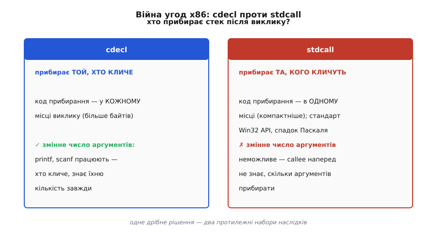
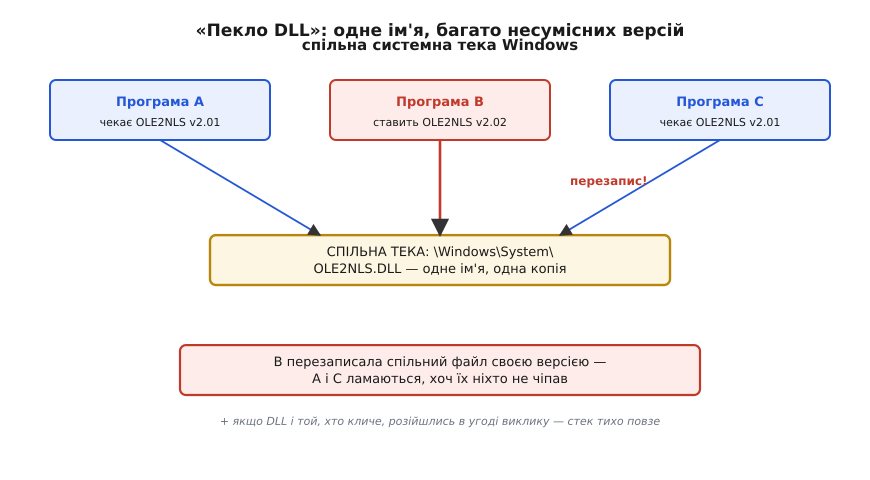
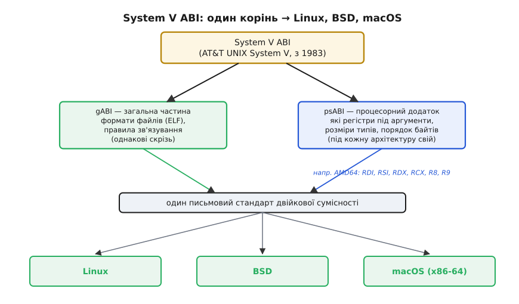

# 📜 Війни угод про виклик: cdecl проти stdcall, «пекло DLL» і спільний предок Unix

Уявіть просту, майже дурну суперечку: після того як функцію викликали через стек, **хто зсуває вершину стека назад** — той, хто кликав, чи та функція, яку кликали? Здавалося б, дрібниця на кілька байтів коду. Та саме ця дрібниця свого часу розколола світ x86 на два табори, змусила лінкери псувати імена функцій до невпізнання, подарувала цілому поколінню розробників словосполучення «пекло DLL» — і водночас на іншому континенті, у світі Unix, тихо породила спільну домовленість, на якій сьогодні тримаються Linux, BSD і macOS. Це історія про те, як питання «хто прибирає стек» виявилося не технічною формальністю, а лінією фронту.

Щоб її відчути, треба спершу побачити, чому обидві відповіді — і «прибирає той, хто кличе», і «прибирає та, кого кличуть» — насправді робочі, і жодна не «правильніша» за іншу.

## Дві законні відповіді на одне питання

Коли аргументи передають через стек, після повернення стек треба **звузити** — прибрати з нього ті аргументи. Механіка проста: додати до вказівника стека стільки байтів, скільки займали аргументи. Питання лише в тому, **чий** код це робить.

Перший варіант — прибирає **той, хто кличе** (англ. *caller*). Одразу після повернення з функції він сам зсуває вершину. Так робить угода [x86](root:hw-arch/isa) під назвою **cdecl** (від *C declaration* — «оголошення на мові C»). Ціна очевидна: код прибирання доводиться вставляти **після кожного** місця виклику. Викликали функцію в сотні місць — сотня однакових шматочків прибирання.

Другий варіант — прибирає **та, кого кличуть** (англ. *callee*): функція наприкінці себе сама знімає аргументи зі стека, одним махом, у своєму `ret`. Так робить угода **stdcall**. Тут прибирання лежить **в одному місці** — усередині функції, — тож виклик стає компактнішим: сотня викликів обходиться без сотні дописок.

На перший погляд stdcall просто економніший, і суперечці кінець. Але тут ховається пастка, через яку весь спір і розгорівся, — і щоб її побачити, треба спитати одну річ: **а чи завжди callee взагалі знає, скільки аргументів прибирати?**

## Чому лише cdecl дає `printf`

Розгляньмо функцію, яку кожен викликав тисячі разів:

```c
printf("координати: %d, %d, висота %d\n", x, y, alt);
printf("готово\n");
```

Той самий `printf` в одному рядку бере чотири аргументи, у другому — один. Він **змінноаргументний** (англ. *variadic*): число й типи аргументів наперед не визначені, вони випливають із рядка формату вже в рантаймі. І ось ключове: **сама функція `printf` не знає, скільки аргументів їй передали**, доки не почне розбирати `"%d, %d..."`. А та, хто кличе, — знає **завжди**, ще на етапі компіляції: компілятор бачить рівно стільки аргументів, скільки написано в дужках.

Звідси все й випливає, майже механічно. Прибрати аргументи зі стека може лише той, хто **знає їхній сумарний розмір**. За cdecl прибирає той, хто кличе, — а він знає розмір завжди; тож змінне число аргументів для cdecl природне. За stdcall прибирає callee — а він розміру наперед **не знає**; отже, змінноаргументну функцію під stdcall **зробити не можна** в загальному випадку. Callee міг би вгадувати за форматним рядком, але це вже була б логіка самої функції, а не проста дія угоди — а угода мусить бути тупою й однаковою для всіх. Тому `printf`, `scanf`, `sprintf` і вся їхня рідня — **завжди cdecl**, іншого шляху немає.

> 🔧 **Навіщо це.** Це не музейний факт, а пастка, у яку легко впасти й сьогодні. Оголосите змінноаргументну функцію-обгортку над `printf` (скажімо, свій лог для прошивки) з атрибутом stdcall — і на платформі, де ці угоди ще розрізняють, дістанете тихо зіпсований стек: callee спробує прибрати «як завжди N байтів», а їх було інакше. Правило коротке: `...` у сигнатурі — тільки cdecl. Той самий закон пояснює, чому в заголовках усі варіадики оголошені саме так.

А тепер — звідки взявся другий табір. Бо cdecl був за замовчуванням у компіляторах C від початку; stdcall же прийшов не з C, а з зовсім іншого світу.

## Родовід stdcall: спадок Паскаля й 16-бітних вікон

У stdcall є батько, і звати його **Паскаль**. Точніше — так звана **угода Паскаля** (*Pascal calling convention*), у якій прибирає callee. Вона панувала в кількох ранніх системних API: OS/2 1.x, **Microsoft Windows 3.x** та ранніх версіях Borland Delphi; сам спосіб «callee прибирає» популяризувала мова **Turbo Pascal** від Borland (перша версія — 1983). Логіка вибору для системного API проста: API складається з небагатьох функцій, які викликають із **дуже багатьох** місць. Якщо прибирає callee, то економія коду в кожному з тисяч місць виклику множиться — а на 16-бітних машинах 1980-х кожен байт коду був на рахунку.

Коли Microsoft переходила до 32-бітного **Win32 API** (з Windows NT на початку 1990-х), стару угоду Паскаля трохи причесали й назвали **stdcall** (*standard call* — «стандартний виклик»): callee й далі прибирає стек, як у Паскаля, але аргументи тепер кладуться на стек **справа наліво**, як у cdecl. Саме stdcall став **стандартною угодою всього Win32 API** — тому в заголовках Windows функції позначені макросом `WINAPI`, а він і є stdcall.

Ось де зав'язався справжній вузол. У межах однієї Windows-програми тепер **співіснували дві угоди**: код на C за замовчуванням говорив cdecl, а системні виклики — stdcall. Доки компілятор бачив правильне оголошення функції, він сам ставив правильний виклик, і все трималося. Але ця рівновага була крихка: досить було з'єднати два шматки коду, що розійшлися в угоді, — і стек тихо «поповз». Компілятор мовчав, бо кожен шматок сам по собі був правильний. Потрібен був якийсь запобіжник — і його зробили просто в **іменах функцій**.


*Розкол x86. cdecl: прибирає той, хто кличе, — код прибирання в кожному місці виклику (більше байтів), зате змінне число аргументів (printf) можливе, бо той, хто кличе, завжди знає їхню кількість. stdcall (спадкоємець угоди Паскаля з 16-бітних Windows/OS/2): прибирає callee одним махом — код компактніший, це стандарт Win32 API, але варіадики неможливі, бо callee наперед не знає, скільки аргументів прибирати. Одне дрібне рішення — два протилежні набори наслідків.*

## Прикрашання імен: коли лінкер псує назви, щоб урятувати вас

Щоб дві угоди не сплуталися нишком, у світі Windows придумали **прикрашати** (англ. *decorate*) імена функцій — домішувати до назви позначку угоди й розміру аргументів. Ідея була рятівна: зробити так, щоб функція, скомпільована під одну угоду, **не злінкувалася** з викликом, що чекає на іншу, — хай краще лінкер лайне «немає такого символу», ніж програма тихо впаде в рантаймі.

Правила вийшли такі. Функцію cdecl прикрашають простим підкресленням спереду: `foo` стає `_foo`. Функцію stdcall прикрашають ретельніше — підкреслення спереду, а ззаду знак `@` і **число байтів аргументів**: оголошення `void __stdcall foo(int a, int b)` дає символ `_foo@8` (два `int` по 4 байти — вісім). Те число байтів у назві — і є запобіжник: спробуєте покликати `foo` з іншим набором аргументів чи з іншою угодою — лінкеру просто не збіжеться ім'я.

Це прикрашання (*name decoration*) — родич, але **не те саме**, що славнозвісне **спотворення імен** у C++ (*name mangling*). Спотворення — про інше: у C++ можна мати кілька функцій з тим самим ім'ям, але різними типами аргументів (перевантаження), а лінкер розрізняє символи лише за іменем. Тож компілятор запікає типи аргументів **прямо в ім'я символу**: невинна `int add(int, double)` перетворюється на щось на кшталт `?add@@YAHNH@Z` (у схемі Microsoft) чи `_Z3addid` (у схемі Itanium/GCC). Обидва явища — і decoration угоди, і mangling C++ — роблять зовні те саме: **псують читабельне ім'я задля точності лінкування**. І обидва разом породили окремий різновид болю на межі бібліотек.

> 🔧 **Навіщо це.** Ось чому в кожному заголовку бібліотеки на C ви бачите `extern "C"`. Ця обгортка каже компілятору C++: «для цих функцій вимкни спотворення імен, лишай назву як є». Без неї ваш C++-код спотворить ім'я на свій лад, а бібліотека, скомпільована як C, експортує його чисто — і лінкер їх не зведе. Це щоденний, дуже реальний наслідок історії, яку ми розбираємо: угоди про ім'я, як і угоди про виклик, обидві сторони мусять читати однаково, інакше склейки не буде. Механіку того, як символи знаходять одне одного під час збірки, розкриває [лінкування](root:sf-lang/linking).

Прикрашання рятувало, поки все збирали одним компілятором. Та щойно бінарники почали жити **окремо** від коду, що їх кличе, — у вигляді готових бібліотек, які підвантажуються в рантаймі, — з цих самих правил виріс сюжет, що коштував індустрії років страждань.

## «Пекло DLL»: коли бібліотеки почали жити своїм життям

Windows стоїть на **бібліотеках динамічного зв'язування** — DLL (*Dynamic-Link Library*). Ідея красива: не вкомпільовувати спільний код у кожну програму, а тримати його одним файлом, який усі програми підвантажують у рантаймі. Одна копія коду на диску, одна в пам'яті, оновив бібліотеку — оновилися всі. У теорії — ощадливо й елегантно.

На практиці вийшло пекло. Різні програми клали свої DLL у **спільну** системну теку Windows, часто **під тим самим ім'ям**, але **різних версій**. Установлюєте нову програму — вона перезаписує спільний файл своєю версією; стара програма, що розраховувала на попередню, раптом ламається, хоч ви її й не чіпали. У DLL не було вбудованого механізму зворотної сумісності: навіть дрібна зміна могла так змінити внутрішню структуру бібліотеки, що спроба скористатися нею валила програму.

Це явище дістало влучну назву **DLL hell** — «пекло DLL». Її увів **Браян Лівінгстон** (*Brian Livingston*) у колонці «Window Manager» у журналі **InfoWorld** **5 січня 1998 року**, під заголовком «Чи дасть Windows 98 бодай якесь розв'язання пекла DLL?». (Це усталений, добре задокументований факт — збереглася й сама колонка.) Лівінгстон описав хворобу точно: «Установлення однієї програми Windows може перезаписати "спільні" файли, якими користуються інші програми», а «конфлікт стається, коли старіша DLL записана поверх новішої». Він навів і живий приклад: Office 4.3c працював із файлом `OLE2NLS.DLL` версії 2.01, але не з тим самим файлом версії 2.02.

Де тут наша угода про виклик? Вона — одна з ниток цього клубка, і повчальна. Уявіть DLL, зібрану з функціями stdcall, і програму, що кличе їх, гадаючи, що вони cdecl (чи навпаки). Прикрашання імен рятувало лише тоді, коли обидва боки бачили **однакові** оголошення при збірці. Але DLL і програма збиралися **різними людьми, різними компіляторами, у різні роки** — рівно та ситуація, задля якої угоди й вигадали, тільки тепер сторони справді ніколи не «бачили» одна одну. Розійшлися угодою чи розміром аргументів — і найкращий випадок був той, де лінкер чи завантажувач лаявся на неспівпадіння імені; найгірший — тихий «повзучий» стек глибоко в рантаймі, без сліду причини. До версійного хаосу додавався хаос **двійкової сумісності**, і саме тому «пекло DLL» стало приказкою.


*Корінь «пекла DLL». Кілька програм кладуть у спільну системну теку Windows бібліотеки під тим самим ім'ям, але різних версій. Нова установка перезаписує спільний файл — і стара програма, що чекала на попередню версію, ламається, хоч її не чіпали. До версійного конфлікту додається двійковий: якщо DLL і той, хто її кличе, розійшлися в угоді про виклик чи розкладці аргументів, збірка мовчить, а стек тихо повзе в рантаймі. Одне ім'я, багато несумісних реалізацій — тиха поломка замість чесної помилки.*

Вибиралися з пекла роками й кількома засобами. Технічно найважливіший — **паралельні збірки** (англ. *side-by-side assemblies*), що з'явилися на межі Windows 98 SE/2000 і дозріли пізніше у вигляді теки **WinSxS** (*Windows Side-by-Side*): замість однієї спільної копії система тримає **кілька версій** тієї самої бібліотеки поруч, і кожна програма отримує саме ту, під яку її збирали. Логіка тут пряма: якщо корінь біди — насильне спільне користування одним файлом, то ліки — дати кожному свою копію. Пізніше .NET із суворою версійністю збірок довершив утечу. Але слід у мові лишився: «DLL hell» досі кажуть щоразу, коли залежності починають воювати між собою.

А тепер перенесімося на інший континент і на десять із гаком років назад — у світ, де до тієї самої проблеми підійшли зовсім інакше й наперед.

## System V ABI: спільний предок Unix

Поки в світі x86/Windows угоди множилися й воювали, у світі Unix ішла протилежна робота — **звести все до одного письмового стандарту**. Джерело цього стандарту — операційна система **UNIX System V** від **AT&T**, чия перша версія вийшла **1983 року** (усталений факт). Саме довкола неї народилося поняття, що його ми сьогодні звемо **System V ABI** — двійковий інтерфейс застосунку, який описує геть усе, про що мусять однаково думати два скомпільовані шматки: угоду про виклик, формати об'єктних і виконуваних файлів, динамічне зв'язування, розкладку типів.

Найпроникливіше рішення в його будові — **поділ надвоє**, і варто зрозуміти, навіщо. Одна частина стандарту — **загальна** (англ. *generic ABI*, gABI): усе, що **однакове** для будь-якого заліза (формат файлів, принципи зв'язування). Друга — **процесорна** (англ. *processor-specific supplement*, psABI): усе, що **залежить від конкретної архітектури** (які саме регістри під аргументи, розміри типів, порядок байтів). Причина поділу глибока: сам **формат** і **правила гри** не мусять мінятися від чипа до чипа — мінятися має лише прив'язка до конкретних регістрів. Тож загальну частину пишуть раз, а під кожну нову архітектуру дописують лише тонкий процесорний додаток. Одна ідея — довільно багато процесорів.

Тілом цього стандарту став формат **ELF** (*Executable and Linkable Format*). Його створили в **Unix System Laboratories** (USL, підрозділ AT&T) для **System V Release 4** наприкінці 1980-х, і ELF від початку був **розширюваним**: кожен процесорний додаток лише уточнює розміри типів і порядок байтів, а кістяк лишається спільним — рівно втілення того самого поділу gABI/psABI. Стандарт швидко визнали індустрією: у 1990-х на ELF і System V ABI перейшли **Solaris, IRIX, HP-UX, Linux і FreeBSD**. Так набір команд лишався різним, а **спосіб** пакувати код і викликати функції став спільним — саме те, чого світу x86 бракувало.


*Задум System V ABI (AT&T UNIX System V, з 1983; формат ELF — USL, кінець 1980-х). Стандарт поділено надвоє: загальна частина (gABI) — формати файлів і правила зв'язування, однакові скрізь; процесорні додатки (psABI) — прив'язка до конкретної архітектури (які регістри під аргументи, розміри типів). Загальну частину пишуть раз; під кожен новий процесор дописують лише тонкий додаток. Тому один корінь розгалузився в Linux, BSD і macOS: ISA різні, а спосіб пакувати код і викликати функції — спільний. Протилежність війнам угод у світі x86.*

Ось чому саме System V ABI варто називати **спільним предком**. Коли на сцену вийшли 64-бітні процесори AMD64 (x86-64), під них написали окремий процесорний додаток — **System V AMD64 ABI**. Саме він задає ту розкладку, яку сьогодні бачить кожен, хто дизасемблює код під Linux: перші цілі аргументи в `RDI`, `RSI`, `RDX`, `RCX`, `R8`, `R9`. І — що важливо для нашої теми про колективність — цей додаток створювала не одна фірма й не одна нація. Початкову чернетку (версія 0.90) вела група коло **Яна Губічки** (*Jan Hubička*, чех), а зрілу версію 1.0 редагували, серед інших, **Х. Дж. Лу** (*H.J. Lu*), **Міхаель Мац** (*Michael Matz*, німець), **Мілінд Ґіркар** (*Milind Girkar*), **Андреас Єґер** (*Andreas Jaeger*, німець) і **Марк Мітчелл** (*Mark Mitchell*) — по-справжньому міжнародний склад інженерів компіляторів. Цю саму розкладку прийняли Linux і BSD; **macOS** на x86-64 дотримується того ж System V AMD64 ABI з невеликими власними відхиленнями. Один письмовий стандарт з коренем у System V 1983 року — і на ньому мовчки сходяться три великі родини систем.

Порівняйте два світи, і мораль сама проступає. У світі x86/Windows угоди **виросли стихійно** й почали воювати — звідси прикрашання імен і «пекло DLL». У світі Unix ту саму потребу **записали наперед** одним поділеним стандартом — і замість воєн дістали спільний ґрунт, на якому різні системи й різні компілятори склеюються без бою. Різниця не в залізі; вона в тому, чи є **письмова домовленість**, яку всі читають однаково.

## Чому війни вщухли

Наприкінці варто спитати: а де ці війни тепер? Здебільшого — позаду, і причина повчальна. На 64-бітних системах суперечку «хто прибирає стек» майже зняли з порядку денного — бо аргументи тепер їдуть переважно **в регістрах**, а не на стеку, тож і прибирати зі стека здебільшого нема чого. Заразом кожна платформа **устоялася на одній угоді**: Linux, BSD і macOS — на System V AMD64 ABI; 64-бітна Windows — на власній єдиній угоді замість колишнього зоопарку cdecl/stdcall/fastcall. Один із головних фронтів просто зник разом зі стеком як головним місцем передачі аргументів.

І все ж коріння цих воєн нікуди не поділося — воно проросло в звички, які ви бачите щодня: `extern "C"` у заголовках, макрос `WINAPI`, окремі правила для варіадиків, приказку «пекло DLL». Це не архаїка, а закам'янілі сліди простого факту: **угоду мусять читати однаково обидві сторони**, а коли єдиної письмової угоди немає — сторони розходяться, і код ламається тихо. Світ x86 вивчив це через десятиліття болю; світ Unix записав наперед. Обидва дійшли до того самого висновку, з якого все й починається: домовленість замість магії — і що раніше її покладено на папір, то менше сивого волосся вона коштує.
