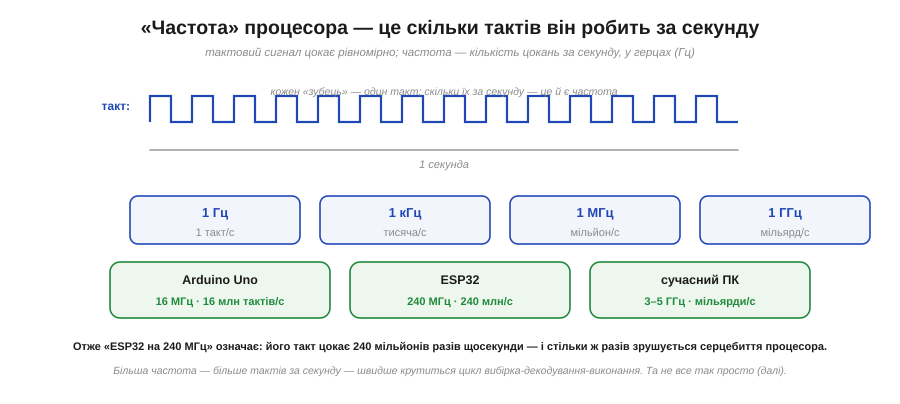
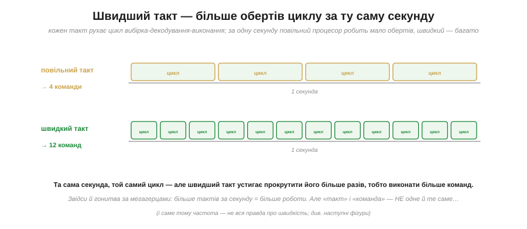
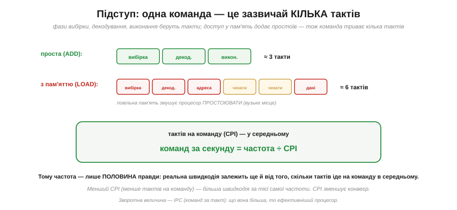
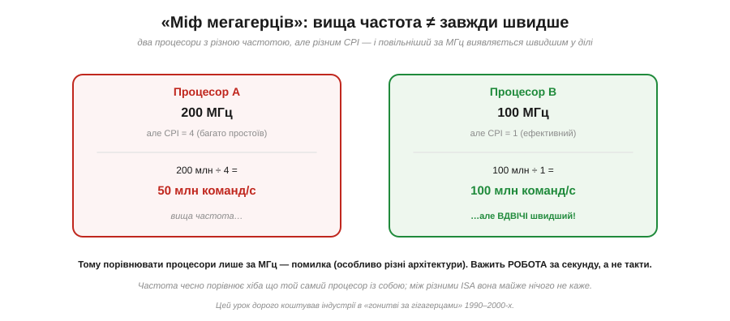
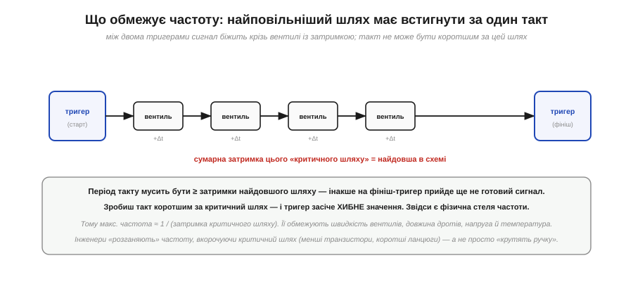
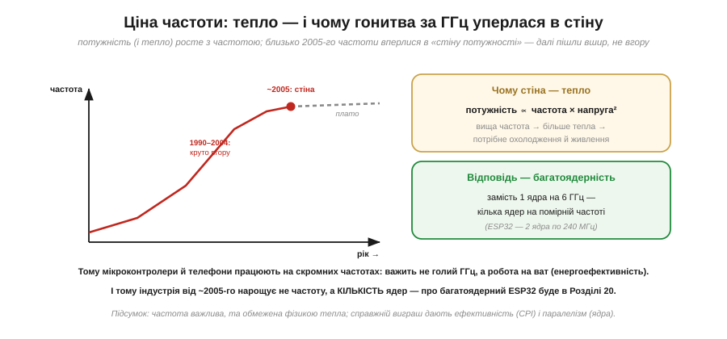

# Що означає «частота» процесора

«ESP32 на 240 МГц», «ПК на 4 ГГц» — частоту наводять усюди як головну міру швидкодії. Та що саме вона означає й чому це число оманливе? Процесор крутить [цикл вибірка-декодування-виконання](root:hw-arch/fetch-decode-execute), а рухає цей цикл [такт](root:hw-digital/clock-signal). Частота — це і є **темп такту**: скільки разів за секунду він цокає. Здавалося б, усе просто: більше тактів — швидше. Та за цією простотою ховається кілька важливих підступів, через які «мегагерци» легко обертаються міфом. Ця стаття — про те, що частота означає насправді, чому однакові МГц не означають однакову швидкість, що ставить фізичну стелю частоті й чому гонитва за гігагерцами зрештою вперлася в стіну, розвернувши всю індустрію.

### Частота — це такти за секунду

Почнімо з означення. Частота (*clock frequency*) — це кількість тактів процесора за секунду, виміряна в **герцах** (*Hz*).

*Тактовий сигнал рівномірно цокає; частота — скільки «зубців» уміщається в секунді. 1 Гц = 1 такт/с, 1 **кГц** = тисяча, 1 **МГц** = мільйон, 1 **ГГц** = мільярд тактів за секунду. Тож Arduino Uno на 16 МГц робить 16 мільйонів тактів щосекунди, ESP32 на 240 МГц — 240 мільйонів, а сучасний ПК на 3–5 ГГц — кілька мільярдів.*

Отже, «240 МГц» — це не якась абстрактна «потужність», а буквально **240 мільйонів цокань такту щосекунди**. І кожне цокання просуває серцебиття процесора на крок. Це й робить частоту такою привабливою мірою: більше тактів за секунду — швидше крутиться цикл, більше встигається. Усе так — але це лише **початок** правди.

### Швидший такт — більше обертів циклу

Спершу закріпімо просту, **правильну** частину інтуїції: за тієї самої логіки швидший такт справді робить більше роботи.

*За одну й ту саму секунду повільний такт устигає прокрутити цикл лише кілька разів (мало виконаних команд), а швидкий — багато (більше команд). Цикл той самий — різниться лише, скільки разів він обернувся. Звідси й уся гонитва за частотою: більше тактів за секунду = більше роботи.*

Це чесний бік медалі: якщо взяти **той самий** процесор і підняти йому частоту, він і справді працюватиме швидше — пропорційно. Саме тому розгін (overclocking) має сенс, і саме тому в налаштуваннях мікроконтролера ви можете обрати вищу частоту, щоб устигати більше (ціною тепла). Проблема починається, коли частоту намагаються використати для порівняння **різних** процесорів. Бо тут вилазить перший підступ.

### Підступ: одна команда — це кілька тактів

Найпоширеніша помилка — гадати, що один такт = одна команда. Це **не** так.

*Навіть проста команда (ADD) проходить кілька фаз — вибірка, декодування, виконання — і кожна бере такт-два. А команда з доступом у пам'ять (LOAD) ще й **простоює**, чекаючи на повільну пам'ять (класичне «вузьке місце»), тож триває ще довше. Середню кількість тактів на команду звуть **CPI** (*cycles per instruction*). Реальна швидкодія: **команд за секунду = частота ÷ CPI**.*

Ось і ключова поправка. Частота каже, скільки **тактів** за секунду, а не скільки **команд**. Щоб дістати команди, треба поділити частоту на **CPI** — середнє число тактів, яке йде на одну команду. Якщо процесор витрачає в середньому 4 такти на команду, то на 200 МГц він виконує лише 50 мільйонів команд за секунду, а не 200. CPI залежить від багато чого: від [набору команд (ISA)](root:hw-arch/isa), від того, як часто доводиться лазити в повільну пам'ять, від хитрощів самого процесора. (Зворотна величина — **IPC**, команд за такт: що вона більша, то ефективніший процесор. А зменшити CPI — змусити процесор робити більше за такт — дає [конвеєр](root:hw-arch/pipeline), що перекриває фази циклу.) Висновок простий: **частота — лише половина правди**; друга половина — скільки тактів іде на команду.

### Міф мегагерців

З цієї поправки випливає знаменитий **«міф мегагерців»**: вища частота не означає вищу швидкість.

*Процесор A працює на 200 МГц, але має CPI = 4 (багато простоїв) — отже, 200 ÷ 4 = **50 мільйонів** команд/с. Процесор B працює лише на 100 МГц, зате CPI = 1 (ефективний) — 100 ÷ 1 = **100 мільйонів** команд/с. Виходить, що B із **удвічі меншою** частотою працює **вдвічі швидше** за A! Бо важить не кількість тактів, а **робота** за секунду.*

Ось чому порівнювати процесори лише за мегагерцами — груба помилка, особливо коли архітектури різні. Частота чесно порівнює хіба що той самий процесор із собою (підняв МГц — пришвидшив). Між **різними** ISA вона майже нічого не каже, бо вони роблять різну кількість роботи за такт. Цей урок коштував індустрії дорого: у «гонитві за гігагерцами» 1990–2000-х виробники змагалися голими мегагерцами, аж поки не стало очевидно, що ефективний процесор на менших МГц б'є неефективний на більших. Справжня міра — **робота за секунду**, а не такти за секунду.

### Що ставить стелю частоті

А чому б тоді просто не задерти частоту до небес? Бо їй є **фізична** межа, і корінь її — у затримках цифрової логіки.

*Між двома тригерами сигнал біжить крізь ланцюг вентилів, і кожен додає свою [затримку поширення](root:hw-digital/edges-rise-time). Сума затримок найдовшого такого ланцюга — **критичний шлях**. Період такту мусить бути **не меншим** за цю затримку: інакше на тригер-фініш сигнал прийде, ще не «устоявшись», і тригер засіче **хибне** значення ([порушення setup-часу](root:hw-digital/metastability-timing)). Тому максимальна частота ≈ 1 / (затримка критичного шляху).*

Це глибока й важлива межа. Такт не можна вкорочувати безкінечно — бо логіці треба **фізичний час**, щоб сигнал пробіг крізь вентилі й устоявся ([ніщо не миттєве](root:hw-digital/edges-rise-time), а [дані мусять бути готові до фронту такту](root:hw-digital/metastability-timing)). Зробиш такт коротшим за критичний шлях — і процесор почне рахувати **сміття**, бо тригери ловитимуть ще не готові значення. Тому інженери підвищують частоту не «крутінням ручки», а **вкороченням критичного шляху**: меншими транзисторами (швидші вентилі), коротшими дротами, розбиттям довгих ланцюгів. А ще на стелю тиснуть напруга й температура — гарячий чип повільніший. Фізика не дає рахувати швидше за те, що встигає устоятися сигнал.

### Ціна швидкості: стіна потужності

І останній, найдраматичніший підступ. Навіть там, де фізика дозволяла б трохи вищу частоту, на заваді стає **тепло**.

*Споживана потужність (і тепло) росте з частотою — і навіть гірше, бо вища частота зазвичай потребує вищої напруги, а потужність пропорційна **частоті × напрузі²**. Десь близько 2005 року частоти процесорів уперлися в цю **«стіну потужності»**: далі підвищувати означало б нестерпний жар. Тому замість гнати один процесор до 6 ГГц індустрія розвернулася **вшир** — на кілька ядер помірної частоти (ESP32, наприклад, має 2 ядра по 240 МГц).*

Це поворотний момент в історії процесорів. Десятиліттями частоти стрімко росли — аж поки тепловиділення не зробило подальше зростання неможливим: чип почав би плавитися. І тоді стратегія змінилася: не швидше **одне** ядро, а **багато** ядер, що працюють паралельно на скромнішій частоті. Ось чому ваш телефон і ESP32 крутяться на «всього» сотнях мегагерців, а не гігагерцах: для них важить не голий ГГц, а **робота на ват** — енергоефективність, адже немає ні вентилятора, ні розетки, лише батарея. Багатоядерність — пряме породження стіни потужності, і саме тому навіть скромний мікроконтролер на кшталт [ESP32](root:hw-arch/esp32-architecture) несе кілька ядер.

> 🔧 **Навіщо це.** Розуміння частоти вбереже вас від типових хибних висновків і допоможе в реальних рішеннях. Перше: **не порівнюйте чипи лише за МГц** — питайте про роботу за секунду; 100 МГц-процесор з ефективним ядром може бити 200 МГц-неборака. Друге: на мікроконтролері ви часто **самі обираєте частоту** (ESP32 дозволяє знизити її, скажімо, з 240 до 80 МГц), і це прямий компроміс «швидкість проти тепла й батареї» — для задачі, де не треба поспішати, нижча частота економить енергію. Третє: коли прикидаєте, чи встигне ваш код (наприклад, обробити дані між [перериваннями](root:hw-arch/interrupts)), рахуйте не лише МГц, а **такти на команду** — звідси й реальний час. Четверте: пам'ятайте про **стіну потужності** — більше швидкодії сьогодні беруть не вищою частотою, а ефективністю й паралелізмом (ядрами); тож, проєктуючи систему, думайте не «який найвищий ГГц», а «скільки роботи на ват мені треба». Частота — корисна, та лише одна з кількох ручок, і далеко не завжди головна.
