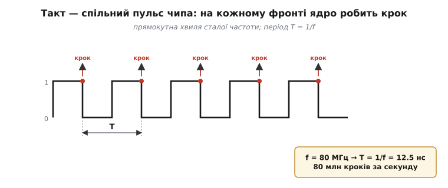
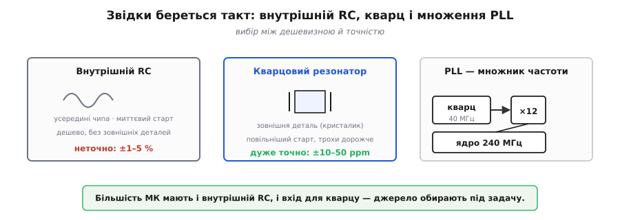
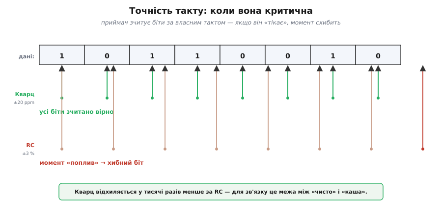
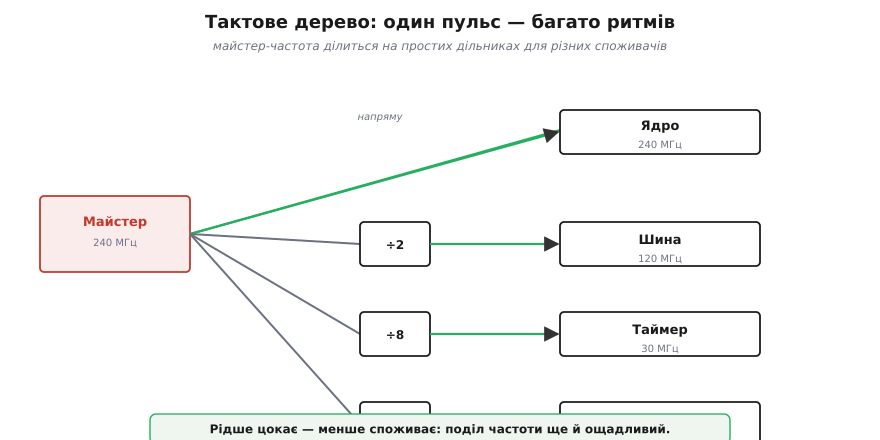
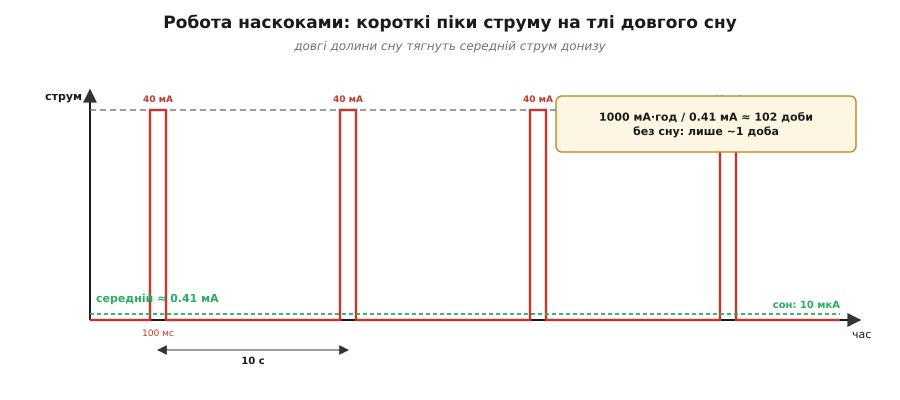

# Тактування й живлення

За лаштунками будь-якого мікроконтролера невпинно цокає **такт** — той пульс, що змушує ядро робити крок за кроком, а синхронну периферію — ловити ритм. Придивімося: **звідки** береться цей пульс, **чому** важлива його рівність і точність — і як із такту випливає друга, нерозлучна турбота вбудованого розробника: **живлення**. Адже МК часто працює від батарейки, а гнати пульс — означає палити енергію. Виявиться, що такт і живлення — два боки однієї монети, і найглибший спосіб заощадити струм — це **спинити такт**.

### Такт — спільний пульс чипа

Цифрова машина **синхронна** — усе в ній крокує разом, по фронтах одного [тактового сигналу](root:hw-digital/clock-signal). **Такт** (англ. *clock* — «годинник») — це проста прямокутна хвиля (меандр) сталої частоти: на кожному висхідному фронті ядро просувається на крок свого циклу «вибірка → виконання», а синхронні периферійні вузли роблять своє цокання.


*Тактовий сигнал — рівні прямокутні імпульси частотою f. Кожен висхідний фронт — команда «крок!» для всього чипа. Період T = 1/f: на 80 МГц один такт триває лише 12.5 нс. Частота й задає темп усієї машини — скільки кроків за секунду вона здатна зробити.*

Частота такту (у мегагерцах) — це, грубо, **темп життя** мікроконтролера: 80 МГц означає 80 мільйонів пульсів за секунду. Звідси й проста рівність, якою ви користуватиметеся постійно: **період T = 1 / f**. Що вища частота, то коротший крок і то більше ядро встигає — але тим більше й споживає, бо кожен пульс має свою ціну в струмі.

### Звідки береться такт: джерела

Сам пульс мусить хтось **народжувати** — і тут є вибір між точністю й дешевизною.

- **Внутрішній RC-генератор** (англ. *RC oscillator*, від назв елементів — резистор R і конденсатор C). Простий генератор на резисторі й конденсаторі, вбудований у сам чіп. Безкоштовний (жодних зовнішніх деталей), стартує миттєво, мало їсть — але **неточний**: його частота «плаває» від температури й напруги на відсотки. Годиться там, де точний час не критичний.
- **Кварцовий резонатор** (англ. *crystal oscillator*; від нім. *Quarz*). Зовнішній кристалик кварцу, що коливається на дуже точно визначеній частоті. Винятково **стабільний** (відхилення — лічені мільйонні частки), але коштує окремої деталі, повільніше запускається й трохи більше споживає. Його ставлять, коли час має бути точним — а саме [чому кварц тримає частоту так точно](root:hw-components/frequency-accuracy-ppm) розкриває окрема тема.
- **ФАПЧ / PLL** (англ. *phase-locked loop* — «петля фазового автопідстроювання»). Хитрий вузол, що **множить** низьку вхідну частоту до високої робочої. Скажімо, стабільний кварц на 40 МГц через PLL розганяється до 240 МГц для ядра. Так чіп дістає і **точність** дешевого низькочастотного джерела, і **швидкість** високої частоти.


*Три способи здобути такт. RC — усередині чипа, дешево й швидко, та неточно (плаває на відсотки). Кварц — зовні, дуже точно (мільйонні частки), та дорожче й повільніше на старті. PLL множить низьку опорну частоту до високої робочої — звідси «кварц 40 МГц → ядро 240 МГц». Більшість МК мають і RC, і вхід для кварцу, обираючи джерело під задачу.*

> 🔧 **Навіщо це.** Вибір джерела — інженерне рішення під задачу. Просто помиготіти світлодіодом чи покрутити мотор — досить внутрішнього RC, не паяючи нічого. А от тільки-но потрібен **точний час** — зв'язок із заданою швидкістю (де передавач і приймач мають збігатися), годинник, точні інтервали — ставлять **кварц**. Тому майже на кожній платі з МК ви побачите поряд маленький блискучий кристалик кварцу: це і є джерело точного пульсу.

### Старт із RC, перехід на кварц

У кварца є й вада: він **повільно розгойдується**. Щоб кристал вийшов на стабільну частоту, потрібні мілісекунди — ціла вічність для чипа, що робить мільйони кроків за ту саму мить. Внутрішній RC, навпаки, готовий **миттєво**. Тому багато МК стартують хитро: одразу по ввімкненні біжать на швидкому, хай і неточному, RC — щоб не марнувати час, — а коли кварц нарешті розгойдається й устабілізується, **на ходу перемикаються** на нього. Так чіп дістає і миттєвий старт, і точність у роботі. Цей перехід зазвичай робить [завантажувач](root:hw-arch/bootloader) ще до вашого коду, тож на практиці ви просто отримуєте вже точний такт. Але знати про двоступеневий старт корисно, коли налагоджуєте дивні збої в перші мілісекунди після подачі живлення.

> 🔌 **Кварц як деталь на платі.** Як його фізично під'єднують (дві ніжки й навантажувальні конденсатори), що таке ppm і чому в ESP32 він саме на 40 МГц — у вставці [Кварц на платі](root:hw-arch/clock-power/comp-crystal.md).

### Чому стабільність такту важлива

Чому ж не завжди вистачає дешевого RC? Бо багато чого в МК **звіряється з тактом**, як із годинником, — і якщо годинник бреше, валиться все, що на нього спиралося.

Найболючіше це у **зв'язку**. Коли два пристрої обмінюються даними із заданою швидкістю, кожен відлічує біти **за власним тактом**. Якщо такти розійшлися надто далеко, приймач «зчитує» біти не в ті моменти — і потік перетворюється на кашу. Так само **відлік часу** (годинник, точні інтервали) накопичує похибку: неточний такт за добу «втече» на хвилини. А ось миготіння світлодіода чи груба затримка переживуть будь-яку похибку такту — оку байдуже до відсотка.


*Та сама похибка — різні наслідки. Кварц відхиляється на ~20 мільйонних часток (ppm), RC — на відсотки, тобто в тисячі разів гірше. Для зв'язку на заданій швидкості це межа між «дані пройшли чисто» і «суцільна каша» (праворуч приймач схибив момент зчитування). Для миготіння світлодіода ж — байдуже. Точність такту купують рівно там, де вона потрібна.*

Числами: типовий кварц відхиляється на **10–50 ppm** (мільйонних часток — тобто стотисячні відсотка), а внутрішній RC — на **1–5 %**, у тисячі разів гірше. Тому правило просте: терпить задача неточність — бери RC; ні — став кварц.

Щоб відчути цю різницю на годиннику: похибка 1 % означає втечу часу на **~14 хвилин за добу** (1 % від 1440 хв) — за тиждень це вже півтори години розбіжності. Кварц на 20 ppm за ту саму добу схибить лише на **~1.7 секунди**. Ось чому будь-який реальний годинник — від наручного до того, що в МК веде календар, — цокає саме від кварцу, а дешевий RC лишають задачам, де хвилини туди-сюди байдужі.

### Тактове дерево: один пульс, багато ритмів

У чипі не все мусить крокувати в одному темпі. Зазвичай один **майстер-генератор** дає високу частоту, а далі вона **ділиться** на простих дільниках (англ. *prescaler* — «попередній дільник») для різних споживачів: ядро — на повній швидкості, повільна периферія — на поділеній удесятеро, ще щось — на сотій частці. Виходить **тактове дерево** (англ. *clock tree*): від одного кореня-джерела розгалужуються гілки різних частот.


*Один корінь — багато ритмів. Майстер-частота йде на ядро напряму (повна швидкість), а до периферії — крізь дільники (÷2, ÷8, ÷64…), бо їй стільки не треба. Поділити частоту легко (лічильник), і це ще й ощадніше: вузол, що цокає рідше, менше споживає. Звідси й налаштування «частоти периферії» в коді — це вибір дільника на її гілці дерева.*

> 🧮 **Порахувати дерево.** Звідки беруться самі числа — як PLL множить 40 МГц кварцу до 480, а дільники роблять 240 МГц ядру й 80 МГц шині — з формулами й прикладом у вставці [Дерево тактування: PLL і дільники](root:hw-arch/clock-power/math-clock-tree.md).

### Живлення: чому МК має спати

Є й другий бік монети. Кожен пульс такту коштує **енергії**: на кожному фронті крихітні [CMOS-ключі](root:hw-digital/cmos) всередині чипа перемикаються, і кожне перемикання спалює дещицю заряду. Звідси груба, але важлива залежність: динамічне споживання зростає **з частотою такту й квадратом напруги живлення** (P ∝ f · V²). Простими словами: що швидше женеш чіп і що вища напруга — то більше він їсть.

Для пристрою від мережі це дрібниця. Але МК **часто живиться від батарейки** — і має протягнути місяці, а то й роки. Тоді важить кожен мікроампер, і постає питання: як рахувати **по краплі**? Перша відповідь напрошується — гнати ядро не швидше, ніж треба. Та головний важіль інший і набагато потужніший: **спати**.

### Режими сну: вимикаємо те, що не потрібно

Ключова ідея економії — **спинити такт** там і тоді, де він зараз не потрібен. Адже спинений вузол майже не споживає. На цьому й побудовані **режими сну** (англ. *sleep modes*) — сходинки від повної активності до глибокого заціпеніння:

- **Активний** (англ. *active*): усе працює на повну, повне споживання.
- **Легкий сон** (англ. *light sleep*): такт ядра **зупинено** (ядро завмерло), але периферія й пам'ять живі; прокидається миттєво, тільки-но станеться подія. Споживання вже помітно менше.
- **Глибокий сон** (англ. *deep sleep*): вимкнено майже все — такти спинено, більшість пам'яті знеструмлено (виживає хіба крихітна «комірка пам'яті стану»); жевріє лише дрібний маловитратний вузол, здатний розбудити чіп. Споживання — мікроампери, але прокидання повільніше, і більшість стану втрачено.


*Сходинки від активності до глибокого сну. Що нижче — то більше вузлів знеструмлено, то менше споживання (від міліампер до мікроампер), але то повільніше прокидання й то більше втраченого стану. Активний — усе живе; легкий сон — спить ядро, периферія напоготові; глибокий сон — живий лише будильник. Розробник свідомо обирає, як глибоко занурити чіп між нападами роботи.*

Прокинути МК зі сну може **подія**: сигнал на ніжці (натиснули кнопку, давач смикнув), спрацював маловитратний таймер-будильник або надійшли дані. Звідси й рецепт довгого життя від батареї — **робота наскоками** (англ. *duty cycling* — «робота за шпаруватістю»): чіп спить ~99 % часу, прокидається на коротку мить зробити справу — виміряти, надіслати — і знову засинає. Саме так давачі й живуть місяцями на одній батарейці.

Як **глибоко** занурювати чіп — вирішує **частота пробуджень**. Треба реагувати часто й миттєво (стежити за швидкою шиною) — обирають легкий сон: економія менша, зате прокидання без затримки й без втрати стану. Треба прокидатися зрідка (виміряти раз на десять хвилин) — глибокий сон: максимальна економія варта і повільнішого старту, і клопоту зі збереженням дрібки стану в комірці, що пережила сон.

> 🔧 **Навіщо це.** Найголовніший важіль автономності — **не** потужніший процесор і не більша батарея, а **сон**. Пристрій, що весь час активний, з'їсть батарейку за день; той самий пристрій, що 99 % часу спить, протягне місяці — на тій самій батарейці. Тому архітектуру вбудованої програми часто будують навколо питання «як швидше зробити справу й заснути назад», а не «як завантажити ядро».

### Не лише сон: знизити частоту й вимкнути зайве

Сон — найпотужніший важіль, та не єдиний. Із тієї ж залежності P ∝ f · V² випливають ще два прийоми, і обидва спираються на **тактове дерево**.

Перший — **знизити частоту**, коли повна швидкість не потрібна. Ядро, що тимчасово не поспішає, переводять на нижчий такт (а часом і нижчу напругу) — і споживання падає пропорційно. Це **масштабування частоти** (англ. *frequency scaling*): не «завжди на максимумі», а «рівно стільки, скільки треба зараз».

Другий — **вимкнути такт непотрібним вузлам** (англ. *clock gating* — «перекриття такту»). Якщо АЦП чи інтерфейс зв'язку зараз не працює, навіщо йому цокати? Перекривши такт на його гілці тактового дерева, ви майже занулюєте споживання цього вузла, не чіпаючи решту чипа. Саме тому периферію часто треба спершу явно «увімкнути» в коді (подати на неї такт): за замовчуванням вона мовчить, щоб не палити струм.

> 🔧 **Навіщо це.** Три важелі економії — **сон**, **нижча частота** й **вимкнений такт зайвому** — складають справжню «дисципліну живлення» вбудованого розробника. Найбільший виграш дає сон; та коли пристрій мусить бути активним, у пригоді стають інші два: не жени ядро швидше за потребу й не лишай цокати те, чим зараз не користуєшся.

### Порахуймо: скільки протягне на батарейці

Той самий важіль легко перевести в числа — це і є арифметика, яку роблять, проєктуючи автономний пристрій.

**Приклад (життя від батареї з duty cycling).** Давач прокидається на **100 мс** кожні **10 с**, щоб виміряти й надіслати. В активну мить він бере **40 мА**, а уві сні — лише **10 мкА** (0.01 мА). Живлення — елемент на **1000 мА·год**. Скільки протягне — і що дав би сон проти «завжди ввімкнено»?

```
частка активного часу = 0.1 с / 10 с = 0.01  (1 %)

середній струм:
  активно:  0.01 × 40 мА    = 0.400 мА
  уві сні:  0.99 × 0.01 мА  = 0.0099 мА
  разом                     ≈ 0.41 мА

життя = 1000 мА·год / 0.41 мА ≈ 2440 год ≈ 102 доби  (~3.4 місяця)

а якби чіп НЕ спав (завжди 40 мА):
  життя = 1000 / 40 = 25 год ≈ 1 доба
```


*Струм у часі за duty cycling. Високі вузькі піки (40 мА, активна мить) розділені довгими низькими долинами сну (10 мкА). Площа під кривою — спожитий заряд; завдяки тому, що долини довгі, а піки вузькі, середній струм (пунктир) виходить крихітним. Той самий пристрій без сну — суцільна висока лінія, що осушує батарею в сотні разів швидше.*

Різниця приголомшлива: сон перетворив **одну добу** на **три з гаком місяці** — у сотню разів довше, на тій самій батарейці. Ось чому сон — це не «приємний бонус», а **серце** будь-якого автономного пристрою.

Такт і живлення — спільна для всіх мікроконтролерів основа: джерело пульсу задає ритм усій машині, а сон зі своїми трьома важелями (спинений такт, нижча частота, вимкнені зайві гілки) вирішує, скільки вона протягне від батареї. На цю спільну картину лягають уже конкретні чипи — приміром, [архітектура ESP32](root:hw-arch/esp32-architecture) з її двома ядрами, багатою периферією і радіо на тому самому кристалі.

---
