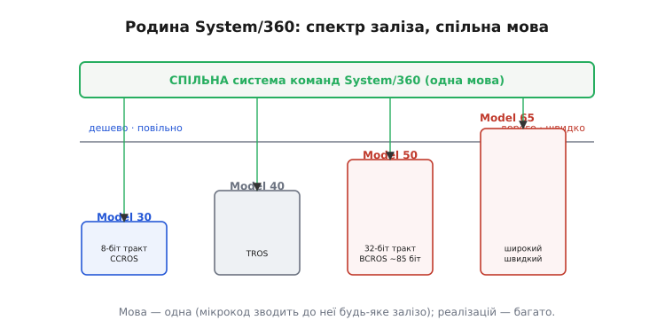

# 📜 Як мікрокод дав IBM System/360 сімейну сумісність

7 квітня 1964 року IBM зробила обіцянку, що на слух звучала як обман. Того дня вона оголосила не одну машину, а цілу лінійку — **System/360**, — і сказала клієнтам таке: візьміть найдешевшу, найповільнішу модель, напишіть під неї програму; коли ваш бізнес виросте й вам знадобиться машина вдесятеро потужніша, ви **перенесете ту саму програму без жодної переробки**, бо старша модель розуміє точнісінько ту саму мову. Різні за ціною в багато разів, різні за швидкодією ще дужче, зібрані з геть неоднакового заліза — а поводяться так, ніби це один і той самий комп'ютер.

Щоб відчути, наскільки це зухвало, треба знати, як робили машини до того. Кожна нова модель була **окремим витвором**: свій набір команд, свій формат чисел, своя купа дротів у керуванні. Програму, писану під одну, під іншу доводилося переписувати мало не з нуля. І це вважалося природним — адже як інакше? Швидка машина потребує широких трактів даних, повільна й дешева мусить обходитися вузькими; а якщо начинка різна, то й «мова» виходить різна. Здавалося, що спільний набір команд для дешевої й дорогої машини — це вимога, яка сама собі суперечить.

Розв'язати цю суперечність дав змогу один прийом, і прийом цей був не новий. Його за тринадцять років до того придумав [англійський інженер Морріс Вілкс](root:hw-arch/control-unit/hist-microprogramming.md): пристрій керування можна не запікати в дроти, а зробити крихітним комп'ютером усередині процесора, що читає свою програмку — мікрокод — з окремої швидкої пам'яті. Вілкс придумав це, щоб **приборкати заплутаність** керувальних схем. IBM узяла той самий прийом і повернула його зовсім іншим боком — як інструмент **сумісності**. І саме в System/360 мікрокод із кабінетної ідеї став наріжним каменем найуспішнішої лінійки комп'ютерів свого часу.

> 🔧 **Навіщо це.** Це той самий фокус, яким живе вся сучасна індустрія процесорів. Коли Intel випускає дешевий Celeron і дорогий Xeon, що виконують **однакові** програми x86, — це прямий нащадок System/360: спільна архітектура зверху, різні реалізації знизу, і місток між ними — мікрокод. Зрозумівши, як це зробили вперше, ти розумієш, чому взагалі можливо купити «слабший» і «потужніший» процесор однієї родини й гнати на обох той самий код.

## Суперечність, яку треба було розв'язати

Розкладімо задачу IBM до самого дна, бо тільки так видно, чому мікрокод ліг сюди як ключ у замок.

Набір команд — це **домовленість**. Коли програма каже машині «додай ось ці два 32-бітні числа», вона надсилає число-опкод, а машина мусить це число розтлумачити й виконати додавання над повними 32 бітами. Домовленість System/360 була багата: 32-бітні слова, десятки типів команд, робота з десятковими числами, з рядками змінної довжини. Ось у чому пастка. **Дорога** машина може дозволити собі суматор одразу на всі 32 біти — подав два числа, за один прохід дістав суму. **Дешева** машина такого суматора не потягне за ціною: широкий тракт даних — це багато вентилів, а вентилі коштують грошей. Дешева машина муситиме мати тракт вузький — скажімо, байтовий, на 8 бітів.

І тут постає питання, яке здається безвиході. Якщо в дешевої моделі всередині лише 8-бітний суматор, **як вона взагалі виконає команду додавання 32-бітних чисел**? Заліза для цього в ній фізично немає. За старим підходом відповідь була б: ніяк — це буде інша машина з іншим, біднішим набором команд. Саме через це раніше й не існувало спільної мови для дешевого й дорогого: бідне залізо не могло безпосередньо виконати багаті команди.

Мікрокод розрубує цей вузол одним поворотом думки. Набір команд задається **не тим, що залізо вміє напряму, а тим, що написано в сховищі мікрокоманд**. Багату 32-бітну команду не обов'язково виконувати одним махом широким суматором — її можна **розкласти на послідовність дрібних дій** над вузьким трактом і записати цю послідовність мікропрограмою. Дешева машина тоді **вдає** (англ. *emulate*, «наслідувати») повний 32-бітний набір команд, хоча всередині перемелює його байт за байтом. Зверху видно багату мову System/360; знизу — скромне залізо, що терпляче відпрацьовує довгий мікрокод. Домовленість жива, хоча її носій бідний.

*Та сама команда на двох різних трактах. Обидві моделі мусять виконати одне: `A(32) + B(32) → S(32)`. **Model 30** (ліворуч) має лише 8-бітний суматор, тож її мікропрограма проганяє додавання **чотирма проходами** — байт за байтом, тягнучи перенос між ними; мікропрограма виходить довга, команда — повільна. **Model 50** (праворуч) має суматор одразу на 32 біти, тож та сама команда — це **один прохід** за куди коротшою мікропрограмою, ще й з окремим байтовим рушієм, що працює паралельно. Зверху обидві показують однакову поведінку; різниця в тому, скільки тактів мікрокоду це коштує. Саме мікрокод дає змогу бідному залізу чесно виконати багату команду.*

## Model 30: найбідніша машина, що вдає найбагатшу мову

Візьмімо найнижчу модель родини з повним набором команд — **Model 30**. Вона була найдешевша й найповільніша, і саме на ній фокус видно найгостріше.

Усередині Model 30 — **8-бітний тракт даних** і жменька апаратних регістрів. Це вся її арифметична потуга: вона вміє за раз додати два байти, не більше. А зверху вона зобов'язана показувати **повний 32-бітний набір команд System/360** — з усіма його словами, адресами, десятковою арифметикою. Як? Усе, що бачить програміст, — **емуляція мікрокодом**. Кожна 32-бітна операція всередині розкладається на низку 8-бітних кроків: щоб додати два 32-бітні числа, мікропрограма робить чотири проходи по байту, від молодшого до старшого, щоразу протягуючи [перенос](root:hw-digital/binary-arithmetic) у наступний прохід. Програма ззовні бачить одну команду «додай слова»; усередині це довгий ланцюжок мікрокоманд, що терпляче збирає результат байт за байтом.

Мікрокод Model 30 лежав у сховищі під назвою **CCROS** (англ. *Card Capacitor Read-Only Storage* — «конденсаторне сховище на картках»): мікропрограму записували на майларових картках розміром зі звичайну перфокарту, і всього там було **4032 слова по 60 бітів**. Прикметна дрібниця, що добре передає дух епохи: правити цей мікрокод можна було мало не перфоратором — картку з мікрокодом фізично перебивали. Керування справді стало редагованим носієм, як і обіцяв здогад Вілкса, — тільки носій був паперовий.

Ось де ховається чесна ціна прийому. За універсальність Model 30 платила **швидкістю**. Одна 32-бітна команда, що на широкій машині — один прохід, тут розтягувалася на кільканадцять тактів мікрокоду. Але саме ця повільність і робила машину **дешевою**, а отже доступною тим, кому потужність була не потрібна. Клієнт діставав повну мову System/360 за малі гроші, розуміючи, що працюватиме воно неквапом. Мікрокод перетворив «неможливо» на «повільно, зате дешево» — а це вже питання ціни, яке кожен вирішує сам.

## Model 50 і широке керувальне слово

Тепер підіймімося на кілька щаблів угору — до **Model 50**, машини середньо-старшого класу. Її нутрощі геть інакші: **32-бітні регістри, 32-бітна шина пам'яті й 32-бітний суматор**, та ще й окремий байтовий рушій (англ. *mover*), що вміє совати байти паралельно з роботою суматора. Та сама 32-бітна команда, що на Model 30 крутилася чотирма проходами, тут виконується одним — тож і мікропрограма коротша, і команда прудкіша. Мова та сама, реалізація багатша: рівно те, за що клієнт доплачував.

Але Model 50 цікава не лише ширшим трактом. Вона показує **другу вісь** усередині мікропрограмування — те, наскільки «широка» сама мікрокоманда. Мікрокод Model 50 був **горизонтальним** (англ. *horizontal microcode*): це означає, що керувальне слово тримало **майже по окремому біту на кожну керувальну лінію процесора**, щоб кількома вузлами машини можна було правити **водночас**, за один такт. Що ширше слово — то більше речей мікрокоманда встигає скомандувати одночасно, то швидше йде робота.

І тут варто назвати точну міру, бо навколо неї є плутанина, яку чесніше пояснити, ніж замовчати. Кожна мікрокоманда Model 50 фізично була словом на **90 бітів** (сховище BCROS зберігало слова по 100 бітів, але задіяно було 90), і з цих бітів **близько 85** несли власне керування — розкладені на кільканадцять полів, майже по біту на кожен можливий вузол; решта припадала на контроль парності. Тож коли кажуть про **керувальне слово на 85 бітів**, мають на увазі саме змістову, керувальну частину; коли про 90 — усе фізичне слово разом зі службовими бітами. Обидва числа правдиві, просто рахують різне.

Порівняй це з нутром Model 30, і проступає закономірність. Дешева машина економила на всьому — і на ширині тракту, і на розмаху мікрокоманди. Дорожча Model 50 витрачалася і там, і там: широкий тракт даних **плюс** широка мікрокоманда, що жене той тракт на повну. Та сама угода «швидкість проти вартості» повторюється на двох рівнях одразу — і в тому, скільки бітів обробляє суматор, і в тому, скільки ліній вмикає одна мікрокоманда. Багатша модель платить більше на обох рівнях і за це отримує швидкість, лишаючись у межах тієї самої спільної мови.

## Родина як спектр, і чому найшвидша модель випала з правила

Тепер відступімо на крок і подивімося на всю лінійку разом. System/360 була **спектром**: від крихітної Model 30 через середні Model 40 і Model 50 до потужних старших моделей. Уздовж усього спектра — одна вісь: **дешевше й повільніше ↔ дорожче й швидше**. І над усім спектром — **одна спільна мова**, той самий [набір команд](root:hw-arch/isa). Кожна модель мала своє залізо й своє сховище мікрокоду, але мікрокод зводив те залізо до тієї самої мови команд.

*Родина як спектр заліза під спільною мовою. Унизу — вісь потужності: **Model 30** (8-бітний тракт, CCROS) стоїть на дешевому й повільному краю, далі **Model 40**, **Model 50** (32-бітний тракт, BCROS, керувальне слово ~85 бітів), **Model 65** — до дорогого й швидкого. Угорі — **спільна система команд System/360**, одна для всіх. Кожна модель тягне цю мову зі свого сховища мікрокоду: реалізацій багато, а мова одна. Саме мікрокод робить цю картину можливою — без нього кожна модель була б окремою машиною з окремою мовою.*

Було б охайно сказати «усі моделі мікрокодовані» — але правда цікавіша, і вона додає до розуміння, а не віднімає. Мікрокодована була **майже вся** родина: Model 30, 40, 50, 65 і більшість інших читали свій набір команд зі сховища мікрокоманд. А от на **самому вершечку** лінійки прийом свідомо **не застосували**. Найпотужніші моделі — зокрема Model 75, що стала флагманом серед перших машин, — мали керування **зашите в дроти**, без жодного мікрокоду.

Чому саме там від мікрокоду відмовилися — питання, у відповіді на яке весь сенс компромісу. Мікрокод коштує **одного зайвого такту на читання кожної мікрокоманди** зі сховища. Для дешевої машини це дрібниця на тлі виграної універсальності. Але на флагмані, де борються за кожен відсоток швидкодії й де гроші на широку зашиту логіку є, цей зайвий такт стає нестерпним податком. Тому на вершині лінійки IBM могла собі дозволити **запаяти** повний набір команд у вентилі однієї машини — швидше, дорожче, без гнучкості. Виходить красива симетрія: **мікрокод дав сумісність усій родині, а на самій вершині від нього відмовилися саме тому, що там швидкодія переважила гнучкість**. Той самий розмін, що керує всім мікропрограмуванням, тут видно у виборі, які моделі родини зробити так, а які інакше.

## Що народила ця родина

Найглибший спадок System/360 — не конкретні машини, а **поняття**, яке вона вкоренила: чітка межа між **архітектурою** й **реалізацією**.

До System/360 «набір команд» і «схема машини» були майже одне й те саме — мова машини була тим, що дозволяли її дроти. System/360 розірвала цей зв'язок буквально фізично: **архітектура** (набір команд, формати, поведінка — те, що бачить програміст) відтепер жила окремо від **реалізації** (заліза, трактів, швидкодії — того, як це втілено в кожній моделі). Одна архітектура — багато реалізацій, а місток між ними — мікрокод. Саме звідси й пішов сам термін «архітектура набору команд» ([ISA](root:hw-arch/isa)) як щось окреме від конкретного кристала. Ідея, без якої сьогодні не мислиться жоден процесор, — що ти можеш узяти документ на архітектуру й втілити його як завгодно, аби зовні поведінка збіглася, — визріла й довела свою вартість саме тут.

Це саме та думка, що працює нині щодня. Коли [оновлення мікрокоду](root:hw-arch/microcode) виправляє апаратну хибу вже проданого процесора, не міняючи кристал; коли одну архітектуру x86 втілюють десятки різних за ціною й швидкістю чипів; коли інженери сперечаються, зашивати команду в логіку заради швидкості чи лишати мікрокоду заради гнучкості, — усе це прямі нащадки того, що IBM зробила 1964 року. Здогад Вілкса дав інструмент; System/360 показала, на що він здатен, коли повернути його боком сумісності.

**Статус доказовості.** Усе тут — усталений факт, підтверджений незалежними джерелами. Дата оголошення System/360 (7 квітня 1964 року), 8-бітний тракт Model 30 з емуляцією повного 32-бітного набору команд мікрокодом і його сховище CCROS (4032 слова по 60 бітів), 32-бітний тракт Model 50 з горизонтальним мікрокодом, авторство самої ідеї мікропрограмування за Морісом Вілксом (1913–2010) — усе це збігається в кількох джерелах. Єдине, що вимагає точності, — ширина керувального слова Model 50: 90 бітів фізичного слова, з яких близько 85 несуть керування, а решта — парність; тож числа «85» і «90» не суперечать одне одному, а рахують різні частини того самого слова. Так само варто чесно тримати в голові, що мікрокодована була майже вся родина, але не поголовно: найпотужніші моделі (зокрема Model 75) мали зашите керування — і це не виняток-курйоз, а прямий наслідок того самого компромісу «швидкість проти гнучкості».
