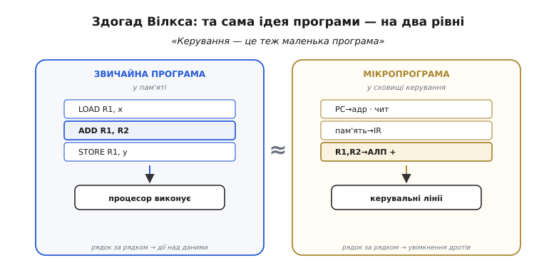
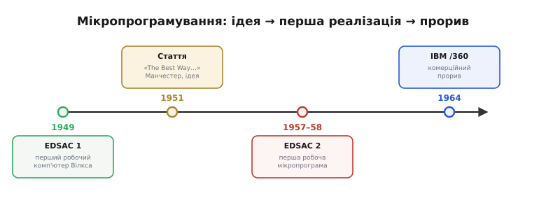

# 📜 Як народилося мікропрограмування

Уяви інженера кінця сорокових, що сидить над схемою першого комп'ютера. Арифметику він уже приборкав — суматор, регістри, лінії пам'яті лягли в креслення досить охайно, бо кожен з цих вузлів робить одну зрозумілу річ. А тоді він береться за той блок, що має **керувати** рештою: на кожну команду в потрібному порядку вмикати правильні дроти — подати ці регістри на суматор, увімкнути додавання, за такт защіпнути результат, а на іншу команду зробити геть інакше. І схема раптом перетворюється на болото. Сотні дротів, кожен веде до кількох вентилів, кожен вентиль залежить від опкоду й від того, який зараз крок усередині команди. Змінив одну команду — попливло пів схеми. Саме це болото й породило мікропрограмування; щоб зрозуміти ідею, спершу треба відчути, наскільки нестерпним був той безлад.

## Що саме бентежило: керування було найбруднішою частиною

Порахувати — легко. Дати команду «порахуй саме це, саме зараз, а результат поклади саме сюди» — важко. У цьому весь парадокс ранніх машин, і його варто відчути буквально, а не як загальну фразу.

Керувальний блок ранньої машини будували **напряму з логічних вентилів під конкретний набір команд**. Кожен окремий керувальний сигнал — «увімкни в суматорі додавання», «защіпни в регістр R3», «виставь адресу на шину» — виражали булевою формулою: цей сигнал піднімається тоді, коли опкод такий-то **і** зараз такий-то крок усередині команди **і** прапорець такий-то. Таких сигналів десятки, у кожного своя формула, а формули переплетені між собою, бо той самий дріт бере участь у багатьох командах по-різному. Виходила густа сітка [комбінаційної логіки](root:hw-digital/combinational-circuits) плюс [автомат](root:hw-digital/finite-state-machines), що рахує кроки, — і вся вона застигала в конкретних паяних з'єднаннях.

> 🔧 **Навіщо це.** Логіка, що напряму зіставляє опкод із сигналами, — це [комбінаційна схема](root:hw-digital/combinational-circuits): сітка вентилів, де кожен вихід є булевою функцією від бітів входу, а результат з'являється за один прохід крізь вентилі, без пам'яті й без тактів. Порядок кроків усередині команди задає [скінченний автомат](root:hw-digital/finite-state-machines) — схема з пам'яттю стану, що на кожен такт переходить у наступний стан. Разом вони й складали «зашите» керування, з яким мучилися перші конструктори.

Три речі робили цей підхід нестерпним, і вони випливають одна з одної.

**Помилку не виправити м'яко.** Знайшовся дефект у поведінці якоїсь команди — і лагодити доводиться саму логіку: перерозвести дроти, переставити вентилі, а на ранніх машинах ще й фізично перепаяти. Немає жодного «м'якого» шару, який можна підправити, не чіпаючи заліза.

**Складну команду страшно додавати.** Кожна нова команда — це нові гілки в тих переплетених формулах, тож додавання однієї здатне порушити рівновагу багатьох сусідніх. Через це набір команд ранніх машин тримали бідним не тому, що більше було не треба, а тому, що більше **боялися** — керувальна логіка й так балансувала на межі керованості.

**Складність зростала швидше за користь.** Що багатший набір команд, то густіша сітка, то важче в ній розібратися й довести, що вона правильна. Керування розросталося не лінійно, а вибухово, і ставало найненадійнішою частиною машини — тією, де найлегше було припуститися помилки й найважче її знайти.

Ось де народилася потреба. Не «як зробити керування швидшим» — воно й так було швидке, сигнал біг крізь вентилі майже миттєво. Потреба була інша: **як зробити його охайним і виправним**, як приборкати заплутаність, що душила конструктора. І відповідь, яка згодом усе змінила, прийшла від людини, що дивилася на цю проблему збоку — не як схемотехнік, а як людина, що вже написала перші у світі програми.

## Хто: Морріс Вілкс, людина, що будувала й програмувала

Морріс Вінсент Вілкс (англ. Maurice Vincent Wilkes, 26 червня 1913 — 29 листопада 2010) був англійцем із міста Дадлі в англійському Мідленді. За освітою математик — закінчив Коледж Святого Йоана в Кембриджі, докторат здобув у тамтешній Кавендішській лабораторії, — але змалку захоплювався електронікою, тож поєднував у собі рідке на ті часи: людину, що однаково добре розуміла й математичну суть обчислень, і фізику дротів та вентилів.

Це поєднання й виявилося ключовим. 1946 року Вілкс прочитав знаменитий звіт Джона фон Неймана про машину EDVAC і **переконався, що всі майбутні комп'ютери будуть машинами зі збереженою програмою** — тобто такими, де сама програма лежить у пам'яті поряд із даними. Повертаючись пароплавом додому, він почав проєктувати власну таку машину й дав їй назву EDSAC (англ. *Electronic Delay Storage Automatic Calculator* — електронний автоматичний обчислювач із затримною пам'яттю). 6 травня 1949 року EDSAC ожив — один із перших у світі практичних комп'ютерів зі збереженою програмою, що реально працював на щоденних задачах, а не лишався дослідним стендом.

Далі Вілкс зробив вибір, що визначив його погляд на все подальше. Він вирішив, що його лабораторія спеціалізуватиметься радше на **програмуванні**, ніж на будуванні дедалі нових машин. 1951 року вийшов перший у світі підручник з програмування — «The Preparation of Programs for an Electronic Digital Computer», який за трьома авторами (Вілкс, Девід Вілер, Стенлі Ґілл) знали просто як «Wilkes, Wheeler and Gill». Тобто на момент, коли Вілкс узявся думати про керувальну логіку, він уже роками дивився на світ очима **програміста** — людини, що звикла складати складну поведінку з простих кроків, записаних послідовно. Саме цей кут зору й підказав здогад, до якого схемотехнік навряд чи дійшов би.

## Здогад: керування — це теж маленька програма

Поштовх прийшов ззовні. Вілкс побував у Массачусетському технологічному інституті й побачив там машину Whirlwind, а в її керуванні — **діодну матрицю** (англ. *diode matrix*): решітку з діодів, де перетини задавали, які лінії піднімати. І тут його програмістський погляд зчепився з побаченим у той момент, коли дві звички думки збіглися.

Він помітив просту, але глибоку річ. Те, що робить керувальний блок усередині машини — **у певному порядку виставляє послідовність наборів сигналів**, крок за кроком проводячи команду до кінця, — за формою анітрохи не відрізняється від того, що робить звичайна програма: у певному порядку виконує послідовність дій, крок за кроком. Керування, по суті, **саме виконує маленьку програму** — тільки її «команди» керують не даними, а дротами всередині процесора.

А якщо це програма — навіщо запікати її в дроти? Її можна **покласти в пам'ять**, точнісінько як звичайну.

Ось у чому суть здогаду, і варто розкласти його до самого дна. Заведімо окрему невелику надшвидку пам'ять — **сховище керування** (англ. *control store*). Складімо в неї рядки; кожен рядок — це **мікрокоманда** (англ. *microinstruction*), і влаштована вона гранично прямо: кожен її біт напряму відповідає одній керувальній лінії процесора. Біт стоїть — лінія піднята цього такту; біт нуль — лінія опущена. Послідовність таких рядків для однієї «великої» машинної команди — це її **мікропрограма** (англ. *microprogram*). Виконати машинну команду тепер означає не «прогнати опкод крізь застиглу сітку вентилів», а **прочитати її мікропрограму рядок за рядком** і на кожному такті виставити біти чергового рядка прямо на керувальні лінії.


*Здогад Вілкса на одному рисунку. **Ліворуч** — звичайна програма в пам'яті: рядок за рядком машинні команди (`LOAD`, `ADD`, `STORE`) кажуть процесорові, що робити з даними. **Праворуч** — та сама ідея, опущена на рівень нижче: у сховищі керування лежить мікропрограма, і її рядки-мікрокоманди так само по черзі кажуть уже самому керуванню, які дроти вмикати цього такту. Керувальний блок виявився не заплутаною сіткою вентилів, а крихітним комп'ютером, що виконує власну програмку. Аналогія точна доти, доки пам'ятаєш межу: мікропрограма живе в окремій надшвидкій пам'яті й нею не «стрибають» довільно, як звичайним кодом, — це радше жорстка табличка кроків, ніж повноцінна мова.*

Що це дало — видно одразу, щойно порівняти з болотом, з якого починали. Набір команд машини тепер заданий **не дротами, а вмістом пам'яті**. Складну команду додати легко: припиши їй нову мікропрограму — ще кілька рядків у сховищі, — не чіпаючи ані вентиля на кристалі. Помилку в поведінці команди виправити легко: перепиши її мікропрограму. Уся та заплутана булева алгебра переплетених формул звелася до **охайної таблиці**, яку можна читати, перевіряти й правити як текст. Болото перетворилося на список.

Ціна теж зрозуміла, і Вілкс її не приховував. За кожен такт тепер треба **прочитати чергову мікрокоманду зі сховища** — а це зайва дія, якої в зашитій логіці не було, бо там сигнал з'являвся прямо на виході вентилів. Тож мікропрограмне керування виходить трохи повільнішим за зашите. Це і є той вічний розмін, що живий досі: **зашите — швидко, але жорстко; мікропрограмне — гнучко, але ціною такту**. Вілкс свідомо вибрав гнучкість там, де вона важила більше за останні відсотки швидкодії.

Тут криється й глибша річ про природу самого комп'ютера. [Набір команд](root:hw-arch/isa) — це домовленість, за якою число-команда означає певну дію; компілятор кодує команди в числа за цією домовленістю, а машина їх за нею ж розкодовує. Мікропрограмування показало, що цю домовленість можна **втілювати не в залізі, а в програмі нижчого рівня**. Тобто між «мовою машини» і «дротами» з'явився ще один, прихований шар програми — і саме він відтоді визначає, що машина вміє.

## Від паперу до заліза: 1951, Манчестер

Свій здогад Вілкс виклав у доповіді «The Best Way to Design an Automatic Calculating Machine» («Найкращий спосіб спроєктувати автоматичну обчислювальну машину») на вступній конференції з комп'ютерів у Манчестерському університеті в липні 1951 року. Доповідь була коротка — у збірнику вона зайняла лише кілька сторінок, — але саме вона вперше в історії описала мікропрограмування як принцип. У ній Вілкс запропонував і конкретне втілення сховища керування: ту саму **діодну матрицю**, натхнення якою він привіз із Whirlwind, — решітку діодів, де вшита схема перетинів і задавала послідовність мікрокоманд.

І тут варто чесно назвати те, що часто змазують. У 1951 році ідея **випередила залізо**. Швидка пам'ять під сховище керування була дорогою й важкою в реалізації, тож здогад Вілкса кілька років лишався переважно на папері — блискучою пропозицією, яку ще ніхто не втілив у робочу машину. Історія мікропрограмування почалася з ідеї, що деякий час чекала, поки техніка дозріє її виконати.

Дозріла вона в самому Кембриджі, у групі Вілкса. Команда, що вже збудувала й запустила перший EDSAC — зокрема Вільям Ренвік і той самий Девід Вілер, — узялася втілити мікропрограмування в наступній машині, EDSAC 2. Спершу, близько 1957 року, зробили випробувальну версію керування на невеликій матриці магнітних осердь, а до початку 1958 року **EDSAC 2 запрацював повністю** — уже з повноцінним мікропрограмним керуванням на матриці магнітних осердь 32 на 32. Це була **перша велика машина, керування якої побудували на мікропрограмуванні**, і саме вона поза сумнівом довела, що підхід життєздатний, а не лишається гарною теорією.


*Шлях ідеї в часі. **1949** — Вілкс запускає перший EDSAC і роками дивиться на обчислення очима програміста. **1951** — доповідь у Манчестері вперше описує мікропрограмування, але залізо ще не готове його понести. **1957–58** — та сама кембриджська група втілює ідею в EDSAC 2 (спершу випробувальна версія, потім повноцінна машина на матриці осердь), довівши її життєздатність. **1964** — IBM робить мікропрограмування основою цілої родини машин, і принцип стає масовим. Шість років між ідеєю та першою реалізацією — не забарність винахідника, а час, потрібний технології дозріти до задуму.*

Чи був EDSAC 2 буквально першою мікропрограмною машиною в світі? Тут потрібна точність, бо навколо «першості» легко наростає міф. У ті самі роки над схожими ідеями працювали й інші — зокрема в німецькому Ґеттінгені група навколо машини, де послідовність керування зберігали на магнітних елементах. Тож обережне й правдиве формулювання таке: **ідею мікропрограмування висунув Вілкс (1951), а EDSAC 2 (1958) став першою великою робочою машиною, повністю побудованою на цьому принципі** й тим самим першим переконливим доказом його придатності. Це усталений факт; сперечатися можна хіба про дрібніші паралельні спроби, але не про авторство ідеї та не про роль EDSAC 2 як її першого повновагого втілення.

## Прорив: IBM System/360 і чому це змінило все

Наукову життєздатність EDSAC 2 довів — але мікропрограмування лишалося кабінетним, поки не сталася подія, що зробила його масовим. Цією подією була родина IBM System/360, оголошена 7 квітня 1964 року. І щоб зрозуміти, чому саме тут ідея вистрілила, треба побачити задачу, яку IBM цим розв'язувала, — бо мікропрограмування виявилося точнісінько тим інструментом, якого їй бракувало.

IBM хотіла зробити не одну машину, а **цілу родину** — від дешевої й повільної до дорогої й потужної, — але таку, щоб усі вони **розуміли однакову мову**, той самий [набір команд](root:hw-arch/isa). Тоді програму, написану для меншої моделі, можна було б без переробки перенести на більшу, коли клієнт доросте. Ідея комерційно золота — але страшна інженерно: як зробити, щоб і крихітна модель, і величезна виконували **той самий** набір команд, хоча начинка в них геть різна за швидкістю, розрядністю й ціною?

Ось тут мікропрограмування лягло як ключ у замок. Набір команд System/360 задали **не дротами кожної моделі окремо, а мікропрограмою**. На кожній моделі — своє залізо під ту саму мову: дешеві моделі виконували мікрокод повільно й ощадливо, дорогі — швидко й широко, а зверху всі показували однакову поведінку, бо мікропрограма зводила їхні різні нутрощі до тієї самої спільної мови команд. Майже всі моделі родини (окрім найпотужнішої на старті) були **мікрокодовані** — і саме мікрокод дав змогу IBM випустити лінійку машин зі спільним набором команд, але з разюче різними реалізаціями. Це стало однією з головних причин комерційного успіху System/360; сам термін «архітектура набору команд» як щось окреме від конкретної реалізації розквітнув саме тут.

Прикметно, як IBM утілила сховище керування — це показує, наскільки молодою була ще технологія швидкої пам'яті. Різні моделі зберігали мікрокод по-різному, зокрема:

```
Модель 30  — CCROS: мікрокод на майларових картках розміром зі
             стандартну перфокарту; правили його… перфоратором.
Модель 40  — TROS: мікрокод у трансформаторній постійній пам'яті.
Модель 50  — BCROS: «збалансовані конденсатори», такт близько 500 нс.
```

Спільне тут — усе це різновиди постійної пам'яті (англ. *read-only storage*, ROS), кожен зі своїм компромісом швидкості, ціни й того, наскільки легко мікрокод змінити. А те, що на Моделі 30 мікрокод правили **перфоратором для карток**, — не курйоз, а буквальне підтвердження здогаду Вілкса: керування стало таким самим редагованим носієм, як звичайна програма, тільки записаним на іншому рівні.

## Що з цього лишилося й на чому стоїмо

Через тринадцять років ідея пройшла весь шлях: від болота переплетених дротів — до охайної таблиці в пам'яті, від сторінки в збірнику 1951 року — до серця машини, що продавалася тисячами. Вілкс за свій внесок у комп'ютерну справу, зокрема EDSAC і мікропрограмування, здобув 1967 року премію Тюрінга — найвищу відзнаку в галузі, — а згодом і лицарський титул. Сам він називав мікропрограмування своїм найважливішим науковим внеском, і історія це підтвердила.

Обидва підходи, між якими він колись вибирав, живі й досі — часто навіть в одному кристалі. Прості й часті команди роблять **зашито**, застиглою логікою, заради останніх відсотків швидкодії; рідкісні й складні лишають **мікропрограмі** заради гнучкості й можливості полагодити. А глибший спадок Вілкса — сама думка, що між мовою машини й дротами можна вставити ще один шар програми, — і сьогодні дає змогу виправляти апаратні помилки готових процесорів, не перевипускаючи кристал: оновлений мікрокод підмінює поведінку зсередини. Той самий здогад програміста, що керування — це теж маленька програма, працює у твоєму комп'ютері прямо зараз.

**Статус доказовості.** Усе тут — усталений факт, підтверджений незалежними джерелами: авторство ідеї за Вілксом (доповідь 1951 року в Манчестері), EDSAC 2 (1958) як перша велика робоча мікропрограмна машина, System/360 (1964) як комерційний прорив. Єдине, що потребує обережності, — слово «перший»: ідея мікропрограмування беззаперечно Вілксова, а от серед ранніх **реалізацій** були паралельні спроби (зокрема в Ґеттінгені), тож EDSAC 2 точніше називати першим повновагим утіленням, а не єдиною першою машиною взагалі.
