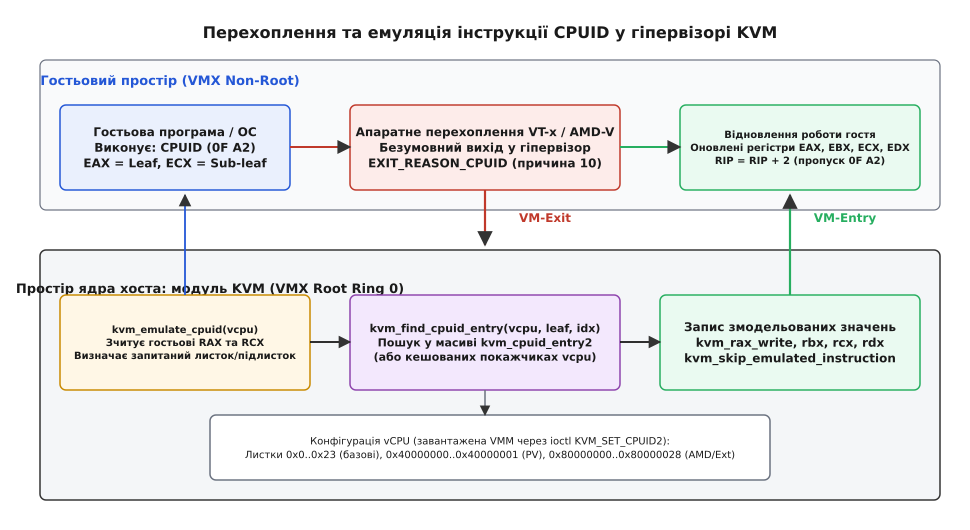
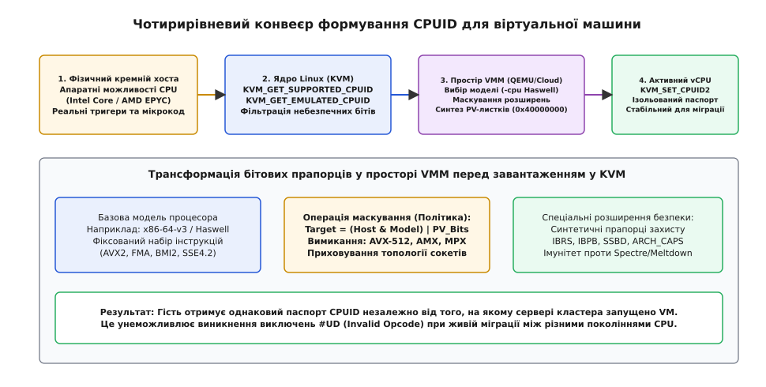
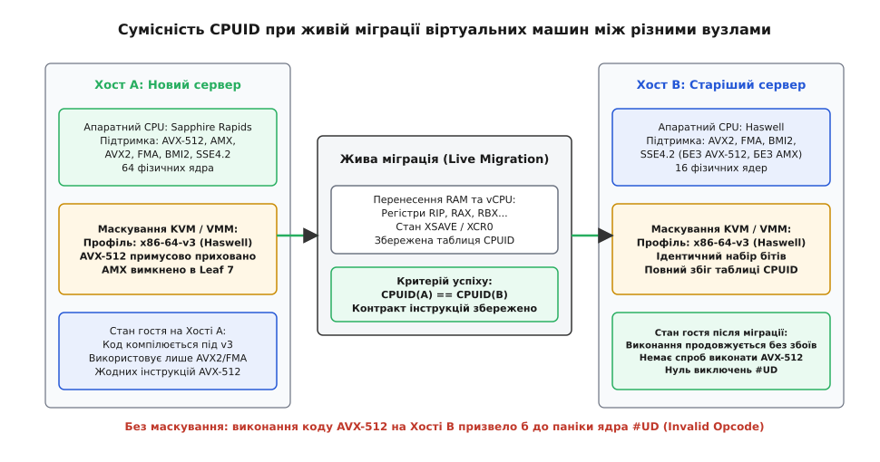

# Маскування та емуляція CPUID у KVM

<preknowlist>
- [Набір інструкцій](topic:hw-arch/isa) — семантика машинних опкодів, кодування команд та регістрові передачі.
- [Кільця захисту й рівні привілеїв](topic:hw-arch/protection-rings) — поділ на рівні ring 0 (супервізор) та ring 3 (користувач).
- [Обробка виключень у процесорі](topic:hw-arch/cpu-exception-handling) — виключення недійсної інструкції (#UD) та помилки загального захисту (#GP).
- [Апаратна віртуалізація](topic:hw-arch/hardware-virtualization) — режими VMX root та non-root, перехоплення інструкцій і виходи VM-exit.
- [Інструкція CPUID](topic:hw-arch/cpuid) — базова будова листків, сигнатури виробників та прапорці можливостей кремнію.
- [Регістри, специфічні для моделі (MSR)](topic:hw-arch/msr) — доступ до системних регістрів конфігурації мікроархітектури.
- [Розширений стан процесора: XSAVE](topic:hw-arch/xsave-extended-state) — збереження контексту векторних регістрів та бітова маска XCR0.
</preknowlist>

Уявіть сучасний хмарний дата-центр, що налічує тисячі серверів. Частина машин працює на восьмирічних процесорах Intel Xeon покоління Haswell, інша частина — на чипах Skylake, а найновіша стійка обладнана процесорами Sapphire Rapids або AMD EPYC Genoa. На цьому кластері запущено віртуальну машину клієнта.

Якщо віртуальна машина запуститься на вузлі з Sapphire Rapids і прочитає конфігурацію процесора напряму з фізичного кремнію, її динамічний лінкер виявить наявність 512-бітних векторних розширень AVX-512 та матричних блоків AMX. Програми оберуть найшвидші векторні ядра для обробки даних.

Проте за кілька годин системний адміністратор виконує **живу міграцію (Live Migration)** — переносить працюючу віртуальну машину під навантаженням на старіший вузол із чипами Haswell для планового обслуговування першого сервера. У момент, коли гостьовий процес на новому хості виконає чергову інструкцію AVX-512, старий процесор зустріне невідомий йому опкод і апаратно згенерує виключення [недійсної інструкції](topic:hw-arch/cpu-exception-handling) (`#UD`, Invalid Opcode). Гостьова операційна система зазнає аварійної зупинки (Kernel Panic), а сервіс користувача впаде.

Щоб розв'язати цю фундаментальну проблему сумісності, операційна система-господар не має права показувати гостю реальний процесор хоста. Вона мусить **маскувати** (masking) апаратні можливості кремнію та **емулювати** (emulation) уніфікований віртуальний процесор із заздалегідь визначеним набором прапорців.

В архітектурі x86 ядром цього контролю є підсистема віртуалізації **Linux KVM (Kernel-based Virtual Machine)** у взаємодії з монітором віртуальних машин (VMM) користувацького простору — таким як QEMU, Cloud Hypervisor або Firecracker.

## Апаратний фундамент: чому CPUID завжди викликає VM-Exit

В архітектурі x86 команда `CPUID` (машинний опкод `0F A2`) спроєктована як непривілейована інструкція: вона доступна для виконання з будь-якого кільця захисту, включно з простором користувача ([ring 3](topic:hw-arch/protection-rings)). Вона не змінює пам'ять і не викликає виключень загального захисту (`#GP`).

У класичній моделі депривілегізації, де гість виконувався б у кільці ring 1, процесор не міг би перехопити виконання `CPUID`, і гостьова програма прочитала б реальний паспорт фізичного кремнію.

Історичний шлях подолання цієї апаратної діри — від важкої двійкової трансляції коду у перших продуктах VMware 1998 року до появи паравіртуальних інтерфейсів Xen — детально викладено у вставці [Еволюція інтроспекції у віртуалізації: від двійкової трансляції до хмарної міграції](topic:hw-arch/cpuid-masking-kvm/hist-cpuid-virtualization.md).

З появою технологій [апаратної віртуалізації](topic:hw-arch/hardware-virtualization) — Intel VT-x (2005) та AMD-V (2006) — виробники процесорів ввели апаратне розділення режимів роботи: **VMX Root** (керування хостом) та **VMX Non-Root** (виконання немодифікованого гостьового коду).

В апаратурі закладено непорушне правило: **у гостьовому режимі VMX Non-Root виконання інструкції CPUID є безумовно перехоплюваним (unconditionally intercepting)**.

```
Гостьовий режим (VMX Non-Root):
  1. Декодер бачить опкод 0F A2 (CPUID)
  2. Апаратура ігнорує реальний мікрокод CPUID
  3. Процесор записує причину виходу у VMCS:
     EXIT_REASON_CPUID (код 10 у VT-x, VMEXIT_CPUID 0x72 в AMD SVM)
  4. Процесор скидає стан і переходить у VMX Root (Ядро KVM)
```

Ні ядро операційної системи, ні гіпервізор не можуть відключити це перехоплення через конфігураційні біти керуючої структури віртуального процесора VMCS (Virtual Machine Control Structure). Кожне звернення до `CPUID` зсередини віртуальної машини гарантовано примусово передає керування ядру KVM.



*Перехоплення та емуляція інструкції CPUID у гіпервізорі KVM: виконання команди гостем генерує апаратний VM-exit, модуль ядра KVM знаходить змодельований запис у таблиці vCPU, записує результат у гостьові регістри та повертає керування через VM-entry.*

## Внутрішній механізм KVM: обробка та емуляція

Коли апаратний вихід VM-exit повертає процесор у режим ядра хоста (VMX Root Ring 0), диспетчер віртуалізації ядра Linux викликає обробник виходу: функцію `handle_cpuid()` (для Intel VT-x) або `cpuid_interception()` (для AMD SVM). Обидві вони делегують задачу універсальній підсистемі `kvm_emulate_cpuid()`.

Розглянемо покроковий ланцюг обробки виклику всередині ядра:

1. **Зчитування запитаних параметрів:** Ядро зчитує поточні значення архітектурних регістрів віртуального процесора `RAX` (номер листка) та `RCX` (номер підлистка) за допомогою допоміжних функцій `kvm_rax_read(vcpu)` та `kvm_rcx_read(vcpu)`.
2. **Пошук у конфігураційній таблиці:** Функція `kvm_find_cpuid_entry(vcpu, function, index)` виконує пошук у заздалегідь завантаженому масиві структур `struct kvm_cpuid_entry2`, що належить конкретному екземпляру vCPU.
3. **Застосування відповіді:**
   * Якщо знайдено точний збіг листка й підлистка, ядро вичитує змодельовані 32-бітні значення `eax`, `ebx`, `ecx`, `edx` зі знайденої структури;
   * Якщо листок перевищує максимальний базовий номер (`0x00000000`), KVM повертає нулі в усі чотири регістри, що відповідає поведінці реального кремнію;
   * Якщо листок лежить у непокритому діапазоні, повертаються нулі або значення останнього дійсного базового листка.
4. **Запис у віртуальні регістри:** За допомогою функцій `kvm_rax_write(vcpu, eax)`, `kvm_rbx_write`, `kvm_rcx_write`, `kvm_rdx_write` обчислені значення фіксуються в архітектурному контексті vCPU.
5. **Пропуск виконаної інструкції:** Ядро збільшує значення гостьового лічильника інструкцій `RIP` на довжину команди `CPUID` (рівно 2 байти) через виклик `kvm_skip_emulated_instruction(vcpu)`.
6. **Повернення до гостя:** Гіпервізор виконує апаратну команду `VMENTRY` (або `VMRUN`), відновлюючи виконання гостьового коду вже з оновленими регістрами.

> 🔧 **Навіщо це.** Ціна кожного VM-exit на сучасних процесорах становить від 400 до 1500 тактів процесора. Завдяки тому, що KVM обробляє `CPUID` безпосередньо в просторі ядра (in-kernel emulation) без виходу в користувацький процес VMM (userspace round-trip), час емуляції скорочується в десятки разів, мінімізуючи затримки під час ініціалізації операційної системи гостя.

### Оптимізація та зворотне відображення в ядрі KVM

У ранніх версіях KVM пошук у таблиці `CPUID` виконувався лінійним перебором масиву `entries` під час кожного VM-exit. При великій кількості підлистків кешів і розширених станів це створювало помітне навантаження.

У сучасному ядрі Linux підсистему оптимізовано за двома напрямками:

1. **Кешування критичних листків:** У структурі `struct kvm_vcpu_arch` виділено прямі вказівники на найчастіше запитувані листки: Листок 1 (базові властивості), Листок 7 (розширення), Листок `0x0000000D` (XSAVE), Листок `0x80000001` (AMD/Ext) та Листок `0x40000000` (паравіртуальний підпис). Пошук цих листків відбувається за `O(1)`.
2. **Масив `kvm_cpu_caps`:** Ядро KVM використовує внутрішній бітовий масив зведених можливостей, де апаратні прапорці хоста логічно множаться на бітові маски функціоналу, який KVM у принципі здатен безпечно віртуалізувати.

## Чотирирівневий конвеєр формування CPUID

Паспорт процесора, який бачить віртуальна машина, не створюється випадково: він проходить крізь суворий чотирирівневий фільтраційний конвеєр.



*Чотирирівневий конвеєр формування CPUID: апаратні можливості хоста фільтруються ядром KVM, трансформуються користувацьким VMM згідно з політикою базової моделі та завантажуються у віртуальний процесор через KVM_SET_CPUID2.*

1. **Рівень 1: Фізичний кремній хоста.**
   Визначає фізичну стелю можливостей: які транзистори розпаяно на кристалі, які мікрокодні латки застосовано і які векторні блоки реально існують у кремнії.
2. **Рівень 2: Ядро KVM (Kernel Control Plane).**
   Через системний виклик `ioctl(kvm_fd, KVM_GET_SUPPORTED_CPUID)` ядро експортує у простір користувача список тих прапорців хоста, які KVM вміє коректно обслуговувати у віртуальному режимі. Додатковий виклик `KVM_GET_EMULATED_CPUID` повертає список інструкцій, які KVM може повністю емулювати програмно навіть за відсутності їхньої апаратної підтримки в кремнії.
3. **Рівень 3: Монітор віртуальних машин VMM (QEMU, Firecracker, Cloud Hypervisor).**
   Користувацький процес VMM застосовує **політику маскування**:
   * Обирає цільовий профіль процесора (наприклад, сумісну базову модель `Haswell` або стандарт `x86-64-v3`);
   * Вимикає прапорці інструкцій, яких немає в обраній моделі;
   * Впроваджує синтетичні паравіртуальні листки;
   * Налаштовує топологію сокетів, ядер і потоків.
4. **Рівень 4: Активний vCPU (Гостьовий простір).**
   VMM передає сформований масив структур у ядро через `ioctl(vcpu_fd, KVM_SET_CPUID2)`. Від цієї миті для віртуального процесора фіксується незмінний паспорт, що діє протягом усього часу його роботи.

Повний перелік параметрів системних викликів ядра, бітових прапорців та форматів керуючих структур наведено у технічному довіднику [Інтерфейс ioctl для конфігурації CPUID у ядрі KVM](topic:hw-arch/cpuid-masking-kvm/api-kvm-cpuid-ioctl.md).

## Маскування заради живої міграції (Live Migration)

Головною інженерною причиною маскування `CPUID` у хмарах є забезпечення безшовної живої міграції між фізично різнорідними серверами.



*Сумісність CPUID при живій міграції: обидва фізичні вузли застосовують єдину маску базової моделі (x86-64-v3), що гарантує збереження однакового набору інструкцій і запобігає збоям #UD при перенесенні віртуальної машини.*

### Алгебра бітових масок базових моделей

Монітор віртуальних машин формує результуючий набір прапорців для кожного регістра за строгою булевою формулою:

```
CPUID_Active = ((Host_Supported | KVM_Emulated) & Model_Baseline_Mask)
               | Explicit_Enabled_Features
               & ~Explicit_Disabled_Features
```

Розглянемо це на практичному прикладі маскування Листка 7 (підлисток 0, регістр `EBX`) для створення сумісного профілю стандарту `x86-64-v3`:

```
1. Фізичний процесор Хоста A (Sapphire Rapids):
   EBX = 0x319C07A9 (AVX2=1, AVX512F=1, AVX512DQ=1, AVX512BW=1, AMX=1)

2. Маска базової моделі x86-64-v3 (вимагає AVX2, але забороняє AVX-512):
   Mask_EBX = 0x00000020 (дозволено лише AVX2, біт 5)

3. Результат маскування KVM:
   Target_EBX = 0x319C07A9 & 0x00000020 = 0x00000020 (AVX2 увімкнено, AVX-512 приховано)
```

Коли віртуальна машина з таким маскованим паспортом мігрує на старий сервер Haswell (де апаратно є лише AVX2), гостьовий код без жодних проблем продовжує виконання, оскільки він ніколи не намагався викликати 512-бітні векторні інструкції.

### Рівні сумісності мікроархітектур x86-64

Для полегшення конфігурації у 2020 році консорціум розробників Linux, GCC, LLVM та інженерів Intel/AMD стандартизував чотири базові рівні сумісності мікроархітектур x86-64:

| Рівень сумісності | Обов'язкові розширення CPUID | Відповідні мікроархітектури |
| :--- | :--- | :--- |
| `x86-64-v1` | CMOV, CX8, FPU, MMX, SSE, SSE2 | Базовий 64-бітний стандарт (2003) |
| `x86-64-v2` | CMPXCHG16B, LAHF/SAHF, POPCNT, SSE3, SSSE3, SSE4.1, SSE4.2 | Intel Nehalem / AMD Jaguar (2008+) |
| `x86-64-v3` | AVX, AVX2, BMI1, BMI2, F16C, FMA, LZCNT, MOVBE, OSXSAVE | Intel Haswell / AMD Zen (2013+) |
| `x86-64-v4` | AVX512F, AVX512BW, AVX512CD, AVX512DQ, AVX512VL | Intel Skylake-SP / AMD Zen 4 (2017+) |

У хмарних гіпервізорах стандартним вибором за замовчуванням є профіль `x86-64-v2` або `x86-64-v3`, оскільки вони дозволяють вільно переміщувати віртуальні машини між будь-якими серверами дата-центру, випущеними за останні 10–12 років.

## Паравіртуальні листки та розширення гіпервізора

Крім приховування непотрібних можливостей фізичного заліза, KVM активно **додає синтетичні листки**, яких фізично не існує в жодному кремнієвому чипі. Для цього зарезервовано спеціальний адресний простір, що починається з `0x40000000`.

### Листок 0x40000000: Сигнатура гіпервізора

Найпершим кроком гостьова операційна система (зокрема ядра Linux та Windows під час ініціалізації) перевіряє наявність біта присутності гіпервізора: Листок 1, `ECX[31]`.

Якщо цей біт дорівнює `1`, гостьове ядро виконує `CPUID` з `EAX = 0x40000000`.

Регістр `EAX` повертає максимальний доступний паравіртуальний листок (зазвичай `0x40000001` для чистого KVM або `0x4000000A` при ввімкненій емуляції Microsoft Hyper-V).

Регістри `EBX`, `ECX`, `EDX` повертають 12 байтів ASCII-сигнатури гіпервізора:

```
EBX = 0x4b4d564b  ->  "KVMK"
ECX = 0x564d4b56  ->  "VMKV"
EDX = 0x0000004d  ->  "M\0\0\0"
Разом: "KVMKVMKVM\0\0\0"
```

Виявивши цей рядок, гостьове ядро Linux розуміє, що воно працює під керуванням KVM, і переходить до читання наступного листка.

### Листок 0x40000001: Прапорці паравіртуальних функцій KVM

Цей листок повертає бітову маску оптимізацій, які гіпервізор пропонує гостю для кардинального зменшення накладних витрат:

* `KVM_FEATURE_CLOCKSOURCE2` (`EAX[3]`): вмикає високоточний стабільний паравіртуальний годинник `kvm-clock`. Замість повільних звернень до апаратних таймерів HPET або ACPI PM гість зчитує системний час із розділеної сторінки пам'яті за кілька тактів;
* `KVM_FEATURE_ASYNC_PF` (`EAX[4]`): асинхронна обробка промахів пам'яті. Якщо сторінку гостя скинуто хостом у swap-файл, KVM не заморожує весь віртуальний процесор, а надсилає гостьовому ядру спеціальне паравіртуальне переривання. Гостьовий планувальник перемикається на виконання іншого процесу, поки хост підвантажує сторінку з диска;
* `KVM_FEATURE_PV_EOI` (`EAX[6]`): паравіртуальне підтвердження переривань контролера APIC (End of Interrupt). Звичайний запис в регістр APIC EOI викликає важкий VM-exit. При активному `PV_EOI` гість просто скидає біт у пам'яті;
* `KVM_FEATURE_PV_UNHALT` (`EAX[7]`): оптимізація спінлоків у гостьовому ядрі. Якщо віртуальний процесор очікує на зайнятий spinlock, він виконує гіпервиклик, повідомляючи KVM передати процесорний час іншому vCPU, який утримує блокування.

## Синхронізація розширеного стану XSAVE та топології

Маскування прапорців у `CPUID` вимагає суворої узгодженості між різними листками та внутрішніми системними регістрами процессора. Розглянемо дві найскладніші точки синхронізації.

### Узгодження розміру буфера XSAVE (Листок 0x0000000D)

Розширені інструкції `XSAVE` та `XRSTOR` зберігають стан усіх векторних та системних регістрів у спеціальний буфер в оперативній пам'яті.

Розмір цього буфера безпосередньо залежить від того, які компоненти дозволено в системному регістрі `XCR0` (біт 0 = x87, біт 1 = SSE, біт 2 = AVX, біти 5..7 = AVX-512, біти 17..18 = AMX).

```
Вимога узгодженості XSAVE:
Якщо в Листку 7 замасковано AVX-512:
  1. Біти 5, 6, 7 у Листку 0x0000000D (підлисток 0) мусять бути примусово обнулені;
  2. Значення регістрів EBX та ECX у Листку 0x0000000D (розмір буфера в байтах)
     повинні зменшитися з 2688 байтів (для AVX-512) до 832 байтів (для AVX2);
  3. Будь-яка спроба гостя встановити біти 5..7 у регістр XCR0 через XSETBV
     мусить викликати виключення #GP.
```

Якщо монітор віртуальних машин вимкне прапорець AVX-512 у Листку 7, але забуде скорегувати розміри та маски в Листку `0x0000000D`, гостьове ядро операційної системи виділить буфер неправильного розміру і під час першого ж перемикання контексту процесу зітре сусідні структури пам'яті ядра, спричинивши крах системи.

### Синтез топології ядер та APIC ID (Листки 0x0000000B та 0x0000001F)

Сучасні операційні системи використовують розширені листки `0x0000000B` та `0x0000001F` (Extended Topology Enumeration) для визначення ієрархії процесора: скільки потоків [SMT](topic:hw-arch/simultaneous-multithreading) припадає на одне ядро, скільки ядер об'єднано в кристал (Compute Die / CCD) і скільки сокетів встановлено на материнській платі.

У віртуальному середовищі KVM повністю переписує ці листки:

1. Кожному віртуальному процесору присвоюється штучний `APIC ID` (наприклад, vCPU 0 отримує ID 0, vCPU 1 отримує ID 1);
2. У підлистку `ECX = 0` (рівень SMT / потоку) повертається кількість віртуальних потоків на ядро (наприклад, 1 або 2);
3. У підлистку `ECX = 1` (рівень Core / ядра) повертається кількість віртуальних ядер на віртуальний сокет;
4. Усі відомості про реальну фізичну топологію хостового процесора (фізичні сокети, асиметричні енергоефективні E-ядра) приховуються, щоб планувальник завдань гостьової ОС рівномірно розподіляв потоки без хибних евристик.

## Практична інженерія: конфігурація CPUID у моніторі VMM

Повнофункціональну робочу програму на мовах C та C++, яка демонструє відкриття `/dev/kvm`, виділення віртуального процесора, фільтрацію таблиці `CPUID` під профіль `x86-64-v3` та додавання паравіртуальних листків, наведено у вставці [Реалізація фільтра та маскування CPUID у власному міні-гіпервізорі](topic:hw-arch/cpuid-masking-kvm/proj-vmm-cpuid-filter.md).

Нижче наведено ключовий фрагмент коду, що ілюструє застосування маски базової моделі та встановлення сигнатури KVM перед завантаженням у віртуальний процесор.

:::tabs
```c
#include <stdio.h>
#include <stdlib.h>
#include <stdint.h>
#include <string.h>
#include <sys/ioctl.h>
#include <linux/kvm.h>

void apply_cpuid_masking(struct kvm_cpuid2* cpuid, uint32_t vcpu_id) {
    for (uint32_t i = 0; i < cpuid->nent; ++i) {
        struct kvm_cpuid_entry2* entry = &cpuid->entries[i];

        // 1. Листок 1: Встановлюємо біт віртуалізації та віртуальний APIC ID
        if (entry->function == 1) {
            entry->ecx |= (1U << 31); // Біт присутності гіпервізора
            entry->ebx &= 0x00FFFFFF;
            entry->ebx |= ((vcpu_id & 0xFF) << 24); // Синтетичний APIC ID
        }

        // 2. Листок 7: Маскуємо AVX-512 під базову модель x86-64-v3
        if (entry->function == 7 && entry->index == 0) {
            entry->ebx &= ~(1U << 16); // Вимикаємо AVX512F
            entry->ebx &= ~(1U << 17); // Вимикаємо AVX512DQ
            entry->ebx &= ~(1U << 30); // Вимикаємо AVX512BW
            entry->ebx |= (1U << 5);   // Гарантуємо наявність AVX2
        }

        // 3. Листок 0x40000000: Синтезуємо сигнатуру "KVMKVMKVM\0\0\0"
        if (entry->function == 0x40000000) {
            entry->eax = 0x40000001; // Максимальний паравіртуальний листок
            entry->ebx = 0x4b4d564b; // "KVMK"
            entry->ecx = 0x564d4b56; // "VMKV"
            entry->edx = 0x0000004d; // "M\0\0\0"
        }
    }
}
```
```cpp
#include <iostream>
#include <vector>
#include <cstring>
#include <sys/ioctl.h>
#include <linux/kvm.h>

class CpuidMasker {
public:
    static void apply_masking(std::vector<kvm_cpuid_entry2>& entries, uint32_t vcpu_id) noexcept {
        for (auto& entry : entries) {
            // 1. Листок 1: Встановлюємо біт віртуалізації та віртуальний APIC ID
            if (entry.function == 1) {
                entry.ecx |= (1U << 31); // Біт присутності гіпервізора
                entry.ebx &= 0x00FFFFFF;
                entry.ebx |= ((vcpu_id & 0xFF) << 24); // Синтетичний APIC ID
            }

            // 2. Листок 7: Маскуємо AVX-512 під базову модель x86-64-v3
            if (entry.function == 7 && entry.index == 0) {
                entry.ebx &= ~(1U << 16); // Вимикаємо AVX512F
                entry.ebx &= ~(1U << 17); // Вимикаємо AVX512DQ
                entry.ebx &= ~(1U << 30); // Вимикаємо AVX512BW
                entry.ebx |= (1U << 5);   // Гарантуємо наявність AVX2
            }

            // 3. Листок 0x40000000: Синтезуємо сигнатуру "KVMKVMKVM\0\0\0"
            if (entry.function == 0x40000000) {
                entry.eax = 0x40000001;
                entry.ebx = 0x4b4d564b; // "KVMK"
                entry.ecx = 0x564d4b56; // "VMKV"
                entry.edx = 0x0000004d; // "M\0\0\0"
            }
        }
    }
};
```
:::

## Інженерні пастки та крайові випадки

Під час конфігурації та маскування `CPUID` у промислових системах віртуалізації виникають неочевидні апаратні пастки:

1. **Пастка Invariant TSC (`0x80000007` `EDX[8]`):**
   Прапорець `invtsc` повідомляє операційній системі, що лічильник тактів `RDTSC` працює з постійною частотою незалежно від енергоощадних станів ядра. Якщо цей прапорець увімкнено у віртуальній машині, стандартний QEMU за замовчуванням **блокує живу міграцію**. Причина: якщо цільовий хост має іншу базову частоту шини, системний час у гостьовій системі почне фатально відставати або поспішати. Для міграції машин з `invtsc` потрібна апаратна підтримка масштабування тактів (TSC Scaling у VT-x/SVM).
2. **Пастка захисту від атак спекулятивного виконання (Spectre/Meltdown):**
   Якщо гіпервізор хоста наклав мікрокодні латки безпеки, він експортує прапорці `IBRS`, `IBPB`, `SSBD` у Листку 7 та `ARCH_CAPABILITIES` у `EDX[29]`. Якщо VMM маскує ці біти заради сумісності зі старими серверами, гостьова ОС вважатиме себе незахищеною й увімкне повільні програмні бар'єри (Retpoline, KPTI), що призведе до падіння продуктивності вводу-виводу на 20–30%.
3. **Пастка сумісності з гостьовими ядрами Windows:**
   Ядро операційної системи Windows вимагає суворої відповідності між топологією в Листках `0x00000001`, `0x00000004` та `0x0000000B`. Якщо кількість потоків або парність `APIC ID` обчислена з помилкою, Windows завершує завантаження «синім екраном смерті» (BSOD) із кодом помилки `MULTI_PROCESSOR_CONFIGURATION_NOT_SUPPORTED`.

Маскування та емуляція `CPUID` перетворюють монолітний фізичний процесор на гнучкий, керований і безпечний віртуальний ресурс. Це дозволяє хмарним платформам динамічно переміщувати робочі навантаження між серверами різних поколінь і забезпечувати ізоляцію віртуальних машин.
