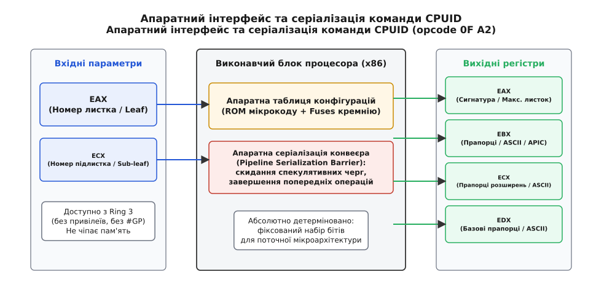
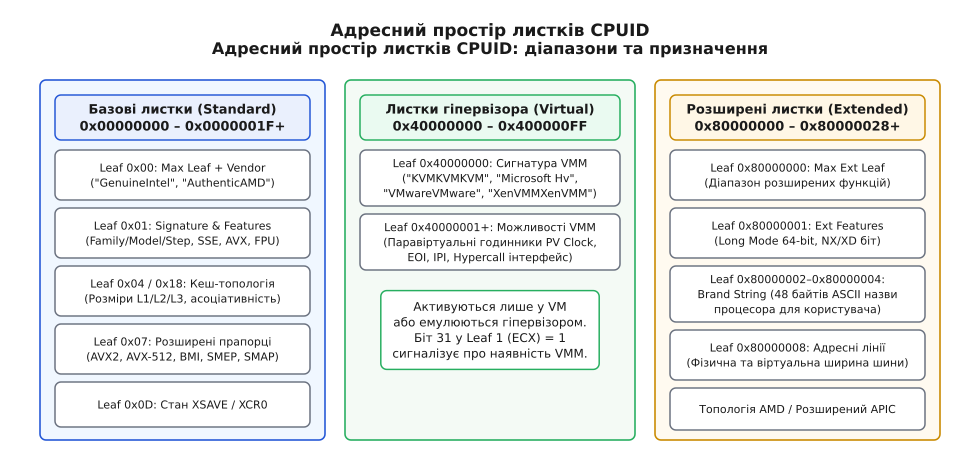
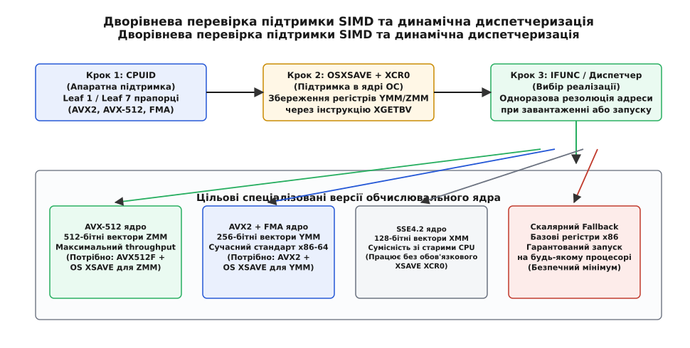
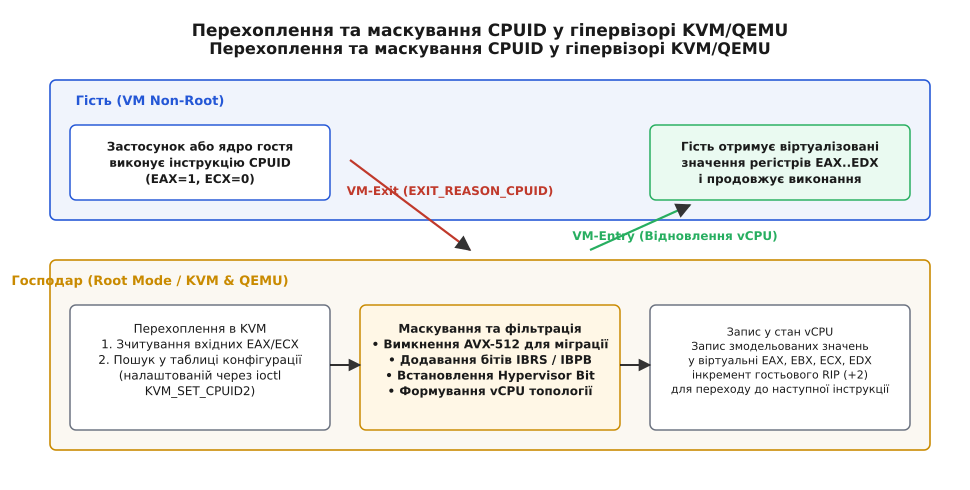

# Інструкція CPUID: апаратний паспорт та інтроспекція архітектури x86

<preknowlist>
- [Набір інструкцій](root:hw-arch/isa) — що таке машинний опкод, операнди та семантика регістрових передач.
- [Кільця захисту й рівні привілеїв](root:hw-arch/protection-rings) — поділ на рівні ring 0 (супервізор) та ring 3 (простір користувача).
- [Обробка виключень у процесорі](root:hw-arch/cpu-exception-handling) — як апаратура генерує виключення недійсної інструкції (#UD) при виконанні невідомих команд.
- [Апаратна віртуалізація](root:hw-arch/hardware-virtualization) — режими VMX root та non-root, перехоплення інструкцій гостя через механізм VM-exit.
- [SIMD та векторизація](root:hw-arch/simd-vectorization) — робота з паралельними векторними регістрами SSE, AVX2 та AVX-512.
- [Позачергове виконання](root:hw-arch/out-of-order-execution) — конвеєр, спекулятивні черги та серіалізаційні бар'єри процесора.
</preknowlist>

Коли скомпільована програма запускається на комп'ютері користувача, вона нічого не знає про конкретний чип під капотом. Якщо бінарний файл містить 512-бітні векторні інструкції AVX-512, а процесор користувача підтримує лише старіший стандарт SSE4.2, перша ж спроба виконати невідомий машині опкод викличе апаратне виключення [недійсної інструкції](root:hw-arch/cpu-exception-handling) (`#UD`, Invalid Opcode) і призведе до негайного аварійного завершення процесу сигналом `SIGILL`. З іншого боку, якщо розробник із міркувань обережності скомпілює код під найменший спільний знаменник двадцятирічної давнини, новітній 64-ядерний процесор працюватиме в кілька разів повільніше за свій фізичний потенціал, обробляючи дані скалярними операціями замість швидких векторних блоків.

Щоб розв'язати це протиріччя, програмі потрібен безпечний і надійний механізм **інтроспекції заліза** (лат. *intro* — всередину + *spectare* — дивитися). Процесор повинен уміти на вимогу видати власний вичерпний «паспорт»: точну назву моделі, список усіх підтримуваних наборів інструкцій, розміри та топологію кеш-пам'яті, відомості про енергоспоживання, а також апаратні механізми захисту від уразливостей.

В архітектурі x86/x86-64 цим єдиним вікном у внутрішній світ кремнію є інструкція **CPUID** (CPU Identification). Вона стандартизує апаратний діалог між процесором, операційною системою, динамічним лінкером та гіпервізором.

## Апаратний механізм: як процесор відповідає на запит

Інструкція `CPUID` має машинний опкод `0F A2` (два байти в бінарному потоці команд). Її головна інженерна особливість полягає в тому, що вона є **непривілейованою** (unprivileged). Програма в просторі користувача ([ring 3](root:hw-arch/protection-rings)) виконує її точно так само, як і ядро операційної системи в [ring 0](root:hw-arch/protection-rings), не викликаючи помилки загального захисту (`#GP`, General Protection Fault).

Інтерфейс виклику побудований виключно на регістрах загального призначення. Перед виконанням інструкції програма записує номер запитуваного розділу — так званого **листка** (leaf або function number) — у 32-бітний регістр `EAX`. Якщо конкретний листок має додаткові підрозділи (наприклад, перелік кількох рівнів кешу чи розширені таблиці функцій), номер **підлистка** (sub-leaf) завантажується в регістр `ECX`.

```
Вхідні параметри:
  EAX = Номер листка (Leaf)
  ECX = Номер підлистка (Sub-leaf, якщо вимагається)

Виконання:
  CPUID (опкод 0F A2)

Вихідні параметри:
  EAX = Основна сигнатура / максимальний доступний листок
  EBX = Параметри, бітові прапорці або ASCII-символи
  ECX = Прапорці розширень або додаткові дескриптори
  EDX = Базові прапорці можливостей або ASCII-символи
```

При виконанні `CPUID` процесор не звертається до оперативної пам'яті: він не читає таблиці сторінок, не генерує промахів у кеші та не створює трафіку на системній шині. Усі дані зчитуються безпосередньо з внутрішніх апаратних тригерів (silicon fuses), записів [мікрокоду](root:hw-arch/microcode) процесора та внутрішніх регістрів стану конвеєра.



*Апаратний інтерфейс інструкції CPUID: вхідні параметри передаються в EAX та ECX, після чого логіка процесора серіалізує конвеєр і повертає конфігураційні біти у чотирьох вихідних регістрах.*

### Внутрішня мікроархітектура та серіалізація конвеєра

Щоб зрозуміти, чому `CPUID` є важкою операцією, простежимо її рух крізь стадії конвеєра сучасного процесора.

Коли блок декодування інструкцій (Instruction Decoder) розпізнає опкод `0F A2`, він не транслює його в звичайні скалярні мікрооперації (uops). Натомість декодер генерує точку входу в мікрокод (Microcode ROM entry point) і видає сигнал апаратної паузи для планувальника позачергового виконання.

1. **Очищення черги перевпорядкування (Reorder Buffer Drain):** Процесор припиняє вибірку нових інструкцій із кешу L1I. Усі попередні інструкції, які вже перебувають на конвеєрі або в спекулятивних буферах, доходять до фінальної стадії фіксації результатів (Commit / Retirement).
2. **Скидання спекуляцій:** Усі непідтверджені гілки переходів скидаються, а буфери запису в пам'ять (Store Buffers) примусово скидають свої дані в когерентний кеш L1D.
3. **Виконання мікропрограми інтроспекції:** Блок керування зчитує мікропрограму `CPUID` із постійної пам'яті ROM. Вона зчитує вхідні значення `EAX` та `ECX`, виконує табличний пошук у зашитих апаратних масивах кремнію, записує результат у фізичні регістри `EAX`, `EBX`, `ECX`, `EDX` архітектурного файлу регістрів (Architectural Register File).
4. **Перезапуск вибірки:** Лише після запису останнього регістра конвеєр відновлює вибірку наступної інструкції з лічильника `RIP`.

> 🔧 **Навіщо це.** Завдяки серіалізації `CPUID` часто використовують разом із лічильником тактів `RDTSC` для прецизійного вимірювання швидкодії коду. Якщо обгорнути тестовий фрагмент двома `RDTSC` без серіалізації, процесор виконає їх позачергово, і заміряний інтервал виявиться нульовим або хибним. Додавання `CPUID` перед `RDTSC` гарантує, що жодна інструкція з тестованого блоку не перетне межу вимірювання.

Ціна такої серіалізації суттєва: виконання одного виклику `CPUID` на сучасних ядрах Intel та AMD займає від 100 до 300 тактів процесора. Тому викликати `CPUID` усередині гарячих обчислювальних циклів суворо заборонено: конфігурацію кремнію зчитують один раз під час ініціалізації модуля чи запуску програми й кешують у звичайних змінних.

### Механізм CPUID Faulting у ядрі ОС

У процесорах Intel, починаючи з архітектури Ivy Bridge, з'явився спеціальний системний механізм — **CPUID Faulting** (керується бітом 0 у системному регістрі MSR `0x140` `IA32_MISC_ENABLE` або MSR `0x33` `MSR_TEST_CTRL`).

Коли ядро операційної системи активує CPUID Faulting для конкретного процесу, будь-яка спроба виконати команду `CPUID` у просторі користувача (ring 3) викликає виключення загального захисту (`#GP`). Ядро операційної системи перехоплює це виключення, аналізує контекст потоку і може або повернути модифіковані дані інтроспекції, або заблокувати процес.

Цей механізм став незамінним для інструментів детермінованого відлагодження (таких як відлагоджувач `rr` — Record and Replay Framework) та середовищ сумісності (наприклад, емуляторів Wine), оскільки дозволяє повністю контролювати недетерміновані відповіді `CPUID` та забезпечити точне покрокове відтворення виконання багатопотокових програм.

Детальний історичний шлях від хаотичних перевірок прапорців на старих процесорах 8086/80386 до появи стандарту `CPUID` у процесорі Pentium 1993 року розібрано в окремій вставці [Від хаків прапорців до паспорта кремнію: історія інструкції CPUID](root:hw-arch/cpuid/hist-cpuid.md).

## Адресний простір листків: архітектурна триєдність

Щоб уникнути конфліктів між різними виробниками та технологіями віртуалізації, адресний простір функцій `CPUID` розділено на три ізольовані діапазони, які позначаються шістнадцятковими числами.



*Структура адресного простору CPUID: базові листки описують стандартні можливості ядра, гіпервізорний простір повертає стан віртуалізації, а розширені листки містять 64-бітні властивості та текстове ім'я чипа.*

1. **Базовий діапазон (Basic / Standard Leaves): `0x00000000` – `0x0000001F`+**
   Визначає базові архітектурні можливості x86: наявність FPU, SSE, AVX, структуру та асоціативність кешів, апаратні розширення безпеки (SMEP, SMAP, CET) та первинний ідентифікатор виробника.
2. **Простір віртуалізації та гіпервізорів (Hypervisor Range): `0x40000000` – `0x400000FF`**
   Використовується виключно всередині [віртуальних машин](root:hw-arch/hardware-virtualization). Якщо гостьова ОС виявляє біт присутності гіпервізора, вона звертається до цього діапазону для отримання сигнатури VMM (KVM, Hyper-V, VMware, Xen) та активації швидких паравіртуальних інтерфейсів.
3. **Розширений діапазон (Extended Leaves): `0x80000000` – `0x80000028`+**
   Спочатку створений компанією AMD для стандартизації 64-бітної архітектури AMD64 і згодом повністю запозичений Intel. Містить прапорці 64-бітного режиму (Long Mode), біт заборони виконання даних [NX/XD](root:hw-arch/virtual-memory), ширину ліній фізичної та віртуальної пам'яті, а також 48-символьний рядок повної назви процесора.

Повний бітовий опис кожного регістра для всіх стандартних і розширених листків зведено в технічному довіднику [Довідник листків та бітових прапорців інструкції CPUID](root:hw-arch/cpuid/api-leaves.md).

## Базові листки: від магічного рядка до топології кешів

Розглянемо послідовність звернення до базових листків, яка є обов'язковою для будь-якої операційної системи під час завантаження.

### Листок 0x00000000: Максимальний базовий номер і рядок виробника

Найперший запит виконується з `EAX = 0`. Регістр `EAX` повертає найбільше число базового листка, яке розуміє цей процесор. Якщо програма спробує запросити номер листка, що перевищує це значення, процесор або поверне нулі, або продублює дані останнього дійсного базового листка.

Одночасно регістри `EBX`, `EDX` та `ECX` повертають 12 байтів ASCII-тексту, що утворюють унікальний підпис виробника (Vendor Identification String). Порядок збирання рядка є нестандартним: перші 4 байти лежать у `EBX`, наступні 4 — у `EDX`, і завершальні 4 — у `ECX`.

```
Для процесорів Intel:
  EBX = 0x756e6547  ->  "Genu"
  EDX = 0x49656e69  ->  "ineI"
  ECX = 0x6c65746e  ->  "ntel"
  Разом: "GenuineIntel"

Для процесорів AMD:
  EBX = 0x68747541  ->  "Auth"
  EDX = 0x69746e65  ->  "enti"
  ECX = 0x444d4163  ->  "cAMD"
  Разом: "AuthenticAMD"
```

### Листок 0x00000001: Родина, модель і класичні прапорці

Листок 1 повертає цифрову сигнатуру кремнію в `EAX` та сотні базових апаратних прапорців у `ECX` і `EDX`.

Значення `EAX` розбите на бітові поля, за якими операційна система розпізнає конкретну мікроархітектуру чипа:
* `Stepping ID` (біти 0..3): ревізія кремнієвої пластини (виправлення помилок на рівні фотолітографії);
* `Model` (біти 4..7) та `Extended Model` (біти 16..19): номер моделі ядра;
* `Family` (біти 8..11) та `Extended Family` (біти 20..27): покоління мікроархітектури.

Якщо `Family` дорівнює `6` або `15`, справжній номер моделі обчислюється зсувом та об'єднанням полів: `Model = (Extended_Model << 4) | Base_Model`. Наприклад, відома родина серверних та десктопних процесорів Intel Core має `Family = 6`, а номер конкретної моделі (Skylake, Tiger Lake, Raptor Lake) закодований комбінацією двох полів моделі.

На ранньому етапі завантаження ядра (early boot) операційна система Linux вичитує цю сигнатуру і шукає відповідний файл оновлення мікрокоду (наприклад, у теці `/lib/firmware/intel-ucode/` або `/lib/firmware/amd-ucode/`). Після завантаження бінарного патча в кристал ядро повторно виконує `CPUID`, щоб переконатися, що ревізія мікрокоду оновилася, а критичні апаратні латки активовано.

Регістри `EDX` та `ECX` у Листку 1 містять масив бітових прапорців (Feature Flags), де кожен біт сигналізує про наявність конкретного апаратного блоку:
* `EDX[0] (FPU)` — наявність класичного математичного співпроцесора [x87 FPU](root:hw-arch/fpu);
* `EDX[4] (TSC)` — наявність 64-бітного лічильника тактів `RDTSC`;
* `EDX[25] (SSE)` та `EDX[26] (SSE2)` — перші покоління 128-бітних векторних регістрів `XMM`;
* `ECX[5] (VMX)` — підтримка апаратної віртуалізації Intel VT-x;
* `ECX[25] (AES)` — апаратні інструкції криптографічного перетворення AES-NI;
* `ECX[28] (AVX)` — 256-бітні векторні інструкції та 3-операндний синтаксис VEX;
* `ECX[31] (HYPERVISOR)` — біт, що сигналізує про виконання всередині віртуальної машини.

### Листок 0x00000004: Детермінований опис ієрархії кешів

Сучасний процесор має складну багатоповерхову [ієрархію кеш-пам'яті](root:hw-arch/cache) (L1 Data, L1 Instruction, L2, L3). Щоб операційна система могла побудувати дерево кешів та правильно розподіляти потоки, `CPUID` надає Листок 4.

Цей листок використовує вхідний параметр підлистка в регістрі `ECX`. Програма ітерує `ECX = 0, 1, 2, ...`, поки поле типу кешу (`EAX[4:0]`) не поверне `0` (список вичерпано).

Для кожного рівня кешу процесор повертає точні апаратні параметри:
1. `Line Size` (розмір рядка когерентності): `(EBX[11:0] + 1)` байтів (зазвичай 64 байти);
2. `Partitions` (фізичні секції): `(EBX[21:12] + 1)`;
3. `Ways` (ступінь асоціативності): `(EBX[31:22] + 1)`;
4. `Sets` (кількість наборів у кеші): `(ECX + 1)`.

Підсумковий фізичний розмір кешу обчислюється простим множенням цих апаратних констант:

```
Розмір кешу = (Ways + 1) · (Partitions + 1) · (LineSize + 1) · (Sets + 1)
```

Наприклад, якщо для L1 Data кешу `Ways = 8`, `Partitions = 1`, `LineSize = 64`, `Sets = 64`, загальний обсяг становить: `8 · 1 · 64 · 64 = 32768` байтів (32 КБ).

Операційна система (зокрема планувальник завдань ядра Linux) використовує ці дані для створення **доменів планування** (sched domains). Якщо два потоки ділять швидкий кеш L2 або L3, ядра розміщуються поруч. Якщо ж потоки обмінюються великими обсягами даних через пам'ять, планувальник уникає розкидання їх по різних сокетах чи різних NUMA-вузлах.

Ядро Linux експортує ці обчислені з `CPUID` значення у віртуальну файлову систему `sysfs` за шляхом `/sys/devices/system/cpu/cpu0/cache/index*/`, де кожен індекс описує рівень, розмір, тип та маску спільних ядер (`shared_cpu_list`).

### Листок 0x00000007: Структуровані розширені прапорці (Structured Extended Features)

Через стрімкий розвиток векторних команд та появу нових апаратних засобів безпеки 32 бітів регістрів Листка 1 виявилося замало. Тому 2011 року було введено Листок 7, який містить кілька підлистків (нумерація через `ECX = 0, 1, 2...`).

Підлисток 0 Листка 7 став домівкою для ключових технологій останнього десятиліття:
* **Векторні інструкції:** `AVX2` (`EBX[5]`), повне сімейство `AVX-512` (базовий `AVX512F`, `AVX512BW`, `AVX512DQ`, `AVX512VL`), нейромережеві інструкції `AVX512_VNNI` (`ECX[11]`) та матричні блоки `AMX` (`EDX[22..25]`);
* **Безпека ядра:** `SMEP` (`EBX[7]`) та `SMAP` (`EBX[20]`), які апаратно забороняють ядру ОС виконувати код із пам'яті користувача або випадково читати її без явного дозволу;
* **Тіньові стеки:** `CET_SS` (`ECX[7]`) для апаратного захисту від атак перехоплення потоку керування (ROP-ланцюжків);
* **Захист від атак спекулятивного виконання:** прапорці `IBRS` / `IBPB` у `EDX[26]` (інтерфейс `SPEC_CTRL`) та `SSBD` у `EDX[31]`, які повідомляють операційній системі про наявність мікрокодних латок проти уразливостей класу Spectre та Meltdown;
* **Індикація апаратного імунітету:** прапорець `ARCH_CAPABILITIES` у `EDX[29]`. Він відкриває доступ до спеціального системного регістра `IA32_ARCH_CAPABILITIES` (MSR `0x10A`), де кристал апаратно звітує, які саме уразливості (Meltdown, MDS, TAA) виправлені безпосередньо в кремнії й більше не потребують повільних програмних бар'єрів (таких як подвійні таблиці сторінок KPTI).

### Листок 0x0000000D: Розширений стан збереження XSAVE

Ускладнення векторних блоків вимагало розширення зони збереження контексту процесів. У Листку `0x0000000D` процесор звітує про розмір пам'яті, необхідний для виконання інструкцій `XSAVE` та `XRSTOR`.

Звернувшись до підлистка `ECX = 0`, операційна система дізнається:
1. `EAX` та `EDX` — повну 64-бітну маску компонентів, підтримуваних залізом (біт 0 = x87, біт 1 = SSE, біт 2 = AVX, біти 5..7 = AVX-512, біти 17..18 = AMX);
2. `EBX` — точний розмір структури в байтах для збереження всіх компонентів, дозволених поточним значенням системного регістра `XCR0`;
3. `ECX` — максимальний розмір структури пам'яті, якщо ввімкнути всі наявні в кремнії розширення.

Підлисток `ECX = 1` повідомляє про наявність інструкцій швидкого збереження зі стисненням нульових регістрів (`XSAVEC`) та збереження простору супервізора (`XSAVES`), що оптимізує перемикання контексту в ядрі.

## Розширені листки та текстове ім'я процесора

Розширений простір, що починається з `0x80000000`, розв'язує задачу ідентифікації чипа на рівні операційної системи та кінцевого користувача.

### Отримання повної назви чипа (Brand String)

Утиліти на кшталт `lscpu` в Linux або диспетчер завдань у Windows показують зрозумілий рядок моделі, наприклад: `"AMD Ryzen 9 5950X 16-Core Processor"`. Цей напис не зашитий у файли операційної системи — він зчитується безпосередньо з мікросхеми процесора через послідовність трьох розширених листків: `0x80000002`, `0x80000003` та `0x80000004`.

Кожен із цих трьох листків за один виклик заповнює чотири регістри (`EAX`, `EBX`, `ECX`, `EDX`) по 4 байти кожен, повертаючи рівно 16 байтів ASCII-тексту. Три виклики поспіль дають рівно 48 байтів, які утворюють повний рядок назви моделі, завершений нульовим байтом.

```
Листок 0x80000002 -> Байти  0..15  назви
Листок 0x80000003 -> Байти 16..31  назви
Листок 0x80000004 -> Байти 32..47  назви
```

Якщо повна назва процесора коротша за 48 символів, процесор автоматично доповнює хвіст пробілами (`0x20`) та завершує рядок нуль-термінатором (`\0`).

### Фізичні та віртуальні межі пам'яті (Листок 0x80000008)

У 64-бітному режимі процесори фактично не використовують усі 64 лінії адреси: розведення 64 фізичних доріжок на материнській платі коштувало б занадто дорого й було б надлишковим.

Звернувшись до Листка `0x80000008`, ядро операційної системи зчитує з молодших бітів `EAX` реальні обмеження кремнію:
* `EAX[7:0]` — максимальна ширина фізичної адреси (наприклад, 48 бітів, що дає змогу адресувати до 256 терабайтів фізичної пам'яті RAM);
* `EAX[15:8]` — максимальна ширина лінійної (віртуальної) адреси (48 бітів для класичних 4-рівневих таблиць сторінок або 57 бітів для 5-рівневих таблиць PML5).

Також цей листок повертає прапорці інваріативного таймера `Invariant TSC` (`EDX[8]` у Листку `0x80000007`). Це критично для системного часу: він гарантує, що лічильник тактів `RDTSC` цокає з постійною частотою навіть тоді, коли ядро динамічно скидає робочу частоту для економії енергії ([DVFS](root:hw-arch/dvfs)).

## Програмна диспетчеризація SIMD та функціональне мультиверсіонування

Знання про наявність інструкцій у процесорі має практичну цінність лише тоді, коли компілятор і бібліотеки вміють використовувати його на льоту. Якщо ви розробляєте математичну бібліотеку чи рушій стиснення даних, ви не можете скомпілювати код лише під AVX2: на старих комп'ютерах користувачів програма впаде.

Для цього використовують **динамічну диспетчеризацію функцій (function multi-versioning)**.



*Ланцюг динамічної диспетчеризації: перевірка CPUID поєднується з перевіркою дозволу ОС (XCR0), після чого механізм IFUNC обирає оптимальне векторне ядро.*

### Дворівнева перевірка: апаратний біт плюс дозвіл операційної системи

Головна підводна міна векторної оптимізації полягає в тому, що **наявності біта в CPUID недостатньо для безпечного виконання векторного коду**.

Інструкції AVX вимагають використання 256-бітних регістрів `YMM`, а AVX-512 — 512-бітних регістрів `ZMM`. При перемиканні між завданнями операційна система мусить зберігати ці регістри в оперативну пам'ять за допомогою інструкції `XSAVE`. Якщо операційна система застаріла або завантажена з вимкненою підтримкою `XSAVE`, спроба процесора виконати AVX-інструкцію призведе до виключення `#UD`, навіть якщо кремній процесора підтримує AVX2!

Тому безпечний ланцюг диспетчеризації обов'язково виконує дворівневу перевірку:
1. Перевіряє через `CPUID` (Leaf 1, `ECX`), що процесор підтримує інструкцію `XSAVE` (біт 26) і що ядро ОС увімкнуло цей механізм у керуючому регістрі `CR4` — біт `OSXSAVE` (біт 27).
2. Якщо `OSXSAVE = 1`, програма виконує недискреційну інструкцію `XGETBV` (Get Extended Control Register) з `ECX = 0`, зчитуючи системний регістр `XCR0`. Вона перевіряє, що біти 1 (`XMM`) та 2 (`YMM`) встановлені в `1`. Лише в цьому разі ОС зберігає стан векторних регістрів, і можна безпечно викликати AVX2-код.

### Механізм GNU IFUNC: швидкість без накладних витрат

Класичний підхід із перевіркою прапорців при кожному виклику функції створює постійні накладні витрати на розгалуження. Якщо ж замінити виклик покажчиком на функцію, кожен виклик стає непрямим (`call *%rax`), що створює зайве навантаження на таблиці [передбачення переходів](root:hw-arch/branch-prediction).

В операційних системах сімейства Linux із форматом бінарних файлів ELF цю проблему вирішено на рівні динамічного лінкера за допомогою механізму **GNU Indirect Functions (IFUNC)**.

Розробник позначає функцію спеціальним атрибутом `__attribute__((ifunc("resolver_function")))`. Динамічний лінкер (`ld.so`) при завантаженні програми викликає функцію-резолвер **рівно один раз**, виконує `CPUID`, обирає найкращу реалізацію (AVX-512, AVX2 або скалярну) і записує її адресу в глобальну таблицю зміщень `GOT` (Global Offset Table). Усі подальші виклики з програми відбуваються напряму без жодних перевірок та умовних переходів!

Повний робочий приклад реалізації векторного ядра з IFUNC та ручною диспетчеризацією наведено у вставці [Динамічна диспетчеризація SIMD та функціональне мультиверсіонування](root:hw-arch/cpuid/proj-simd-dispatch.md).

## Віртуалізація: перехоплення, емуляція та маскування CPUID

В [апаратній віртуалізації](root:hw-arch/hardware-virtualization) (Intel VT-x та AMD-V) інструкція `CPUID` відіграє роль головного інструменту контролю над віртуальною машиною.

Коли процесор працює в гостьовому режимі (VMX non-root), виконання команди `CPUID` будь-яким гостьовим застосунком або ядром гостьової ОС **безумовно спричиняє вихід у гіпервізор (VM-Exit)** з кодом причини `EXIT_REASON_CPUID`.



*Схема перехоплення CPUID у віртуалізації: виконання команди гостем генерує VM-exit, гіпервізор KVM формує відфільтровані значення згідно з політикою кластера і повертає керування гостю через VM-entry.*

Гіпервізор (наприклад, Linux KVM або VMware ESXi) ловить цю подію, аналізує вхідні регістри `EAX`/`ECX` гостя, дивиться у власну таблицю налаштувань віртуального процесора (vCPU) і записує змодельовані відповіді у віртуальні регістри гостя, після чого повертає керування у віртуальну машину (`VM-Entry`).

Це перехоплення є фундаментальною вимогою хмарної інфраструктури з кількох критичних причин:

1. **Міграція віртуальних машин без зупинки (Live Migration):**
   У хмарі тисячі фізичних серверів можуть належати до різних поколінь (частина серверів на Skylake, частина — на Ice Lake чи Sapphire Rapids). Якщо віртуальна машина запуститься на новому сервері й почне використовувати інструкції AVX-512, а адміністратор перенесе її під навантаженням на старіший сервер без AVX-512, гостьові процеси миттєво впадуть із помилкою `#UD`. Щоб цього уникнути, гіпервізор **маскує CPUID**: він штучно вимикає нові прапорці у відповідях `CPUID`, створюючи для всіх машин єдиний спільний профіль віртуального процесора (наприклад, базовий рівень `x86-64-v3`).
2. **Паравіртуалізація та розширення гіпервізора:**
   Гіпервізор встановлює біт `ECX[31]` у Листку 1, повідомляючи гостьовій ОС, що вона працює у віртуальному середовищі. Потім у спеціальному діапазоні `0x40000000` він надає гостю власні інтерфейси: паравіртуальні годинники (KVM Clock), механізми швидкої обробки переривань (PV EOI) та шлюзи гіпервикликів (Hypercalls).
3. **Захист від витоку інформації та атак через бічні канали:**
   Гіпервізор контролює передачу прапорців безпеки (IBRS, IBPB, SSBD) і може приховати фізичну топологію хостового комп'ютера, емулюючи довільну кількість сокетів і ядер для гостьової ОС.
4. **Вкладена віртуалізація (Nested Virtualization):**
   Якщо гіпервізор дозволяє запуск віртуальних машин всередині віртуальної машини (наприклад, запуск тестів QEMU чи Docker із KVM всередині хмарного інстансу), він примусово встановлює прапорець `VMX` (Leaf 1 `ECX[5]`) або `SVM` (AMD Leaf `0x80000001` `ECX[2]`), навіть якщо сам виконується у віртуальному режимі non-root.

Практичну реалізацію маскування та конфігурації віртуального процесора через системні виклики `ioctl` ядра Linux KVM розібрано в окремій статті [Маскування та емуляція CPUID у KVM](root:hw-arch/cpuid-masking-kvm).

## Практична інженерія: як читати CPUID у реальному коді

Сучасні компілятори C та C++ надають стандартизовані інтринсики для роботи з `CPUID`, що позбавляє необхідності писати низькорівневі асемблерні вставки руками.

У компіляторах GCC та Clang для цього підключають заголовок `<cpuid.h>`, де визначено макроси `__get_cpuid` та `__cpuid_count`. У середовищі Microsoft Visual C++ використовують заголовки `<intrin.h>` або `<immintrin.h>` із функціями `__cpuid` та `__cpuidex`.

Наведемо повноцінний кросплатформний модуль інтроспекції, який зчитує рядок виробника, перевіряє підтримку векторних інструкцій та формує текстову назву процесора.

:::tabs
```c
#include <stdio.h>
#include <stdint.h>
#include <stdbool.h>
#include <string.h>
#include <cpuid.h>

typedef struct {
    char vendor[13];
    char brand[49];
    uint32_t max_basic_leaf;
    uint32_t max_extended_leaf;
    bool has_avx2;
    bool has_fma;
    bool is_hypervisor;
} CpuInfo;

void query_cpu_info(CpuInfo* info) {
    memset(info, 0, sizeof(CpuInfo));
    uint32_t eax, ebx, ecx, edx;

    // 1. Листок 0: Максимальний базовий листок та Vendor String
    if (!__get_cpuid(0, &eax, &ebx, &ecx, &edx)) {
        return;
    }
    info->max_basic_leaf = eax;

    // Збираємо 12 байтів назви виробника: EBX -> EDX -> ECX
    memcpy(info->vendor + 0, &ebx, 4);
    memcpy(info->vendor + 4, &edx, 4);
    memcpy(info->vendor + 8, &ecx, 4);
    info->vendor[12] = '\0';

    // 2. Листок 1: Базові можливості
    if (info->max_basic_leaf >= 1) {
        __cpuid(1, eax, ebx, ecx, edx);
        info->has_fma = (ecx & bit_FMA) != 0;
        info->is_hypervisor = (ecx & (1U << 31)) != 0;
    }

    // 3. Листок 7: Розширені прапорці (підлисток 0)
    if (info->max_basic_leaf >= 7) {
        __cpuid_count(7, 0, eax, ebx, ecx, edx);
        info->has_avx2 = (ebx & bit_AVX2) != 0;
    }

    // 4. Розширений простір: 0x80000000
    __cpuid(0x80000000, eax, ebx, ecx, edx);
    info->max_extended_leaf = eax;

    // 5. Листки 0x80000002..0x80000004: Brand String
    if (info->max_extended_leaf >= 0x80000004) {
        uint32_t* brand_words = (uint32_t*)info->brand;
        for (uint32_t leaf = 0x80000002; leaf <= 0x80000004; ++leaf) {
            __cpuid(leaf, eax, ebx, ecx, edx);
            *brand_words++ = eax;
            *brand_words++ = ebx;
            *brand_words++ = ecx;
            *brand_words++ = edx;
        }
        info->brand[48] = '\0';
    }
}

int main(void) {
    CpuInfo info;
    query_cpu_info(&info);

    printf("Виробник процесора: %s\n", info.vendor);
    printf("Повна назва моделі: %s\n", info.brand);
    printf("Підтримка AVX2:     %s\n", info.has_avx2 ? "ТАК" : "НІ");
    printf("Віртуальна машина:  %s\n", info.is_hypervisor ? "ТАК" : "НІ");

    return 0;
}
```
```cpp
#include <iostream>
#include <string>
#include <string_view>
#include <array>
#include <cstring>
#include <cpuid.h>

struct CpuInfo {
    std::string vendor;
    std::string brand;
    std::uint32_t max_basic_leaf{0};
    std::uint32_t max_extended_leaf{0};
    bool has_avx2{false};
    bool has_fma{false};
    bool is_hypervisor{false};
};

class CpuInspector {
public:
    static CpuInfo inspect() noexcept {
        CpuInfo info;
        std::uint32_t eax = 0, ebx = 0, ecx = 0, edx = 0;

        // 1. Листок 0: Максимальний базовий листок та Vendor String
        if (!__get_cpuid(0, &eax, &ebx, &ecx, &edx)) {
            return info;
        }
        info.max_basic_leaf = eax;

        std::array<char, 13> vendor_buf{};
        std::memcpy(vendor_buf.data() + 0, &ebx, 4);
        std::memcpy(vendor_buf.data() + 4, &edx, 4);
        std::memcpy(vendor_buf.data() + 8, &ecx, 4);
        info.vendor = vendor_buf.data();

        // 2. Листок 1: Базові можливості
        if (info.max_basic_leaf >= 1) {
            __cpuid(1, eax, ebx, ecx, edx);
            info.has_fma = (ecx & bit_FMA) != 0;
            info.is_hypervisor = (ecx & (1U << 31)) != 0;
        }

        // 3. Листок 7: Розширені прапорці (підлисток 0)
        if (info.max_basic_leaf >= 7) {
            __cpuid_count(7, 0, eax, ebx, ecx, edx);
            info.has_avx2 = (ebx & bit_AVX2) != 0;
        }

        // 4. Розширений простір: 0x80000000
        __cpuid(0x80000000, eax, ebx, ecx, edx);
        info.max_extended_leaf = eax;

        // 5. Листки 0x80000002..0x80000004: Brand String
        if (info.max_extended_leaf >= 0x80000004) {
            std::array<char, 49> brand_buf{};
            auto* words = reinterpret_cast<std::uint32_t*>(brand_buf.data());

            for (std::uint32_t leaf = 0x80000002; leaf <= 0x80000004; ++leaf) {
                __cpuid(leaf, eax, ebx, ecx, edx);
                *words++ = eax;
                *words++ = ebx;
                *words++ = ecx;
                *words++ = edx;
            }
            info.brand = brand_buf.data();
        }

        return info;
    }
};

int main() {
    const auto info = CpuInspector::inspect();

    std::cout << "Виробник процесора: " << info.vendor << "\n";
    std::cout << "Повна назва моделі: " << info.brand << "\n";
    std::cout << "Підтримка AVX2:     " << (info.has_avx2 ? "ТАК" : "НІ") << "\n";
    std::cout << "Віртуальна машина:  " << (info.is_hypervisor ? "ТАК" : "НІ") << "\n";

    return 0;
}
```
:::

## Межі можливостей та майбутнє інтроспекції x86

Попри свою універсальність, класична модель інструкції `CPUID` поступово вичерпує свій архітектурний запас.

Головна проблема полягає в обмеженій розрядності: кожен листок повертає чотири 32-бітні регістри (128 бітів сумарно). Із появою десятків нових вузькоспеціалізованих розширень (прискорювачі нейромереж, матричні інструкції AMX, апаратні ключі шифрування пам'яті SGX, нові підмножини AVX-512) інженерам доводиться додавати нові підлистки в Листок 7 (`ECX = 1, 2, 3...`) та нові структуровані листки (наприклад, Листок `0x0000001D` та `0x0000001F`). Це збільшує час повного опитування системи й ускладнює код перевірки.

Другою проблемою є важка серіалізація конвеєра. Якщо програмісту потрібен лише бар'єр пам'яті без читання прапорців, `CPUID` є занадто повільним. Тому в новітніх ядрах Intel та AMD реалізовано спеціалізовану легку інструкцію `SERIALIZE` (Листок 7 `EDX[14]`), яка скидає спекулятивні черги без перезапису регістрів `EAX..EDX` і без накладних витрат на читання мікрокоду.

Також на рівні архітектури з'явився механізм **динамічного керування станом розширень (XFD — Extended Feature Disabling)**. Замість того, щоб виділяти під час старту кожного потоку гігантські буфери пам'яті під збереження 8-кілобайтного стану матричних блоків AMX, операційна система блокує стан у XFD. Коли процес уперше намагається виконати інструкцію AMX, процесор викликає виключення `#NM` (Device Not Available), ОС виділяє пам'ять під стан «на вимогу» (lazy allocation) і продовжує виконання.

Нарешті, для подолання фрагментації розширень AVX-512 індустрія переходить до стандарту **AVX10**. Він об'єднує всі векторні інструкції у фіксовані рівні сумісності (AVX10.1, AVX10.2) з можливістю їх виконання як на 256-бітних, так і на 512-бітних векторних довжинах. Опитування версії AVX10 зведено до єдиного нового листка `CPUID`, що повертає підтримувану версію стандарту як монолітне число замість сотень розрізнених бітів.

Інструкція `CPUID` перетворилася з простого лічильника версії процесора на головний фундамент системного контракту архітектури x86. Вона пов'язує фізичний кремній мікроархітектури, засоби безпеки операційної системи, векторні оптимізації компіляторів та ізоляцію віртуальних машин у єдину узгоджену обчислювальну систему.
