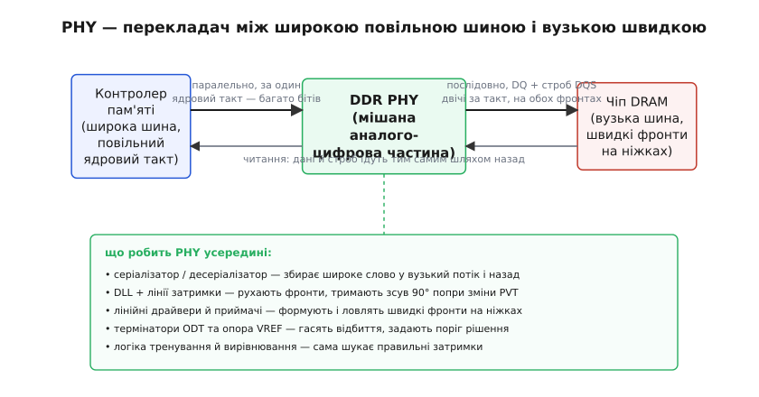
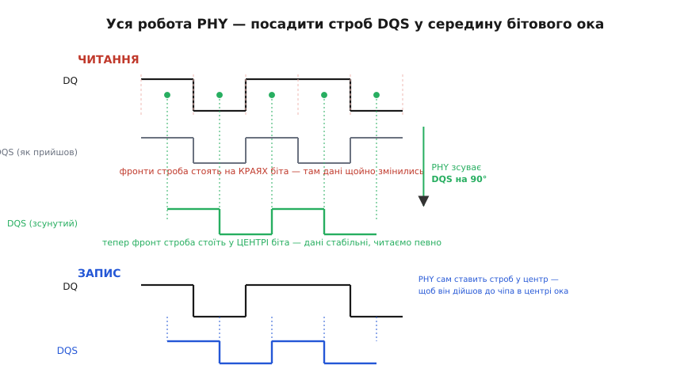
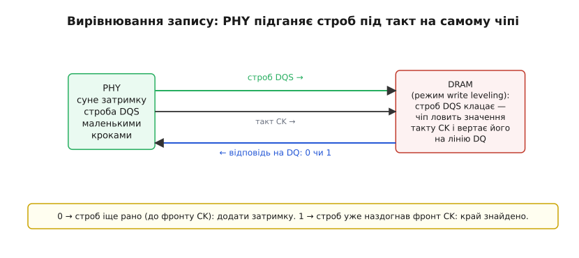

# DDR PHY: фізичний рівень DDR-інтерфейсу

[Пам'ять DDR](topic:hw-arch/sdram-ddr) віддає дані вражаюче швидко: слово на кожному фронті такту, кілька гігабайтів за секунду з однієї планки. Але між гарним протоколом на папері й дротами на платі лежить прірва. Протокол каже «поклади байт на шину й зніми його на фронті строба». Реальність каже інше: провідник має власну затримку, фронт сигналу не миттєвий, дві сусідні лінії DQ доходять до чіпа не одночасно, температура плати повзе — і той строб, яким ми хочемо зловити дані, приходить не туди, куди треба, а на пів біта збоку. На частотах у сотні мегагерц і вище, де один біт живе одиниці наносекунд, ця неточність — не дрібниця, а різниця між «пам'ять працює» і «пам'ять сипле помилки».

**DDR PHY** (від англ. *physical layer*, фізичний рівень — той самий найнижчий шар моделі OSI, що відповідає за передавання самих бітів по фізичному середовищу) — це вузол, який цю прірву закриває. Він сидить між [контролером пам'яті](topic:hw-arch/memory-controller), що мислить командами й адресами, і власне чіпом DRAM, що мислить напругами на ніжках. Контролер каже «прочитай ці вісім слів» — а PHY перетворює це на реальні фронти на реальних дротах, ловить те, що приходить назад, і, найголовніше, **сам підлаштовує затримки**, щоб строб щоразу падав точно в центр даних. Це не цифрова логіка в чистому вигляді: PHY — мішана аналого-цифрова частина, де живуть лінії затримки, підсилювачі, термінатори й опорні напруги. Розберімо, **навіщо** він потрібен, **що** робить і **чому** без нього швидка пам'ять просто не завелася б.

*Ліворуч контролер працює широкою шиною на повільному ядровому такті — багато бітів за один такт. Праворуч чіп DRAM працює вузькою шиною на швидких фронтах — по кілька бітів за такт, на обох фронтах. PHY посередині перекладає одне в інше в обидва боки: під час запису він розкладає широке слово у вузький швидкий потік, під час читання збирає назад. Усередині нього — серіалізатор, лінії затримки з петлею DLL, лінійні драйвери й приймачі, термінатори та логіка, що сама шукає правильні затримки.*

### Чому строб — це окремий провід, а не спільний такт

Найперше питання: як приймач узагалі знає, **коли** дивитися на лінію даних? У звичайній синхронній схемі відповідь очевидна — є [спільний тактовий сигнал](topic:hw-digital/clock-signal), усі клацають по його фронту. Але для швидкої пам'яті цей підхід ламається, і причина фізична.

Уявіть, що контролер і чіп ділять один такт, розведений по платі. Дані летять від чіпа до контролера якийсь час — скажімо, час поширення по доріжці плюс затримка виходу чіпа. Такт же для обох «однаковий». На повільній частоті ця затримка — крихітна частка періоду, нею можна знехтувати. Але підніміть частоту так, що період став коротший за час польоту сигналу по платі, — і виходить безглуздя: дані ще в дорозі, а «спільний» фронт такту біля контролера вже настав. Приймач клацає по порожньому місцю. Спільний такт мовчазно припускає, що сигнал долітає миттєво; на високій швидкості це припущення хибне.

Рішення, яке лежить в основі всієї швидкої пам'яті, зветься **джерело-синхронним** (англ. *source-synchronous*, синхронний від джерела): хто дані **посилає**, той разом із ними посилає й **строб** — окремий сигнал-мітку, що каже «ось зараз дійсне слово». Строб іде **тим самим шляхом**, що й дані, тими самими доріжками поряд, тож зазнає **тієї самої** затримки. Дані затрималися в дорозі на 2 наносекунди — строб теж на 2 наносекунди. Приймач більше не дивиться на далекий спільний такт; він дивиться на строб, що прийшов **разом** із даними, і їхній взаємний зсув уже не залежить від довжини доріжки. У DDR цей строб зветься **DQS** (від *data strobe*, строб даних), а самі лінії даних — **DQ** (*data*). На кожні вісім ліній DQ припадає своя пара DQS, тож байт має власну мітку часу.

> 🔧 **Навіщо це.** Джерело-синхронність — причина, чому в даташиті DDR ви бачите строгі вимоги «доріжки DQ і DQS однієї групи розводити однаковою довжиною, з точністю до часток міліметра». Це не примха: якщо DQS пройде на пів наносекунди інакше, ніж його DQ, строб перестане збігатися з даними, і жодне тренування вже не врятує. Правило рівної довжини (англ. *length matching*) прямо випливає з того, що строб і дані мусять зазнати спільної затримки.

### Головна робота PHY: посадити строб у центр ока

Джерело-синхронність вирішує проблему довгої доріжки, але лишає тонший клопіт — **де саме** стоїть фронт строба відносно вікна даних. І тут читання й запис поводяться по-різному, що дуже показово.

Кожне дійсне слово даних живе на лінії якийсь час — від моменту, коли встановилося, до моменту, коли зміниться на наступне. Це вікно стабільності і є [оком](topic:hw-pcb/eye-diagram) — просвіт, у якому дані певні. Приймач мусить клацнути **всередині** ока, подалі від країв: клацнеш на краю — упіймаєш дані в мить перемикання, коли вони пливуть, і рішення буде випадковим. У термінах [тригера, що ловить дані](topic:hw-digital/d-flip-flop), край ока — це зона порушення [часу встановлення й утримання](topic:hw-digital/metastability-timing): якщо строб клацне надто близько до зміни даних, тригер може впасти в метастабільний стан і видати нісенітницю. Отже, правило одне: **фронт строба — у центр ока**. Уся хитрість PHY — досягти цього і на читанні, і на записі, попри те, що строб приходить у різних фазах.

*Читання (угорі): чіп DRAM видає дані й строб DQS у фазі — фронти строба стоять на самих КРАЯХ біта, де дані щойно змінились. Клацнути так не можна. Тому PHY зсуває вхідний DQS на 90° (на чверть періоду), і тоді фронт падає в ЦЕНТР біта, де дані стабільні. Запис (унизу): тут PHY — джерело, тож він одразу видає строб, зсунутий на 90° від даних, аби той дійшов до чіпа центр-вирівняно.*

**Читання: дані приходять «фронт у фронт».** Коли контролер читає, дані посилає чіп DRAM. За стандартом він видає DQS **у фазі** з даними — фронт строба збігається з початком кожного біта. Це зветься **фронт-вирівняно** (англ. *edge-aligned*): строб і дані стартують одночасно. Для приймача це найгірше: фронт строба стоїть рівно там, де дані перемикаються. Тому вся відповідальність — на PHY: він мусить узяти вхідний DQS і **зсунути його на 90°** (на чверть періоду такту) відносно даних. Чому саме 90°? Бо повний період DQS — це два біти (строб клацає на обох фронтах), тож один біт займає 180° строба; половина біта, тобто шлях від краю до центру, — це 90°. Зсунувши строб на цю чверть, PHY переносить фронт із краю ока в його середину — і аж тоді ловить дані.

**Запис: PHY сам вирішує, де поставити строб.** Коли контролер пише, джерело — це вже PHY. Тепер ніхто ззовні не диктує фазу; PHY будує строб сам. І будує його одразу **центр-вирівняно** (англ. *center-aligned*): DQS виходить зсунутим на 90° від даних, щоб на іншому кінці доріжки, уже біля чіпа, фронт строба впав точно в центр вікна DQ. Чіп DRAM усередині не має ніякої логіки підстроювання — він тупо клацає по стробу; тож завдання «влучити в центр» повністю лягає на PHY-джерело.

Обидва випадки роблять те саме — ставлять фронт у центр, — але з різних боків. На читанні PHY **приймає** й доводить чужий строб; на записі PHY **видає** свій строб наперед зсунутим. Цей зсув на 90° — центральна дія всього фізичного рівня, і саме заради нього в PHY живуть **лінії затримки**.

### Звідки береться точна затримка: DLL і лінії затримки

Легко сказати «зсунь на 90°». Важко зробити це точно й **утримати** точним. Затримка в мікросхемі — не константа: вона повзе від температури, від напруги живлення, від розкиду параметрів під час виготовлення кристала. Ці три чинники разом звуть **PVT** (від англ. *process, voltage, temperature* — процес виготовлення, напруга, температура). Лінія затримки, налаштована на рівно чверть періоду за кімнатної температури, за годину роботи під навантаженням нагріється й дасть уже не чверть, а, скажімо, третину — і строб знову з'їде з центру.

Щоб цьому протидіяти, PHY робить затримку не сліпою, а **самопідстроювальною**. Класичний спосіб — **DLL** (від англ. *delay-locked loop*, петля із замкненою затримкою). Ідея елегантна: візьмімо ланцюжок керованих елементів затримки й додаймо петлю зворотного зв'язку, яка порівнює затриманий сигнал із опорним і **сама** підкручує елементи так, щоб затримка дорівнювала рівно чверті періоду — хоч би що робили температура й напруга. PVT попливло — петля тут же скоригувала елементи назад. Так DLL тримає зсув 90° сталим у русі, без втручання контролера. Це той самий принцип, що в петлі частоти, тільки замкнено не частоту, а саме затримку.

> 🔧 **Навіщо це.** DLL — причина, чому DDR-пам'ять має **мінімальну робочу частоту**, нижче якої вона просто не працює. Петля затримки вміє зловити фазу лише у певному діапазоні періодів; опустіть такт надто низько — і DLL не «замкнеться», зсув 90° розсиплеться. Тому не можна взяти швидку DDR3 і повільно «покрокувати» нею на кілька мегагерц для налагодження: нижче за паспортний поріг вона не заведеться взагалі. Це прямий наслідок того, що весь захоплення фази стоїть на замкненій петлі.

### Кожна лінія — своя затримка: деск'ю

Досі ми говорили про один зсув на цілу групу. Але вісім ліній DQ у групі фізично не однакові: одна доріжка на плитці на пів міліметра довша, інша йде повз перехідний отвір, у третьої трохи інше навантаження. Кожна з цих дрібниць додає свою затримку, тож біти, що вийшли з чіпа одночасно, доходять до PHY **не** одночасно — розповзаються в часі. Це розповзання зветься **пере́кіс** (англ. *skew*). Якщо його не прибрати, спільний строб не влучить у центр для всіх ліній одразу: для однієї він у центрі, для сусідньої вже на краю.

Тому в сучасному PHY лінія затримки стоїть **на кожній лінії DQ окремо**, а не одна на групу. PHY може підсунути кожен біт індивідуально, вирівнявши їхні центри в один вертикальний ряд, — і аж тоді накласти строб. Цю індивідуальну підгонку звуть **деск'ю** (англ. *deskew*, усунення перекосу). Що вища швидкість, то дрібніші перекоси стають критичними, тож у DDR4 і особливо DDR5 деск'ю на кожен вивід — обов'язкова частина фізичного рівня.

### Тренування: PHY сам знаходить правильні затримки

Тут виникає найглибше питання. Скільки саме затримки додати на кожну лінію? На скільки зсунути строб? Наперед, з даташита, цього **не порахувати**: точні значення залежать від конкретної плати, довжини саме цих доріжок, саме цього екземпляра чіпа, поточної температури. Двi однакові з вигляду плати дадуть різні числа. Значить, PHY мусить знайти їх **сам**, уже після ввімкнення, вимірявши реальний тракт. Цей процес самонастроювання зветься **тренуванням** (англ. *training*), або калібруванням, і без нього жоден швидкий DDR не стартує.

Тренування — це кілька окремих кроків, кожен полагоджує свою затримку. Найпоказовіший — **вирівнювання запису** (англ. *write leveling*). Задача: строб DQS, який PHY посилає на запис, має прийти до чіпа вирівняним із загальним тактом CK; але через розводку плати вони можуть розійтися, і треба знайти, на скільки затримати строб, щоб вони зійшлися. Розумний трюк у тому, що **сам чіп допомагає** його виміряти.

*У режимі вирівнювання запису PHY посилає строб DQS, а чіп DRAM у момент фронту строба ловить поточне значення загального такту CK і вертає його назад на лінію DQ. Відповідь 0 означає «строб клацнув, поки CK ще був низький» — строб прийшов зарано, треба додати затримки. Відповідь 1 означає «строб уже застав високий CK» — фронти зійшлися. PHY крокує затримкою, доки відповідь не перемкнеться з 0 на 1: ця мить і є знайдений край.*

Механізм такий. Контролер командою переводить чіп у режим вирівнювання запису (у DDR3 і DDR4 це запис у регістр режиму MR1). У цьому режимі чіп робить дивну, але корисну річ: щоразу, коли на його вхід приходить фронт строба DQS, він **защіпає** поточний рівень загального такту CK і **віддає** цей рівень назад на лінію даних DQ. Тепер PHY просто крокує: посилає строб, дивиться на відповідь. Поки відповідь **0** — це означає, що в мить строба такт CK ще був низький, тобто строб клацнув **раніше** за фронт CK; треба додати затримки й спробувати ще. Щойно відповідь стала **1** — строб застав CK уже високим, фронти зійшлися. Мить переходу з 0 на 1 і є шукана затримка. PHY знайшов її сам, вимірявши реальну плату, — і записав у свою лінію затримки.

За тим самим духом ідуть інші кроки. **Захоплення строба читання** (англ. *DQS gate*) вчить PHY, у яке саме вікно часу відкривати «ворота» для вхідного DQS, щоб упіймати справжні фронти строба, а не шум на лінії між пакетами. **Тренування читання** пробує різні затримки й зсуви й шукає ті, за яких око найширше розкрите — тобто де запас найбільший. Логіка перебирає варіанти, щоразу перевіряючи по відомому взірцю даних, влучає читання чи ні, і зупиняється на середині діапазону, що працює, — найдалі від обох країв, де починаються помилки. Уся ця самонастройка — окремий цифровий автомат усередині PHY: він проганяє алгоритми пошуку затримок над дискретизованими відповідями чіпа, тож фізичний рівень водночас і аналоговий (лінії затримки, драйвери), і цифровий (логіка, що ними керує).

> 🔧 **Навіщо це.** Тренування пояснює, чому комп'ютер після вмикання «думає» якусь мить, перш ніж стартувати, і чому в BIOS буває пункт про «memory training». Перший старт із новою планкою довший: PHY проганяє повний пошук затримок. Далі знайдені числа часто зберігають і за наступного ввімкнення лише швидко перевіряють — тому «холодний» старт повільніший за звичайний. І якщо пам'ять на межі стабільності, збій часто саме тут: тренування знайшло вузьке око, запас малий, і на спеці строб з'їжджає за край. Розробникові вбудованих систем це каже головне: DDR не можна просто «підключити й читати» — контролер мусить провести повний цикл тренування, інакше шина не запрацює.

### Аналогова частина: термінатори, опора й вирівнювання рівнів

Точна затримка — половина справи; друга половина — щоб сам **сигнал** на швидкій лінії був чистий. На частотах DDR доріжка плати поводиться як лінія передачі: різкий фронт, дійшовши до кінця, **відбивається** назад, накладається на наступні біти й псує око. Щоб цього не було, кінець лінії треба **погасити** — поставити опір, що дорівнює хвильовому опору доріжки, аби енергія фронту поглиналась, а не відбивалась.

Ставити такі резистори зовні, на плату, для десятків швидких ліній незручно й неточно. Тому термінацію **втягнули всередину** — і в чіп DRAM, і в PHY. Це **ODT** (від англ. *on-die termination*, термінація на кристалі): керований резистор просто на кристалі, біля самого виводу. Розумний контролер вмикає ODT там, куди сигнал прилітає, і вимикає там, звідки виходить, — динамічно, залежно від того, хто зараз пише, а хто читає. Так відбиття гаснуть на кожному напрямку без жодної зовнішньої деталі.

Другий бік чистоти — **де провести межу** між нулем і одиницею. На малих розмахах напруги фіксований поріг не годиться: він попливе разом із живленням і завадами. Тому DDR використовує **опорну напругу** **VREF** — окремий рівень «посередині», з яким приймач порівнює лінію: вище VREF — одиниця, нижче — нуль. У DDR4 і DDR5 цю опору теж **тренують**: PHY перебирає значення VREF і шукає те, за якого око найширше по вертикалі, — так поріг сідає точно в середину розмаху саме цієї плати. Разом ODT і рухома опора VREF дають приймачеві чистий сигнал і правильно поставлену межу — без них навіть ідеально вирівняний у часі строб клацав би по спотвореному оку. Різні покоління тут відрізняються самим стилем сигналу — від класичного SSTL у DDR3 до економнішого псевдо-відкритого стоку в DDR4/DDR5 і додаткового вирівнювання форми фронту в DDR5; докладніше — у [вставці про сигнальні стандарти й вирівнювання в DDR](topic:hw-arch/ddr-phy/comp-ddr-io-signaling.md).

### Серіалізатор: як вузька швидка шина стикується з широким повільним ядром

Лишилася остання, дуже практична роль PHY. Усередині мікросхеми логіка контролера працює на **повільному** такті, зате **широкою** шиною — обробляє багато бітів за один такт. Ніжки ж DDR — навпаки: їх мало, зате вони перемикаються **швидко**, кілька разів за такт. Хтось має ці два світи звести. Це й робить **серіалізатор** (англ. *serializer*, від *serial*, послідовний) на записі й **десеріалізатор** на читанні.

Причина, чому світи різні, — у самій пам'яті. Масив комірок DRAM повільний, тож щоб устигати за швидкою шиною, чіп за одне внутрішнє звернення дістає одразу цілу пачку сусідніх слів — це [попередня вибірка (prefetch)](topic:hw-arch/sdram-ddr). У DDR3 і DDR4 пачка — вісім слів, у DDR5 — шістнадцять. Ці вісім чи шістнадцять слів народжуються всередині **разом**, за один повільний такт, широкою внутрішньою шиною, а на вузькі ніжки їх треба випустити **по черзі**, швидко, на обох фронтах. Серіалізатор саме це й робить: бере широке слово з ядра й вистрілює його назовні потоком бітів на високому темпі. На читанні десеріалізатор ловить швидкий вхідний потік і збирає назад у широке повільне слово для ядра. По суті це перемикач швидкостей: широко-й-повільно ↔ вузько-й-швидко, у сталому співвідношенні (наприклад, ядро на чверть темпу шини випускає чотири біти за такт). Прибрати серіалізатор не можна: без нього повільна цифрова логіка ніяк не встигла б формувати біти в темпі швидких ніжок.

Ось чому DDR PHY — окремий, спеціалізований і нетривіальний вузол, а не просто набір буферів. Він джерело-синхронно розводить дані й строб, зсуває строб на 90° у центр ока й тримає цей зсув попри PVT, деск'юить кожну лінію, **сам** тренуванням знаходить усі затримки й опору під конкретну плату, гасить відбиття термінацією та перемикає широку повільну шину ядра у вузьку швидку шину ніжок. Кожна з цих дій — відповідь на конкретну фізичну ваду, що виникає, щойно біти починають летіти достатньо швидко. Приберіть будь-яку — і красивий протокол DDR лишиться на папері, бо на реальних дротах сигнал не зійдеться.
