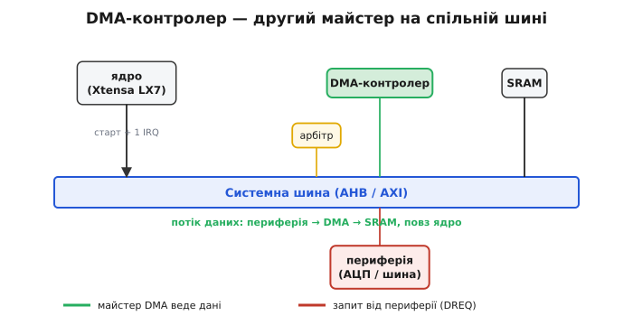
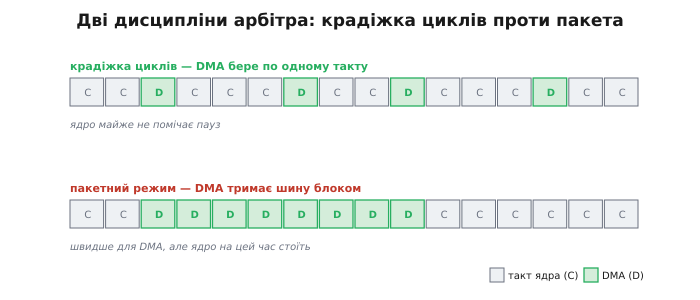
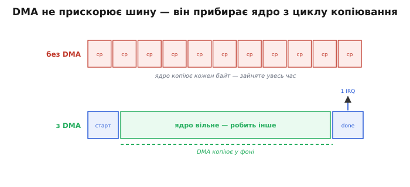

# DMA-контролер

Коли периферія сипле дані потоком, [гнати кожен байт через ядро марнотратно](topic:hw-arch/dma-problem) — але хто тоді їх возить? Відповідь: окремий апаратний блок на тій самій шині, що й ядро. Уявіть фізичну схему системи на кристалі: ядро Xtensa LX7, блок SRAM, блоки периферії — і між ними системна шина AHB/AXI. До тієї самої шини підключений ще один невеликий автомат — **DMA-контролер** (англ. *Direct Memory Access* — «прямий доступ до пам'яті»). Він уміє рівно одне: дістати команду «перенеси N байтів з адреси джерела на адресу призначення» й виконати її, посилаючи на шині такі самі транзакції, які слало б ядро.

Різниця в тому, що ядро тим часом вільне для будь-якої іншої роботи.


*DMA — другий майстер на спільній шині. Стрілка даних іде периферія → DMA → SRAM, обходячи ядро. Ядро тільки налаштовує маршрут і наприкінці отримує одне переривання. Арбітр вирішує, кому з майстрів зараз належить шина.*

## Як ядро запускає передачу

Сам DMA-контролер — теж периферія [з відображенням у пам'ять](topic:hw-arch/memory-mapped-io). Ядро готує передачу, записуючи кілька його регістрів: адресу джерела, адресу призначення, кількість байтів, напрям і параметри (ширина слова, режим кільця тощо). Останнім записує біт «старт» у регістр керування — і відходить. Усе подальше копіювання йде без ядра.

Ось як це виглядає в коді на типовому контролері з регістровим DMA. Регістри тут — за фіксованими адресами в карті пам'яті; ми пишемо в них через `volatile`-покажчики (бо це апаратура, а не звичайна пам'ять):

```c
#include <stdint.h>

/* Регістри одного каналу DMA (адреси умовні, з даташита) */
#define DMA_SRC    (*(volatile uint32_t *)0x3FF1F000)  /* адреса джерела     */
#define DMA_DST    (*(volatile uint32_t *)0x3FF1F004)  /* адреса призначення */
#define DMA_LEN    (*(volatile uint32_t *)0x3FF1F008)  /* кількість байтів   */
#define DMA_CTRL   (*(volatile uint32_t *)0x3FF1F00C)  /* регістр керування  */

#define DMA_DIR_M2P  (1u << 1)   /* напрям: пам'ять → периферія */
#define DMA_WIDTH_32 (2u << 2)   /* ширина слова: 32 біти       */
#define DMA_IE_DONE  (1u << 8)   /* дозволити переривання «готово» */
#define DMA_START    (1u << 0)   /* запуск каналу                */

/* Налаштувати й запустити одну передачу пам'ять → периферія */
void dma_start_tx(const void *src, volatile void *dst, uint32_t nbytes) {
    DMA_SRC  = (uint32_t)src;          /* звідки беремо   */
    DMA_DST  = (uint32_t)dst;          /* куди кладемо    */
    DMA_LEN  = nbytes;                 /* скільки байтів  */
    DMA_CTRL = DMA_DIR_M2P | DMA_WIDTH_32 | DMA_IE_DONE | DMA_START;
    /* керування повернулося негайно — копіює вже DMA, не ядро */
}
```

Звертає на себе увагу остання дрібниця: щойно записано біт `DMA_START`, функція повертає керування. Ядро вже вільне, а байти ще навіть не почали їхати — їх повезе контролер. Це і є вся суть прийому.

> 🔧 **Навіщо це.** Так виглядає драйвер будь-якої швидкої периферії: налаштувати канал, дати старт, піти робити інше, прокинутися на перериванні «готово». Тому передачу великого кадру з дисплея чи блоку відліків з АЦП оформлюють саме через DMA — ядро не застряє у вивантаженні байтів.

Один такий набір регістрів — джерело, призначення, лічильник, керування — і є **канал** DMA. Контролер зазвичай має кілька каналів, тож різні передачі (скажімо, АЦП у пам'ять і пам'ять на SPI-дисплей) ідуть незалежно, кожна своїм каналом. Наша функція описує одну-єдину тяглу передачу від адреси до адреси; коли ж потрібно зшити кілька розкиданих шматків пам'яті в один потік, параметри передач виносять у [таблицю описів-дескрипторів](topic:hw-arch/dma-channels), і контролер сам переходить від одного до наступного. Але базова ідея незмінна: ядро колись наперед описало роботу, а далі лише чекає сигналу «готово».

## Майстер шини

Будь-хто, хто може сам починати транзакції на шині (не питаючи дозволу в іншого пристрою), зветься **майстром шини** (англ. *bus master* — «господар шини»). Ядро — майстер. DMA — теж майстер. Але шина одна, а два майстри не можуть говорити одночасно. Хто з них зараз володіє шиною, вирішує **арбітр**: майстер піднімає лінію запиту шини, арбітр відповідає лінією надання — і лише тоді майстер шле транзакцію. Така схема, де периферія здатна сама стати майстром і писати в пам'ять без участі ядра, зветься першорядним (англ. *first-party*) DMA — на відміну від старих систем, де копіюванням керував один центральний контролер.

З того, що шина спільна, випливає природне питання: як два майстри її ділять? Тут є дві дисципліни, і вони задають різний компроміс між швидкістю DMA та відгуком ядра.


*Дві дисципліни поділу шини. Угорі — крадіжка циклів: DMA бере один такт і віддає шину назад, ядро майже не помічає пауз. Унизу — пакетний режим: DMA тримає шину суцільним блоком, копіює швидше, але на цей час ядро стоїть.*

За **крадіжки циклів** (англ. *cycle stealing* — «крадіжка такту») DMA забирає шину рівно на одну передачу, переносить одне слово й одразу віддає шину назад. Ядро при цьому не перемикає контекст — його лише на мить притримують перед самим зверненням до шини, тож воно майже не помічає, що шина на такт перейшла до іншого майстра. Якщо ядро взагалі не торкається шини (наприклад, крутить код із кешу), крадіжка циклів для нього геть невидима.

Протилежна дисципліна — **пакетний режим** (англ. *burst mode*): DMA захоплює шину й тримає її, поки не перенесе весь блок, і лише потім віддає ядру. Так копіювання завершується швидше, бо нема постійних перезахоплень шини, — але ядро на весь цей час від шини відрізане. Між цими крайнощами й вибирає розробник: плавний відгук ядра проти найкоротшого часу передачі.

Тут ховається й чесне застереження. «Ядро вільне» — правда лише доти, доки воно не лізе по ту саму пам'ять, що й DMA. Якщо ядро виконує код із кешу й читає свої дані звідти, два майстри не заважають одне одному. Та щойно ядру теж знадобиться SRAM, до якої зараз пише DMA, арбітр пропустить лише одного — другий чекатиме. Це й зветься **суперництвом за пам'ять** (англ. *memory contention*): шина та банк пам'яті фізично одні, тож паралелізм ядра й DMA не безмежний. На практиці його послаблюють, розводячи дані по різних банках SRAM або вмикаючи крадіжку циклів замість пакета — щоб ядро не простоювало довгими шматками. Тому DMA не «магічно подвоює» систему: він прибирає ядро з рутинного перекладання байтів, але фізичну пам'ять обидва майстри все одно ділять.

## Звідки береться сигнал

Периферія не чекає, поки DMA сам здогадається прийти по дані. Коли АЦП зробив вимір і його регістр даних готовий, периферія піднімає лінію **DMA-запиту** (англ. *DMA request*, DREQ). Контролер реагує на цей сигнал апаратно — без жодної участі ядра — і переносить готове слово в буфер. Так синхронізація потоку лягає цілком на залізо: ядро не бере участі ні в опитуванні готовності, ні в самому копіюванні.

## Одне переривання на блок

Коли DMA переніс увесь замовлений блок, він піднімає переривання «готово» (англ. *transfer complete*). Ядро прокидається, забирає повний буфер і, якщо потрібно, ставить наступну передачу. Це рідкісна й корисна подія, а не щоразова. У [виборі між опитуванням і перериваннями](root:embedded/polling-vs-interrupts) DMA різко зсуває баланс на користь переривань: тепер переривання приходить не на кожен байт, а на кожен буфер. Ось як це рахується для потоку 500 КБ/с:

```
Без DMA (переривання на кожен байт):
  f_data = 500 000 байт/с
  ISR/с  = 500 000

З DMA (буфер 1024 байти):
  ISR/с  = 500 000 / 1024 ≈ 488

Частка ядра при 120 тактів/ISR, 240 МГц:
  Без DMA: 500 000 · 120 / 240 000 000 = 25%
  З DMA:   488 · 120 / 240 000 000     ≈ 0.024%
```

Тисячократна різниця — не тому, що DMA «швидша» апаратура: байт іде через шину рівно стільки ж часу. Різниця в тому, що **ядро звільнене** — воно більше не стоїть між кожним байтом і пам'яттю, а отже й не входить в обробник переривання щобайта.


*Без DMA ядро в постійному циклі «копіюй-копіюй-копіюй». З DMA ядро дало старт, далі велика вільна зона (DMA копіює у фоні), а наприкінці — одна стрілка «done» назад у ядро. Виграш не в швидшій шині, а у звільненому часі ядра.*

Варто назвати й зворотний бік. Для дуже коротких блоків (десятки байтів) DMA бере **фіксовану стартову плату**: записати регістри, налаштувати канал, дочекатися переривання готовності. У цьому діапазоні звичайний `memcpy` виграє — поки ядро налаштовувало б DMA, воно вже скопіювало б усі ці байти саме. Де саме проходить межа, залежить від конкретної периферії й шини, але зазвичай це 64–256 байтів; докладний вимір і модель порога — у вставці [memcpy проти DMA](topic:hw-arch/dma-controller/proj-memcpy-vs-dma.md).
