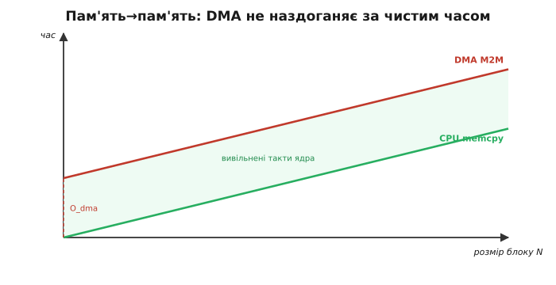
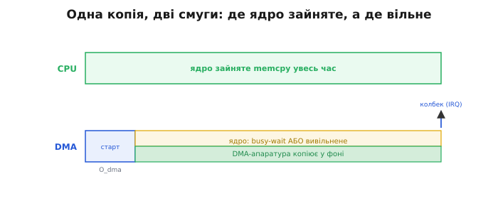

# ⚙️ memcpy проти DMA: коли виграє ядро

## Задача

Картина складається природно: раз DMA — окремий апаратний копіювальник, то великий блок пам'яті варто передати йому, ядро звільниться й усе буде швидше. Логіка проста й приваблива. Але є питання, яке варто поставити вголос: великий блок пам'ять→пам'ять — хто реально швидший і **при якому розмірі**: CPU з бібліотечним `memcpy` чи M2M-DMA-передача? І скільки коштує сам запуск DMA?

Відповідь містить парадокс: на малому блоці найчастіше виграє CPU — бо DMA має фіксовану «плату за вхід», яку треба відпрацювати. Розберімо, чому так відбувається.

---

## Ідея

### Дві вартості, які треба розрізняти

Будь-яка операція копіювання має дві складові ціни: **пропускну** (скільки байтів за такт може перекласти механізм) і **фіксований оверхед запуску** (що треба зробити до першого переміщеного байта).

Для `memcpy` накладні витрати мізерні: виклик функції, кілька інструкцій підготовки циклу — і ядро одразу починає переносити слова по шині. Далі — потактове копіювання, і процесор зайнятий увесь час.

Для DMA картина інша: ядро спочатку налаштовує регістри каналу (джерело, призначення, розмір, режим), дає команду «старт» і чекає сигналу готовності — переривання або прапорця. Лише після цього налаштування, яке займає сотні–тисячі тактів залежно від складності API, DMA-апаратура починає рухати байти. Зате під час самої передачі **ядро вільне** — теоретично.

З цього розриву виростає вся динаміка вибору: `memcpy` не платить нічого за старт, але займає ядро увесь час; DMA платить фіксований старт, зате потім — не займає.

### Звідси — модель порога

Загальний час до завершення копії можна записати формулою:

```
T_cpu = 0 + N · t_per_byte
T_dma = O_dma + N · t_per_byte
```

де `N` — розмір блоку в байтах, `t_per_byte` — час на байт, `O_dma` — фіксовані накладні витрати запуску DMA. Ключовий момент: для **пам'ять→пам'ять** обидва механізми використовують **ту саму шину й ту саму SRAM**. Тому нахили обох прямих практично рівні — DMA не «швидший», він просто йде тим самим каналом. Прямі майже паралельні.

Що це означає? Пряма DMA завжди вища за CPU-пряму на величину `O_dma` — вона **ніколи не перетне CPU-пряму знизу** і не дасть виграшу в чистому часі «від старту до готовності». Єдина зона, де DMA «виграє», — це вивільнені такти ядра під час передачі: якщо ядру є чим зайнятись паралельно, ці такти перетворюються на реальну продуктивність. Якщо немає — виграшу немає. Справжню роботу DMA отримує, коли копіює потоком із периферії — [з АЦП](root:embedded/dma-adc) чи [по SPI/I2S](root:embedded/dma-spi-i2s), а не пам'ять у пам'ять.

> 🔧 **Навіщо це**
> Перш ніж «оптимізувати» копію через DMA, зміряй. На малих і нечастих передачах накладні витрати DMA з'їдають весь уявний виграш, а код суттєво ускладнюється: потрібні колбек, прапорець готовності, ISR. Спершу профіль — рефакторинг потім.



*Час копії залежно від розміру блоку. CPU-`memcpy` стартує майже з нуля й росте з нахилом «такт/байт»; DMA стартує з фіксованих накладних витрат `O_dma` й росте тим самим нахилом (та сама пам'ять). Прямі майже паралельні — DMA не наздоганяє за чистим часом; його виграш — вивільнені такти ядра (заштрихована зона), якими воно може зайнятись іншим.*

---

## Вимірювальний стенд

### Як міряти чесно

Найточніший інструмент тут — **цикловий лічильник ядра**: майже кожне сучасне ядро має регістр, що інкрементується щотакту, і читання цього регістра коштує одну інструкцію. Називається він скрізь по-різному: `DWT->CYCCNT` на Cortex-M, `esp_cpu_get_cycle_count()` на ESP32. Копія блоку займає десятки–тисячі тактів, а лічильник рахує кожен із них без власних накладних витрат. Такти ÷ тактову частоту ядра = час у секундах, звідси — байти/с. Альтернатива через [лічильник мікросекунд](root:sf-devices/millis-micros) — `micros()` в Arduino, `esp_timer_get_time()` в ESP-IDF — надто груба для таких коротких операцій.

**Таймер CPU-копії:**

:::tabs
```arduino
#include <Arduino.h>

/* Буфери — 4-байтово вирівняні (копіювальник іде словами, не байтами) */
static uint8_t src[4096] __attribute__((aligned(4)));
static uint8_t dst[4096] __attribute__((aligned(4)));

/* Зчитати цикловий лічильник ядра (плата на ESP32) */
static inline uint32_t cyc(void) {
    return esp_cpu_get_cycle_count();
}

/* Повертає кількість тактів, потрачених на memcpy(d, s, n) */
uint32_t bench_memcpy(void *d, const void *s, size_t n) {
    uint32_t t0 = cyc();
    memcpy(d, s, n);
    uint32_t t1 = cyc();
    return t1 - t0;   /* різниця тактів; про обгортання лічильника — нижче */
}
```
```esp-idf
#include <string.h>
#include "esp_cpu.h"
#include "esp_log.h"

static const char *TAG = "bench";

/* Буфери — 4-байтово вирівняні (копіювальник іде словами, не байтами) */
static uint8_t src[4096] __attribute__((aligned(4)));
static uint8_t dst[4096] __attribute__((aligned(4)));

/* Зчитати цикловий лічильник ядра */
static inline uint32_t cyc(void) {
    return esp_cpu_get_cycle_count();
}

/* Повертає кількість тактів, потрачених на memcpy(d, s, n) */
uint32_t bench_memcpy(void *d, const void *s, size_t n) {
    uint32_t t0 = cyc();
    memcpy(d, s, n);
    uint32_t t1 = cyc();
    return t1 - t0;   /* різниця тактів; про обгортання лічильника — нижче */
}

void app_main(void) {
    ESP_LOGI(TAG, "memcpy 4096 Б: %u тактів",
             (unsigned)bench_memcpy(dst, src, sizeof(src)));
}
```
```stm32
#include "stm32f4xx_hal.h"
#include <string.h>

/* Буфери — 4-байтово вирівняні (копіювальник іде словами, не байтами) */
static uint8_t src[4096] __attribute__((aligned(4)));
static uint8_t dst[4096] __attribute__((aligned(4)));

/* На Cortex-M3/M4/M7 цикловий лічильник — це DWT->CYCCNT з блока налагодження;
   на відміну від ESP32 його треба ввімкнути руками, один раз при старті */
static void cyc_init(void) {
    CoreDebug->DEMCR |= CoreDebug_DEMCR_TRCENA_Msk;
    DWT->CYCCNT = 0;
    DWT->CTRL  |= DWT_CTRL_CYCCNTENA_Msk;
}

static inline uint32_t cyc(void) {
    return DWT->CYCCNT;
}

/* Повертає кількість тактів, потрачених на memcpy(d, s, n) */
uint32_t bench_memcpy(void *d, const void *s, size_t n) {
    uint32_t t0 = cyc();
    memcpy(d, s, n);
    uint32_t t1 = cyc();
    return t1 - t0;   /* різниця тактів; про обгортання лічильника — нижче */
}
```
:::

Тепер те саме для DMA. Робота від середовища вимагається однакова: налаштувати канал на режим пам'ять→пам'ять, дати старт і дізнатися про завершення — з колбека або з прапорця переривання. Розписувати [дескриптори й канали DMA](root:hw-arch/dma-channels) вручну тут не будемо: там, де середовище дає готовий M2M-примітив (`esp_async_memcpy` в ESP-IDF), беремо його; де готового нема, канал заводиться через вендорний HAL (STM32). Для нас це чорна скринька: «DMA-копіювальник на шині».

**Таймер DMA-копії:**

:::tabs
```esp-idf
#include "esp_async_memcpy.h"

/* Одноразове налаштування драйвера (виконується один раз при старті) */
static async_memcpy_handle_t mcp_handle;

void dma_init(void) {
    async_memcpy_config_t cfg = ASYNC_MEMCPY_DEFAULT_CONFIG();
    esp_async_memcpy_install(&cfg, &mcp_handle);
}

/* Прапорець готовності — volatile: колбек виконується в ISR */
static volatile bool dma_done;

/* Колбек готовності — IRAM_ATTR обов'язковий: виконується в перериванні */
static bool IRAM_ATTR dma_cb(async_memcpy_handle_t h,
                              async_memcpy_event_t *e, void *arg) {
    dma_done = true;
    return false;   /* false = не будити вищепріоритетну задачу */
}

/* Повертає повний час "старт → готовність" у тактах (включаючи busy-wait) */
uint32_t bench_dma(void *d, void *s, size_t n) {
    dma_done = false;
    uint32_t t0 = cyc();
    esp_async_memcpy(mcp_handle, d, s, n, dma_cb, NULL);
    while (!dma_done) {}       /* busy-wait: ядро чекає завершення */
    uint32_t t1 = cyc();
    return t1 - t0;
}
```
```stm32
#include "stm32f4xx_hal.h"

/* Прапорець готовності — volatile: колбек виконується в ISR */
static volatile bool dma_done;
static DMA_HandleTypeDef hdma;

static void dma_cb(DMA_HandleTypeDef *h) { dma_done = true; }

/* Одноразове налаштування каналу (виконується один раз при старті) */
void dma_init(void) {
    __HAL_RCC_DMA2_CLK_ENABLE();          /* M2M вміє лише DMA2 на F4 */
    hdma.Instance                 = DMA2_Stream0;
    hdma.Init.Channel             = DMA_CHANNEL_0;
    hdma.Init.Direction           = DMA_MEMORY_TO_MEMORY;
    hdma.Init.PeriphInc           = DMA_PINC_ENABLE;   /* джерело теж інкрементуємо */
    hdma.Init.MemInc              = DMA_MINC_ENABLE;
    hdma.Init.PeriphDataAlignment = DMA_PDATAALIGN_WORD;
    hdma.Init.MemDataAlignment    = DMA_MDATAALIGN_WORD;
    hdma.Init.Mode                = DMA_NORMAL;
    hdma.Init.Priority            = DMA_PRIORITY_HIGH;
    hdma.Init.FIFOMode            = DMA_FIFOMODE_ENABLE;  /* у M2M FIFO обов'язкове */
    hdma.Init.FIFOThreshold       = DMA_FIFO_THRESHOLD_FULL;
    HAL_DMA_Init(&hdma);
    HAL_DMA_RegisterCallback(&hdma, HAL_DMA_XFER_CPLT_CB_ID, dma_cb);
    HAL_NVIC_EnableIRQ(DMA2_Stream0_IRQn);
}

void DMA2_Stream0_IRQHandler(void) { HAL_DMA_IRQHandler(&hdma); }

/* Повертає повний час "старт → готовність" у тактах (включаючи busy-wait) */
uint32_t bench_dma(void *d, void *s, size_t n) {
    dma_done = false;
    uint32_t t0 = cyc();
    /* у M2M джерело йде першим аргументом-адресою, а довжина рахується
       НЕ в байтах, а в елементах обраної розрядності — тут у словах */
    HAL_DMA_Start_IT(&hdma, (uint32_t)s, (uint32_t)d, n / 4);
    while (!dma_done) {}       /* busy-wait: ядро чекає завершення */
    uint32_t t1 = cyc();
    return t1 - t0;
}
```
:::

Важливо: `bench_dma` вимірює **повний час до готовності** — старт плюс очікування. Саме це чесно порівнювати з блокуючим `memcpy`: обидва повертають керування лише коли дані вже скопійовані.

### Що показують числа

На ESP32 (240 МГц, внутрішня SRAM) типова картина виглядає так:

- Накладні витрати запуску DMA через `esp_async_memcpy` — близько **2 000–5 000 тактів** (≈ 8–20 мкс при 240 МГц), враховуючи налаштування і час реакції переривання готовності.
- `memcpy` для 4-байтово вирівняного блоку — близько **≈ 0.3 такта/байт** (копія словами, без кеш-промахів у SRAM).

**Worked-приклад: поріг доцільності**

```
Дано (орієнтири, не даташит):
  O_dma    ≈ 2 000 тактів        (фіксовані накладні витрати DMA)
  k_cpu    ≈ 0.3 такта/байт      (CPU memcpy, вирівняне)
  k_dma    ≈ 0.3 такта/байт      (DMA M2M — та сама SRAM → той самий нахил)

Час CPU: T_cpu(N) = 0 + N · 0.3
Час DMA: T_dma(N) = 2 000 + N · 0.3

Різниця: T_dma - T_cpu = 2 000 тактів (константа, не залежить від N)

Висновок: DMA НІКОЛИ не перекриває CPU за чистим часом у M2M.
  При N = 1 КБ: CPU ≈ 307 тактів;  DMA ≈ 2 307 тактів (DMA у 7.5× повільніший).
  При N = 64 КБ: CPU ≈ 19 660;    DMA ≈ 21 660 (DMA повільніший на 10%).
  При N → ∞: різниця 2 000/N → 0, але ніколи не перевертається.

Реальний "поріг": не "байти", а "чи є ядру корисна паралельна робота".
  Якщо так — вивільнені такти (≈ N · 0.3) перетворюються на продуктивність.
  Якщо ядро стоїть у busy-wait — виграшу немає взагалі.
```

Отже, поріг доцільності DMA — не конкретний розмір блоку, а питання: **чим ядро займатиметься, поки DMA копіює?** Саме тут DMA отримує справжню роботу: коли він качає потік [із АЦП](root:embedded/dma-adc) чи [по SPI/I2S](root:embedded/dma-spi-i2s), ядро тим часом рахує, а не чекає.

---

## Складність і пастки на МК

- **DMA пам'ять→пам'ять рідко швидший за чистим часом.** Та сама шина і та сама SRAM дають однакову пропускну здатність обом механізмам — виграш DMA не в секундах копії, а у вивільненому ядрі. «Прискорити `memcpy` через DMA» — поширена ілюзія.

- **Фіксовані накладні витрати з'їдають малий блок.** Налаштування каналу і реакція переривання готовності коштують сотні–тисячі тактів. Для блоків у десятки–сотні байтів `memcpy` просто дешевший. DMA окупається на великих і рідкісних передачах — або коли є паралельна корисна робота для ядра.

- **Busy-wait нівелює сенс.** Якщо одразу після запуску написати `while (!done) {}` — ядро не вивільнене, ви отримали найгірше: і накладні витрати DMA, і зайняте ядро весь час копії. Уся вигода DMA — піти робити інше, поки воно копіює; це й розкривається на потокових передачах [з АЦП](root:embedded/dma-adc) та [по SPI/I2S](root:embedded/dma-spi-i2s).

- **Вирівнювання й розмір.** `memcpy` найшвидший на 4-байтово вирівняних `src`, `dst` і розмірі, кратному 4: тоді компілятор генерує копію словами. Невирівняні дані копіюються побайтово — помітно повільніше. Звідси `aligned(4)` у стенді. Для DMA вирівнювання ще критичніше, а до нього додаються [пастки кешу й узгодженості адрес](root:sf-tasks/dma-cache-races).

- **Що насправді міряєш.** Цикловий лічильник фіксує і кеш-промахи, і переривання, що потрапили в інтервал. Міряй кілька разів, бери мінімум або медіану, «прогрівай» перший запуск (він може бути повільнішим через ефект кешу або поведінку RTOS). Порівнювати відніманням треба обережно: 32-бітний лічильник [переповнюється й обертається через нуль](root:hw-arch/timer-overflow).

- **Компілятор може зробити `memcpy` ще легшим.** Для сталого малого `n`, відомого під час компіляції, [оптимізатор](root:sf-lang/compiler-stages) вбудовує копію кількома інструкціями — тоді DMA програє ще переконливіше. Не порівнюй «оптимізований `memcpy`» з «runtime-DMA» без розуміння того, що компілятор зробив.



*Дві часові смуги для однієї копії. Зверху — CPU-`memcpy`: ядро зайняте увесь час. Знизу — DMA: короткий старт ядром (O_dma), далі DMA-апаратура копіює у фоні, а ядро або марнує час у busy-wait, або — якщо є корисна робота — вивільняється. Мітка готовності праворуч — колбек, що приходить у перериванні.*

---

## Підсумок

DMA-копіювальник пам'ять→пам'ять — це не «безкоштовно швидше». У цьому режимі він іде тією самою шиною й дає ту саму пропускну здатність, але платить фіксовані накладні витрати на старт — і на малому блоці виграє CPU. Справжня цінність DMA — не в секундах копії, а у вивільненому ядрі на великих потоках, де ядру є чим зайнятись паралельно: це розкривається на потокових передачах [з АЦП](root:embedded/dma-adc) та [по SPI/I2S](root:embedded/dma-spi-i2s). Висновок один: спочатку зміряй стендом вище, а вже тоді оптимізуй.
