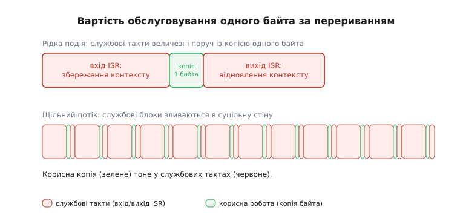
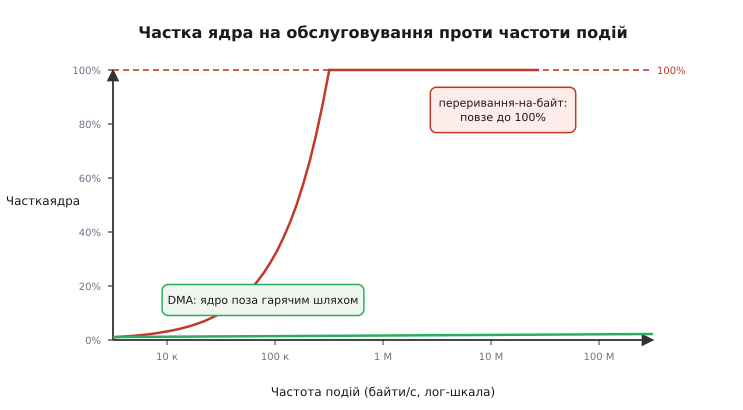

# Проблема потоку даних

Уявімо найпростішу ситуацію: на вхід надходять дані з давача на 1 МГц — один байт щомікросекунди. Ядро в [super-loop](topic:sf-devices/super-loop) робить одне й те саме: питає статусний регістр «є новий байт?», зчитує, кладе в буфер, питає знову. Сто тисяч ітерацій щосекунди, і жодного вікна для будь-якої іншої роботи — ядро в полоні опитування. Напрошується очевидна відповідь — [переривання](topic:hw-arch/interrupts): нехай периферія сама повідомляє, коли байт готовий, а ядро поки рахує щось корисне.

Але переривання теж коштують. Кожне входження в обробник (interrupt service routine, ISR — від англ. *service*, обслуговувати) — це збереження всіх задіяних регістрів у стек, перехід до адреси обробника, власне корисна робота, відновлення регістрів, повернення. На ESP32 (ядро Xtensa LX7, до 240 МГц) повний цикл входу й виходу з ISR займає десятки тактів — залежно від того, скільки регістрів треба зберегти. Для рідкісних подій це дрібниця. Для щільного потоку — катастрофа, і це видно з простого розрахунку.

**Частка ядра на обслуговуванні потоку 500 кБ/с**

```
Дано:
  R         = 500 000 байт/с    (потік від давача)
  c         = 120 тактів/байт   (вхід ISR + копія байта + вихід)
  f(такт)   = 240 000 000 Гц    (240 МГц)

Тактів за секунду на ISR:
  T = R · c = 500 000 × 120 = 60 000 000 тактів/с

Частка ядра:
  U = T / f(такт) = 60 000 000 / 240 000 000 = 0.25  →  25%

При 1 МБ/с:   U = 1 000 000 × 120 / 240·10⁶ = 0.50  →  50%
При 2 МБ/с:   U = 1.00  →  ядру не лишається жодного такту
```

Чверть усіх тактів іде на «поштову службу», а не на обробку даних. На двох мегабайтах за секунду система захлинається: ISR не встигають відпрацьовувати, черга подій росте швидше, ніж розгрібається, і байти губляться. Ціна обслуговування зростає лінійно з потоком — і рано чи пізно з'їдає все ядро.



*Смуга обробки одного байта за перериванням: службовий блок (збереження й відновлення контексту) у кілька разів більший за саму корисну копію, а на щільному потоці службові блоки зливаються в суцільну стіну.*

Це лише перша з трьох перешкод, і всі вони мають спільний корінь — ядро стоїть на гарячому шляху кожного байта.

**Частка ядра.** Вона зростає з частотою подій, поки не впреться у стелю: коли добуток (потік × ціна ISR) наближається до тактової частоти, ядру не лишається часу ні на що, крім перекладання байтів.

**Джитер** (jitter — від англ. *to jitter*, тремтіти; нерівномірність моменту обробки). Поки ядро сидить в одному ISR, наступне переривання чекає. Якщо обробник зайняв навіть 10 мкс, а нові байти надходять кожні 2 мкс, частина вибірок просто загубиться. Реальна частота дискретизації стає нижчою за запрограмовану, і сигнал спотворюється — рівно те, чого не можна допустити в аудіо чи вібродіагностиці, де момент кожної вибірки несе сенс.

**Енергія.** Ядро, що безперервно молотить переривання, не входить у жоден режим сну. Навіть легка дрімота між задачами стає недоступною за щільного потоку ISR. Ядро гаряче й зайняте цілодобово, а батарея тане.

> 🔧 **Навіщо це.** Правило великого пальця: якщо добуток (частота_подій × ціна_ISR) наближається до тактової частоти ядра, оптимізувати сам ISR уже немає сенсу — виграш буде копійчаний. Треба прибрати ядро з гарячого шляху цілком. Саме це робить прямий доступ до пам'яті.



*Частка ядра на обслуговуванні зростає з частотою подій і впирається у 100%, тоді як за DMA вона лишається поблизу нуля незалежно від потоку.*

## Рішення: відрізати ядро від кожного байта

Розв'язок — у самій назві: **прямий доступ до пам'яті** (direct memory access, DMA — від лат. *directus*, прямий, і *memoria*, пам'ять). Дані їдуть прямо між периферією й оперативною пам'яттю, оминаючи регістри ядра й виконавчий конвеєр. Окремий апаратний блок — [контролер DMA](topic:hw-arch/dma-controller) — отримує від ядра одне завдання: «перекинь стільки-то байтів звідси туди» — і виконує його самостійно, забираючи такти шини лише на мить переказу. Ядро дізнається не про кожен байт, а лише про **готовий блок** — одним перериванням наприкінці.

Розрахунок це підтверджує: завантаженість ядра більше не залежить від потоку. Замість 500 000 переривань за секунду маємо одне на буфер. Якщо буфер — 1024 байти, частота переривань падає в тисячу разів, а з нею й службові такти. Ядро вільне рахувати, спати або обслуговувати інші задачі, поки апаратура тихо наповнює пам'ять.

Тут варто чесно показати, де аналогія «ядро відпочиває» ламається. Контролер DMA і ядро користуються **однією й тією самою шиною** до пам'яті — два господарі на одній дорозі. Коли DMA переставляє слово, він на цей такт займає шину, і якщо ядру саме тоді треба звернутися до тієї ж пам'яті, воно мить чекає. Такий спосіб ділити шину називають **викраданням тактів** (cycle stealing — від англ. *to steal*, викрадати): DMA «краде» поодинокі такти шини між зверненнями ядра. Тому DMA не цілком безкоштовний — він додає невелику затримку доступу. Але різниця колосальна: ядро втрачає окремі такти на доступ до пам'яті замість того, щоб витрачати десятки тактів на повний цикл ISR за кожен байт. Платимо копійки замість карбованця.

Вирішує суперечку за шину апаратний **арбітр** (arbiter — від лат. *arbiter*, суддя): він пропускає одного господаря за раз і дає DMA лише ті такти, які ядру цієї миті не потрібні, або відбирає шину на коротку мить за пріоритетом. Для потокових даних — аудіо, відео, швидкого АЦП — це ідеальний компроміс: переказ іде паралельно з обчисленням, а взаємні затримки настільки малі, що ядро їх майже не помічає.

> 🔧 **Навіщо це.** DMA — не прискорювач копіювання (шина та сама), а спосіб **зняти ядро з гарячого шляху**. Виграш не в тому, що байти їдуть швидше, а в тому, що ядро при цьому вільне: може рахувати фільтр, тримати керування в реальному часі або заснути для економії батареї.

Як це виглядає у прошивці — на прикладі типового потокового приймача через DMA. Драйвер дає кільце буферів; ядро лише чекає на сповіщення про повний буфер і обробляє його, доки апаратура наповнює наступний:

```c
// I2S-аудіо через DMA: ядро торкається не байтів, а готових блоків.
#define FRAME   256                 // вибірок на буфер
static int32_t buf[FRAME];          // приймач блоку від DMA

void audio_task(void) {
    size_t got = 0;
    while (1) {
        // Блокуємось, доки DMA НЕ наповнить буфер цілком.
        // Ядро тут спить — жодного байта воно не торкнулось.
        i2s_channel_read(rx, buf, sizeof(buf), &got, portMAX_DELAY);

        // Тепер маємо got/4 готових вибірок — одна корисна дія на цілий блок,
        // а не одне переривання на кожен відлік.
        process_block(buf, got / sizeof(int32_t));
    }
}
```

Ключ — у параметрі `portMAX_DELAY`: ядро спить, доки DMA не складе цілий блок із 256 вибірок. Одне пробудження на блок замість 256 переривань на окремі відліки. На потоці 48 кГц це різниця між майже п'ятдесятьма тисячами входжень в ISR за секунду — і менш ніж двома сотнями пробуджень на готові блоки. Ті самі дані, та сама шина, але ядро торкається їх у сотні разів рідше, і всі три перешкоди відступають разом: завантаженість падає до часток відсотка, момент обробки блоку більше не залежить від кожного окремого байта, а між блоками ядро вільне дрімати. Корінь у всіх трьох був один — ядро на гарячому шляху кожного байта; DMA прибирає саме його.

Коротші передачі — окрема історія: для них накладні витрати на налаштування DMA можуть переважити сам переказ, і звичайний `memcpy` виходить швидшим. Де саме проходить ця межа, показано у вставці [memcpy проти DMA](topic:hw-arch/dma-controller/proj-memcpy-vs-dma.md). А точний поріг, за яким ядро вже не встигає перекладати байти самотужки, прорахований у вставці [про пропускну здатність](topic:hw-arch/dma-problem/math-throughput.md), де стеля R(макс) виводиться від першопричин.

Сама ж ідея — звільнити дороге ядро від побайтового вводу-виводу, доручивши його окремому апаратному агентові, — старша за мікроконтролери на десятиліття: її першими втілили мейнфрейми, і про цей шлях розказано у вставці [про канальні процесори](topic:hw-arch/dma-problem/hist-dma-channels.md).
