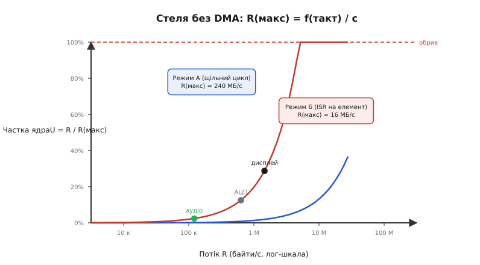
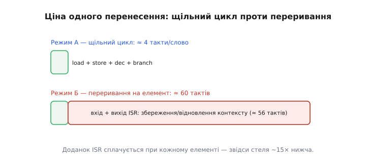

# 🧮 Пропускна здатність: байти/с проти тактів на переривання

Буває потік, який надходить швидше, ніж ядро здатне його перебирати слово за словом. Але «швидше» — це не відчуття; це число, яке можна порахувати наперед. Щоб перейти від інтуїції до конкретного критерію, треба відповісти на одне питання: який найбільший потік (байтів за секунду) ядро здатне переганяти самотужки, слово за словом, поки не лишається часу ні на що інше — і де ця стеля? Для відповіді знадобляться лише дві прості величини: ціна одного перенесення в тактах і темп ядра в тактах за секунду.

## Означення

Введемо дві величини, якими будемо оперувати далі.

**Пропускна здатність** (throughput, R) — потік даних, що його треба перегнати з джерела до приймача; вимірюється в байтах за секунду. Це зовнішня вимога: датчик генерує відліки, шина тягне кадри, мікрофон надсилає аудіо — і все це незалежно від того, чи встигає ядро.

**Ціна перенесення** c — скільки тактів ядро витрачає, щоб переставити один елемент (слово, байт, відлік) із джерела до місця призначення в циклі «прочитай–запиши».

**Тактова частота ядра** f(такт) — в тактах за секунду; на ESP32-класі — до 240 МГц завдяки [тактовому генератору](root:hw-arch/clock-power) [архітектури ESP32](root:hw-arch/esp32-architecture).

З цих трьох величин випливає стеля:

```
R(макс) = f(такт) / c          [елементів/с] × (байтів/елемент)

Частка ядра на потік:  U = R · c / f(такт) = R / R(макс)
```

Якщо R < R(макс), ядро справляється і ще має вільний час. Якщо R → R(макс), ядро зайняте виключно перекладанням байтів — на решту завдань ні такту. Якщо R > R(макс) — ядро фізично не встигає, дані губляться.

Зверніть увагу: U тут — той самий «податок на CPU», що й при [перериваннях проти опитування](root:embedded/polling-vs-interrupts), де він виражався через частоту й тривалість ISR. Тут той самий коефіцієнт завантаженості записано через байтову швидкість. Коли U → 1, ядру нічого не лишається — рівно та сама межа.



*Стеля без DMA: R(макс) = f(такт)/c. Два режими дають дві різні стелі, а маркери показують, де відносно нижчої стелі лежать типові потоки — аудіо, АЦП, дисплей.*

## Інтуїція

Уявіть конвеєрну стрічку та робітника, який перекладає коробки по одній. Темп робітника фіксований: він витрачає рівно c тактів на коробку, незалежно від того, скільки коробок прибуло. Швидкість стрічки задає зовнішнє джерело — датчик, шина, радіо. Поки стрічка повільніша за робітника, все гаразд: між коробками є пауза, і він встигає зробити щось ще. Щойно стрічка пришвидшується понад його темп — коробки падають, бо він не встигає підхопити кожну.

Ключова інтуїція перша: важливий не просто «швидко чи повільно», а **добуток** темпу потоку R на ціну перенесення c. Це той самий принцип, що й у [податку на CPU від переривань](root:embedded/polling-vs-interrupts), де він був добутком частоти переривань і тривалості ISR. Тут він записаний через байтову швидкість, але математика та сама.

Ключова інтуїція друга — і вона пояснює, чому потокові дані так прагнуть піти до апаратури. Якщо кожен елемент потоку будить окреме переривання, до власне копіювання додається вхід і вихід ISR: ядро зберігає весь контекст (регістри, стек), перемикається, відновлює — і робить це при кожному байті. Ці накладні витрати не масштабуються з обсягом: вони сплачуються окремо за кожен елемент, а не один раз на блок. Тому «переривання на кожен байт» впирається в стелю набагато раніше, ніж щільний цикл, де ті самі load/store виконуються без жодного перемикання.

Звідси напрошується думка: якби переносити не по одному елементу, а великими блоками — накладні витрати розмазалися б по сотнях байтів. А переносити блок, не займаючи ядро, здатен [апаратний контролер DMA](root:hw-arch/dma-controller).

## Формальний апарат

Розкладемо ціну c на складові для двох режимів:

```
Режим А (щільний цикл, масив у пам'яті):
  c(копія) ≈ 4–8 тактів/слово  (load + store + dec/cmp + branch)

Режим Б (переривання на кожен елемент):
  c(ISR) = c(копія) + T(вхід+вихід ISR)
```

Де T(вхід+вихід ISR) — десятки тактів на [збереження та відновлення контексту](root:hw-arch/interrupt-vector) при кожному вході в обробник. Саме цей доданок усе вирішує: він сплачується при кожному елементі й не залежить від його розміру.

**Worked-приклад: стелі для ESP32 при f(такт) = 240 МГц**

```
Режим А — щільне копіювання:
  c ≈ 4 такти/слово,  слово = 4 байти
  R(макс,A) = 240·10⁶ / 4 × 4 Б ≈ 240 МБ/с

Режим Б — переривання на кожне слово:
  c ≈ 4 + 56 = 60 тактів  (56 — вхід+вихід ISR, §4.5.2)
  R(макс,B) = 240·10⁶ / 60 × 4 Б ≈ 16 МБ/с
```

Накладні витрати ISR обвалили стелю приблизно в 15 разів — і це ще без реальних промахів кешу й шинних затримок.

Тепер прикладемо стелю режиму Б до типових реальних потоків:

```
Потік                                 R            U = R / R(макс,B)
──────────────────────────────────────────────────────────────────────
I2S-аудіо: 48 кГц · 2 канали · 4 Б   ≈ 384 кБ/с   ≈ 2.4%   (легко)
Безперервний АЦП (§4.8): 1 МСемпл/с · 2 Б = 2 МБ/с ≈ 12.5%
SPI-дисплей: 320×240 · 2 Б · 30 кадр/с ≈ 4.6 МБ/с ≈ 29%   (відчутно)
```

Аудіо здається комфортним, але до його 2.4% слід додати все інше — таймери, I2C-давачі, логіку програми. Для дисплея ті 29% — лише сам потік пікселів, без жодної обробки. А якщо потоків кілька:

```
U(сума) = Σ Rᵢ / R(макс,i)   — має лишатися помітно < 1
```

Це пряма аналогія з [сумою часток CPU від різних джерел переривань](root:embedded/polling-vs-interrupts). Тут те саме, але розраховано через байтову швидкість.



*Чому «переривання на кожен елемент» дороге: вхід і вихід ISR — витрати, що сплачуються при кожному байті — визначають стелю для потоку елемент-за-елементом.*

## Де проходить межа

Ядро тримає потік самотужки, поки сумарний U залишається помітно меншим за 1. Але щойно U наближається до одиниці — настає той самий обрив, що й при [перевантаженні перериваннями](root:embedded/polling-vs-interrupts): події накопичуються швидше, ніж обробляються, буфер переповнюється, дані губляться — і байдуже, наскільки швидким є ядро.

Є два способи зменшити c у режимі Б. Перший — не будити переривання на кожен елемент, а накопичувати в буфер і брати пачкою: тоді накладні витрати ISR розмазуються по багатьох байтах. Другий — зовсім зняти перекладання з ядра й передати апаратурі: саме це і робить [контролер DMA](root:hw-arch/dma-controller).

> 🔧 **Навіщо це**
>
> Перш ніж тягнутися до DMA «бо круто», порахуй R(макс) і U: часто скромний потік ядро тримає й без DMA, а от аудіо, відео і швидкий АЦП стелю пробивають — і число це показує за хвилину. Якщо U(сума) < 0,3–0,4, ядро справляється з запасом. Якщо наближається до 0,7–0,8 — DMA вже не розкіш, а необхідність.

## Що дає це число

Ця вставка — кількісний бік питання про [потік, швидший за цикл прочитай–запиши](root:hw-arch/dma-problem). «Потік швидший за ядро» тепер звучить точно: R перевищує R(макс), або U наближається до 1.

Та сама математика завантаженості, що й у [податку на CPU від переривань](root:embedded/polling-vs-interrupts) (там — частка CPU на ISR, тут — стеля за байтовою швидкістю), каже одне й те саме: дроби роботу або віддавай апаратурі. Різниця лише в кутові зору — одна сторона рахує, скільки часу йде на переривання, інша — скільки даних ядро встигає перекласти.

Коли число каже, що ядро не встигає, виходів два: накопичувати дані в буфер і брати пачкою — або зняти перекладання з ядра й передати [контролеру DMA](root:hw-arch/dma-controller), який ганяє великі блоки I2S чи SPI без жодного переривання.

Порахувати R(макс) і U — справа однієї хвилини, а рятує від «чому потік сиплеться / звук тріщить / кадр смикається» — від усього, що трапляється, коли ядро просто не встигає перекладати байти.
