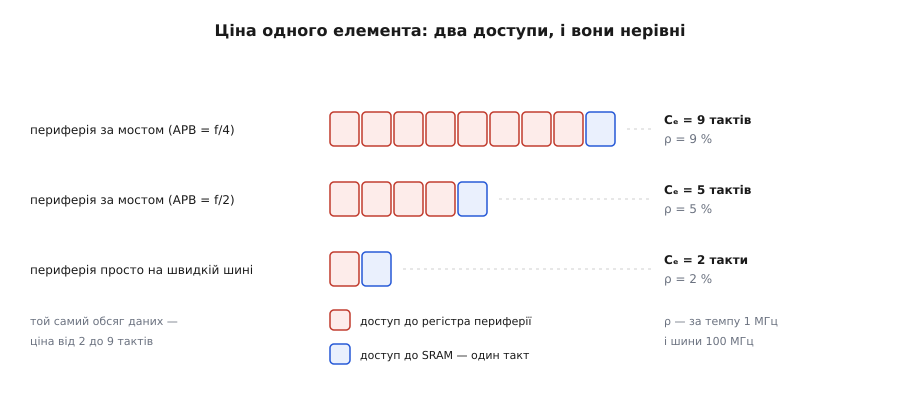
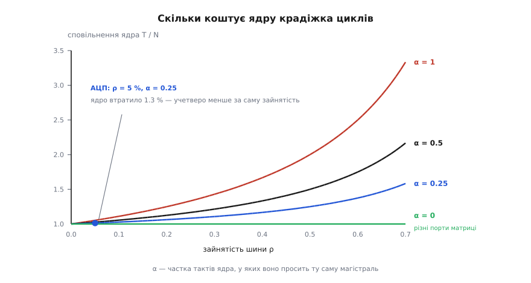
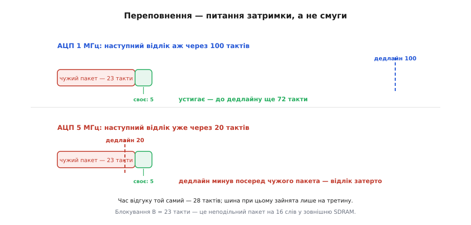

# 🧮 Бюджет циклів шини: скільки забирає DMA і коли потік однаково зривається

Кожен елемент, який перевозить канал DMA, коштує певної кількості тактів спільної магістралі — і з цієї ціни виводяться дві геть різні величини: **яку частку шини канал забирає** й **чи встигає він зняти елемент, поки периферія його не затерла**. Обидві доведено тут до формул, куди підставляються числа з реальної схеми ще до першого запуску. І одразу спливає головне: величини ці пов'язані значно слабше, ніж здається, — шина може дві третини часу простоювати, а дані все одно губитимуться.

## Ціна одного елемента

Почнімо з найдрібнішого — з одного перенесеного елемента. Перенесення «периферія → пам'ять» — це рівно два звертання до шини: **прочитати** регістр периферії й **записати** комірку пам'яті. Отже, ціна елемента — сума цін двох доступів:

```
Cₑ = c_дж + c_прм        [тактів шини на елемент]
```

Спокуса тут одна: припустити, що доступ — це такт. Для внутрішньої SRAM без тактів очікування так і є. Але регістр периферії майже ніколи не висить на швидкій шині поруч із пам'яттю — він сидить за мостом, на повільній периферійній шині. За специфікацією AMBA APB кожне звертання туди триває **щонайменше два такти**: фазу адреси (*setup*) і фазу доступу (*access*), причому повільний пристрій має право розтягнути другу, тримаючи лінію готовності `PREADY` низькою. І це два такти **периферійної** шини, яку зазвичай тактують поділеною від системної: за поділу навпіл виходить чотири системні такти, за поділу на чотири — вісім. Навіщо шини взагалі розділили на швидку й повільну — у темі [шинна ієрархія AHB/APB](topic:hw-arch/ahb-apb-bus).

**Приклад (ціна одного відліку АЦП).** Системна шина 100 МГц, внутрішня SRAM без тактів очікування, АЦП — за мостом на периферійній шині вдвічі повільнішій:

```
c_дж  (читання регістра АЦП)  = 2 такти APB × 2 = 4 такти шини
c_прм (запис півслова в SRAM) = 1 такт
Cₑ = 4 + 1 = 5 тактів на один 16-бітний відлік
```

Наївна оцінка «два доступи — два такти» помилилася **у два з половиною рази**, і саме в той бік, який болить. Ця асиметрія — не дрібниця обчислення, а те, з чого виросте вся дальша картина: у типовому каналі «периферія → пам'ять» майже вся ціна лежить на боці периферії. Ті самі байти, перекладені всередині пам'яті, коштують `1 + 1 = 2` такти — удвічі менше за наш приклад і вчетверо менше, якщо дільник периферійної шини не два, а чотири.


*Ціна елемента розкладається на два доступи, і вони нерівноцінні. Синій — запис у SRAM, один такт. Червоні — читання регістра периферії: два такти периферійної шини, помножені на її дільник. Що глибше периферія захована за мостом, то дорожчий елемент, хоч байтів переїхало стільки самісінько.*

## Яку частку шини це забирає

Тепер від одного елемента — до потоку. Хай периферія проситься зі сталим темпом `R` елементів за секунду, а шина цокає з частотою `f`. За секунду канал витрачає `R·Cₑ` тактів із наявних `f` — це і є **зайнятість шини** каналом:

```
ρ = R · Cₑ / f          [частка тактів шини, 0…1]
```

Підставимо наш АЦП на мільйон відліків за секунду:

```
ρ = 1 000 000 × 5 / 100 000 000 = 0.05 = 5 %
```

Дев'ятнадцять двадцятих часу шина вільна. Звідси ж і стеля: більше, ніж `ρ = 1`, канал фізично не візьме, тож гранична швидкість каналу — це

```
R_max = f / Cₑ           [елементів/с]
B_max = f · b / Cₑ       [байтів/с, де b — ширина елемента]
```

Для нашого АЦП це `100·10⁶ / 5 = 20` мільйонів відліків/с, тобто 40 МБ/с. А для копіювання SRAM→SRAM 32-бітними словами, де обидва доступи по такту, — `100·10⁶ / 2 = 50` мільйонів слів/с, або **200 МБ/с**. Це рівно вдвічі менше за наївне «частоту шини помножити на ширину слова»: половина смуги зникає вже тому, що кожне слово треба **і прочитати, і записати**, а магістраль одна.

## Як здешевити елемент: пакування й пакети

Формула `ρ = R·Cₑ/f` показує й важіль: темп `R` задає периферія, частоту `f` — тактовий генератор, а от `Cₑ` контролер уміє зменшувати сам. Способів рівно два.

**Пакування.** Джерело й приймач можуть мати різну ширину. Хай АЦП сидить на швидкій шині й віддає 16-бітні півслова, а контролер накопичує їх у власному буферці й скидає в пам'ять 32-бітними словами. На два елементи джерела виходить два читання й **один** запис:

```
без пакування:  Cₑ = 1 + 1     = 2 такти/елемент
з пакуванням:   Cₑ = (2·1 + 1)/2 = 1.5 такта/елемент   → −25 %
```

Але той самий прийом на АЦП за мостом майже нічого не дасть: `(2·4 + 1)/2 = 4.5` замість `5`, лише −10 %. Пакування економить на **дешевшому** боці перенесення, тож і виграш його впирається в дорожчий. Це відповідь на часте запитання «чому ввімкнув пакування, а швидше не стало».

**Пакети.** Друга стаття витрат — не сам доступ, а **переговори** перед ним: щоразу треба попросити шину в арбітра й дочекатися дозволу. Хай ці переговори коштують `a` тактів на дозвіл. Тоді `B` окремих доступів проти одного пакета з `B` слів:

```
поодинці:  B · (c + a)
пакетом:   B · c + a
виграш:    (B − 1) · a тактів
```

На зовнішній пам'яті виграш іще більший, бо там дорого коштує не дозвіл, а **перше** звертання: адресацію рядка треба зробити раз, а далі слова біжать по одному за такт (чому саме так — у темі [SDRAM і DDR](topic:hw-arch/sdram-ddr)). Хай перше звертання коштує 8 тактів, кожне наступне слово в пакеті — один:

```
16 окремих звертань:  16 × 8       = 128 тактів
один пакет на 16 слів: 8 + 15      =  23 такти     → у 5.6 раза дешевше
```

Саме тому контролери мають власну чергу під пакет: у DMA серії STM32F4, наприклад, це FIFO на 4 слова (16 байтів), а пакет налаштовується на 4, 8 чи 16 звертань. Запам'ятаймо число **23** — воно зараз повернеться з іншого боку й геть не таким приємним.

## Що це коштує ядру: не ρ, а αρ

Здавалося б, якщо DMA забрав 5 % тактів шини, то ядро втратило 5 % швидкодії. Це не так, і різниця буває десятикратна.

Річ у тім, що ядро **не в кожному своєму такті** лізе на ту саму шину. Частину часу воно виконує інструкції, які нічого не читають із конкурентної пам'яті: рахує в регістрах, бере код з іншого порту матриці, влучає в кеш. Позначмо через `α` частку тактів ядра, у яких воно **справді просить ту саму магістраль**. Зіткнення можливе лише в цих тактах — решту DMA краде задарма.

Порахуймо простій. Ядро підходить до шини; з імовірністю `ρ` вона зайнята DMA. Якщо зайнята — ядро чекає такт і пробує знову. Імовірність прочекати не менше `k` тактів — це ймовірність, що всі `k` разів шина була зайнята, тобто `ρᵏ`. Середнє невід'ємної цілої величини дорівнює сумі ймовірностей «не менше `k`» за всіма `k ≥ 1`, а це вже [геометрична прогресія](topic:math-analysis/geometric-series):

```
E[W] = ρ¹ + ρ² + ρ³ + … = ρ / (1 − ρ)   [тактів простою на одну спробу]
```

Ядру потрібно `N` тактів, якби шина була вільна; із них `α·N` — спроби взяти шину. Кожна коштує в середньому `E[W]` зайвих тактів, тож повний час

```
T = N + α·N · ρ/(1 − ρ)

T/N = 1 + α · ρ/(1 − ρ)        ← у скільки разів ядро сповільнилося
```

Перевірмо формулу по краях, бо саме краї роблять її зрозумілою. За `α = 1` (ядро — суцільний цикл копіювання по тій самій пам'яті) виходить `T/N = 1/(1 − ρ)`: чиста конкуренція, ядро дістає рівно ту частку шини, яку лишив DMA. За `α = 0` виходить `T/N = 1` **за будь-якого ρ**: ядро не сповільнюється зовсім, хай би DMA забрав усю шину. Це не абстракція — це рівно те, що дає [матриця шин](topic:hw-arch/bus-matrix): якщо ядро читає код із флеш-пам'яті одним портом, а DMA возить між SRAM і периферією іншим, спільної магістралі між ними просто немає, і `α` для цієї пари справді нуль.

```
T/N     ρ = 0.05   ρ = 0.25   ρ = 0.50
α = 1     1.053      1.333      2.000
α = 0.5   1.026      1.167      1.500
α = 0.25  1.013      1.083      1.250
α = 0     1.000      1.000      1.000
```

Ось і числова відповідь на питання «скільки коштує крадіжка циклів». Наш АЦП забирає 5 % шини, а ядро, яке чверть тактів звертається до тієї самої пам'яті, втрачає **1.3 %** — учетверо менше за саму зайнятість. Помітити таке уповільнення в роботі майже неможливо.


*Ядро платить не за зайнятість шини, а за перетин із нею. Поки `ρ` мале, усі криві майже пласкі — крадіжка циклів безкоштовна. Ціна злітає лише в правій частині, і то тим різкіше, чим більша частка `α` тактів ядра йде на ту саму магістраль. Нижня пряма `α = 0` — випадок, коли ядро й DMA ходять різними портами матриці: там DMA не коштує ядру нічого взагалі.*

Модель тримається на одному припущенні: такти DMA лягають рівномірно й **незалежно** від того, коли шину просить ядро. Для потоку, що йде за запитами периферії, це чесно. Для пакетного режиму — ні: там доступи злипаються в грудку, і хоч середнє те саме, **найгірше** очікування виростає до довжини пакета. Саме звідти й починається друга, значно підступніша частина бюджету.

## Дедлайн: переповнення — питання затримки, а не смуги

Тепер друге питання, і воно взагалі не про відсотки. Периферія переповнюється не тоді, коли шина завантажена, а тоді, коли **конкретний елемент не встигли забрати**. Умова проста: від миті, коли периферія підняла запит, до миті, коли DMA справді зчитав її регістр, має минути менше часу, ніж лишається до появи наступного елемента.

```
Lᵢ ≤ Dᵢ = dᵢ · Tᵢ ,   де  Tᵢ = 1/Rᵢ — період запитів,
                            dᵢ — скільки елементів периферія здатна притримати
```

Для голого регістра даних `d = 1`: наступний відлік затирає попередній, і весь запас — один період. Якщо ж перед регістром стоїть черга на `d` елементів (а саме для цього давачі й обзаводяться [FIFO-регістрами](topic:com-devices/fifo-register)), запас розтягується вдесятеро чи вшістнадцятеро — за нашою формулою рівно в `d` разів.

А з чого складається `Lᵢ` — час відгуку каналу? Із трьох доданків, і найцікавіший тут не власне перенесення:

```
Lᵢ = B + Cᵢ + (доступи каналів вищого пріоритету, що встигли влізти)
```

- `Cᵢ` — власна ціна елемента, ті самі 5 тактів;
- `B` — **блокування**: арбітр не має права розірвати вже початий пакет, тож канал, який щойно попросив шину, чекає, поки чужий пакет добіжить до кінця. Найгірший випадок — найдовший неподільний пакет у системі. Це класична [інверсія пріоритетів](topic:sf-os/priority-inversion) у чистому вигляді: найважливіший канал стоїть за найнеквапливішим;
- перешкода згори — доступи каналів із вищим пріоритетом, які надійдуть, поки наш чекає. Скільки їх встигне надійти, залежить від того, скільки ми чекатимемо, а скільки чекатимемо — від того, скільки їх надійде. Коло замикається, тож рівняння розв'язують ітерацією:

```
Lᵢ⁽⁰⁾ = B + Cᵢ
Lᵢ⁽ⁿ⁺¹⁾ = B + Cᵢ + Σ ⌈ Lᵢ⁽ⁿ⁾ / Tⱼ ⌉ · Cⱼ      (сума по каналах j, вищих за i)
```

Ітерація або впирається в нерухому точку — це й є найгірший час відгуку, — або росте без упину: тоді канал приречений. Збігається вона тоді й лише тоді, коли сумарна зайнятість каналів від найвищого до нашого менша за одиницю. Ця рекурсія — не винахід для DMA: її вигадали для задач реального часу з фіксованими пріоритетами (Joseph і Pandya, *The Computer Journal* 29(5), 1986), а до каналів DMA на шині з фіксованим арбітражем її приклали пізніше (Hahn, Ha, Min та ін., *Real-Time Systems* 23, 2002). Загальний апарат таких оцінок — у темі [системи реального часу](topic:sf-tasks/real-time-systems), а правила, за якими арбітр обирає переможця, — у темі [арбітраж шини](topic:hw-arch/bus-arbitration).

**Приклад (три канали на одній шині).** Та сама шина 100 МГц, пріоритети за порядком:

```
канал 1 — АЦП → SRAM:    C₁ = 5,  R₁ = 1.00 млн елем/с → T₁ = 100 тактів, ρ₁ = 0.050
канал 2 — SRAM → SPI:    C₂ = 5,  R₂ = 1.25 млн елем/с → T₂ =  80 тактів, ρ₂ = 0.063
канал 3 — SRAM → SDRAM:  неподільний пакет на 16 слів  → B  =  23 такти
```

Найвищий канал:

```
L₁ = B + C₁ = 23 + 5 = 28 тактів   ≤  D₁ = 100    ✓ запас 3.5×
```

Другий, з перешкодою від першого:

```
L₂⁽⁰⁾ = 23 + 5                    = 28
L₂⁽¹⁾ = 23 + 5 + ⌈28/100⌉ × 5     = 33
L₂⁽²⁾ = 23 + 5 + ⌈33/100⌉ × 5     = 33   ← нерухома точка
33 ≤ D₂ = 80    ✓
```

Обидва вкладаються. А тепер зробімо єдину зміну: пришвидшмо АЦП уп'ятеро, до 5 мільйонів відліків за секунду.

```
T₁ = 20 тактів,  ρ₁ = 5/20 = 0.25
L₁ = 23 + 5 = 28 тактів   >  D₁ = 20     ✗ ПЕРЕПОВНЕННЯ
сумарна зайнятість шини: ρ₁ + ρ₂ = 0.25 + 0.063 = 0.31
```

Шина зайнята **на третину** — і при цьому АЦП втрачає відліки. Не тому, що бракує смуги (її вдосталь, дві третини гуляють), а тому, що в найгіршому разі канал двадцять три такти стоїть за чужим пакетом, а дедлайн у нього двадцять. Пакет із 16 слів, який щойно здешевив копіювання в SDRAM у 5.6 раза, коштує сусідньому каналу цілого потоку даних. Ось де ховається справжня ціна пакетного режиму — не в середній смузі, а в **найгіршій затримці для всіх інших**.


*Один і той самий канал, той самий час відгуку 28 тактів — і два протилежні присуди. Угорі періоду 100 тактів вистачає з великим запасом. Унизу період — 20 тактів, і дедлайн минає ще посеред чужого пакета, коли наш канал навіть не почав звертання. Втрата стається не через брак смуги, а через те, що черга виявилася довшою за термін придатності відліку.*

Утішне тут те, що формула не лише виносить присуд, а й показує всі важелі — їх у ній рівно три:

```
скоротити пакет до 4 слів:   B = 8 + 3 = 11  →  L₁ = 16 ≤ 20   ✓
дати периферії FIFO на 2:    D₁ = 2 × 20 = 40 ≥ 28             ✓
розвести по портах матриці:  B ≈ 0           →  L₁ ≈ 5–7        ✓
```

Перший спосіб платить смугою третього каналу, другий вимагає підтримки від самої периферії, третій — від топології кристала. Але шукати їх наосліп більше не треба: усі троє — це члени однієї нерівності `L ≤ d·T`, два збивають її ліву частину, третій піднімає праву.

> 🔧 **Навіщо це.** Дві умови перевіряються **окремо**, і провал буває в кожній нарізно. Перша — смуга: `Σ ρᵢ < 1` (з запасом на ядро). Вона **потрібна**, але геть **не достатня**. Друга — вчасність: `Lᵢ ≤ dᵢ·Tᵢ` для **кожного** каналу, з блокуванням і перешкодою згори. Якщо потік губить дані, а профілювання показує вільну шину, рахувати треба другу — і майже завжди винний найдовший пакет у системі, а не найшвидший канал. Дзеркально: якщо всі дедлайни з запасом, а система однаково гальмує — то це вже перша умова разом із `T/N = 1 + αρ/(1−ρ)`, тобто ядро й DMA сидять на одному порту матриці.

## Коли запитів немає: возіння пам'ять↔пам'ять

Окремий випадок — режим «пам'ять → пам'ять», де ніхто не піднімає запитів і нема чому переповнюватися. Дедлайну тут немає, зате `ρ` більше не задається темпом периферії: контролер просто бере шину так часто, як йому дають, і `ρ` виростає до всього, що лишив арбітр. Час копіювання блока з `N` елементів рахується прямо:

```
t = N · Cₑ / (f · s)        де s — частка тактів, яку арбітр віддає каналу
```

Копіювання 4 КБ 32-бітними словами при `Cₑ = 2` і `s = 1`:

```
N = 4096 / 4 = 1024 слова
t = 1024 × 2 / 100·10⁶ = 20.5 мкс     (тобто 200 МБ/с)
```

Але `s = 1` — це канал, що забрав магістраль цілком: на всі ці двадцять мікросекунд `ρ = 1`, і ядро на своїх звертаннях до тієї самої пам'яті просто стоїть, бо формула сповільнення в цій точці росте без межі. Тому канал «пам'ять → пам'ять» майже завжди ставлять на найнижчий пріоритет: там, де немає дедлайну, немає й приводу комусь заважати. Віддамо йому половину тактів:

```
s = 0.5 → t = 1024 × 2 / (100·10⁶ × 0.5) = 41 мкс
          ρ = 0.5, і ядро з α = 0.5 сповільнилося в 1 + 0.5 × 0.5/0.5 = 1.5 раза
```

Копіювання розтяглося вдвічі, ядро втратило половину швидкодії замість усієї — і обидва числа тепер видно наперед. Це вже свідома плата, а не сюрприз.
