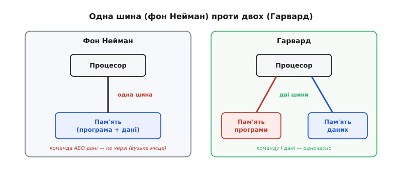
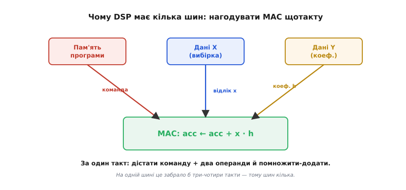
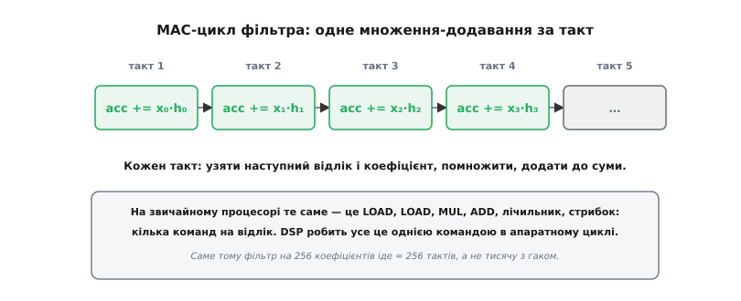
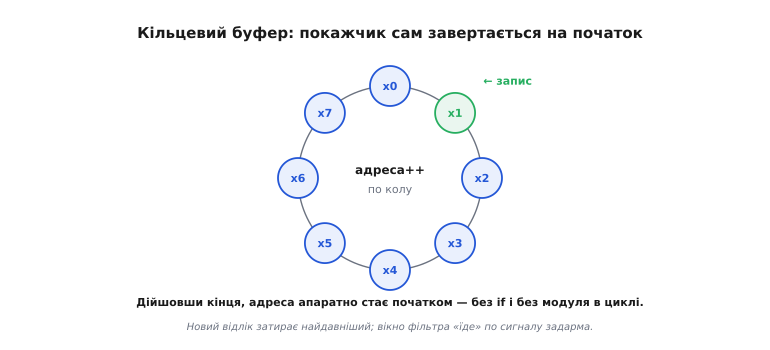
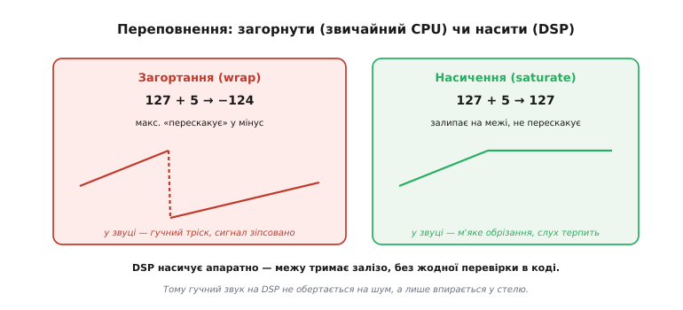

# Архітектура DSP-процесора: залізо, заточене під одну формулу

Уявіть мікрофон, що дає 48 тисяч відліків звуку за секунду, і завдання: на кожному відліку порахувати фільтр — суму двохсот множень. Це десять мільйонів множень-додавань щосекунди, і жодне не можна прогаяти: пропустив відлік — у звуці клац. Звичайний процесор це, звісно, порахує, але витратить на кожне множення кілька команд і кілька тактів, і на високій частоті сигналу просто не встигне. Тут і народжується окремий рід заліза — **DSP** (англ. *digital signal processor*, цифровий сигнальний процесор): не універсальний обчислювач, а машина, вилизана під одну-єдину операцію, яка в обробці сигналів трапляється частіше за всі інші.

Ця стаття — про те, **як влаштований DSP і чому саме так**. Виявиться, що майже кожна його архітектурна риса — пряма відповідь на одне речення: «треба множити-додавати неспинним потоком, по одному за такт, без жодного зайвого руху». Коли ви це побачите, будова DSP перестане бути набором дивних абревіатур і стане очевидною, майже вимушеною.

## Одна формула, з якої все випливає

Серце майже будь-якої обробки сигналу — **згортка**: щоб отримати відфільтрований відлік, беруть кілька останніх відліків сигналу, кожен множать на свій коефіцієнт і все складають. Формула фільтра зі скінченною відповіддю (FIR) виглядає так:

```
y = h₀·x₀ + h₁·x₁ + h₂·x₂ + … + hₙ₋₁·xₙ₋₁
```

Тут `x` — відліки сигналу, `h` — коефіцієнти фільтра. Придивіться до структури: це просто ланцюжок «помнож і додай до суми», повторений N разів. Одна така дія — **множення з накопиченням** (англ. *multiply-accumulate*, скорочено **MAC**):

```
acc ← acc + x · h
```

Уся ідея DSP тримається на одному спостереженні: якщо 90% часу процесор робить саме це, то немає сенсу будувати універсальну машину, яка робить MAC незграбно за кілька кроків. Треба зробити машину, яка виконує **весь MAC за один такт** — і годувати її даними так швидко, щоб вона ніколи не голодувала. Усе інше в архітектурі DSP — обслуга цієї головної думки.

> 🔧 **Навіщо це.** Коли ви вибираєте чип під задачу — обробку звуку, керування двигуном, радіо, вібродіагностику, — питання «скільки MAC за секунду мені треба» часто важливіше за тактову частоту в гігагерцах. DSP на скромних 200 МГц може обганяти універсальний процесор на 1 ГГц у фільтрації, бо на кожен MAC йому треба один такт, а не п'ять. Розуміти цю арифметику — значить не переплачувати за непотрібну універсальність і не брати заслабкий чип.

## Крок перший: нагодувати обчислювач — навіщо кілька шин

Зробити суматор-множник, що дає результат за такт, — це півсправи. Друга половина — встигати підвозити йому їжу. Щоб порахувати `acc + x·h`, за один такт треба дістати **три речі**: саму команду MAC із пам'яті програми, відлік `x` і коефіцієнт `h` із пам'яті даних. Якщо все це живе в одній пам'яті з однією шиною — а саме так влаштована класична [модель фон Неймана](root:hw-arch/harvard-vs-vonneumann), де команди й дані лежать разом і ходять одним каналом, — то за такт можна прочитати лише **одне**. Тоді MAC розтягнеться на три-чотири такти самого лише підвозу, і весь виграш від однотактного множника зникне.

Звідси перша архітектурна риса DSP — **Гарвардська архітектура**: пам'ять програми й пам'ять даних розділені фізично, кожна зі своєю шиною. Назва тягнеться до релейної машини Harvard Mark I (Говард Ейкен, задум 1935 р.), де команди читалися з окремої перфострічки, а числа лежали в окремих регістрах, тож одне не заважало іншому; сам термін «Гарвардська архітектура» з'явився пізніше, у колах розробників перших мікроконтролерів у 1970-х (усталено, з поправкою: зв'язок із Mark I — радше пізніша, популярна атрибуція, а не пряме запозичення назви). Головне для нас — суть: дві окремі шини означають, що команду й дані можна брати **одночасно**.


*Різниця між однією шиною й двома. У фон Неймана процесор ходить по команду й по дані по черзі одним каналом — на кожному такті або команда, або дані. Гарвардська схема дає два незалежні канали: команду беруть з пам'яті програми, а дані — з пам'яті даних у той самий такт. Для потоку MAC це і є перепустка до однотактного темпу.*

Але навіть двох шин MAC-у замало: йому потрібні **два** операнди — і відлік `x`, і коефіцієнт `h`. Тому справжні DSP ідуть далі за просту Гарвардську схему й мають **кілька шин даних**: часто окрему шину під сигнал і окрему під коефіцієнти. Тоді за один такт процесор дістає команду й обидва операнди — і множник ситий.


*Чому в DSP шин більше, ніж дві. Блоку MAC на кожному такті треба команда й два операнди — відлік і коефіцієнт. Окремі шини до трьох банків пам'яті дають усе це разом, за один такт. На єдиній шині фон Неймана те саме забрало б три-чотири такти лише на підвіз — тому DSP і розмножує шини.*

## Крок другий: сам множник — MAC як одна команда

Тепер про серце. У звичайного процесора множення й додавання — це окремі кроки, і щоб пройти по фільтру, компілятор породжує на кожен доданок цілу дрібку команд: завантаж `x`, завантаж `h`, помнож, додай до суми, посунь індекс, перевір лічильник, стрибни на початок циклу. Сім дій на один доданок.

DSP згортає цю дрібку в **одну апаратну команду**. У ньому є окремий блок — апаратний множник, зрощений із суматором і спеціальним регістром-накопичувачем (англ. *accumulator*, від лат. *accumulare* — «нагромаджувати»). За один такт цей блок бере два числа, перемножує їх і додає добуток до накопичувача. Це і є MAC-команда.


*Один MAC за такт. На кожному такті блок бере пару (відлік, коефіцієнт), множить і накопичує. На звичайному процесорі те саме розкладається на LOAD, LOAD, MUL, ADD плюс лічильник і стрибок — кілька команд на кожен доданок. DSP робить усе це однією командою в апаратному циклі, тож фільтр на 256 коефіцієнтів іде близько 256 тактів, а не тисячу з гаком.*

Накопичувач при цьому навмисне роблять **ширшим** за операнди: множимо, скажімо, 16 на 16 біт — добуток уже 32-бітний, а якщо таких добутків скласти сотні, сума полізе ще вище. Тому накопичувач часто має 40 біт: додаткові біти («гардові», сторожові) ловлять переповнення проміжної суми, щоб вона не зіпсувалася на півдорозі. Це маленька, але показова деталь: навіть ширина регістра тут продиктована формулою фільтра.

Множник живе в конвеєрі — тому «однотактний» означає темп, а не миттєвість. [Конвеєр](root:hw-arch/pipeline) розбиває обробку команди на стадії, і хоч кожен окремий MAC фізично проходить кілька стадій, **нова сума виходить щотакту**: поки один добуток додається, наступна пара вже множиться. Затримка одного MAC — кілька тактів, а пропускна здатність — один MAC за такт; саме пропускна здатність і важить у потоці.

## Крок третій: адресація, що сама завертається

Є ще одна прихована витрата, яку DSP прибирає залізом. Фільтр працює по **ковзному вікну**: приходить новий відлік, найдавніший викидаємо, вікно з N останніх значень «їде» по сигналу. Природний спосіб зберігати таке вікно — **кільцевий буфер** (англ. *circular buffer*): масив, у якому після останньої комірки покажчик повертається на першу.

На звичайному процесорі це вікно доводиться обслуговувати вручну: після кожного кроку перевіряти, чи не вибіг індекс за край масиву, і якщо так — завертати його назад (`if (i >= N) i = 0;` або взяти залишок від ділення). У найгарячішому циклі програми ця перевірка — на кожній ітерації, і вона коштує.

DSP прибирає її повністю: у нього є **модульна (кільцева) адресація** — покажчик апаратно завертається на початок буфера, дійшовши кінця. Ви лише задаєте адресу початку й довжину, а далі залізо саме тримає адресу в межах кільця.


*Кільцевий буфер апаратно. Покажчик іде по комірках; на межі адреса сама «перескакує» на початок — жодного `if` і жодного модуля в тілі циклу. Новий відлік затирає найдавніший, і вікно фільтра «їде» по сигналу задарма. На звичайному процесорі це завертання — зайва команда чи дві на кожній ітерації гарячого циклу.*

До цього додається **цикл без накладних витрат** (англ. *zero-overhead loop*): DSP уміє повторити блок команд задану кількість разів, не витрачаючи тактів на лічильник і перевірку виходу — цим теж керує окреме залізо. У звичайному циклі команди «зменш лічильник» і «стрибни, якщо не нуль» з'їдають по такту щоразу; у тісному MAC-циклі це помітна частка. DSP їх усуває, і тіло циклу лишається голим MAC-ом.

## Крок четвертий: арифметика, що не псує сигнал

Числа в обробці сигналу мають свою підступність. Коли сума добутків вилазить за межу розрядності, звичайний процесор робить [загортання](root:sf-lang/overflow-wraparound): максимальне значення «перескакує» в мінімальне (додав до 127 п'ять — отримав −124). У розрахунках це помилка; у **звуці** це катастрофа — гучний фрагмент, який ледь перевищив стелю, обертається на різкий тріск, бо сигнал стрибнув з максимуму в мінімум.

> Загортання й насичення — дві протилежні реакції заліза на переповнення. Різницю та її наслідки для коду розкрито в темі [насичувальної арифметики](root:sf-lang/saturating-arithmetic): коли треба залипати на межі, а коли — свідомо дозволити загортання.

DSP тримає **насичувальну арифметику** апаратно: при переповненні результат не загортається, а **залипає на межі** (127 + 5 = 127). Для сигналу це правильна поведінка: гучний звук лише впирається у стелю, дає м'яке обрізання, яке слух терпить, замість руйнівного стрибка. І, що важливо, це не гілка в коді, а режим самого блока — насичення нічого не коштує.


*Дві реакції на переповнення. Загортання (звичайний CPU): 127 + 5 → −124, максимум перестрибує в мінімум — у звуці це гучний тріск, сигнал зіпсовано. Насичення (DSP): 127 + 5 → 127, значення впирається у стелю — у звуці м'яке обрізання, яке слух пробачає. DSP насичує апаратно, без жодної перевірки в коді.*

## Числа в DSP: фіксована кома проти плаваючої

Лишається питання — **якими числами** DSP рахує. Тут два табори. Дешеві й економні DSP працюють у [фіксованій комі](root:hw-arch/fixed-point): дробові числа зображають цілими зі спільним домовленим масштабом. Це швидко й ощадливо, але вимагає від програміста самому стежити за масштабом і переповненням — саме тому насичення й широкий накопичувач для таких чипів життєво важливі. Дорожчі DSP мають апаратну [плаваючу кому](root:hw-arch/floating-point) — окремий [блок дробових чисел](root:hw-arch/fpu), який сам тримає масштаб, тож про переповнення думати майже не треба, а платити доводиться площею кристала й енергією.

Вибір між ними — це вибір між ціною й зручністю: у масовому виробі (навушники, лічильник електрики) беруть фіксовану кому й акуратно керують масштабом; у складному приладі, де важить час розробки й точність, — плаваючу. Обидва табори лишаються DSP: та сама Гарвардська душа, ті самі MAC, кільцева адресація й насичення — різниця лише в тому, як зображено самі числа.

## Реальний час: чому DSP такий передбачуваний

DSP майже завжди працює у **реальному часі**: відліки приходять із незмінним темпом, і відповідь мусить встигнути до наступного. Тому цінується не лише швидкість, а **передбачуваність** — щоб кожна операція займала рівно стільки тактів, скільки очікуєш, без сюрпризів.

Звідси характерний вибір: класичний DSP уникає прийомів, що прискорюють у середньому, але роблять час «плаваючим». Великі кеші, [передбачення переходів](root:hw-arch/pipeline), позачергове виконання — усе це чудове для настільного процесора, але вносить непевність: іноді дані в кеші, іноді ні, і час коливається. У жорсткому реальному часі це погано. DSP натомість тримає дані у швидкій вбудованій пам'яті з відомою затримкою й покладається на [переривання](root:hw-arch/interrupt-vector) з чіткою, короткою реакцією: прийшов відлік — обробник спрацював за передбачувані такти. Ця сама логіка робить DSP схожим на [мікроконтролер](root:hw-arch/mcu-blocks) духом — обидва цінують визначеність над пікову спекулятивну швидкість, — хоч і заточені під різне.

Практична згадка: чіткий приклад — як увесь цей набір рис збирається в робочий FIR-фільтр на C, який лягає на MAC-цикл із кільцевим буфером, — розібрано окремо, [покроково від задачі до коду й пасток масштабування](root:hw-arch/dsp-architecture/proj-fir-mac.md).

## Де живе DSP сьогодні

Раніше DSP був завжди окремим чипом. Історія його народження — окрема й цікава: [як наприкінці 1970-х із телефонних лабораторій вийшли перші однокристальні DSP](root:hw-arch/dsp-architecture/hist-first-dsp.md), від внутрішнього чипа Bell Labs до першого серійного від NEC і чипа Texas Instruments, що став ринковим еталоном. Сьогодні межа розмилася: DSP-можливості вбудовують усередину звичайних мікроконтролерів. Багато сучасних ядер мають MAC-команду й насичення прямо у своєму [наборі інструкцій](root:hw-arch/isa) — це так зване розширення DSP, коли універсальне ядро вміє й «сигнальні» команди.

Тож «архітектура DSP» сьогодні — це не обов'язково окремий корпус на платі, а **сукупність рис**: Гарвардський поділ пам'яті задля паралельного підвозу, однотактний MAC із широким накопичувачем, кільцева адресація, цикли без накладних витрат і насичувальна арифметика. Де б ці риси не з'явилися — у виділеному чипі, у ядрі мікроконтролера чи в блоці всередині великого процесора — ви впізнаєте ту саму рушійну ідею: **залізо, підігнане під одну формулу**, яку обробка сигналів повторює мільйони разів на секунду. Побачивши цю ідею одного разу, ви прочитаєте будову будь-якого DSP як відповідь на неї.
