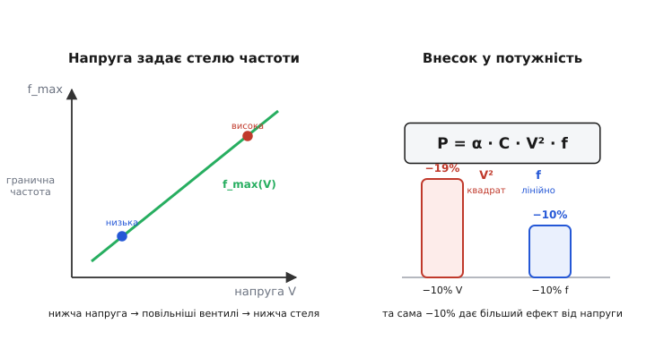
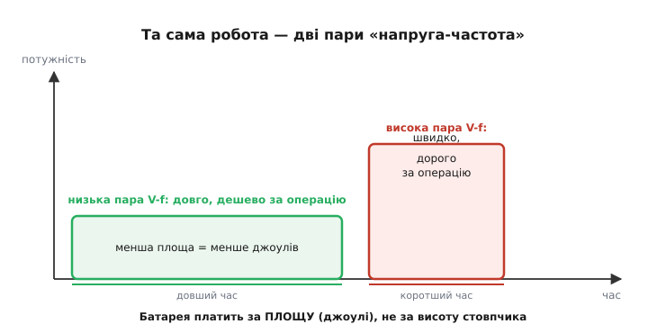
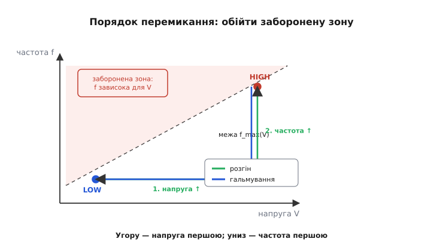

# Динамічне масштабування напруги і частоти (DVFS)

Той самий процесор у вашому телефоні то мчить на повній швидкості, коли ви гортаєте важку сторінку, то тихо повзе, коли екран просто показує годинник. Він не має двох різних «моторів» — це **один** кремній, який на льоту міняє собі і темп такту, і напругу живлення. Ця техніка зветься **динамічне масштабування напруги і частоти** (*dynamic voltage and frequency scaling*, DVFS): процесор у реальному часі підкручує свою [частоту](topic:hw-arch/clock-frequency) і напругу під поточну потребу, щоб не палити енергію дарма. Питання, на яке відповідає ця стаття: чому недостатньо просто збавити частоту, коли роботи мало, — і чому справжній виграш дає саме **пара** «напруга + частота», зрушена разом.

### Чому не досить збавити лише частоту

Найперший, наївний хід очевидний: роботи мало — знизь частоту, хай процесор цокає рідше. Розберімо, що це дасть насправді.

Майже вся енергія в цифровому чипі йде на **перемикання**: щоб змінити біт із 0 на 1, треба зарядити крихітну ємність (затвори транзисторів, дроти), а щоб повернути в 0 — розрядити. Кожне таке перемикання перекачує пакетик заряду. Динамічну потужність [КМОН-логіки](topic:hw-digital/cmos) (*CMOS* — комплементарна структура метал-оксид-напівпровідник) описує коротка й дуже змістовна формула:

```
P_дин = α · C · V² · f
```

де `α` — частка вентилів, що перемикаються за такт (активність), `C` — сумарна ємність, `V` — напруга живлення, `f` — частота. Придивімося до неї уважно, бо в ній — уся суть DVFS.

Частота `f` входить у **першому** степені. Знизиш частоту вдвічі — потужність упаде вдвічі. Начебто перемога. Але глянь, що станеться з **енергією** — а платимо ми зрештою за енергію (мілі-ампер-години батареї), не за миттєву потужність. Енергія — це потужність, помножена на час. Збавив частоту вдвічі — робота, яка бралася за секунду, тепер триває дві. Потужність упала вдвічі, а час зріс удвічі:

```
E = P · t = (½ P₀) · (2 t₀) = P₀ · t₀ = E₀
```

Енергія **та сама**. Ти лише розтягнув ту саму роботу на довше, спаливши ті самі джоулі повільніше. Сама по собі частота енергії не економить — вона лише розмазує її в часі. Ось чому «просто збавити частоту» — глухий кут. Справжній важіль ховається в іншій літері формули.

### Уся сила — у квадраті напруги

Тепер подивись на `V²`. Напруга входить у **квадраті**. Знизиш напругу вдвічі — динамічна потужність упаде **вчетверо**. І, на відміну від частоти, цей виграш **не з'їдається** розтягуванням часу так само просто. Ось де захований справжній приз.

> 🔧 **Навіщо це.** У прошивці мікроконтролера це прямі мілі-ампери. Знизити тактову частоту, лишивши напругу, — косметика: батарея сяде майже так само. А от опустити **робочу напругу ядра** (де чип це дозволяє — окремим режимом чи регулятором) — це квадратична економія: кожні −10% напруги дають близько −19% динамічної потужності на тій самій роботі. Тому в даташитах ядер завжди є таблиця «напруга ↔ гранична частота»: інженер добирає найнижчу пару, на якій задача ще встигає.

Але тут криється підступ, через який напругу не можна просто взяти й опустити. Транзистор — це керований ключ, і **швидкість** його спрацювання залежить від того, наскільки напруга затвора перевищує [поріг відкриття](topic:hw-components/mosfet-threshold) `Vth` (*threshold voltage*). Що вища напруга над порогом, то більший струм тече крізь відкритий транзистор, то швидше він перезаряджає ємність наступного вентиля — і то коротша **затримка** одного логічного кроку. Грубо:

```
затримка_вентиля ∝ V / (V − Vth)²
```

Чим ближче `V` підбирається до порога `Vth`, тим кволіший струм і тим **повільніше** перемикаються вентилі. А повільніші вентилі означають довший **критичний шлях** — найдовший ланцюг логіки між двома тригерами. Тактовий період мусить бути не коротшим за цю затримку, інакше сигнал не встигне «устоятися» до фронту такту й тригер засіче сміття. Тобто [максимальна частота](topic:hw-arch/clock-frequency) прямо прив'язана до напруги:

```
f_max ≈ 1 / затримка_критичного_шляху
```

Опустив напругу — вповільнив вентилі — **мусиш** опустити й частоту, бо на старій частоті чип уже помилятиметься. Ось чому напругу й частоту крутять **парою**, а не поодинці: це дві сторони однієї фізики, а не дві незалежні ручки.


*Знизити напругу — сповільнити вентилі — тож гранична частота падає разом із нею; це не дві незалежні ручки, а одна пов'язана пара. Зате в потужність напруга входить квадратом (`V²`), а частота — лінійно (`f`): найбільше рішень дає саме опускання напруги.*

### Разом — кубічна економія потужності

Тепер складімо два спостереження. Коли задачі мало, ми опускаємо напругу — а слідом **мусимо** опустити й частоту, бо стеля `f_max` просіла. Але ж і `V`, і `f` сидять у формулі потужності. Опустили обидві на чверть — і дивимось, що вийшло:

```
P = α · C · V² · f
V → 0.75·V,  f → 0.75·f
P → α·C·(0.75V)²·(0.75f) = 0.75³ · P₀ ≈ 0.42 · P₀
```

Скромні −25% по кожній ручці дали **−58% потужності**. Оскільки частота тягнеться за напругою, потужність падає приблизно як **куб** напруги — набагато крутіше, ніж від самої частоти. Ось у чому геніальність DVFS: користуючись тим, що знижена напруга **все одно** змушує знизити частоту, ми множимо квадратичний виграш `V²` на лінійний `f` і дістаємо кубічний ефект. Одна дія — потрійна економія.

І тепер повернімося до енергії — тієї, що з'їдає батарею. Робота розтяглася в часі (частота ж нижча), але енергія на цю роботу все одно падає, бо в неї входить квадрат напруги:

```
E_на_операцію ∝ V²
```

Знизив напругу — і **кожна операція** коштує квадратично менше джоулів, скільки б вона не тривала. Ось відповідь на початкову загадку: сама частота енергії не економить, а от пара «нижча напруга + нижча частота» економить її по-справжньому — квадратично на кожній операції.


*Однаковий обсяг роботи виконано двічі. Ліворуч — низька пара «напруга-частота»: удвічі довше, зате кожна операція коштує квадратично менше енергії, тож площа (джоулі) менша. Праворуч — висока пара: удвічі швидше, але дорожче за операцію. Батарея платить за площу, не за висоту.*

### Хто й коли крутить ці ручки

Отже, фізика ясна: є набір робочих пар «напруга-частота» (їх звуть **робочими точками**, *operating performance points*), від млявої-дешевої до швидкої-ненажерливої. Лишається питання: **хто** й **коли** їх перемикає?

Це робить не сам процесор навмання, а **керувальник** (*governor*) — шматок коду в операційній системі чи RTOS, що стежить за завантаженням і обирає точку. Логіка проста в основі: багато роботи в черзі — стрибок на вищу пару; ядро простоює — плавне сповзання вниз. У Linux це, наприклад, керувальники `ondemand` (реагує на сплеск завантаження стрибком угору) чи `schedutil` (бере оцінку навантаження прямо з планувальника задач). Керувальник вирішує **політику**; саме перемикання виконує залізо.

А от **як** воно перемикається фізично — окрема історія, і в ній є асиметрія, яку важливо розуміти. Частоту змінити легко й швидко: часто це лише переналаштування дільника такту чи петлі ФАПЧ (*PLL*), справа мікросекунд. Напругу ж дає окремий **регулятор живлення** (перетворювач на платі чи вбудований), і йому треба фізичний час, щоб вивести нову напругу на шину — це вже десятки-сотні мікросекунд. Звідси **правило порядку**, залізне для будь-якого DVFS:

- **Розганяєшся** (вгору по швидкості): спершу **підніми напругу**, дочекайся, поки вона встановиться, і **тоді** підвищуй частоту. Бо частота на ще низькій напрузі — це критичний шлях, який не встигає, тобто помилки.
- **Пригальмовуєш** (вниз): спершу **збав частоту**, і лише **потім** опускай напругу. Бо стара, висока частота на вже низькій напрузі — знову помилки.

Порушиш порядок — і чип на мить опиниться в забороненій зоні «зависока частота при занизькій напрузі», де вентилі не встигають, а тригери засікають сміття. Це не теоретична причепа: переплутаний порядок дає збої, які майже неможливо зловити, бо вони плавають із температурою й напругою.


*Заборонена зона — зависока частота при занизькій напрузі (там критичний шлях не встигає). Щоб її обійти: розганяючись, підіймай напругу першою; пригальмовуючи — опускай частоту першою. Порядок навпаки веде крізь зону збоїв.*

> 🔧 **Навіщо це.** На великих SoC (ESP32, STM32H7) DVFS уже вшитий у драйвери живлення й тактування — прикладний код лише просить режим. Але щойно ви робите це **вручну** (міняєте дільник PLL і напругу регулятора самі — наприклад, задля глибшої економії), порядок «вгору-напруга-перша, вниз-частота-перша» стає вашою відповідальністю. І пам'ятайте про латентність регулятора: перемикати пару туди-сюди щомілісекунди — марно, бо перехід сам коштує енергії й часу; DVFS виграє на **тривалих** режимах, не на смиканні.

### Проста реалізація: правильний порядок у коді

Покажемо кістяк переходу між двома робочими точками так, як його пишуть у драйвері живлення. Головне тут — не арифметика, а **послідовність** дій і очікування, поки напруга встановиться.

**Умова.** Дві робочі точки: економна `LOW` (напруга 0.90 В, частота 80 МГц) і потужна `HIGH` (1.20 В, 240 МГц). Треба перемикатися між ними без заходу в заборонену зону.

```c
typedef struct {
    uint16_t mv;    // напруга ядра, мВ
    uint32_t hz;    // частота ядра, Гц
} opp_t;            // operating performance point — робоча точка

static const opp_t OPP_LOW  = {  900,  80000000u };
static const opp_t OPP_HIGH = { 1200, 240000000u };

// підняти напругу і ДОЧЕКАТИСЯ, поки регулятор її виведе
static void set_core_voltage(uint16_t mv) {
    pmic_set_core_mv(mv);          // задати нову напругу регулятору
    while (!pmic_voltage_settled(mv))  // опитувати, поки не встановиться
        ;                          // ~десятки-сотні мкс
}

void opp_switch(const opp_t *from, const opp_t *to) {
    if (to->hz > from->hz) {
        // РОЗГІН: спершу напруга (вища), потім частота
        set_core_voltage(to->mv);
        clock_set_cpu_hz(to->hz);
    } else {
        // ГАЛЬМУВАННЯ: спершу частота (нижча), потім напруга
        clock_set_cpu_hz(to->hz);
        set_core_voltage(to->mv);
    }
}
```

Висновок читається прямо з коду: гілка `if` розганяє (напруга першою, з очікуванням `pmic_voltage_settled`), гілка `else` гальмує (частота першою). Жодної миті чип не опиняється на високій частоті при низькій напрузі. Це і є весь DVFS у мініатюрі — фізика з попередніх абзаців, застигла в двох гілках.

### Коли DVFS програє: race-to-idle

І тут чесно про межу. Формула `P = α·C·V²·f` — це **динамічна** потужність, від перемикань. Але сучасний чип тече струмом навіть коли **нічого не перемикає**: крізь закриті транзистори завжди сочиться крихітний **струм витоку** (*leakage*), і це вже **статична** потужність, яка від частоти майже не залежить. Вона капає, поки на чип подано живлення, — байдуже, рахує він чи простоює.

Ось де DVFS перестає бути безумовним виграшем. Уяви пакет роботи, який треба зробити. Дві стратегії:

- **DVFS-шлях:** опустити пару, рахувати повільно й дешево — але **довго**. Динамічну потужність збили, зате весь цей довгий час струм витоку капає й капає.
- **Гонка до простою** (*race-to-idle*, її ще звуть race-to-sleep): навпаки, рвонути на **максимальній** парі, якнайшвидше добити роботу — і **вимкнути** чип (загнати в глибокий [режим сну](topic:hw-arch/sleep-modes), де живлення знято й витік майже зникає).

Що вигідніше — залежить від того, чий внесок більший. Якщо чип «текучий» (тонкий техпроцес, високий витік), довге повзання на низькій парі накопичить стільки статичних втрат, що з'їсть увесь динамічний виграш — тоді краще **швидко добити й заснути**. Якщо витік малий, а робота рідка й неспішна — виграє повільне економне повзання. Часто найкраще — **гібрид**: помірна пара для фонового гулу плюс агресивний сон у паузах. Тому DVFS — не «завжди вниз», а вибір із двох правд: розтягнути дешево чи добити й вимкнути.

Історія цієї техніки — окрема цікава сторінка: як наприкінці 1990-х ноутбуки вперлися в батарею й виробники кинулися вчити процесори збавляти оберти на льоту. Хто саме зробив це першим і як звалися ці ранні системи — [коротко в історичній вставці](topic:hw-arch/dvfs/hist-speedstep-powernow.md). А ширший контекст — чому індустрія взагалі вперлася в [стіну потужності](topic:hw-arch/power-wall) й мусила вчитися економити, а не лише розганятися, — це вже інша, більша розмова.

DVFS лишається однією з головних ручок енергоефективності саме тому, що працює на найглибшому рівні фізики чипа: не «роби менше роботи», а «роби ту саму роботу дешевшими джоулями», користаючи з того, що знижена напруга тягне за собою знижену частоту — і множить квадрат на лінійне в кубічну економію.
