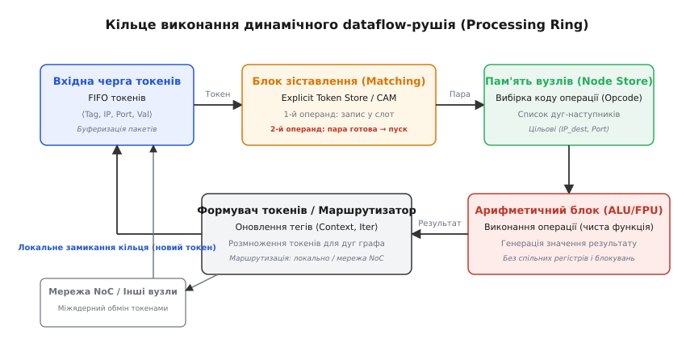
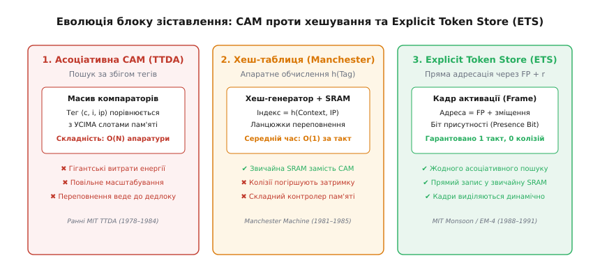
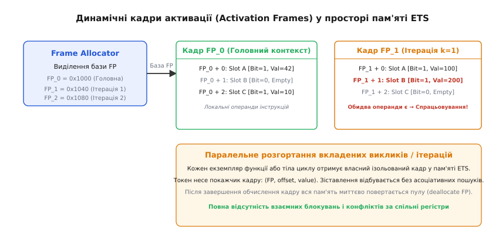
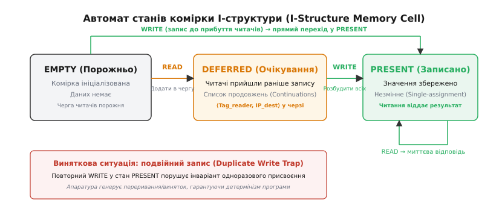

# Потокові динамічні обчислення (Dataflow Engine)

<preknowlist>
- [Dataflow-архітектури](root:hw-arch/dataflow-architecture) — базова парадигма обчислень за готовністю даних, статичні графи Денніса та відмінність від моделі фон Неймана.
- [Цикл виконання інструкції](root:hw-arch/instruction-cycle-detail) — стадії вибірки, декодування та виконання команд у класичних CPU.
- [Позачергове виконання](root:hw-arch/out-of-order-execution) — динамічне планування мікрооперацій за допомогою станцій очікування (RS) та перейменування регістрів (RAT).
- [Конвеєр](root:hw-arch/pipeline) — розбиття обчислень на синхронні стадії та структурні затримки.
</preknowlist>

Коли програма розгортає рекурсивний виклик або ітерує цикл з мільйона операцій, статичний граф потоку даних стикається з нездоланною фізичною перешкодою: кожна дуга графа здатна утримувати не більше одного токена за раз. Якщо вузол-виробник випустить новий результат до того, як вузол-споживач забере попередній, старе значення буде затерте, а обчислення спотворене. Щоб уникнути колізій, статичній системі доводиться штучно призупиняти обчислення зворотними сигналами підтвердження (*acknowledgments*), що знищує конвеєризацію циклів і змушує незалежні ітерації виконуватися суворо послідовно.

**Динамічний потоковий рушій** (англ. *Dynamic Dataflow Engine*, парадигма тегованих токенів) розв'язує цю проблему, дозволяючи нескінченній кількості паралельних ітерацій та рекурсивних гілок одночасно циркулювати крізь один і той самий скомпільований граф. Замість дублювання апаратних операторів система прикріплює до кожного кванта даних динамічний **тег контексту** (*tag*), який однозначно ідентифікує номер екземпляра функції чи крок циклу. Апаратний рушій перетворює статичну топологію коду на динамічний вихор самосинхронізованих пакетів, де операції активуються в мить зустрічі операндів з ідентичними тегами.

> 🔧 **Навіщо це.** У сучасних задачах машинного навчання, асинхронних графових базах даних та високопродуктивному науковому моделюванні структури залежностей між задачами розгортаються динамічно під час виконання. Архітектура Dynamic Dataflow Engine усуває потребу в глобальних замках (*locks*), бар'єрах синхронізації та послідовних лічильниках команд, забезпечуючи автоматичне завантаження тисяч обчислювальних ядер безпосередньо за фактом готовності операндів.

## Проблема реентрабельності та межа статичного потоку даних

Щоб зрозуміти необхідність динамічного рушія, простежимо поведінку статичного dataflow-графа на прикладі простого циклу:

```
for (int i = 0; i < N; ++i) {
    x = f(x);
}
```

У статичній моделі Денніса тіло функції `f(x)` представлене фіксованим набором апаратних або пам'яттєвих вузлів. Якщо функція `f` складається з трьох послідовних стадій `A → B → C`, то за відсутності тегів операнд ітерації `i = 1` не може увійти у вузол `A`, доки операнд ітерації `i = 0` не дійде до виходу `C` і не надішле сигнал підтвердження назад у точку входу.

Це призводить до трьох непереборних обмежень:
1. **Повна втрата конвеєризації**: проміжні вузли графа простоюють більшу частину часу, оскільки на всьому шляху дозволено перебувати лише одному значенню.
2. **Неможливість прямої рекурсії**: функція `fib(n) = fib(n - 1) + fib(n - 2)` вимагає одночасного існування сотень незалежних контекстів виконання для різних значень `n`. У статичному графі їхні токени неминуче перемішалися б у спільних вхідних портах.
3. **Накладні витрати на підтвердження**: на кожен інформаційний токен система змушена генерувати службовий зворотний сигнал *Ack*, що подвоює трафік комутаційної мережі.

Динамічний потоковий рушій скасовує правило одного токена: дуга стає віртуальним безмежним каналом, у якому вільно співіснують токени різних ітерацій.

## Анатомія динамічного dataflow-рушія: кільце обчислень

Мікроархітектурним ядром динамічного рушія є **обчислювальне кільце** (*Processing Ring*). На відміну від класичного конвеєра фон Неймана (*Fetch → Decode → Execute → Writeback*), кільце потоку даних працює як замкнена циклічна мережа доставки та зіставлення повідомлень.


*Кільце виконання динамічного потокового рушія: токени надходять у вхідну чергу FIFO, проходять блок зіставлення (Matching Unit / ETS), де знаходять свій парний операнд, зчитують код операції з Node Store, виконуються в ALU та розмножуються маршрутизатором для локального кільця або міжядерної мережі NoC.*

Кільце складається з п'яти взаємопов'язаних функціональних блоків:

### 1. Вхідна черга токенів (Token Queue, TQ)
Кільцевий буфер типу FIFO, який згладжує тимчасові сплески генерації операндів. Сюди потрапляють як токени, породжені власним ALU на попередніх обертах кільця, так і зовнішні пакети, що надійшли через мережу на кристалі (*Network-on-Chip*, NoC) від інших процесорних ядер.

### 2. Блок зіставлення операндів (Matching Unit / ETS)
Критичний вузол, відповідальний за зустріч парних операндів. Якщо інструкція є унарною (потребує одного входу), токен миттєво пропускається далі. Якщо інструкція бінарна (додавання, множення), блок перевіряє, чи прибув уже перший операнд:
* **Перший токен**: записується у відповідний слот очікування; подальше просування призупиняється.
* **Другий токен**: витягує збереженого партнера зі слота, формує готову пару `⟨Op1, Op2⟩` і передає її на наступну стадію.

### 3. Пам'ять вузлів графа (Node Store / Instruction Fetch)
Зберігає статичне представлення програми. За індексом інструкції `IP` блок зчитує:
* Код операції (*Opcode*: `ADD`, `MUL`, `BRANCH`, `I_READ`);
* Список цільових адрес наступників — дескриптори дуг `⟨IP_dest, Port_dest⟩`, куди слід направити результат.

### 4. Обчислювальний блок (Execution Unit / ALU / FPU)
Набір повністю конвеєризованих функціональних блоків. Оскільки всі операнди вже гарантовано присутні, операція виконується за фіксовану кількість тактів без будь-яких структурних затримок, простоїв чи звернень до спільних регістрів.

### 5. Формувач токенів і маршрутизатор (Token Form & Distribution Unit)
Отримує результат обчислення від ALU, комбінує його з адресами наступників із Node Store, оновлює динамічні теги (наприклад, інкрементує індекс ітерації) та формує вихідні пакети-токени. Якщо цільовий вузол розташований на цьому ж ядрі, токен повертається у власну чергу TQ; якщо на сусідньому — передається маршрутизатору мережі NoC.

## Будова динамічного токена: теги, контексти та ітерації

У динамічній системі токен є самодостатнім квантом інформації. Його розмір у залізі зазвичай становить від 96 до 128 біт.

```
┌────────────────────────────────────────────────────────────────────────┐
│                              ТОКЕН (Token)                             │
├──────────────────────────────┬──────────────┬──────────┬───────────────┤
│          Тег (Tag)           │  Адреса (IP) │ Порт (P) │ Значення (Val)│
│  ⟨Context_ID, Iteration_ID⟩  │  16–32 біти  │  1–2 біти│  32–64 біти   │
└──────────────────────────────┴──────────────┴──────────┴───────────────┘
```

Поля токена виконують чіткі функції:
* **Значення (`Value`)**: корисні дані (ціле число, число з рухомою комою, покажчик на складну структуру пам'яті або булевий прапорець).
* **Покажчик інструкції (`Instruction Pointer, IP`)**: номер оператора в графі програми.
* **Номер порту (`Port`)**: визначає, яким саме входом для операції є даний токен (`Port 0` — лівий операнд / ділене; `Port 1` — правий операнд / дільник).
* **Тег (`Tag`)**: динамічний ідентифікатор простору виконання. Складається з двох компонентів:
  1. `Context_ID` (`c`): унікальний числовий ідентифікатор екземпляра функції або рекурсивного виклику.
  2. `Iteration_ID` (`i`): порядковий номер поточної ітерації циклу.

**Правило спрацьовування вузла у динамічному dataflow:**
Оператор `IP` у контексті `c` на ітерації `i` активується тоді й тільки тоді, коли в блок зіставлення надійшли токени:
`Token_Left  = ⟨⟨c, i⟩, IP, Port 0, Val_A⟩`
`Token_Right = ⟨⟨c, i⟩, IP, Port 1, Val_B⟩`

Незважаючи на те, що крізь процесорне кільце одночасно проходять токени ітерацій `i = 0, 1, 2, ..., 1000`, вони ніколи не змішуються між собою, оскільки їхні теги строго різняться.

## Архітектура Matching Store: від асоціативної CAM до Explicit Token Store (ETS)

Найскладнішою інженерною задачею динамічного dataflow завжди була реалізація блоку зіставлення. Еволюція цього механізму пройшла три фундаментальні етапи:


*Три етапи еволюції Matching Store: 1. Повністю асоціативна пам'ять CAM (пошук за збігом усіх бітів, високі енерговитрати). 2. Апаратне хешування (Manchester Machine, колізії та змінна затримка). 3. Explicit Token Store (Monsoon, пряма адресація через покажчик кадру FP + r та біт присутності).*

### 1. Повністю асоціативна пам'ять CAM (MIT TTDA, 1978–1983)
У перших концепціях блоку зіставлення використовувалася асоціативна пам'ять (*Content-Addressable Memory*, CAM). При надходженні токена його тег `⟨c, i, IP⟩` паралельно транслювався на тисячі компараторів усіх слотів пам'яті.
* **Перевага**: пошук пари виконувався за один такт.
* **Фатальний недолік**: площа та енергоспоживання масиву CAM масштабувалися як `O(N)` від кількості слотів. Спроби створити Matching Store місткістю понад кілька тисяч записів призводили до колосального перегріву чипа та астрономічної вартості кремнію.

### 2. Апаратне хешування (Manchester Dataflow Machine, 1981)
Інженери Манчестерського університету замінили CAM на звичайну пам'ять SRAM з апаратним обчислювачем хеш-функції `h(c, i, IP)`.
* **Перевага**: використання щільної та дешевої пам'яті SRAM.
* **Недолік**: неминучі колізії хеш-таблиці. Коли кілька непов'язаних токенів потрапляли в один кошик, апаратура мусила розкручувати ланцюжки переповнення, через що час доступу ставав стохастичним, а конвеєр зазнавав затримок.

Детальний математичний аналіз завантаження пам'яті Matching Store, ймовірностей колізій та закону Літтла для черг операндів викладено у вставці [Математичний аналіз та моделювання пропускної здатності блоку зіставлення токенів](root:hw-arch/dynamic-dataflow-engine/math-matching-store-scaling.md) — у ній наведено виведення формул оптимального балансу пам'яті та критичних затримок.

### 3. Explicit Token Store (ETS, MIT Monsoon, 1988)
Справжній прорив здійснили Грегорі Пападопулос та професор Арвінд, запропонувавши парадигму **Explicit Token Store (ETS)**.

Головне відкриття ETS полягало в тому, що динамічний пошук за тегами взагалі не потрібен, якщо перекласти розподіл адрес операндів на компілятор.

Історію створення цієї архітектури, подолання кризи асоціативного пошуку та створення суперкомп'ютера Monsoon описано у вставці [Від асоціативної пам'яті до Explicit Token Store: історія архітектури Monsoon](root:hw-arch/dynamic-dataflow-engine/hist-monsoon-ets.md) — там показано, як відмова від CAM уможливила побудову перших комерційно життєздатних багатопроцесорних dataflow-систем.

## Динамічні кадри активації (Activation Frames) у просторі ETS

В архітектурі ETS кожному динамічному екземпляру функції чи ітерації циклу виділяється фіксований блок комірок у звичайній пам'яті SRAM — **кадр активації** (*activation frame*), адресований покажчиком кадру `FP` (*Frame Pointer*).


*Розподіл простору пам'яті ETS: менеджер Frame Allocator виділяє ізольовані кадри активації (FP0, FP1, FP2) під кожну паралельну ітерацію циклу чи рекурсивний виклик. Усередині кадру кожен слот має власний біт присутності (Presence Bit), що зводить перевірку готовності операндів до швидкого атомарного бітового тесту.*

Тепер токен несе не абстрактний контекст, а точну фізичну адресу слота:

```
Токен ETS = ⟨FP, r, IP, Value⟩
```

де:
* `FP` — базова адреса кадру активації в локальній SRAM;
* `r` — статичне зміщення слота операнда всередині кадру (призначається компілятором під час збірки графа);
* `IP` — адреса коду інструкції в Node Store.

### Механізм біта присутності (Presence Bit)

Кожен слот пам'яті кадру складається з поля даних (64 біти) та одного службового **біта присутності** (`P-bit`):
1. **Ініціалізація**: при виділенні кадру активації всі `P-біти` слотів скидаються в `0` (`EMPTY`).
2. **Прибуття першого операнда**: апаратура звертається за прямою адресою `Addr = FP + r`. Оскільки `P-bit == 0`, значення токена записується в слот, а `P-bit` атомарно встановлюється в `1` (`PRESENT`). Операція на цьому завершується за 1 такт.
3. **Прибуття другого операнда**: апаратура знову читає комірку `FP + r`. Оскільки `P-bit == 1`, процесор забирає збережене значення першого операнда, скидає `P-bit` назад у `0` і миттєво відправляє повну пару `⟨Val_first, Val_second⟩` разом з інструкцією `IP` до черги виконання ALU.

Цей підхід повністю ліквідував асоціативну пам'ять: операція зіставлення перетворилася на звичайне детерміноване однотактове читання-модифікацію-запис у дешеву пам'ять SRAM.

## Пам'ять структур даних: I-структури (I-Structures) та M-структури (M-Structures)

У чистому потоці даних усі значення передаються безпосередньо як скалярні токени. Проте якщо програмі потрібно оновити один елемент у масиві з мільйона чисел, передача всього масиву через токени призвела б до необхідності копіювання мільйона значень на кожній операції, що катастрофічно перевантажило б мережу та пам'ять.

Для роботи з агрегатними даними (масивами, матрицями, деревами) у динамічних dataflow-системах було розроблено спеціалізовані моделі пам'яті з апаратною синхронізацією.

### I-структури (I-Structures, Incremental Structures)

I-структура — це масив пам'яті, що базується на принципі **одноразового присвоєння** (*single-assignment*). Кожна комірка I-структури може бути записана рівно один раз протягом життя масиву, але прочитана довільну кількість разів.


*Автомат станів комірки I-структури: читання порожньої комірки EMPTY переводить її у стан DEFERRED із постановкою читача в чергу очікування; запис WRITE фіксує значення в стані PRESENT і розсилає результат усім підписаним споживачам. Повторний запис викликає апаратний виняток.*

Кожна комірка I-структури підтримує три апаратні стани:
1. **EMPTY (Порожньо)**: пам'ять виділена, значення ще не обчислене.
2. **DEFERRED (Відкладено)**: один або кілька споживачів спробували прочитати комірку до того, як продюсер записав у неї дані. Комірка зберігає зв'язний список адрес очікуючих токенів (*deferred readers list*).
3. **PRESENT (Записано)**: значення записане і більше ніколи не зміниться.

**Семантика операцій над I-структурами:**
* `I_READ(A, i)`: якщо комірка `A[i]` у стані `PRESENT`, значення негайно повертається запитувачу. Якщо комірка в стані `EMPTY` або `DEFERRED`, потік читача не блокує процесорне ядро: адреса токена-споживача просто додається до списку відкладеного читання, а ядро перемикається на виконання інших готових токенів.
* `I_WRITE(A, i, Value)`: значення записується в комірку. Якщо стан був `DEFERRED`, контролер пам'яті автоматично генерує токени-відповіді для всіх читачів із черги очікування та переводить комірку в стан `PRESENT`. Якщо комірка вже перебувала у стані `PRESENT`, система фіксує спробу повторного запису і генерує виняток (*Duplicate Write Trap*).

Завдяки такій логіці програмістам не потрібно вручну розставляти бар'єри синхронізації між генерацією масиву та його споживанням: споживачі можуть стартувати одночасно з продюсерами, а апаратура I-структур автоматично синхронізує їх на рівні індивідуальних елементів.

### M-структури (M-Structures, Mutable Structures)

I-структури ідеально підходять для функціональних незмінних даних, але непридатні для створення динамічних черг, лічильників та акумуляторів зі спільним станом. Для цього застосовують **M-структури**.

Комірка M-структури має два стани: `EMPTY` та `FULL`:
* Операція `TAKE(M, i)`: атомарно зчитує значення та переводить комірку в стан `EMPTY`. Якщо комірка вже була порожньою, запит стає в чергу очікування.
* Операція `PUT(M, i, Value)`: записує значення в порожню комірку і переводить її в стан `FULL`. Якщо комірка була повною, запит очікує на її звільнення.

M-структури є апаратним еквівалентом захищених черг повідомлень та м'ютексів, реалізованих безпосередньо в логіці контролера пам'яті без залучення операційної системи.

## Управління паралелізмом і загроза вибуху пам'яті: `k`-обмежені цикли

Динамічний потоковий рушій має фундаментальну небезпеку: **неконтрольований вибух паралелізму** (*unbounded parallelism explosion*).

Якщо цикл містить 10⁶ ітерацій, і кожна ітерація є незалежною, динамічний рушій спробує миттєво розгорнути всі мільйон ітерацій у пам'яті. Кожна ітерація вимагатиме власного кадру активації `FP` та десятків слотів операндів. Якщо швидкість генерації нових ітерацій перевищує пропускну здатність ALU, пам'ять ETS та буфери черг токенів будуть миттєво переповнені, що призведе до аварійної зупинки всієї машини.

### Механізм `k`-обмежених циклів (k-Bounded Loops)

Щоб утримати споживання пам'яті в строго визначених межах, компілятори dataflow використовують техніку **`k`-обмеження**: у кожен момент часу системі дозволяється паралельно виконувати **не більше ніж `k` одночасних ітерацій**.

```
Ітерація (i + k) стартує ТІЛЬКИ ПІСЛЯ отримання токена Ack від ітерації i
```

Для цього в граф циклу вбудовується керівний лічильник з кільцевим пулом дозволів:
1. На старті циклу в керівний контур випускається рівно `k` токенів-дозволів (*acknowledgment tokens*).
2. Щоб ініціалізувати ітерацію `j`, генератор мусить спожити один дозвіл.
3. Коли ітерація `j` повністю завершує всі свої обчислення та звільняє свій кадр активації `FP_j`, вона надсилає новий токен-дозвіл на вхід циклу, дозволяючи стартувати ітерації `j + k`.

Це гарантує, що розмір необхідної пам'яті для циклу ніколи не перевищить величини `k · S_frame`, де `S_frame` — розмір одного кадру, незалежно від того, скільки мільйонів ітерацій містить цикл.

## Сучасні апаратні та програмні dataflow-рушії

Сьогодні ідеї динамічного потоку даних переживають друге народження у двох провідних напрямках: спеціалізованих апаратних просторових процесорах та асинхронних програмних рушіях виконання задач.

### 1. Просторові реконфігуровні процесори (CGRAs та AI-акселератори)
* **SambaNova Reconfigurable Dataflow Unit (RDU)**: процесор складається з масиву обчислювальних модулів (*Pattern Compute Units*, PCU) та комутаторів пам'яті (*Pattern Memory Units*, PMU). Графи моделей штучного інтелекту розгортаються просторово на кремнії, де тензорні токени проходять конвеєром безпосередньо від одного оператора до іншого без постійних звернень до зовнішньої DRAM.
* **Cerebras Wafer-Scale Engine (WSE)**: гігантський чіп на всю кремнієву пластину (понад 850 000 ядер), де кожне ядро з'єднане апаратною мережею *Dataflow Fabric*. Поява 32-бітного слова на порту ядра викликає апаратне спрацьовування відповідної мікрокоманди за один такт.
* **Tenstorrent (Wormhole / Blackhole)**: архітектура на базі сітки ядер *Tensix*, оптимізована під потокове переміщення та асинхронну трансформацію тензорних пакетів.

### 2. Програмні Dataflow-рушії на класичних CPU
На рівні системного програмування принципи динамічного dataflow реалізовані у вигляді графових бібліотек планування задач:
* **Intel oneTBB Flow Graph**: бібліотека для C++, де вузли представляють обчислювальні тіла, а дуги — типізовані канали передачі повідомлень з підтримкою буферизації та зіставлення за ключами.
* **Task-Based Runtimes (StarPU, HPX, PaRSEC)**: високопродуктивні системні рушії для суперкомп'ютерів, де задачі (*tasks*) представляються вузлами графа, а їхній запуск на потоках CPU чи ядрах GPU ініціюється автоматично в мить, коли лічильник невиконаних попередників (*predecessors counter*) досягає нуля.

Детальний програмний контракт системного інтерфейсу потокового рушія, формати структур даних, коди помилок та правила потокобезпеки наведено у вставці [Інтерфейс та контракт асинхронного dataflow-рушія](root:hw-arch/dynamic-dataflow-engine/api-dataflow-runtime.md) — у ній специфіковано стандартизований C/C++ API для інтеграції потокового виконання у системні застосунки.

Практичну програмну реалізацію повнофункціональної віртуальної машини з динамічними кадрами активації ETS, чергою токенів та I-структурами двома мовами (C та C++) наведено у проектній вставці [Реалізація динамічної віртуальної машини Dataflow з кадрами активації та I-структурами](root:hw-arch/dynamic-dataflow-engine/proj-dynamic-dataflow-vm.md).

## Покроковий трасувальний приклад: виконання рекурсивного виклику в ETS

Розглянемо покрокову динаміку роботи ETS-рушія на прикладі обчислення математичного виразу `(10 + 20) · (50 − 15)` двома паралельними гілками.

### Скомпільований граф
* **Вузол 0 (`ADD`)**: бінарний, використовує слот 0 кадру. Вихід спрямований у порт 0 Вузла 2.
* **Вузол 1 (`SUB`)**: бінарний, використовує слот 1 кадру. Вихід спрямований у порт 1 Вузла 2.
* **Вузол 2 (`MUL`)**: бінарний, використовує слот 2 кадру. Вихід спрямований у порт 0 Вузла 3.
* **Вузол 3 (`OUTPUT`)**: унарний термінальний вузол.

### Покрокова трасувальна таблиця роботи кільця

| Такт | Вхідна черга (TQ) | Стан кадру ETS (`FP_0`) | Дія ALU / Рушія | Згенеровані вихідні токени |
| :--- | :--- | :--- | :--- | :--- |
| **T0** | `⟨FP0, Node0, P0, 10⟩`<br>`⟨FP0, Node0, P1, 20⟩`<br>`⟨FP0, Node1, P0, 50⟩`<br>`⟨FP0, Node1, P1, 15⟩` | Slot 0: `EMPTY`<br>Slot 1: `EMPTY`<br>Slot 2: `EMPTY` | Вибірка першого токена `⟨FP0, Node0, P0, 10⟩` | Немає |
| **T1** | `⟨FP0, Node0, P1, 20⟩`<br>`⟨FP0, Node1, P0, 50⟩`<br>`⟨FP0, Node1, P1, 15⟩` | Slot 0: `PRESENT (Val=10)`<br>Slot 1: `EMPTY`<br>Slot 2: `EMPTY` | Запис у Slot 0. Вибірка другого токена `⟨FP0, Node0, P1, 20⟩` | Немає |
| **T2** | `⟨FP0, Node1, P0, 50⟩`<br>`⟨FP0, Node1, P1, 15⟩` | Slot 0: `EMPTY` (звільнено)<br>Slot 1: `EMPTY`<br>Slot 2: `EMPTY` | Збіг у Slot 0! ALU виконує `10 + 20 = 30`. Вибірка `⟨FP0, Node1, P0, 50⟩` | Емісія: `⟨FP0, Node2, P0, 30⟩` |
| **T3** | `⟨FP0, Node1, P1, 15⟩`<br>`⟨FP0, Node2, P0, 30⟩` | Slot 0: `EMPTY`<br>Slot 1: `PRESENT (Val=50)`<br>Slot 2: `EMPTY` | Запис у Slot 1. Вибірка токена `⟨FP0, Node1, P1, 15⟩` | Немає |
| **T4** | `⟨FP0, Node2, P0, 30⟩` | Slot 0: `EMPTY`<br>Slot 1: `EMPTY` (звільнено)<br>Slot 2: `EMPTY` | Збіг у Slot 1! ALU виконує `50 − 15 = 35`. Вибірка `⟨FP0, Node2, P0, 30⟩` | Емісія: `⟨FP0, Node2, P1, 35⟩` |
| **T5** | `⟨FP0, Node2, P1, 35⟩` | Slot 0: `EMPTY`<br>Slot 1: `EMPTY`<br>Slot 2: `PRESENT (Val=30)` | Запис у Slot 2. Вибірка токена `⟨FP0, Node2, P1, 35⟩` | Немає |
| **T6** | Черга порожня | Slot 0: `EMPTY`<br>Slot 1: `EMPTY`<br>Slot 2: `EMPTY` (звільнено) | Збіг у Slot 2! ALU виконує `30 · 35 = 1050`. | Емісія: `⟨FP0, Node3, P0, 1050⟩` |
| **T7** | `⟨FP0, Node3, P0, 1050⟩`| Усі слоти кадру вільні | Вузол 3 (OUTPUT) фіксує результат `1050`. Кадр `FP_0` повертається у пул вільних ресурсів. | Завершення |

Як видно з трасування, обидві арифметичні гілки (`ADD` та `SUB`) розвивалися паралельно та незалежно, а їхнє зведення у вузлі `MUL` відбулося автоматично через механізм біта присутності в кадрі активації без єдиної інструкції синхронізації чи блокування потоків.

Динамічний потоковий рушій довів, що обчислення можуть бути повністю децентралізованими, а порядок виконання інструкцій є природним наслідком руху самих даних.
