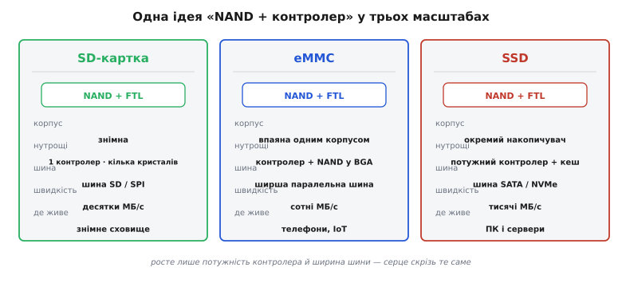

# eMMC і SSD

[SD-картка](topic:hw-arch/sd-card) тримається на одному прийомі: сховати норовливу NAND за **контролером** (*controller*, керівна мікросхема), який віддає назовні прості **сектори**. Той самий прийом працює й у більшому масштабі — у впаяній пам'яті телефонів (**eMMC**, *embedded MultiMediaCard*, вбудована мультимедіа-картка) і у великих накопичувачах комп'ютерів (**SSD**, *Solid-State Drive*, твердотільний накопичувач). Усі вони — це «NAND плюс контролер», лише потужніший контролер, ширша шина й більше кристалів. Та цікаво придивитися до **самого** того прошарку всередині контролера, бо в нього є ім'я й окрема роль: **FTL** (*Flash Translation Layer*, прошарок трансляції флеш). Саме він робить головний фокус — змушує флеш **вдавати з себе диск**. Ідея FTL пояснює, чому будь-яке флеш-сховище — від картки до серверного SSD — поводиться так, як поводиться.

### Навіщо взагалі вдавати диск

Питання, з якого все починається: чому не дати системі працювати з NAND **напряму**? Бо NAND **незручна** саме тими рисами, що відрізняють її від [інших типів флеш](root:embedded/nor-vs-nand), а звичні файлові системи й операційні системи очікують зовсім іншого — рівного диска з секторами, які можна **перезаписувати на місці**.


*Зверху операційна система бачить рівний диск: пронумеровані сектори, кожен можна читати, писати й перезаписувати на місці. Знизу — реальна NAND: доступ сторінками, стирання великими блоками, дефектні комірки, обмежений ресурс. Між ними сидить FTL усередині контролера: він тримає таблицю «логічний сектор → фізична сторінка», ховає дефекти, розкидає знос і прибирає сміття. Уся незручність NAND лишається внизу й нагору не просочується.*

Суть невідповідності варто проговорити, бо вона й породжує FTL. Файлова система хоче сказати «перезапиши сектор 1000» — і щоб це просто спрацювало. Але NAND так **не вміє**: щоб змінити вже записану сторінку, її не можна просто перекрити — спершу треба **стерти** цілий блок (а блок великий, у ньому багато сторінок), і лише потім писати. Прямо віддати NAND системі означало б змусити кожну файлову систему знати про сторінки, блоки, стирання, дефекти й знос — нездійсненно. Тому контролер ставить **FTL** — прошарок, що приймає прості «диско-подібні» запити зверху й перекладає їх на реальні операції з NAND знизу, ховаючи всю незручність. Для системи флеш виглядає як звичайний диск; уся складність замкнена у FTL.

### Що робить FTL: відображення й підміна

Як саме FTL створює цю ілюзію? Через **таблицю відображення** (*mapping table*) і свободу класти дані **куди завгодно** фізично.

Головний трюк такий: коли система просить «перезаписати сектор 1000», FTL **не** стирає старе місце. Натомість він пише нові дані на якусь **вільну** сторінку, а в таблиці просто змінює запис: «сектор 1000 тепер ось тут». Старій сторінці ставиться позначка «застаріла», і колись пізніше, у спокійний момент, FTL збере такі застарілі сторінки й гуртом **прибере** (зітре блок, щоб звільнити місце) — це звуть **збиранням сміття** (*garbage collection*). Завдяки цій непрямості FTL вільний класти кожен запис туди, де зручно, — а отже, може **рівномірно розкидати** записи по всіх комірках, щоб жодна не зносилася швидше за інших, і **обходити** дефектні блоки, підставляючи замість них запасні. Логічний номер сектора, який бачить система, і фізичне місце, де дані лежать насправді, **роз'єднані** — і саме це роз'єднання дає FTL свободу творити всі свої хитрощі.

Аналогія — **бібліотекар із каталогом**. Уявіть, що ви просите «книгу №1000». Читачеві байдуже, на якій саме полиці вона лежить, — він знає лише номер у каталозі. Бібліотекар (FTL) тримає каталог «номер → полиця» і вільний переставляти книги між полицями, аби читач завжди знаходив потрібну за номером. Коли книгу оновлюють, бібліотекар не стирає стару на її полиці (це довго), а кладе нову на будь-яку вільну й **виправляє каталог**; стару позначає «на викидання» й прибирає згодом гуртом. Ця непрямість і дає всю гнучкість: книги можна розкладати рівномірно (щоб одні полиці не зношувалися, поки інші порожні) і обминати **зламані** полиці. Так само й FTL: каталог-таблиця відв'язує номер сектора від фізичного місця, і саме ця свобода дозволяє рівно зношувати комірки й обходити дефекти, не турбуючи систему вгорі.

**Приклад (як перезапис стає переадресацією).** Простежмо, що робить FTL, коли система двічі пише в той самий сектор.

```
система:  записати сектор 1000 = "AAAA"
FTL:      кладу на фізичну сторінку 5; таблиця: [сектор 1000 → стор. 5]
          ─────────────────────────────────────────────────────────
система:  перезаписати сектор 1000 = "BBBB"
FTL:      НЕ чіпаю сторінку 5 (стирати дорого!);
          кладу "BBBB" на вільну сторінку 9;
          таблиця: [сектор 1000 → стор. 9];  стор. 5 ← позначка "сміття"
          ─────────────────────────────────────────────────────────
згодом:   garbage collection зітре блок зі сторінкою 5, повернувши її у вільні
```

Висновок прикладу: «перезапис на місці», який бачить система, насправді — **переадресація** на нове фізичне місце плюс відкладене прибирання старого. Так FTL і примиряє вимогу системи (перезаписуй будь-який сектор) із природою NAND (стирати можна лише блоками).

Із цієї механіки випливають дві поведінки, які корисно розуміти на практиці. Перша: флеш-сховище може **пригальмовувати непередбачувано**. Поки є запас вільних сторінок, запис летить швидко; коли вільне місце вичерпується, FTL мусить спершу **прибрати сміття** (зібрати застарілі сторінки й стерти блоки), щоб звільнити простір, — і саме в ці моменти запис ненадовго просідає. Тому повний накопичувач часто пише повільніше за порожній, і це не поломка, а наслідок роботи FTL. Друга, важливіша для надійності: оскільки в момент запису FTL **оновлює таблицю** відображення й перекидає дані, **раптове зникнення живлення посеред запису** може лишити цю внутрішню кухню в напівготовому стані. Хороші контролери захищаються від цього, та висновок для розробника простий: не висмикуйте живлення (і не виймайте картку) під час активного запису, а в пристрої, де живлення може зникнути будь-коли, передбачте акуратне завершення запису — інакше ризикуєте пошкодити не один сектор, а структуру сховища.


*Одна ідея в трьох масштабах. SD-картка — знімна, один контролер і кілька NAND-кристалів, шина SD/SPI, десятки МБ/с. eMMC — той самий комплект, але впаяний у плату одним корпусом BGA, ширша паралельна шина, сотні МБ/с; це типова пам'ять телефонів та IoT-пристроїв. SSD — окремий накопичувач із потужним контролером і кеш-пам'яттю, шина SATA чи NVMe, тисячі МБ/с; це диски ПК і серверів. Скрізь усередині — «NAND + FTL», росте лише потужність контролера й ширина шини.*

> 🔧 **Навіщо це.** Ідея FTL пояснює поведінку **будь-якого** флеш-сховища, з яким ви працюєте. Перше: контролер **вдає диск**, тож для вашого коду й SD, і eMMC, і SSD — це прості блокові пристрої з секторами; складність NAND вас не стосується, нею опікується FTL. Друге: оскільки «перезапис на місці» насправді є переадресацією плюс відкладене прибирання, продуктивність флеш-сховища **непостійна** — буває, що збирання сміття на мить пригальмовує запис; це нормально й закладено в природу FTL. Третє, концептуальне: **роз'єднання** логічного й фізичного розташування — це те, що дає змогу взагалі надійно зберігати дані на пам'яті з обмеженим ресурсом і дефектами. А ось **деталі** того, як саме FTL [вирівнює знос комірок](topic:sf-data/wear-leveling) (wear leveling), — окрема велика тема; тут досить твердо засвоїти головну ідею: **контролер вдає диск**.

Те, що ховається під словом «контролер», насправді робить кілька справ нараз, і кожна випливає з тієї ж непрямості. Окрім таблиці відображення й збирання сміття, він **вирівнює знос** (щоб усі комірки старіли рівно, а не кілька гарячих наперед), **обходить дефектні блоки** (підставляючи запасні), а кожну сторінку при читанні **виправляє кодом корекції помилок** (*ECC, error-correcting code*) — бо стара зношена NAND віддає окремі біти з похибкою. Звідси й видно межу класу: те саме сховище з тонким контролером старіє швидше (як у дешевшій eMMC), а з потужним — живе довше й тримає сплески запису рівніше (як у доброму SSD). Та принцип під ними **один** — «NAND + контролер, що вдає диск», і саме тому, розібравши FTL, ви наперед розумієте поведінку будь-якого з них.

Цей принцип добрий для **великих** даних блоками. Зовсім інакше поводиться крихітне налаштування, яке хочуть оновлювати **окремими байтами** й часто: для нього велика блокова флеш незручна, і його тримають у [EEPROM чи FRAM](root:embedded/eeprom-fram) — пам'яті з побайтовим доступом.
