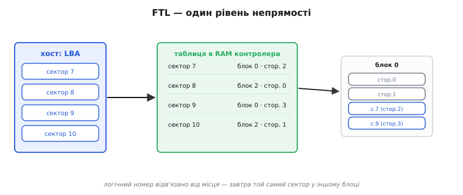
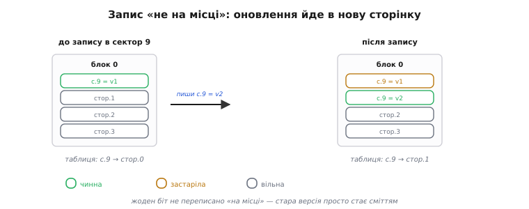
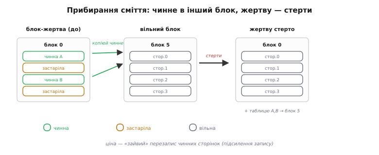

# ⚙️ Іграшковий FTL: таблиця відображення і garbage collection у 100 рядків

> Алгоритмічна вставка про те, як влаштовано [FTL — прошарок, що вдає з себе диск](topic:hw-arch/emmc-ssd). Зовні все просто: операційна система гадає, що під нею звичайний диск із рівних нумерованих секторів, а насправді всередині — примхлива NAND-флеш, і контролер лише **вдає** диск через прошарок **FTL** (*Flash Translation Layer*, рівень трансляції флеші). А як саме цей фокус робиться **зсередини**? Найкоротший шлях побачити — зібрати найпростіший робочий FTL власноруч: навмисне наївний, у сотню рядків, зате видно кожну шестерню, що перетворює «дірчасту» флеш на охайний диск.

## Задача

Уся складність береться з того, чим [NAND-флеш](root:embedded/nor-vs-nand) незручна. Читати й писати її можна **посторінково** (*page*, типово кілька кілобайтів), але стерти окрему сторінку не можна — стирається лише **цілий блок** (*erase block*) з десятків чи сотень сторінок одразу. Гірше того: записати у сторінку можна, **лише** якщо вона перед тим стерта; переписати зайняту сторінку «поверх» не вийде. А хост (*host*) — комп'ютер, що звертається до накопичувача — нічого цього знати не хоче. Він шле прості команди «запиши сектор номер N» і «прочитай сектор номер N», де N — **логічна адреса** (*LBA, logical block address*), наче на старому жорсткому диску, де будь-який сектор переписують на місці скільки завгодно разів.

Отже, задача FTL — **видати рівний диск поверх нерівної флеші**: прийняти потік команд «читай/пиши сектор N» і виконати їх на залізі, що вміє лише посторінковий запис у попередньо стерті блоки. Усе непідходяще — стирання цілими блоками, заборону перезапису на місці — треба сховати від хоста.

## Ідея: таблиця відображення + запис «не на місці»

Ключ до всього — **один рівень непрямості** (*indirection*). Замість писати сектор N у якесь закріплене за ним місце, ми **відв'язуємо** логічний номер від фізичного й тримаємо **таблицю відображення** (*mapping table*): для кожного LBA — де **зараз** лежать його дані, тобто в якому блоці й на якій сторінці. Хост каже «читай сектор N» — FTL зазирає в таблицю й бачить фізичну сторінку. У цьому й увесь секрет «контролер вдає диск».


*FTL — один рівень непрямості. Хост бачить рівні сектори (LBA); таблиця в RAM контролера переводить кожен LBA у реальну фізичну сторінку всередині блока флеші. Логічний номер відв'язано від фізичного місця — тож та сама адреса завтра може жити в іншому блоці.*

Така непрямість одразу знімає **заборону перезапису на місці**. Коли хост пише в сектор, який уже десь лежить, ми не чіпаємо стару сторінку (на місці її однак не перезаписати) — а кладемо нові дані у **вільну** стерту сторінку, після чого **переводимо в таблиці** запис цього LBA на неї. Цей прийом — **запис «не на місці»** (*out-of-place write*): фізичне місце сектора щоразу нове, а логічний номер сталий.


*Оновлення сектора лягає в нову сторінку, а таблицю переводимо на неї. Стара сторінка з минулою версією даних стає застарілою (stale): дані ще лежать, та вже нікому не потрібні. Жоден біт не переписано «на місці».*

Та за елегантність доводиться платити, і плата нагромаджується сама. Кожен перезапис лишає по собі **застарілу сторінку** (*stale page*) — стару версію, яку вже ніхто не читає, але яка досі займає місце. Вільні сторінки тануть, і рано чи пізно їх не лишається зовсім, хоча добра частина флеші — застаріле сміття. Стерти ж його точково не можна: стирання працює лише **цілими блоками**, а в кожному блоці впереміш і застарілі сторінки, і ще потрібні, чинні.

Звідси сама собою постає друга половина FTL — **прибирання сміття** (*garbage collection*, GC). Ідея проста: вибрати блок, де застарілого багато, а чинного мало (його звуть **блоком-жертвою**, *victim block*); вцілілі **чинні** сторінки скопіювати у вільний блок (і, звісно, поправити на них таблицю); а тоді спорожнілий блок-жертву стерти **цілком** — і повернути в запас уже як свіжі вільні сторінки.


*Прибирання сміття: чинні сторінки блока-жертви переписуємо в інший блок, виправляємо таблицю — і аж тоді стираємо весь блок-жертву начисто. Він знову порожній і готовий приймати записи. Ціна — «зайвий» перезапис чинних сторінок.*

## Реалізація на C

FTL живе прошивкою всередині контролера, тож пишемо його мовою контролерів — C. Увесь стан — це кілька таблиць у пам'яті: сам вміст сторінок (симуляція NAND), стан кожної сторінки (вільна / чинна / застаріла), службове поле «чий LBA тут лежить» і головна таблиця відображення `map[LBA] → фізична сторінка`. Плюс «фронт запису» — куди лягає наступний запис. Оце й усе: далі три функції `ftl_read`, `ftl_write`, `garbage_collect` роблять весь фокус. Файл цілком компілюється й запускається (`main` наприкінці — маленька демонстрація, що ганяє переписами й провокує прибирання сміття).

```c
#include <stdint.h>
#include <string.h>
#include <stdio.h>

#define PAGE_SZ        512        /* байтів у сторінці */
#define PAGES_PER_BLK  4          /* сторінок у блоці  */
#define NUM_BLOCKS     8          /* блоків у «чипі»   */
#define NUM_LBA        16         /* логічних секторів (< 32 фіз. сторінок → надлишковий резерв) */

enum { PAGE_FREE, PAGE_VALID, PAGE_STALE };      /* стан фізичної сторінки */
typedef struct { int blk, page; } phys_t;        /* фізичне місце: блок + сторінка */

static uint8_t data  [NUM_BLOCKS][PAGES_PER_BLK][PAGE_SZ]; /* власне NAND          */
static uint8_t pstate[NUM_BLOCKS][PAGES_PER_BLK];          /* FREE / VALID / STALE  */
static int     powner[NUM_BLOCKS][PAGES_PER_BLK];          /* чий LBA тут лежить (службове поле) */
static phys_t  map[NUM_LBA];                               /* таблиця: LBA → фізична сторінка */
static int     wblk, wpage;                                /* фронт запису: куди кладемо наступне */

static void ftl_init(void) {
    for (int b = 0; b < NUM_BLOCKS; b++)
        for (int p = 0; p < PAGES_PER_BLK; p++) { pstate[b][p] = PAGE_FREE; powner[b][p] = -1; }
    for (int l = 0; l < NUM_LBA; l++) { map[l].blk = -1; map[l].page = -1; }  /* -1 = ще не писали */
    wblk = 0; wpage = 0;
}

static void nand_erase(int b) {                  /* стерти цілий блок начисто */
    for (int p = 0; p < PAGES_PER_BLK; p++) { pstate[b][p] = PAGE_FREE; powner[b][p] = -1; }
}

static int find_free_block(void) {               /* перший повністю стертий блок */
    for (int b = 0; b < NUM_BLOCKS; b++) {
        int all_free = 1;
        for (int p = 0; p < PAGES_PER_BLK; p++)
            if (pstate[b][p] != PAGE_FREE) { all_free = 0; break; }
        if (all_free) return b;
    }
    return -1;
}

static int free_pages(void) {                    /* скільки стертих сторінок лишилось усього */
    int n = 0;
    for (int b = 0; b < NUM_BLOCKS; b++)
        for (int p = 0; p < PAGES_PER_BLK; p++)
            if (pstate[b][p] == PAGE_FREE) n++;
    return n;
}

static phys_t alloc_page(void) {                 /* наступна вільна СТЕРТА сторінка */
    if (wpage >= PAGES_PER_BLK) { wblk = find_free_block(); wpage = 0; }  /* блок повний — беремо свіжий */
    phys_t pp = { wblk, wpage };
    wpage++;
    return pp;
}

static int pick_victim(void) {                   /* блок із найбільшою часткою застарілих */
    int best = -1, best_stale = 0;               /* жертва мусить мати хоч одну застарілу — інакше прибирати нічого */
    for (int b = 0; b < NUM_BLOCKS; b++) {
        if (b == wblk) continue;                 /* фронт запису не чіпаємо */
        int stale = 0, used = 0;
        for (int p = 0; p < PAGES_PER_BLK; p++) {
            if (pstate[b][p] == PAGE_STALE) stale++;
            if (pstate[b][p] != PAGE_FREE)  used++;
        }
        if (used && stale > best_stale) { best_stale = stale; best = b; }
    }
    return best;
}

static void garbage_collect(void) {
    int v = pick_victim();
    if (v < 0) return;                           /* нема що прибирати */
    for (int p = 0; p < PAGES_PER_BLK; p++) {    /* чинні сторінки жертви — в інше місце */
        if (pstate[v][p] != PAGE_VALID) continue;
        int lba = powner[v][p];
        phys_t np = alloc_page();                /* завжди у стерту сторінку */
        memcpy(data[np.blk][np.page], data[v][p], PAGE_SZ);
        pstate[np.blk][np.page] = PAGE_VALID;
        powner[np.blk][np.page] = lba;
        map[lba] = np;                           /* таблиця → на копію (негайно!) */
    }
    nand_erase(v);                               /* спорожнілу жертву — назад у запас */
}

void ftl_read(int lba, uint8_t *buf) {
    phys_t pp = map[lba];                         /* один погляд у таблицю */
    if (pp.blk < 0) { memset(buf, 0, PAGE_SZ); return; }   /* сюди ще не писали */
    memcpy(buf, data[pp.blk][pp.page], PAGE_SZ);
}

void ftl_write(int lba, const uint8_t *buf) {
    if (free_pages() < 2 * PAGES_PER_BLK)         /* запас тане — прибрати завчасно */
        garbage_collect();
    phys_t pp = alloc_page();                     /* нове місце → запис «не на місці» */
    memcpy(data[pp.blk][pp.page], buf, PAGE_SZ);
    pstate[pp.blk][pp.page] = PAGE_VALID;
    powner[pp.blk][pp.page] = lba;
    phys_t old = map[lba];
    if (old.blk >= 0)                             /* була попередня версія — це сміття */
        pstate[old.blk][old.page] = PAGE_STALE;
    map[lba] = pp;                                /* перевести LBA на нове місце */
}

int main(void) {
    ftl_init();
    uint8_t buf[PAGE_SZ];
    for (int round = 0; round < 12; round++)      /* переписуємо кілька секторів багато разів → */
        for (int lba = 0; lba < 6; lba++) {       /* плодимо застарілі сторінки й провокуємо GC   */
            memset(buf, (uint8_t)(round * 10 + lba), PAGE_SZ);
            ftl_write(lba, buf);
        }
    for (int lba = 0; lba < 6; lba++) {           /* читаємо назад — маємо ОСТАННЮ версію кожного */
        ftl_read(lba, buf);
        printf("LBA %2d -> 0x%02X, лежить у блоці %d\n", lba, buf[0], map[lba].blk);
    }
    printf("вільних сторінок наприкінці: %d\n", free_pages());
    return 0;
}
```

Три місця тут варті окремого слова. Перше — рядок `pstate[old.blk][old.page] = PAGE_STALE`: без цієї позначки збирач сміття не відрізнить живі дані від мертвих і або зітре потрібне, або не звільнить нічого. Друге — `map[lba] = np` **всередині** циклу `garbage_collect`: щойно чинну сторінку скопійовано, її LBA мусить негайно вказувати на копію, інакше після стирання жертви читання поведе в нікуди. Третє — поле `powner[][]`: саме з нього GC дізнається, **чий** LBA несе фізична сторінка (без цього не було б чого виправляти в таблиці). На справжньому чипі цей номер дописують поряд із даними, у службове поле кожної сторінки — так званий OOB (*out-of-band*, поза смугою даних).

## Складність і пастки на МК

- **Читання — швидке й передбачуване.** `ftl_read` — це один погляд у таблицю плюс посторінкове читання флеші: фактично O(1). Саме тому FTL і дає рівну, «дискову» поведінку на читанні.
- **Запис — нерівний у часі.** Звичайний `ftl_write` теж дешевий, та коли вільні сторінки вичерпались, його доганяє **garbage collection** — а це копіювання кількох сторінок плюс повільне стирання блока. Звідси **сплески затримки**: окремий запис раптом триває набагато довше за сусідні. Полегшують це тим, що GC роблять **наперед**, у простої, а не тоді, коли місце вже скінчилось.
- **Підсилення запису (write amplification).** GC переписує **чинні** сторінки блока-жертви, тож на один запис від хоста припадає більше **фізичних** записів у флеш. Що повніший накопичувач і що менше в блоках застарілого, то дорожче обходиться кожне прибирання — і то швидше зношується флеш.
- **Таблиця займає RAM.** Повна таблиця «сторінка-в-сторінку» — це запис на кожен LBA; для великого накопичувача вона величезна. На дрібному контролері (як-от у [SD-картці](topic:hw-arch/sd-card)) часто відображають не сторінки, а цілі блоки, або тримають у RAM лише гарячу частину таблиці — компроміс між обсягом RAM і точністю відображення.
- **Зрив живлення на півдорозі.** GC і перезапис ідуть кількома кроками (записати копію → виправити таблицю → стерти джерело). Якщо живлення зникне посеред цього, таблицю треба вміти **відновити** з тих службових полів, що лишилися у сторінках; інакше відображення розсиплеться, а з ним і весь «диск».
- **Рівномірність зносу — окрема велика тема.** Наш іграшковий GC вибирає жертву лише за кількістю сміття. Справжній FTL мусить ще й **розмазувати знос** рівно по всіх блоках, бо комірки флеші витримують скінченне число стирань. Цей механізм — [**вирівнювання зносу**](topic:sf-data/wear-leveling) (*wear leveling*) — окрема велика тема; тут ми його свідомо лишаємо за дужками.

> ⚙️ **Навіщо це.** FTL — не магія, а проста бухгалтерія поверх флеші: **таблиця відображення** (LBA → фізична сторінка) плюс **запис не на місці**, який і дає ілюзію перезапису на місці. Розплата за непрямість — застарілі сторінки, тож друга половина FTL — **garbage collection**: зібрати чинне, стерти блок цілком, повернути вільне місце. Зрозумівши цю сотню рядків, ви читаєте поведінку справжнього eMMC чи SSD як відкриту книгу: і звідки в них сплески затримки, і чому повний накопичувач уповільнюється, і чому раптовий обрив живлення для них небезпечніший, ніж для простого жорсткого диска.

### Звідки взявся FTL

Наостанок — справжня історія самої ідеї. Прийом «таблиця відображення + запис не на місці» молодший, ніж здається, і народився не з флеш-пам'яті, а з **журнально-структурованих файлових систем** (*log-structured file systems*). Думку «не переписуй на місці, а дописуй нову версію й переводь покажчик» систематизували **Мендел Розенблюм** (*Mendel Rosenblum*) і **Джон Остергаут** (*John Ousterhout*) у Каліфорнійському університеті в Берклі для операційної системи Sprite: доповідь на конференції SOSP 1991 року, розширена стаття в журналі ACM TOCS 1992-го. Робили це спершу заради швидкого запису на **жорсткі диски**, а не заради флеші.

Та саме флеш-пам'ять зробила цю ідею неминучою: її «стирай блоками, не переписуй на місці» — буквально те, на що журнальний підхід лягає як влитий. Прошарок, що ховає ці примхи за фасадом звичайного диска, оформив **Амір Бан** (*Amir Ban*) в ізраїльській компанії **M-Systems**: патент на флеш-«файлову систему» з пріоритетом 1994 року (US 5 404 485). Того ж 1994-го асоціація **PCMCIA** затвердила специфікацію **FTL** — на основі рішення M-Systems (TrueFFS), у співавторстві зі SCM Microsystems і за підтримки Intel; відтоді назва прижилася для всього класу таких прошарків. Паралельно дослідницькі флеш-файлові системи будували й інші — зокрема **Кавагуті, Нісіока й Мотода** (*Kawaguchi, Nishioka, Motoda*) з японської **Hitachi**, що представили свою на конференції USENIX на початку 1995 року. Як майже завжди в інженерії, ідея визрівала в кількох головах нараз, тож «єдиного винахідника» тут немає. Наш іграшковий FTL — прямий нащадок цього клубка ідей, яким уже за тридцять років.
