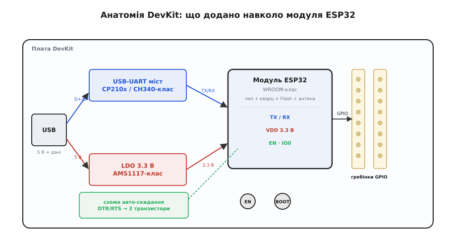
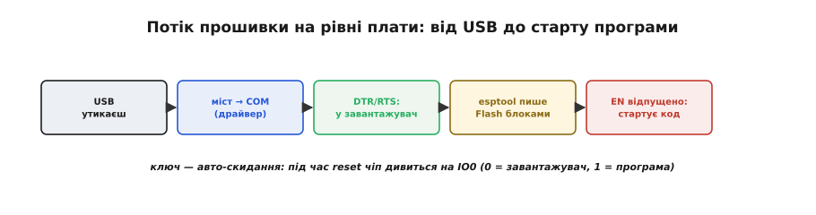

# 🔌 DevKit-плата ESP32 зсередини

> Є три рівні: **чіп → модуль → плата**. Чіп ESP32 — це кремній; модуль (WROOM-клас) додає до нього кварц, Flash і антену; а **плата розробника (*dev board*, DevKit)** обростає навколо модуля всім, що треба, аби пристрій просто вмикався в комп'ютер. Тут розбираємо саме плату — що на ній додано й навіщо.

## Що це за клас

Голий модуль ESP32 (WROOM-клас: чіп, кварц, Flash і антена на одній маленькій платі) сам по собі незручний: у нього виводи з кроком, який не встромиш у макетку, немає ні USB, ні стабілізатора живлення, ні кнопок. **DevKit-плата** — це *носій* (*carrier board*), що додає навколо модуля все потрібне, аби пристрій просто вмикався в комп'ютер і прошивався. Поширені сімейства — **DevKitC-клас** і дрібніший **DevKitM-клас**; усі вони влаштовані за однією схемою.


*Анатомія DevKit. Дані з USB ідуть через USB-UART міст на TX/RX модуля; живлення 5 В — через LDO-стабілізатор на 3.3 В. Кнопки EN (скидання) та BOOT (вибір завантаження) і схема авто-скидання дають прошивати без перемичок; усі вільні виводи модуля виведені на гребінки GPIO.*

## Чотири додані вузли

- **USB-UART міст** (*bridge*, **CP210x / CH340-клас**) — перекладач між USB комп'ютера й простим послідовним портом (UART), яким говорить модуль. Саме він робить так, що в системі з'являється COM-порт.
- [**LDO-стабілізатор**](root:hw-power/ldo) (*low-dropout regulator*, **AMS1117-клас**) — знижує 5 В із USB до 3.3 В, якими живиться ESP32. Уся логіка плати — **3.3-вольтова**.
- **Кнопки EN і BOOT.** **EN** (*enable*) — апаратне скидання (притискає однойменний пін до землі). **BOOT** тримає **IO0** на нулі, щоб увійти в режим завантаження.
- **Схема авто-скидання** — пара транзисторів, кермована лініями **DTR/RTS** (*data terminal ready* / *request to send*) моста: вона сама смикає EN та IO0, тож прошивати можна, не торкаючись кнопок.

Варто зрозуміти, *чому* тут саме дві транзисторні ланки, а не пряме з'єднання. DTR і RTS — це службові лінії послідовного порту, які лишилися ще від модемів; драйвер моста вміє ставити їх у 0 чи 1 з комп'ютера. Якби кожну з них завести прямо на EN та IO0, виникла б халепа: відкриваючи порт, операційна система часто сама смикає DTR і RTS — і чіп би самочинно перезавантажувався чи зривався в завантажувач щоразу, коли ви просто під'єднуєтесь монітором порту. Тому ставлять дві транзисторні ланки, з'єднані так, що чіп реагує лише на *певну послідовність* зміни DTR і RTS (яку видає `esptool`), а на поодиноке смикання однієї лінії — ні. Звідси типова дрібна вада дешевих плат: ланки спрацьовують надто охоче або, навпаки, ліниво — і авто-скидання то зриває чіп у завантажувач сам собою, то не вводить його туди зовсім.

## Живлення й виводи

Живити плату можна трьома шляхами: від **USB** (звичний випадок), подавши **5 В на пін VIN/5V** (тоді працює бортовий LDO) або вже готові **3.3 В на пін 3V3** (в обхід LDO). Тут є пастка, у яку легко вступити: не можна живити плату й від USB, і від зовнішніх 3.3 В одночасно, бо тоді ви зустрічаєте вихід LDO зі стороннім джерелом — і одне з них програє. Обирайте один шлях.

Решта виводів модуля винесена на бічні **гребінки**: GPIO, шини (SPI/I2C/UART), входи ADC, а також GND. Не всі ніжки рівноцінні, і це не примха, а наслідок того, як збудований сам чіп. Кілька ніжок (на типовому модулі це GPIO6–11) намертво зайняті лінією до зовнішньої Flash — повісите на них своє, і чіп просто не завантажиться, бо ці лінії потрібні йому, щоб дочитати з Flash власну програму. Ще кілька (GPIO34–39 на класичному ESP32) — **лише входи**, без режиму виходу: подати з них сигнал не вийде. А окрема жменя — **strapping-піни** (GPIO0, 2, 5, 12, 15): чіп зчитує їхній рівень у мить скидання, щоб вирішити, звідки завантажуватись і з якою напругою працює Flash, тож якщо в цей момент на них висить ваша схема й тягне рівень не туди — чіп піде завантажуватись не туди. Тому на старті ці ніжки не можна довільно навантажувати. Головне ж, що варто пам'ятати про всі виводи разом: **рівні скрізь 3.3 В**, а не 5 В, — подати на ніжку 5 В означає її спалити.

> 🔧 **Навіщо це.** Саме через ці «зайняті» ніжки народжується класична біда початківця: проєкт чудово збирається, але плата після прошивки то не стартує, то висне в завантажувачі. Дев'ять разів із десяти винна одна ніжка зі strapping-набору, на яку повісили реле, світлодіод чи давач, що в момент увімкнення тягне її рівень. Лік простий: під вільні сигнали беріть «звичайні» GPIO, а GPIO0/2/12/15 і лінії Flash лишайте чіпові — або принаймні звіряйте кожну з даташитом модуля, перш ніж до неї чіплятися.

## «Перший байт»: як плата прошивається

Найкорисніше, що дає DevKit, — прошивка «з коробки» без ручних маніпуляцій. Утикаєш USB → система бачить послідовний порт (потрібен драйвер моста) → утиліта `esptool` коротким пульсом DTR/RTS вводить чіп у завантажувач → пише образ у Flash блоками з перевіркою → відпускає EN, і стартує вже твоя програма.


*Що робить плата, коли тиснеш «Прошити». Ключовий крок — авто-скидання: під час reset чіп дивиться на IO0 і обирає, кого слухати — завантажувач (IO0=0) чи власну програму (IO0=1).*

Коли програма нарешті стартувала, вона може сама розповісти, *як* її щойно запустили, — це найперший інструмент, щоб упіймати ті самі граблі плати. ESP-IDF дає просту функцію, що повертає причину останнього скидання:

**Друкуємо причину скидання одразу на старті — щоб бачити, чи це brownout під час Wi-Fi.**

:::tabs
```cpp
#include "esp_system.h"
#include <stdio.h>

void app_main(void) {
    switch (esp_reset_reason()) {
        case ESP_RST_POWERON:  printf("старт: подали живлення / EN\n"); break;
        case ESP_RST_BROWNOUT: printf("старт: ПРОСІВ живлення (brownout)!\n"); break;
        case ESP_RST_SW:       printf("старт: програмне перезавантаження\n"); break;
        default:               printf("старт: інша причина\n"); break;
    }
}
```
```python
import machine

cause = machine.reset_cause()
if cause == machine.PWRON_RESET:
    print("старт: подали живлення / EN")
elif cause == machine.BROWNOUT_RESET:
    print("старт: ПРОСІВ живлення (brownout)!")
elif cause == machine.SOFT_RESET:
    print("старт: програмне перезавантаження")
else:
    print("старт: інша причина")
```
:::

Якщо в монітор раз по раз сиплеться рядок про `brownout` саме тоді, коли вмикається радіо, — діагноз готовий: плата перезавантажується від просідання напруги, і шукати треба кабель та живлення, а не баг у коді.

## Типові граблі

- **Brownout під час Wi-Fi.** Дешевий LDO AMS1117-класу плюс тонкий USB-кабель не тягнуть кидок струму, коли вмикається радіо, — напруга просідає, і плата перезавантажується (причина reset = [`BROWNOUT`](root:hw-arch/reset-causes)). Лік: добрий кабель, живлення від міцного порту, конденсатор побільше.
- **Немає порту в системі** — найчастіше бракує драйвера моста (CP210x чи CH340 — різні драйвери).
- **Авто-скидання не спрацювало** — на деяких платах прошивку доводиться починати, **притримавши BOOT** і клацнувши EN вручну.
- **Кнопка EN = скидання**, яке прошивка побачить як [`POWERON`](root:hw-arch/reset-causes) (чіп не відрізняє його від увімкнення живлення).

## Варіації класу

Плати різняться **модулем** (WROOM проти WROVER з додатковою PSRAM), **мостом** (CP210x проти CH340), **роз'ємом** (micro-USB проти USB-C) і розміром (DevKitC проти вузької DevKitM). Окремий випадок — плати на ESP32-**S2/S3**: у них чіп має **власний USB** на кристалі, тож з'являється другий USB-роз'єм, який прошиває **без жодного моста** — комп'ютер говорить із чипом напряму.

Попри всі розбіжності, користуватись усіма цими платами однаково: устромив у USB, обрав порт, прошив — обв'язку навколо модуля кожна з них дає ту саму. У цьому й сенс DevKit: він потрібен, поки ви розробляєте й налагоджуєте. Коли пристрій готовий іти «в поле» серією, USB-міст, кнопки й гребінки стають зайвим тягарем і ціною — тоді в свою плату ставлять уже голий модуль, а скидання та прошивку виводять кількома контактними площадками. Тобто DevKit — це зручний верстак для роботи з модулем, а не те, що зрештою їде у виріб.
