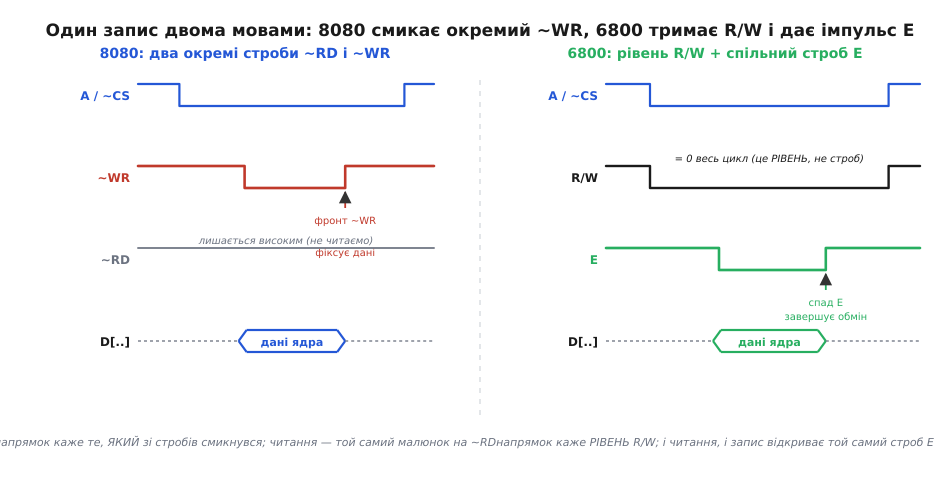
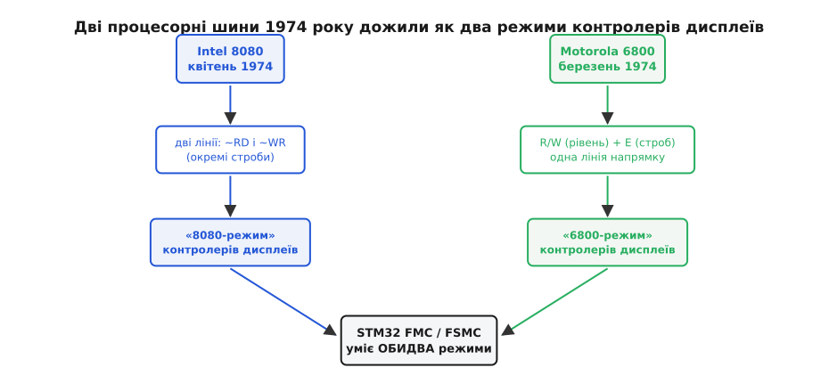

# 📜 Дві шини 1974-го: Intel 8080 проти Motorola 6800

Відкрийте даташит майже будь-якого кольорового TFT-екрана чи однокольорового OLED-дисплея — і десь у розділі про паралельне підключення натрапите на дивну пару слів: **«8080-режим»** та **«6800-режим»** (часто пишуть «i80» і «m68» або «MCU 8080-series» / «6800-series»). Мікросхемі 2020-х років, зробленій у Тайвані чи Кореї, ці цифри нічого не мають означати — і все ж вони там, чорним по білому, як обов'язковий вибір. Звідки в сучасному екрані взялися імена двох мікропроцесорів, випущених за пів століття до нього, у далекому 1974 році?

Це не примха й не данина ностальгії. Це — скам'янілий відбиток однієї з перших великих суперечок мікроелектроніки: як саме процесор має казати пам'яті «читай» і «пиши». У 1974-му на це питання дали дві різні відповіді. Обидві виявилися робочими, обидві розповзлися по індустрії, обидві пережили самі процесори, що їх породили, — і дотепер живуть у кожному контролері дисплея та в кожному мікроконтролері, що вміє говорити з паралельною пам'яттю. Зокрема — у блоці [FMC/FSMC](topic:hw-arch/external-memory-interface) сучасних STM32, який навмисне вміє обидві мови. Розберімо, звідки взялася ця роздвоєність, чим насправді відрізняються ці дві шини на рівні дротів, і чому вибір, зроблений інженерами Intel і Motorola в один і той самий рік, досі стоїть перед вами в меню налаштувань екрана.

## Що взагалі означає «шина» процесора

Спершу — про що суперечка. Процесор мусить читати команди й дані з пам'яті та писати результати назад. Фізично це жмут дротів між процесором і мікросхемами пам'яті, і по цих дротах треба якось передавати три речі: **куди** звертаємось (адреса), **що** передаємо (дані) і — головне для нашої історії — **у який бік** іде обмін і **коли саме** він відбувається.

З адресою й даними все просто: це просто набори ліній, стільки, скільки треба бітів. Вісім ліній даних — байт за раз; шістнадцять ліній адреси — 65536 різних комірок. А от «в який бік і коли» — це вже **керування**, і саме тут дві школи розійшлися.

Уявіть, що адреса вже виставлена на лінії й пам'ять «дивиться» на потрібну комірку. Лишається сказати їй одне з двох: «віддай мені вміст цієї комірки» (читання) або «прийми оце й запиши сюди» (запис). І тут виникає перше по-справжньому проєктне рішення в архітектурі шини: **скількома сигналами** це сказати?

Відповідь не очевидна, бо тут стикаються дві різні цінності. З одного боку — швидкодія й простота підключення пам'яті: чим прямолінійніший сигнал, тим менше зайвих деталей між процесором і мікросхемою. З іншого — економія ніжок процесора: кожен зайвий вивід на кристалі 1974 року коштував дорого, бо корпуси були малі (40 ніжок — стеля), а кожна ніжка — це і площа кристала, і ризик. Intel і Motorola зважили ці цінності по-різному — і отримали дві несумісні відповіді.

## Дорога до 1974-го: чому саме тоді

Щоб зрозуміти суперечку, варто побачити, звідки обидві фірми прийшли. Обидві шини — не з порожнечі; кожна виросла зі свого попередника.

Intel уже мала за плечима **8008** (1972) — перший 8-бітний мікропроцесор, зроблений на замовлення для термінала Datapoint. Він був незграбний: мультиплексована 8-бітна шина, зовнішня логіка мусила ловити стани по тактах, підключити пам'ять було морокою. **8080**, що вийшов у **квітні 1974-го**, задумували саме як виправлення цих незручностей — зробити мікропроцесор, до якого пам'ять чіпляється **легко**. Його спроєктували Федеріко Фаджін (Federico Faggin, італієць, який до того на Intel створив технологію кремнієвого затвора й вів проєкт першого мікропроцесора 4004), Масатосі Сіма (Masatoshi Shima, японський інженер, що приїхав із фірми Busicom і працював над 4004 ще від задуму) та Стенлі Мейзор (Stanley Mazor, американець, архітектор системи команд). Це важлива деталь для чесної історії: 8080 — плід **міжнародної** команди, а не «американський винахід» у вузькому сенсі; ключову схемотехніку вів італієць, ключову мікроархітектуру — японець.

> 🔧 **Навіщо це.** Коли в даташиті дисплея пишуть «8080-series MCU interface», мова не про сам процесор 8080, а про **стиль керування шиною**, який він закріпив: окремі лінії читання й запису. Знаючи це, ви не шукатимете в схемі якийсь «процесор Intel» — ви одразу зрозумієте, що екран хоче дві роздільні стробувальні лінії, і саме так їх під'єднаєте до мікроконтролера.

Motorola тим часом ішла своєю дорогою. Її **6800** анонсували в **березні 1974-го** (перші робочі кристали — лютий, повне виробництво — до кінця року); головним архітектором проєкту був Том Беннетт (Tom Bennett). Мета Motorola була трохи інша, ніж у Intel: зробити систему, де процесор, пам'ять і периферія живуть **від одного живлення +5 В** і чіпляються один до одного **без клею** — без зайвих мікросхем-перекладачів між ними. Ця настанова «мінімум клею» й продиктувала їхнє рішення про керування шиною.

Зверніть увагу: **обидва процесори вийшли в один рік, з різницею в один-два місяці**. Це не випадковість і не наслідування — це паралельне дозрівання ідеї. Технологія кремнієвих інтегральних схем саме дійшла до того рівня, коли на одному кристалі можна було вмістити повноцінний 8-бітний процесор, і кілька команд по всьому світу кинулися це робити водночас. Дві шини — це два незалежні інженерні висновки з однієї й тієї самої технічної ситуації.

## Відповідь Intel: дві окремі лінії — «читаю» і «пишу»

Логіка Intel була прямою, майже наївною у своїй простоті: якщо є дві протилежні дії — читати й писати, — то дай для кожної **свою лінію**. Одна лінія кричить «читаю!» (її позначають ~RD, від *read*), інша — «пишу!» (~WR, від *write*). Тильда чи риска над іменем означає, що сигнал **активний-низький**: у спокої лінія тримається високою, а «спрацьовує» вона, коли її опускають до нуля.

Обмін тоді виглядає так. Процесор виставляє адресу, чекає, поки вона вляжеться на лініях, і тоді **опускає одну** з двох стробувальних ліній — залежно від того, що робить. Хоче читати — опускає ~RD, і пам'ять у відповідь виставляє вміст комірки на лінії даних. Хоче писати — сам кладе дані на лінії й опускає ~WR; пам'ять по цьому сигналу **захоплює** дані з ліній і кладе в комірку. Момент захоплення — зазвичай **висхідний фронт** ~WR, тобто мить, коли лінія повертається з нуля назад угору: до цієї миті дані мають бути вже стабільні. Підняли строб назад — цикл завершено.

Ключова риса: **напрямок обміну закодований у тому, ЯКА саме лінія смикнулась**. Немає окремого сигналу «читання чи запис» — саме́ спрацьовування ~RD *означає* читання, а спрацьовування ~WR *означає* запис. Дві лінії несуть і команду «зараз!», і напрямок водночас.

Щоправда, тут є історична тонкість, яку варто назвати чесно. **Сам голий кристал 8080 цих двох гарних ліній назовні не давав.** Насправді 8080 на початку кожного машинного циклу викидав на шину даних 8-бітне **слово стану** (status word) — набір прапорців «це читання пам'яті / запис пам'яті / читання пристрою вводу-виводу / підтвердження переривання…», а також мав виводи DBIN («іду читати») і ~WR. Щоб із цієї сирої інформації народити звичні роздільні строби пам'яті й вводу-виводу (їх позначали ~MEMR, ~MEMW, ~IOR, ~IOW), поруч ставили окрему мікросхему-перекладач — **системний контролер 8228**. Він засікав слово стану, комбінував його з DBIN і ~WR — і видавав чотири чисті стробувальні лінії. Тобто «стиль 8080» у чистому вигляді був стилем **зв'язки 8080 + 8228**, а не одного процесора.

Intel швидко визнала цю незручність. Уже наступний процесор родини, **8085** (1976), увібрав функції зовнішніх помічників усередину: він давав назовні готові виводи ~RD і ~WR прямо з кристала, плюс лінію ALE для роботи з мультиплексованою адресою. Саме ця пізніша, «чиста» форма — окремі ~RD і ~WR — і закарбувалася в пам'яті індустрії як **«шина 8080/8085»**, або просто «8080-режим». Історична деталь про слово стану й мікросхему 8228 стерлася; лишилася сама ідея: **дві роздільні лінії, кожна для свого напрямку**.

## Відповідь Motorola: один рівень напрямку + один спільний строб

Motorola міркувала інакше — і, як на мене, тонше. Вони розділили два питання, які Intel звалила в одні лінії: «**в який бік** іде обмін» і «**коли** він відбувається». Це ж різні речі — то чому б не мати для них різні сигнали?

Тож у 6800 напрямок задає **одна** лінія — **R/W** (*read/write*). Вона не строб, а **рівень**: тримається у високому стані весь час, поки процесор читає, і в низькому — поки пише. Вона просто **каже стан**, не даючи команди «зараз».

А команду «зараз!» дає **окремий, спільний** сигнал — тактовий строб-дозвіл **E** (*enable*). Історично він народився з другої фази двофазного тактового генератора, тож у старих матеріалах його часто звуть **фаза 2** (φ2). E — це вільно біжучий такт: він рівномірно пульсує сам по собі, і кожен його імпульс відкриває вікно, у якому шина дійсна. І читання, і запис відбуваються під **тим самим** E; різницю робить лише те, у якому стані стоїть R/W у цю мить. Обмін завершується на **спаді** E — саме тоді дані вважаються переданими.

Порівняйте самі дії:

```
дія        Intel 8080-стиль          Motorola 6800-стиль
------     -------------------       --------------------------
читання    опустити ~RD              R/W = 1, дати імпульс E
запис      опустити ~WR              R/W = 0, дати імпульс E
```

Різниця філософська, а не косметична. У Intel напрямок і момент **злиті** в одному русі (смикнулась потрібна лінія — це й напрямок, і команда). У Motorola вони **розведені**: рівень R/W каже куди, спільний строб E каже коли. У 8080 дві стробувальні лінії; у 6800 стробувальна лінія одна (E), плюс окрема лінія-покажчик напрямку (R/W).


*Ліва панель — «8080-стиль»: адреса й ~CS стоять, потім падає ОКРЕМИЙ строб ~WR, а лінія ~RD увесь час лежить високо (ми ж пишемо, а не читаємо); дані ядро фіксує на висхідному фронті ~WR. Права панель — «6800-стиль»: лінія R/W тримається на нулі весь цикл — це РІВЕНЬ, що каже «запис», а не команда; саму дію відкриває спільний строб E, і обмін завершується на його спаді. У 8080 напрямок несе те, яка лінія смикнулась; у 6800 напрямок несе рівень R/W, а строб E — той самий і для читання, і для запису.*

Чи виграла якась зі шкіл «по-чесному»? Ні. Кожна відповідь платила свою ціну. Роздільні ~RD/~WR простіші для розуміння й для швидкої пам'яті — не треба окремо стежити за рівнем напрямку, — але це **зайва лінія** й та історична потреба в мікросхемі-контролері на ранньому 8080. Схема R/W+E ощадливіша на стробувальні лінії й лягає в тактовану, синхронну систему природніше (усе ходить під спільним E), зате вимагає, щоб периферія розуміла саме цю дисципліну «рівень плюс дозвіл». Обидва підходи були розумні; обидва вкоренилися.

> 🔧 **Навіщо це.** Практична різниця, з якою ви зіткнетесь навіть сьогодні: якщо екран у **6800-режимі**, вам треба вивести на нього лінію R/W (напрямок) і лінію E (строб). Якщо в **8080-режимі** — треба ~WR і ~RD. Мікроконтролер зазвичай зручніше генерує саме 8080-стиль (окремі строби запису й читання), тому в переважній більшості реальних плат дисплеї підключають саме в 8080-режимі — і саме тому цей режим ви бачитимете в прикладах найчастіше.

## Як дві родини периферії розповзлися по світу

Тепер найцікавіше — **чому** цей поділ пережив самі процесори. Річ у тім, що навколо кожного процесора виростала **екосистема мікросхем-периферії**, і кожна така мікросхема мусила говорити рідною шиною свого процесора.

У світі Motorola класичним прикладом була **PIA** — паралельний інтерфейсний адаптер (мікросхеми 6820, згодом 6821): чіп, що давав процесору 6800 два порти по вісім ліній вводу-виводу для кнопок, реле, індикаторів. І він, звісно, чіплявся до шини 6800 **без клею** — розумів рівень R/W і строб E прямо з ніжок. У світі Intel периферія (контролери переривань, таймери, порти) так само говорила стилем 8080 — роздільними ~RD/~WR.

І тут спрацював **мережевий ефект**. Виробник, що робив, скажімо, мікросхему контролера дисплея чи знакогенератора, хотів продати її **всім** — і власникам систем на 6800, і власникам систем на 8080. Найпростіший спосіб — зробити чіп, що вміє **обидві** шини, а який саме режим увімкнено, вибирати ніжкою-перемикачем. Так у даташитах уперше й з'явилися рядки на кшталт «*bus select: 8080 / 6800*». Це був суто комерційний хід: одна мікросхема — два ринки.

Мине багато років, самі 8080 і 6800 зійдуть зі сцени, їх заступлять цілком інші архітектури — але **звичка периферії говорити однією з цих двох мов лишилася**. Контролери графічних дисплеїв, що з'явилися у 1980-х і далі, успадкували той самий вибір «8080 або 6800» просто тому, що так було заведено, так робили попередники, так очікували інженери. Назви скам'яніли й відірвалися від першоджерела: тепер «8080» означало вже не процесор, а **тип паралельного інтерфейсу** — «роздільні строби читання й запису». А «6800» — «спільний строб плюс лінія напрямку».


*Два незалежні інженерні рішення 1974 року — роздільні ~RD/~WR у Intel і рівень R/W плюс строб E в Motorola — переросли самі процесори. Кожне закріпилося у своїй родині периферії, а звідти перекочувало в контролери дисплеїв як два «режими», що досі стоять вибором у даташитах. Сучасний контролер пам'яті мікроконтролера свідомо вміє обидва — щоб під'єднувати екрани будь-якого роду.*

## Чому сучасні контролери дисплеїв досі дають обидва режими

Загляньте в даташит будь-якого поширеного контролера екрана — і побачите ту саму розвилку. Драйвер кольорового TFT ILI9341 (типовий у модулях 240×320 та 320×480) має ніжки IM (від *interface mode* — «режим інтерфейсу»), якими серед іншого й задають, у 8080 чи 6800 стилі працює його паралельна шина. Драйвер однокольорового OLED SSD1306 (той, що в маленьких дисплейчиках 128×64) у своєму описі прямо перелічує чотири способи підключення: паралель у стилі 8080, паралель у стилі 6800, послідовний SPI та I²C. Вибір 8080/6800 у них — так само конфігураційний, як за часів PIA й 8228.

Логіка виробника не змінилася від 1970-х: **дай обидва режими — продаси всім**. Хтось чіпляє екран до мікроконтролера, чий контролер пам'яті природніше видає 8080-строби; хтось — до системи, збудованої в 6800-дисципліні; хтось узагалі мостить через окрему логіку. Один кристал, що вміє обидві мови, покриває всі ці випадки без окремих версій під кожен ринок. Стара комерційна вигода нікуди не поділася.

Тут корисно бачити суть, а не імена. На рівні дротів ці «режими» відрізняються **зовсім небагатьма** сигналами. Спільне в обох — жмут ліній даних (D[7:0] або ширше), вибір кристала (~CS), лінія «команда чи дані» (її у світі дисплеїв звуть **RS**, *register select*, або D/C, *data/command* — вона каже екранові, чим є поточний байт: командою керування чи піксельними даними) і скидання (~RES). А розходяться режими лише в стробувальних лініях:

```
                8080-режим             6800-режим
даних           D[7:0]/D[15:0]         D[7:0]/D[15:0]      ← однаково
вибір кристала  ~CS                    ~CS                 ← однаково
команда/дані    RS (D/C)               RS (D/C)            ← однаково
скидання        ~RES                   ~RES                ← однаково
керування       ~WR і ~RD              R/W і E             ← ОСЬ РІЗНИЦЯ
                (два строби)           (напрямок + строб)
```

Тобто вся піввікова суперечка звелася до одного рядка: **«два роздільні строби» проти «рівень напрямку плюс спільний строб»**. Усе інше в підключенні екрана — те саме.

## Чому STM32 FMC/FSMC вміє обидві мови

Тепер зрозуміло, чому [контролер зовнішньої пам'яті STM32](topic:hw-arch/external-memory-interface) навмисне підтримує **обидва** стилі. Його головна робота — говорити з паралельною **пам'яттю**, а класична статична пам'ять (SRAM, NOR-флеш) сама історично успадкувала стиль 8080: у неї роздільні входи ~OE (*output enable* — «дозвіл виводу», тобто читання) і ~WE (*write enable* — «дозвіл запису»). Тому в основі FMC виставляє на ніжки саме роздільні строби: **~NOE** (читання) і **~NWE** (запис) — це буквально 8080-дисципліна, названа мовою пам'яті. Виходить, що «8080-режим» дисплея й звичайний доступ до зовнішньої SRAM — це **той самий** сигнальний малюнок, і тому кольоровий екран у 8080-режимі чіпляється до FMC майже так само просто, як мікросхема пам'яті: ~NWE веде на вивід ~WR екрана, ~NOE — на ~RD, а одну з ліній адреси пускають на RS, щоб перемикати «команда / дані» просто зміною біта адреси.

Але інженери STM32 не спинилися на 8080-стилі. FMC вміє налаштуватися й на **6800-дисципліну** — генерувати рівень напрямку та спільний строб замість двох роздільних, — щоб під'єднувати й ту периферію та дисплеї, що чекають саме 6800-режиму. Фірмові документи ST (прикладні нотатки про підключення TFT до FSMC) прямо описують обидва варіанти таймінгу. Причина та сама, що й у виробників дисплеїв: **не прив'язуватися до однієї родини периферії**. Мікроконтролер, що вміє лише один стиль, відсік би половину екранів і периферії на ринку; уміючи обидва, він чіпляє будь-що.

> 🔧 **Навіщо це.** Ось чому, конфігуруючи FMC під конкретний дисплей, ви першим ділом дивитесь у його даташит: у якому режимі — 8080 чи 6800 — він працює (і чи можна це перемкнути ніжками IM). Від цієї відповіді залежить, які саме сигнали FMC виводити на ніжки й на що їх заводити. Здебільшого вибирають 8080-режим, бо він рідний і для FMC (~NWE/~NOE), і для статичної пам'яті, — але знати про існування 6800-альтернативи важливо, щоб не розгубитися, натрапивши на екран, що вимагає саме R/W та E.

## Що з цього винести

Отже, дивна пара «8080 / 6800» у сучасному даташиті — це не архаїзм, який забули прибрати, а жива спадкоємність. За нею стоїть реальна історія: два незалежні інженерні рішення, ухвалені навесні 1974 року міжнародною командою Фаджіна—Сіми—Мейзора в Intel і командою Тома Беннетта в Motorola, як по-різному відповісти на одне питання — «скількома сигналами процесор каже пам'яті, у який бік і коли йде обмін».

Intel відповіла «двома роздільними стробами» (~RD і ~WR — кожній дії своя лінія). Motorola відповіла «рівнем напрямку плюс спільним стробом» (R/W каже куди, E каже коли). Обидві відповіді пережили самі процесори, укоренилися в родинах периферії, перекочували в контролери дисплеїв як два «режими» — і дотепер стоять вибором у налаштуваннях кожного паралельного екрана. А блок [FMC/FSMC](topic:hw-arch/external-memory-interface) у STM32 уміє обидва саме тому, що жодна зі шкіл 1974-го так і не перемогла остаточно — вони обидві дожили до наших днів, і сучасне залізо мусить розуміти обидві.

Наступного разу, побачивши в меню екрана рядок «8080 / 6800», ви знатимете, що насправді обираєте між філософією Федеріко Фаджіна й філософією Тома Беннетта — вибором, зробленим за пів століття до того, як цей екран узагалі спроєктували.
