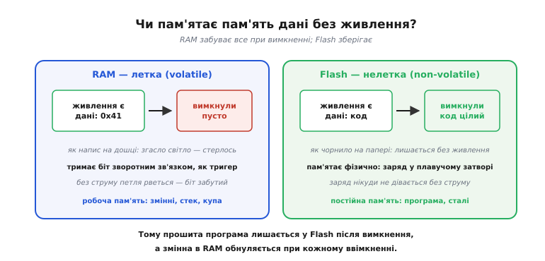
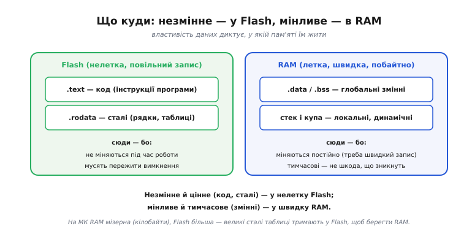
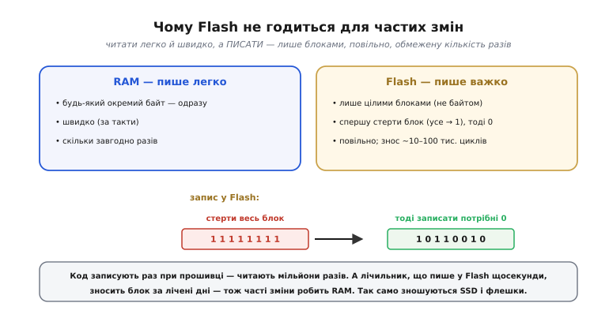
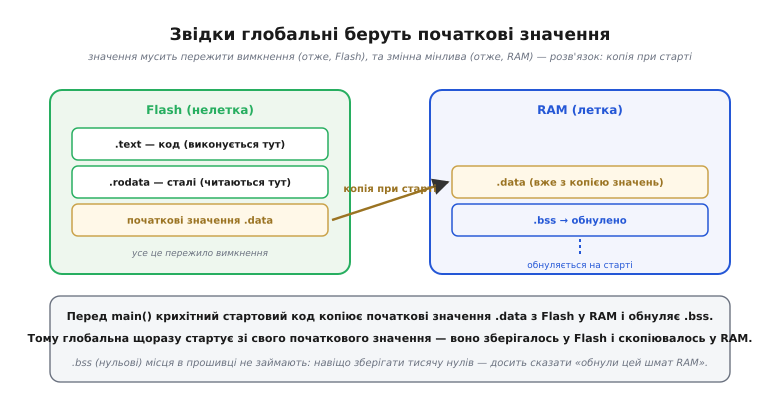
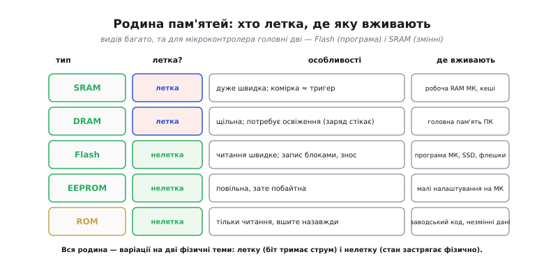

# Flash і RAM: постійне й тимчасове

На мікроконтролері код живе у Flash, а змінні — в RAM, у різних діапазонах [адрес пам'яті](topic:hw-arch/memory-map). За цим стоїть найпрактичніший поділ у всій пам'яті: на **летку** й **нелетку**. Одна забуває все при вимкненні живлення, інша пам'ятає. Цей поділ пояснює дві речі, з якими стикаєшся в перший же день роботи з МК: чому прошита програма **лишається** в чипі після від'єднання живлення, а змінні **обнуляються** при кожному перезапуску. А ще він тягне за собою низку практичних наслідків — від «де зберігати налаштування» до «чому Flash не можна перезаписувати щосекунди». За цим стоять дві пам'яті, їхні особливості й тонка, але важлива деталь про те, як глобальні змінні взагалі дістають свої початкові значення.

### Летка проти нелеткої

Найголовніше питання до будь-якої пам'яті: **чи пам'ятає вона дані без живлення?**


*RAM **летка** (від лат. *volatilis* — «летючий, нестійкий»): тримає дані, лише поки є живлення; вимкнув — усе зникло, як напис на дошці, що стирається, щойно згасне світло. Тримає біт зворотним зв'язком, як тригер, тож без струму забуває. Flash **нелетка**: зберігає дані й знеструмлена, як чорнило на папері; пам'ятає фізично — заряд, замкнений в ізольованому «плавучому» затворі. Тому програма не зникає при вимкненні, а змінні обнуляються при перезапуску: програма у Flash, змінні в RAM.*

Тут прямо змикаються дві фізичні ідеї. Летка RAM — родичка [тригера](topic:hw-digital/state-memory): вона тримає біт, лише поки тече струм (найшвидша RAM, **SRAM** — *Static RAM*, «статична», — і справді складена по суті з тригерів, по кілька транзисторів на біт). Вимкнув живлення — петля зворотного зв'язку розпалася, біт забувся. А нелетка Flash — спадкоємиця ідеї магнітних **осердь**: вона зберігає стан **фізично**, у самому матеріалі, без жодного струму (як магнітне осердя «застрягало» в напрямку намагнічення, так комірка Flash утримує заряд). Тому скетч, залитий у Flash, переживає вимкнення — а лічильник у RAM-змінній починає з нуля при кожному ввімкненні. Слово «летка»/«volatile» трапляється і як [ключове слово мови програмування](topic:sf-lang/volatile) з геть іншим, хоч і спорідненим змістом; тут ідеться про **фізику** пам'яті.

### Що куди: незмінне у Flash, мінливе в RAM

Звідси видно, **чому** [карта пам'яті](topic:hw-arch/memory-map) групує дані саме так.


*Flash (нелетка) тримає **код** (.text) і **сталі** (.rodata) — бо вони не міняються під час роботи й мусять пережити вимкнення. RAM (летка, швидка) тримає **змінні** (.data, .bss), **стек** і **купу** — бо вони міняються постійно (потрібен швидкий запис) і тимчасові (не шкода, що зникнуть). Це фізичне пояснення поділу RO/RW у карті пам'яті: властивості даних диктують, у якій пам'яті їм жити.*

Правило просте й варте запам'ятовування: **незмінне й цінне** (код, сталі) — у нелетку Flash; **мінливе й тимчасове** (змінні) — у швидку RAM. І тут є дуже практичний наслідок саме для мікроконтролерів: на них RAM зазвичай **мізерна** — лічені кілобайти, — тоді як Flash значно більша. Тому **великі сталі дані** (таблиці, тексти, шрифти) свідомо тримають у Flash, щоб не з'їдати дефіцитну RAM (на AVR це робиться спеціально — через [Гарвардську архітектуру](root:embedded/von-neumann-harvard), де програмна пам'ять окрема, — а на ESP32 сталі теж лягають у Flash). Розуміння цього поділу рятує, коли програма «не влазить»: код тисне на Flash, змінні — на RAM, і це **дві різні** межі. А сама ця Flash на платах класу ESP32 — не абстрактний регіон «усередині» процесора, а **окрема восьминіжкова мікросхема** поряд із ним, з'єднана шиною SPI: як [розпізнати цей чип і правильно його під'єднати](topic:hw-arch/flash-vs-ram/api-spi-flash-xip.md) — розпіновку SOIC-8, лінії SPI, живлення 3.3 В, службові WP#/HOLD# та взаємозамінні моделі — зібрано окремою довідкою.

Цей поділ видно прямо в коді. Те, як ти оголосив дані, вирішує, у яку секцію — а отже, у яку пам'ять — вони потраплять:

> 🔧 **Навіщо це.** Куди лягла змінна, видно зі звіту лінкера (`.map`-файл) і з утиліти `size`: вона рахує Flash і RAM окремо. Коли проєкт «не влазить», саме ці числа кажуть, котра з двох пам'ятей переповнена — і чи рятуватиме перенесення таблиці в `const`/`PROGMEM`, чи треба різати щось інше.

**Куди лягає кожне оголошення (звичайний C прошивки).**

```c
const char  banner[] = "ready";   // .rodata  → Flash (стала, лише читається)
int   speed = 100;                 // .data    → RAM, зразок 100 у Flash
int   errors;                      // .bss     → RAM, обнуляється на старті
void  step(void) { speed++; }      // .text    → Flash (код), speed змінюється в RAM

// AVR: масив у Flash тримають явно — інакше копія з'їсть дефіцитну RAM
const uint8_t font[] PROGMEM = { 0x7E, 0x11, 0x11, 0x7E /* ... */ };
```

```
секція    де лежить   чому саме там
.text     Flash       код незмінний, читається мільйони разів
.rodata   Flash       banner — стала, її ніхто не пише
.data     RAM         speed мінлива; зразок 100 чекає у Flash до старту
.bss      RAM         errors нульова — зразок не потрібен, лише обнулити
```

`const` каже компілятору: «це не зміниться» — і дані їдуть у `.rodata` (Flash), а спроба запису ловиться ще на компіляції. На AVR самого `const` мало (через [Гарвардську архітектуру](root:embedded/von-neumann-harvard) код і дані в різних просторах), тому великий масив позначають `PROGMEM` і читають спецдоступом — інакше стартовий код слухняно скопіює його в RAM, якої й так обмаль.

### Примхи Flash: чому її не можна перезаписувати щосекунди

Якщо Flash така зручна (нелетка!), чому б не тримати в ній і змінні? Бо **писати** у Flash — морока.


*RAM пише легко: будь-який окремий байт, одразу, швидко, скільки завгодно разів. Flash пише важко: лише цілими **блоками** (не байтом), причому спершу треба **стерти** весь блок (усі біти → 1), а тоді записати потрібні нулі (1 → 0); це **повільно** (мікро- й мілісекунди проти тактів) і має **знос** — кожен блок витримує лише ~10 000–100 000 циклів стирання, після чого псується.*

Ось чому Flash чудова для **коду**, але погана для мінливих **даних**. Код записують **раз** при прошивці й потім лише **читають** мільйони разів — а читання з Flash швидке (процесор часто виконує код прямо з неї). Виконувати код **прямо з флеші**, не копіюючи його в дефіцитну RAM, дозволяє механізм XIP (*Execute-In-Place*, «виконання на місці»), а швидким його робить кеш гарячих шматків коду; як це влаштовано — і як узагалі «заговорити» із зовнішнім чипом флеші, попросивши його назвати свій ідентифікатор, — розібрано в [робочому прикладі читання JEDEC ID та XIP](topic:hw-arch/flash-vs-ram/proj-spi-flash-xip.md). Та якби ти писав у Flash щосекунди (скажімо, лічильник чи журнал), то **зносив** би блок за лічені дні. Тому часті зміни — це робота для RAM, а збереження рідкісних налаштувань у Flash роблять **обережно** (рідко, рівномірно розподіляючи записи). Цей самий механізм живе у **SSD** і флешках — звідси їхній знос і складні алгоритми [«вирівнювання зносу»](topic:sf-data/wear-leveling), що розмазують записи по всій пам'яті, аби жоден блок не зносився передчасно.

### Тонкість запуску: звідки глобальні беруть значення

Є тут одна тонкість, що спершу спантеличує, але красиво розв'язується. Глобальна змінна з початковим значенням (скажімо, `int speed = 100;`) — це **парадокс**: початкове значення (100) мусить пережити вимкнення, отже, зберігатися у **Flash**; але сама змінна **мінлива** (її змінюють під час роботи), отже, мусить жити в **RAM**. Як же бути?


*Розв'язок — **копія при старті**. Початкові значення .data зберігаються у **Flash** (щоб пережити вимкнення). Перед запуском `main()` крихітний стартовий код **копіює** їх із Flash у **RAM** (де змінні можуть мінятися), а заразом **обнуляє** .bss. Тому глобальна змінна щоразу стартує зі свого початкового значення — воно зберігалося у Flash і скопіювалося в RAM. (.text і .rodata лишаються у Flash і працюють звідти.)*

Це елегантне розв'язання парадоксу «мусить і пережити вимкнення, і бути мінливим»: зберігаємо **зразок** у нелеткій Flash, а **робочу копію** робимо в леткій RAM при кожному старті. Ось чому .bss (нульові глобальні) не займають місця в прошивці — навіщо зберігати тисячу нулів, коли можна просто сказати стартовому коду «обнули цей шмат RAM»? А ось .data доводиться зберігати поіменно (бо значення ненульові) — тому багато великих ініціалізованих глобальних роздувають і Flash, і RAM. Як саме це влаштовано в тулчейні ([стартовий код](topic:sf-lang/c-runtime), секції образу) — окрема велика тема; тут досить розуміти **чому** ця копія потрібна.

### Родина пам'ятей

Лишається короткий огляд «зоопарку» пам'ятей, щоб назви не лякали.


*SRAM — летка, дуже швидка (комірка ≈ тригер); робоча RAM мікроконтролера й кеші. DRAM (*Dynamic RAM*, «динамічна») — летка, щільніша, але потребує **освіження** (заряд у конденсаторі стікає з часом); головна пам'ять ПК. Flash — нелетка, читання швидке, запис блоками зі зносом; програма МК, SSD, флешки. EEPROM — нелетка, повільна, зате побайтна; малі налаштування. ROM (*Read-Only Memory*, «лише для читання») — нелетка, тільки читання, вшите назавжди. Для мікроконтролера головні дві: Flash (програма) і SRAM (змінні).*

Розмаїття не повинне лякати — на практиці важать передусім **дві** пам'яті: Flash тримає прошиту програму, SRAM тримає змінні під час роботи. Цікаво, що вся ця родина — варіації на дві фізичні теми: летку пам'ять ([тригери](topic:hw-digital/state-memory), що тримають біт струмом) і нелетку (фізичне «застрягання» стану, як в осердь). Навіть [**DRAM**](topic:hw-components/dram-cell) споріднена з осердями: її читання теж **руйнівне** — прочитавши біт, вона одразу записує його назад, точно як осердя. (Освіжати ж біти DRAM змушує вже інша причина: заряд у крихітному конденсаторі помалу стікає **з часом**, тож його доводиться відновлювати, поки не зник, — самі ж осердя були нелеткі й цього не потребували.) Технології змінюються, а фундаментальні ідеї — летке/нелетке, освіження — лишаються ті самі.

> 🔧 **Навіщо це.** Поділ Flash/RAM — одне з найпрактичніших знань для роботи з МК. Перше й найчастіше: **змінні обнуляються при перезапуску** (вони в леткій RAM), а програма й сталі — ні (вони в нелеткій Flash); коли дивуєшся «чому моя змінна не зберегла значення після ресету», згадай цей поділ. Друге: **RAM на МК мізерна** (кілобайти), тож великі сталі таблиці тримай у **Flash** (`const`/`PROGMEM`), щоб не вичерпати RAM (а коли «не влазить» — дивись, котра з двох пам'ятей переповнена). Третє: **не пиши часто у Flash** — вона зношується (~10–100 тис. циклів на блок) і пише повільно блоками; для даних, що весь час міняються, є RAM, а для рідкісних налаштувань — обережне збереження. Четверте: **глобальні з початковим значенням** дістають його через копію Flash→RAM при старті — звідси й те, що вони щоразу починають однаково. Тримай у голові просту картину: Flash — постійна й повільна на запис «бібліотека» програми; RAM — швидкий, але тимчасовий «робочий стіл» змінних.
