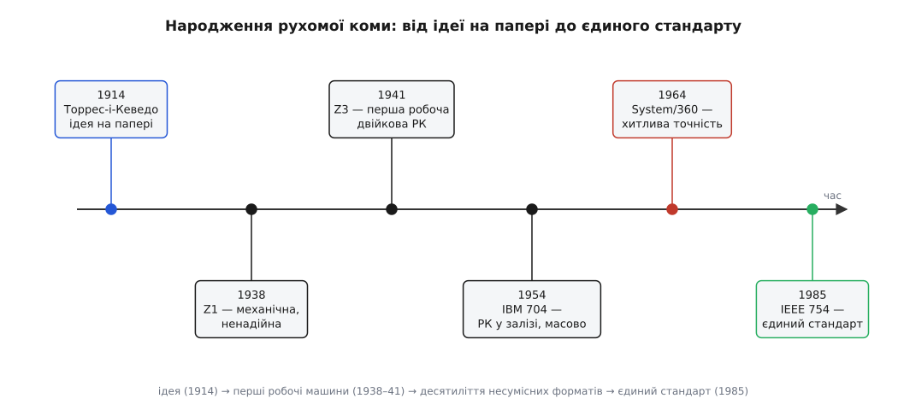
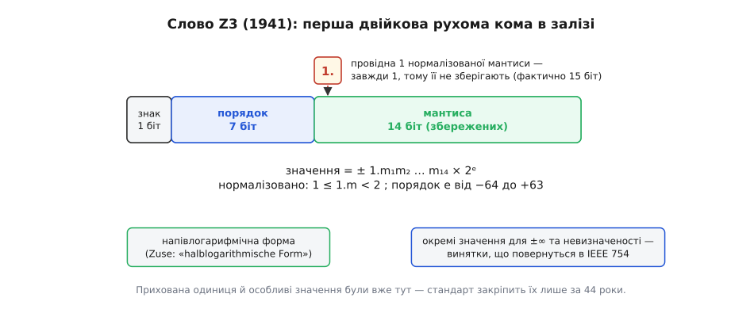

# 📜 Народження рухомої коми

> Спосіб умістити і масу електрона, і кількість молекул у склянці води в одну коротку комірку — за однією міркою — записали на папері **1914 року**, за ціле покоління до першого комп'ютера. А перша машина, що справді так рахувала, запрацювала **1941-го**, у берлінській квартирі, посеред війни. Та найдивніше не дати, а **що** вже було в тій машині: приховану провідну одиницю й окремі значення для нескінченності та «не-числа» — хитрощі, які світ вважатиме новими ще сорок років, аж доки їх не впише [стандарт IEEE 754](root:hw-arch/floating-point/hist-ieee754.md). Ця вставка — про те, як народилася сама **ідея** рухомої коми: хто перший її вимовив, хто перший її збудував і чому потім півстоліття кожна машина говорила нею по-своєму.

## Затиск, з якого все починається

Уся історія росте з одного напруження, і варто його відчути, перш ніж дивитися на дійових осіб. Будь-який лічильний пристрій — механічний, релейний чи електронний — має **скінченну кишеню**: певну кількість коліщат, регістрів, бітів, і ані на один більше. У цю кишеню треба вкласти числа, що живуть на **несумісних масштабах**. Інженерові, який рахує міст, водночас потрібні й крихітні деформації сталі, і величезні навантаження; фізикові — і маса частинки, і кількість частинок. Розмах між найменшим і найбільшим — десятки порядків.

Найпростіший вихід — **фіксована кома**: домовитися раз і назавжди, скільки розрядів іде до коми, а скільки після, і прибити її на місце. Так робили лічильні машини сторіччями, і так рахує будь-який цілочисловий регістр. Плата за простоту жорстока: кома не рухається, тож той самий пристрій або дістає великі числа, або дрібні — але не одні й другі. Хочеш зважити крихту речовини з точністю до мікрограма — і той самий формат уже не дотягнеться до тонни. Скінченні розряди розподілені **рівномірно**, а рівномірність марнує їх там, де вони не потрібні, і лишає голоду там, де потрібні. (Про те, чому фіксована кома все ж лишається доречною там, де масштаб сталий і відомий, — [окрема тема](root:hw-arch/fixed-point).)

А тим часом люди, які рахували руками, давно знали кращий спосіб. Астроном не пише двадцять три нулі — він пише 6.022 × 10²³: окремо **значущі цифри**, окремо **степінь**, що каже, куди посунути кому. Це [наукова нотація](root:math-numeric/scientific-notation), і в ній кома не прибита — вона «пливе» туди, куди вкаже степінь. Уся ідея рухомої коми в тому, щоб **навчити цього трюку машину**: хай сама тримає окремо «які цифри» і «якого вони масштабу», а не змушує людину щоразу стежити за комою вручну. Звучить очевидно — але хтось мусив вимовити це першим і в контексті **автоматичного** обчислення, де за комою нікому стежити, крім самої машини.


*Уся історія рухомої коми в одній лінії. Синім — **ідея** (Торрес, 1914): описана, але не втілена. Чорним — перші **робочі машини** (Z1 і Z3 Цузе, далі IBM 704): думка стає залізом і масовим товаром. Червоним — **хаос форматів**: коли кожен виробник зробив рухому кому по-своєму, System/360 навіть із «хитливою точністю». Зеленим — **єдиний стандарт** IEEE 754 (1985), що нарешті звів усіх до одного формату. Три різні дії однієї п'єси: вигадати, збудувати, домовитися.*

## Леонардо Торрес-і-Кеведо: кома на папері

Першим, хто письмово сформулював рухому кому, був іспанський інженер **Леонардо Торрес-і-Кеведо** (ісп. *Leonardo Torres Quevedo*; 1852, Мольєдо в Кантабрії — 1936, Мадрид). Постать це неординарна: він будував канатні дороги над Ніагарою, дирижаблі, радіокеровані апарати, а 1912 року зібрав **«Ель-Ахедресіста»** (ісп. *El Ajedrecista*) — електромеханічний автомат, що самостійно доводив до мату королем із турою короля суперника. Тобто Торрес був не кабінетним теоретиком, а людиною, яка звикла втілювати задуми в метал.

Його головна теоретична праця — **«Ensayos sobre Automática»** (ісп. «Нариси про автоматику»; повна назва — «Su definición. Extensión teórica de sus aplicaciones»), надрукована в січні 1914 року в бюлетені Іспанської королівської академії точних наук, а 1915-го перекладена французькою як *«Essais sur l'Automatique»*. У ній Торрес розмірковував про машини, здатні **приймати рішення** — виконувати умовні переходи, зважати на стан, доводити задачу до кінця без людини. І серед цих роздумів, майже мимохідь, він описав, як така машина мала б **записувати числа**.

Замість того щоб тримати кому на місці, Торрес запропонував зберігати окремо значущі цифри й окремо невеличку **позначку масштабу**. У його записі число мало вигляд «цифри; ознака», наприклад:

```
Торресів запис:   243527 ; 4
цифри:            2 4 3 5 2 7        ← самі значущі цифри, без коми
ознака:           4                  ← кома стоїть після 4-ї цифри
число:            2435.27
```

Ось і вся суть рухомої коми в зародку: **відокремити «які цифри» від «де кома»**. Позначка «4» грає роль порядку — вона одна вирішує, чи перед нами 2435.27, чи 24.3527, чи 243527000. Ті самі цифри, різний масштаб. Машині більше не треба тягти за собою фіксовану кому; вона везе окремо цифри й окремо їхній масштаб, точнісінько як астроном у своєму 6.022 × 10²³.

Що це справді **перше письмове формулювання** рухомої коми в контексті обчислювальної машини — усталена атрибуція, і завдячуємо ми нею британському історикові обчислень **Браянові Ренделлу** (*Brian Randell*). Саме він у праці 1982 року для журналу *Annals of the History of Computing* розкопав і оприлюднив Торресів внесок, зауваживши, що іспанець кинув цю думку **майже мимохідь** — так, ніби сам не усвідомлював, яке зерно посадив. Ренделлова оцінка тут ключова: Торрес не побудував машини з рухомою комою (його механічний арифмометр 1920 року, що друкував відповіді на під'єднаній друкарській машинці, рахував інакше) — він лишень **вимовив ідею вголос** і пішов далі.

І тут варто бути точним, бо винаходи люблять обростати міфами про єдиного генія. Сама думка «відокремити цифри від масштабу» не належить Торресові одноосібно — вона стара, як наукова нотація, а глибше — як логарифми Джона Непера (шотландця) та Йоста Бюрґі (швейцарця), де множення зводиться до додавання показників. Торресова першість **вужча й точніша**: він перший **записав** цей спосіб як принцип роботи автоматичної лічильної машини. Ідея на папері — уже величезний крок, але ще не машина. Машину збудує інший.

## Конрад Цузе і Z3: кома в залізі

Через океан подій, у Берліні, молодий інженер-будівельник **Конрад Цузе** (нім. *Konrad Zuse*; 1910–1995) не читав Торреса й, найпевніше, про нього не чув. Його штовхала суто практична досада: статичні розрахунки конструкцій — нескінченні стовпці одноманітних дій над числами страшенно різного масштабу, від дрібних деформацій до величезних сил. Цузе, за власним зізнанням, був **надто лінивий**, щоб робити це руками, і надумав перекласти рутину на машину. А щойно він спробував, як одразу вперся в те саме напруження, з якого починається ця історія: фіксована кома змушувала б його безперестанку **вручну перемасштабовувати** проміжні результати, щоб вони не вилітали за межі регістрів.

Тож Цузе від самого початку заклав у свою машину **напівлогарифмічне подання** (нім. *halblogarithmische Form* — його власний термін для того, що ми звемо рухомою комою). Уже перша його машина, механічна **Z1** (будував 1936–1938 у квартирі батьків), рахувала двійковими числами з рухомою комою — але механічна логіка з тисяч рухомих пластин раз у раз заїдала, і Z1 лишалася радше доказом задуму, ніж робочим інструментом. Надійність прийшла, коли Цузе замінив механічні перемикачі на **телефонні реле**. Так постала **Z3**, завершена 1941 року й показана вченим у Берліні 12 травня 1941-го, — приблизно 2600 реле (близько 1800 — у пам'яті, решта — в обчислювачі й керуванні), тактова частота 5–10 герц, а програма — на перфорованій кіноплівці. Це була **перша у світі робоча програмована повністю автоматична обчислювальна машина** — і рахувала вона у двійковій рухомій комі. Обидві першості усталені.

Придивімося до слова, яким Z3 зберігала число, — бо в ньому ховається справжня несподіванка.


*Слово Z3 завдовжки 22 біти: 1 біт знака, 7 бітів порядку (масштаб від 2⁻⁶⁴ до 2⁺⁶³, тобто приблизно від 10⁻¹⁹ до 10¹⁹) і 14 бітів мантиси. Дивина — жовтий квадратик: мантису **нормалізовано** (кома одразу після першої одиниці), тож провідна цифра **завжди 1**. Цузе збагнув, що зберігати завжди однакову одиницю — марнотратство, і **викинув її**: 14 записаних бітів дають фактично 15 бітів точності. Це та сама «прихована одиниця», яку IEEE 754 закріпить лише 1985 року. А ще Z3 мала окремі значення для ±∞ і невизначеності — прообраз майбутніх винятків стандарту.*

Спинімося на цьому, бо це серце розділу. Нормалізоване двійкове число має вигляд `1.щось`, і та провідна одиниця стоїть там **завжди** — вона несе нуль інформації, бо не змінюється. Цузе зметикував: навіщо витрачати на неї дорогоцінний біт пам'яті? Він її **не зберігав**, домовившись, що вона мається на увазі. У сухому підсумку:

```
14 записаних бітів мантиси
+ 1 прихована провідна одиниця (завжди 1, не зберігається)
= 15 бітів справжньої точності  ≈  4-5 десяткових цифр
```

Це рівно той прийом, який через сорок чотири роки IEEE 754 подасть як фундаментальну ощадність двійкового формату. Він уже був — у релейній машині 1941 року. І не лише він: Z3 обробляла **особливі випадки** — нескінченність від переповнення й невизначеність від на кшталт 0/0 — окремими значеннями, а не тихим сміттям чи аварією. Це прямий прообраз ±∞ і NaN, які стандарт зробить обов'язковими лишень наприкінці століття.

Отже, розрізнімо чітко, бо в цьому вся мораль. Торрес **вигадав** рухому кому — вимовив принцип на папері. Цузе **збудував** її — і не просто переклав ідею в метал, а на ходу винайшов дві головні хитрощі, що переживуть його машину. Z3 згоріла 21 грудня 1943 року під час бомбардування Берліна; світ дізнається про Цузеві досягнення значно пізніше, бо він працював у воєнній ізоляції, окремо від англо-американських піонерів. А ті, до речі, рухомої коми спершу цуралися: ENIAC (1945) рахував десятковою фіксованою комою, і потреба вручну стежити за масштабом була його болем. Цузе випередив їх на роки — але майже ніхто цього тоді не бачив.

## Півстоліття без спільної мови

Коли рухома кома нарешті вийшла з ізоляції й пішла у великі машини, сталося передбачуване: кожен виробник зробив її **по-своєму**. Першою серійною машиною з рухомою комою в залізі стала **IBM 704** (1954) — знак, восьмибітовий порядок і 27-бітова мантиса, до речі **без** прихованої одиниці, яку Цузе відкрив ще 1941-го. Далі формати розповзлися остаточно: різні довжини слова (36 бітів в IBM, 60 у CDC), різні ширини порядку, різні зсуви, різні правила заокруглення.

Найяскравіший приклад безладу — **IBM System/360** (1964), що взяла **шістнадцяткову** основу порядку: кома стрибала не по одному біту, а по чотири. Наслідок — сумнозвісна **хитлива точність** (англ. *wobbling precision*): залежно від того, скільки провідних нулів мала старша шістнадцяткова цифра, кількість справжніх значущих бітів гуляла в межах кількох одиниць. Одне й те саме число зберігалося то точніше, то грубіше — залежно від того, куди воно випало. Формат, що мав давати стабільну відносну точність, її не давав.

Підсумок був нестерпний: та сама числова програма на машині IBM, на DEC, на Cray і на CDC давала **різні** відповіді, а перенести код з однієї на іншу означало переписувати й перевіряти його наново. Не було жодних гарантій — ні щодо заокруглення, ні щодо поведінки на межах, ні навіть щодо того, чи додавання лишиться додаванням. Саме цей хаос форматів і став тиском, що врешті змусив галузь домовитися про **єдину** рухому кому. Як це сталося — як математик Вільям Кехен звів сварливих виробників за один стіл і виборов стандарт IEEE 754 — окрема, не менш драматична історія, розказана у вставці [про народження стандарту](root:hw-arch/floating-point/hist-ieee754.md).

## Що лишила ця історія

Найкорисніше, що варто винести, — це розрізняти **три різні дії**, які легко злити в одне ліниве слово «винайшли». Спершу хтось **вимовляє ідею**: Торрес-і-Кеведо описав рухому кому на папері, майже мимохідь, не збудувавши нічого. Потім хтось **утілює її в робочу річ**: Цузе не лише зібрав першу двійкову лічильну машину з рухомою комою, а й винайшов приховану одиницю та особливі значення — те, що ми звикли вважати сучасним. І врешті хтось **зводить усіх до спільної домовленості**: без стандарту навіть блискучий винахід розсипається на десяток несумісних діалектів, і десятиліття формат-Вавилону це болісно довели.

Звідси й головний застережний висновок про історію техніки взагалі: винахід рідко буває вчинком одного генія в одну мить. Ідея рухомої коми має предків у науковій нотації й логарифмах; її «перше формулювання» (Торрес) і «перша реалізація» (Цузе) — **різні** першості з різними доказами, і плутати їх не варто. А те, що дві її найтонші хитрощі з'явилися в берлінській релейній машині за сорок чотири роки до «офіційного» стандарту, — добра пам'ятка, що корисні думки часто зроджуються задовго до того, як світ спромагається їх помітити й записати спільною мовою.
