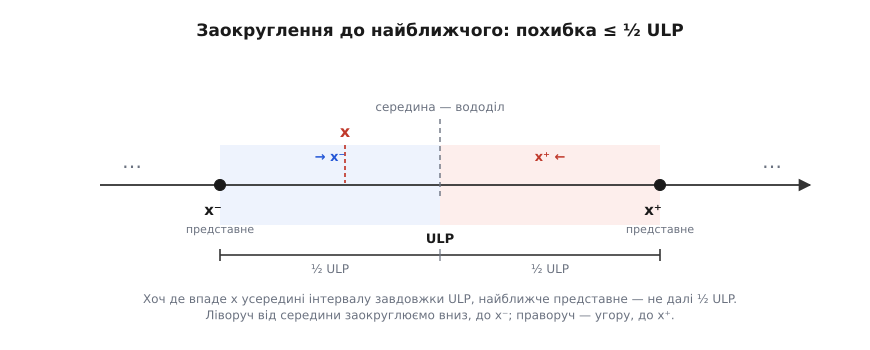
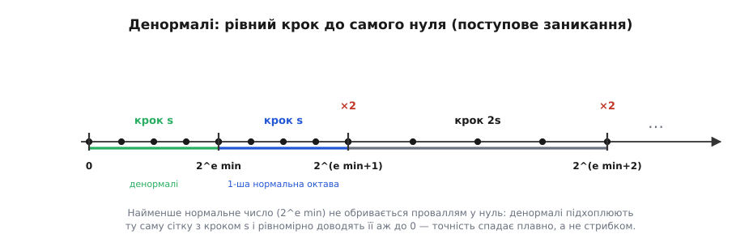

# 🧮 Структура множини представних чисел

Числа з рухомою комою живуть не всюди на числовій осі, а лише в **скінченній множині точок** — назвімо її F (від англ. *floats*). Кожен формат — це своя F: свій набір позначок, до яких машина здатна дотягтися точно. Усе інше вона мусить заокруглити до найближчої позначки. Тому варто один раз розібрати F як математичний об'єкт: як саме її точки розкладені на осі, скільки їх, з яким кроком, і — головне — **чому** саме так, а не інакше. Виведемо тут усе з першопринципів: чому кожна октава вміщає рівно 2^(p−1) чисел, звідки береться крок ULP і машинне епсилон, чому заокруглення дає похибку не більшу за половину кроку, які числа лягають у сітку точно, а які лишень «майже», і як денормалі рятують проміжок біля нуля.

Домовимося про позначення. Формат заданий двома числами: **основою** β (для реального заліза β = 2, але корисно тримати β загальним — видно, звідки що береться) і **точністю** p — кількістю значущих цифр значущої частини. Нормалізоване ненульове число має вигляд

```
x = ± s · βᵉ,   де  s = d₀.d₁d₂…d_{p−1}  (цифри в основі β),  d₀ ≠ 0
```

Значуща частина s несе p цифр: одну цілу d₀ і p−1 дробових. Нормалізація вимагає d₀ ≠ 0, тож s лежить у півінтервалі [1, β). Порядок e — ціле число з деякого діапазону [e_min, e_max]. Уся конкретика формату (скільки бітів під що, як ховається провідна одиниця, як кодуються нуль і нескінченність) — це вже [IEEE 754](topic:math-numeric/ieee754); нам вистачить самих β та p.

## Один хід, що робить лічбу тривіальною

Дробова значуща частина незручна для підрахунку. Зробімо єдиний хід, після якого все стає видно неозброєним оком: **помножмо значущу частину на βᵖ⁻¹ і сховаймо цей множник у порядок**. Оскільки s має p−1 дробових цифр, добуток s·βᵖ⁻¹ — уже **ціле число**. Позначмо його M:

```
M = s · βᵖ⁻¹   →   x = M · β^(e−p+1)
```

Що це нам дало? Ми записали представне число як **ціле число, помножене на фіксований степінь основи**. Уся дробова морока зникла: замість «значуща частина від 1.000… до майже β» ми маємо просто цілий лічильник M. А діапазон M одразу випливає з умови s ∈ [1, β): помноживши на βᵖ⁻¹, дістаємо

```
βᵖ⁻¹ ≤ M ≤ βᵖ − 1
```

Ось і вся структура октави в одному рядку. Усередині одного порядку e крок між сусідніми x — це крок між сусідніми M, тобто рівно **одиниця M**, помножена на спільний множник β^(e−p+1). Числа розкладені **рівно**, з однаковим кроком, бо цілі M ідуть підряд без пропусків.

## Чому в кожній октаві рівно 2^(p−1) чисел

Тепер порахувати нічого не варто. Скільки цілих M у відрізку [βᵖ⁻¹, βᵖ − 1]? Різниця країв плюс один:

```
(βᵖ − 1) − βᵖ⁻¹ + 1  =  βᵖ − βᵖ⁻¹  =  βᵖ⁻¹·(β − 1)
```

Для двійкової основи β = 2 множник (β − 1) дорівнює одиниці, і залишається

```
2ᵖ⁻¹ · (2 − 1)  =  2ᵖ⁻¹
```

Кожна октава [2ᵉ, 2ᵉ⁺¹) містить **рівно 2^(p−1)** представних чисел. Не «приблизно», не «в середньому» — точно стільки, і в кожній октаві однаково.

Формула формулою, та варто відчути, **чому** так, без жодної арифметики. Значуща частина в основі β — це низка цифр d₀d₁…d_{p−1}. Нормалізація прибиває першу цифру d₀ до ненульового значення: у двійковій це означає, що d₀ **завжди одиниця**, вибору нема взагалі. А решта p−1 цифр — вільні: кожна з них незалежно набуває будь-якого з двох значень, 0 або 1. Отже, кількість різних значущих частин — це кількість комбінацій p−1 вільних бітів, тобто 2^(p−1). Октава — це рівно множина всіх можливих «хвостів» після обов'язкової провідної одиниці. Ось звідки степінь двійки: **це не збіг, а пряма лічба вільних бітів мантиси**.

У десятковій основі логіка та сама, але цифр більше: провідна цифра d₀ має 9 ненульових варіантів (1…9), решта — по 10, звідси 9·10^(p−1) чисел на «декаду». Двійкова тим і особлива, що провідна цифра фіксується намертво — і лічба зводиться до чистого степеня двійки.

**Наскрізний іграшковий формат: β = 2, p = 4.** Візьмімо крихітний формат із трьома дробовими бітами — на ньому все видно на пальцях. Октава [1, 2), тобто порядок e = 0:

```
значуща частина 1.d₁d₂d₃  — три вільні біти, отже 2³ = 8 значень:
  1.000₂ = 1.000    1.100₂ = 1.500
  1.001₂ = 1.125    1.101₂ = 1.625
  1.010₂ = 1.250    1.110₂ = 1.750
  1.011₂ = 1.375    1.111₂ = 1.875
```

Рівно 8 = 2^(p−1) чисел, розставлені з однаковим кроком 0.125. У наступній октаві [2, 4) буде теж 8 чисел — але крок стане 0.25, бо все подвоїлося. Кількість стала, сітка розтягується.

## ULP: крок між сусідами

Крок між двома сусідніми представними числами — це та сама «одиниця M», перекладена в реальні одиниці. Оскільки x = M · β^(e−p+1), а сусіди різняться на ΔM = 1, крок дорівнює множникові:

```
ULP(x) = β^(e−p+1),   де e = ⌊log_β |x|⌋ — порядок октави, у якій лежить x
```

Назва ULP — англ. *unit in the last place*, «одиниця останнього розряду»: це вага наймолодшого біта значущої частини за поточного порядку. Формула прямо каже, що ULP **подвоюється** (для β = 2) щоразу, коли x переростає чергову степінь двійки й перескакує в наступну октаву: e зростає на одиницю — множник домножується на 2. Усередині ж однієї октави e стале, тож і ULP сталий — сітка там рівна.

У нашому іграшковому форматі (p = 4): в октаві [1, 2) маємо e = 0, отже ULP = 2^(0−4+1) = 2⁻³ = 0.125 — рівно той крок, що ми бачили в таблиці. В октаві [2, 4): e = 1, ULP = 2⁻² = 0.25. І так далі.

## Машинне епсилон і одиниця заокруглення

Серед усіх октав одна особлива — та, що містить одиницю: [1, 2), порядок e = 0. Її крок дістав власне ім'я — **машинне епсилон**:

```
eps = ULP(1) = β^(1−p)   (для двійкової: 2^(1−p))
```

Це проміжок між 1 і наступним представним числом угору. Для float32 (p = 24) eps = 2⁻²³ ≈ 1.19·10⁻⁷; для подвійної точності (p = 53) eps = 2⁻⁵² ≈ 2.22·10⁻¹⁶. Саме це число повертає мовний константний вираз `FLT_EPSILON`/`DBL_EPSILON` у C і його родичі в інших мовах — «на скільки 1.0 відрізняється від найближчого сусіда».

Тут ховається пастка на два визначення, через яку легко заплутатися. Термін «машинне епсилон» уживають у **двох** значеннях, що різняться множником 2. Перше — щойно наведене: eps = β^(1−p), крок біля одиниці (так визначають мовні константи — Ada, C, Python, Rust, MATLAB). Друге — **одиниця заокруглення** (англ. *unit roundoff*) u, удвічі менша:

```
u = ½ · eps = ½ · β^(1−p) = β^(−p)   (для двійкової: 2^(−p))
```

Саме u вживають у числовому аналізі (у Деммеля, у бібліотеці LAPACK, у наукових статтях), бо, як ми зараз побачимо, це u — а не eps — є справжньою межею **відносної похибки** заокруглення. Тримаймо різницю чіткою: eps — це **крок сітки** біля одиниці (спостережувана, «фізична» величина), а u — це **гарантія точності** (половина кроку). Плутати їх — класичне джерело помилки на множник 2 у оцінках похибки.

## Заокруглення до найближчого й межа ½ ULP

Дійсних чисел на осі незліченно, представних — скінченно. Тож майже кожне x доводиться підмінити найближчим представним. Ця підміна — **оператор заокруглення** fl: він бере довільне дійсне x і повертає найближчий елемент множини F:

```
fl(x) = представне число, найближче до x
       (нічия — коли x точно посередині — розв'язується окремим правилом,
        зазвичай «до парного»; для оцінки похибки це неістотно)
```

Тепер — головна теорема про точність, і доведімо її з нуля, бо вона тримає всю арифметику рухомої коми. Візьмімо x у нормальному діапазоні; хай воно потрапило в октаву з порядком e, тобто 2ᵉ ≤ |x| < 2ᵉ⁺¹. Представні числа в цій октаві розставлені з кроком ULP = 2^(e−p+1). Отже, x затиснуте між двома сусідніми представними, назвімо їх x⁻ ≤ x ≤ x⁺, і відстань між ними — рівно один ULP:

```
x⁺ − x⁻ = ULP = 2^(e−p+1)
```

Оператор fl вибирає той із двох, що ближчий. Дальший — щонайбільше за цілий ULP, тож **ближчий — щонайбільше за пів ULP**. Формально: якщо x лежить у лівій половині інтервалу (ближче до x⁻), то |fl(x) − x| = x − x⁻ ≤ ½·ULP; якщо в правій — то x⁺ − x ≤ ½·ULP. Межа посередині — **вододіл**: усе ліворуч від неї падає вниз, усе праворуч — угору. Хоч куди впаде x, дальше за половину кроку від найближчого сусіда воно опинитися не може:

```
|fl(x) − x| ≤ ½ · ULP(x) = ½ · 2^(e−p+1) = 2^(e−p)
```


*Інтервал завдовжки ULP між двома сусідніми представними числами x⁻ і x⁺. Середина ділить його на дві половини по ½ ULP кожна. Заокруглення відправляє x на той бік, до якого воно ближче, — тож найближче представне число ніколи не далі за половину кроку. Це і є вся геометрія межі ½ ULP.*

Тепер найважливіший крок — від абсолютної похибки до **відносної**. Поділімо оцінку на |x| і скористаймося тим, що |x| ≥ 2ᵉ (нижній край октави):

```
|fl(x) − x|     2^(e−p)     2^(e−p)
─────────── ≤ ─────── ≤ ─────── = 2^(−p) = u
   |x|           |x|         2ᵉ
```

Відносна похибка заокруглення не перевищує **u = 2⁻ᵖ** — і, що чудово, ця межа **не залежить від e взагалі**. Хоч біля одиниці, хоч біля мільярда, хоч біля мільярдної частки — відносна точність та сама. Ось де математично народжується та «стала кількість значущих цифр», заради якої й вигадали рухому кому: абсолютний крок росте з числом, але відносний — застигає на u.

Це можна записати ще стисліше, і в такому вигляді формула стає робочим інструментом усього числового аналізу:

```
fl(x) = x · (1 + δ),   де |δ| ≤ u = 2⁻ᵖ
```

> 🔧 **Навіщо це.** Число u = 2⁻ᵖ — це та єдина стала, крізь яку варто дивитися на весь формат. Вона каже: **будь-яке** представлення дійсного числа коштує щонайбільше відносної похибки u, і жодна дрібніша точність від формату не досяжна в принципі. Для float32 u = 2⁻²⁴ ≈ 6·10⁻⁸ — звідси й знамениті «≈ 7 значущих десяткових цифр» (бо log₁₀2²⁴ ≈ 7.2, стільки надійних цифр і лишається); для float64 u = 2⁻⁵³ ≈ 1.1·10⁻¹⁶ — «≈ 16 цифр». Коли треба оцінити, чи вистачить точності на задачу, рахують не біти, а саме u. А як ця одинична похибка **накопичується** й поширюється крізь ланцюг додавань і множень — уже окрема, тонша історія: [модель похибки операцій](topic:math-numeric/float-arithmetic-error).

Одна тонкість, яку варто побачити, бо вона показує, що «стала відносна точність» — приємне спрощення, а не буквальна правда. Межа u — це найгірший випадок, і він настає на **нижньому** краю октави, коли |x| ≈ 2ᵉ: там відносна похибка може сягати повних 2⁻ᵖ. А на **верхньому** краю, коли |x| ≈ 2ᵉ⁺¹, той самий абсолютний ½ ULP ділиться на вдвічі більше число, тож відносна похибка падає до 2^(−p−1). Виходить, відносна точність не застигла ідеально, а **дихає** в межах множника 2 усередині кожної октави — найкраща щойно **під** степенем двійки й найгірша щойно **над** нею. Це явище звуть «гойданням» (англ. *wobble*): гранична сітка не ідеально логарифмічна, а трохи хвиляста. Для двійкової основи розмах гойдання — рівно 2; що менша основа, то менше гойдання, і в цьому одна з тихих переваг β = 2 над, скажімо, шістнадцятковими форматами минулого.

## Які числа точні, а які лише «майже»

Повернімося до майстер-формули x = M · β^(e−p+1) й поставмо зворотне питання: **яке дійсне число взагалі має точний запис** у форматі? Відповідь читається просто з формули. Для β = 2 представне число — це ціле M, помножене на степінь двійки (можливо, від'ємний). Іншими словами, це дріб, у якого **знаменник — степінь двійки**:

```
x = M · 2ᵏ = M / 2⁻ᵏ   (при k < 0),   M — ціле, |M| ≤ 2ᵖ − 1
```

Такі числа — цілі, поділені на степінь двійки — звуть **двійковими** (або діадичними) дробами. Отже, критерій точності двоскладовий: (1) число має бути двійковим дробом узагалі, і (2) його значуща частина повинна вкладатися в p бітів. Друга умова — про довжину; перша — фундаментальніша, бо відсіює цілі класи чисел одразу.

Перевірмо на двох прикладах. Число 13.25 — це 53/4 = 53·2⁻². Знаменник 4 = 2² — степінь двійки, отже це двійковий дріб. А чисельник 53 = 110101₂ має 6 значущих бітів — легко вкладається в 24 біти float32. Обидві умови справджено, тож 13.25 лягає в сітку **точно**.

А тепер сумнозвісне 0.1 = 1/10. Знаменник 10 = 2·5 містить множник **5**, а п'ятірка не є степенем двійки й ніколи ним не стане — вона взаємно проста з двійкою. Скоротити цей множник нічим: у нескоротному дробі 1/10 п'ятірка в знаменнику лишається назавжди. Тому 0.1 — **не двійковий дріб зовсім**, за жодного скінченного p. У двійковій його розклад нескінченний і періодичний:

```
0.1 = 0.0001100110011001100…₂   (група «0011» повторюється без кінця)
```

точнісінько як ⅓ = 0.333… у десятковій. Формат обриває цей нескінченний хвіст на p бітах і зберігає не рівно 0.1, а найближчий двійковий дріб — той самий fl(0.1). Звідси й народжується класичне `0.1 + 0.2 ≠ 0.3`: кожен доданок уже підмінено найближчим сусідом, і сума двох підмін не зобов'язана дорівнювати підміні суми. Механіку самих двійкових розкладів — які дроби скінченні, які періодичні й чому — докладно розібрано у статті [двійкові дроби](topic:math-number-theory/binary-fractions).

Загальний висновок теорії чисел тут короткий і чіткий: у двійковому форматі точно представні **тільки двійкові дроби зі значущою частиною не довшою за p бітів** — зникомо тонка підмножина навіть серед раціональних чисел, не кажучи вже про всі дійсні. Усе інше формат лише наближає.

## Діра навколо нуля й денормалі

Досі ми мовчки вважали порядок e будь-яким цілим. Насправді він обмежений знизу числом e_min. І тут з'являється прикра прогалина. Найменше **нормальне** додатне число — це 2^(e_min). Що йде за ним униз, до нуля? Якби ми лишалися при нормалізованих числах, наступним значенням був би вже сам нуль — а між ними зяяв би провал завширшки цілих 2^(e_min). Порівняймо цей провал із кроком **над** найменшим нормальним числом: там ULP = 2^(e_min−p+1), тобто у 2^(p−1) разів **дрібніший** за провал. Виходить потворний обрив: сітка була густа-густа — і раптом одним стрибком падає в нуль. Найменші за модулем числа зникали б не плавно, а зривалися б у прірву.

Рятунок — відмовитися від нормалізації на самому дні діапазону. За найменшого порядку e_min дозволимо провідній цифрі бути **нулем**: значуща частина стає 0.d₁d₂…d_{p−1} замість 1.d₁…. Такі числа звуть **денормалями** (або субнормалями). У майстер-формулі це просто ті самі x = M · 2^(e_min−p+1), але тепер M пробігає значення від 0 до 2^(p−1) − 1 — від нуля до найменшого нормального числа. А отже, денормалі розставлені з тим **самим кроком** 2^(e_min−p+1), що й перша нормальна октава, і **рівномірно** заповнюють увесь проміжок [0, 2^(e_min)):

```
денормалі:  0,  1·2^(e_min−p+1),  2·2^(e_min−p+1),  …,  (2^(p−1)−1)·2^(e_min−p+1)
крок скрізь той самий:  2^(e_min−p+1)  =  ULP найменшої нормальної октави
```


*Біля нуля геометрична сітка поступається місцем рівномірній. Праворуч крок подвоюється щооктави (звична поведінка рухомої коми). Але в найменшій нормальній октаві крок s далі не зменшується — денормалі просто продовжують ту саму рівномірну решітку з кроком s аж до нуля. Замість провалу від 2^(e min) прямо в нуль — плавний спуск рівними сходинками.*

Тут стається цікаве: біля нуля рухома кома тимчасово **перестає бути рухомою** й поводиться як [фіксована кома](topic:hw-arch/fixed-point) — рівний абсолютний крок, стала «зернистість». Відносна точність у денормалях уже не тримається на u: що ближче до нуля, то менше значущих бітів лишається в числі, і точність спадає — але спадає **плавно**, біт за бітом, а не гине одним стрибком. Саме тому цю поведінку й назвали **поступовим заниканням** (англ. *gradual underflow*): число тане поступово, а не обривається в нуль.

Ідея ця не самоочевидна, і в неї є конкретне авторство. Поступове заникання відстояв математик **Вільям Кехен** (*William Kahan*) у комітеті зі стандарту IEEE 754 наприкінці 1970-х — це була частина пропозиції «K-C-S» (Кехен-Кунен-Стоун) і, за свідченнями учасників, **найсуперечливіша** її риса; проти неї висували простіше «різке» заникання одразу в нуль. Практичну здійсненність денормалей довела апаратна реалізація в математичному співпроцесорі Intel 8087, ще поки стандарт писали. Головний аргумент Кехена був не про естетику, а про надійність міркувань: із денормалями справджується проста й дуже корисна властивість — **різниця a − b дорівнює нулю тоді й лише тоді, коли a = b**. Без них два різні близькі числа могли б дати нульову різницю (обидва «недобрали» до найменшого нормального й провалилися в нуль), а тоді безневинне з вигляду ділення на (a − b) несподівано ділило б на нуль. Денормалі цю пастку прибирають. (Це добре задокументована історія проєктування стандарту; докладніше про сам шлях до IEEE 754 — у нарисах з історії форматів.)

## Скільки всього представних значень

Тепер можна перелічити всю множину F і побачити, куди подівся бюджет із 2ⁿ комбінацій. Порахуймо додатні числа. Нормальних октав рівно стільки, скільки дозволених порядків: E = e_max − e_min + 1. У кожній — по 2^(p−1) чисел. Плюс денормалі: їх 2^(p−1) − 1 ненульових (M від 1 до 2^(p−1) − 1). Помножмо на два знаки й додаймо нуль:

```
нормальних (обидва знаки):   2 · E · 2^(p−1)  =  E · 2ᵖ
денормальних (обидва знаки):  2 · (2^(p−1) − 1)
нуль:                          +1  (насправді два — +0 і −0)
```

Головний доданок — E · 2ᵖ — і є та сама «майже 2ⁿ» мітка з бюджету слова: показник p дає множник із мантиси, а число октав E — із порядку. Для float32 (p = 24, порядки від −126 до 127, тобто E = 254) це 254 · 2²⁴ ≈ 4.26·10⁹ нормальних значень — трохи менше за 2³², решту бюджету з'їдають денормалі та службові коди (нескінченності й «не-число»). Точну розкладку слова по полях, разом із цими службовими значеннями, стандартизує [IEEE 754](topic:math-numeric/ieee754); нам же важить сама структура: **скінченна решітка, густа біля нуля й дедалі рідша віддалік, із рівномірним «дном» денормалей коло самого нуля**.

---

Зберімо картину. Множина представних чисел F — це не суцільний відрізок осі, а скінченна решітка точок, і вся її будова читається з одного запису x = M · β^(e−p+1): представне число є цілий лічильник M на спільному масштабі β^(e−p+1). Звідси одразу все: у кожній октаві рівно β^(p−1)·(β−1) чисел (для двійкової — 2^(p−1), бо провідний біт заморожено в одиницю, а вільні лишень p−1 бітів хвоста), розставлених рівно з кроком ULP = β^(e−p+1), що подвоюється при кожному переході в наступну октаву. Крок біля одиниці — машинне епсилон eps = β^(1−p); його половина, одиниця заокруглення u = β⁻ᵖ, обмежує відносну похибку будь-якого заокруглення до найближчого, бо fl(x) = x·(1+δ) з |δ| ≤ u. Точно лягають у сітку тільки двійкові дроби зі скінченною p-бітовою значущою частиною — тому 0.1 не лягає ніколи. А коло нуля геометрична сітка поступається рівномірній: денормалі рівними сходинками доводять решітку до самого нуля, і числа заникають плавно, а не зриваються в прірву.
