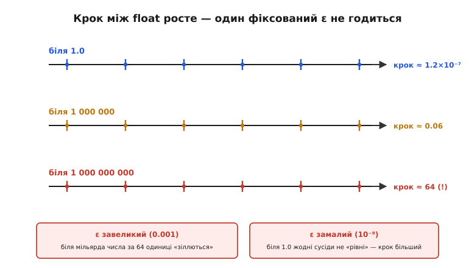
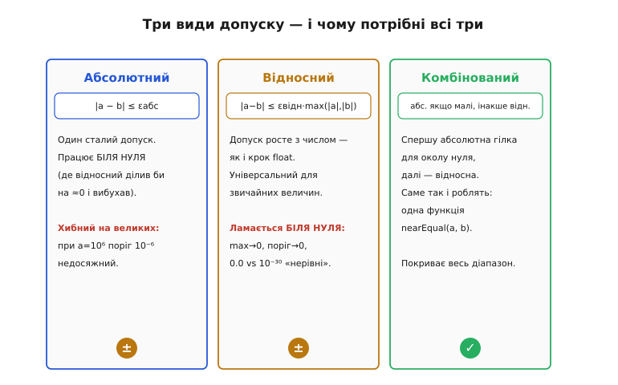
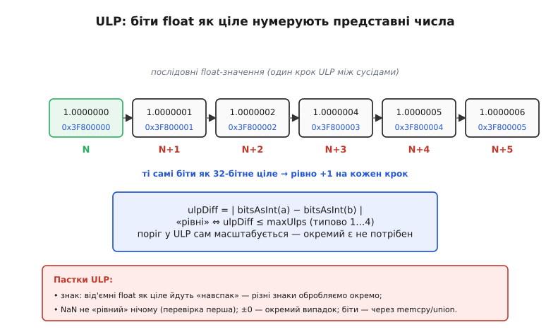

# ⚙️ Порівняння float: чому `a == b` не працює і як зробити правильно (epsilon, ULP)

> Головне правило [плаваючої коми](topic:hw-arch/floating-point): **результати** float-обчислень не порівнюють через `==`, бо 0.1 + 0.2 дає не рівно 0.3, а точність у float **відносна**. Тут — суто практичний крок: а **як** тоді порівнювати? «Перевірю, чи різниця менша за якесь маленьке число» — перша й найпопулярніша відповідь, і саме в ній ховається друга пастка, тонша за першу. Розберімо, чому навіть допуск треба підбирати з головою, і дійдемо до прийому, що масштабується сам, — **порівняння в ULP**.

## Задача: коли два float вважати «рівними»

Уявімо найбуденнішу річ. Ми порахували якусь величину — накопичили в циклі чи прочитали з давача й перетворили — і хочемо спитати: чи збігається результат із очікуваним? Для цілих це тривіально: `if (x == 42)`. Для [float](topic:hw-arch/floating-point) пряме `==` майже завжди скаже «ні»: обчислений результат відрізняється від «круглого» очікуваного на крихітну похибку округлення. Тож питання «чи рівні?» для float доводиться переформулювати — не «чи це **те саме** число до останнього біта», а «чи вони **достатньо близькі**, щоб вважатися одним і тим самим». А щойно звучить слово «достатньо», постає головне питання теми: **наскільки** близькі, і хто визначає цю межу.

## Ідея: спершу абсолютний допуск — і чому його замало

Найперша думка проста й майже правильна: ввести малий допуск `ε` (*epsilon*) і вважати числа рівними, коли різниця за модулем не перевищує його:

```text
|a − b| ≤ ε        // абсолютний допуск
```

Це **абсолютне** порівняння. Для чисел близького, наперед відомого масштабу воно чудово працює — як-от `|x − 0.3| < ε`. Пастка вилазить тоді, коли масштаб величин заздалегідь невідомий або широкий. Причина — та сама **відносна** точність [float](topic:hw-arch/floating-point): «крок» між сусідніми представними числами не сталий, а росте разом із самим числом.


*Та сама числова вісь у трьох масштабах. Біля 1.0 сусідні float32 відстоять на ≈ 1.2×10⁻⁷; біля мільйона крок уже ≈ 0.06; біля мільярда — аж ≈ 64. Звідси двосічна пастка фіксованого `ε`: візьмеш завеликий (0.001) — і біля мільярда числа, що різняться на 64 одиниці, помилково «зіллються в рівні»; візьмеш замалий (10⁻⁹) — і біля одиниці **жодні** два сусідні числа не пройдуть перевірку, бо найменший можливий крок там більший за поріг. Один сталий допуск фізично не може бути добрим на всьому діапазоні.*

Ось ключ до всієї теми: правильний допуск **залежить від величини** порівнюваних чисел. Звідси природний наступний крок — зробити поріг не сталим, а пропорційним самим числам: це **відносне** порівняння,

```text
|a − b| ≤ ε · max(|a|, |b|)     // відносний допуск
```

де `ε` тепер означає не «скільки одиниць», а «яку **частку** величини» ми ладні пробачити (скажімо, 10⁻⁶ — це «збіг до шести значущих цифр»). Допуск тут росте разом із числом — точнісінько як крок float, — тож на великих величинах він уже не задушливо тісний. Та й відносний підхід має свою діру, рівно протилежну: коли обидва числа близькі до нуля, `max(|a|, |b|)` теж прямує до нуля, поріг стискається до нуля, і навіть `0.0` проти крихітного 10⁻³⁰ оголошуються «нерівними». Виходить, абсолютний добрий біля нуля й сліпне на великих, а відносний — навпаки. Розумне рішення поєднує обидва.


*Абсолютний допуск рятує **біля нуля** (де відносний ділив би на ≈ 0), але хибний на великих числах. Відносний **універсальний для звичайних величин**, бо росте з числом, та ламається біля нуля. Робоче рішення — **комбіноване**: спершу абсолютна гілка для вузького околу нуля, далі відносна для всього іншого. Саме так і влаштовують єдину функцію `nearEqual(a, b)`, яку потім кличуть звідусіль; вона одна покриває весь діапазон.*

## Функція `nearEqual`: обидва допуски разом

Зведімо цю логіку в одну переносну функцію. Спершу — дешева перевірка точного збігу: вона ловить випадок, коли обидва числа однакові біт-у-біт (зокрема обидва нулі), і заразом коректно проходить ситуацію `a == b == ∞`, де віднімання дало б NaN. Далі абсолютна гілка для околу нуля, і насамкінець відносна для решти:

:::tabs
```c
bool nearEqual(float a, float b, float epsAbs, float epsRel) {
    if (a == b)                          // точний збіг (і нулі, і нескінченності)
        return true;
    float diff = fabsf(a - b);
    if (diff <= epsAbs)                  // абсолютна гілка: рятує біля нуля
        return true;
    float largest = fmaxf(fabsf(a), fabsf(b));
    return diff <= epsRel * largest;     // відносна гілка: масштабується з числом
}
```
```py
def near_equal(a, b, eps_abs, eps_rel):
    if a == b:                           # точний збіг (і нулі, і нескінченності)
        return True
    diff = abs(a - b)
    if diff <= eps_abs:                  # абсолютна гілка: рятує біля нуля
        return True
    largest = max(abs(a), abs(b))
    return diff <= eps_rel * largest     # відносна гілка: масштабується з числом
```
:::

Типові значення — `epsRel` близько кількох одиниць машинного епсилону (для float32 він ≈ 1.19×10⁻⁷, тож `epsRel` беруть порядку 10⁻⁶…10⁻⁵), а `epsAbs` — маленьке число масштабу очікуваних величин біля нуля. Підкреслимо: універсального «правильного» епсилону не існує — він залежить від того, **скільки** обчислень стоїть за числом і якого вони масштабу. Функція лише дає зручне місце, де цей вибір зробити свідомо, а не покладатися на сліпе `==`.

Залишається одна напівприхована проблема. І абсолютний, і відносний допуск ми задаємо «на око», в одиницях самої величини, — а хотілося б порогу в природних одиницях самого формату: «вважати рівними, якщо між `a` і `b` лежить не більше, скажімо, чотирьох **представних** чисел». Саме це й дає **ULP**.

## Порівняння в ULP: поріг, що масштабується сам

**ULP** (*unit in the last place* — «одиниця останнього розряду») — це відстань між двома сусідніми представними float-числами в околі даної величини, тобто той самий «крок», що росте разом із числом. «a і b відрізняються не більш ніж на 4 ULP» означає «між ними вміщається щонайбільше чотири можливі float-значення» — байдуже, де саме на осі ми перебуваємо. Такий поріг масштабується **сам**, бо ULP за визначенням і є локальний крок. Лишається технічне питання: як виміряти цю відстань, не знаючи наперед масштабу? Відповідь спирається на тонку, але точну властивість формату IEEE 754.


*Якщо взяти 32 біти додатного float і прочитати їх **як звичайне ціле**, то послідовні представні числа дістають послідовні цілі коди (`1.0` → 0x3F800000, наступне представне → 0x3F800001, і так далі — рівно +1 на кожен крок). Тому **ULP-відстань** між двома числами — це просто модуль різниці їхніх бітових кодів, прочитаних як цілі: `ulpDiff = |bitsAsInt(a) − bitsAsInt(b)|`. «Рівні» означає `ulpDiff ≤ maxUlps` (типово 1…4). Окремий `ε` тут не потрібен — поріг уже в природних одиницях формату.*

Сама функція ULP-порівняння коротка, але кожен її рядок страхує одну з пасток, про які — нижче:

:::tabs
```c
#include <stdint.h>
#include <string.h>
#include <math.h>
#include <stdbool.h>

// біти float як 32-бітне ціле — переносно, через memcpy (не *(int*)&f: те UB)
static int32_t bitsAsInt(float f) {
    int32_t bits;
    memcpy(&bits, &f, sizeof bits);
    return bits;
}

bool nearEqualUlp(float a, float b, int maxUlps) {
    if (isnan(a) || isnan(b))          // NaN не рівний нічому, навіть собі
        return false;
    int32_t ia = bitsAsInt(a);         // біти float як 32-бітне ціле
    int32_t ib = bitsAsInt(b);
    if ((ia < 0) != (ib < 0))          // різні знаки (різні півпрямі):
        return a == b;                 //   єдиний «рівний» випадок тут — ±0
    int32_t ulps = ia - ib;            // та сама півпряма — рахуємо крок
    if (ulps < 0) ulps = -ulps;        // |ia − ib|
    return ulps <= maxUlps;
}
```
```py
import math
import struct

def bits_as_int(f):                     # біти float32 як 32-бітне ціле зі знаком
    return struct.unpack("<i", struct.pack("<f", f))[0]

def near_equal_ulp(a, b, max_ulps):
    if math.isnan(a) or math.isnan(b):  # NaN не рівний нічому, навіть собі
        return False
    ia = bits_as_int(a)                 # біти float як 32-бітне ціле
    ib = bits_as_int(b)
    if (ia < 0) != (ib < 0):            # різні знаки (різні півпрямі):
        return a == b                   #   єдиний «рівний» випадок тут — ±0
    return abs(ia - ib) <= max_ulps     # та сама півпряма — рахуємо крок
```
:::

## Складність і пастки на МК

Обчислювально всі ці перевірки коштують копійки: віднімання, модуль, одне-два порівняння на гілці, що добре передбачається процесором. ULP-варіант узагалі **не торкається** блоку дробових чисел (*FPU*) — він працює з цілими, тож на дрібному 8/16-бітному ядрі **без FPU** (де float і так емулюється) ULP-порівняння часто дешевше за відносне, яке вимагає множення дробів. Куди важливіші пастки, специфічні для мікроконтролера й «голого» C.

Перша і найпідступніша — **як саме дістати біти**. Спокусливо написати `*(int*)&f` (перетлумачити адресу float як адресу int), але це порушує правило **строгого аліасингу** (*strict aliasing*) і в C/C++ є невизначеною поведінкою (*undefined behavior*, UB), а UB дає компілятору право мовчки переписати код. Переносний спосіб — `memcpy(&i, &f, 4)` або `union`; на оптимізації обидва зводяться до простого читання регістра, тож плата за коректність нульова. Друга — **знак**: від'ємні float, прочитані як ціле в доповняльному коді, ідуть «навспак» (що більший за модулем від'ємний float, то менший його код), тож наївне `abs(ia − ib)` коректне лише в межах одного знаку — різнознакові числа обробляють окремо (як у коді вище). Третя — **NaN**: він не рівний нічому, тож перевірку на нього ставлять **першою**, інакше його бітовий код випадково потрапить у діапазон `maxUlps` і дасть брехливе «рівні». Четверта — **±0**: два нулі різного знаку мають різні коди (0x00000000 і 0x80000000 — далеко не сусіди!), хоча математично рівні; явна гілка `a == b` ловить цей випадок. І спільне для всіх підходів: на МК **частіше беруть `float`, а не `double`** (ESP32 має апаратний FPU лише для одинарної точності), тож і пороги, і машинний епсилон рахують для float32.

> ⚙️ **Навіщо це.** Винесіть головне. Перше: **`==` для обчислених [float](topic:hw-arch/floating-point) — майже завжди баг**; замість нього — функція `nearEqual`, і не сподівайтеся, що один магічний `ε` підійде завжди. Друге: **абсолютний допуск рятує біля нуля, відносний — на великих числах**, тож робоча `nearEqual` поєднує обидва (плюс ранній `a == b` для точного збігу й нескінченностей). Третє: для порогу в природних одиницях формату є **ULP** — `|bitsAsInt(a) − bitsAsInt(b)| ≤ maxUlps`; він масштабується сам і не чіпає FPU, але вимагає окремо обробити **знак, NaN і ±0**, а біти діставати через `memcpy`/`union`, а **не** через `*(int*)&f` (інакше — UB). Правило просте: для float питання не «чи рівні?», а «**наскільки** близькі, і чи цього досить для задачі».
