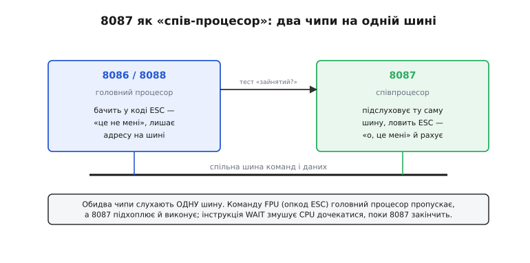
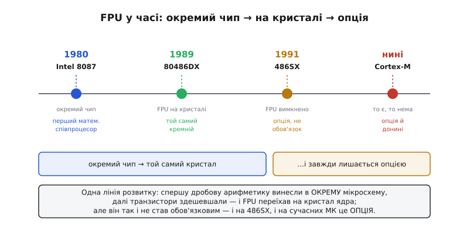

# 📜 Як дробова арифметика стала окремим залізом

На початку 1980-х персональний комп'ютер умів рахувати цілі числа швидко, а дробові — ганебно повільно. Не тому, що інженери чогось не додумали, а тому, що [число з плаваючою комою](topic:hw-arch/floating-point) — це насправді три поля (знак, порядок, мантиса), і кожне додавання таких чисел розпадається на процедуру з вирівнюванням, зсувами й округленням. Процесор 8086 виконував цю процедуру звичайними цілими командами — десятки, а то й сотні тактів на одне множення. Для текстового редактора байдуже. Для інженерної програми, що перемелює тисячі формул, — катастрофа.

Так постало питання, з якого й почалася вся історія: якщо дробова арифметика така дорога, чи не винести її в **окреме залізо**, спроєктоване робити саме це? Відповіддю став чип, назва якого досі живе в кожному процесорі, — і людина, чиї ідеї в тому чипі закарбувалися в стандарт, яким сьогодні рахує весь світ.

## Що бентежило: дробів багато, а рахувати нічим

Уявімо інженера 1979 року з новеньким IBM-сумісним комп'ютером на процесорі 8086. Він хоче порахувати щось просте — скажімо, синус кута чи корінь із числа. Процесор дробів апаратно не вміє **зовсім**: у нього є суматор для цілих, і все. Тож обчислення `sin(x)` перетворюється на довгу підпрограму, яка вручну, цілими зсувами й додаваннями, збирає дробовий результат розряд за розрядом. Одна така функція — тисячі тактів.

Була й друга біда, підступніша за повільність: **різні комп'ютери давали різні відповіді**. Кожен виробник реалізовував дробову арифметику по-своєму — своє округлення, своя поведінка на межі, своє трактування переповнення. Порахуєш ту саму формулу на машині IBM, на машині Cray і на машині Control Data — і отримаєш три ледь відмінні числа. Для науки, де результат мусить бути відтворним, це було нестерпно. Дробова арифметика була не лише повільна, а ще й **несумісна між машинами**.

Отут і сходяться дві лінії: інженерна (як зробити дроби швидкими) і математична (як зробити їх однаковими). Обидві зустрілися в одному проєкті наприкінці 1970-х у компанії Intel.

## Intel 8087: перший математичний співпроцесор (1980)

1980 року Intel випустила мікросхему **Intel 8087** — перший математичний співпроцесор для процесорів 8086 і 8088. Це усталений, добре задокументований факт: 8087 був першим чипом такого класу для 16-розрядних процесорів Intel.

Слово «співпроцесор» (*coprocessor*, від латинського *co-* — «спільно, поряд» + *processor*) з'явилося саме тут і напряму описувало фізику пристрою. 8087 був **окремою мікросхемою**, яку ставили на плату **поряд** із головним процесором. Він не заміняв 8086 і не був підлеглим у звичному сенсі — він працював *разом* із ним, підхоплюючи ту частину роботи, яку головний процесор робити не вмів. Не «під-процесор» і не «над-процесор», а саме **спів-процесор**: рівноправний напарник для однієї вузької справи.

Найдотепніша частина — **як** ці два чипи ділили роботу. Вони сиділи на одній спільній шині й обидва слухали той самий потік команд із пам'яті. Коли головний процесор натрапляв на команду з особливим опкодом (в архітектурі x86 це група `ESC` — «escape», «втеча»), він розумів: «це не мені» — і просто пропускав її, лишивши потрібну адресу на шині. А 8087, що весь час підслуховував ту саму шину, ловив цей `ESC` і казав «о, це мені» — і виконував дробову операцію сам. Щоб головний процесор не помчав уперед, поки співпроцесор ще рахує, була команда `WAIT`: вона змушувала 8086 зачекати, поки 8087 підніме сигнал «готово».


*Механізм співпроцесора 8087. Обидва чипи слухають одну шину команд і даних. Команду для дробів (опкод ESC) головний процесор 8086/8088 пропускає — «це не мені», — а 8087 підхоплює й рахує сам. Інструкція WAIT синхронізує їх: головний процесор чекає, поки співпроцесор закінчить і повідомить про це. Звідси й назва «спів-процесор» — два рівноправні чипи, що працюють поряд над однією програмою.*

Виграш був разючий. Там, де програмна емуляція повзла тисячі тактів, 8087 давав результат за десятки. Він рахував не лише `+ − × ÷`, а й складні речі — тангенс, логарифм, піднесення до степеня — просто в залізі. І робив це з **вищою точністю**, ніж будь-хто доти: усередині 8087 тримав числа у 80-бітному форматі (розширена точність — 64 біти мантиси й 16 порядку), що давало запас проти накопичення похибки в довгих обчисленнях. Той 80-бітний формат живе в архітектурі x86 донині.

Був лише один нюанс, який згодом стане лейтмотивом усієї історії: 8087 треба було **докуповувати окремо**. На платі під нього залишали порожній сокет. Хочеш швидку математику — купуй чип і встромляй; не потрібна — сокет лишається порожнім, а комп'ютер рахує дроби повільно, програмою. Із самого початку дробове прискорення було **опцією**, а не обов'язковою частиною. Продажі 8087 різко зросли, коли 1981 року порожній сокет під нього поставили на материнську плату першого IBM PC, — але саме порожній сокет, не впаяний чип.

## Людина за арифметикою: Вільям Кехен і народження IEEE 754

Швидкість — це інженерія. А от **правильність** дробової арифметики — окрема, глибша наука, і тут в історію входить ключова постать.

Розробку 8087 Intel почала близько 1976 року; проєкт вів інженер Джон Палмер (John Palmer). Але спроєктувати саму арифметику — формати чисел, правила округлення, поведінку на межах — Intel запросила консультанта, і це виявилося рішенням, наслідки якого відчуває кожен сучасний комп'ютер. Консультантом став **Вільям Кехен** (William Kahan) — канадський математик, народжений 1933 року в Торонто, який здобув там усі три ступені (бакалавр, магістр, доктор) з математики, а більшість кар'єри провів у Каліфорнійському університеті в Берклі. (Прізвище англійською часто передають як «Кахан»; він канадець, і його внесок — математичний, а не прив'язаний до якоїсь національної «першості».)

Кехен на той час уже мав рідкісний досвід: він добре знав, як влаштована дробова арифметика на великих машинах IBM, Cray і Control Data, — і знав усі її болячки. Саме тому його й покликали спроєктувати арифметику 8087 так, щоб вона була **точна й передбачувана**. Кехен особисто приписує собі дві речі, що сьогодні здаються самоочевидними, а тоді були новацією:

- **прапорець «неточно» (*inexact flag*)** — біт, який програма може перевірити, щоб дізнатися, чи був результат округлений, чи точний;
- код **NaN** (*Not a Number* — «не число») — спеціальне значення, яким арифметика чесно каже «результату не існує» (наприклад, для `0/0` чи кореня з від'ємного), замість того щоб мовчки видати сміття.

І ось тут інженерна лінія зімкнулася з математичною. Поки Intel будувала 8087, у 1978 році почав набирати обертів комітет інституту IEEE, що взявся виробити **єдиний стандарт** дробової арифметики — щоб покласти край різнобою між машинами. Кехен, який одночасно проєктував арифметику 8087 і був душею цього комітету (разом із колегами й студентами з Берклі), фактично **переніс ідеї 8087 у майбутній стандарт**. Робота над реальним чипом підштовхнула й напряму сформувала стандарт — це задокументований, усталений факт, а не легенда.

Стандарт ухвалили 1985 року під назвою **IEEE 754**. І вийшло красиве замикання кола: 8087, спроєктований *до* ухвалення стандарту, став, по суті, **першою апаратною реалізацією** того, що через п'ять років світ визнає нормою для всіх дробових обчислень. За ці фундаментальні праці з чисельного аналізу Кехен 1989 року здобув **премію Тюрінга** — найвищу відзнаку в інформатиці.

> 🔧 **Навіщо це.** Коли ви сьогодні на будь-якому чипі — від суперкомп'ютера до мікроконтролера — покладаєтесь на те, що `0.1 + 0.2` дасть однаковий результат, що `sqrt(-1.0)` поверне NaN, а не випадкове число, і що округлення поводиться передбачувано, — ви користуєтесь саме тими правилами, які Кехен заклав в арифметику 8087 і які стали [IEEE 754](topic:hw-arch/floating-point). Історія тут не декоративна: розуміння, *чому* дробова арифметика взагалі стандартизована й що означають NaN чи прапорець «неточно», — це прямий спадок цього проєкту.

## Три покоління окремого чипа

8087 не лишився самотнім. Кожне нове покоління процесорів Intel діставало свій співпроцесор — окрему мікросхему в пару, — і лінія протрималася майже десятиліття:

```
процесор         співпроцесор     рік
─────────────    ─────────────    ────
8086 / 8088      8087             1980
80286            80287            1982
80386            80387            1987
```

Це усталені дати. Кожен наступний співпроцесор був швидший і точніший за попередній. Важлива деталь із цієї еволюції: саме **80387** (1987) став першим співпроцесором Intel, що **повністю** відповідав ухваленому IEEE 754 у всіх дрібницях, — сам 8087 реалізовував ще ранню, не остаточну версію правил (бо творився *до* фіналу стандарту).

Але крізь усі три покоління трималася та сама модель: дробове прискорення — **окрема покупка**. Порожній сокет на платі, який власник міг заповнити або лишити пустим. Дороге залізо тримали окремо від дешевого не примхи заради, а з простої економіки: транзистори коштували дорого, і вбудовувати складний дробовий блок у кожен процесор — навіть у ті, що йшли в машини, де ніхто ніколи не рахуватиме синусів, — було марнотратством. Дешевша машина — без співпроцесора; потрібна математика — доплати.

Ця економіка трималася рівно доти, доки транзистори не подешевшали настільки, що рахунок змінився.

## Переїзд на кристал: 80486DX (1989)

1989 року Intel випустила процесор **80486DX** — і тихо закрила цілу епоху. Уперше дробовий блок опинився **не в окремому чипі, а на тому самому кристалі**, що й головне ядро. Купуючи 486DX, ви діставали FPU автоматично, вбудованим; окремий сокет під співпроцесор більше не був потрібен.

Причина — суто фізична. До кінця 1980-х виробництво навчилося вмістити на один кристал понад мільйон транзисторів (486 був першим процесором x86, що переступив цю межу). Коли транзисторів так багато, тримати дробовий блок окремою мікросхемою стало **дорожче**, ніж просто вбудувати його: окремий чип — це ще один корпус, ще один сокет, ще одна шина між ними, зайва затримка на передавання команд. Дешевше й швидше було посадити все на один кремній.

Цікаво, що назва **«співпроцесор» пережила свою фізичну причину**. Блок уже не сидів «поряд» — він був усередині ядра, — а слово лишилося, як лишаються в мові старі корені. Ще довго вбудований FPU за звичкою називали співпроцесором, хоча співставляти вже не було з чим.

Здавалося б, на цьому історія «FPU як опції» мала скінчитися: блок став частиною процесора, тепер він є завжди. Але сталося дещо повчальне.

## 486SX: як опцію зробили опцією знову

Вбудувавши FPU в кожен 486DX, Intel наштовхнулася на ринкову проблему: не всім потрібна дробова математика, а платити за неї в ціні процесора мусили всі. Потрібна була **дешевша модель** для простих машин. І Intel зробила несподіване: 1991 року випустила процесор **486SX** — той самий 486DX, у якому вбудований FPU **просто вимкнули**.

У перших версіях 486SX дробовий блок фізично був на кристалі — його **внутрішньо відрізали від решти схеми**, щоб він не працював. Пізніші версії (з 1992 року) вже випускали взагалі **без** дробового блоку, щоб здешевити виробництво. Але суть та сама: 486SX — це процесор *без* робочого FPU, який продавали дешевше (початкова ціна близько 258 доларів) для машин, де швидка математика не потрібна. Суфікс «SX» Intel запозичила зі своєї ж дешевшої моделі 386SX, щоб він означав «здешевлений варіант».

Іронія повного кола: щойно FPU став обов'язковою частиною процесора, Intel винайшла спосіб знову зробити його **опцією** — цього разу не порожнім сокетом, а вимкненим блоком усередині. А для тих, кому математика все-таки була потрібна, існував апгрейд: чип **487**, який був, по суті, повноцінним 486DX із одним зайвим виводом (щоб його не можна було вставити не туди). Вставляєш 487 — і він, за суттю, перебирає роботу на себе.

Ця історія — не курйоз, а найважливіший урок усієї еволюції. FPU ніколи не був **обов'язковою** частиною процесора. Спершу — окремий чип, який докуповуєш. Потім — вбудований блок, який можна вимкнути заради ціни. Дробове прискорення завжди лишалося тим, за що платять окремо, коли воно справді потрібне.


*Одна наскрізна лінія розвитку. 1980 — 8087, окремий чип у сокет поряд із процесором. 1989 — 80486DX, FPU переїхав на той самий кристал, що й ядро, бо транзистори здешевшали. 1991 — 486SX, вбудований FPU вимкнули заради дешевшої ціни. І донині, у світі мікроконтролерів, FPU лишається опцією — на дрібних ядрах його немає зовсім. Технологія змінювалася, а суть трималася: дробове прискорення — не обов'язок, а вибір.*

## Чому ця історія жива й сьогодні

Легко сприйняти все це як музейну хроніку: старі чипи, забуті сокети, ринкові хитрощі 1990-х. Але еволюція «окремий чип → на кристалі → опція» — це не завершена історія, а **закономірність, що повторюється просто зараз**, тільки поверхом нижче — у мікроконтролерах.

Сьогоднішній розробник вбудованих систем стоїть перед точнісінько тим самим питанням, що й інженер 1980 року з порожнім сокетом під 8087: **чи є в цьому чипі апаратна дробова арифметика?** На дрібних ядрах (скажімо, Cortex-M0 чи M3, чи 8-бітні мікроконтролери) FPU немає — і `float` там знову повзе програмною емуляцією, десятки тактів на операцію, точно як на 8086 сорок років тому. І рішення часто те саме, що й тоді: якщо швидкої математики немає, а вона критична, обчислення переписують на [фіксовану кому](topic:hw-arch/fixed-point) — цілу арифметику з уявним масштабом.

Навіть логіка «опції» повторюється буквально. У класифікації ядер ARM дробовий блок для Cortex-M4 і M7 позначено як **опційний** — виробник конкретного чипа може його поставити, а може й ні, точно як власник машини 1985 року вставляв або не вставляв 80387. Питання «є FPU чи нема і якої він точності» — не архаїзм, а щоденна реальність [вибору мікроконтролера](root:embedded/mcu-selection): наявність і точність дробового блоку — один із критеріїв, за якими підбирають ядро під дробові розрахунки керування.

Так замикається справжнє коло історії. Те, що почалося як окремий чип у сокеті поряд із 8086, пройшло через кристал 486DX, стало на мить обов'язковим — і знову розсипалося на опцію, тепер уже всередині мікроконтролерів. А правила, за якими той перший чип рахував, — формати, округлення, NaN, прапорці, — Вільям Кехен закарбував у IEEE 754 так міцно, що ними досі рахує геть усе: від того самого настільного процесора до крихітного давача у вас на столі.
