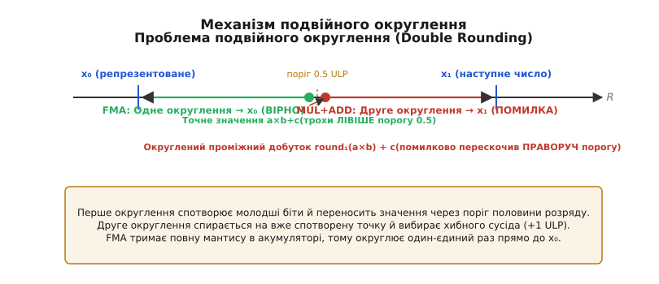
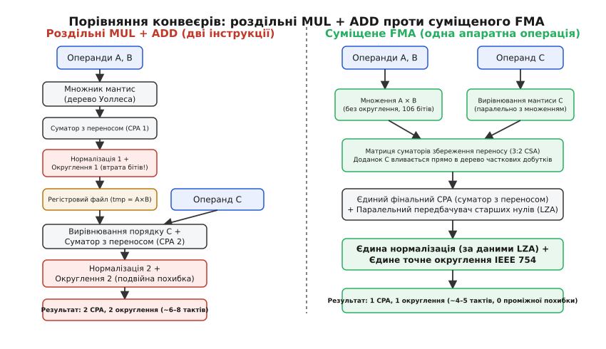
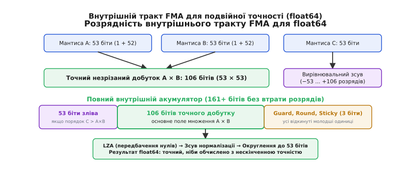
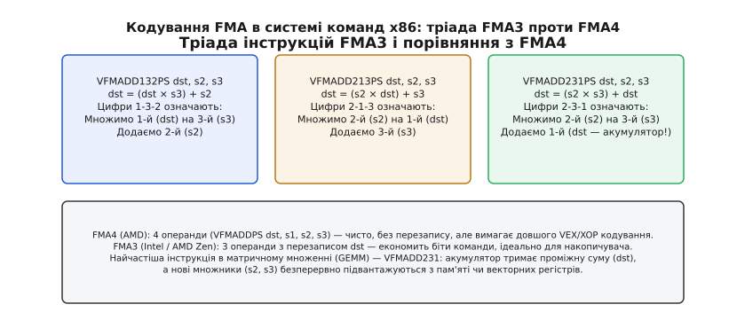

# FMA: суміщене множення-додавання

<preknowlist>
- [Плаваюча кома](root:hw-arch/floating-point) — формат IEEE 754: мантиса, порядок, зміщення та похибки округлення.
- [Блок дробових чисел (FPU)](root:hw-arch/fpu) — апаратний конвеєр обчислень над числами з плаваючою комою.
- [Конвеєр](root:hw-arch/pipeline) — стадії виконання, затримка (latency) і пропускна здатність (throughput).
- [SIMD і векторизація](root:hw-arch/simd-vectorization) — паралельна обробка векторів даних однією інструкцією.
</preknowlist>

Коли комп'ютерна програма намагається обчислити різницю квадратів `x² - y²` для двох дуже близьких чисел `x = 1.0000000000000002` та `y = 1.0` у стандартній подвійній точності `double`, звичайний процесор виконує дві незалежні інструкції: спочатку множення `x * x`, а потім віднімання `y * y`. Множення `x * x` дає математичний результат з 106 бітами мантиси, але стандартний блок FPU змушений відтяти молодші 53 біти, щоб укласти число у 64-бітний регістр. Коли слідом за цим виконується віднімання, майже всі значущі цифри, що залишилися, взаємно знищуються (явище катастрофічного скасування розрядів), а відкинуті на першому кроці молодші біти назавжди втрачено. Результат містить випадкове сміття у молодших розрядах або повністю обнуляється.

Ця проблема виникає тому, що традиційний конвеєр FPU розриває зв'язку множення та додавання на дві ізольовані операції з обов'язковим проміжним округленням між ними. Процесор не лише втрачає точність у критичних обчисленнях, але й витрачає зайві такти: проміжне значення потрібно нормалізувати, округлити, записати у регістровий файл, а потім знову зчитати, вирівняти порядок для додавання і вдруге нормалізувати.

Розв'язком цього протиріччя стала апаратна операція **суміщеного множення-додавання** (*Fused Multiply-Add*, скорочено **FMA**; від латинського *fusus* — сплавлений, неподільний). Вона обчислює вираз `(a × b) + c` як єдиний неподільний фізичний процес: добуток `a × b` формується на внутрішньому акумуляторі подвійної ширини, доданок `c` додається до незрізаного добутку, і лише фінальна сума проходить одне-єдине округлення.

> 📜 Про те, як інженери IBM у 1990 році створили перший апаратний конвеєр FMA для суперкомп'ютерів RS/6000, як ця операція спричинила війну стандартів FMA3 та FMA4 у світі x86 і як вона еволюціонувала в сучасні тензорні ядра GPU для нейромереж, читайте у вставці [Еволюція FMA: від суперкомп'ютерів IBM до тензорних ядер](root:hw-arch/fused-multiply-add/hist-fma-evolution.md).

---

### Проблема подвійного округлення: чому дві операції гірші за одну

Головна математична вада роздільного виконання множення та додавання полягає у явищі **подвійного округлення** (*Double Rounding*).

Нехай нам потрібно обчислити вираз `(a × b) + c`. У класичному процесорі без підтримки FMA обчислення розпадається на два послідовні кроки:

```
tmp = round(a × b)
res = round(tmp + c)
```

де кожна функція `round()` відтинає біти відповідно до правил поточного режиму округлення стандарту IEEE 754 (найчастіше — округлення до найближчого парного).

Операція FMA виконує інше математичне відображення:

```
res = round((a × b) + c)
```

Різниця між цими двома підходами здається мізерною (менше одного ULP — *Unit in the Last Place*, одиниці молодшого розряду), проте в чисельних методах ця відмінність часто є фатальною.


*Механізм виникнення похибки при подвійному округленні. Перше проміжне округлення зміщує число через поріг половини розряду (0.5 ULP). Друге фінальне округлення спирається на вже спотворену проміжну точку й обирає хибне машинне число x₁, помиляючись на 1 ULP. FMA виконує одне-єдине фінальне округлення прямо до точного значення x₀.*

#### Числовий доказ розбіжності

Розглянемо числовий приклад на числах одинарної точності `float` (24 біти мантиси разом із неявною одиницею).

Візьмемо три двійкові числа:

```
a = 1.00000000000000000000001₂ × 2⁰   (1 + 2⁻²³)
b = 1.00000000000000000000001₂ × 2⁰   (1 + 2⁻²³)
c = -1.00000000000000000000000₂ × 2⁰  (-1.0)
```

Обчислимо точний аналітичний добуток `a × b`:

```
a × b = (1 + 2⁻²³)²
      = 1 + 2⁻²² + 2⁻⁴⁶
```

У двійковому записі мантиса незрізаного добутку має 47 розрядів:

```
1.000000000000000000000100000000000000000000001₂
```

1. **При роздільному обчисленні (MUL + ADD):**
   - Крок 1 (`tmp = round(a * b)`): FPU змушений укласти 47-бітний добуток у 24 біти формату `float`. Оскільки біт `2⁻⁴⁶` лежить далеко за межами розрядної сітки, при округленні до найближчого значення хвіст відкидається. Отримуємо:
     ```
     tmp = 1.00000000000000000000010₂ × 2⁰ = 1 + 2⁻²²
     ```
   - Крок 2 (`res = round(tmp + c)`): віднімаємо `1.0`:
     ```
     res = (1 + 2⁻²²) - 1.0 = 2⁻²²
     ```

2. **При суміщеному обчисленні FMA:**
   - Обчислюється точна незрізана сума `(a × b) + c`:
     ```
     (1 + 2⁻²² + 2⁻⁴⁶) - 1.0 = 2⁻²² + 2⁻⁴⁶
     ```
   - Виконується нормалізація: число зсувається ліворуч на 22 позиції, щоб старша одиниця стала на перше місце:
     ```
     (1 + 2⁻²⁴) × 2⁻²²
     ```
   - Тепер доданок `2⁻²⁴` потрапляє у 25-й біт нормалізованої мантиси! За правилом округлення до найближчого парного (*Round to nearest, ties to even*) молодший біт округлюється вгору до `2⁻²³`.
   - Фінальний результат FMA:
     ```
     res = (1 + 2⁻²³) × 2⁻²² = 2⁻²² + 2⁻⁴⁵
     ```

Роздільне множення та додавання повністю втратило молодший член `2⁻⁴⁵`, видавши похибку в 1 ULP. У тривалих ітераційних процесах (розв'язання диференціальних рівнянь, симуляція динаміки молекул, розрахунок орбіт космічних апаратів) такі одиничні похибки систематично накопичуються, призводячи до швидкої розбіжності всієї моделі.

---

### Специфікація IEEE 754-2008: винятки та спеціальні значення

Стандарт IEEE 754-2008 формалізував поведінку FMA для всіх можливих комбінацій вхідних операндів, включаючи спеціальні значення (нулі, нескінченності, не-числа NaN) та виняткові ситуації.

#### Обробка не-чисел (NaN) та нескінченностей
- Якщо хоча б один із трьох операндів є сигнальним не-числом (`sNaN`), генерується виняток неприпустимої операції (*Invalid Operation*), а результатом стає тихе не-число (`qNaN`).
- Множення `0 × ∞` за стандартом є невизначеністю. Якщо `a = 0`, `b = ∞`, а `c` — довільне скінченне число, операція `fma(0, ∞, c)` генерує виняток *Invalid Operation* і повертає `qNaN`. Доданок `c` не рятує операцію від невизначеності добутку.
- Додавання протилежних нескінченностей: якщо добуток `a × b = +∞`, а доданок `c = -∞`, операція `fma(a, b, c)` формує вираз `(+∞) + (-∞)`, що також викликає виняток і повертає `qNaN`.

#### Знаки нулів та точне скасування
Знаки нулів в арифметиці IEEE 754 мають суворе математичне значення:
- Якщо `a × b` дає точний нуль і `c = 0`, знак результату підпорядковується правилу знаків множення та додавання: `fma(+0, +0, +0) = +0`, тоді як `fma(-0, +0, -0) = -0`.
- При **точному взаємному скасуванні**, коли `(a × b) = -c` і результат строго дорівнює математичному нулю, виникає питання знаку нуля. За стандартом IEEE 754:
  - У режимі округлення до найближчого (*Round to nearest*), до нуля (*Round toward zero*) або до плюс нескінченності (*Round toward +infinity*) точний нуль завжди отримує **додатний знак `+0`**.
  - У режимі округлення до мінус нескінченності (*Round toward -infinity*) точний нуль отримує **від'ємний знак `-0`**.

#### Антипереповнення (Underflow) без проміжних пасток
Найважливіша властивість FMA у стандарті IEEE 754 стосується сигналізації про антипереповнення (*Underflow exception*):
- Якщо проміжний добуток `a × b` виявився меншим за мінімальне нормалізоване число (потрапив у діапазон денормалей), але після додавання великого доданка `c` фінальний результат повертається у нормальний діапазон, **виняток антипереповнення НЕ генерується**.
- Прапорець *Underflow* виставляється виключно тоді, коли **фінальний округлений результат** виявився ненормалізованим і втратив точність. У роздільному конвеєрі `MUL + ADD` проміжне множення викликало б сигнал переривання або уповільнення процесора навіть тоді, коли кінцева відповідь є звичайним великим числом.

---

### Чому FMA перевершив 80-бітний формат x87

В історії процесорів архітектури x86 спроба вирішити проблему проміжного округлення вже робилася у математичному співпроцесорі Intel 8087 (архітектура x87). Його стек-регістри мали розширену точність (*Extended Precision*, 80 бітів: 64 біти мантиси та 15 бітів порядку).

Проте x87 страждав від фундаментальної вади: **непередбачуваного витіснення регістрів у пам'ять** (*register spill*).
Коли проміжний вираз обчислювався всередині 80-бітних регістрів, він мав високу точність. Але щойно компілятору бракувало регістрів, або коли результат зберігався у змінну типу `double` (64 біти), значення округлювалося з 80 до 64 бітів.

Це породжувало сумнозвісний ефект: оптимізований код, що тримав змінні на регістрах, давав одну відповідь, а неоптимізований код (або той самий код після додавання виклику `printf()`, що скидав регістри) давав іншу відповідь! Такий хаос унеможливлював детерміністичне тестування чисельних програм.

FMA принципово відрізняється від розширеної точності x87:
1. FMA оперує стандартними регістрами `float` (32 біти) та `double` (64 біти).
2. Розширений тракт існує **лише всередині конвеєра інструкції** протягом декількох тактів її виконання.
3. Результат завжди повертається у стандартний формат призначення, гарантуючи 100% математичний детермінізм незалежно від розподілу регістрів компілятором.

---

### Схемотехніка FMA: мікроархітектура та внутрішній тракт

Щоб зрозуміти, як процесор виконує FMA без втрати швидкості, необхідно зазирнути всередину кремнієвого блоку плаваючої коми (FPU).


*Схемотехнічне порівняння конвеєрів. Ліворуч: дві окремі інструкції вимагають двох суматорів CPA, двох циклів нормалізації, двох округлень та проміжного запису в регістри (~6–8 тактів). Праворуч: FMA вливає доданок C безпосередньо в дерево часткових добутків CSA, використовуючи один CPA та одне фінальне округлення (~4–5 тактів).*

#### Внутрішній розширений тракт: розрядність акумулятора

Для чисел подвійної точності `double` (формат IEEE 754 binary64) мантиса кожного операнда містить 53 біти (1 неявний цілий біт плюс 52 дробові біти).

Під час множення мантис двох чисел `A` і `B`:

```
53 біти × 53 біти = 106 бітів точного добутку
```

Щоб додати до цього 106-бітного результату мантису третього операнда `C` (53 біти), її необхідно вирівняти за порядком. Різниця порядків `exp(C) - exp(A × B)` визначає величину зсуву мантиси `C`:
- Якщо `exp(C) > exp(A × B)`, мантиса `C` зсувається ліворуч відносно добутку (доданок `C` домінує).
- Якщо `exp(C) < exp(A × B)`, мантиса `C` зсувається праворуч відносно добутку (добуток домінує).


*Розрядність внутрішнього тракту FMA для подвійної точності (float64). Повний внутрішній акумулятор охоплює 161+ біт (53 біти можливого переповнення ліворуч + 106 бітів точного добутку + біти Guard, Round, Sticky праворуч).*

Щоб жоден біт не загубився за будь-якого співвідношення порядків, внутрішній тракт суматора FMA має гігантську розрядність — **щонайменше 161 біт** (а з урахуванням службових розрядів — до 163–166 бітів):
- **53 біти ліворуч:** вікно для додавання операнда `C`, якщо його порядок значно перевищує порядок добутку `A × B`.
- **106 бітів у центрі:** повне поле незрізаного добутку `A × B`.
- **3 службові біти праворуч:**
  - `Guard bit` (захисний біт) — перший відкинутий біт праворуч, необхідний для точного зсуву при нормалізації.
  - `Round bit` (біт округлення) — другий відкинутий біт, що визначає поріг округлення (більше чи менше половини ULP).
  - `Sticky bit` (липкий біт) — логічне «АБО» (*OR*) усіх наступних молодших бітів, відкинутих праворуч. Якщо серед них була хоча б одна двійкова одиниця, липкий біт стає рівним `1`, що гарантує абсолютно коректне округлення за стандартом IEEE 754.

#### Ключові схемотехнічні блоки FMA

Побудова такого широкого тракту вимагає спеціальних інженерних рішень, аби затримка сигналу не сповільнювала загальну тактову частоту ядра процесора:

1. **Дерево Уоллеса / Дадда (Wallace / Dadda Tree):** матриця часткових добутків формується на базі модифікованого кодування Бута (*Radix-4 Booth Encoding*), що скорочує кількість рядків додавання вдвічі (для 53 бітів потрібно лише 27 часткових добутків). Потім компресори 3:2 та 4:2 згортають масив часткових добутків у дерево суматорів збереження переносу (*Carry-Save Adder*, CSA).
2. **Пряма ін'єкція доданка C:** замість окремого попереднього суматора зсунута мантиса числа `C` подається як додатковий вхід безпосередньо у матрицю CSA паралельно з частковими добутками `A × B`. Якщо знаки добутку та доданка протилежні (ефективне віднімання), мантиса `C` інвертується у доповняльний код (*Two's Complement*).
3. **Паралельне формування Sticky Bit:** оскільки зсув мантиси `C` праворуч може відкинути до 161 біта, обчислення липкого біта виконується за допомогою швидких паралельних масок префіксного логічного «АБО», що виключає послідовну затримку сканування бітів.
4. **Передбачувач старших нулів (LZA — Leading Zero Anticipator):** у класичному суматорі після виконання додавання необхідно підрахувати кількість нулів на початку числа, щоб визначити величину зсуву для нормалізації. Це створювало критичну затримку. Схема LZA обчислює кількість провідних нулів паралельно з роботою основного суматора CPA, аналізуючи вхідні вектори переносів і сум. Коли суматор видає результат, величина зсуву нормалізації вже відома з точністю до ±1 біта.
5. **Складений суматор розповсюдження переносу (Compound CPA):** фінальне злиття вектора сум і вектора переносів виконується лише один раз у кінці конвеєра. Суматор одночасно генерує результат `Sum` та `Sum + 1`, що дозволяє миттєво виконати округлення без повторного запуску ланцюжка переносу.

#### Чотиристадійний конвеєр виконання FMA

Сучасний мікропроцесорний блок FMA зазвичай розбивається на 4 конвеєрні стадії:
- **Стадія 1 (Розпакування та вирівнювання):** паралельне розпакування полів знаку, порядку та мантиси трьох операндів. Генерація 27 часткових добутків за схемою Бута. Обчислення різниці порядків та зсув мантиси `C` у 161-бітному вікні.
- **Стадія 2 (Компресія CSA):** стиснення 27 часткових добутків та вирівняної мантиси `C` через багаторівневе дерево Уоллеса до двох підсумкових 161-бітних векторів: вектора часткових сум (*Sum*) та вектора переносів (*Carry*).
- **Стадія 3 (Додавання CPA та LZA):** паралельна робота основного суматора CPA та передбачувача провідних нулів LZA. Формування ненормалізованої суми.
- **Стадія 4 (Нормалізація та фінальне округлення):** зсув мантиси на нормалізаторі відповідно до виходу LZA, аналіз бітів Guard, Round, Sticky, виконання фінального округлення до 53 бітів (для `double`) та запакування полів у стандартний двійковий формат IEEE 754.

#### Порівняння затримки, площі та енергоспоживання

| Характеристика | Роздільні MUL + ADD | Суміщене FMA | Виграш FMA |
| :--- | :--- | :--- | :--- |
| **Кількість інструкцій** | 2 (`MUL` + `ADD`) | 1 (`FMA`) | 2× менше інструкцій у коді |
| **Апаратна затримка (Latency)** | 3 + 3 = 6–8 тактів | 4–5 тактів | На 30–40% швидше завершення |
| **Темп видачі (Throughput)** | 1 пара за 2 такти | 1 FMA щотакту на порт | Подвоєння пікових FLOPS (2×) |
| **Кількість округлень** | 2 (проміжне + фінальне) | 1 (лише фінальне) | Нульова проміжна похибка |
| **Звернення до регістрів** | 4 читання, 2 записи | 3 читання, 1 запис | Зменшення навантаження на регістровий файл |
| **Енергія на операцію** | Висока (2 повні FPU-цикли) | На 30–40% нижча | Економія заряду батарей і охолодження |

---

### FMA в системах команд процесорів: x86, ARM, RISC-V та GPU

Реалізація FMA в машинних кодах різниться залежно від архітектури системи команд (ISA).


*Кодування FMA в системі команд x86. Триоперандна тріада FMA3 (інструкції 132, 213, 231) визначає порядок використання регістрів і забезпечує компактність бінарного коду.*

#### x86: тріада FMA3 проти FMA4

В архітектурі x86-64 операція FMA реалізована через 256-бітні векторні регістри AVX (`ymm0`–`ymm15`) або 512-бітні регістри AVX-512 (`zmm0`–`zmm31`).

У наборі інструкцій **FMA3** (стандарт сучасних процесорів Intel Core та AMD Ryzen) операція використовує 3 регістри, один із яких одночасно є джерелом і приймачем результату. Оскільки у виразі `(A × B) + C` беруть участь три операнди, існує три варіанти того, який саме регістр буде перезаписано результатом:

1. **`VFMADD132PS dst, src2, src3`:**
   - Обчислює: `dst = (dst × src3) + src2`.
   - Мнемоніка: множимо **1-й** операнд на **3-й**, додаємо **2-й**.
2. **`VFMADD213PS dst, src2, src3`:**
   - Обчислює: `dst = (src2 × dst) + src3`.
   - Мнемоніка: множимо **2-й** операнд на **1-й**, додаємо **3-й**.
3. **`VFMADD231PS dst, src2, src3`:**
   - Обчислює: `dst = (src2 × src3) + dst`.
   - Мнемоніка: множимо **2-й** операнд на **3-й**, додаємо **1-й** (вихідний `dst`).

Інструкція **`VFMADD231`** є головною робочою конячкою обчислювальної лінійної алгебри. У циклах множення матриць або скалярного добутку векторів регістр `dst` виступає постійним накопичувачем суми, до якого на кожній ітерації додається добуток нових множників `src2` та `src3`.

Поряд із додаванням система x86 підтримує повний набір алгебраїчних варіацій:
- `VFMSUB...` — множення з відніманням: `(a × b) − c`.
- `VFNMADD...` — множення з інверсією знаку добутку: `−(a × b) + c`.
- `VFNMSUB...` — від'ємний добуток мінус доданок: `−(a × b) − c`.
- `VFMADDSUB...` / `VFMSUBADD...` — чергування додавання та віднімання на парних і непарних елементах вектора для прискорення комплексного множення у швидкому перетворенні Фур'є (FFT).

#### ARM: NEON та SVE

У 64-бітній архітектурі ARMv8-A / ARMv9 інструкції FMA є повністю недеструктивними за рахунок наявності 32 повноцінних векторних регістрів `v0`–`v31`:
- `FMADD d0, d1, d2, d3` — скалярна інструкція: `d0 = (d1 × d2) + d3`.
- `FMLA v0.4s, v1.4s, v2.4s` — векторна інструкція NEON (4 елементи `float`): паралельне множення векторів `v1` і `v2` з накопиченням у вектор `v0`.
- `FMLS v0.4s, v1.4s, v2.4s` — множення з відніманням (*Fused Multiply-Subtract*).

У суперкомп'ютерному векторному розширенні **ARM SVE** (*Scalable Vector Extension*) та SVE2 інструкції `FMLA` підтримують предикатні маски (*predication*), що дозволяє виконувати FMA над векторами довільної апаратної довжини (від 128 до 2048 бітів) без зміни машинних інструкцій у бінарному файлі.

#### RISC-V: регулярний чотириоперандний формат R4-Type

Відкрита архітектура RISC-V від самого початку включила FMA як фундаментальну базу своїх математичних розширень:
- У стандартних скалярних розширеннях `F` (одинарна точність) та `D` (подвійна точність) FMA використовує чистий 4-регістровий формат інструкції типу `R4-Type`:
  ```
  fmadd.s  rd, rs1, rs2, rs3    # rd = (rs1 × rs2) + rs3
  fmsub.d  rd, rs1, rs2, rs3    # rd = (rs1 × rs2) − rs3
  fnmsub.d rd, rs1, rs2, rs3    # rd = −(rs1 × rs2) + rs3
  fnmadd.d rd, rs1, rs2, rs3    # rd = −(rs1 × rs2) − rs3
  ```
- У векторному розширенні **RISC-V Vector (RVV)** інструкції `vfmacc.vv` та `vfmadd.vv` дозволяють виконувати суміщене множення-додавання над масивами динамічної конфігурованої довжини, встановлюваної інструкцією `vsetvli`. Це забезпечує максимальну гнучкість коду: один і той самий скомпільований бінарний файл виконується на мікроконтролері з 128-бітними векторами і на суперкомп'ютерному процесорі з 1024-бітними векторними регістрами.

#### GPU, тензорні ядра та систолічні масиви AI

У графічних процесорах (GPU) блок FMA є базовою одиницею кожного потокового мультипроцесора (SM у NVIDIA або CU в AMD). У середовищі програмування CUDA інструкція представлена апаратним викликом `__fmaf_rn(a, b, c)` або асемблерною інструкцією PTX `fma.rn.f32`.

Найвищий ступінь еволюції FMA — це **тензорні ядра** (*Tensor Cores*), починаючи з архітектури NVIDIA Volta (2017) і далі в Ampere, Hopper та Blackwell. Тензорне ядро являє собою двовимірний систолічний масив FMA-суматорів, що виконує матричне множення блоків фіксованого розміру (наприклад, 16×16) за один такт:

```
D = A × B + C
```

У сучасних AI-чипах тензорні ядра працюють у змішаній точності (*mixed-precision*): вхідні матриці `A` і `B` подаються у форматах низької розрядності (FP16, BF16, FP8 або FP4), але вся внутрішня сітка FMA виконує множення й накопичення у форматі повної точності FP32.

У форматах FP16 (10 бітів мантиси) та BF16 (7 бітів мантиси) без FMA навчання великих мовних моделей (LLM, GPT, LLaMA) було б неможливим: повторні проміжні округлення миттєво знищують малі значення градієнтів (явище зникаючого градієнта / *vanishing gradient*). FMA зберігає повний 24-бітний акумулятор мантиси між множеннями, утримуючи точність градієнтів без переходу на важкий формат FP32 для зберігання ваг.

У систолічному масиві дані передаються безпосередньо між сусідніми обчислювальними комірками FMA без проміжного запису в регістрову пам'ять. Це скорочує енергетичні витрати на переміщення даних через шини чипа на 80–90%, забезпечуючи колосальну обчислювальну щільність у терафлопсах на ват потужності.

---

### Де FMA змінює все: практичні застосування

Апаратний блок FMA є фундаментом більшості високонавантажених обчислювальних алгоритмів:

#### 1. Множення матриць (GEMM) та пікова потужність процесорів
Усі бібліотеки лінійної алгебри (BLAS, OpenBLAS, Intel MKL, Apple Accelerate, cuBLAS) спираються на базову операцію GEMM (*General Matrix Multiply*): `C = α·A·B + β·C`.
Оскільки FMA виконує дві математичні операції за такт (множення і додавання), теоретичний пік продуктивності процесора (FLOPS) подвоюється:
```
Пікові FLOPS = Кількість ядер × Частота × Кількість векторних портів FMA × Ширина вектора × 2
```
Наприклад, сучасне 8-ядерне процесорне ядро з двома 256-бітними портами AVX2 FMA на частоті 4.0 ГГц видає:
`8 ядер × 4.0 ГГц × 2 порти × 8 float на вектор × 2 операції = 1024 GFLOPS (1 TFLOPS)` одинарної точності!

#### 2. Схема Горнера для поліноміальної апроксимації
Обчислення елементарних функцій (`sin(x)`, `cos(x)`, `exp(x)`, `log(x)`) у стандартних бібліотеках `libm` виконується через поліноми Чебишова або ряди Тейлора. Схема Горнера `P(x) = (...((aₙ·x + aₙ₋₁)·x + aₙ₋₂)·x + ... + a₀` ідеально лягає на FMA: кожен степінь многочлена обчислюється рівно однією інструкцією `res = fma(res, x, a[i])`, що зменшує накопичення похибок удвічі та подвоює швидкість виклику `sin()` чи `exp()`.

Математичний аналіз Вілкінсона показує, що для схеми Горнера степеня `n` верхня межа накопиченої відносної похибки оцінюється як:
- Для роздільного обчислення: `|P(x) - P̂(x)| ≤ 2n · u · P̃(|x|) + O(u²)`
- Для обчислення через FMA: `|P(x) - P̂(x)| ≤ n · u · P̃(|x|) + O(u²)`
де `u` — машинне епсилон (округлення), а `P̃(|x|)` — многочлен із модулів коефіцієнтів. Похибка скорочується строго вдвічі на кожному обчисленні.

#### 3. Швидке перетворення Фур'є (FFT)
Алгоритм Кулі-Тьюкі в цифровій обробці сигналів вимагає мільйонів операцій над комплексними числами виду `(u × w) + v`. Завдяки чергованим інструкціям `VFMADDSUB` перетворення Фур'є для обробки аудіо, радарів і телекомунікацій виконується без накладних витрат на розділення дійсної та уявної частин.

#### 4. Програмна розширена точність (Double-Double арифметика)
За допомогою FMA обчислення точного залишку множення двох чисел `double` скорочується з 17 операцій алгоритму Деккера до 2 операцій алгоритму Fast2Mult (`p = a*b; dp = fma(a, b, -p)`). Це дозволяє реалізувати емуляцію 128-бітної плаваючої коми (*quad-precision*, 106 бітів мантиси) на базі звичайних регістрів CPU зі швидкістю, що лише в 3–4 рази поступається апаратному `double`.

> ⚙️ Робочі реалізації алгоритмів підвищеної точності (алгоритм Кехена для дискримінантів, компенсована схема Горнера, точний скалярний добуток Dot2, бібліотека double-double та векторизований код AVX2 / FMA3 з розгортанням конвеєра) мовами C та C++ розібрано в окремій статті [Алгоритми підвищеної точності на базі FMA](root:hw-arch/fma-algorithms).

---

### Компіляторні прапорці та пастка бітової відтворюваності

Попри беззаперечні переваги у швидкості та точності, автоматичне злиття операцій компілятором несе приховану небезпеку для системних розробників: **втрату бітової відтворюваності** (*bitwise reproducibility*).

Якщо програміст пише звичайний математичний вираз:

```
double result = a * b + c;
```

компілятор із прапорцем високої оптимізації (`-O3`) автоматично замінить роздільні операції `MUL` і `ADD` на одну інструкцію `FMA`.
- Результат стане точнішим.
- Проте на машині старої архітектури (наприклад, Intel Core 2 Duo або ARMv7 без FMA) той самий вихідний код згенерує роздільні команди `MUL` + `ADD`.
- Програма поверне бінарно відмінний результат у молодших бітах мантиси!

Для комп'ютерних ігор із детерміністичним мережевим рушієм (*lockstep multiplayer*), систем рендерингу графіки або верифікації наукових симуляцій така різниця призводить до десинхронізації клієнтів або непроходження автоматичних тестів.

#### Керування FMA в компіляторах GCC та Clang

Компілятори підтримують точне налаштування поведінки злиття інструкцій:

1. **`-ffp-contract=off`:**
   - Повна заборона автоматичної генерації інструкцій FMA.
   - Компілятор завжди генерує роздільні інструкції `VMULPS` та `VADDPS`.
   - Забезпечує 100% однаковий побітовий результат на будь-якому x86-процесорі, проте втрачає до 50% продуктивності FPU.
2. **`-ffp-contract=on` (режим стандарту C99 / C++):**
   - Дозволяє злиття у FMA лише в межах **одного синтаксичного виразу** (наприклад, `double r = a * b + c;`).
   - Якщо вираз розбитий на дві окремі змінні (`double tmp = a * b; double r = tmp + c;`), злиття заборонене.
3. **`-ffp-contract=fast`:**
   - Дозволяє агресивне злиття множень і додавань через межі окремих змінних і операторів у межах усієї функції.
   - Дає максимальну швидкодію, проте може змінювати порядок операцій.

У вихідному коді C/C++ можна явно керувати злиттям для окремих фрагментів файлу за допомогою стандартизованої директиви:

```
#pragma STDC FP_CONTRACT ON   // Дозволити FMA для наступного блоку
#pragma STDC FP_CONTRACT OFF  // Заборонити FMA (гарантувати старе округлення)
```

Якщо ж алгоритм **вимагає** FMA для збереження математичної коректності (як в алгоритмах Кехена чи Fast2Mult), слід уникати неявного оператора `+` і викликати функцію `fma()` або `std::fma()` явно:

:::tabs
```c
#include <math.h>

// Явний виклик FMA гарантує генерацію інструкції навіть при -ffp-contract=off
double safe_fma(double a, double b, double c) {
    return fma(a, b, c);
}
```
```cpp
#include <cmath>

// Явний виклик std::fma гарантує генерацію інструкції навіть при -ffp-contract=off
[[nodiscard]] constexpr double safe_fma(double a, double b, double c) noexcept {
    return std::fma(a, b, c);
}
```
:::

> 🔧 **Навіщо це.**
> Завжди використовуйте явний виклик `std::fma(a, b, c)` або `fma(a, b, c)` у критичних чисельних підпрограмах (обчислення визначників матриць, перевірка перетину геометричних відрізків, швидка нормалізація кватерніонів, розрахунок дискримінантів). Це гарантує, що компілятор згенерує апаратну інструкцію FMA з єдиним фінальним округленням незалежно від прапорців оптимізації, захищаючи ваш код від катастрофічного скасування розрядів. У високонавантажених матричних циклах використовуйте розгортання щонайменше на 4–8 незалежних векторних акумуляторів, щоб повністю усунути затримку конвеєра FPU і досягти пікової швидкодії заліза.

---

### Підсумок

Суміщене множення-додавання FMA — це фундаментальна архітектурна інновація, яка одночасно покращує два ключові показники мікропроцесорних обчислень: **подвоює продуктивність заліза** і **підвищує математичну точність результату**.

Поєднання широкого 161-бітного акумулятора, інтеграції операнда `C` у дерево часткових добутків CSA та паралельного передбачувача нулів LZA дозволило сучасним процесорам виконувати складну триоперандну операцію за лічені такти. Розуміння цих мікроархітектурних механізмів дає інженеру змогу писати гранично швидкий і чисельно стійкий код для систем штучного інтелекту, комп'ютерної графіки та наукового моделювання.
