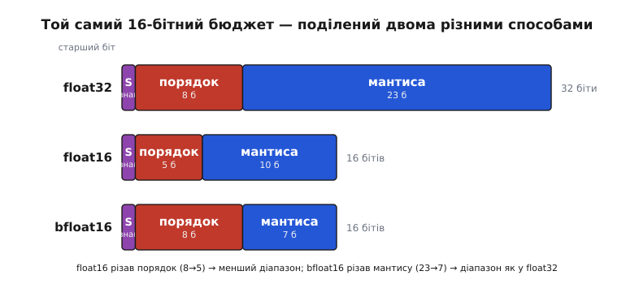
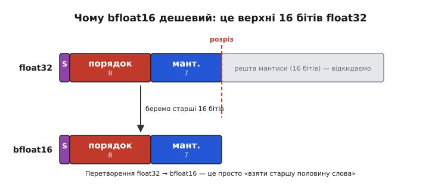
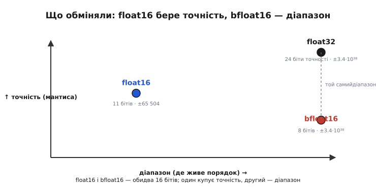

# Напівточність: float16 і bfloat16

Звична дробова змінна в C — це `float`, тридцять два біти. [Плаваюча кома](topic:hw-arch/floating-point) розкладає їх на три поля: знак, порядок (куди зсунута кома) і мантису (значущі цифри). Тридцять два біти дають ~7 десяткових цифр точності й діапазон від ~10⁻³⁸ до ~10³⁸ — з запасом на майже будь-яку інженерну задачу. Але буває, що цей запас непотрібний, а от самих бітів шкода: їх треба зберігати в пам'яті, ганяти шиною, множити в залізі. Тоді виникає спокуса взяти **менше** бітів — половину, шістнадцять — і назвати це **напівточністю** (*half precision*). Питання лише одне, і воно виявиться напрочуд цікавим: **як саме поділити ці шістнадцять бітів** між порядком і мантисою. Відповідей історично дві, і вони протилежні.

> 📜 Напівточність народилася не в машинному навчанні, як часто думають, а в комп'ютерній графіці кінця 1990-х — щоб економно зберігати яскравість пікселів із широким динамічним діапазоном. Аж потім її стандартизували в IEEE 754, а ще пізніше Google винайшов її суперника — bfloat16. Цей шлях від текстур до нейромереж — у вставці [Звідки взялася напівточність](topic:hw-arch/half-precision/hist-half-precision.md).

### Навіщо різати точність навпіл

Спершу — чому взагалі хочеться менших чисел, адже точність зазвичай благо. Причин рівно три, і всі три — про **вартість бітів**, а не про математику.

Перша — **пам'ять**. Дробове число у float32 займає 4 байти. Якщо треба зберегти мільйон коефіцієнтів (ваги нейромережі, таблиця відліків давача, буфер зображення), це вже 4 мегабайти. Ті самі дані в напівточності — 2 мегабайти. На мікроконтролері, де всієї RAM буває 512 кілобайт, різниця між «влізло» і «не влізло» — це саме такий множник два.

Друга — **пропускна здатність**. Числа не лежать нерухомо: їх читають із пам'яті, женуть шиною, вантажать у регістри. Вузьке місце сучасних обчислень — часто не сам рахунок, а **доставка даних** до арифметики. Удвічі вужче число — удвічі менше байтів крізь ту саму шину за той самий час, тобто вдвічі вищий темп подачі.

Третя — **швидкість самої арифметики**. Помножити два 16-бітні числа дешевше, ніж два 32-бітні: менший множник у залізі, менше транзисторів, менше енергії на операцію. А якщо процесор уміє **пакувати** кілька дрібних чисел в один широкий регістр і рахувати їх разом (векторно), то за один такт він обробить удвічі більше 16-бітних чисел, ніж 32-бітних.

> 🔧 **Навіщо це.** Ці три вигоди — не абстракція, а те, чому напівточність узагалі існує в залізі. Коли ви бачите, що модель машинного навчання «квантують» до 16 бітів або що давач віддає дані як float16, — за цим стоїть саме розрахунок: удвічі менше пам'яті, удвічі щільніший потік шиною, удвічі більше чисел за такт. Ціну — втрачену точність — платять свідомо, бо в цих задачах вона не потрібна. Головне вміння тут: **розпізнати, коли задача терпить грубі числа, а коли ні**, бо та сама економія, що рятує нейромережу, зруйнує фінансовий розрахунок чи навігаційне числення.

Але тут і криється пастка. Шістнадцять бітів — це справді мало, і сховати в них увесь розмах float32 неможливо. Щось доведеться пожертвувати. **Що саме** — і є суть двох різних форматів.

### Один бюджет, два способи витратити

У будь-якому дробовому форматі є фундаментальний торг: **порядок** дає діапазон (наскільки великі й малі числа можна виразити), **мантиса** дає точність (скільки значущих цифр). Загальна кількість бітів фіксована, тож розширити одне поле можна лише за рахунок іншого. У float32 цей торг вирішено як 8 бітів порядку та 23 біти мантиси. У шістнадцяти бітах його доводиться перерозв'язувати заново — і тут дороги розходяться.


*float32 (32 біти) ділить поля як 1 + 8 + 23. Скорочуючи до 16 бітів, можна піти двома шляхами. **float16** ріже переважно порядок (8 → 5) і трохи мантису (23 → 10): точність тримається пристойно, але діапазон стискається. **bfloat16** робить навпаки — лишає всі 8 бітів порядку, а мантису тне безжально (23 → 7): діапазон точно як у float32, але значущих цифр лишається зовсім мало. Один формат бореться за точність, другий — за діапазон.*

Ось ключ до всієї теми. **float16** (він же **IEEE 754 binary16**, «половинний двійковий») — це чесна мініатюра float32: 1 біт знаку, 5 бітів порядку, 10 бітів мантиси. Його зробили так, щоб точність не завалилася нижче розумного, і заплатили за це діапазоном. **bfloat16** («*brain floating point*» — «мозкова плаваюча кома», названа на честь дослідницької групи Google Brain) обрала протилежне: 1 біт знаку, **8** бітів порядку — стільки ж, як у float32, — і лише 7 бітів мантиси. Той самий розмір, шістнадцять бітів, — але зовсім інший компроміс.

### float16: точна мініатюра

Розберімо float16 через числа, бо саме вони показують, де він сильний, а де ламається. П'ять бітів порядку зберігаються зі **зсувом** 15 (щоб виразити й додатні, і від'ємні степені; зсув для формату — це 2^(бітів_порядку−1)−1, тут 2⁴−1 = 15). Формула значення та сама, що у великого float:

```
значення = (−1)^знак × 1.мантиса × 2^(порядок − 15)
```

Десять бітів мантиси плюс неявна старша одиниця дають 11 бітів значущості, а це:

```
log₁₀(2¹¹) = log₁₀(2048) ≈ 3.3 десяткової цифри
```

Трохи більше трьох значущих цифр. Діапазон же виходить куди скромніший за float32:

```
найбільше скінченне:   65 504          (≈ 6.55 × 10⁴)
найменше нормальне:    2⁻¹⁴ ≈ 6.10 × 10⁻⁵
найменше денормальне:  2⁻²⁴ ≈ 5.96 × 10⁻⁸
```

І ось перша серйозна пастка, з якою стикається кожен, хто бере float16 наївно: **стеля на 65 504**. У float32 число 100 000 — дрібниця. У float16 воно **не існує**: усе, що більше за 65 504, округлюється до нескінченності (∞). Порахували суму, лічильник, добуток — і мовчки отримали ∞ там, де чекали велике, але скінченне число. Так само знизу: значення, менші за ~6×10⁻⁸, стають нулем (це зветься **зникненням до нуля**, *underflow*).

**Умова:** показати, як велике й мале число «випадають» за межі float16 (типи `_Float16` підтримують сучасні GCC/Clang на ARM).

:::tabs
```c
#include <stdio.h>

int main(void) {
    _Float16 big = 70000.0f16;    // більше за стелю 65504
    _Float16 tiny = 1e-8f16;      // менше за найменше денормальне

    printf("%f\n", (float)big);   // inf   ← переповнення до нескінченності
    printf("%f\n", (float)tiny);  // 0.000000  ← зникло до нуля
    return 0;
}
```
```python
import numpy as np

big = np.float16(70000.0)   # більше за стелю 65504
tiny = np.float16(1e-8)     # менше за найменше денормальне

print(float(big))   # inf   ← переповнення до нескінченності
print(float(tiny))  # 0.0   ← зникло до нуля
```
:::

Число 70 000 не влізло під стелю й стало ∞; 10⁻⁸ провалилося під підлогу й стало 0. Обидва — тихо, без жодної помилки. Тому float16 не можна давати абищо: перед тим, як звузити тип, треба **знати межі своїх даних** і бути певним, що вони вкладаються в ±65 504 і не занадто малі.

Де float16 доречний — там, де числа природно нормовані у вузький діапазон і трьох цифр точності досить: канали кольору в графіці (яскравість пікселя), виходи давачів, ваги нейромережі **під час висновку** (коли модель уже навчена й лишається її запустити). Саме для таких задач його й стандартизували в IEEE 754.

### bfloat16: діапазон дорожчий за точність

Тепер найцікавіше — чому взагалі хтось захотів формат із **сімома** бітами мантиси, тобто ще грубіший за float16. Сім бітів плюс неявна одиниця — це 8 бітів значущості:

```
log₁₀(2⁸) = log₁₀(256) ≈ 2.4 десяткової цифри
```

Менше двох з половиною значущих цифр — зовсім грубо. Число 1.001 і 1.002 у bfloat16 злипнуться в одне. Здавалося б, навіщо таке? Відповідь — у другому полі. Вісім бітів порядку зі зсувом 127 дають **точно той самий діапазон, що float32**:

```
найбільше скінченне:  ≈ 3.4 × 10³⁸
найменше нормальне:   ≈ 1.18 × 10⁻³⁸
```

Тобто bfloat16 покриває всі ті самі порядки величин, що звичайний float, — від крихітного до астрономічного, — просто грубо. І тут з'ясовується неочевидне: для великого класу задач це **правильний** обмін. Автори bfloat16 виходили з простого спостереження про нейромережі: їхнє навчання набагато чутливіше до **діапазону** чисел, ніж до їхньої точності. Значення в мережі під час навчання (градієнти) бувають то дуже великі, то дуже малі — і якщо вони не влізуть у діапазон, розрахунок зруйнується (∞ або 0, як ми щойно бачили у float16). А от кілька відкинутих молодших цифр мантиси мережа переживає легко: наступні кроки навчання самі згладять дрібну похибку. Отже, для навчання діапазон критичний, а точність — ні. bfloat16 віддає геть усе на діапазон — і виграє саме там, де float16 із його стелею 65 504 небезпечний.

Є й друга причина, суто інженерна й дуже елегантна.


*Оскільки bfloat16 має ту саму будову порядку (8 бітів, зсув 127) і знак, що float32, він дослівно збігається зі **старшою половиною** 32-бітного числа. Перетворити float32 → bfloat16 — це просто відкинути молодші 16 бітів мантиси (з невеликим округленням). Назад — дописати 16 нулів. Жодного перерахунку порядку, жодного зсуву коми: конвертація майже безкоштовна. У float16 так не вийде — там порядок інакший (5 бітів проти 8), тож перетворення потребує справжнього перепакування.*

Ось чому bfloat16 такий привабливий для заліза: він **сумісний із float32 за структурою**. Числа можна тримати й лічити у bfloat16, а коли треба точніше — тривіально розширити до float32, дописавши нулі, без жодної складної логіки. float16 цієї розкоші не має: його порядок вужчий, тож кожне перетворення в обидва боки — це повноцінне перекладання полів.

**Умова:** показати, що перетворення float32 → bfloat16 — це буквально «взяти старші два байти» (грубе відкидання, без округлення — для наочності).

:::tabs
```c
#include <stdint.h>
#include <string.h>

// Грубе (truncating) перетворення float32 → bfloat16.
// bfloat16 = старші 16 бітів бітового образу float.
uint16_t float_to_bf16_truncate(float x) {
    uint32_t bits;
    memcpy(&bits, &x, sizeof bits);   // безпечно дістати біти float
    return (uint16_t)(bits >> 16);    // просто верхня половина слова
}

float bf16_to_float(uint16_t b) {
    uint32_t bits = (uint32_t)b << 16;   // дописати 16 молодших нулів
    float x;
    memcpy(&x, &bits, sizeof x);
    return x;
}
```
```python
import struct

# Грубе (truncating) перетворення float32 → bfloat16.
# bfloat16 = старші 16 бітів бітового образу float.
def float_to_bf16_truncate(x):
    bits = struct.unpack("<I", struct.pack("<f", x))[0]  # дістати біти float
    return bits >> 16                                    # просто верхня половина слова

def bf16_to_float(b):
    bits = b << 16                                       # дописати 16 молодших нулів
    return struct.unpack("<f", struct.pack("<I", bits))[0]
```
:::

Уся конвертація в один бік — один зсув. Порівняйте це з тим, скільки роботи потребує float16 (інший порядок, інша ширина мантиси), — і стане зрозуміло, чому виробники заліза для машинного навчання полюбили саме bfloat16. Щоправда, чесне перетворення додає ще й **округлення** останнього біта замість грубого відкидання (інакше похибка систематично зміщена вниз) — і саме там ховаються всі тонкощі. Повний код в обидва боки, з коректним округленням, обробкою ∞/NaN і денормалей, — у вставці [Перетворення float16 і bfloat16 у C](topic:hw-arch/half-precision/proj-half-precision-convert.md).

### Обидва в одній картині

Тепер, коли зрозумілі обидва формати, корисно побачити їх поряд — як три точки в координатах «діапазон проти точності».


*float32 — верхній правий кут: і широкий діапазон, і висока точність, ціною 32 бітів. Обидва 16-бітні формати мусять чимось пожертвувати. **float16** просів у діапазоні (стеля 65 504), але тримає ~3.3 цифри точності. **bfloat16** просів у точності (~2.4 цифри), зате його діапазон дотягується до float32. Вони не кращий і гірший — вони про **різні задачі**: float16 туди, де числа малі й потрібна точність (графіка, висновок мережі); bfloat16 туди, де числа гуляють у широкому діапазоні, а точність другорядна (навчання мережі).*

Звідси — просте правило вибору. Якщо ваші числа лежать у вузькому, добре відомому діапазоні (нормовані, від нуля до одиниці, як кольори чи ймовірності) і вам важлива кожна значуща цифра — беріть **float16**. Якщо числа непередбачувані за масштабом, бувають то великі, то малі, а зайва точність не критична — беріть **bfloat16**, і бонусом отримаєте дешеву сумісність із float32.

### Що з цим на мікроконтролері

Тут важливе застереження, бо контекст цієї книги — прошивки, а не сервери. Апаратна підтримка напівточності — далеко не всюди. Її мають графічні прискорювачі, серверні процесори з векторними розширеннями, спеціалізовані нейропроцесори. У світі мікроконтролерів вона рідкісна: більшість ядер Cortex-M мають [FPU](topic:hw-arch/fpu) лише одинарної точності (float32) або не мають зовсім, і про апаратний float16/bfloat16 там не йдеться. Окремі новіші ядра (наприклад, з розширеннями для машинного навчання на краю мережі) додають підтримку, але це виняток, а не норма.

Що це означає на практиці. Якщо ви на МК оголосите `_Float16`, а залізо його не вміє, компілятор **не** відмовить — він мовчки згенерує **емуляцію**: кожна операція над float16 перетвориться на розширення до float32, обчислення в звичайному FPU й звуження назад. Це навіть **повільніше** за прямий float32, бо додає перетворення туди-сюди. Тобто напівточність на МК має сенс переважно як **формат зберігання**, а не обчислення: тримати дані компактно у 16 бітах (економлячи дорогу RAM і Flash), а перед самим розрахунком розгортати у float32.

**Умова:** типовий корисний патерн на МК — компактна таблиця у float16 у Flash, обчислення у float32.

```c
#include <stdint.h>

// Таблиця калібрування давача: 256 точок.
// У float32 — 1024 байти; у float16 — 512 байтів (удвічі менше Flash).
extern const _Float16 calib_table[256];   // лежить у Flash як 16-бітні числа

float lookup_calibrated(uint8_t index) {
    // Читаємо 16-бітне значення, рахуємо у float32:
    return (float)calib_table[index] * 1.001f + 0.5f;
}
```

Таблиця вдвічі менша у Flash (важливо, коли пам'ять на межі), а конкретне обчислення йде у звичному float32 через наявний FPU — без повільної емуляції 16-бітної арифметики. Виграш у пам'яті ми беремо, ціну повільних 16-бітних операцій — оминаємо. Це і є типове, тверезе застосування напівточності поза великими прискорювачами.

> 🔧 **Навіщо це.** Три речі варто винести про напівточність у реальній розробці. Перше: це **два різні формати з протилежним компромісом** — float16 жертвує діапазоном заради точності (стеля 65 504, бережіться переповнення до ∞), bfloat16 жертвує точністю заради діапазону (як float32, зате ~2.4 цифри). Плутати їх не можна: те, що безпечно в одному, ламається в іншому. Друге: обидва мають сенс лише там, де **бітів справді шкода** — велика пам'ять, вузька шина, масові однотипні множення (машинне навчання, графіка); для звичайних інженерних розрахунків беріть float32, а для грошей і точних дробів — [цілі одиниці](topic:hw-arch/fixed-point). Третє, специфічне для МК: апаратної підтримки 16-бітної арифметики зазвичай **немає**, тож `_Float16` там або емулюється (повільніше за float32), або корисний лише як **компактний формат зберігання** — дані у 16 бітах, рахунок у float32.

---

**Напівточність** — це 16-бітна [плаваюча кома](topic:hw-arch/floating-point), удвічі вужча за звичайний float32. Її беруть, коли важить не математика, а **вартість бітів**: удвічі менше пам'яті, удвічі щільніший потік шиною, удвічі більше чисел за такт (машинне навчання, графіка, компактні таблиці). Шістнадцять бітів замало, щоб зберегти весь float32, тож щось жертвують — і роблять це двома протилежними способами. **float16** (IEEE 754 binary16, 1+5+10, зсув 15) ріже діапазон (стеля 65 504, легко переповнюється до ∞), але тримає ~3.3 значущої цифри — годиться, де числа малі й потрібна точність. **bfloat16** (Google Brain, 1+8+7, зсув 127) навпаки: лишає всі 8 бітів порядку, тож діапазон точно як у float32 (~10³⁸), а мантису тне до ~2.4 цифри — годиться, де числа гуляють у широкому масштабі, а точність другорядна; бонус — bfloat16 є дослівно старшою половиною float32, тож конвертація майже безкоштовна. На мікроконтролерах апаратної 16-бітної арифметики зазвичай немає ([FPU](topic:hw-arch/fpu) там одинарної точності), тож напівточність там — переважно **формат зберігання**: дані компактно у 16 бітах, обчислення у float32.
