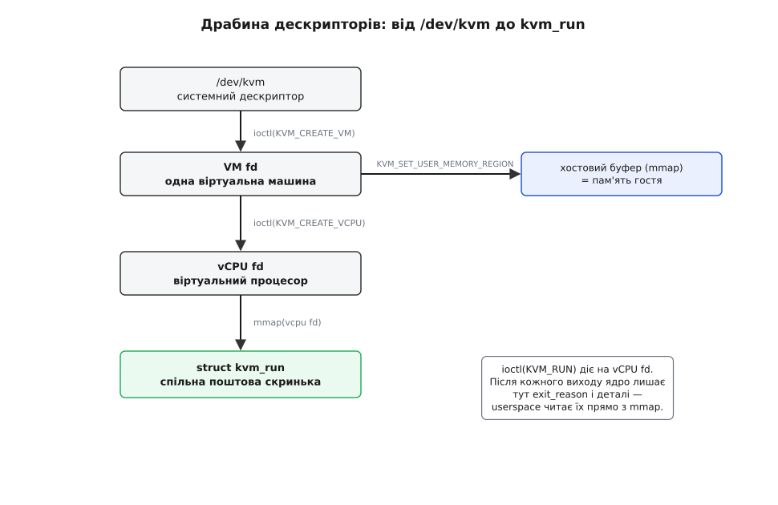
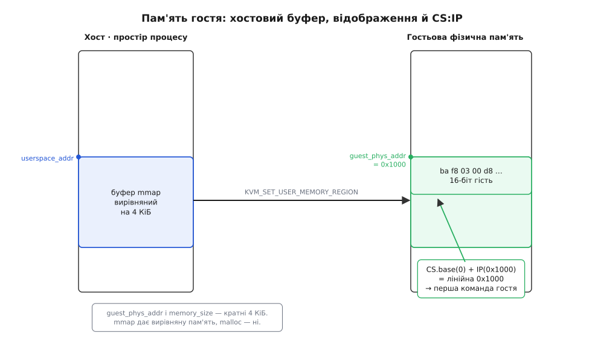

# ⚙️ proj: мінімальний гіпервізор на KVM

**Задача.** Написати найменший гіпервізор, який *справді* запускає гостя. Не емулятор, не покомандний інтерпретатор — а справжню машину, чий код виконує залізо на повній швидкості, поки ми лише стоїмо над нею й ловимо ті миті, коли вона проситься назовні. Гість буде крихітний: дюжина байтів 16-бітного коду, що додає два числа й «друкує» відповідь. Та кожна несуча цеглина дорослого гіпервізора вже тут — виділити пам'ять гостя, посадити його в реальний режим, крутити цикл, у якому машина то біжить сама, то повертає нам керування. Хмара з мільйонами віртуальних серверів — це та сама конструкція, тільки розрослася.

Робимо це через **KVM** (англ. *Kernel-based Virtual Machine*) — підсистему ядра Linux, що відкриває апаратну віртуалізацію звичайній програмі. Її 2006 року почав в ізраїльському стартапі Qumranet інженер Аві Ківіті (Avi Kivity); у лютому 2007-го код влили в ядро версії 2.6.20, а 2008-го Red Hat купила Qumranet за 107 мільйонів доларів. Відтоді KVM — стандартний спосіб віртуалізувати Linux (це підтверджений факт: анонс у списку розсилки ядра 19 жовтня 2006-го, злиття в 2.6.20).

## Ідея: ядро дає механізм, ви пишете політику

Ключ до всього інтерфейсу — один поділ праці. Небезпечну частину (перемикання в non-root, перехоплення виходів, керування VMCS) робить ядро разом із залізом: тільки воно має право торкатися цих регістрів. А *політику* — скільки дати пам'яті, що робити на кожен вихід, як удавати пристрої — пише звичайна програма в режимі користувача. KVM саме цей шов і матеріалізує: ядро тримає механізм, ваш процес тримає рішення.

Спілкуються вони так, як у Unix прийнято спілкуватися з драйвером, — через **файлові дескриптори** й `ioctl`. Дескриптор — це просто ціле число, «ручка» до чогось у ядрі; `ioctl(fd, КОМАНДА, аргумент)` шле цій ручці команду поза звичним читанням-писанням. Дескрипторів рівно три, вкладені один в одного, як матрьошки:

- `/dev/kvm` — **системна** ручка до самої підсистеми. З неї питаєш версію інтерфейсу й нею ж просиш створити машину.
- **VM fd** — одна віртуальна машина. Їй кажеш, де взяти пам'ять і скільки завести процесорів.
- **vCPU fd** — один віртуальний процесор. Оце й є та ручка, яку ти в циклі смикаєш командою `KVM_RUN`, щоб гість зробив крок.

І остання деталь, без якої цикл був би повільним: щоб ядро не копіювало стан гостя туди-сюди на кожному виході, vCPU-дескриптор `mmap`-иться в пам'ять твого процесу. `mmap` тут — це прохання «поклади мені цей об'єкт ядра прямо в мій адресний простір». Так з'являється спільна структура `struct kvm_run` — **поштова скринька**: ядро лишає в ній причину виходу, ти читаєш її звичайним розіменуванням вказівника, без жодного системного виклику.

> 🔧 **Навіщо це.** Поділ «механізм у ядрі, політика в userspace» — причина, чому поверх однієї підсистеми KVM живуть геть різні гіпервізори: важкий QEMU для повних машин, легкий Firecracker для мікровіртуалок під безсерверні функції, crosvm у ChromeOS. Усі вони — звичайні програми, що смикають ті самі три `ioctl`; ядро дає їм безпечний доступ до апаратної віртуалізації, а якою вийде машина — кожна вирішує сама. Тому «написати свій гіпервізор» — це не переписати ядро, а саме те, що ви робите на цій сторінці.



*Три вкладені ручки. Кожен `ioctl` б'є у свій рівень: створення машини — у `/dev/kvm`, пам'ять і процесори — у VM fd, а сам крок гостя — у vCPU fd. `kvm_run` спільна для ядра й нас — тому читати вихід нічого не коштує.*

## Робочий код

Далі — одна програма мовою C, розкладена на сім кроків. Вони читаються підряд і збираються в один `main()`; наприкінці — команда збірки. Мова тут не обговорюється: це системний код проти ядерного інтерфейсу й регістрів x86 — його пишуть на C, будь-яка «зручніша» мова тут лише обгортка над тими самими `ioctl`.

Заголовки й відкриття підсистеми:

```c
#include <stdio.h>
#include <stdlib.h>
#include <stdint.h>
#include <string.h>
#include <fcntl.h>
#include <unistd.h>
#include <sys/ioctl.h>
#include <sys/mman.h>
#include <linux/kvm.h>

int main(void)
{
    /* 1. Відкрити пристрій KVM і звірити версію інтерфейсу. */
    int kvm = open("/dev/kvm", O_RDWR | O_CLOEXEC);
    if (kvm < 0) { perror("open /dev/kvm"); return 1; }

    if (ioctl(kvm, KVM_GET_API_VERSION, 0) != 12) {
        fprintf(stderr, "чужа версія KVM API\n"); return 1;
    }
```

Версію звіряємо не з педантизму. `KVM_GET_API_VERSION` стабільно повертає **12** уже півтора десятиліття; якщо колись повернеться інше — структури нижче можуть мати інший розклад полів, і мовчазна робота з чужим ABI гірша за чесну відмову.

```c
    /* 2. Створити порожню віртуальну машину. */
    int vmfd = ioctl(kvm, KVM_CREATE_VM, 0);
    if (vmfd < 0) { perror("KVM_CREATE_VM"); return 1; }
```

Аргумент `0` — тип машини (на x86 інших і немає). У відповідь дістаємо VM fd — поки що машину без пам'яті й без процесорів, порожній корпус.

```c
    /* 3. Виділити пам'ять гостя й віддати її машині. */
    const size_t mem_size = 0x1000;              /* одна сторінка, 4 КіБ */
    void *mem = mmap(NULL, mem_size, PROT_READ | PROT_WRITE,
                     MAP_SHARED | MAP_ANONYMOUS, -1, 0);
    if (mem == MAP_FAILED) { perror("mmap пам'ять гостя"); return 1; }

    struct kvm_userspace_memory_region region = {
        .slot            = 0,
        .guest_phys_addr = 0x1000,     /* якою її бачить «фізично» гість */
        .memory_size     = mem_size,
        .userspace_addr  = (uint64_t)mem,  /* де вона насправді в нас */
    };
    if (ioctl(vmfd, KVM_SET_USER_MEMORY_REGION, &region) < 0) {
        perror("KVM_SET_USER_MEMORY_REGION"); return 1;
    }
```

Тут відбувається головна ілюзія віртуалізації пам'яті, і варто затриматися. «Оперативка» гостя — це просто шматок пам'яті *нашого* процесу, який ми виділили через `mmap`. Ми кажемо ядру: байти, що фізично лежать за адресою `userspace_addr` у нас, гість нехай бачить за своєю «фізичною» адресою `guest_phys_addr`. Ці два світи адрес — незалежні. Для гостя `0x1000` — початок його оперативної пам'яті; для нас це десь у купі власного процесу. Апаратура (вкладені таблиці сторінок) перекладе одне в одне без нашої участі. Це той самий фокус, що й [віртуальна пам'ять](topic:hw-arch/virtual-memory) для звичайних програм, тільки поверхом нижче: там процес бачить «свої» адреси замість фізичних, тут — цілий гість бачить «свою фізичну» пам'ять замість справжньої.

Чому саме `mmap`, а не звичний `malloc`? Бо `guest_phys_addr` і `memory_size` мусять бути **кратні розміру сторінки** (4 КіБ). `mmap` завжди повертає пам'ять, вирівняну на сторінку; `malloc` — ні, і `KVM_SET_USER_MEMORY_REGION` відкине невирівняне вікно з `EINVAL`. Це не примха KVM: апаратний блок трансляції адрес оперує сторінками, і вікно пам'яті гостя має лягати рівно по їхніх межах. Докладніше про те, чому залізо взагалі вимагає такого вирівнювання, — у [вирівнюванні пам'яті](topic:sf-apps/memory-alignment).



*Ліворуч — вирівняний буфер у нашому процесі, праворуч — як його бачить гість. Одні й ті самі байти, дві системи адрес. Стрілка знизу — куди впаде `CS.base + IP` після налаштування регістрів.*

```c
    /* 4. Завантажити крихітного 16-бітного гостя в цю пам'ять. */
    const unsigned char guest[] = {
        0xba, 0xf8, 0x03,   /* mov dx, 0x3f8   ; dx = порт COM1 */
        0x00, 0xd8,         /* add al, bl      ; al = al + bl */
        0x04, '0',          /* add al, '0'     ; число → цифра ASCII */
        0xee,               /* out dx, al      ; байт al у порт dx */
        0xb0, '\n',         /* mov al, 0x0a */
        0xee,               /* out dx, al */
        0xf4,               /* hlt             ; спинися */
    };
    memcpy(mem, guest, sizeof(guest));
```

Ось увесь наш гість — дванадцять байтів справжнього машинного коду x86, які ми просто копіюємо в початок його пам'яті. Логіка проста: покласти в `dx` номер порту `0x3f8` (це COM1, послідовний порт — класичний спосіб «щось надрукувати» без екрана й драйверів), додати `bl` до `al`, перетворити суму на ASCII-цифру, виштовхнути її в порт командою `out`, потім так само вивести символ нового рядка й спинитися командою `hlt`. Числа `al` і `bl` ми зараз зарядимо ззовні.

```c
    /* 5. Створити віртуальний процесор і відобразити його поштову скриньку. */
    int vcpufd = ioctl(vmfd, KVM_CREATE_VCPU, 0);
    if (vcpufd < 0) { perror("KVM_CREATE_VCPU"); return 1; }

    int run_size = ioctl(kvm, KVM_GET_VCPU_MMAP_SIZE, 0);
    struct kvm_run *run = mmap(NULL, run_size, PROT_READ | PROT_WRITE,
                               MAP_SHARED, vcpufd, 0);
    if (run == MAP_FAILED) { perror("mmap kvm_run"); return 1; }
```

Розмір скриньки не зашитий у заголовках — його треба спитати через `KVM_GET_VCPU_MMAP_SIZE`, бо він залежить від версії ядра. `MAP_SHARED` тут обов'язковий (не `MAP_PRIVATE`): нам потрібна *та сама* сторінка, що й у ядра, а не приватна копія, — інакше ми читали б застиглий знімок і ніколи не бачили нових причин виходу.

```c
    /* 6. Налаштувати реальний режим: сегменти й лічильник команд. */
    struct kvm_sregs sregs;
    ioctl(vcpufd, KVM_GET_SREGS, &sregs);
    sregs.cs.base     = 0;       /* база сегмента коду */
    sregs.cs.selector = 0;       /* селектор — узгоджений із базою */
    ioctl(vcpufd, KVM_SET_SREGS, &sregs);

    struct kvm_regs regs = {
        .rip    = 0x1000,    /* CS.base(0) + IP(0x1000) = фізична 0x1000 */
        .rax    = 2,         /* al = 2 */
        .rbx    = 2,         /* bl = 2 */
        .rflags = 0x2,       /* біт 1 завжди 1 — інакше стан недійсний */
    };
    ioctl(vcpufd, KVM_SET_REGS, &regs);
```

Свіжий vCPU прокидається в стані процесора після скидання, а нам треба посадити його акурат туди, де лежить наш код. У 16-бітному **реальному режимі** адреса команди рахується не таблицями сторінок, а простим складанням сегмента й зсуву:

```
лінійна адреса = CS.base + IP
               = 0 + 0x1000
               = 0x1000        ← початок буфера, куди ми поклали гостя
```

Ми беремо поточні сегменти через `KVM_GET_SREGS`, обнуляємо базу й селектор сегмента коду `cs`, ставимо `IP` (тобто `rip`) на `0x1000` — і лінійна адреса точно збігається з `guest_phys_addr`, куди лягли байти. Регістри `rax`/`rbx` заряджаємо двійками — це ті числа, що гість додасть.

Тонкий момент із `rflags`: біт 1 у прапорцях x86 — зарезервований і **завжди одиниця**. Якщо лишити `rflags = 0`, апаратура вважатиме стан гостя недійсним і `KVM_RUN` одразу впаде. Дрібниця на один біт, а машина не стартує.

```c
    /* 7. Головний цикл: увійти в гостя — розібрати вихід — знову. */
    for (;;) {
        ioctl(vcpufd, KVM_RUN, 0);

        switch (run->exit_reason) {
        case KVM_EXIT_IO:
            if (run->io.direction == KVM_EXIT_IO_OUT &&
                run->io.port == 0x3f8) {
                char *data = (char *)run + run->io.data_offset;
                for (uint32_t i = 0; i < run->io.count; i++)
                    putchar(data[i * run->io.size]);
            }
            break;

        case KVM_EXIT_HLT:
            puts("\n[гість спинився — HLT]");
            return 0;

        default:
            fprintf(stderr, "нежданий вихід: %u\n", run->exit_reason);
            return 1;
        }
    }
}
```

## Пульс: вхід → біжить гість → вихід → обробка → знову

Сьомий крок — серце всього. Розберімо один оберт по тактах.

**Вхід.** `ioctl(vcpufd, KVM_RUN, 0)` — це не звичайний виклик, що швидко повертається. Керування йде в ядро, ядро робить **VM entry**, залізо перемикається в non-root — і наш процес *завмирає* на цьому рядку. З цієї миті на процесорі біжить гість, команда за командою, на повній апаратній швидкості. Наша програма не «крутить» гостя в циклі інтерпретації — вона просто чекає, поки залізо саме не впреться в щось, що потребує нас.

**Біжить.** Гість виконує `add al, bl`, `add al, '0'` — це безневинні команди, вони не спричиняють виходу, залізо їх просто робить. А от `out dx, al` — запис у порт вводу-виводу; торкатися справжніх портів гостю не можна, тож апаратура робить **VM exit**.

**Вихід.** Залізо зберігає весь стан гостя у VMCS, вертає керування ядру, ядро заповнює нашу скриньку `kvm_run` і повертає `ioctl` — той самий рядок нарешті «віддає» керування. Тепер `run->exit_reason` каже, *чому* нас покликали: `KVM_EXIT_IO`. Поля `run->io` уточнюють: напрямок `OUT`, порт `0x3f8`, розмір байт, `count` штук, а самі дані — за зсувом `data_offset` від початку структури (не окремий буфер, а те саме спільне вікно).

**Обробка.** Ми впізнаємо свій порт `0x3f8`, дістаємо байт за `data_offset` і робимо `putchar` — байт гостя стає символом на нашому терміналі. Оце й уся «емуляція» послідовного порту: гість думає, що писав у залізо, а писав нам у скриньку.

**Знову.** `switch` завершився, `for(;;)` заводить нас на новий `KVM_RUN`. Гість продовжує рівно з наступної команди — другий `out` (новий рядок), знову вихід, знову ми друкуємо. Потім `hlt`: вихід із причиною `KVM_EXIT_HLT`, ми виходимо з циклу. Це і є той цикл, за дешевизну кожного оберту якого б'ється кожне нове покоління заліза.

Порахуймо, що надрукується. `al` стартував двійкою, гість додав `bl`:

```
al = 2  +  bl(2)   = 4
al = 4  +  '0'(48) = 52  = ASCII '4'
```

## Збірка й прогін

Одна залежність — заголовки ядра Linux (пакет `linux-headers`); більш нічого:

```
$ cc -O2 -Wall -o mini-kvm mini-kvm.c
$ ./mini-kvm
4
[гість спинився — HLT]
```

Три рядки коду в гостя, а перед вами — повний життєвий цикл віртуальної машини: її створили, дали пам'ять і процесор, посадили в потрібне місце, покрутили в циклі вхід-вихід і чисто спинили. Усе, що робить справжній гіпервізор на кшталт QEMU, — це той самий кістяк, тільки замість дюжини байтів гостя туди вантажать ядро Linux, замість одного порту емулюють десятки пристроїв, а замість одного `switch` — величезний диспетчер причин виходу.

## Складність і пастки

Найдорожче в цьому коді — не рядки, а мовчазні вимоги, які легко порушити й довго ловити.

**Вирівнювання пам'яті.** Найчастіша перша помилка. Виділити пам'ять гостя через `malloc` — і `KVM_SET_USER_MEMORY_REGION` падає з `EINVAL`, бо вказівник не кратний сторінці. Пам'ять гостя завжди беруть через `mmap` (або `posix_memalign` на 4096). Так само `memory_size` мусить бути кратний 4 КіБ — не `0xFFF`, а `0x1000`.

**CS:IP.** Друга класична пастка, і хитра. Адресу першої команди в реальному режимі дає **база** сегмента `cs.base`, а не селектор. Спокуса виставити `cs.selector = 0x100` (думаючи «сегмент 0x100 → адреса 0x1000») не спрацює: апаратура для генерації адрес бере кешовану базу `cs.base`, і поки ви її не записали через `KVM_SET_SREGS`, вона лишиться тією, що дісталася від скидання (`0xFFFF0000` — гість полетить у нікуди). Правило просте: явно виставляй `cs.base` і став `IP` так, щоб `cs.base + IP` дорівнювало `guest_phys_addr` твого коду.

**Прапорці.** `rflags` із нульовим зарезервованим бітом 1 — і `KVM_RUN` відмовляє ще до першої команди. Найдешевша можлива помилка з найзагадковішим симптомом.

**Скринька — спільна, не копія.** `mmap` структури `kvm_run` мусить бути `MAP_SHARED`. З `MAP_PRIVATE` ви отримаєте приватну копію-снапшот, у якій `exit_reason` ніколи не оновиться, — цикл зависне на першому ж виході, дивлячись у застиглі байти.

**Читати `exit_reason` щоразу.** Причина виходу дійсна лише *після* повернення `KVM_RUN` і саме для цього оберту. Кешувати вказівник на дані вводу-виводу між ітераціями не можна: `data_offset` відлічується від початку скриньки щоразу наново.

**Порти — це не пам'ять.** Наш гість писав у *порт* `0x3f8` командою `out` — це окремий адресний простір вводу-виводу x86, і саме він дає `KVM_EXIT_IO`. Якби гість натомість писав у якусь адресу неіснуючої пам'яті, ми дістали б іншу причину — `KVM_EXIT_MMIO`; це вже [пам'яте-відображений ввід-вивід](topic:hw-arch/memory-mapped-io), інша гілка `switch`. Дорослий гіпервізор обробляє обидві.

І межа задачі, щоб не переоцінити зроблене. Наш гіпервізор не має ні переривань, ні таймера, ні справжніх пристроїв — тільки послідовний порт і зупинку. Він не захищає *себе* від зловмисного гостя за межами того, що вже гарантує апаратура: помилка в *нашому* налаштуванні (криве вікно пам'яті, не той `IP`) не пробиває ізоляцію, а просто валить гостя або сам процес. Кроки звідси до справжньої машини відомі й кожен великий: завести віртуальний контролер переривань, під'єднати паравіртуальні пристрої (virtio) заради швидкого диску й мережі, дати гостю BIOS і завантажник — і замість дюжини байтів у пам'ять ляже ціла операційна система. Але цикл у її серці лишиться той самий, що ви щойно написали: увійшли, побіг гість, вийшов, розібрали причину — і знову.
