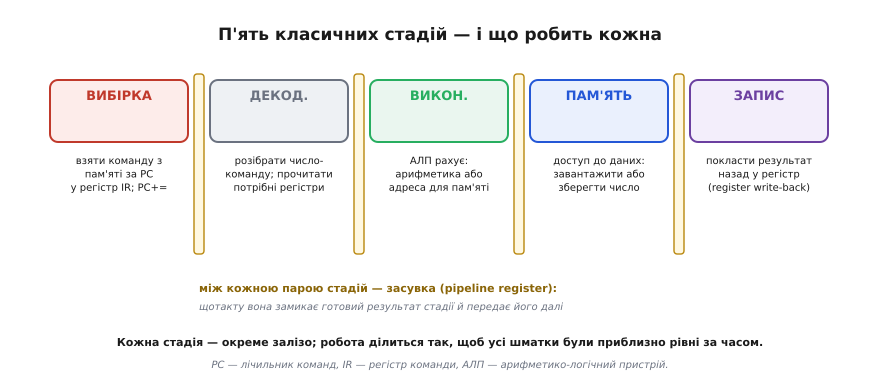
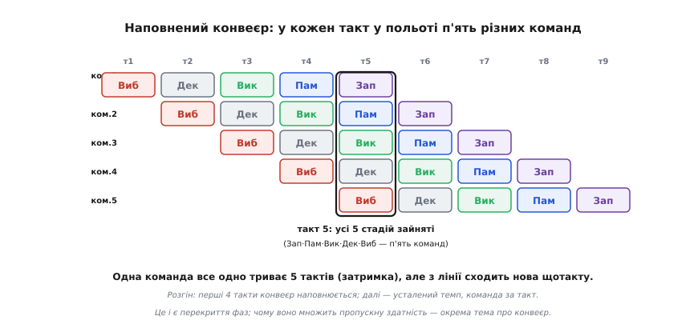
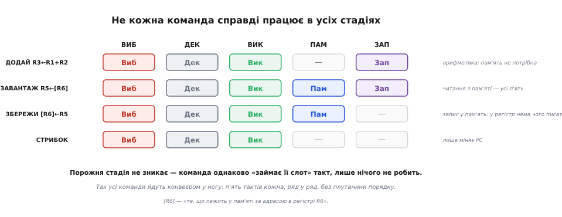
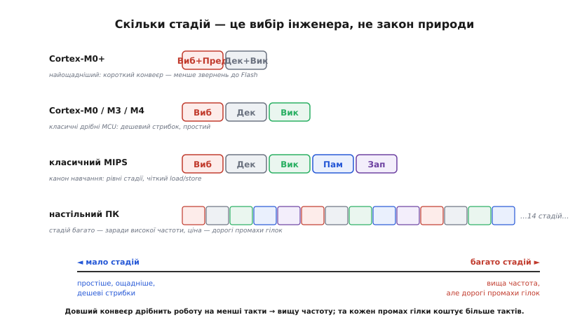

# Цикл виконання інструкції: стадії та конвеєр

Кожна команда, яку виконує процесор, проживає коротке життя: народжується в пам'яті, її звідти дістають, розуміють, роблять — і забувають, щоб узятися за наступну. У найпростішому погляді це [три фази — вибірка, декодування, виконання](topic:hw-arch/fetch-decode-execute): узяти команду за адресою з лічильника, розібрати, що вона значить, і зробити. Модель чудова, щоб зрозуміти саму ідею. Та коли доходить до реального заліза, «виконати» виявляється завеликим шматком, який ховає всередині ще кілька окремих справ — а від того, як тонко порізати це життя команди на **стадії**, залежить, наскільки швидко процесор працює.

Різати доводиться з дуже практичної причини. Якщо процесор робить одну команду цілком, від початку до кінця, перш ніж торкнутися наступної, то в кожну мить працює лише один вузол, а решта простоює. Це марнотратство лікують **конвеєром** — і щоб конвеєр запрацював, життя команди спершу треба поділити на рівні, самодостатні кроки, кожен зі своїм залізом. Тож питання «на які стадії ділиться команда» і питання «як влаштований конвеєр» — це те саме питання з двох боків. Розберімо стадії — і побачимо, як вони природно складаються в конвеєр.

## Чому «виконати» — це насправді кілька справ

Візьмімо просту команду читання з пам'яті: «завантаж у регістр R5 число, що лежить за адресою в R6». У трифазній моделі це все — одна фаза «виконання». Але придивімося, що всередині має статися **по черзі**, крок за кроком:

```
1. дістати саму команду з пам'яті (за адресою в PC)
2. зрозуміти: це "завантаж", джерело — адреса в R6, ціль — R5
3. порахувати адресу (тут — просто взяти R6; буває R6 + зсув)
4. сходити в пам'ять за цією адресою й дістати число
5. покласти дістане число в регістр R5
```

Кроки 4 і 5 — це вже дві різні справи: **звернення до пам'яті** й **запис у регістр**. Вони потребують різного заліза (порт пам'яті проти порту регістрового файлу) і не можуть статися одночасно — спершу треба мати число, тоді його класти. Схожа річ і з арифметикою: команда «додай R1 і R2, поклади в R3» рахує в АЛП (крок 3), а тоді кладе результат у регістр (крок 5) — знову дві окремі дії. Виходить, що чесний поділ життя команди — не три кроки, а **п'ять**.

Саме ці п'ять кроків і стали класичним каноном, який народився в проєктах перших [RISC-процесорів](root:embedded/risc-cisc) на межі 1970–80-х і закріпився в підручниках як **п'ятистадійний конвеєр**.

> 📜 Історія цього поділу — [звідки взялися саме ці п'ять стадій](topic:hw-arch/instruction-cycle-detail/hist-risc-pipeline.md). Наприкінці 1970-х групи в Стенфорді (проєкт MIPS Джона Геннессі) і Берклі (проєкт RISC Девіда Паттерсона) незалежно дійшли думки: якщо зробити всі команди простими й однаковими за формою, їх легко різати на рівні стадії й пускати конвеєром. Абревіатура MIPS і означала «мікропроцесор без блокувань стадій конвеєра». Ці двоє ж увели слово «затор» (hazard) для ситуацій, коли конвеєр дав би хибну відповідь.

## П'ять класичних стадій

Поділімо життя команди так, щоб кожен шматок робив одне діло й потребував свого окремого заліза. Виходить п'ять стадій; їхні звичні назви — англійські, бо звідти й прийшов канон.


*П'ять стадій і робота кожної. **Вибірка** (англ. *fetch*, «дістати»): узяти команду з пам'яті за адресою PC у регістр команд IR, PC зсунути на наступну. **Декодування** (англ. *decode*, «розкодувати»): розібрати число-команду й одразу прочитати з регістрів потрібні операнди. **Виконання** (англ. *execute*, «зробити»): АЛП рахує — або власне арифметику, або адресу для звернення до пам'яті. **Пам'ять** (англ. *memory access*): якщо команда читає чи пише дані — звернутися до пам'яті за порахованою адресою. **Запис** (англ. *write-back*, «записати назад»): покласти готовий результат назад у регістр. Між кожною парою стадій — засувка, що щотакту передає результат далі.*

Логіка поділу проста: **перші дві стадії готують, останні три діють**, і кожна межа проведена там, де змінюється тип роботи. Вибірка спілкується з пам'яттю команд. Декодування працює з регістровим файлом і логікою розбору. Виконання — це АЛП. Пам'ять — це порт даних. Запис — знову регістровий файл, але тепер на запис. Кожна стадія має **свій** вузол, тож п'ять стадій можуть працювати одночасно, кожна над своєю командою, не заважаючи одна одній.

Чому саме тут межі, а не деінде? Через **баланс**. Стадії ділять так, щоб кожна забирала приблизно однаковий час, бо весь конвеєр цокає під один спільний [такт](topic:hw-digital/clock-signal), і період такту дорівнює часу **найдовшої** стадії. Якби одна стадія була вдвічі довша за решту, усі інші чекали б на неї — марнота. Тому «виконати» розрізали на «порахувати» і «сходити в пам'ять»: звернення до пам'яті саме по собі довге, і тримати його в одному кроці з арифметикою означало б розтягнути такт на всіх.

> 🔧 **Навіщо це.** Поділ на стадії — це те, чому [тактова частота](topic:hw-arch/clock-frequency) процесора саме така, а не вища. Період такту впирається в найповільнішу стадію, тож інженери прагнуть, щоб стадії були рівні: жодного «горба», що тримає всіх. Коли в описі мікроконтролера бачиш «тристадійний конвеєр» — це прямо каже, на скільки шматків порізане життя команди й, побічно, наскільки короткий шлях від вибірки до результату. Для прошивки це задає, скільки тактів «коштує» команда і як дорого обходиться стрибок.

## Засувки: полиці конвеєра

Тут криється деталь, без якої конвеєр просто не працював би. Стадії йдуть одна за одною, і результат кожної потрібен наступній: декодування дає операнди виконанню, виконання дає адресу зверненню до пам'яті. Але ж усі п'ять стадій працюють **водночас**, кожна над своєю командою. Як передати результат уперед, не змішавши команди між собою?

Відповідь — **засувки між стадіями** (англ. *pipeline registers*): невеликі регістри-«полиці» на кожній межі. Наприкінці такту стадія кладе свій готовий результат на полицю перед собою; на початку наступного такту наступна стадія бере його з полиці й працює далі. Ці полиці — звичайні [тригери](topic:hw-digital/d-flip-flop), що замикаються фронтом такту; саме вони роблять конвеєр можливим.

Аналогія — справжній складальний конвеєр із полицями між робітниками. Кожен робітник бере деталь із полиці ліворуч, робить своє, кладе на полицю праворуч. Усі працюють одночасно, але ніхто ні з ким не плутається, бо між ними — полиці, що тримають незавершену роботу. Прибери полиці — і робітники муситимуть передавати деталі з рук у руки, тобто чекати одне на одного; уся перевага одночасності зникне. У процесорі так само: без засувок стадії не могли б працювати паралельно, бо сигнали однієї команди затирали б сигнали іншої. Аналогія ламається в одному: полиця на заводі може накопичити чергу деталей, а засувка конвеєра тримає рівно **одну** — стан однієї команди між двома стадіями, не більше.

Кожна засувка несе не саму команду, а **все, що наступним стадіям треба знати**: проміжний результат, номери регістрів, куди писати, які сигнали керування вмикати. Команда ніби подорожує конвеєром у супроводі валізки, яку на кожній межі перекладають на нову полицю, докладаючи туди свіжий результат.

## Як стадії складаються в конвеєр

Тепер збираємо картину. У наївній машині команда проходить усі п'ять стадій, і лише тоді починається наступна: щотакту працює один вузол, чотири сплять. Конвеєр каже: щойно перша команда пішла з вибірки в декодування, вибірку вже вільно — беремо туди наступну команду. Ще такт — і перша команда у виконанні, друга в декодуванні, третя щойно вибрана. Так стадії наповнюються згори вниз, аж поки всі п'ять не зайняті різними командами.


*Команди зсунуті в часі на один такт кожна — класична діагональ конвеєра. На такті 5 одразу п'ять стадій зайняті: команда 1 у стадії запису, команда 2 звертається до пам'яті, команда 3 виконується, команду 4 декодують, команду 5 щойно вибирають. Жоден вузол не простоює. Одна команда все одно проживає всі п'ять тактів — цього конвеєр не скорочує, — але після розгону нова команда завершується щотакту.*

Придивімося до різниці двох величин, бо саме тут конвеєр найчастіше розуміють хибно. Скільки триває **одна** команда від вибірки до запису — п'ять тактів; конвеєр цього не міняє. А от як **часто** команди сходять з конвеєра — після наповнення одна щотакту. Перше — це затримка (час однієї команди), друге — пропускна здатність (темп потоку). Конвеєр множить друге, не чіпаючи першого. Це і є вся його суть, і саме тому окрема тема [про конвеєр](topic:hw-arch/pipeline) розписує, звідки береться прискорення в рази й чому воно ніколи не дотягує до ідеалу: залежності між командами й стрибки час від часу зупиняють потік і спорожнюють стадії.

Тонкість, яку легко проґавити: п'ять стадій означають, що в польоті завжди п'ять команд, і команда завершується **не там, де почалася** — між її вибіркою й записом устигають вибратися ще чотири. Через це, наприклад, лічильник команд наперед знає адреси на кілька кроків уперед, і стрибок мусить не лише змінити PC, а й прибрати вже початі «не ті» команди. Але це вже механіка [конвеєра](topic:hw-arch/pipeline) з його заторами — тут важливо було побачити, як самі стадії дають цю картину.

## Не кожна команда працює в усіх стадіях

Стадій п'ять, але не всяка команда має що робити в кожній. Арифметиці не треба ходити в пам'ять. Команді запису в пам'ять нема чого класти в регістр. Стрибок лише міняє PC. То що — пропускати зайві стадії?


*Які стадії насправді працюють для різних команд. Арифметика (ДОДАЙ) рахує в АЛП і пише в регістр, але пам'ять минає. Читання з пам'яті (ЗАВАНТАЖ) задіює всі п'ять. Запис у пам'ять (ЗБЕРЕЖИ) доходить до пам'яті, але в регістр нічого не пише. Стрибок лише міняє PC — обидві останні стадії йому порожні. Проте порожня стадія не зникає: команда однаково «займає її слот» на такт, лише нічого в ньому не робить.*

Відповідь — **ні, не пропускати**. І це напрочуд важлива думка. Якби арифметична команда «перестрибувала» стадію пам'яті й фінішувала на такт раніше, вона могла б наздогнати команду попереду й спробувати записати результат у той самий момент — виникла б плутанина порядку й боротьба за регістровий порт. Тому команда, якій у якійсь стадії нема роботи, **все одно проходить її** — просто нічого там не робить, пропускає такт вхолосту в цій стадії. Усі команди йдуть конвеєром **у ногу**, рівно по п'ять тактів, ряд у ряд.

Ціна — трохи згаяних тактів на порожніх стадіях. Виграш — простота й передбачуваність: конвеєр не мусить розрулювати команди різної довжини, засувки завжди передають рівно на крок, порядок завершення збігається з порядком запуску. Ця жертва заради регулярності — та сама філософія, що й у [RISC](root:embedded/risc-cisc): краще однакові прості кроки, ніж хитра економія, що плутає конвеєр.

## Скільки стадій насправді

П'ять — це канонічна навчальна модель, не догма. Реальні процесори ділять життя команди на скільки завгодно шматків, і число стадій — прямий інженерний вибір із чітким компромісом.


*Число стадій у різних процесорах і компроміс за ним. Cortex-M0+ має лише дві стадії — найкоротший конвеєр заради ощадності. Cortex-M0, M3, M4 — три стадії, класика дрібних мікроконтролерів. Класичний MIPS — п'ять, канон підручників. Настільні процесори дрібнять життя команди на десяток і більше стадій. Ліворуч осі — простіше, ощадніше, дешеві стрибки; праворуч — вища частота, але кожен промах гілки коштує більше тактів.*

Компроміс такий. Що на **більше** стадій порізане життя команди, то менше роботи в кожній стадії, то коротший найдовший шматок — а отже, можна коротший такт і **вищу частоту**. Але глибокий конвеєр тримає в польоті більше команд, тож коли стрибок виявляється несподіваним, доводиться викидати більше вже початих «не тих» команд — **штраф за стрибок росте**. Що на **менше** стадій — то дешевший стрибок і простіше залізо, але нижча стеля частоти.

Ось чому дрібний [мікроконтролер](root:embedded/risc-cisc) на кшталт **Cortex-M0+** обрав аж дві стадії: у прошивці стрибків багато (кожен `if`, кожен цикл), і короткий конвеєр робить їх майже безкоштовними, а заразом рідше звертається до повільної флеш-пам'яті команд — це прямо економить енергію, що критично для батарейних пристроїв. Настільний же процесор женеться за частотою й може дозволити собі глибокий конвеєр, доклавши хитре [передбачення переходів](topic:hw-arch/branch-prediction), щоб стрибки не так боляче били. Одна й та сама ідея стадій, різні точки компромісу під різну задачу.

> 🔧 **Навіщо це.** Число стадій пояснює те, з чим стикаєшся, читаючи документацію на мікроконтролер. «Тристадійний конвеєр» у Cortex-M3 означає, що між вибіркою команди й готовим результатом — три кроки, а лічильник команд під час виконання вказує на кілька байтів **наперед** (наслідок конвеєра, який інколи спантеличує при роботі з PC напряму в асемблері). «Двостадійний» Cortex-M0+ підказує: цей чип заточений під низьке споживання, а не під голу швидкодію. І скрізь працює одне правило: чим глибший конвеєр, тим дорожчі непередбачувані розгалуження — тому в гарячих циклах прошивки рівний, передбачуваний потік команд виграє в рваного.

## Одна команда крізь п'ять стадій

Найкраще осісти цій картині — простежити конкретну команду по стадіях і побачити стан машини на кожному кроці. Візьмімо читання з пам'яті: «завантаж у R5 число за адресою в R6».

**Прохід команди «ЗАВАНТАЖ R5 ← [R6]».** Нехай R6 = 0x2000, а за адресою 0x2000 в пам'яті лежить число 42:

```
старт:     PC = 0x0C,  IR = ?,  R5 = ?,  R6 = 0x2000
вибірка:   читаємо [0x0C] → IR = "ЗАВАНТАЖ R5←[R6]";  PC стає 0x0D
декодув.:  це завантаження; джерело адреси — R6, ціль — R5; читаємо R6 = 0x2000
виконання: АЛП рахує адресу: 0x2000 (тут просто пропускає R6 наскрізь)
пам'ять:   звертаємось у пам'ять за 0x2000 → дістаємо 42
запис:     кладемо 42 в регістр R5
кінець:    PC = 0x0D,  R5 = 42
```

П'ять стадій — п'ять чітких кроків, кожен зі своїм залізом, кожен передає результат наступному через засувку. Порівняйте з арифметичною командою: у неї стадія «виконання» рахувала б справжню суму, а стадія «пам'ять» була б порожня — вона однаково зайняла б такт, нічого не роблячи, і аж стадія «запис» поклала б суму в регістр. Різні команди, той самий кістяк із п'яти стадій.

Найпереконливіший спосіб відчути це до кінця — змоделювати конвеєр **у коді**: зробити масив із п'яти засувок і щотакту зсувати вміст на крок уперед, спостерігаючи, як п'ять команд одночасно живуть у різних стадіях.

> ⚙️ **Алгоритм поряд:** [конвеєр із п'яти засувок у C](topic:hw-arch/instruction-cycle-detail/proj-pipeline-sim.md). Кожну стадію подамо структурою (що вона тримає між тактами), а такт — однією функцією, що зсуває всі засувки на крок і виконує роботу кожної стадії. За кілька десятків рядків видно наживо, як команда повзе конвеєром, як стадії наповнюються на розгоні й чому результат виходить лише за п'ять тактів після вибірки.

---

Життя команди в процесорі ділиться на **стадії** — і ділиться не абияк, а так, щоб кожен шматок робив один тип роботи своїм окремим залізом і забирав приблизно однаковий час. Класичний канон — **п'ять стадій**: вибірка команди з пам'яті, декодування з читанням операндів, виконання в АЛП, звернення до пам'яті, запис результату в регістр. Перші дві готують, останні три діють; межі проведені там, де змінюється тип роботи, а тривалість найдовшої стадії задає період [такту](topic:hw-digital/clock-signal). Між стадіями стоять **засувки** — регістри-полиці, що щотакту передають стан команди далі; саме вони дають змогу всім стадіям працювати одночасно над різними командами, не плутаючись. Так стадії природно складаються в [конвеєр](topic:hw-arch/pipeline): у польоті стільки команд, скільки стадій, і після розгону одна завершується щотакту — це множить пропускну здатність, не скорочуючи час однієї команди. Не всяка команда працює в кожній стадії (арифметика минає пам'ять, стрибок минає запис), але порожню стадію однаково проходить, щоб усі йшли в ногу. А скільки саме стадій — вибір інженера: два в ощадному [Cortex-M0+](root:embedded/risc-cisc), три у звичних дрібних мікроконтролерах, п'ять у навчальному MIPS, десяток у настільних чипах — і що глибший конвеєр, то вища частота, але дорожчий кожен несподіваний стрибок.
