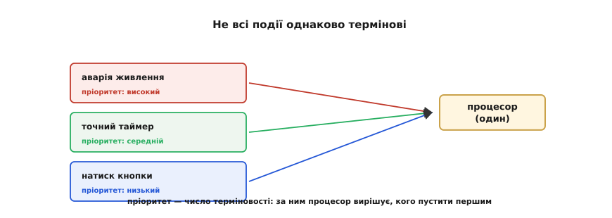
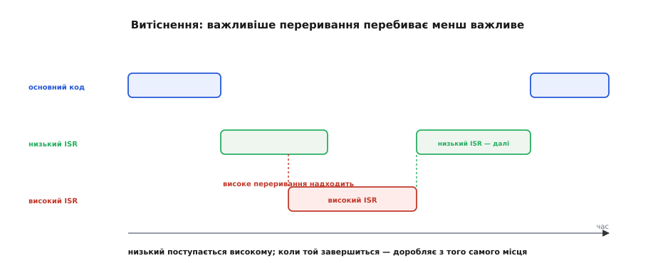
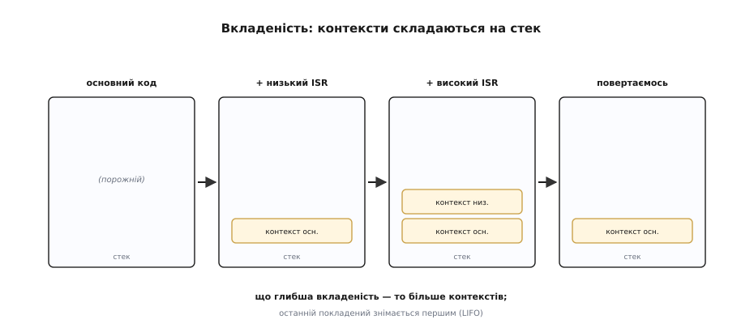
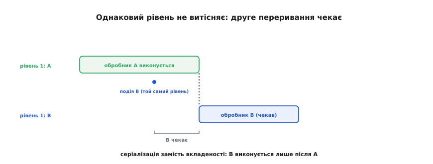
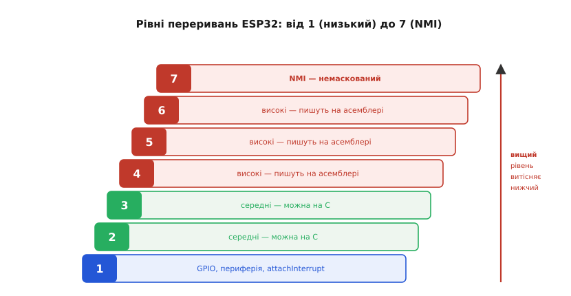
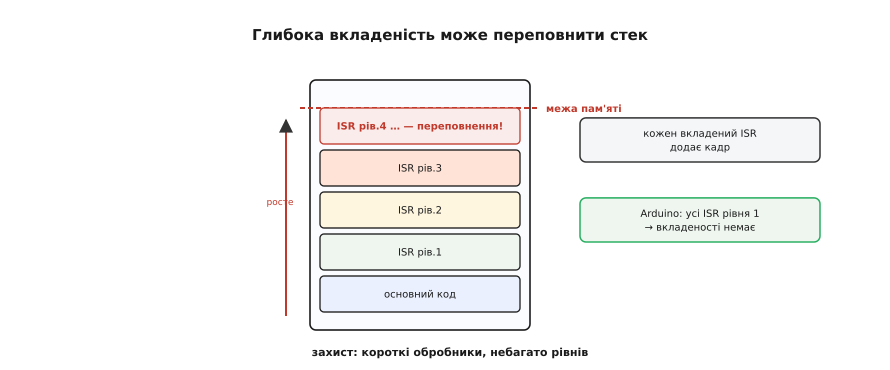

# Пріоритети й вкладеність (витіснення)

Контролер не просто реагує на [переривання](topic:hw-arch/interrupts) — він зважує їхні **пріоритети** й може навіть перебити поточний обробник важливішим. А що, коли переривань **кілька** й вони сперечаються за єдиний процесор? Хто головніший, чи можна перервати сам обробник посеред роботи, і чим це загрожує? Звідси три поняття цієї теми: **пріоритет** (хто важливіший), **витіснення** (важливіший перебиває менш важливого) і **вкладеність** (обробники складаються один на одного). На додачу — чому на Arduino всі ці тонкощі зазвичай сховані, а на ESP32 раптом вилазять.

### Навіщо взагалі пріоритети

Події нерівноцінні. Сигнал «аварія живлення» треба обробити **негайно**, бо за мить буде пізно; точний таймер реального часу — теж важливо й вчасно; а натиск кнопки цілком може зачекати кілька мікросекунд. Якби контролер обслуговував усіх «як прийдуть», то термінова подія могла б застрягти за неспішною. Тому кожному джерелу призначають **пріоритет** (від лат. *prior* — «передніший, перший») — число, що каже контролеру, кого пускати першим і хто кого може перебити.

> 📜 **Коли пріоритет урятував політ.** Найдраматичніший доказ важливості пріоритетів — посадка Apollo 11: за хвилини до прилунення бортовий комп'ютер перевантажився й кричав «1201/1202», та пріоритетний планувальник скинув другорядне й утримав головне. Історія — у вставці [Apollo 11: аларми 1201/1202](topic:hw-arch/interrupt-priorities/hist-apollo.md).


*Не всі події однаково термінові: аварія живлення не може чекати, поки обробляється натиск кнопки. Пріоритет — це число терміновості; контролер за ним розставляє чергу й вирішує, кого пустити першим і хто кого має право перебити.*

Сама ідея не нова: ще на ранніх машинах інженери зрозуміли, що переривання без упорядкування за важливістю перетворюється на хаос, і вводили регістри-маски, які пускали лише дозволені джерела. Сучасний контролер робить рівно те саме, тільки апаратно й миттєво.

Пріоритет дає й інший важіль — **маскування за рівнем** (маска — від фр. *masque* — те, що закриває; тут «закриває» від процесора дрібніші переривання). Контролер уміє тимчасово блокувати всі переривання, **нижчі** за певний поріг, пропускаючи лише найважливіші. Це зручно, коли треба ненадовго захиститися від «дрібних» переривань, не глушачи термінових. Саме так, до речі, влаштоване і `noInterrupts()`: воно піднімає поріг і притримує звичайні переривання (а `interrupts()` опускає його назад). Єдине, чого не приховати в такий спосіб, — немаскований NMI (рівень 7): його не зупинить жоден поріг, на те він і «немаскований».

### Витіснення: важливіше перебиває менш важливе

Найцікавіше стається, коли важливе переривання приходить **посеред** обробки менш важливого. Тут діє правило **витіснення** (preemption): високопріоритетний обробник **перебиває** низькопріоритетний, що вже виконується. Процесор призупиняє низький обробник (зберігши його [контекст](topic:hw-arch/interrupt-vector)), виконує високий, а потім повертає низький рівно туди, де перервав, і той спокійно доробляє своє.


*Поки працює низькопріоритетний обробник, надходить високопріоритетне переривання — і перебиває його. Високий обробник відпрацьовує, а тоді низький продовжує з того самого місця. Важливіше ніколи довго не чекає на менш важливе.*

Витіснення працює лише «згори вниз»: високий може перебити низького, але **не навпаки** — низькопріоритетне переривання чемно чекає, поки звільниться процесор, зайнятий важливішим. Це і є сенс пріоритетів: гарантувати, що термінова подія не застрягне за дрібною.

У витіснення є точна інженерна цінність: воно дає високопріоритетному перериванню **обмежений зверху** час реакції, хоч би скільки роботи висіло на нижчих рівнях. Якщо аварійний сигнал має рівень вищий за все інше, він спрацює майже миттєво навіть посеред найдовшого низького обробника. Платять за це нижчі рівні: їхня реакція стає менш передбачуваною, бо їх будь-коли можуть відсунути. Тому рівні розставляють обдумано: найвищий — тому, що по-справжньому не може чекати, а не «про всяк випадок усім по максимуму».

Добра аналогія — приймальня лікарні. Звичайних пацієнтів приймають по черзі, та коли привозять когось у критичному стані, його беруть **поза чергою**, відклавши поточного. Лікар (процесор) один, тож обслужити всіх одночасно не може — але порядок визначає **терміновість**, а не час прибуття. Так само й переривання: рівень — це «ступінь невідкладності», і саме він, а не «хто перший прийшов», вирішує, ким процесор займеться негайно, а кого попросить зачекати. Витіснення — це і є взяття «критичного пацієнта» поза чергою, з обіцянкою повернутися до відкладеного, щойно мине загроза.

### Вкладеність: контексти складаються на стек

Якщо високий обробник перебив низький, то в системі тепер **два** призупинені шари: основний код і низький обробник, обидва чекають. А якщо ще вищий переб'є високого — шарів стане три. Це називають **вкладеністю** переривань, і тримається вона на тому самому стеку, що [зберігає контекст](topic:hw-arch/interrupt-vector): кожне витіснення кладе ще один контекст **згори**.


*При вкладеності контексти складаються на стек стопкою: спершу контекст основного коду, потім — перерваного низького обробника. Повертаються вони строго навпаки — останній покладений знімається першим, як стопка тарілок. Так система не плутається, хто кого перервав.*

Ця дисципліна «останнім поклав — першим зняв» (її звуть LIFO) і дозволяє як завгодно глибоко вкладати переривання, не заплутавшись: процесор завжди повертається саме туди, звідки його смикнули востаннє. Стек — невидимий, але незамінний бухгалтер усієї цієї механіки.

Звідси випливає й практичний розрахунок пам'яті. Найгірший випадок глибини стека — це коли перервалися геть усі рівні поспіль: тоді на стеку лежать контекст основного коду й по одному на кожен рівень, що встиг витіснити. Тому під стек закладають запас із розрахунку на **повну** можливу вкладеність, а не на «звичайний» випадок. Недооцінити це — означає рано чи пізно впертися в переповнення саме тоді, коли збіглося найбільше переривань, тобто в найгірший і найменш передбачуваний момент.

### Однаковий пріоритет не витісняє

А що, як два переривання мають **однаковий** рівень? Тоді витіснення **не** буває: те, що прийшло другим, не перебиває першого, а **чекає**, поки той завершиться, і лише тоді виконується. Переривання одного рівня обслуговуються по черзі, одне за одним, — вони не можуть перервати одне одного.


*Два переривання однакового рівня не витісняють одне одного: коли під час обробника A приходить подія B того ж рівня, B **чекає** завершення A і лише потім виконується. Серіалізація замість вкладеності.*

> 🔧 **Навіщо це.** Ось практично найважливіший висновок теми для Arduino. Усі ваші обробники, повішені через `attachInterrupt`, мають **однаковий** (низький) рівень — а отже, **не перебивають один одного**: вони завжди виконуються по черзі. Це добра новина: між двома вашими обробниками гонок даних не буде, бо вони не можуть перетнутися в часі. Гонки лишаються тільки **між обробником і `loop()`** — і саме їх лікують [`volatile`](topic:sf-lang/volatile) та [атомарність](topic:sf-tasks/atomicity-races). Тримайте це в голові: «мої ISR одне одного не перебивають».

Варто чітко розрізняти два види «зустрічей» спільних даних. Між двома обробниками **одного рівня** конфлікту нема — вони ніколи не виконуються одночасно. А от обробник і **основний код** перетинаються завжди: обробник може втрутитися в будь-який момент роботи `loop()`. Тому захищати треба саме цей стик — змінні, які пише обробник, а читає `loop()` (чи навпаки). Усе подальше — `volatile`, атомарність, критичні секції — стосується рівно цього єдиного небезпечного перетину.

Корисно усвідомити, що на ESP32 ваші переривання живуть не самі. Поряд працюють **системні** переривання — таймер планувальника RTOS, обробники Wi-Fi і Bluetooth, — і деякі з них мають вищий пріоритет за ваш рівень 1. Це означає, що навіть «ваш» короткий обробник теоретично може бути на мить відсунутий системним. На практиці це майже непомітно (системні обробники теж короткі), та пояснює дрібний джитер, який інколи видно у дуже точних вимірах часу. Монопольно володіє процесором хіба що код під вимкненими перериваннями — та й то лише до рівня NMI.

А що буде, коли кілька переривань **одного** рівня вже чекають своєї черги? Контролер обслужить їх одне за одним; точний порядок між рівними залежить від чипа (часто — за фіксованим внутрішнім номером джерела), але гарантовано одне: жодне з них не пропаде й не перерве інше на півслові. Для коду це означає приємну визначеність — обробники рівня 1 утворюють акуратну чергу, де кожен відпрацьовує цілком, перш ніж почнеться наступний.

### Рівні переривань ESP32

Конкретні числа залежать від чипа. У ESP32 (ядра Xtensa) рівнів **сім**, від 1 (найнижчий) до 7 (найвищий), і кожен має своє призначення.


*Сходинка рівнів ESP32. Рівень 1 — низький: тут сидять GPIO й більшість периферії, сюди ж лягають ваші `attachInterrupt`. Рівні 2–3 — середні, обробники для них теж можна писати на C. Рівень 4 і вище — високі, їх пишуть уже на асемблері; рівень 7 — немаскований (NMI). Вищий рівень витісняє нижчий.*

Для нас головне — нижній край цієї драбини. Майже вся периферія, з якою ви працюєте (зокрема GPIO), сидить на **рівні 1**, і саме туди `attachInterrupt` чіпляє ваші обробники. Високі рівні (4–7) зарезервовані для особливих, службових задач — критичного відліку часу, лагодження, аварійних сигналів — і вимагають писати обробник мовою асемблера, тож у звичайних проєктах їх не чіпають. Між цими краями (рівні 2–3) лежить «середня» зона, доступна з C, якою користуються, коли треба, щоб одне переривання таки могло витіснити інше.

Коли ж справді потрібні різні рівні? Класичний приклад — точний таймер, що мусить «тікати» рівно, навіть поки інші обробники зайняті: йому дають рівень вищий за решту, і він витісняє їх, гарантуючи незбитий відлік. Інший — критичний аварійний вхід (перегрів, обрив), реакція на який не має права запізнитися ні на мить. У таких випадках різниця рівнів — не примха, а вимога надійності. Для всього іншого однакового рівня 1 цілком досить, і простота того варта.

**Як задати рівень переривання.**

```c
// Arduino: рівень НЕ задають — attachInterrupt завжди рівень 1,
// тож усі ваші обробники одного рівня й не витісняють один одного.

// ESP-IDF: рівень обирають прапорцем при виділенні переривання:
esp_intr_alloc(SOURCE, ESP_INTR_FLAG_LEVEL3, handler, arg, &h);
//                     ^^^^^^^^^^^^^^^^^^^^  рівень 3 (середній, можна на C)
// Обробник вищого рівня дістає право витісняти обробники нижчих.
```

**Витіснення на ділі: таймер рівня 3 перебиває GPIO рівня 1.** Уявімо два джерела: повільнуватий обробник кнопки на GPIO (рівень 1, ставить `attachInterrupt`-аналог) і точний таймер, якому дали рівень 3, щоб він тікав незбито. Поки тягнеться обробник GPIO, спрацьовує таймер — і витісняє його. Ось як це виглядає в ESP-IDF, де рівень задають явно:

```c
volatile uint32_t g_ticks = 0;     // лічильник таймера
volatile bool     g_pressed = false;

// Високий рівень (3): короткий, лиш інкремент — він перебиватиме GPIO
static void IRAM_ATTR timer_isr(void *arg) {
    g_ticks++;                     // ← одна дія, кілька тактів
}

// Низький рівень (1): довший обробник кнопки
static void IRAM_ATTR gpio_isr(void *arg) {
    g_pressed = true;
    for (int i = 0; i < 50; i++)   // ← навмисно затягнутий: тут його й перебʼє таймер
        debounce_step();
}

void app_main(void) {
    intr_handle_t ht, hg;
    esp_intr_alloc(ETS_TG0_T0_LEVEL_INTR_SOURCE,
                   ESP_INTR_FLAG_LEVEL3 | ESP_INTR_FLAG_IRAM,   // рівень 3 — вищий
                   timer_isr, NULL, &ht);
    esp_intr_alloc(ETS_GPIO_INTR_SOURCE,
                   ESP_INTR_FLAG_LEVEL1 | ESP_INTR_FLAG_IRAM,   // рівень 1 — нижчий
                   gpio_isr, NULL, &hg);
}
```

Розгорнемо подію за подією, коли таймер спрацьовує посеред обробника кнопки:

```
t0  loop()      виконується основний код
t1  GPIO(1)     натиск → старт gpio_isr (рівень 1) поверх loop()
                стек: [контекст loop]
t2  TIMER(3)    тік таймера приходить ПОСЕРЕД gpio_isr
                3 > 1 → витіснення: gpio_isr призупинено
                стек: [контекст loop][контекст gpio_isr]   ← глибина 2
t3  timer_isr   g_ticks++ відпрацював (кілька тактів) і вийшов
                стек: [контекст loop]                       ← знято верхній
t4  gpio_isr    доробив свій цикл рівно з того місця, де став
t5  loop()      повернення в основний код
```

Найгірша глибина стека тут — **два** кадри переривань поверх `loop()` (рівень 1, потім рівень 3); якби додали ще таймер рівня 5, що міг би перебити рівень 3, — стало б три. Саме на таку **повну** глибину й закладають запас стека. А `g_ticks++` свідомо короткий: на рівні 3 він блокує рівень 1 лише на жменю тактів, тож кнопка майже не відчує затримки.

### Небезпека: глибока вкладеність переповнює стек

Вкладеність зручна, та має ціну. Кожен вкладений обробник зберігає на стек **свій** контекст — а стек не безмежний. Якщо рівнів багато й вони вкладаються глибоко, контексти можуть з'їсти всю відведену пам'ять, і станеться [**переповнення стека**](topic:sf-lang/stack-overflow) (stack overflow) — одна з найнеприємніших аварій, бо вона тихо псує сусідні дані й валить програму в несподіваному місці.


*Кожен вкладений обробник додає кадр на стек. Забагато рівнів, що вкладаються один в одного, — і стек дійде до межі пам'яті, спричинивши переповнення. Захист простий: короткі обробники, небагато рівнів, а на Arduino — узагалі спокій, бо всі переривання одного рівня й не вкладаються.*

На щастя, у звичайному Arduino-коді ця небезпека вас не торкається: оскільки всі переривання `attachInterrupt` одного рівня й не витісняють одне одного, **вкладеності просто немає** — у будь-який момент виконується щонайбільше один ваш обробник. Глибока вкладеність виникає лише тоді, коли ви **свідомо** розставляєте різні рівні через `esp_intr_alloc`, — і там уже самі дбаєте, щоб обробники були короткими, а рівнів небагато.

> 🔧 **Навіщо це.** Підсумуймо практично. На Arduino з `attachInterrupt` пріоритети й вкладеність — це переважно теорія: усі ваші ISR рівня 1, не перебивають одне одного, стек у безпеці. Знати про них усе одно треба з двох причин: по-перше, щоб розуміти, чому термінові системні переривання (зв'язок, таймери) усе ж можуть «вклинитися» у вашу роботу; по-друге, щоб не злякатися й не наробити лиха, коли проєкт виросте до ручного призначення рівнів. Правило безпеки скрізь те саме: [**короткий обробник**](topic:hw-arch/isr) — і вкладеність ніколи не стане проблемою.

Насамкінець — про підступну рідкість, **інверсію пріоритетів**. Це коли високопріоритетна робота мусить чекати на низькопріоритетну, бо та тримає потрібний їй ресурс (чи надовго вимкнула переривання). Тоді «важливий» парадоксально застрягає за «дрібним» — усупереч усій ідеї пріоритетів. Найвідоміший випадок — марсіанський апарат Pathfinder (1997), що раз у раз перезавантажувався в польоті саме через інверсію пріоритетів, аж поки інженери не виправили це віддалено вже на Марсі. Глибше ця тема належить [операційним системам реального часу](topic:sf-devices/freertos); тут досить запам'ятати, що довге утримання переривань вимкненими в «дрібному» коді здатне підкосити навіть найтерміновіше.

Отже, пріоритет визначає, кого з претендентів на процесор пустити першим; **витіснення** дозволяє важливішому перебити менш важливого; **вкладеність** складає перервані контексти на стек і повертає їх у зворотному порядку. Переривання **однакового** рівня одне одного не витісняють, а чекають у черзі — і саме тому ваші Arduino-обробники не перетинаються між собою.

> 🧮 **А скільки це коштує в тактах?** Витіснення й збереження контексту перетворюються на конкретну **затримку** — від події до першої інструкції обробника. З чого вона складається, що таке джитер і як обмежити найгірший випадок — рахуємо у вставці [Латентність переривання](topic:hw-arch/interrupt-priorities/math-latency.md). Для більшості проєктів стандартного рівня 1 цілком досить — він простий і безпечний; а ручне призначення рівнів лишається інструментом на потім, коли терміновість однієї конкретної події справді переважить усі інші й зажадає права витісняти. Найпідступніше ж — спільні змінні між обробником і основним кодом: компілятор може їх раптом «не побачити», і саме тому такі змінні позначають особливим словом [`volatile`](topic:sf-lang/volatile).
