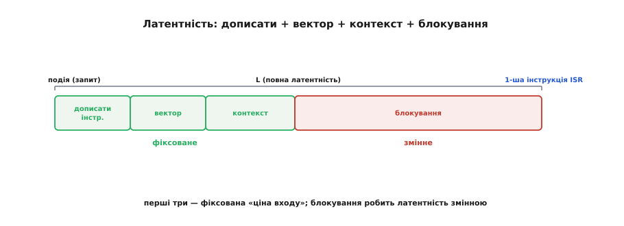
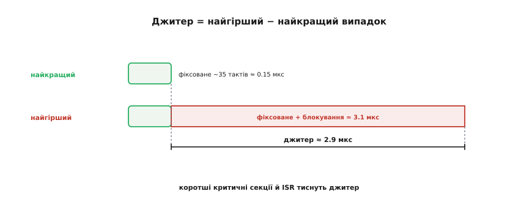

# 🧮 Латентність переривання: такти контексту, джитер, найгірший випадок

> Математична вставка про [пріоритети й вкладеність переривань](topic:hw-arch/interrupt-priorities). Витіснення й збереження контексту — не безкоштовні. Порахуймо, у скільки тактів обходиться реакція на подію й чому для real-time важить не середнє, а найгірше.

## Означення

**Латентність переривання** — час від миті, коли залізо підняло запит, до першої корисної інструкції вашого обробника. Це не одне число, а **сума** доданків:

```
L = T(дописати) + T(вектор) + T(контекст) + T(блокування)
```

де `T(дописати)` — дописати поточну інструкцію (перервати посеред неї не можна), `T(вектор)` — розпізнати запит і стрибнути за вектором, `T(контекст)` — зберегти регістри на стек, `T(блокування)` — скільки довелося **чекати**, поки звільнять процесор.


*Від події до першої інструкції ISR: дописати поточну інструкцію, розпізнати + вектор, зберегти контекст — усе фіксоване й передбачуване, — а тоді можливе блокування (критичні секції й вищі ISR), яке й робить латентність змінною.*

## Інтуїція

Перші три доданки **фіксовані** й передбачувані — це стала «ціна входу» в обробник, кілька десятків тактів. А ось `T(блокування)` — **змінний** і найбільший: це або вимкнені переривання ([критична секція](topic:sf-tasks/atomicity-races)), або вищий чи рівний обробник, що зараз біжить. Саме він робить латентність **непостійною**. Звідси й парадокс: на простому МК латентність часто **передбачуваніша**, ніж на потужному з купою рівнів та кешів, — менше того, що може раптом вклинитися й роздути блокування.

## Формальний апарат

Переведімо такти в час. На ESP32, що тактується ~240 МГц, один такт ≈ **4 нс**:

```
1 такт              ≈ 4.2 нс   (при 240 МГц)
фіксоване ~35 тактів ≈ 0.15 мкс       ← найкращий випадок
```

Це **найкраща** латентність — коли нічого не блокує. **Найгірша** додає найдовше блокування (числа — приклад):

```
L(worst) = фіксоване + найдовше_блокування
         = 35 + (200 такт критсекції + 500 такт вищого ISR)
         = 735 тактів ≈ 3.1 мкс
```

Різниця між ними — це **джитер**:

```
джитер = L(worst) − L(best) ≈ 3.1 − 0.15 ≈ 2.9 мкс
```


*Найкращий випадок — лише фіксовані ~35 тактів (≈0.15 мкс); найгірший додає найдовше блокування (сотні тактів). Їхня різниця — джитер. Коротші критичні секції й ISR тиснуть його, роблячи реакцію твердішою.*

Для багатьох задач важить **не середня** латентність, а саме **джитер** і **найгірший** випадок: якщо переривання тактує точний сигнал, «плавання» реакції на мікросекунди вже спотворює його.

## Як обмежити найгірше

Фіксовану частину ви не зміните — вона в залізі. Зате **змінну** — у ваших руках:

- **Короткі [критичні секції](topic:sf-tasks/atomicity-races)**: що менше тактів вимкнені переривання, то менший `T(блокування)`.
- **Короткі [обробники](topic:hw-arch/isr)**: довгий ISR роздуває латентність **усіх** нижчих за нього.
- **Обережно з рівнями**: більше високих рівнів — більше того, що може витіснити вашу подію.

Обмежте найдовшу критичну секцію й найдовший вищий ISR — і ви **обмежите** найгірший випадок, а отже, дасте справжню часову **гарантію**.

## Підсумок

Латентність — головна метрика «чуйності» системи реального часу. Вона показує в числах, **чому** порада зводиться до одного: тримай обробники й критичні секції **короткими**. Не заради краси — заради передбачуваної, малої затримки реакції.
