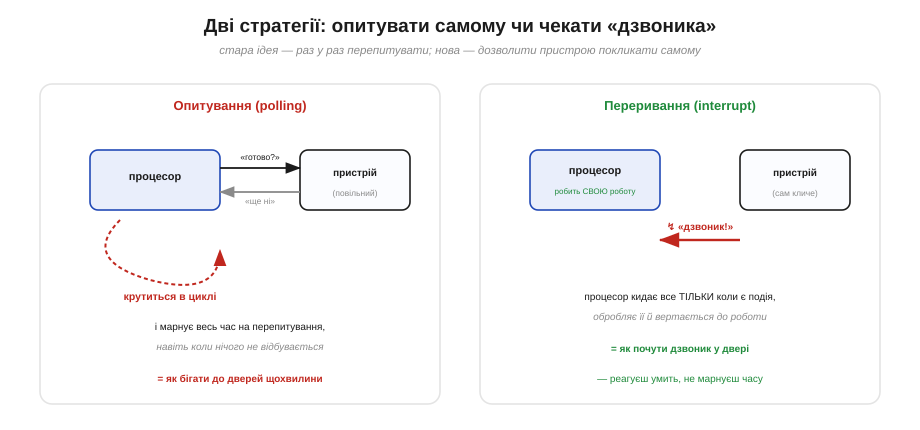
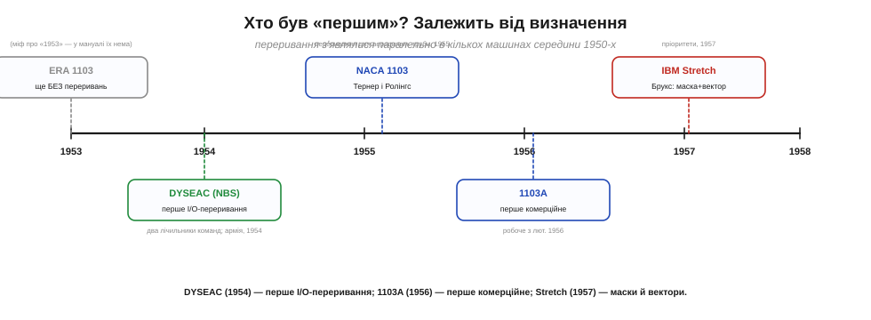
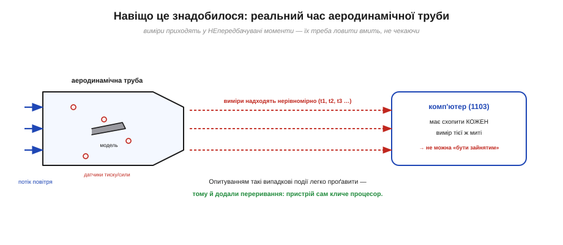
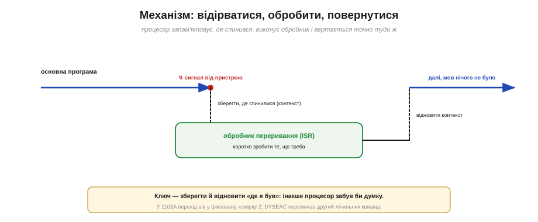
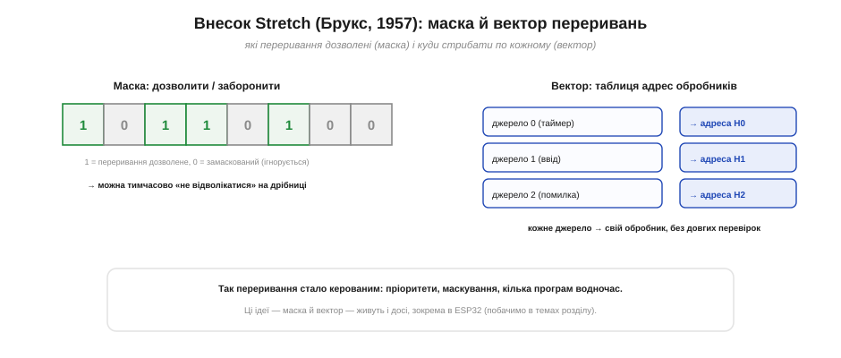

# 📜 Винахід переривання: як машини навчилися «відволікатися»

Ця історія веде **ланцюгом питань** навколо однієї простої, але колись несподіваної думки: що процесорові не конче **самому** без упину перепитувати «ну що, вже сталося?» — можна влаштувати так, щоб подія **сама покликала** його тієї ж миті, коли трапилася. Сьогодні на цьому стоїть усе чуйне залізо — від кнопки, що реагує без затримки, до мережі й моторів; а народилася ідея в середині 1950-х, у диму аеродинамічних труб і перших військових машин реального часу. Заразом ця історія показує, як обережно треба казати слово «**перший**»: тут воно залежить від визначення, і за ним стоять не одна машина й не одна людина.

Найпростіший спосіб дізнатися, чи готовий повільний пристрій, — це **опитування**: у циклі раз у раз питати «чи не змінився рівень?». Для однієї кнопки це чудово. Та уявіть, що подій багато, вони рідкісні й приходять у непередбачувані моменти, а процесор тим часом має робити ще купу справ. Невже він мусить **усе кинути** й цілими днями стояти біля дверей, перепитуючи «вже? вже? вже?»? Саме це питання — **чи може подія покликати процесор сама** — і породило одну з найважливіших ідей в історії обчислень: **переривання**.

*Дві стратегії. Ліворуч — **опитування**: процесор сам крутиться в циклі й без кінця перепитує пристрій, марнуючи час, наче бігаєш до дверей щохвилини перевірити, чи не прийшов гість. Праворуч — **переривання**: процесор спокійно робить свою роботу, а пристрій **сам смикає** його, коли є подія, — мов дзвоник у двері.*

---

## Доба невпинного опитування: машина, що мусила сама перепитувати

Перші комп'ютери 1940-х — початку 1950-х працювали **прямолінійно**: виконували програму крок за кроком згори вниз, і єдиний спосіб дізнатися, чи готовий повільний пристрій (зчитувач карток, друкарка, давач), полягав у тому, щоб **самому в нього спитати**. Це і є опитування (*polling*): процесор у циклі читає стан пристрою й чекає потрібного значення. Поки чекає — він не робить **нічого** корисного, лише крутить порожній цикл. Таке марне очікування називають «активним очікуванням» (*busy-waiting*).

Проблема в тому, що електронний мозок був **незрівнянно швидший** за все, до чого він був під'єднаний. Процесор устигав за секунду виконати тисячі дій, а механічний пристрій тим часом ледь ворушився. Тримати таку швидку машину прикутою до повільного пристрою, змушуючи її без кінця перепитувати, — однаково що садовити шахового гросмейстера лічити вголос секунди в очікуванні листоноші. Дороге, рідкісне на той час обчислювальне диво **простоювало** у безглуздих циклах опитування.

Гірше того: опитуванням легко **проґавити** подію. Якщо процесор саме зайнятий чимось іншим, а сигнал на пристрої був короткий, то до наступного «перепитування» він міг уже зникнути. Для задач, де миті важать — де дані надходять у випадкові моменти й чекати не будуть, — опитування ставало не просто марнотратним, а **непридатним**. Назрівала потреба в чомусь принципово іншому: щоб не процесор полював на подію, а **подія знаходила процесор**.

Була тут і груба економіка. Перші комп'ютери коштували мільйони, їх було обмаль, а час на них **розподіляли й оплачували погодинно** — машинна година коштувала як місячна зарплата інженера. Тримати таку коштовність у порожньому циклі опитування означало в прямому сенсі **палити гроші**. До того ж більшість ранніх машин працювали «пакетно» (*batch*): задачі шикувалися в чергу й виконувалися одна по одній, без втручання ззовні. А нові застосунки — керування, зв'язок, військові системи — вимагали **реального часу**: реагувати на події тоді, коли вони стаються, а не коли дійде черга. Пакетна машина, прикута до опитування, для такого просто не годилася.

> 🔧 **Навіщо це.** Цей самий [вибір — опитувати чи чекати поклику](root:embedded/polling-vs-interrupts) — стоїть перед інженером у кожному проєкті. Головне тут: опитування просте, але «жадібне» до часу процесора; переривання складніше влаштоване, зате дозволяє машині не марнувати ані такту, поки нічого не відбувається. Уся ця історія — про те, як інженери дійшли до другого підходу.

---

## Зухвала думка й сплутаний родовід «першого»

Думка, що визріла в середині 1950-х, була така: вбудувати в машину спеціальний **сигнальний провід**, смикнувши який, пристрій змусить процесор **негайно** покинути поточну роботу, виконати коротку «аварійну» процедуру й потім повернутися туди, де його перервали. Це й назвали **перериванням** (*interrupt*) — бо воно буквально **перебиває** хід основної програми.

А тепер обережно з улюбленим запитанням «хто був перший?». Дуже часто можна почути, що перші переривання мала машина **ERA 1103** (1953). Та якщо зазирнути в її оригінальний посібник 1953 року, то ніяких переривань там **не описано** — тобто дата першої поставки 1103 **не** позначає винаходу переривань. Це класична пастка: гучна назва й рання дата ще не означають, що саме тут з'явилася нова річ.

*Переривання визрівали паралельно в кількох машинах. **DYSEAC** (1954) — перше I/O-переривання; **1103** дістав переривання аж 1955-го (для аеродинамічної труби); **1103A** (1956) — перше **комерційне**; **Stretch** (1957) — маски й вектори. Жодного єдиного «винахідника» немає — як і з багатьма іншими винаходами.*

Якщо вже шукати найранішого, то найчастіше називають **DYSEAC** — машину Національного бюро стандартів США (*National Bureau of Standards*), передану армії **1954 року**. Її вважають **першим комп'ютером із перериваннями вводу-виводу**: у ній було **два лічильники команд**, і сигнал від пристрою змушував виконання **перемкнутися** з одного на другий. (Та сама DYSEAC, до речі, вважається й першою машиною з прямим доступом до пам'яті, DMA.) Паралельно переривання визрівали в особливих, «штучних» проєктах — у системі протиповітряної оборони **SAGE** і в амбітному проєкті IBM **Stretch**. Тож «перший» тут — не одна точка, а ціле гроно майже одночасних винаходів у різних місцях.

Окремо варто згадати **військовий** двигун цих змін. У розпал Холодної війни США будували грандіозну систему протиповітряної оборони **SAGE**, що мала в реальному часі зводити докупи дані з радарів і наводити перехоплення. Її обчислювальним серцем були машини, що виросли з проєкту **Whirlwind** Массачусетського технологічного інституту (під орудою Джея Форрестера) — однієї з перших по-справжньому **реального часу**. Така машина не могла дозволити собі опитування: радарні відмітки сипалися безперервно й вимагали миттєвої реакції. Гроші й терміновість оборонних замовлень неабияк прискорили дозрівання переривань — як, на жаль, часто буває з технологіями.

---

## Перший справжній поклик — з аеродинамічної труби

Звідки взялася сама **потреба**? Найяскравіший поштовх дала не математика, а **аеродинаміка**. У дослідницькій лабораторії **NACA** (*National Advisory Committee for Aeronautics* — попередниці NASA) у Клівленді стояла аеродинамічна труба, де продували моделі літаків, і десятки давачів міряли тиск та сили на моделі. Дані з них надходили **у випадкові, непередбачувані моменти** — і кожен вимір треба було схопити **тієї ж миті**, бо потік не чекатиме. Опитуванням такі випадкові події легко проґавити, а зайняту чимось машину вони заставали б зненацька.

*Мотив винаходу. Давачі на моделі в аеродинамічній трубі видають дані в нерівні, випадкові моменти (t1, t2, t3 …), і комп'ютер мусить схопити **кожен** негайно. «Бути зайнятим» він не має права — тож пристроєві дали змогу **самому покликати** процесор. Реальний час народив переривання.*

Саме під цю задачу, як з'ясували історики обчислень, переривання до машини 1103 зробили **інженери NACA Дік Тернер і Джо Ролінгс** (*Dick Turner, Joe Rawlings*) наприкінці **1955 року**; перше робоче переривання запрацювало в **лютому 1956-го**. Машина дістала змогу «**перерватися**, щоб почати збирати дані аеродинамічної труби в реальному часі». Зверніть увагу: винахід прийшов не від виробника комп'ютера, а від **користувачів**, яким машина потрібна була для конкретної живої задачі, — і вже потім фірма Univac зробила цю ідею стандартною у своєму комерційному **1103A** (кінець 1956). Так одна практична потреба — впіймати швидкоплинний вимір — підштовхнула винахід, що змінив усю архітектуру обчислень.

---

## Як не загубити думку: відірватися, обробити, повернутися

Хай пристрій смикнув сигнальний провід — а далі що? Тут і ховається вся хитрість. Процесор не може просто «стрибнути» обробляти подію, бо тоді він **забуде**, що саме робив, і не зможе повернутися. Тому в основу переривання лягла проста, але глибока ідея: перш ніж кинутися на поклик, машина мусить **запам'ятати, де спинилася** (зберегти свій стан, «контекст»), а впоравшись із подією — **відновити** його й продовжити, мовби нічого й не було.

*Як це працює. Сигнал перериває основну програму; машина зберігає, де спинилася, перестрибує в **обробник** (коротку процедуру для події), а тоді відновлює збережене й вертається точно в ту саму точку. У 1103A перехід вів у фіксовану комірку пам'яті (адресу 2); DYSEAC просто перемикав другий лічильник команд.*

Реалізації різнилися, та суть скрізь однакова. У 1103A переривання забирало виконання в наперед обумовлену комірку — **адресу 2**, — де лежала команда переходу до потрібного обробника, який заодно зберігав адресу повернення. DYSEAC обходився **двома лічильниками команд**: сигнал просто перемикав машину з «робочого» лічильника на «обробний» і назад. Цю коротку процедуру, що відпрацьовує подію, згодом назвуть **обробником переривання** (*interrupt handler*, або ISR — *interrupt service routine*). Головний урок тих років: переривання корисне рівно настільки, наскільки надійно машина вміє **зберегти й повернути «де я був»** — інакше вона б щоразу губила думку.

Ця скромна механіка «зберегти-обробити-відновити» виявилася зерном чогось набагато більшого. Якщо машина вміє зберегти весь свій стан і потім бездоганно його повернути, то вона може не лише обробляти переривання, а й **перемикатися між програмами** — призупинити одну, попрацювати над іншою, вернутися до першої. Саме звідси згодом виросли **багатозадачність** і операційні системи — те, до чого обчислювальна техніка дійшла значно пізніше. Та вже тоді постала й перша пастка: а що, як обробник сам буде перерваний посеред роботи? Тоді збережені контексти доводиться складати **стопкою**, один на одного, і впорядкувати це «вкладання» стало окремим клопотом.

---

## Коли перебивань побільшало: маска й вектор

Щойно переривання довело свою користь, виникло нове ускладнення. Джерел подій ставало **багато** — кілька пристроїв, таймери, помилки, — і постали природні запитання. Що робити, коли два переривання приходять майже водночас, — котре важливіше? Як на час дуже важливої роботи **тимчасово не відволікатися** на дрібниці? І як швидко зрозуміти, **хто саме** покликав, не перебираючи всіх по черзі?

*Внесок проєкту Stretch. **Маска** — набір бітів «дозволено / заборонено» для кожного джерела: можна тимчасово «затулити вуха» від несуттєвих переривань. **Вектор** — таблиця, де кожному джерелу зіставлено адресу його обробника: машина стрибає прямо куди треба, без довгих перевірок «а хто це був?».*

Відповіді на ці питання дав, зокрема, проєкт IBM **Stretch** (майбутній IBM 7030). Інженер **Фред Брукс** (*Fred Brooks* — той самий, що згодом напише знамениту книжку «Міфічний людино-місяць») 1957 року представив доповідь із промовистою назвою «**Система програмно керованого переривання програми**». У ній були дві ідеї, без яких сучасні переривання немислимі. Перша — **регістр-маска** (у Stretch на 28 бітів): кожен біт дозволяв або забороняв своє джерело, тож програма могла свідомо вирішувати, на що зважати, а на що — поки що ні (це називають **маскуванням**). Друга — **регістр адреси переривань**, що зберігав початок **таблиці-вектора**: за нею машина миттю знаходила потрібний обробник для кожного джерела. Так переривання з простого «смикни-і-стрибни» перетворилося на **кероване**: з пріоритетами, маскуванням і підтримкою кількох програм водночас.

Постать Фреда Брукса варта окремого слова. Згодом він очолить розробку IBM System/360 — найвпливовішого сімейства комп'ютерів свого часу — і її операційної системи OS/360, а гіркий досвід тих велетенських проєктів виллє в книжку «**Міфічний людино-місяць**» зі славетним висновком, що дев'ять жінок не народять дитину за один місяць. 1999 року Брукс отримає премію Тюрінга — обчислювальний еквівалент Нобелівської. А його ідея маски подарувала програмістам ще одне довговічне поняття: **критичну секцію** — короткий проміжок, на час якого переривання вимикають, щоб важливу дію ніхто не перебив. Саме вона рятує від [гонок даних](topic:sf-tasks/atomicity-races), коли основна програма й обробник чіпають ту саму змінну.

---

## Що з цього лишилося нам

Минуло сімдесят років — а ми досі живемо в світі, який ці інженери накреслили. Усе, чим переривання живуть у сучасному мікроконтролері, — пряме продовження їхніх знахідок. Сигнальний провід, що смикає процесор, став **лініями переривань** GPIO. «Аварійна процедура» — це **обробник (ISR)**, який пише сам програміст. Збереження й відновлення «де я був» — це **збереження контексту**, що його ESP32 робить за вас. Маска Брукса живе у **ввімкненні/вимкненні переривань** і в пріоритетах, а його вектор — у **таблиці векторів переривань** сучасних чипів. Навіть давня суперечка [«опитування чи переривання»](root:embedded/polling-vs-interrupts) — це той самий вибір, що стояв перед інженерами NACA біля аеродинамічної труби.

І ще один урок, ширший за техніку. Історія переривання — добра пересторога проти спокусливих простих відповідей на питання «хто винайшов». Не було єдиного генія й єдиної машини: була **потреба** (зловити швидкоплинний вимір), що визріла одночасно в кількох місцях, і десятки людей — від Тернера й Ролінгса в Клівленді до Брукса в IBM, — кожен з яких додав свою частку. «Перший» тут залежить від того, що саме рахувати першим: перше I/O-переривання (DYSEAC, 1954), перше комерційне (1103A, 1956) чи перше з маскою й вектором (Stretch, 1957). Винаходи рідко мають одного батька — і це варто пам'ятати щоразу, коли хтось пропонує надто охайну легенду про «першого».

А як переривання влаштоване **зсередини** сучасного мікроконтролера, як написати свій обробник, чому він має бути коротким і де чигають пастки гонок даних — це вже окрема, суто інженерна розмова, що виростає просто з цих сімдесятирічних коренів.
