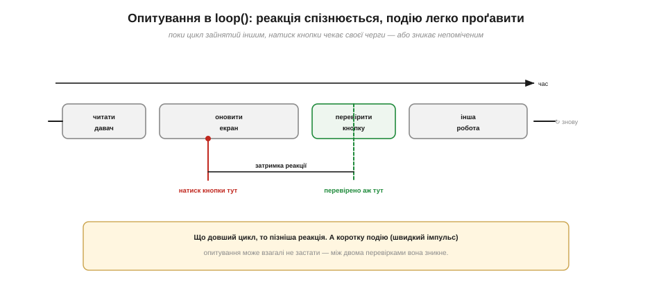
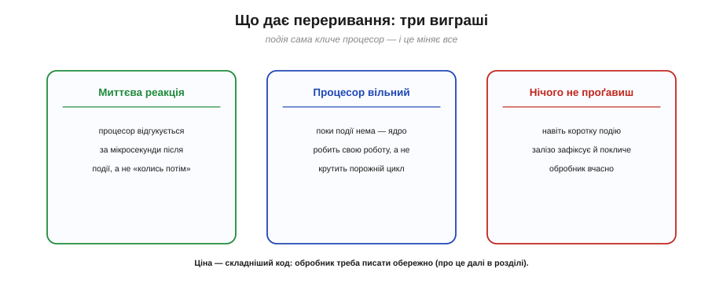
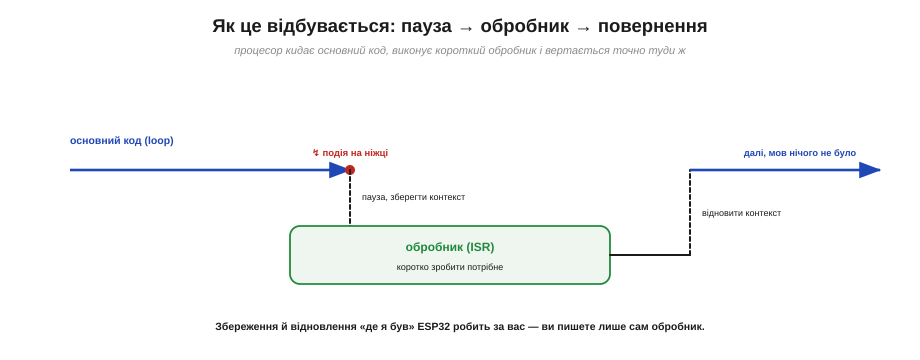
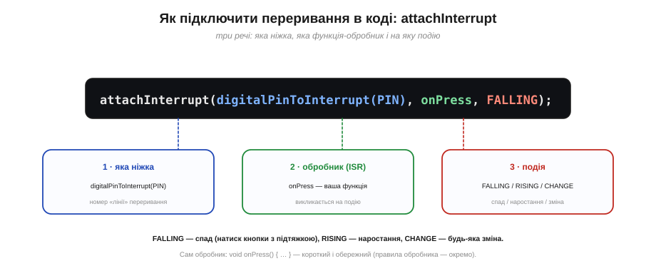
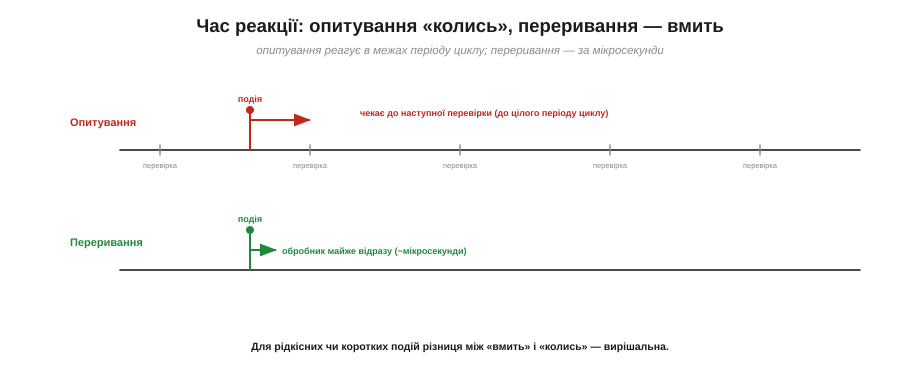
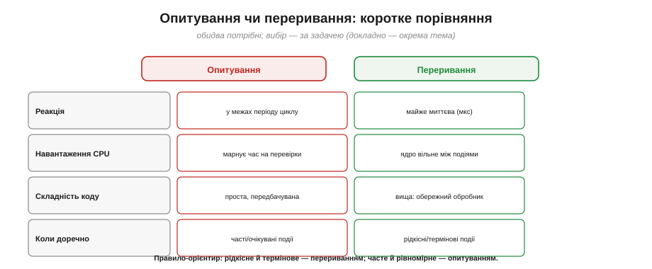

# Переривання: реагувати на подію вмить (проти опитування; «дверний дзвінок»)

Уявіть, що ви чекаєте на гостя. Можна щохвилини вставати з-за столу й **ходити до дверей** перевіряти, чи він уже прийшов, — і так доти, доки він з'явиться. А можна спокійно працювати, а коли гість прийде, він **подзвонить у дзвоник**, і ви відгукнетеся тієї ж миті. Перший спосіб — це **опитування**, другий — **переривання**. Уся ця тема — про те, чому дзвоник майже завжди кращий за біганину до дверей, і як «повісити дзвоник» на ніжку мікроконтролера.

### Опитування: процесор мусить сам перепитувати

Розгляньмо найпростіший спосіб прочитати кнопку: у циклі `loop()` викликати `digitalRead` і дивитися, чи рівень став LOW. Поки кнопку не натиснуто — цикл крутиться даремно, лише перевіряючи знову й знову. Це й є опитування: процесор **сам** і **постійно** перепитує стан ніжки. Для однієї кнопки в короткому циклі це працює чудово й нікому не заважає.

Проблеми починаються, коли `loop()` має робити **ще щось**, та ще й довге. Реальна програма зазвичай зайнята: читає давачі, оновлює екран, рахує, спілкується мережею. Усе це — час, протягом якого до перевірки кнопки **черга не доходить**.

Тут є й глибша, структурна проблема. Опитувальний `loop()` — це **кооперативна** багатозадачність: усі справи мусять ділити один цикл і чемно поступатися часом одна одній. Додаєте нову задачу — і всі інші реагують повільніше, бо період циклу зростає. Виходить парадокс: що більше вміє ваша програма, то **гіршою** стає її чуйність до кнопки. Можна, звісно, дробити довгі задачі на шматки й розкидати перевірки густіше, та це ускладнює код і все одно не дає гарантії, що швидку подію буде впіймано. Опитування погано **масштабується**.


*Поки цикл зайнятий оновленням екрана, натиск кнопки чекає, доки виконання дійде до перевірки, — звідси **затримка реакції**. А якщо подія коротша за період циклу (швидкий імпульс), вона може зникнути між двома перевірками — і програма її взагалі **не помітить**.*

Отже, опитування має три слабкі місця. **Затримка**: реакція приходить не одразу, а лише коли цикл добіжить до перевірки, — і що довший цикл, то більша затримка. **Марнування**: процесор витрачає такти на перевірки навіть тоді, коли нічого не відбувається. **Пропуск**: коротку подію, що сталася й минула між двома перевірками, опитування просто не застає. Для багатьох задач це неприйнятно — і тут на сцену виходить переривання.

### Переривання: подія кличе процесор сама

Ідея переривання дзеркальна до опитування. Замість того щоб процесор **сам** ходив перевіряти ніжку, ми домовляємося із залізом так: «щойно на цій ніжці станеться **ось така** подія (наприклад, рівень упаде з HIGH на LOW), **негайно** поклич мене». Тоді процесор спокійно займається своїми справами, а коли подія стається, спеціальна апаратура **перебиває** (звідси й назва; англ. *interrupt* — переривати, перебивати) основний код, змушує процесор виконати коротку процедуру-відповідь і повернутися до перерваної роботи.

Звідки залізо «знає», що сталася подія? Біля кожної ніжки сидить маленька апаратна схема-сторож, що **стежить** за рівнем і вміє розпізнати потрібну зміну — спад, наростання чи будь-який перехід. Помітивши її, вона піднімає внутрішній сигнал «є подія!», який і перебиває процесор. Ключове тут — що це стеження діється **апаратно й безперервно**, паралельно з основним кодом, не забираючи ані такту процесора. Саме тому переривання й ловить навіть коротку подію: за неї відповідає окреме залізо, що не спить і не відволікається, поки ядро зайняте чимось іншим.


*Переривання дає одразу три переваги. **Миттєва реакція** — відгук за мікросекунди, а не «колись потім». **Вільний процесор** — поки події нема, ядро робить корисну роботу, а не крутить порожній цикл. **Нічого не проґавиш** — навіть коротку подію залізо зафіксує й покличе обробник вчасно.*

Помітьте, як це знімає всі три вади опитування одним рухом. Затримки майже нема — реакція приходить за мікросекунди. Марнування нема — поки подія мовчить, процесор не робить жодної зайвої перевірки. І пропустити подію важко — її ловить апаратура, а не наш код, що міг бути зайнятий. За все це доводиться платити складнішим кодом (обробник треба писати обережно, за певними правилами), але виграш зазвичай того вартий.

### Як це відбувається: пауза, обробник, повернення

Що ж фізично діється в момент переривання? Послідовність така. Процесор виконує основний код. Стається подія — апаратура піднімає сигнал. Процесор **дочікує** поточну машинну інструкцію, **запам'ятовує**, де спинився (зберігає «контекст» — лічильник команд і регістри), і **перестрибує** на спеціальну функцію-відповідь. Ця функція зветься **обробником переривання** — англійською *interrupt service routine*, скорочено **ISR**. Виконавши обробник, процесор **відновлює** збережений контекст і повертається точно в ту точку основного коду, де його перервали, — наче нічого й не було.


*Механізм переривання: подія на ніжці перериває основний код; процесор зберігає контекст, виконує короткий обробник (ISR), відновлює контекст і вертається точно туди, де спинився. Збереження й відновлення «де я був» ESP32 робить **за вас** — ви пишете лише сам обробник.*

Найважливіше тут: усю марудну механіку «зберегти-перестрибнути-відновити» бере на себе **залізо й середовище**. Ви не пишете жодного рядка для збереження регістрів — ви пишете **тільки сам обробник**, коротку функцію, яка робить те, що треба зробити у відповідь на подію. Як саме залізо це влаштовує — через [контролер переривань і таблицю-вектор](root:hw-arch/interrupt-vector).

### Як «повісити дзвоник»: attachInterrupt

У середовищі Arduino для ESP32 переривання на ніжку чіпляють однією функцією — `attachInterrupt`. Їй треба сказати три речі: **яка ніжка**, **яка функція-обробник** і **на яку подію** реагувати.


*Виклик `attachInterrupt(digitalPinToInterrupt(PIN), onPress, FALLING)` складається з трьох частин: **яка ніжка** (через `digitalPinToInterrupt`), **який обробник** (`onPress` — ваша функція) і **на яку подію** (`FALLING` — спад рівня). Режими: `FALLING` (спад), `RISING` (наростання), `CHANGE` (будь-яка зміна).*

Режим події вибирають за змістом. Для кнопки з [підтяжкою](root:hw-digital/floating-pullups), що в спокої тримає HIGH, а при натиску падає в LOW, природний режим — **`FALLING`** (момент натиску). Якщо цікавить відпускання — `RISING`; якщо будь-яка зміна — `CHANGE`. Сам обробник — це звичайна функція без аргументів і без результату, наприклад `void onPress() { … }`. На ESP32 її зазвичай позначають особливим словом `IRAM_ATTR` (щоб вона лежала у швидкій пам'яті) — про це й про інші [правила обробника](root:hw-arch/isr) варто знати окремо.

> 🔧 **Навіщо це.** `attachInterrupt` — ваш «дзвоник» на ніжці. Запам'ятайте формулу з трьох частин: **ніжка, обробник, подія**. Найчастіша помилка новачка — повісити переривання й чекати миттєвої магії, забувши, що ніжку ще треба налаштувати (`pinMode`, [підтяжка](root:hw-digital/floating-pullups)) і що обробник має свої суворі обмеження. Дзвоник дзвонить лише тоді, коли його правильно під'єднали.

Кілька корисних дрібниць наостанок. Переривання можна й **зняти** — `detachInterrupt(digitalPinToInterrupt(PIN))` прибирає «дзвоник» із ніжки. Режими `RISING`/`FALLING`/`CHANGE` — це реакція на **фронт** (момент зміни); бувають іще реакції на **рівень** (поки ніжка тримає певний стан), але для кнопок і більшості давачів потрібен саме фронт. І остання тонкість: на одну ніжку звичайно вішають **один** обробник — повторний `attachInterrupt` замінює попередній. Тримайте це в голові, плануючи, які ніжки на що реагуватимуть.

### Скільки чекати на реакцію

Чим переривання так виграє? Часом реакції. При опитуванні відгук приходить **не раніше**, ніж цикл дійде до перевірки, — а це в найгіршому випадку **цілий період циклу** (мілісекунди, а то й більше, якщо `loop()` довгий). При перериванні відгук приходить за **мікросекунди** після події — рівно стільки, скільки залізу треба, щоб перебити процесор і стрибнути в обробник.


*Подія сталася між двома перевірками. Опитування мусить **дочекатися** наступної перевірки — затримка аж до цілого періоду циклу. Переривання спрацьовує майже відразу (за мікросекунди). Для рідкісних чи коротких подій ця різниця між «вмить» і «колись» — вирішальна.*

Різниця в тисячі разів — не перебільшення. Якщо `loop()` триває, скажімо, 10 мілісекунд, то опитування може спізнитися на всі 10 мс; переривання відгукнеться за одиниці мікросекунд.

Утім, чесно зазначмо: «миттєво» в переривання теж не зовсім нульове. Є невелика, але реальна **затримка входу** в обробник (кілька тактів на збереження контексту й стрибок), а ще вона трохи «плаває»: процесор спершу дочікує поточну інструкцію, а вищопріоритетне переривання може на мить відсунути нижче. Цей розкид звуть **джитером** (*jitter*). Для більшості задач він мізерний проти періоду циклу, та в дуже точному вимірюванні часу його враховують.

Там, де треба **точно** зловити момент (порахувати швидкий імпульс, зреагувати на аварійний сигнал, відмітити час події), опитування програє безнадійно.

Конкретний приклад — лічильник обертів або витратомір, де давач видає короткі імпульси, що йдуть **швидше**, ніж устигає крутитися `loop()`. Опитуванням ви порахували б лише частину з них, а решту проґавили б між перевірками, — і вимір вийшов би заниженим та непередбачуваним. На перериванні ж кожен імпульс чесно збільшує лічильник в обробнику, хоч би скільки їх приходило. Саме такі задачі — рахувати швидке, ловити рідкісне, відмічати точний час — і є рідною стихією переривань.

### То опитування — погане? Ні

З усього сказаного може скластися враження, що опитування — пережиток, а переривання — завжди краще. Це не так. Опитування **простіше**, **передбачуваніше** й вільне від цілого класу пасток, які приносять переривання: [гонки даних](root:sf-tasks/atomicity-races), [обмеження обробника](root:hw-arch/isr), [пріоритети](root:hw-arch/interrupt-priorities). Для частих, очікуваних, рівномірних подій опитування — цілком правильний вибір.


*Дві стратегії доповнюють одна одну. Опитування — проста й передбачувана, але реагує в межах періоду циклу й марнує час; переривання — миттєве й ощадне, та складніше в коді. Орієнтир: **рідкісне й термінове — перериванням; часте й рівномірне — опитуванням**.*

Тож переривання — це не заміна опитування, а **другий інструмент** у скрині, потужний для свого класу задач. Інженер володіє обома й щоразу обирає доречний. Як саме детально зважувати [«коли опитування, а коли переривання»](root:embedded/polling-vs-interrupts) — окрема велика тема; тут досить запам'ятати орієнтир із малюнка.

### Перший дотик: кнопка на перериванні

Зведімо ідею в найпростіший код. Канонічний прийом такий: обробник робить **якнайменше** — лише ставить «прапорець», що подія сталася, — а вся справжня робота діється потім, у `loop()`, коли той дійде до прапорця. Чому саме так (а не «зробити все в обробнику») — пояснюють самі [правила обробника](root:hw-arch/isr); поки що прийміть цей шаблон як зразок.

**Кнопка: опитування проти переривання.**

:::tabs
```cpp
// --- Опитування: loop сам перевіряє ---
void loop() {
  if (digitalRead(BTN) == LOW) { /* натиснуто */ }
  // ... інша робота, що затримує перевірку
}

// --- Переривання: подія сама кличе ---
volatile bool pressed = false;          // прапорець (volatile — обовʼязково для ISR)

void IRAM_ATTR onPress() {               // обробник: КОРОТКО
  pressed = true;                        // лише підняти прапорець
}

void setup() {
  pinMode(BTN, INPUT_PULLUP);            // увімкнути підтяжку
  attachInterrupt(digitalPinToInterrupt(BTN), onPress, FALLING);
}

void loop() {
  if (pressed) {                         // loop вільний, реакція вмить
    pressed = false;
    /* обробити натиск */
  }
}
```
```micropython
from machine import Pin

# --- Опитування: цикл сам перевіряє ---
btn = Pin(BTN, Pin.IN, Pin.PULL_UP)
while True:
    if btn.value() == 0:          # натиснуто
        pass
    # ... інша робота, що затримує перевірку

# --- Переривання: подія сама кличе ---
pressed = False                   # прапорець

def on_press(pin):                # обробник: КОРОТКО
    global pressed
    pressed = True                # лише підняти прапорець

btn = Pin(BTN, Pin.IN, Pin.PULL_UP)                 # увімкнути підтяжку
btn.irq(handler=on_press, trigger=Pin.IRQ_FALLING)  # повісити «дзвоник»

while True:
    if pressed:                   # цикл вільний, реакція вмить
        pressed = False
        pass                      # обробити натиск
```
:::

У цьому крихітному прикладі вже видно всю архітектуру переривань: обробник `onPress` короткий і лише ставить прапорець `pressed`; слово [`volatile`](root:sf-lang/volatile) каже компіляторові не «оптимізувати» цей прапорець (бо його міняє обробник); `IRAM_ATTR` кладе обробник у швидку пам'ять; а `loop()` тепер вільний робити іншу роботу, реагуючи на натиск практично вмить. Кожна з цих дрібниць заслуговує окремого розгляду.

> ⚙️ **А якщо переривання дає не подію, а потік даних?** Прапорець годиться для «сталося/ні». Та коли обробник сипле байтами чи відліками, потрібна **черга** — кільце «ISR пише, main читає», що працює **без замка**. Як воно влаштоване — у вставці [SPSC-кільце](root:hw-arch/interrupts/proj-spsc-ring.md).

Один підступний нюанс варто назвати окремо. Механічна кнопка [**брязкоче**](root:hw-digital/contact-debounce): один натиск дає не один чистий спад, а пачку швидких перемикань. А переривання чесно спрацює на **кожне** з них — тож обробник `onPress` викличеться не раз, а п'ять чи десять разів поспіль. Тому кнопки на перериваннях майже завжди потребують **придушення брязкоту** — апаратного (RC-фільтр) чи програмного (ігнорувати повторні спрацювання протягом ~20 мс). Це чудовий приклад того, як поняття зчіплюються: переривання без знання про [брязкіт контактів](root:hw-digital/contact-debounce) поводилося б «загадково».

> 🔧 **Навіщо це.** Золотий шаблон переривання — **обробник лише піднімає прапорець, а робота діється в `loop()`**. Якщо ловите дивні «подвійні» спрацювання кнопки — згадайте про [брязкіт](root:hw-digital/contact-debounce); якщо ж змінна, яку міняє обробник, поводиться так, ніби `loop()` її «не бачить», — вам бракує [`volatile`](root:sf-lang/volatile). Ці дві граблі переривань новачки збирають найчастіше.

Отже, переривання — це «дзвоник» на ніжці: замість того щоб процесор сам без упину перепитував стан, **подія сама миттєво кличе** його, змушує виконати короткий обробник і повернутися до роботи. Це знімає три вади опитування — затримку, марнування часу й пропуск коротких подій, — ціною складнішого коду. Вішають його викликом `attachInterrupt` із трьох частин (ніжка, обробник, подія), а сам обробник за прийнятим шаблоном лише піднімає прапорець. Головний образ теми такий: ніжка з «дзвоником», короткий обробник, що тільки відмічає подію, і вільний `loop()`, який реагує на неї практично вмить.

> 🔌 **Звідки в реальному пристрої беруться переривання.** Найчастіше «дзвоник» смикає не кнопка, а **давач**: акселерометр, гіроскоп, барометр мають окрему ніжку **INT**, якою самі гукають «є дані» чи «спрацював поріг». Як вона влаштована й підключається — у вставці [Ніжка INT у периферії](root:hw-arch/interrupts/comp-int-pin.md).

А як саме залізо ловить подію й знаходить потрібний обробник — через [**контролер переривань** і **вектор**](root:hw-arch/interrupt-vector) — це вже окрема історія.
