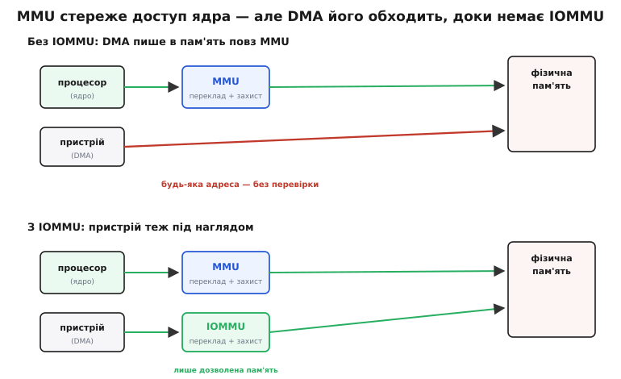
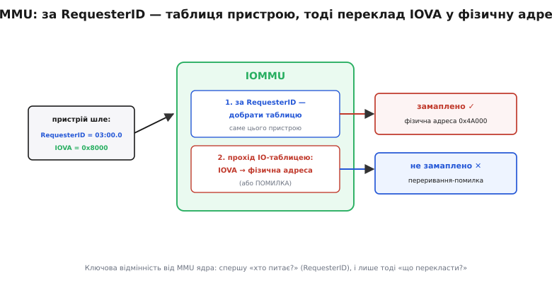
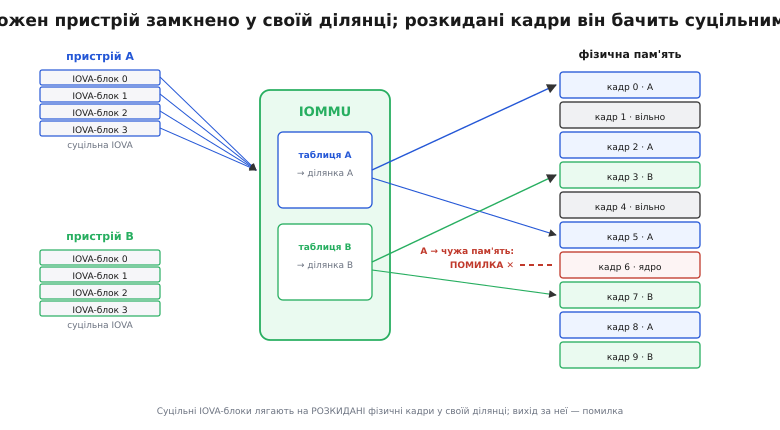

# IOMMU: трансляція адрес для пристроїв

<preknowlist>
- [Віртуальна пам'ять](root:hw-arch/virtual-memory) — процесор бачить не справжні адреси, а віртуальні; апаратура перекладає їх у фізичні через таблицю сторінок, попутно перевіряючи права.
- [DMA-контролер](root:hw-arch/dma-controller) — пристрій уміє сам читати й писати пам'ять на спільній шині, без участі ядра (є «майстром шини»).
- [TLB](root:hw-arch/tlb) — кеш недавніх перекладів адрес: влучання дає адресу за такт, промах тягне повний прохід по таблиці.
</preknowlist>

Кожне звернення процесора до пам'яті проходить через [MMU](root:hw-arch/virtual-memory) (англ. *memory management unit* — «блок керування пам'яттю»): віртуальна адреса перекладається у фізичну, і тут-таки перевіряється, чи взагалі можна туди писати. Саме ця перевірка тримає програми нарізно — одна не дотягнеться до пам'яті іншої чи до ядра. А тепер — незручне питання. Коли [DMA-пристрій](root:hw-arch/dma-controller) сам пише в пам'ять на шині, він адресує її **напряму**, фізичними адресами. На цьому шляху MMU немає. Хто ж перевіряє **його** доступ? Ніхто. Пристрій може писати за будь-якою адресою в машині — і ніщо його не спинить.

Це воднораз і зяюча діра в безпеці, і щоденна морока для драйверів. **IOMMU** (англ. *input–output memory management unit* — «блок керування пам'яттю вводу-виводу») — це той самий MMU, тільки поставлений з боку пристроїв. Розберемо, чому без нього все хитке, як він перекладає адреси пристроїв і чим принципово відрізняється від MMU ядра.

### Сліпа зона: пристрій пише повз MMU

Придивімося, що саме дає MMU ядру, — тоді стане видно, чого бракує пристроям. Коли ядро читає байт за адресою `0x4020`, ця адреса **віртуальна**: апаратура перекладає її у фізичну через таблицю сторінок і на тому ж такті звіряє права — чи ця сторінка взагалі належить цій програмі, чи можна в неї писати. Промах прав — і замість запису прилітає виняток. Уся ізоляція процесів тримається на цьому непомітному фільтрі перед пам'яттю.

Пристрій із DMA цього фільтра не має. Драйвер каже мережевій карті «клади вхідні пакети за адресою `0x4A000`», і карта на шині шле транзакції запису прямо туди — фізично, без перекладу, без перевірки прав. З цього випливають дві біди, і обидві серйозні.

Перша — **безпека**. Якщо пристрій адресує всю фізичну пам'ять, то будь-який пристрій, здатний на DMA, може прочитати чи переписати **будь-що** в машині: ключі шифрування, пам'ять ядра, чужі процеси. І це не теорія: цілий клас **DMA-атак** через FireWire, Thunderbolt чи PCIe саме на цьому й будується — під'єднану залізяку просять вичитати всю оперативну пам'ять або вписати в ядро шкідливий код, обходячи всякий програмний захист. Дослідження на кшталт Thunderclap показали, що досить встромити начебто звичайний перехідник — і без апаратної перепони DMA віддає зловмиснику всю пам'ять.

Друга біда — **незручність**. Раз пристрій знає лише фізичні адреси, то буфер для нього має бути **фізично суцільним**: простий контролер робить одну лінійну передачу й не вміє стрибати по розкиданих сторінках. А віртуальна пам'ять якраз і роздає програмам пам'ять розкиданими сторінками. Драйвер мусить або випросити рідкісний суцільний шмат фізичної пам'яті, або скласти [список розкиданих шматків](root:hw-arch/scatter-gather) і згодовувати їх пристрою по черзі. Ще гірше 32-бітному пристрою на машині з великою пам'яттю: він фізично не може виставити адресу вище 4 ГБ, тож дані доводиться спершу копіювати в низьку «перевалочну» пам'ять — зайва робота на рівному місці.


*Доступ ядра фільтрує MMU: переклад плюс перевірка прав. Пристрій із DMA б'є у фізичну пам'ять напряму — MMU на його шляху немає, тож будь-яка адреса проходить без перевірки. IOMMU затуляє цю сліпу зону: ставить такий самий фільтр на шлях пристрою.*

Щойно проблему названо так — «на шляху пристрою бракує MMU» — розв'язок стає очевидним: треба поставити MMU і туди.

### IOMMU — MMU для пристроїв

Уявімо блок, що сидить між шиною вводу-виводу й пам'яттю й робить із адресами пристроїв те саме, що MMU робить із адресами ядра. Тепер адреса, яку виставляє пристрій, — уже не фізична. Це **IOVA** (англ. *I/O virtual address* — «віртуальна адреса вводу-виводу»): пристрій оперує нею, а IOMMU перекладає її у справжню фізичну адресу за власною таблицею сторінок і відмовляє, якщо цю IOVA нікому не дозволено.

Механіка перекладу — та сама, що й у MMU ядра. IOVA розпадається на номер сторінки й зсув; номер сторінки шукається в багаторівневій таблиці, зсув переходить у фізичну адресу без змін. Ті самі сторінки, той самий прохід по таблиці. Різниця не в **тому, як** перекладати, а в одній долитій умові, якої в MMU ядра немає зовсім.

### Хто питає? RequesterID

Ось ця умова. MMU ядра будь-якої миті обслуговує **одного** — поточний процес; коли операційна система перемикає процес, вона перемикає й таблицю сторінок. Питання «чия це адреса?» відпадає само: чия зараз черга на процесорі, того й адреса.

IOMMU натомість стоїть перед **усіма** пристроями шини воднораз. Мережева карта, диск, відеокарта шлють запити впереміш, і в кожного — **свій** адресний простір і свої права. Тому, перш ніж перекладати, IOMMU мусить відповісти на нове питання: **хто саме** прислав цей запит? Бо IOVA `0x8000` від мережевої карти й та сама `0x8000` від диска мають вести в **різні** фізичні місця.

Шина дає відповідь просто. У PCIe кожна транзакція несе **RequesterID** — позначку, хто її породив; це трійка [BDF](root:com-devices/pcie) (*bus/device/function* — «шина/пристрій/функція», разом 16 бітів), унікальна для кожного пристрою. IOMMU бере цей RequesterID і за ним добирає **таблицю саме цього пристрою** — його **домен** (англ. *domain* — відведена пристрою область із власним перекладом і правами). В ARM той самий сенс має **StreamID**.

Отже переклад в IOMMU — це два питання поспіль: спершу «хто питає?» (RequesterID → домен), і лише тоді «що перекласти?» (IOVA → фізична адреса). Якщо в домені цього пристрою така IOVA замаплена — назад іде фізична адреса; якщо ні — переривання-помилка, і жодного запису в пам'ять не відбувається.


*Пристрій виставляє пару «хто я» (RequesterID) плюс «що перекласти» (IOVA). IOMMU спершу за RequesterID вибирає таблицю цього пристрою, тоді проходить нею: замаплена IOVA дає фізичну адресу, незамаплена — помилку. Ця перша сходинка — вибір таблиці за тим, хто питає, — і є те, чого в MMU ядра немає.*

### Захист: кожен пристрій замкнено у своїй ділянці

Тепер видно, як IOMMU закриває діру в безпеці. У домені пристрою замаплено **лише ті буфери**, які драйвер свідомо йому віддав, — і більш нічого. Уся інша пам'ять для цього пристрою просто не існує: спроба її торкнутися впирається в незамаплену IOVA й обертається помилкою. Мережева карта фізично не дотягнеться ні до ключів у пам'яті ядра, ні до буферів відеокарти — не тому, що «не має права», а тому, що тих адрес у її перекладі немає взагалі.

> 🔧 **Навіщо це.** Саме тому на ноутбуках вмикають IOMMU (у Intel це VT-d, у прошивці — «kernel DMA protection»): вставлений у Thunderbolt чи PCIe сторонній пристрій уже не вичитає всю оперативну пам'ять, бо IOMMU замкнув його в кількох дозволених сторінках. Це [принцип найменших привілеїв](root:sf-security/least-privilege), застосований до заліза: пристрою видно рівно стільки пам'яті, скільки треба для його роботи, і ні байтом більше. Забули ввімкнути — і пристрій знову б'є у фізичну пам'ять напряму, з усією сліпою зоною DMA назад.


*Кожному пристрою IOMMU відводить свою ділянку фізичної пам'яті й замикає його в ній: домен A не перетинається з доменом B, а пам'ять ядра для обох недосяжна. Спроба вийти за свою ділянку — помилка, а не тихий запис у чуже.*

### Зручність: розкидане знову стає суцільним

Захист — половина зиску; друга половина в тому, що переклад **прибирає** обидві незручності DMA без IOMMU — і вимогу фізично суцільного буфера, і межу 4 ГБ. Раз між пристроєм і пам'яттю тепер є переклад, драйвер може замапити **розкидані** фізичні сторінки на **суцільний** діапазон IOVA. Пристрій бачить один рівний буфер від адреси й далі, робить свою просту лінійну передачу — а IOMMU нишком розкладає її по тих розкиданих сторінках. Потреба тягати [список розкиданих шматків](root:hw-arch/scatter-gather) чи вимагати суцільну фізичну пам'ять просто зникає.

Так само розв'язується й халепа 32-бітного пристрою. Йому дають низьку IOVA, яку він здатен виставити, а IOMMU перекладає її у фізичну адресу хоч над 4 ГБ. Пристрій гадає, що працює в нижніх адресах, дані ж лежать високо — і жодного копіювання в перевалочну пам'ять не треба. Та сама ілюзія рівного простору, що її віртуальна пам'ять дає програмам, тепер дається й пристроям.

### IOTLB: той самий трюк кешування

За переклад доводиться платити, і плата знайома. Кожна нова IOVA — це **прохід по таблиці** в повільній пам'яті, тепер уже на гарячому шляху самого пристрою. Якби IOMMU щоразу ходив по таблиці, DMA загальмувала б. Тож в IOMMU є власний [TLB](root:hw-arch/tlb) — **IOTLB** (*I/O translation lookaside buffer*): кеш недавніх перекладів «IOVA → фізична адреса». Влучання дає адресу за крок; промах тягне повний прохід, а результат осідає в IOTLB для наступних звернень до тієї ж сторінки.

І гострий край той самий, що в TLB, лише болючіший. Коли драйвер **знімає** буфер (передача скінчилась, пам'ять повертається системі), IOMMU мусить **знеправити** відповідний запис в IOTLB. Забув — і в кеші лишається переклад на пам'ять, яку вже віддали комусь іншому; пристрій за старим перекладом пише в чужі дані. Тому кожне зняття буфера — це не лише викреслення рядка з таблиці, а ще й знеправлення IOTLB, і саме воно робить пару «замапити / зняти» відчутно дорожчою за звичайний запис у регістр.

### Як це бачить драйвер

Драйвер не чіпає таблиць IOMMU руками — він просить ядро. Той самий буфер він адресує **двома різними адресами**: своєю (для процесора) і виданою IOMMU (для пристрою). Ось як це виглядає в коді драйвера ядра Linux — предметно системний, близький до заліза код, тож мовою C:

```c
#include <linux/dma-mapping.h>

/* Буфер на 16 КБ, куди мережева карта клатиме вхідний пакет. */
void *cpu_buf = kmalloc(16384, GFP_KERNEL);   /* адреса для ЯДРА */

/* Попросити ядро завести переклад в IOMMU й повернути адресу ДЛЯ ПРИСТРОЮ. */
dma_addr_t dev_addr = dma_map_single(dev, cpu_buf, 16384, DMA_FROM_DEVICE);
if (dma_mapping_error(dev, dev_addr))
    return -ENOMEM;               /* IOMMU не зміг завести переклад */

/* Пристрій отримує САМЕ dev_addr (це IOVA), а не cpu_buf: */
iowrite32(dev_addr, dev->regs + REG_RX_BUF);   /* тепер DMA пише за IOVA  */
iowrite32(16384,    dev->regs + REG_RX_LEN);
/* ... карта виконала DMA й підняла переривання «готово» ... */

/* Зняти переклад: викреслити запис в IOMMU + знеправити IOTLB. */
dma_unmap_single(dev, dev_addr, 16384, DMA_FROM_DEVICE);
```

Уся суть — у двох різних адресах на один буфер. Процесор працює з `cpu_buf`, пристрій — з `dev_addr`, а IOMMU наводить між ними міст і водночас пильнує, щоб пристрій не виліз за ці 16 КБ. Під `dma_map_single` ховається саме встановлення запису в домені пристрою; під `dma_unmap_single` — його зняття разом зі знеправленням IOTLB. Що робиться під капотом цих викликів і скільки коштує пара «замапити / зняти» на потоці пакетів — у вставці [драйвер і DMA-мапінг](root:hw-arch/iommu/proj-dma-mapping.md).

### У залізі: VT-d, AMD-Vi, SMMU

У живих машинах IOMMU має різні імена. В Intel це **VT-d** (*Virtualization Technology for Directed I/O*), в AMD — **AMD-Vi**, в ARM — **SMMU** (*system memory management unit*). Ідея всюди та сама, різняться формати таблиць і дрібні можливості.

Промовиста сама назва «Virtualization Technology»: масовий IOMMU на x86 з'явився в середині 2000-х саме заради **віртуалізації**. Щоб віддати гостьовій [віртуальній машині](root:hw-arch/hardware-virtualization) справжній пристрій у пряме керування (це зветься *device passthrough* — «наскрізна передача пристрою»), треба, щоб пристрій писав у пам'ять гостя — і **тільки** гостя, не чіпаючи ні господаря, ні інших гостей. Це рівно те, що робить IOMMU: перекладає адреси, які пристрій вважає «фізичними», у справжні фізичні адреси того шматка, що виділено гостю, і замикає пристрій у ньому. Без IOMMU наскрізна передача була б негайною дірою — гостьовий пристрій дотягнувся б до всієї машини.

Сама ідея старша за x86. Ще ранні робочі станції Sun ставили IOMMU на шину SBus, мейнфрейми IBM здавна пропускали DMA через канали з перекладом, а в AMD прямим прабатьком був GART (*graphics address remapping table*) — вузький блок, що перекладав адреси для відеокарти. Як із цих розрізнених рішень виріс сьогоднішній IOMMU — у вставці [народження IOMMU](root:hw-arch/iommu/hist-iommu.md).

---

**Коротко.** Кожен доступ ядра фільтрує [MMU](root:hw-arch/virtual-memory) — переклад плюс перевірка прав, — але [DMA-пристрій](root:hw-arch/dma-controller) пише у фізичну пам'ять **напряму, повз MMU**: звідси і DMA-атаки (пристрій дістає всю пам'ять), і морока з фізично суцільними буферами й межею 4 ГБ. **IOMMU** ставить такий самий MMU з боку пристроїв: адреса пристрою стає **IOVA**, яку IOMMU перекладає у фізичну за власною таблицею й відхиляє незамаплене. Ключова відмінність від MMU ядра — спершу **«хто питає?»**: PCIe позначає кожну транзакцію **RequesterID** (BDF, 16 бітів), і за ним IOMMU добирає **домен** — таблицю саме цього пристрою. Звідси два зиски одразу: **захист** (кожен пристрій замкнено в кількох дозволених сторінках — основа kernel DMA protection і [найменших привілеїв](root:sf-security/least-privilege) для заліза) і **зручність** (розкидані сторінки лягають у суцільну IOVA, 32-бітний пристрій сягає пам'яті над 4 ГБ без перевалки). Переклади кешує **IOTLB**; зняття буфера потребує його знеправлення, інакше пристрій пише за застарілим перекладом. У залізі це Intel **VT-d**, AMD **AMD-Vi**, ARM **SMMU**; масово на x86 IOMMU прийшов заради [віртуалізації](root:hw-arch/hardware-virtualization) — безпечної наскрізної передачі пристрою в гостя.
