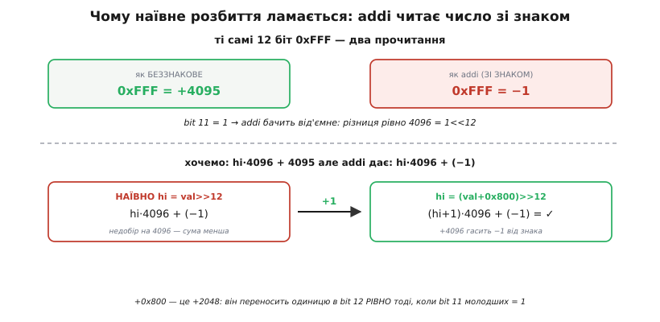
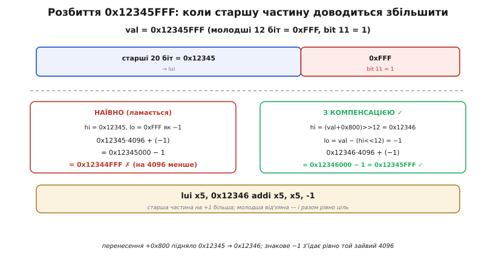

# 🧮 Чому lui й addi доводиться узгоджувати за знаком

Здавалося б, скласти велике число з двох частин — банальна арифметика першого класу. Хочеш покласти в регістр 32-бітну константу, а команда вміщає лише 12 біт числа за раз? Ну то поклади старші 20 біт однією командою, молодші 12 — другою, і вони самі складуться назад у ціле. `lui` кладе верхівку, `addi` доливає низ — і по всьому.

І майже завжди воно так і працює. Але рівно в половині випадків це «очевидне» розбиття тихо дає **не те число**. Не аварію, не помилку компіляції — просто в регістрі опиняється константа, менша за потрібну рівно на 4096. Причина не в арифметиці як такій, а в одній рисі RISC-V, про яку легко забути: молодші 12 біт `addi` читає **зі знаком**. І коли в цих 12 бітах старший біт — одиниця, `addi` чесно вважає число від'ємним, додає менше, ніж ти думав, — і сума їде.

Ця вставка виводить від першопричини, **чому** так стається, звідки береться магічна поправка `(val + 0x800) >> 12`, і чому вона гасить проблему рівно тоді, коли треба, — ані частіше, ані рідше. Наприкінці ми на конкретному числі 0x12345FFF пройдемо всю арифметику по кроках і побачимо, як старша частина «сама» підстрибує на одиницю, щоб урятувати суму.

## Спершу — чим узагалі складають велике число

Домовмося про дійових осіб. У RISC-V одна команда — це 32 біти, і на число (*immediate*) в ній лишається небагато місця: решту забрали код операції та номери регістрів. Тому 32-бітну константу кладуть **двома** командами, кожна вносить свою частину.

**`lui`** (англ. *load upper immediate* — «завантаж верхнє число») бере 20-бітне число зі своєї команди й кладе його в **старші** 20 біт регістра, а молодші 12 обнуляє. Тобто `lui` множить своє число на 2¹² = 4096: воно лягає не з нуля, а зі зсувом на 12 бітів угору.

```
lui  x5, 0x12345     // x5 = 0x12345 << 12 = 0x12345000  (молодші 12 біт = 0)
```

**`addi`** (англ. *add immediate* — «додай число») бере 12-бітне число й **додає** його до регістра. Саме `addi` має долити ті молодші 12 біт, які `lui` лишив нулями.

```
addi x5, x5, 0x678   // x5 = 0x12345000 + 0x678 = 0x12345678
```

Разом виходить рівність, на якій тримається все розбиття:

```
val  =  hi · 4096  +  lo         де  hi — 20 біт від lui,  lo — 12 біт від addi
```

Поки все чисто. `hi = 0x12345`, `lo = 0x678`, множимо, додаємо — маємо `0x12345678`. Спокуса очевидна: щоб дістати `hi`, просто відкинь молодші 12 біт (`val >> 12`); щоб дістати `lo`, візьми самі молодші 12 біт (`val & 0xFFF`). Ця пара — назвімо її **наївним розбиттям** — правильна для `0x12345678`. І вона ж непомітно ламається на сусідньому числі.

> 🔧 **Навіщо це.** Це не абстрактна головоломка — це рівно те, що робить кожен асемблер і лінкер, коли розгортає псевдокоманду `li rd, constant` («завантаж константу») у реальну пару `lui`+`addi`, і що ховається за релокаціями `R_RISCV_HI20` / `R_RISCV_LO12_I` в об'єктних файлах. Коли адреса чи константа збирається «майже правильно, але на 0x1000 мимо», причина майже завжди тут. Розуміння цієї арифметики — різниця між «магічний `+0x800`, який усі копіюють» і «я бачу, чому воно точно компенсує».

## Означення: як `addi` насправді читає свої 12 біт

Уся заковика — в одному слові: **зі знаком**. Число в `addi` — це не просто 12 бітів, а 12 бітів у [доповняльному коді](topic:sf-lang/sign-extension) (англ. *two's complement*), де старший, 11-й біт — **знаковий**. При виконанні команди процесор бере ці 12 біт і [розширює знак](topic:sf-lang/sign-extension) до повних 32: якщо biт 11 нульовий, старші 20 біт заллються нулями; якщо biт 11 одиничний — заллються **одиницями**. Тобто те саме поле команди означає різні числа залежно від одного біта:

```
12 біт  0x7FF  (bit 11 = 0)  →  розширення нулями  →  +2047   (найбільше додатне)
12 біт  0x800  (bit 11 = 1)  →  розширення одиницями →  −2048   (найменше від'ємне)
12 біт  0xFFF  (bit 11 = 1)  →  розширення одиницями →  −1
```

Ось перший тривожний рядок. Молодші 12 біт `0xFFF` — це, як беззнакове число, `+4095`. Але `addi` **ніколи** не додасть `+4095`: для нього `0xFFF` — це `−1`. Тобто 12-бітне поле `addi` вміщає не `0…4095`, а лише `−2048…+2047`. Значень усе ще 4096, але діапазон зсунуто в мінус.


*Ті самі 12 біт `0xFFF` мають два прочитання: як беззнакове число це `+4095`, але `addi` читає їх зі знаком — і для нього це `−1`. Різниця між двома прочитаннями рівно `4096 = 2¹²`. Тому наївне розбиття (ліворуч) додає `hi·4096 + (−1)` — суму, меншу за потрібну на 4096. Поправка `+1` до старшої частини (праворуч) повертає той зниклий 4096. А `+0x800` — це якраз `+2048`: він переносить одиницю в 12-й розряд рівно тоді, коли biт 11 молодших дорівнює 1.*

## Інтуїція: де саме ламається наївне розбиття

Тепер зіткнімо наївну формулу з реальністю `addi`. Наївно ми хотіли:

```
val  =  hi · 4096  +  lo         (lo беззнакове, 0…4095)
```

Але `addi` фізично додає не беззнакове `lo`, а **знакове** значення тих самих бітів. Позначмо його `lo_signed`. Поки biт 11 нульовий (`lo` від 0 до 2047), знакове й беззнакове прочитання збігаються — `lo_signed = lo` — і наївна формула справджується. Проблема з'являється, коли biт 11 одиничний (`lo` від 2048 до 4095). Тоді знакове прочитання менше за беззнакове рівно на 4096:

```
lo_signed  =  lo − 4096          (коли bit 11 = 1)
```

Підставмо це в те, що насправді опиниться в регістрі:

```
факт  =  hi · 4096  +  lo_signed  =  hi · 4096  +  lo − 4096  =  (hi − 1) · 4096  +  lo
```

Ось воно, чорним по білому. Коли biт 11 молодшої частини — одиниця, `addi` через своє знакове розширення додає на 4096 менше, ніж треба, — і фактична сума виходить така, ніби старша частина `hi` **на одиницю менша**. Наївне розбиття недобирає рівно `1 · 4096`.

І звідси одразу видно ліки. Якщо `addi` поводиться так, наче з'їв одиницю зі старшої частини, то дай йому цю одиницю наперед: **збільш `hi` на 1**. Тоді `(hi + 1)` мінус той самий `1`, який відкусить знакове розширення, дасть назад правильне `hi`:

```
(hi + 1) · 4096  +  (lo − 4096)  =  hi · 4096  +  lo  =  val    ✓
```

Компенсація — це не хитрий трюк, а буквальне повернення однієї одиниці, яку краде знаковий біт. Уся дотепність — у тому, щоб додавати цю одиницю **тільки** коли biт 11 справді одиничний, а коли ні — не чіпати нічого. І тут з'являється `+0x800`.

## Формальний апарат: звідки береться `(val + 0x800) >> 12`

Нам потрібна формула, що обчислює `hi` й **сама** підстрибує на одиницю рівно тоді, коли biт 11 молодшої частини — одиниця. Дивовижно, але це робить одне-єдине додавання перед зсувом.

Згадаймо, що `0x800` — це `2048 = 2¹¹`, тобто число з однією одиницею рівно в 11-му розряді — тому самому знаковому. Що станеться, коли ми додамо `0x800` до `val` **перед** тим, як зсувати?

Розгляньмо молодші 12 біт `val` (це число від 0 до 4095) і додаймо до них `0x800 = 2048`:

- **Якщо biт 11 = 0** (молодші біти в діапазоні `0…2047`): додавання `2048` дає щонайбільше `2047 + 2048 = 4095`. Це все ще вміщається в 12 біт — **переносу в 12-й розряд немає**. Старші 20 біт `val` не зачеплені, і `>> 12` дасть той самий `hi = val >> 12`.
- **Якщо biт 11 = 1** (молодші біти в діапазоні `2048…4095`): додавання `2048` дає `2048 + 2048 = 4096` і більше — а `4096 = 2¹²` **вже не вміщається** в 12 біт. Виникає **перенос (carry) у 12-й розряд**, який додається до старших 20 біт. Отже `>> 12` дасть `hi = (val >> 12) + 1`.

Тобто `+0x800` — це детектор знакового біта, вбудований в арифметику переносу. Він додає одиницю до старшої частини **тоді й лише тоді**, коли biт 11 молодшої частини одиничний, — тобто рівно в тих випадках, коли знакове розширення `addi` збирається вкрасти 4096. Одне додавання робить і перевірку умови, і саму поправку. Формула для старшої частини:

```
hi  =  (val + 0x800)  >>  12          // >> як БЕЗзнаковий зсув 32-бітного числа
```

А молодшу частину після цього не можна брати наївно як `val & 0xFFF` — треба взяти те, що узгоджується з уже поправленим `hi`. Найчистіше — визначити `lo` як **різницю**, і одразу як знакове 12-бітне число:

```
lo  =  val − (hi << 12)               // трактувати як signed 12-бітне (−2048…2047)
```

Ця різниця автоматично виходить у правильному діапазоні `−2048…+2047` — саме тому, що `hi` округлене «до найближчого» через `+0x800`, а не завжди вниз. Коли поправки не було, `lo` вийде додатним (`0…2047`); коли поправка спрацювала, `lo` вийде від'ємним (`−2048…−1`) — і це рівно те від'ємне число, яке `addi` очікує побачити у своїх 12 бітах. Дві формули замикаються одна на одну: `hi` округлюється так, щоб `lo` завжди влазило в знаковий діапазон `addi`.

> 🔧 **Навіщо це.** Той самий `+0x800`-трюк лежить в основі не лише `lui`+`addi`, а й пари `auipc`+`addi` для обчислення адрес відносно лічильника команд (*PC-relative*), і релокацій `%hi()`/`%lo()`, які ви бачите в асемблерному виводі компілятора. Скрізь, де 32-бітну величину складають зі старших 20 і молодших 12 біт через знакове `addi`, працює ця сама компенсація. Один раз зрозумівши її тут, ви впізнаєте її всюди.

## Worked-приклад: розбиваємо 0x12345FFF по кроках

Візьмімо число, де компенсація **потрібна**: `val = 0x12345FFF`. Молодші 12 біт — `0xFFF`, а це `1111 1111 1111`: biт 11 (старший із дванадцяти) — одиниця. Отже, знакове розширення `addi` тут кусатиметься, і наївне розбиття має дати недобір. Перевірмо обидва шляхи в лоб.

**Наївний шлях — і як він ламається:**
:::tabs
```c
uint32_t val = 0x12345FFF;
uint32_t hi  = val >> 12;         // 0x12345
uint32_t lo  = val & 0xFFF;       // 0xFFF

// що реально виконає процесор:
//   lui  x5, 0x12345    →  x5 = 0x12345000
//   addi x5, x5, 0xFFF  →  0xFFF як signed = −1, тож x5 += (−1)
//   x5 = 0x12345000 + (−1) = 0x12344FFF        ✗
// отримали 0x12344FFF замість 0x12345FFF — рівно на 0x1000 = 4096 менше
```
```python
val = 0x12345FFF
hi  = val >> 12                   # 0x12345
lo  = val & 0xFFF                 # 0xFFF

# що реально виконає процесор:
#   lui  x5, 0x12345    →  x5 = 0x12345000
#   addi x5, x5, 0xFFF  →  0xFFF як signed = −1, тож x5 += (−1)
#   x5 = 0x12345000 + (−1) = 0x12344FFF        ✗
# отримали 0x12344FFF замість 0x12345FFF — рівно на 0x1000 = 4096 менше
```
:::

Недобір рівно `0x1000`, як і передбачила формула `(hi − 1)·4096`. А тепер — з компенсацією.

**Правильний шлях — з поправкою `+0x800`:**
:::tabs
```c
uint32_t val = 0x12345FFF;

uint32_t hi = (val + 0x800) >> 12;    // крок 1
//   val + 0x800 = 0x12345FFF + 0x800 = 0x123467FF
//   0x123467FF >> 12 = 0x12346        ← старша частина ПІДСТРИБНУЛА на +1

int32_t lo = (int32_t)(val - ((uint32_t)hi << 12));   // крок 2
//   hi << 12 = 0x12346 << 12 = 0x12346000
//   lo = 0x12345FFF − 0x12346000 = −1  (як signed 12-бітне: 0xFFF)

// що виконає процесор:
//   lui  x5, 0x12346    →  x5 = 0x12346000
//   addi x5, x5, -1     →  x5 = 0x12346000 + (−1) = 0x12345FFF   ✓
```
```python
val = 0x12345FFF

hi = (val + 0x800) >> 12               # крок 1
#   val + 0x800 = 0x12345FFF + 0x800 = 0x123467FF
#   0x123467FF >> 12 = 0x12346         ← старша частина ПІДСТРИБНУЛА на +1

lo = val - (hi << 12)                  # крок 2
lo = lo - 0x1000 if lo & 0x800 else lo # трактувати як signed 12-бітне
#   hi << 12 = 0x12346 << 12 = 0x12346000
#   lo = 0x12345FFF − 0x12346000 = −1  (як signed 12-бітне: 0xFFF)

# що виконає процесор:
#   lui  x5, 0x12346    →  x5 = 0x12346000
#   addi x5, x5, -1     →  x5 = 0x12346000 + (−1) = 0x12345FFF   ✓
```
:::

Сходиться до біта. Простежмо, що сталося по суті: `+0x800` додало `2048` до `0xFFF`, викликало перенос у 12-й розряд, і той підняв старшу частину `0x12345 → 0x12346`. Потім знакове розширення `addi` відняло рівно один `4096` (бо `−1` замість наївного `+4095`) — і зайвий `4096`, який ми навмисне додали через перенос, погасився. Дві протилежні одиниці зустрілися й скоротилися, лишивши точну ціль.


*Число `0x12345FFF` ділиться на старші 20 біт (`0x12345`) і молодші 12 (`0xFFF`), і в молодших biт 11 дорівнює одиниці — тож `addi` читатиме їх як `−1`. Ліворуч: наївне `hi = 0x12345` дає `0x12345000 + (−1) = 0x12344FFF` — на 4096 менше за ціль. Праворуч: `hi = (val + 0x800) >> 12 = 0x12346`, `lo = val − (hi<<12) = −1`, і `0x12346000 + (−1) = 0x12345FFF` — точно. Перенесення `+0x800` підняло старшу частину, а знакове `−1` з'їло рівно той зайвий 4096. Разом виходять команди `lui x5, 0x12346` і `addi x5, x5, -1`.*

Для контрасту — число, де компенсація **не** потрібна: `val = 0x12345678`. Молодші 12 біт `0x678 = 0110 0111 1000`, biт 11 нульовий. Тоді `val + 0x800 = 0x12345E78`, зсув `>> 12` дає `0x12345` — та сама старша частина, поправки немає; `lo = 0x678` виходить додатним. Формула `(val + 0x800) >> 12` тихо звелася до `val >> 12`, бо переносу не було. Одна й та сама формула поводиться правильно в обох випадках — у цьому й краса: не треба окремої гілки `if`, арифметика переносу сама вирішує, коли підняти старшу частину.

## Чому знаковий біт immediate у RISC-V завжди в bit 31 команди

Лишилося пояснити глибше архітектурне «чому», що стоїть за всім цим. Ми виходили з того, що `addi` розширює своє 12-бітне число **зі знаком**. Але ж біт-знак у 12-бітному полі — це biт 11 самого числа. А в 32-бітному **слові команди** це поле лежить не з краю: у форматі I-типу воно займає біти 20…31. Виходить, що знаковий біт числа (biт 11 поля) фізично сидить у **31-му, найстаршому біті всієї команди**. І це не випадковість — RISC-V тримає знаковий біт **будь-якого** immediate завжди в biт 31 команди, у всіх форматах (I, S, B, U, J), навіть коли решта бітів числа розкидана по команді врозсип.

Причина — швидкість [декодування](topic:math-number-theory/why-binary). Розширення знака означає одне: взяти знаковий біт і **розмножити** його по всіх старших розрядах результату. Якби цей біт у різних форматах команди сидів у різних місцях, декодер мусив би спершу з'ясувати формат команди (розібрати опкод), і лише тоді знати, звідки брати знак, — тобто розширення знака довелося б **чекати** кінця розбору опкоду. А розбір опкоду — на критичному шляху, від нього й так усе залежить.

RISC-V прибирає цю залежність зухвало просто: знаковий біт **завжди** в одному місці — biт 31. Тому дроти, що розмножують знак на старші розряди, можна вести від фіксованого біта команди **паралельно** з розбором опкоду — ще не знаючи, чи це `addi`, `lw`, гілка чи `jal`. Розширення знака стартує в ту саму мить, коли команда з'явилася на входах декодера, не чекаючи ні на що. Це та сама філософія, що й тримати номери регістрів на однакових позиціях у всіх форматах: розкладку бітів команди підганяють не «щоб гарно вліз запис», а щоб залізо декодувало якнайшвидше, роблячи незалежні речі водночас.

Ось чому вся ця історія з `+0x800` існує саме в такій формі. `addi` розширює зі знаком не тому, що комусь так забаглося, а тому, що знакове розширення — фундаментальна, апаратно найдешевша операція, яку RISC-V поставив на критичний шлях і оптимізував до межі. Плата за цю швидкість — те, що молодші 12 біт великої константи іноді доводиться подавати як від'ємні, а старшу частину за це компенсувати одиницею. Мікроскопічна ціна: одне додавання `+0x800` в асемблері проти виграшу в кожному такті кожного декодування. Кодування, як завжди, продумане на користь заліза — а ця арифметична поправка є тінню, яку те рішення відкидає на софт.

## Що лишається в руках

Складання великої константи двома командами тримається на одній рівності — `val = hi·4096 + lo` — і на одній підступності: `addi` читає `lo` **зі знаком**, тож коли biт 11 молодшої частини одиничний, воно додає на 4096 менше, ніж наївно очікуєш. Компенсація `hi = (val + 0x800) >> 12` вбудовує детектор цього біта прямо в арифметику переносу: `+0x800` викликає перенос у 12-й розряд **рівно тоді**, коли biт 11 одиничний, піднімаючи старшу частину на одиницю саме тоді, коли треба. Молодшу частину беруть як `lo = val − (hi << 12)`, і вона сама лягає в знаковий діапазон `−2048…+2047`, який `addi` очікує. Ані окремої перевірки, ані гілки `if` — сам перенос вирішує, коли підправити старшу частину.

А глибше під цим — архітектурне рішення тримати знаковий біт immediate завжди в biт 31 команди, щоб розширення знака йшло паралельно з розбором опкоду й не чекало на нього. Знакове читання `addi` — не примха, а прямий наслідок цієї оптимізації, і `+0x800`-поправка — рівно та ціна, яку софт платить за швидке залізо. Один раз простеживши, як зайвий `4096` від переносу гаситься знаковим `−1` від `addi`, ви впізнаєте цю компенсацію всюди — у `auipc`, у релокаціях `%hi`/`%lo`, у кожній 32-бітній адресі, що складається зі старших 20 і молодших 12 біт.
