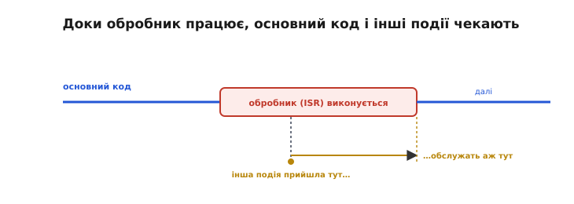
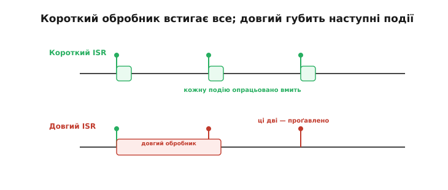
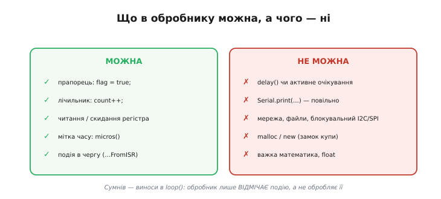
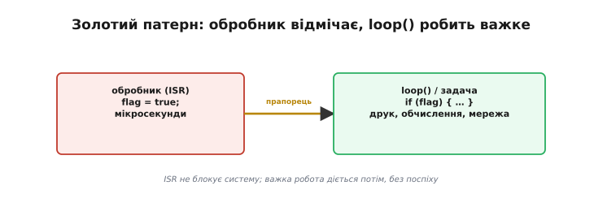
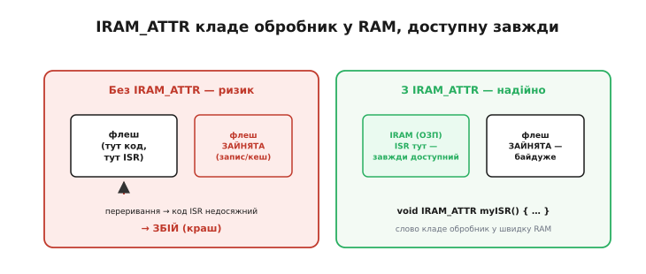
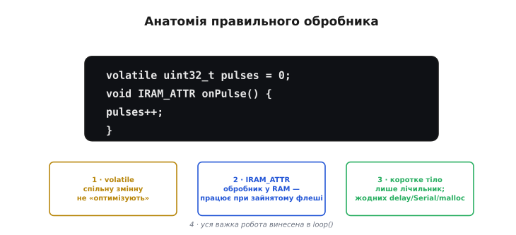

# ISR (обробник переривання)

Коли в мікроконтролері щось трапляється — натиснули кнопку, прийшов байт, спрацював таймер, — процесор кидає поточну роботу й біжить виконувати спеціальну функцію-реакцію. Цю функцію звуть **обробником переривання**, або ISR (англ. *Interrupt Service Routine* — «підпрограма обслуговування переривання»). Навколо неї є одне правило, яке повторюють як заповідь: обробник має бути **коротким**. Справжня користь — не в самому правилі, а в розумінні, **чому** воно діє і що з нього випливає на практиці: чому довгий обробник шкодить усій системі, що в ньому **можна** робити, а чого — **категорично ні**, який шаблон рятує від помилок і що означає загадкове слово `IRAM_ATTR` на ESP32.

### Поки обробник працює — світ на паузі

Коли стається переривання, процесор [кидає основний код і виконує обробник](root:hw-arch/interrupt-vector). А це означає, що **поки обробник працює, основний код стоїть**. Мало того: на час обробника зазвичай притримуються й інші переривання того ж або нижчого пріоритету — вони чекають своєї черги. Виходить, обробник на ті миті, що він триває, ставить на паузу **майже всю** систему.


*Доки обробник виконується, основний код призупинено, а інші події змушені чекати. Що довший обробник, то довше «висить» уся система: спізнюються інші переривання, зростає тремтіння в часі реакції, гальмує планувальник. Звідси й головне правило — обробник якнайкоротший.*

Звідси й видно, чому довжина обробника — не дрібниця, а питання справності всього пристрою. Затримався обробник на мілісекунду — і на цю мілісекунду оглухли всі інші переривання, збився точний відлік часу, підвис обмін даними. Обробник — це наче пожежна тривога: поки вона гуде, усі інші справи завмирають, тож гудіти вона має **коротко й по ділу**.

Є й жорсткіший наслідок, ніж просто спізнення. ESP32 має апаратного «сторожа» — сторожовий таймер (англ. *watchdog* — «сторожовий пес»), що стежить, чи не завис процесор. Якщо обробник (або ланцюг обробників) тримає систему надто довго, не даючи їй дихнути, сторож вирішує, що сталося зависання, — і **перезавантажує** плату. Окремий сторож саме за перериваннями спрацьовує вже за частки секунди безперервної роботи в обробнику. Тобто задовгий обробник не просто гальмує: він здатен узагалі **скинути** пристрій. Те саме стосується [планувальника операційної системи](root:sf-os/scheduler): доки крутиться обробник, планувальник не може перемкнути задачі, і вся багатозадачність завмирає.

### Короткий встигає все, довгий губить події

Особливо боляче довгий обробник б'є тоді, коли події йдуть **часто**. Уявімо три імпульси підряд. Короткий обробник встигає опрацювати кожен і звільнитися до наступного. А довгий — усе ще «зайнятий» першим, коли приходять другий і третій, — і вони просто **пропадають**, бо обробник їх не почув.


*Три події підряд. Угорі — короткий обробник: кожну опрацьовано вмить. Унизу — довгий: поки він порається з першою, друга й третя надходять і губляться, бо обробник ще зайнятий. Для частих подій довгий обробник означає втрачені дані.*

Це та сама біда, що з [пропуском подій при опитуванні](root:hw-arch/interrupts), тільки тепер винне не опитування, а **сам обробник**, що задовго тримає систему. Парадоксально, але переривання з довгим обробником може бути **гіршим** за просте опитування. Тому ціль завжди одна: щоб обробник відпрацював за лічені мікросекунди й звільнив систему.

Наскільки ж коротким має бути «короткий»? Чіткого порога нема, але є робочий орієнтир: добрий обробник укладається в **одиниці мікросекунд**, прийнятний — у десятки; усе, що тягне на сотні мікросекунд і більше, майже напевно слід переробити. Корисний прийом самоперевірки — заміряти тривалість обробника, відмітивши на вході й виході показ мікросекундного лічильника (`micros()` в Arduino, `esp_timer_get_time()` в ESP-IDF, лічильник таймера чи DWT на STM32), або просто рахувати, скільки подій устигаєте обробити. Якщо лічильник «недобирає» подій — обробник задовгий, і частину роботи треба винести в головний цикл (`loop()` в Arduino, `while (1)` у `main`, окрема задача RTOS).

### Що в обробнику можна, а чого — ні

З цього випливає чіткий перелік дозволеного й забороненого. **Можна** все, що швидке й безпечне: підняти прапорець (`flag = true`), збільшити лічильник (`count++`), прочитати чи скинути апаратний регістр, запам'ятати мить події (`micros()`), покласти повідомлення в чергу спеціальним «з-переривання» викликом. **Не можна** нічого повільного чи блокувального.


*Ліворуч — можна: прапорець, лічильник, читання чи скидання регістра, мітка часу `micros()`, подія в чергу. Праворуч — не можна: `delay()`, `Serial.print`, мережа, файли, блокувальний обмін по I2C чи SPI, `malloc`/`new`, важка математика й дробові числа. Правило просте: усе повільне чи блокувальне — у `loop()`.*

Розгляньмо заборони по черзі, бо кожна має причину. **Пауза** (`delay()` в Arduino, `HAL_Delay()` на STM32, `vTaskDelay()` у FreeRTOS) в обробнику безглузда й небезпечна — вона спирається на лічильник часу чи планувальник, а ті самі потребують переривань, тож в обробнику просто зависне. **Вивід у консоль** (`Serial.print`, `printf`, `ESP_LOGI`) повільний (мілісекунди) і теж сам спирається на [переривання](root:hw-arch/interrupt-vector) — викликати його з обробника означає чекати на те, що зараз заблоковане. **Блокувальні** операції (чекати відповіді мережі, прочитати файл, дочекатися завершення обміну по I2C) можуть тривати скільки завгодно — а обробникові не можна. **`malloc`/`new`** (виділення пам'яті з купи) здатні **заклинити** систему: купу захищає замок, і якщо переривання застане основний код саме посеред роботи з нею, обробник або зруйнує її структури, або (на FreeRTOS) аварійно завершиться — бо брати замок-м'ютекс із переривання заборонено; до того ж саме виділення повільне й непередбачуване. І нарешті **важка математика** (особливо з дробовими числами) — і повільна, і на ESP32 вимагає обережності зі станом співпроцесора, тож їй місце в `loop()`.

Два пункти з «можна» варті уточнення. Мітка часу `micros()` безпечна тому, що лише **читає** апаратний лічильник, не чекаючи нічого, — тож зафіксувати в обробнику точний момент події цілком гаразд. А **черга** — це коли обробникові треба не просто крикнути «була подія», а **передати дані** (наприклад, який саме байт прийшов). Для цього в [операційній системі реального часу](root:sf-devices/freertos) є спеціальні «з-переривання» виклики (їхні назви закінчуються на `FromISR`), безпечні всередині обробника. Головне тут — що навіть передавання даних з обробника роблять особливим, швидким способом, а не звичайним повільним викликом.

Чому ж саме ці виклики небезпечні — не лише через повільність, а через прихований спільний стан усередині них (статичний буфер, замок купи) — окрема й варта уваги історія: [реентерабельність](root:hw-arch/isr/proj-reentrancy.md) пояснює механізм, через який навіть швидкий виклик здатен тихо зруйнувати дані.

> 🔧 **Навіщо це.** Запам'ятайте один рятівний критерій: **сумнів — виноси в `loop()`**. Обробник має лише **відмітити**, що подія сталася, а не **обробляти** її. Майже всі «загадкові зависання» з перериваннями — це повільна або блокувальна дія, що пролізла в обробник. Якщо тримати його аскетично коротким, цілий клас цих бід просто не виникає.

### Золотий патерн: відмітити в обробнику, обробити в loop

Як же тоді робити щось серйозне у відповідь на подію, якщо в обробнику нічого не можна? Відповідь — **відкласти** роботу. Обробник робить мінімум (піднімає прапорець або кладе подію в чергу) і миттю звільняється, а вся справжня робота діється потім, у `loop()` чи окремій задачі, де немає жодних обмежень обробника. Це і є **золотий патерн** [переривань](root:hw-arch/interrupts).


*Обробник лише піднімає прапорець (мікросекунди) — і звільняє систему. А `loop()` чи задача, побачивши прапорець, виконує важку роботу без поспіху: друк, обчислення, мережу — будь-що. Так реакція лишається миттєвою, а складна обробка нікому не заважає.*

Цей розподіл «швидко відмітити — неквапом обробити» — головний прийом усієї роботи з перериваннями. Складніший його варіант використовує не простий прапорець, а **чергу** подій (щоб не загубити кілька подій поспіль і передати дані) — але це вже царина [операційної системи реального часу](root:sf-devices/freertos). Простіший шаблон «прапорець в обробнику — обробка в `loop()`» закриває переважну більшість потреб.

> ⚙️ **Три форми відкладання.** Прапорець — лише найпростіша. Далі сходинками йдуть **черга подій** (потік даних) і **задача-обробник** в RTOS (важка, структурована робота). Коли яку брати — з псевдокодом і пастками — у вставці [Відкладена робота](root:hw-arch/isr/proj-deferred-work.md).

Одну пастку простого прапорця назвімо одразу. Булева змінна `flag` лише каже «**хоч раз** сталося», але **не рахує**: якщо до того, як `loop()` її прочитає, подія станеться двічі, ви все одно побачите лише одне `true` — другу втрачено. Тому коли події треба **рахувати** (імпульси, натиски), в обробнику беруть не прапорець, а **лічильник** (`count++`), як у прикладі нижче. А коли важливі ще й **дані** кожної події — повноцінну чергу. Вибір «прапорець / лічильник / черга» визначається тим, що саме ви не маєте права втратити.

У цього розподілу є й усталена назва. Швидку частину, що діється просто в обробнику, інженери звуть «**верхньою половиною**» переривання (англ. *top half*), а відкладену, неквапну обробку в `loop()` чи задачі — «**нижньою половиною**» (англ. *bottom half*). Поділ на дві половини — не примха конкретного чипа, а класичний прийом, що його застосовують скрізь, від крихітних мікроконтролерів до ядра великих операційних систем. Цей образ упізнаватиметься в будь-якій системі з перериваннями.

### IRAM_ATTR: щоб обробник не впав, коли флеш зайнятий

На ESP32 є ще одна специфічна, але важлива вимога до обробника. Код програми зазвичай живе у **флеш-пам'яті** (зовнішній SPI-флеш), звідки процесор його підвантажує через кеш. Проблема в тому, що флеш буває **тимчасово недоступний** — наприклад, коли система пише в нього дані або коли інше ядро виконує флеш-операцію. І якщо саме в цей момент станеться переривання, а код обробника лежить у флеші — процесор не зможе його дістати, і станеться **збій**.


*Ліворуч — небезпека: обробник у флеші, а флеш саме зайнятий (запис чи кеш-промах), тож код обробника недосяжний — і краш. Праворуч — рятунок: слово `IRAM_ATTR` кладе обробник у внутрішню RAM (IRAM), доступну завжди, тож зайнятість флеша йому байдужа.*

Рятує спеціальне слово-позначка **`IRAM_ATTR`** (від англ. *Instruction RAM attribute* — «ознака: у пам'ять інструкцій»): воно наказує покласти обробник у внутрішню оперативну пам'ять (IRAM), що доступна **завжди**, незалежно від стану флеша. Тому всі обробники переривань на ESP32 позначають `void IRAM_ATTR myISR() { … }`. Важлива тонкість: це стосується не лише самого обробника, а й **усього, що він викликає**, — будь-яка функція, яку обробник смикає, теж має бути в IRAM, інакше пастка повертається. Це ще одна причина тримати обробник простим: що менше він робить і викликає, то легше гарантувати, що все потрібне — у безпечній пам'яті.

Тонкість сягає й **даних**. Якщо обробник звертається до сталих (наприклад, рядка чи таблиці), вони теж не повинні лежати лише у флеші, інакше повертається та сама пастка недоступності. На щастя, прості змінні (лічильники, прапорці) живуть у швидкій RAM за замовчуванням, а Arduino-обгортка `attachInterrupt` сама дбає про чимало цих дрібниць, — тож для типового короткого обробника досить просто не забути `IRAM_ATTR` і не кликати «важких» бібліотек.

> 🔧 **Навіщо це.** Якщо переривання на ESP32 «іноді» вішає плату або скидає її без видимої причини — перша підозра саме на `IRAM_ATTR`: або його забули на обробнику, або обробник викликає функцію з флеша. Це підступний баг, бо проявляється **зрідка** (лише коли переривання збіглося з флеш-операцією). Узяти за звичку позначати кожен обробник `IRAM_ATTR` і не кликати з нього «важких» бібліотечних функцій — і проблеми не буде.

### Анатомія правильного обробника

Зведімо всі правила в один зразок. Добрий обробник має чотири ознаки: він **короткий** (лише найнеобхідніше), його код доступний **завжди** (на ESP32 — `IRAM_ATTR`), спільні з основним кодом змінні він позначає [**`volatile`**](root:sf-lang/volatile) (щоб компілятор їх не «оптимізував»), і в ньому **нема** нічого повільного чи блокувального.


*Чотири ознаки доброго обробника: спільну змінну оголошено `volatile`; сам обробник позначено `IRAM_ATTR`; тіло — лише лічильник, жодних `delay`/`Serial`/`malloc`; уся «важка» робота винесена в `loop()`.*

Складімо це в робочий приклад — лічильник імпульсів, де переривання справді необхідне ([імпульси можуть іти швидше за цикл](root:hw-arch/interrupts)), а вся обробка винесена в `loop()`.

**Лічильник імпульсів: короткий обробник і обробка в головному циклі.** Хай яке середовище, деталей рівно три: піна-вхід із підтяжкою й перериванням по спаду, обробник, що тільки збільшує лічильник, і головний цикл, який раз на секунду знімає накопичене й друкує.

:::tabs
```arduino
volatile uint32_t pulses = 0;          // спільний лічильник — тому volatile

void IRAM_ATTR onPulse() {             // короткий обробник, у RAM
  pulses++;                            // лише рахуємо — і все
}

void setup() {
  pinMode(SENSOR, INPUT_PULLUP);
  attachInterrupt(digitalPinToInterrupt(SENSOR), onPulse, FALLING);
}

void loop() {
  static uint32_t last = 0;
  if (millis() - last >= 1000) {       // раз на секунду
    last = millis();
    noInterrupts();                    // безпечно зняти спільне значення
    uint32_t n = pulses; pulses = 0;
    interrupts();
    Serial.println(n);                 // друк — у loop(), НЕ в обробнику
  }
}
```
```esp-idf
#include "driver/gpio.h"
#include "esp_attr.h"
#include "esp_log.h"
#include "freertos/FreeRTOS.h"
#include "freertos/task.h"

#define SENSOR GPIO_NUM_4
static const char *TAG = "pulses";
static portMUX_TYPE mux = portMUX_INITIALIZER_UNLOCKED;
static volatile uint32_t pulses = 0;   // спільний лічильник — тому volatile

static void IRAM_ATTR on_pulse(void *arg) {   // короткий обробник, у RAM
    pulses++;                                 // лише рахуємо — і все
}

void app_main(void) {
    gpio_config_t cfg = {
        .pin_bit_mask = 1ULL << SENSOR,
        .mode         = GPIO_MODE_INPUT,
        .pull_up_en   = GPIO_PULLUP_ENABLE,
        .intr_type    = GPIO_INTR_NEGEDGE,    // спад — те саме, що FALLING
    };
    gpio_config(&cfg);
    gpio_install_isr_service(ESP_INTR_FLAG_IRAM);
    gpio_isr_handler_add(SENSOR, on_pulse, NULL);

    while (1) {
        vTaskDelay(pdMS_TO_TICKS(1000));      // раз на секунду
        portENTER_CRITICAL(&mux);             // безпечно зняти спільне значення
        uint32_t n = pulses; pulses = 0;
        portEXIT_CRITICAL(&mux);
        ESP_LOGI(TAG, "%u", (unsigned)n);     // друк — у задачі, НЕ в обробнику
    }
}
```
```stm32
#include "stm32f4xx_hal.h"

volatile uint32_t pulses = 0;          // спільний лічильник — тому volatile

// HAL кличе цей callback з обробника EXTI — спільний на всі лінії
void HAL_GPIO_EXTI_Callback(uint16_t pin) {
    if (pin == SENSOR_Pin) pulses++;   // лише рахуємо — і все
}

int main(void) {
    HAL_Init();
    SystemClock_Config();
    MX_GPIO_Init();                    // піна SENSOR: GPIO_MODE_IT_FALLING + GPIO_PULLUP
    HAL_NVIC_SetPriority(EXTI0_IRQn, 5, 0);
    HAL_NVIC_EnableIRQ(EXTI0_IRQn);    // дозволити переривання лінії

    uint32_t last = 0;
    while (1) {
        if (HAL_GetTick() - last >= 1000) {   // раз на секунду
            last = HAL_GetTick();
            __disable_irq();                  // безпечно зняти спільне значення
            uint32_t n = pulses; pulses = 0;
            __enable_irq();
            printf("%lu\r\n", (unsigned long)n);  // друк — у main, НЕ в обробнику
        }
    }
}
```
:::

Кожен рядок утілює правило: обробник короткий, спільний лічильник `pulses` оголошено `volatile`, а вся «важка» робота — рахунок раз на секунду й друк — діється в головному циклі чи задачі, де їй ніщо не заважає (на ESP32 обробник ще й позначено `IRAM_ATTR`; на STM32 код виконується просто з флеша, і цієї турботи нема). Зверніть увагу й на коротке заборонення переривань навколо знімання значення (`noInterrupts()`/`interrupts()`, `portENTER_CRITICAL`, `__disable_irq()`) — це безпечне [«вихоплення» спільної змінної](root:sf-tasks/atomicity-races), щоб переривання не змінило `pulses` саме посеред читання й обнулення.

Ще про форму обробника. Хай яке середовище, обробник — це функція **без результату**: перериванню нема куди повернути значення, воно лише «трапляється». В Arduino звичайний обробник для `attachInterrupt` не має й аргументів (`void onPulse()`) — передати йому нема кому. Якщо ж одну функцію-обробник треба повісити на кілька ніжок і розрізняти їх, кожне середовище дає це по-своєму: в Arduino-ESP32 є варіант `attachInterruptArg`, що передасть в обробник вказівник на ваші дані; в ESP-IDF `gpio_isr_handler_add` передає такий вказівник завжди; а STM32 HAL кличе один спільний `HAL_GPIO_EXTI_Callback(pin)`, де ви самі дивитеся, яка лінія спрацювала. Та для перших кроків простого обробника з прапорцем чи лічильником цілком досить.

Отже, обробник мусить бути коротким, бо на час його роботи завмирає вся система: довгий обробник спізнює й губить інші події. У ньому **можна** лише швидке й безпечне (прапорець, лічильник, регістр, мітка часу), а все повільне чи блокувальне (`delay`, `Serial`, мережа, `malloc`, важка математика) виносять у `loop()` за золотим патерном «відмітити — обробити». На ESP32 обробник додатково позначають `IRAM_ATTR`, щоб він працював навіть при зайнятому флеші. Окреме питання постає, коли переривань **кілька** й вони сперечаються за процесор: хто головніший і чи можна перебити обробник посеред роботи — це вже [пріоритети й вкладеність](root:hw-arch/interrupt-priorities).
