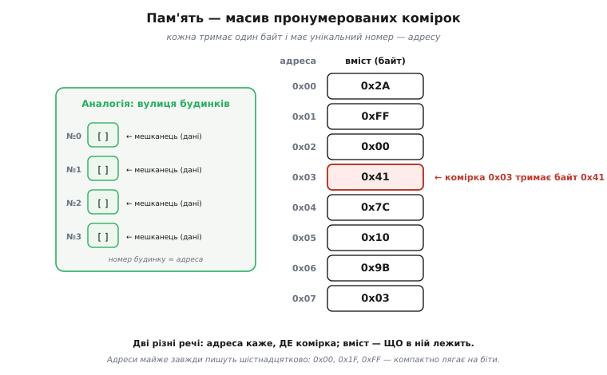
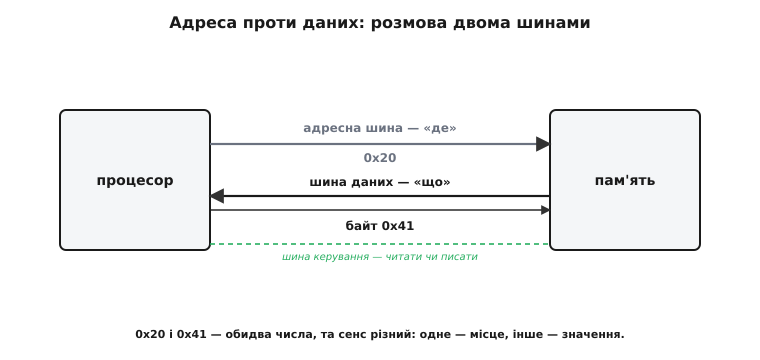
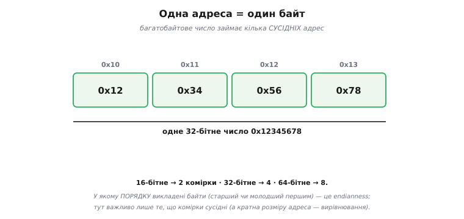
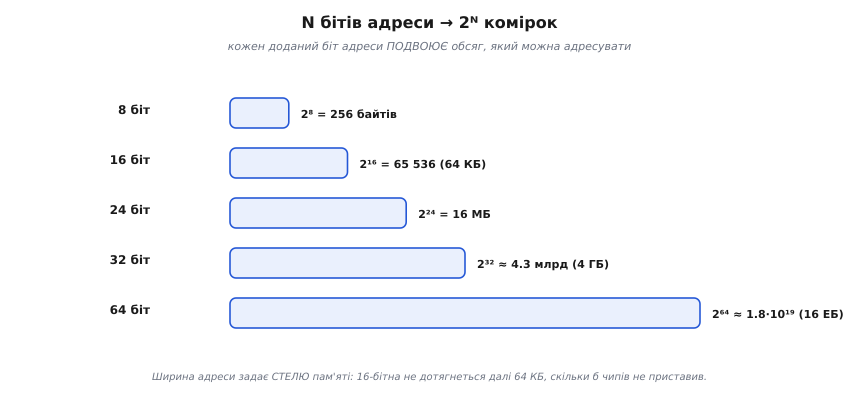
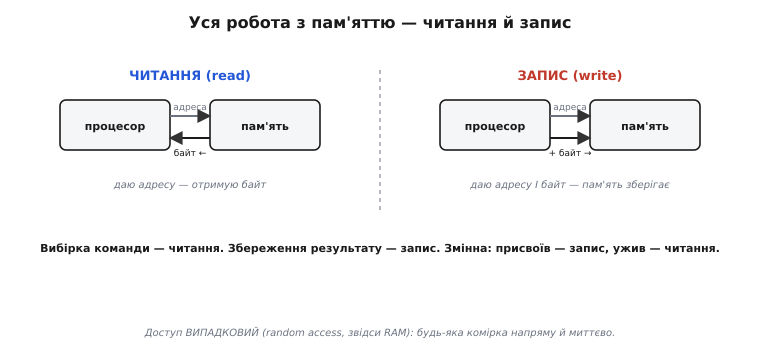
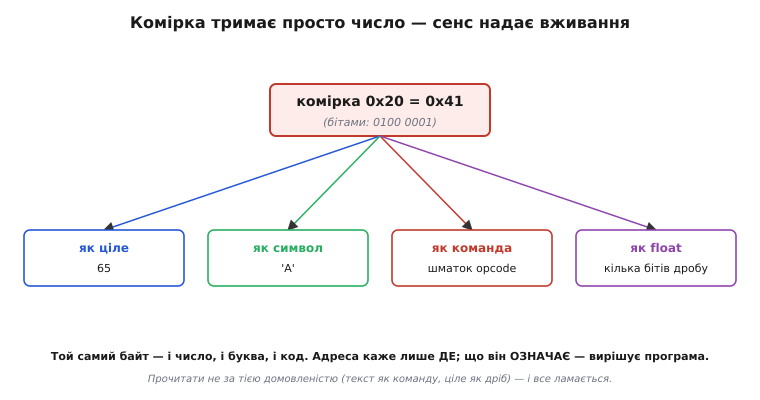

# Пам'ять як масив

Найпростіша і найважливіша модель пам'яті, на якій тримається все інше, така. **Пам'ять — це довгий масив пронумерованих комірок.** Кожна комірка тримає один байт, і кожна має свій унікальний номер — **адресу** (латиною *ad-* «до» + *directus* «спрямований»: те, що спрямовує до місця). Усе, що робить процесор із пам'яттю, зводиться до двох дій: **прочитати** комірку за її адресою або **записати** в неї. Звучить буденно — та саме в цій моделі ховаються поняття, без яких не зрозуміти ні покажчиків, ні стека, ні половини програмістських багів: різниця між **адресою** і **даними**, розмір **адресного простору**, і та глибока думка, що [байт — це лише число, а сенс йому надає вживання](root:math-number-theory/why-binary).

### Масив пронумерованих комірок

Уявімо пам'ять як **вулицю будинків**, кожен зі своїм номером.


*Пам'ять — послідовність комірок, кожна тримає один **байт** і має унікальний номер — **адресу** (0x00, 0x01, 0x02…). Як на вулиці: номер будинку — це адреса, а мешканець усередині — дані. Дві геть різні речі: **адреса** каже, **де** комірка, а **вміст** — **що** в ній лежить. Решітка комірок, до кожної з яких можна звернутися за її номером.*

Зверніть увагу на цю двоїстість «де» і «що» — вона фундаментальна. Адреса 0x03 і байт 0x41, що в ній лежить, — це **два різні числа** з різним змістом: одне вказує **місце**, інше — **вміст**. Плутати їх — класична помилка початківця (і джерело багів, особливо коли дійде до [покажчиків](root:sf-lang/addresses-pointers)). Тримаймо їх чітко нарізно від самого початку. (Адреси, до речі, майже завжди записують [**шістнадцятково**](root:math-number-theory/positional-systems) — 0x00, 0x1F, 0xFF — бо так компактно й зручно лягає на біти; ви бачитимете їх скрізь у роботі з пам'яттю.)

### Адреса проти даних

Закріпімо цю різницю, бо вона того варта.


*Процесор називає **адресу** (наприклад, 0x20 — «яка комірка»), а пам'ять віддає чи приймає **дані** (байт 0x41 — «що в ній»). І несуть їх [**різні шини**](root:hw-arch/processor-parts): адресна шина — «де», шина даних — «що». Саме тому їх дві. 0x20 і 0x41 — обидва числа, та сенс цілком різний: одне — місце, інше — значення.*

Ось навіщо процесору окремі [**адресна** шина й шина **даних**](root:hw-arch/processor-parts): по адресній шині процесор каже пам'яті, **куди** звернутися, а по шині даних іде сам **байт** — туди (при записі) чи назад (при читанні). Третя, шина **керування**, каже, що робити — читати чи писати. Уся розмова процесора з пам'яттю — це «адреса + операція + дані». А плутанина «адреса проти значення» — настільки поширене джерело багів, що варто закарбувати: **число-адреса ≠ число-значення**, навіть коли обидва виглядають однаково.

### Один байт на адресу

Скільки даних адресує одна адреса? Рівно **один байт** (англ. *byte*, навмисне перекручене *bite* «укус» — «відкушений» від машинного слова шматочок, рівно щоб умістити один символ) — найдрібнішу стандартну порцію.


*Кожна адреса вказує на **один байт**. Тож багатобайтове число займає кілька **послідовних** адрес: 32-бітне 0x12345678 лягає в чотири сусідні комірки (0x10, 0x11, 0x12, 0x13). А в якому **порядку** ті байти розкладені (молодший першим чи старший) — це вже [endianness](root:sf-algorithms/bits-bytes-endianness); тут важливо лише, що вони **сусідні**.*

Це називають **побайтовою адресацією** (*byte-addressable*): найменша річ, яку можна назвати адресою, — байт. Хочете 16-бітне число — воно займе **дві** сусідні комірки, 32-бітне — **чотири**, 64-бітне — **вісім**. Саме тут і живе питання [**порядку** байтів (endianness)](root:sf-algorithms/bits-bytes-endianness): коли число розкладене на кілька комірок, його байти можна викласти старшим уперед (big-endian) чи молодшим (little-endian, як ESP32) — і це стосується саме послідовних комірок пам'яті. (Через це, до речі, багатобайтові значення зазвичай кладуть за адресами, кратними їхньому розміру — це зветься **вирівнюванням** і допомагає залізу читати їх швидше.)

### Скільки комірок: 2ᴺ

Наскільки великою може бути пам'ять? Це визначає **ширина адреси** — скільки бітів у номері комірки.


*N бітів адреси дають **2ᴺ** різних адрес — стільки комірок машина може позначити. 8-бітна адреса бачить 256 байтів; 16-бітна — 65 536 (64 КБ); 24-бітна — 16 МБ; 32-бітна — близько 4.3 мільярда (4 ГБ). Та сама вибухова формула **2ᴺ** тут міряє **місткість адресного простору**: кожен доданий біт адреси **подвоює** обсяг пам'яті, яку можна адресувати.*

Ось чому [«розрядність» процесора](root:hw-arch/processor-parts) важлива не лише для чисел, а й для **пам'яті**. Ширина адресної шини задає **стелю** пам'яті: 16-бітна адреса фізично не дотягнеться далі 64 КБ, хоч би скільки мікросхем ви приставили; 32-бітна бачить уже 4 ГБ. Саме тому перехід комп'ютерів із 32 на 64 біти був значною мірою про пам'ять — [32-бітна адреса бачить лише 4 ГіБ](root:math-information/address-space), і ця межа стала тісною. Запам'ятайте зв'язок: **N бітів адреси → 2ᴺ комірок**; він підкаже, скільки пам'яті здатна охопити дана машина.

### Дві операції: читання й запис

Що ж процесор робить із пам'яттю? Лише **дві** речі.


***Читання** (read): процесор дає адресу — пам'ять повертає байт із тієї комірки. **Запис** (write): процесор дає адресу **і** байт — пам'ять зберігає його в тій комірці. Що саме робити, каже [шина керування](root:hw-arch/processor-parts). І все: будь-яка робота з пам'яттю — це послідовність читань і записів.*

Усе, абсолютно все, що відбувається в пам'яті, зводиться до цих двох дій. [**Вибірка** команди процесором](root:hw-arch/fetch-decode-execute) — це **читання** за адресою з PC; збереження результату обчислення — це **запис**. Завантаження змінної в регістр — читання; збереження назад — запис. Коли в коді ви оголошуєте змінну й присвоюєте їй значення, під капотом це й є запис у комірку пам'яті за певною адресою, а використання змінної — читання звідти. І цей доступ — **випадковий** (*random access*, звідси RAM): будь-яку комірку напряму й миттєво, не чекаючи, поки вона «доїде».

### Як індекс масиву стає адресою

Найкраще ця модель проступає там, де її видно прямо в коді, — у масиві. Масив у C лежить у пам'яті як суцільна стрічка комірок, а звертання `a[i]` — це не магія, а проста арифметика над адресами: **адреса елемента = база + індекс · розмір елемента**. База — адреса нульового елемента; розмір — скільки сусідніх байтів займає один елемент (для `uint16_t` це 2). Подивімося, як числа сходяться:

```c
#include <stdint.h>
#include <stdio.h>

uint16_t a[4] = { 0x1111, 0x2222, 0x3333, 0x4444 };  // 4 елементи по 2 байти

// Припустимо, компонувальник поклав масив за базою 0x2000.
// Тоді елементи лягають у пам'ять так:
//   a[0] → 0x2000  0x2001   (база + 0·2)
//   a[1] → 0x2002  0x2003   (база + 1·2)
//   a[2] → 0x2004  0x2005   (база + 2·2)
//   a[3] → 0x2006  0x2007   (база + 3·2)

uint16_t  x = a[2];          // ЧИТАННЯ за адресою 0x2000 + 2·2 = 0x2004
uint16_t *p = &a[2];         // p — це САМЕ ЧИСЛО-АДРЕСА 0x2004, не значення
*p = 0x9999;                 // ЗАПИС 0x9999 за адресою, що лежить у p
```

Розкладемо адресу `&a[2]` по тій самій формулі:

```
база            = 0x2000        (адреса a[0])
індекс          = 2
розмір елемента = 2 байти       (sizeof(uint16_t))
адреса a[2]     = 0x2000 + 2 · 2 = 0x2004
```

Покажчик `p` (англ. *pointer* — «той, що показує»; від *to point* «вказувати») тримає **число 0x2004** — і це число є адресою, а не вмістом. Тому `p` — звичайна змінна, що теж десь лежить у пам'яті, тільки її **значення є адресою іншої комірки**. Розіменування `*p` каже процесору: «візьми число з `p` як адресу й зверни́ся туди» — читання чи запис за нею. Ось чому крок покажчика по масиву (`p + 1`) додає не 1, а **розмір елемента**: `p + 1` для `uint16_t *` дає 0x2006, бо наступний елемент починається через 2 байти. Уся «складність» покажчиків — це та сама арифметика «база + індекс · розмір» над числами-адресами.

> 🔧 **Навіщо це.** Саме звідси беруться класичні баги доступу до пам'яті у прошивці. Помилитесь із розміром елемента (узяли `uint8_t *` там, де `uint16_t`) — і крок покажчика з'їде, читатимете половинки сусідніх чисел. Вийдете за межу (`a[4]` у масиві з 4 елементів) — формула чесно дасть адресу 0x2008, а там уже чужа комірка: жодної огорожі пам'ять не має. Тримайте в голові, що `[]` — це адресна арифметика, і половина «незрозумілих» збоїв стане прозорою.

### Комірка тримає просто число

І наостанок — найглибша думка про пам'ять. Що ж лежить у комірці? **Просто число.** Не «команда», не «буква», не «ціле» — лише вісім бітів, байт.


*Байт 0x41 у комірці 0x20 — це просто число (0100 0001). Чим воно є — залежить від того, **як його вживають**: як ціле це 65, як символ — літера 'A', як частина команди — шматок opcode чи операнда, як частина float — кілька бітів дробу. Адреса каже лише **де** байт; що він **означає**, вирішує програма.*

Ось чому пам'ять така універсальна — і така небезпечна. Універсальна, бо в тих самих комірках можна тримати що завгодно: і код, і дані, і числа, і текст — усе це просто байти, різні лише **вживанням** (саме на цьому стоїть [фон-нейманівська машина](root:embedded/von-neumann-harvard): код і дані — однакові числа в одній пам'яті). А небезпечна — бо ніщо в самій комірці не каже, **як** її читати; це знає лише програма. Прочитати дані **не за тією домовленістю** (байти тексту як команду, ціле як дріб, адресу як значення) — і все ламається. Тримайте в голові: адреса — це **місце**, байт — це **число**, а **сенс** йому надаєте ви, програміст, тим, як цю комірку вживаєте.

> 🔧 **Навіщо це.** Ця модель — підмурок усього, що ви робитимете з пам'яттю в коді. Перше: **адреса ≠ значення** — комірка має номер (де) і вміст (що); плутати їх не можна, і ця відмінність стане критичною з [покажчиками](root:sf-lang/addresses-pointers). Друге: пам'ять **побайтова**, тож ваші 16-/32-бітні змінні займають по 2/4 сусідні комірки, а їхній порядок — це [endianness](root:sf-algorithms/bits-bytes-endianness), що кусає при обміні даними. Третє: **N бітів адреси → 2ᴺ** комірок — звідси межі пам'яті вашого МК (наприклад, скільки SRAM здатна адресувати архітектура); коли впираєтесь у «брак пам'яті», згадайте цю стелю. Четверте, найважливіше концептуально: [**байт у пам'яті — просто число, сенс надає вживання**](root:math-number-theory/why-binary); більшість «незрозумілих» багів із пам'яттю — це коли байти прочитали не як треба (тип переплутано, дані затерли код, вийшли за межі масиву). А все, що робить процесор, — це **читання й запис** комірок за адресами. Засвоївши цю просту картину, ви легко візьмете й карту пам'яті, і покажчики, і стек.
