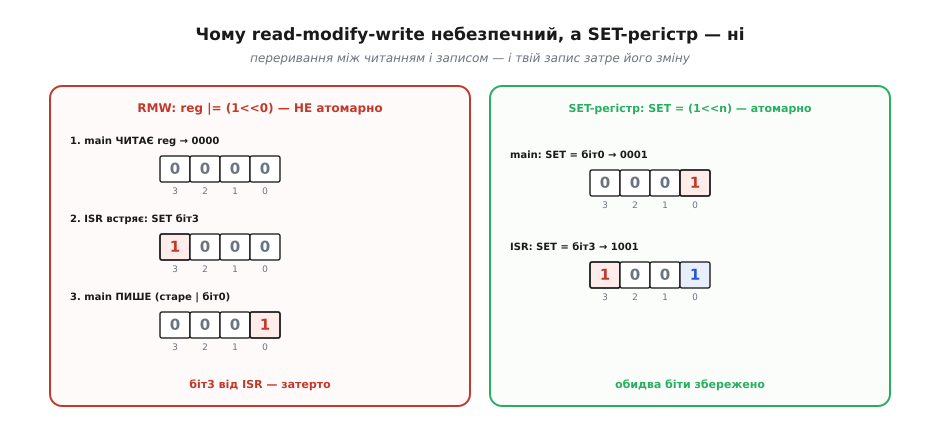
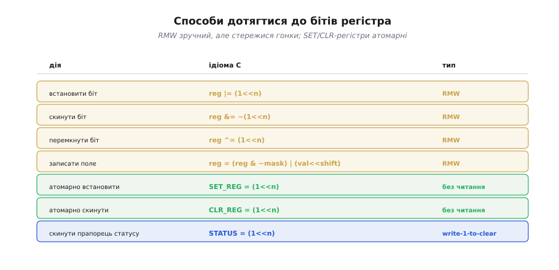

# ⚙️ Доступ до регістрів: read-modify-write, set/clear, бітові поля

Окремі біти [регістра периферії](root:hw-arch/memory-mapped-io) чіпають масками — це знає кожен. А от як робити це **безпечно**, знають не всі: звичний `|=` інколи зраджує, і причина не очевидна. Розберімо, чому, і які є надійніші способи.

## Задача

Треба змінити **один-два біти** в регістрі периферії, не зачепивши решту (вони керують іншими речами). Здавалося б, звичайна бітова маска усе вирішує. Та є підступ: класична ідіома `reg |= (1u << n)` — це насправді **три** окремі дії, і між ними може щось статися.

## Ідея: read-modify-write і чому він ламається

`reg |= mask` розгортається в **читай-зміни-запиши** (*read-modify-write*, RMW): прочитати регістр, змінити біти, записати назад. Це не одна машинна команда, а три: процесор завантажує слово з регістра в робоче значення, виконує АБО з маскою, кладе результат назад. Поки виконання лінійне — усе гаразд. Але якщо між «прочитати» і «записати» встряне **переривання** й теж змінить цей регістр, наш запис, зроблений на основі **застарілого** прочитаного значення, **затре** його зміну.


*Зліва — RMW: main читає 0000, тим часом обробник переривання ставить біт3 (1000), а main записує старе-АБО-біт0 (0001) і затирає біт3. Справа — атомарний SET-регістр: і main, і обробник роблять по одному неподільному запису, обидва біти лишаються.*

Рятунок дає **залізо**: у багатьох МК поряд зі звичайним регістром є окремі **SET- і CLR-регістри** (*write-1-to-set* / *write-1-to-clear*). Запис у них — **одна неподільна дія** без читання: пишеш `SET_REG = (1u << n)` — і саме біт n стає 1, решта недоторкані; де в масці 0 — той біт без змін, бо залізо чіпає лише одиничні. Гонки немає, бо немає кроку «прочитати старе». Саме тому для регістрів, які чіпають і `main`, і переривання, атомарний SET/CLR — не розкіш, а єдиний надійний шлях.

## Робочий C: набір способів

Регістри тут — звичні `volatile`-макроси (як у статті про memory-mapped IO): `REG` — основний регістр, `SET_REG`/`CLR_REG` — його атомарні близнюки, `STATUS` — регістр прапорців.

```c
#include <stdint.h>
#define REG      (*(volatile uint32_t *)0x40008000u)
#define SET_REG  (*(volatile uint32_t *)0x40008008u)   // write-1-to-set
#define CLR_REG  (*(volatile uint32_t *)0x4000800Cu)   // write-1-to-clear
#define STATUS   (*(volatile uint32_t *)0x40008010u)

// RMW (зручно, але НЕ атомарно):
REG |=  (1u << n);                          // встановити біт
REG &= ~(1u << n);                          // скинути біт
REG ^=  (1u << n);                          // перемкнути біт
REG  = (REG & ~mask) | (val << shift);      // записати поле з кількох бітів

// Атомарно (одним записом, без читання):
SET_REG = (1u << n);                        // встановити біт
CLR_REG = (1u << n);                        // скинути біт

// Скинути прапорець статусу типу write-1-to-clear:
STATUS = (1u << READY);                     // писати ЛИШЕ потрібний біт, не |=
```

Коли який спосіб доречний — підсумовано на картці нижче.


*Картка способів. Жовте — RMW (читання плюс запис, стережися гонки). Зелене — атомарні SET/CLR (один запис). Синє — скидання прапорця статусу записом одиниці (write-1-to-clear).*

## Складність і пастки на МК

- **RMW не атомарний.** Якщо той самий регістр чіпають і `main`, і обробник переривання (*interrupt service routine*, ISR) — RMW відкриває [гонку даних](root:sf-tasks/atomicity-races), яку можна закрити критичною секцією або уникнути взагалі. Головне правило: для регістрів, спільних з обробником переривання, **бери атомарні SET/CLR**, а не `|=`.
- **Прапорці write-1-to-clear (w1c).** Багато регістрів статусу скидають біт **записом одиниці** в нього. Якщо «скидати» такий прапорець через RMW `STATUS |= flag`, читання захопить **інші** вже зведені прапорці, а зворотний запис їх **випадково скине** — загублені події. Правильно — писати лише потрібний біт: `STATUS = flag`.
- **Бітові поля C (`struct { unsigned x:1; }`)** читаються зручно, але **непереносні** (порядок бітів і пакування — на розсуд компілятора), а під капотом усе одно компілюються в RMW. Для апаратних регістрів надійніше явні маски.
- **`volatile`** (лат. *volatilis* — «летючий, мінливий»). Регістр може змінитися «сам» (залізом), тож компілятору не можна тримати його значення в копії чи переставляти доступи — для цього звертання до регістра позначають [`volatile`](root:sf-lang/volatile). Без цього навіть бездоганна маска марна: оптимізатор просто викине «зайвий» доступ.
- **Право доступу.** Бувають регістри лише для читання, лише для запису й «скидаються читанням» (*clear-on-read*) — звіряйся з даташитом, перш ніж робити RMW: на такому регістрі навіть звичайне читання заради RMW уже міняє стан.
