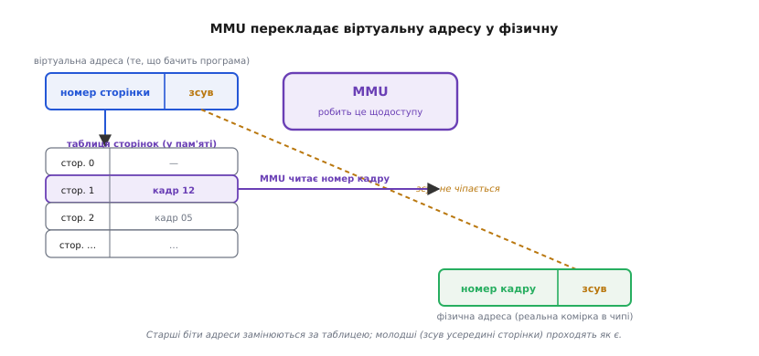
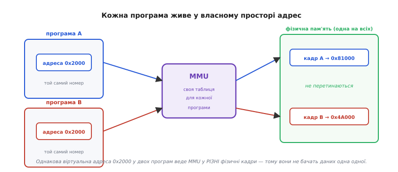
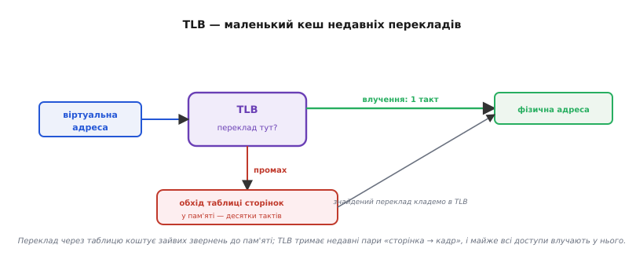

# Блок керування пам'яттю (MMU)

Уяви, що процесор хоче прочитати байт за адресою `0x2000`. Здавалося б, усе просто: виставив число `0x2000` на адресну шину — і комірка з таким номером у мікросхемі пам'яті віддала свій вміст. Довго так і робили, і для дрібного мікроконтролера так роблять досі. Але щойно на одному чипі починають жити **кілька програм одночасно** (операційна система, твій застосунок, чужий застосунок), ця пряма схема ламається. Дві програми, складені окремо, легко захочуть однієї й тієї самої адреси `0x2000` — і затруть дані одна одній. Одна помилкова адреса в чужому коді покладе весь пристрій. А якщо програмі треба більше пам'яті, ніж фізично напаяно, — прямій схемі просто нема звідки її взяти.

Розв'язок — вставити між ядром і мікросхемою пам'яті маленький апаратний перекладач адрес. Він приймає адресу, яку назвала програма, і **на льоту підмінює її** на іншу — ту, за якою байт справді лежить у кремнії. Цей перекладач і є **блок керування пам'яттю** (англ. *Memory Management Unit*, MMU — вузол керування пам'яттю). Він перетворює просту ідею «адреса = номер комірки» на дві різні адреси: одну для програми, іншу для заліза.

### Дві адреси замість однієї

Ключ до всього MMU — розрізнення двох світів.

**Віртуальна адреса** (лат. *virtualis* — уявний, дієвий) — це число, яким мислить програма. Коли в коді написано `int *p = (int*)0x2000;`, число `0x2000` віртуальне: воно існує лише в голові цієї програми.

**Фізична адреса** — це реальний номер комірки в мікросхемі, який виставляється на [адресну шину, що йде до чипа пам'яті](root:hw-arch/address-decoding). Саме її «бачить» кремній.

MMU стоїть рівно на шляху між ними: кожне звернення ядра до пам'яті проходить крізь нього, і він замінює віртуальну адресу на фізичну **щоразу, апаратно, за наносекунди**. Програма ніколи не бачить фізичних адрес — вона живе у своєму рівному, зручному просторі, який для неї починається з нуля й тягнеться вгору, ніби вся пам'ять світу належить лише їй.

> 🔧 **Навіщо це.** Саме через цей поділ у програмі під керуванням операційної системи вказівник (напр. `0x5568a2b0`) — це віртуальна адреса, і два запуски однієї програми можуть показувати той самий вказівник, хоча дані лежать у різних місцях фізичної пам'яті. Тому «адресу зі стека однієї програми» безглуздо тлумачити в іншій: у кожної власна система координат, яку задає її MMU-таблиця.

### Як саме відбувається переклад: сторінки й кадри

Перекладати адреси по одній було б божевіллям — їх мільярди. Тому пам'ять ріжуть на рівні шматки — **сторінки** (англ. *page*, бо ранні системи гортали їх, як сторінки книги). Типова сторінка — 4 кілобайти. Фізичну пам'ять так само ділять на шматки того самого розміру — **кадри** (англ. *frame* — рамка, комірка розкладу). Переклад працює не з окремими адресами, а зі сторінками: «віртуальна сторінка №5 зараз лежить у фізичному кадрі №12».

Це різко спрощує задачу. Розглянь віртуальну адресу як два поля, склеєні в одне число: старші біти — **номер сторінки**, молодші — **зсув** (англ. *offset* — зміщення) всередині сторінки. Для сторінки 4 КБ зсув — це молодші 12 бітів (бо 2¹² = 4096), а все, що вище, — номер сторінки.

```
віртуальна адреса 0x2000 = 0000_0000_0000_0010  0000_0000_0000
                           └── номер сторінки ──┘└─── зсув ────┘
                                = сторінка 2          = зсув 0
```

Далі MMU робить рівно дві дії. По-перше, бере номер сторінки й дивиться в **таблицю сторінок** (англ. *page table*) — простий масив у пам'яті, де для кожної віртуальної сторінки записано, у якому фізичному кадрі вона зараз. По-друге, підставляє знайдений номер кадру замість номера сторінки, а **зсув лишає недоторканим** — байт усередині сторінки нікуди не переїхав. Склеєні кадр і зсув і дають фізичну адресу.


*Старші біти адреси (номер сторінки) MMU замінює за таблицею на номер фізичного кадру; молодші біти (зсув усередині сторінки) проходять як є. Тому переклад — це підміна лише верхньої частини адреси, а не перерахунок кожного байта.*

Порахуймо конкретно. Хай сторінка 2 за таблицею лежить у кадрі 12.

**Приклад: переклад адреси `0x2000` при сторінці 4 КБ.**

```
крок 1 — розкласти:   0x2000  →  сторінка = 0x2000 >> 12 = 2
                                  зсув     = 0x2000 & 0xFFF = 0x000
крок 2 — глянути в таблицю:  таблиця[2] = кадр 12  (0xC)
крок 3 — склеїти:     фізична = (12 << 12) | 0x000 = 0xC000
```

Отже, віртуальна `0x2000` для цієї програми означає фізичну `0xC000`. Інша програма з тією самою таблицею-власною матиме для `0x2000` зовсім інший кадр — бо в неї інша таблиця. У коді той самий переклад виглядає так:

:::tabs
```cpp
// Спрощена модель того, що MMU робить у залізі щодоступу.
#define PAGE_BITS  12u                 // сторінка 4 КБ = 2^12
#define PAGE_SIZE  (1u << PAGE_BITS)
#define OFFS_MASK  (PAGE_SIZE - 1u)     // молодші 12 бітів

uint32_t translate(const uint32_t page_table[], uint32_t virt) {
    uint32_t page   = virt >> PAGE_BITS;      // старші біти — номер сторінки
    uint32_t offset = virt & OFFS_MASK;       // молодші — зсув
    uint32_t frame  = page_table[page];       // де ця сторінка фізично
    return (frame << PAGE_BITS) | offset;     // склеїти кадр і зсув
}
```
```python
# Спрощена модель того, що MMU робить у залізі щодоступу.
PAGE_BITS = 12                 # сторінка 4 КБ = 2^12
PAGE_SIZE = 1 << PAGE_BITS
OFFS_MASK = PAGE_SIZE - 1      # молодші 12 бітів

def translate(page_table, virt):
    page   = virt >> PAGE_BITS       # старші біти — номер сторінки
    offset = virt & OFFS_MASK        # молодші — зсув
    frame  = page_table[page]        # де ця сторінка фізично
    return (frame << PAGE_BITS) | offset   # склеїти кадр і зсув
```
:::

Це, звісно, спрощення — справжня таблиця не суцільний масив, а дерево з кількох рівнів, щоб не тримати запис під кожну сторінку велетенського простору. Але суть та сама: **номер сторінки → номер кадру, зсув недоторканий**. Уся апаратура MMU — це, по суті, швидкий автомат, що робить оці три кроки без участі процесора.

### Ізоляція: чому програми не бачать одна одну

Тепер стає видно, звідки береться захист. У кожної програми — **своя таблиця сторінок**. Коли операційна система перемикається з програми A на програму B (це зветься [перемиканням контексту](root:sf-os/context-switch)), вона серед іншого каже MMU: «тепер користуйся таблицею B». Відтоді ті самі віртуальні адреси перекладаються геть інакше.


*Обидві програми користуються адресою 0x2000, але MMU має для кожної власну таблицю й веде їх у різні фізичні кадри, що не перетинаються. Тому програма фізично не має способу назвати чужу комірку: у її системі координат такої адреси просто не існує.*

Це не домовленість і не перевірка «за чесним словом» — це **фізична неможливість**. Програма A може виставляти будь-яку віртуальну адресу, яку захоче, — MMU все одно проведе її лише крізь таблицю A, тобто лише в кадри, які операційна система для A виділила. Кадрів B у таблиці A просто немає, тож дотягтися до них нема як. Помилковий вказівник у A зіпсує щонайбільше саму A, а не сусідів і не ядро.

Понад те, у кожному записі таблиці, крім номера кадру, є **біти прав**: чи можна в цю сторінку писати, чи лише читати, чи можна виконувати з неї код. Якщо програма спробує записати в сторінку, позначену «лише читання», або звернутися до сторінки, якої в таблиці взагалі нема, MMU **не виконає доступ**, а натомість зупинить його й підніме апаратне переривання — **збій сторінки** (англ. *page fault* — промах сторінки). Далі керування дістає операційна система й вирішує, що робити: дати програмі законну сторінку — або вбити її з тим самим сигналом, який у знайомому вигляді звучить як «segmentation fault».

> 🔧 **Навіщо це.** Горезвісний «segfault» — це і є спрацьований MMU: програма назвала віртуальну адресу, для якої в її таблиці немає дійсного запису з потрібними правами, MMU підняв page fault, ядро не знайшло законного пояснення й прибило процес. Тому segfault — ознака саме **звернення до чужої/невиділеної пам'яті**, а не «поганого числа» взагалі. На дрібному мікроконтролері без MMU той самий баг не дасть охайного segfault — він тихо зіпсує сусідні дані, і шукати його доведеться значно довше.

### Більше пам'яті, ніж є: сторінки за викликом

Є ще один прибуток від того, що адреса стала непрямою. Оскільки програма ніколи не торкається фізичної пам'яті сама, операційна система вільна тримати частину сторінок **не в оперативці взагалі** — наприклад, на диску. У таблиці такий запис позначено «сторінки зараз немає в пам'яті». Поки програма її не чіпає — все спокійно. Щойно програма звернеться до такої адреси, MMU підніме той самий page fault, ядро перехопить його, підвантажить потрібну сторінку з диска в якийсь вільний кадр, полагодить запис у таблиці — і **повторить перервану інструкцію**, ніби нічого не сталося. Програма не помічає паузи; для неї пам'ять просто «є».

Так виникає [віртуальна пам'ять](root:hw-arch/virtual-memory) — ілюзія простору, більшого за фізичний. Це той самий давній трюк «сторінок за викликом» (англ. *demand paging* — підкачування за потребою), який MMU уможливлює апаратно: без миттєвого перехоплення кожного доступу програмного способу зробити це непомітно не існує.

### TLB: чому переклад не гальмує щоразу

Тут ховається підступ. Якщо таблиця сторінок лежить **у пам'яті**, то кожне звернення до пам'яті вимагало б спершу **іншого** звернення до пам'яті — прочитати запис таблиці. А для багаторівневої таблиці — і кількох. Виходить, за кожен байт даних платимо кількома зайвими походами в ту саму повільну DRAM. Це вбило б швидкодію.

Рятує **буфер швидкого перекладу** — TLB (англ. *Translation Lookaside Buffer*, дослівно «буфер перекладу, куди зазираємо збоку»). Це крихітна, дуже швидка [асоціативна пам'ять](root:hw-arch/cache) просто в MMU, що тримає останні кілька десятків пар «віртуальна сторінка → фізичний кадр». Перш ніж лізти в таблицю, MMU питає TLB: чи є вже готовий переклад для цієї сторінки? Якщо є (**влучення**) — фізична адреса готова за один такт, таблицю чіпати не треба. Якщо нема (**промах**) — MMU таки проходить таблицю, віддає адресу й **кладе знайдену пару в TLB**, щоб наступні звернення до тієї ж сторінки влучали.


*TLB тримає недавні переклади поруч із ядром. Програми звертаються до пам'яті купчасто — кілька сусідніх адрес поспіль лежать в одній сторінці, — тож майже всі доступи влучають у TLB, і повний обхід таблиці трапляється рідко.*

Працює це тому, що програми звертаються до пам'яті **не врозкид, а купчасто**: сусідні інструкції й дані здебільшого лежать в одній-двох сторінках. Тому навіть маленький TLB ловить переважну більшість доступів, і дорогий обхід таблиці стається лише зрідка. Детальніше про TLB — [окрема тема](root:hw-arch/tlb): скільки в ньому записів, як його чистять при перемиканні програм, чому промах по TLB буває дорожчий за промах по кешу даних.

> 🔧 **Навіщо це.** TLB пояснює, чому «стрибати» по пам'яті великими випадковими кроками повільно навіть коли дані нібито в оперативці: кожен стрибок на нову сторінку — це ризик промаху TLB і зайвого обходу таблиці. Код, що йде по пам'яті поряд (той самий масив підряд), тримається в кількох сторінках і з TLB дружить. Це та сама причина, чому послідовний доступ швидший за хаотичний, тільки на рівні перекладу адрес.

### MMU і його молодший брат MPU

Повний MMU з таблицями сторінок і віртуальною пам'яттю коштує площі кристала й енергії, тому дрібні мікроконтролери його не мають — їм не потрібні ні кілька програм, ні простір, більший за фізичний. Але сама ідея «перехопити доступ і не пустити, куди не можна» цінна навіть там. Тому в багатьох мікроконтролерах ставлять спрощений блок — **MPU** (англ. *Memory Protection Unit* — вузол захисту пам'яті).

Різниця проста, і в ній уся суть. MPU адрес **не перекладає** — віртуальна адреса дорівнює фізичній. Він лише **сторожить**: тримає кілька описів областей пам'яті з правами (сюди писати не можна, звідси код не виконувати) і піднімає збій, якщо доступ їх порушує. Тобто MPU дає захист без ілюзії власного простору й без віртуальної пам'яті. Це рівно те, що треба для надійної вбудованої системи: спіймати «дику» помилку вказівника одразу, а не дати їй тихо потоптати сусідні змінні, — але без ваги повноцінного адресного перекладу.

> 🔧 **Навіщо це.** Обираючи процесор під задачу, це практична розвилка. Потрібні кілька незалежних програм під операційною системою, ізоляція процесів, віртуальна пам'ять — шукай чип із **MMU** (такі тягнуть повноцінні ОС). Потрібна лише жорстка вбудована програма, але з апаратним ловом «диких» записів — вистачить дешевшого чипа з **MPU**. А зовсім дрібний мікроконтролер часто не має ні того, ні того: там будь-який доступ проходить прямо в фізичну пам'ять, і за коректність адрес відповідає лише твій код.

### Звідки це взялося

Ідея непрямої адреси не нова. Її [народив британський Atlas](root:hw-arch/mmu/hist-atlas-one-level-store.md) — машина Манчестерського університету, запущена 1962 року: саме там уперше зробили автоматичний переклад сторінок і підкачування з барабана, а невеликий набір апаратних регістрів-відповідників став прабатьком сьогоднішнього TLB.

---

Отже, **MMU** — це апаратний перекладач, що стоїть на шляху кожного звернення ядра до пам'яті й підмінює **віртуальну** адресу (число, яким мислить програма) на **фізичну** (реальний номер комірки в чипі). Робить він це посторінково: старші біти адреси — **номер сторінки** — замінює за **таблицею сторінок** на **номер кадру**, а молодший **зсув** лишає недоторканим. З цього одного механізму випливає все головне: **ізоляція** (у кожної програми своя таблиця, тож ті самі віртуальні адреси ведуть у різні фізичні кадри й дотягтися до чужого нема як), **захист** (біти прав у записі; порушення піднімає **page fault** — знайомий segfault), **віртуальна пам'ять** (частину сторінок тримають на диску й підкачують за викликом), а щоб переклад не гальмував — недавні пари «сторінка → кадр» кешує **TLB**. Простіший родич MMU — **MPU** — адрес не перекладає, лише стереже права; його ставлять у мікроконтролери, яким потрібен захист без ваги повноцінного адресного перекладу.
