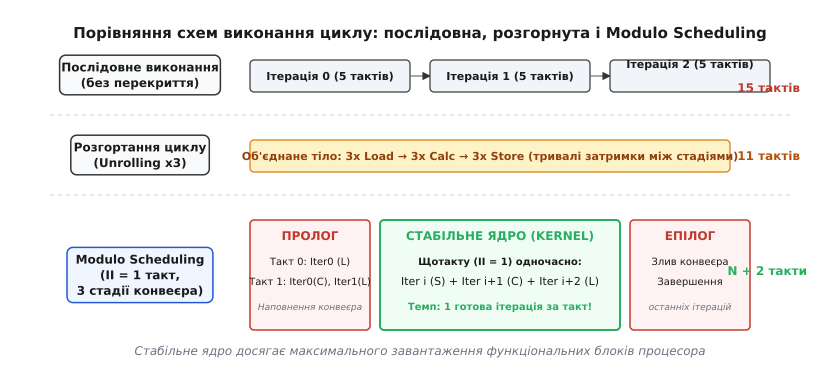
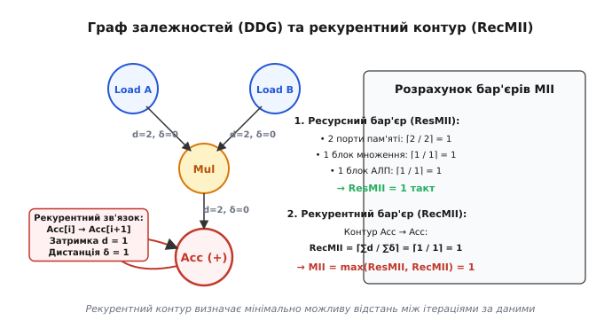
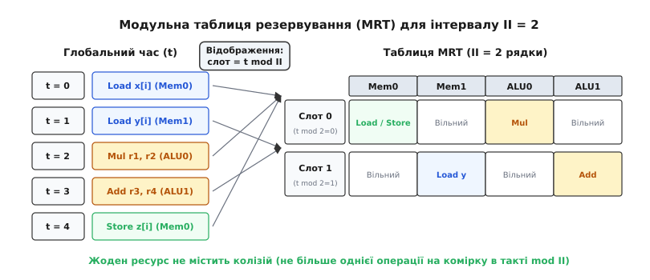
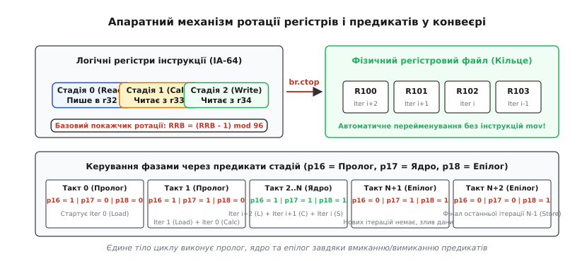

# Програмна конвеєризація Modulo Scheduling

<preknowlist>
- [Конвеєр](topic:hw-arch/pipeline) — принцип конвеєризації процесора, стадії виконання інструкцій та типи конфліктів.
- [VLIW і EPIC](topic:hw-arch/vliw-epic) — архітектури з явним статичним паралелізмом інструкцій та апаратною ротацією регістрів.
- [Цикл виконання інструкції](topic:hw-arch/instruction-cycle-detail) — латентність операцій, затримки читання з пам'яті та фази виконання.
</preknowlist>

Уявімо цикл векторного масштабування на процесорі з конвеєрними функціональними блоками. Кожна ітерація складається з трьох послідовних операцій: завантаження числа з пам'яті в регістр (латентність 2 такти), множення на константу (латентність 2 такти) та запис результату назад у пам'ять (латентність 1 такт). Якщо процесор виконує ітерації суворо послідовно — одна за одною, — кожна ітерація триває 5 тактів. Протягом 1-го такту блок множення та порти запису простоюють, чекаючи на завершення читання з пам'яті; протягом 3-го такту порт запису знову простоює, очікуючи результат множення. За 1000 ітерацій процесор витрачає 5000 тактів, при цьому його обчислювальні блоки використовуються лише на 20% своєї пропускної здатності.

Локальне планування інструкцій у межах однієї ітерації не здатне заповнити ці бульбашки простою: операція множення не може розпочатися без завантаженого значення, а запис не може відбутися без результату множення. Класичне розгортання циклу (англ. *loop unrolling*) частково пом'якшує проблему, дублюючи тіло циклу кілька разів, проте воно призводить до лінійного розростання обсягу машинного коду в кеші інструкцій, створює надмірний регістровий тиск та все одно залишає порожні такти на межах між розгорнутими блоками.

Фундаментальним розв'язанням цієї проблеми є **програмна конвеєризація** (англ. *software pipelining*), а її найдосконалішим математичним методом — **Modulo Scheduling** (планування за модулем, від лат. *modulus* — міра). Замість того щоб чекати повного завершення поточної ітерації, компілятор запускає кожну наступну ітерацію з фіксованим часовим зсувом. У результаті різні стадії кількох послідовних ітерацій перекриваються в часі, утворюючи безперервний конвеєр на рівні інструкцій.


*Порівняння послідовного виконання, розгортання циклу та програмної конвеєризації Modulo Scheduling*

### 1. Інтервал ініціалізації (II) та формула продуктивності

Головним параметром конвеєризованого циклу є **інтервал ініціалізації** (англ. *Initiation Interval*, позначуваний як `II`). Це кількість тактів процесора між запусками двох послідовних ітерацій циклу.

Якщо `II = 1`, процесор розпочинає нову ітерацію циклу **щотакту**. У стабільному режимі це означає, що процесор завершує одну повну ітерацію за кожен такт, досягаючи теоретично максимального темпу видачі інструкцій (IPC).

Якщо одна ітерація має загальну тривалість `Schedule_Length` тактів, а цикл налічує `N` ітерацій, то сумарний час виконання всього конвеєризованого циклу становить:
```
Total_Cycles = Schedule_Length + (N - 1)·II
```

Для великих значень `N` доданок `Schedule_Length` стає незначним, і середній час виконання однієї ітерації асимптотично наближається до `II` тактів:
```
Limit_{N → ∞} (Total_Cycles / N) = II
```

### 2. Теоретичні нижні межі: мінімальний інтервал ініціалізації (MII)

Компілятор не може обрати довільно мале значення `II`. Мінімально можливий інтервал ініціалізації (`MII`) обмежений двома незалежними факторами: кількістю доступних фізичних блоків процесора та рекурентними зв'язками між ітераціями:

```
MII = max(ResMII, RecMII)
```

#### Ресурсне обмеження (ResMII)
Визначається сумарною кількістю операцій кожного типу в тілі циклу та кількістю відповідних функціональних блоків у мікроархітектурі процесора.

Нехай `Count(r)` — кількість операцій у циклі, що вимагають ресурсу типу `r` (наприклад, операцій читання/запису пам'яті чи множення), а `Units(r)` — кількість фізично наявних блоків цього типу. За принципом Діріхле для кожного ресурсу `r`:
```
ResMII = max_{r} ⌈Count(r) / Units(r)⌉
```

Наприклад, якщо тіло циклу містить 3 звернення до пам'яті, а процесор має лише 2 порти пам'яті, то `ResMII = ⌈3 / 2⌉ = 2` такти. Запустити нову ітерацію за 1 такт фізично неможливо, оскільки портам пам'яті бракуватиме пропускної здатності.

#### Рекурентне обмеження (RecMII) та граф залежностей (DDG)
Визначається наявністю замкнених контурів зворотного зв'язку в графі залежностей за даними (англ. *Data Dependence Graph*, DDG).

У графі DDG:
- Вершини представляють окремі операції тіла циклу.
- Орієнтовані дуги `u → v` позначають передачу даних між операціями. Кожна дуга має латентність `d(u, v)` (затримку в тактах) та дистанцію `δ(u, v)` (різницю номерів ітерацій).

Якщо операція `v` використовує дані, вироблені операцією `u` в тій самій ітерації, то `δ = 0` (внутрішньоітераційна залежність). Якщо ж операція `v` в ітерації `i` потребує результату операції `u` з попередньої ітерації `i - 1` (наприклад, накопичення суми `sum = sum + a[i]`), то `δ = 1` (міжітераційна або рекурентна залежність).


*Граф залежностей за даними з внутрішньоітераційними та міжітераційними ребрами*

Для будь-якого орієнтованого контуру `C` у графі DDG сумарна латентність усіх операцій уздовж контуру повинна покриватися часом, за який конвеєр проходить `∑δ` ітерацій. Звідси випливає фундаментальна нерівність:
```
RecMII = max_{C} ⌈(∑_{e ∈ C} d(e)) / (∑_{e ∈ C} δ(e))⌉
```

Якщо в циклі обчислюється рекурентний вираз `y[i] = y[i-1] * c + x[i]`, де операція множення й додавання сумарно триває `d = 3` такти з дистанцією `δ = 1`, то `RecMII = ⌈3 / 1⌉ = 3` такти. Навіть на процесорі з нескінченною кількістю функціональних блоків цей цикл неможливо виконувати швидше ніж з `II = 3`.

Повне виведення цих співвідношень та матричні методи пошуку найгіршого контуру наведено у вставці [детальне математичне виведення MII та матричний аналіз контурів](topic:hw-arch/modulo-scheduling/math-mrt-scheduling.md).

### 3. Таблиця модульного резервування (MRT)

Для відстеження зайнятості процесорних ресурсів компілятор будує **таблицю модульного резервування** (англ. *Modulo Reservation Table*, MRT). Таблиця має розмір `II × Кількість_Ресурсів`. Її рядки відповідають тактам за модулем `II` (від `0` до `II - 1`).

Правило відображення: якщо операція `u` призначена на абсолютний такт `t`, вона резервує свій функціональний блок у рядку `t mod II` таблиці MRT.


*Розподіл операцій у таблиці модульного резервування (MRT) за модулем II = 2*

Головний інваріант MRT: у жодній клітинці `(t mod II, ресурс)` кількість одночасно призначених операцій не повинна перевищувати кількість фізичних блоків цього типу. Це математично гарантує, що коли всі ітерації накладатимуться з кроком `II`, апаратних конфліктів не виникне в жодному такті виконання.

### 4. Алгоритми планування та евристика відкатів (IMS)

Пошук безконфліктного розкладу для фіксованого `II` є NP-повною задачею. Класичним промисловим стандартом є алгоритм **Iterative Modulo Scheduling (IMS)**, розроблений Бобом Рау.

Алгоритм працює за такою схемою:
1. Початкове значення встановлюється як `II = MII`.
2. Компілятор обчислює пріоритет кожної операції на основі її висоти (Height) у графі залежностей:
   ```
   Height(u) = max_{v} (Height(v) + d(u, v) - δ(u, v)·MII)
   ```
   Операції з найдовшим критичним шляхом до кінця циклу плануються першими.
3. Для чергової вибраної операції `u` обчислюється найраніший допустимий момент старту `EStart(u)` з огляду на вже заплановані операції-предки:
   ```
   EStart(u) = max_{p → u, p заплановано} (Time(p) + d(p, u) - δ(p, u)·II)
   ```
4. Планувальник перевіряє такти `t` у вікні `[EStart(u), EStart(u) + II - 1]`. Якщо знайдено такт `t`, у якому потрібний ресурс вільний у слоті `t mod II`, операція фіксується на часі `Time(u) = t`.
5. Якщо в усіх `II` спробах виникає ресурсний конфлікт, IMS застосовує **відкат (Backtracking)**: він примусово призначає операцію `u` на такт `EStart(u)`, але знімає з розкладу ті раніше заплановані операції, з якими вона вступила в колізію в слоті MRT, повертаючи їх назад у чергу пріоритетів.
6. Кожна операція має бюджет спроб. Якщо загальна кількість витіснень перевищує ліміт, компілятор визнає поточний `II` недосяжним, збільшує `II = II + 1`, повністю очищає таблицю MRT і повторює процедуру планування.

Еволюцію цієї ідеї від ранніх мікропрограмних машин до сучасних процесорів описано у вставці [історія створення Modulo Scheduling: від машин FPS до архітектур Itanium та Hexagon](topic:hw-arch/modulo-scheduling/hist-modulo-scheduling.md).

Альтернативою класичному IMS є алгоритм **Swing Modulo Scheduling (SMS)**. На відміну від IMS, який рухається графом виключно зверху вниз, SMS чергує рух зверху вниз та знизу вгору. Це мінімізує інтервали життя проміжних змінних і суттєво зменшує регістровий тиск.

Працюючий код обох підходів наведено у вставці [повноцінна реалізація алгоритму IMS із чергою та відкатами](topic:hw-arch/modulo-scheduling/proj-modulo-scheduler.md).

### 5. Анатомія конвеєризованого циклу: пролог, ядро та епілог

Після того як для кожної операції визначено час запуску `t(u)`, загальна довжина розкладу однієї ітерації становить `Schedule_Length = max_{u} (t(u) + Latency(u))`.

Кількість стадій конвеєра обчислюється як:
```
Stage_Count = ⌈Schedule_Length / II⌉
```

Виконання циклу розпадається на три послідовні фази:
1. **Пролог (Prologue):** Триває `(Stage_Count - 1)·II` тактів. Тут стартують перші операції перших ітерацій, поступово наповнюючи конвеєр.
2. **Ядро (Kernel):** Стабільний робочий стан. Триває `(N - Stage_Count + 1)·II` тактів. У кожному такті ядра одночасно виконуються операції з `Stage_Count` різних ітерацій: операції завершальної стадії для ітерації `i`, проміжної стадії для ітерації `i+1` та початкової стадії для ітерації `i + Stage_Count - 1`. Кожен такт ядра видає один готовий результат.
3. **Епілог (Epilogue):** Триває `(Stage_Count - 1)·II` тактів. Нові ітерації більше не запускаються, а конвеєр поступово дописує результати останніх оброблених елементів і спорожнюється.

### 6. Час життя змінних та апаратні ротаційні регістри

Оскільки в конвеєрі одночасно перебуває `Stage_Count` ітерацій, проміжні результати обчислень повинні одночасно зберігатися для кожної активної ітерації. Якщо значення змінної живе `L` тактів від моменту запису до останнього читання, максимальна кількість її одночасно активних копій становить:
```
MaxLive = ⌈L / II⌉
```

У звичайних процесорах зі статичним файлом регістрів компілятор змушений виконувати **модульне розширення змінних** (англ. *Modulo Variable Expansion*, MVE): він розгортає тіло ядра в `k = max(MaxLive)` разів і призначає унікальні статичні регістри для кожної розгорнутої копії. Це усуває конфлікти імен, але збільшує розмір двійкового коду.

Архітектури Intel Itanium (IA-64) та Qualcomm Hexagon розв'язали цю проблему кардинально за допомогою **апаратних ротаційних регістрів** та **предикатів стадій**:


*Апаратний механізм ротації регістрів і предикатів у конвеєризованому циклі*

В архітектурі з ротацією:
- Файл регістрів містить покажчик бази ротації `RRB` (Rotating Register Base).
- Спеціальна інструкція умовного переходу циклу (наприклад, `br.ctop` в IA-64) у кожній ітерації автоматично змінює покажчик `RRB = (RRB - 1) mod Size`.
- Завдяки цьому логічний регістр `r32`, записаний на стадії завантаження, у наступному такті автоматично стає регістром `r33` для стадії обчислення, а ще через такт — регістром `r34` для стадії збереження.
- Предикати стадій (`p16, p17, ...`) автоматично вмикають та вимикають відповідні інструкції ядра: під час прологу вмикаються лише перші стадії, у стабільному ядрі активні всі предикати, а під час епілогу предикати послідовно вимикаються зліва направо.

Це дозволяє компілятору згенерувати **єдине компактне тіло циклу без окремих блоків прологу та епілогу**, повністю уникаючи розростання коду.

### 7. Практичні виклики та крайові випадки

1. **Короткі цикли (`N < Stage_Count`):** Якщо кількість ітерацій циклу менша за глибину конвеєра, стабільне ядро взагалі не встигає активуватися. Для процесорів без апаратної предикації компілятор генерує захисну скалярну гілку перед циклом, яка виконує малі масиви звичайним неконвеєризованим кодом.
2. **Умовні переходи всередині циклу:** Якщо тіло містить конструкції `if-else`, компілятор перед побудовою MRT проводить повну предикацію (Hyperblock formation / IF-conversion), замінюючи умовні стрибки інструкціями умовного виконання під предикатами.
3. **Недетерміновані затримки пам'яті (Cache Misses):** Modulo Scheduling базується на припущенні про фіксовану тривалість кожної команди. Якщо читання з пам'яті промахується в кеші L1, конвеєр заморожується апаратно, втрачаючи вигоду від `II = 1`. Для захисту від цього застосовують апаратне або програмне попереднє вибирання даних (Prefetching).
4. **Регістровий тиск та скидання на стек (Spill):** Якщо сумарна кількість активних значень перевищує розмір регістрового файлу, вставка інструкцій збереження/відновлення зі стеку всередині циклу руйнує матрицю MRT. У таких випадках компілятор відмовляється від мінімального `II` і примусово збільшує `II = II + 1`, що звужує вікно перекриття ітерацій і знижує потребу в регістрах до прийнятного рівня.
5. **Інфраструктура в сучасних компіляторах:** У проекті LLVM конвеєризація реалізована в модулі бекенду `MachinePipeliner`. Він будує граф DDG над низькорівневим машинним представленням `MachineInstr`, враховує конфігурацію функціональних блоків цільового процесора через `TargetSchedule` та генерує конвеєри для VLIW- та DSP-архітектур.
