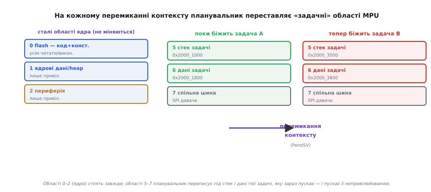
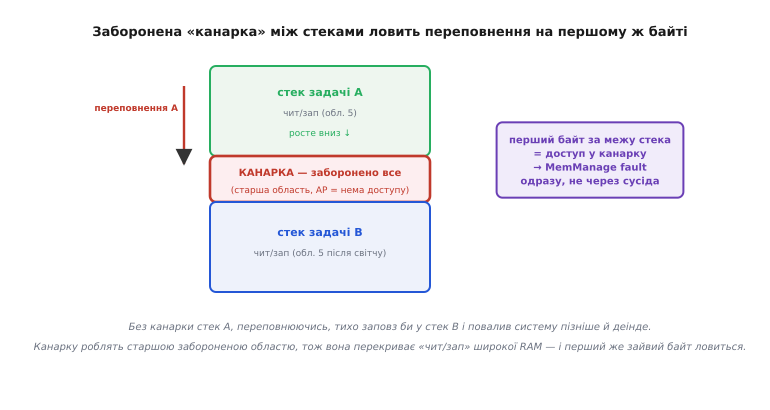

# ⚙️ Ізоляція задач в ОСРЧ: планувальник переставляє MPU на кожному контекст-світчі

## Задача

В операційній системі реального часу (ОСРЧ) на одному ядрі живе кілька задач, і кожна вважає, що процесор належить тільки їй. Планувальник по черзі дає їм крихітні шматки часу, зберігаючи й відновлюючи регістри, — це **перемикання контексту** (англ. *context switch*). Класична ОСРЧ на цьому й зупиняється: пам'ять у всіх спільна, будь-яка задача бачить стек, дані й купу будь-якої іншої. Тож дикий вказівник у задачі-логері спокійно затре стек задачі-керування двигуном, і апарат впаде — але не в логері, а в керуванні, за пів секунди, у геть іншому місці. Слід загублено.

Ми хочемо це вилікувати апаратно. Кожна задача має бачити **лише свою** пам'ять: свій стек, свої дані, ту периферію, яку їй явно дозволили. Спроба задачі торкнутися чужого має ловитися **в тому ж такті**, у якому сталася, а не спливати десь потім. І — головне — це не має вимагати переписати самі задачі: вони пишуться звичайним C, ніби нічого й немає.

Інструмент для цього — блок захисту пам'яті (MPU), апаратний вартовий на шляху кожного звернення ядра до пам'яті. Але сам собою MPU статичний: він тримає жменьку областей, і поки їх не переписати, вони діють для всіх однаково. Ключова ідея цієї вставки саме в тому, як **зшити MPU з планувальником**: зробити частину областей «задачними» й переставляти їх щоразу, коли планувальник міняє задачу. Тоді для кожної задачі, поки вона біжить, MPU налаштований персонально під неї.

## Ідея: половину областей — під ядро, половину — під поточну задачу

MPU на класичному ядрі ARMv7-M (Cortex-M3/M4/M7) має вісім областей. Розділимо їх на дві групи за призначенням.

**Сталі області ядра** описують те, що однакове для всіх задач, і **ніколи не міняються**: flash із кодом і константами (усім читати й виконувати), ядрові дані й купа планувальника (лише привілейованому), блок регістрів периферії (теж лише привілейованому). Ці області ставлять один раз при старті — і забувають.

**Задачні області** описують пам'ять **саме тієї задачі, яка зараз біжить**: її стек, її дані, можливо, шматок периферії, до якого їй дано доступ. Ось ці області планувальник **переписує на кожному перемиканні контексту** — стирає налаштування задачі, що йде спати, і кладе налаштування задачі, що прокидається.


*Області 0–2 описують ядро й стоять весь час. Області 5–7 — «вікно» під поточну задачу: планувальник переписує їх під стек і дані тієї задачі, яку зараз пускає, і пускає її непривілейованою. Задача бачить свою пам'ять і сталі ядрові області — і більше нічого.*

Чому це працює? Тому що вартовому байдуже, що там за задача, — він просто звіряє кожну адресу з поточним набором областей. Якщо в цьому наборі стек задачі A відсутній (бо ми його стерли й поклали стек B), то звернення до стека A з коду задачі B впирається у стіну: адреса не покрита жодною дозволеною областю, MPU кидає **MemManage fault**. Ізоляція виходить не з добросовісності коду, а з фізичної відсутності дозволу.

> 🔧 **Навіщо це.** Це та сама межа, за якою [межі super-loop](root:embedded/super-loop-limits) вичерпуються і настає час справжніх [задач](root:sf-os/tasks) із власними [стеками](root:sf-lang/task-stacks). Проста прошивка з одним стеком не має чого ізолювати. Але щойно задач кілька і кожна зі своїм стеком, MPU перетворює найпідступніший клас багів — тихе псування чужої пам'яті, що спливає деінде, — на гучний, прицільний виняток. Для дрона чи будь-чого, де збій некритичної задачі не має класти критичну, це не розкіш, а вимога безпеки.

Другий бік ідеї — **привілеї**. Планувальник (ядро) біжить у привілейованому режимі: тільки звідти взагалі дозволено писати в регістри MPU. А самі задачі планувальник пускає в **непривілейованому** режимі. Це замикає систему: задача не може ні змінити свої області (регістри MPU для неї закриті), ні вийти за них (вартовий перевіряє кожне звернення). Якби задача бігла привілейованою, вона б сама переписала MPU й уся охорона стала б декорацією.

## Код: як планувальник переставляє області в контекст-світчі

Зберемо робочий кістяк. Він навмисне спрощений проти справжньої ОСРЧ (немає черг, семафорів, пріоритетів), але **механізм ізоляції в ньому справжній** — точно той, який роблять зрілі порти на кшталт MPU-версії FreeRTOS.

Спершу опишемо, що ОСРЧ пам'ятає про кожну задачу. Крім указника стека (те, що зберігає будь-який планувальник), нам треба тримати **готовий опис задачних областей MPU** — щоб на перемиканні не рахувати їх наново, а просто залити в регістри. Це блок керування задачею (англ. *Task Control Block*, TCB):

```c
#include "core_cm4.h"     // CMSIS: структура MPU, біти-маски RASR/RBAR
#include <stdint.h>

#define TASK_REGIONS  3   // скільки областей віддано під одну задачу (5,6,7)

// один запис області у вже готовому для заливки вигляді:
// саме ті значення, що підуть у RBAR і RASR
typedef struct {
    uint32_t rbar;        // база + біт VALID + номер області (REGION)
    uint32_t rasr;        // ENABLE | розмір | права | XN | атрибути
} MpuRegion;

typedef struct {
    uint32_t   *sp;                    // збережений указник стека задачі
    MpuRegion   regions[TASK_REGIONS]; // ГОТОВИЙ опис її областей MPU
} TCB;

static TCB  tasks[2];        // дві задачі для прикладу
static TCB *current;         // хто біжить зараз
```

Тепер — серце всього. Функція, що заливає задачні області в MPU. Вона гаряча (крутиться на кожному перемиканні), тож має бути короткою: жодних обчислень, лише запис уже готових значень.

```c
// Залити три задачні області з TCB прямо в регістри MPU.
// Викликається на кожному перемиканні контексту → мусить бути швидкою.
static void mpu_load_task(const TCB *t)
{
    // Записуємо RBAR/RASR парами. Номер області (REGION) уже зашитий
    // у полі RBAR кожного запису, тож RNR чіпати не треба:
    // біт VALID у RBAR каже залізу «номер бери з поля REGION».
    for (int i = 0; i < TASK_REGIONS; i++) {
        MPU->RBAR = t->regions[i].rbar;   // база + VALID + REGION
        MPU->RASR = t->regions[i].rasr;   // права/розмір/дозвіл
    }
}
```

Тут перша тонкість, яку легко проґавити. У наївному коді область описують у три ходи: `MPU->RNR = idx; MPU->RBAR = base; MPU->RASR = attrs;`. Але регістр `RBAR` має біт **VALID**: якщо його виставити й покласти номер області прямо в молодші біти `RBAR`, то одна пара записів `RBAR`+`RASR` описує область цілком, а `RNR` чіпати не треба. Для гарячого шляху це вдвічі менше звернень до регістрів — три записи замість шести на кожну область. Дрібниця, але на кожному контекст-світчі, тисячі разів на секунду, вона рахується.

Готуємо ці значення **раз** при створенні задачі — там, де швидкість не важить:

```c
// Помічник: спакувати опис області у формат RBAR+RASR один раз при старті.
// size_pow2 — показник степеня: 10 → 1 КБ (2¹⁰), 11 → 2 КБ, …
static MpuRegion make_region(uint32_t region_num, uint32_t base,
                             uint32_t size_pow2, uint32_t ap, int exec)
{
    MpuRegion r;
    // RBAR: база (кратна розмірові!) + VALID + номер області в молодших бітах
    r.rbar = (base & MPU_RBAR_ADDR_Msk)
           |  MPU_RBAR_VALID_Msk
           | (region_num & MPU_RBAR_REGION_Msk);
    // RASR: увімкнути | (size-1)<<SIZE | права AP | (не викон. коли !exec)
    r.rasr = MPU_RASR_ENABLE_Msk
           | ((size_pow2 - 1) << MPU_RASR_SIZE_Pos)
           | (ap << MPU_RASR_AP_Pos)
           | (exec ? 0 : MPU_RASR_XN_Msk);
    return r;
}

#define AP_RW_RW  0x3u   // обом режимам: читати й писати
#define AP_RW_RO  0x2u   // привіл. — чит/зап, непривіл. — тільки читати
#define AP_NONE   0x0u   // доступ заборонено обом (для «канарки»)

// Створити задачу: віддати їй власний стек і блок даних.
static void task_create(TCB *t, uint32_t stack_base, uint32_t stack_pow2,
                        uint32_t data_base, uint32_t data_pow2)
{
    // Область 5 — стек задачі: обом чит/зап, виконувати ЗАБОРОНЕНО (XN)
    t->regions[0] = make_region(5, stack_base, stack_pow2, AP_RW_RW, 0);
    // Область 6 — дані задачі: обом чит/зап, теж XN (дані не виконують)
    t->regions[1] = make_region(6, data_base,  data_pow2,  AP_RW_RW, 0);
    // Область 7 — приклад: шматок даних тільки для читання (спільні константи)
    t->regions[2] = make_region(7, data_base,  data_pow2 - 1, AP_RW_RO, 0);

    // указник стека кладемо на вершину стека (стек росте вниз)
    t->sp = (uint32_t *)(stack_base + (1u << stack_pow2));
}
```

Тепер саме перемикання. У Cortex-M правильне місце для контекст-світчу — обробник **PendSV** (англ. *Pendable Service Call* — відкладений системний виклик): це виняток найнижчого пріоритету, який навмисне тримають для перемикання задач, щоб воно сталося вже після того, як відпрацюють усі важливіші переривання. Планувальник вибирає наступну задачу, і **перед тим, як віддати їй керування, переставляє MPU**:

```c
// Спрощене ядро перемикання. У справжній ОСРЧ навколо ще збереження/
// відновлення регістрів і вибір задачі за пріоритетом; тут головне —
// ПОРЯДОК: спершу переставити MPU, тоді пускати задачу.
void scheduler_switch_to(TCB *next)
{
    current = next;

    // 1) Залити задачні області нової задачі в MPU
    mpu_load_task(next);

    // 2) Бар'єри: дочекатися, поки нова конфігурація MPU НАБУДЕ СИЛИ,
    //    перш ніж перша інструкція задачі торкнеться пам'яті
    __DSB();      // усі попередні записи (в регістри MPU) завершено
    __ISB();      // конвеєр перезавантажено — далі діють нові права

    // 3) далі йде відновлення контексту задачі й вихід у неї
    //    (у непривілейованому режимі — про це нижче)
}
```

Порядок тут не косметичний. Спершу переставляємо MPU, і **лише коли бар'єри підтвердили, що нові права діють**, віддаємо керування задачі. Поміняй місцями — і виникне вузьке вікно, у якому задача B уже біжить, а MPU ще налаштований під A: рівно та діра, крізь яку тихе псування й пролазить.

## «Канарка» між стеками: ловимо переповнення на першому ж байті

Найчастіша аварія в багатозадачній системі — **переповнення стека** (див. [переповнення стека](root:sf-lang/stack-overflow)). Задача рекурсивно провалюється або кладе на стек величезний локальний масив, указник стека сповзає нижче дна відведеної їй ділянки — і починає писати в те, що лежить одразу за нею. Якщо там стек сусідньої задачі, наслідок класичний: сусід валиться пізніше й деінде.

MPU дає дешеву й точну пастку: **«канарка»** (англ. *canary* — за шахтарськими канарками, що гинули від газу першими й тим попереджали людей) — вузька заборонена область між стеками. Робимо її **старшою** областю, ніж широка «уся RAM — читати й писати», з правами «доступ заборонено обом» (`AP_NONE`). За правилом перекриття старша область виграє, тож у смузі канарки запис заборонено, хоч навколо RAM і відкрита. Перший же байт, який переповнений стек спробує туди покласти, дає MemManage fault.


*Канарка — старша заборонена область, тож вона перекриває дозвіл широкої RAM. Перший зайвий байт переповнення ловиться одразу, а не після того, як стек уже потоптав сусіда.*

У коді це ще одна область — але **стала**, бо канарка на тому самому місці для всіх задач. Кладемо її раз при старті, поряд зі сталими ядровими:

```c
// Стала «канарка»: 32 байти між стеками, доступ заборонено обом.
// Ставимо ОДИН раз при старті. Робимо старшою за широку RAM-область,
// щоб її «заборонено» перекрило «чит/зап» — тому даємо їй область 4
// (старшу за ядрові 0–2, але це не задачна 5–7).
static void mpu_setup_canary(uint32_t canary_base)
{
    MpuRegion c = make_region(4, canary_base, 5 /* 2⁵ = 32 Б */,
                              AP_NONE, 0);
    MPU->RBAR = c.rbar;
    MPU->RASR = c.rasr;
}
```

Одразу вилазить пастка вирівнювання, про яку варто сказати вголос. Канарку на 32 байти можна поставити лише на адресу, кратну 32. Дно стека A і вершина стека B мусять збігтися з цією межею — інакше залізо мовчки зсуне базу (молодші біти під розмір ігноруються), і канарка опиниться не там, де ви думали. На ARMv7-M це загальне правило: **розмір області — степінь двійки, база — кратна розмірові**. Тому стеки задач вигідно самі робити розміром у степінь двійки й ставити впритул один до одного з канаркою між ними — тоді все вирівнюється саме собою, а канарку можна навіть не виділяти окремо: достатньо, щоб задачна область стека **не покривала** останні 32 байти, і вихід за них ловитиме сталий «дефолт-заборонено» поза описаними областями.

## Обробник MemManage_Handler: читаємо MMFAR і MMFSR

Коли MPU ловить порушення, ядро негайно кидає задачу й стрибає в `MemManage_Handler`. Наша робота — дістати з нього діагноз: **яка адреса** й **який характер** порушення. Два регістри тримають готові докази.

**MMFAR** (англ. *MemManage Fault Address Register*) — точна адреса, до якої ліз код. **MMFSR** (*MemManage Fault Status Register*) — це молодший байт ширшого регістра `SCB->CFSR`; окремими бітами він каже, що саме сталося:

- `MMARVALID` — адреса в MMFAR достовірна (без цього біта MMFAR читати немає сенсу);
- `DACCVIOL` — порушення доступу до **даних** (читання чи запис у заборонену область — типове дике псування);
- `IACCVIOL` — порушення при **вибірці інструкції** (ядро спробувало виконувати код із області, позначеної XN, — слід зіпсованого вказівника повернення);
- `MSTKERR` / `MUNSTKERR` — порушення сталося на **автоматичному укладанні/діставанні** кадру винятку зі стека (саме цей біт часто й свідчить про переповнення стека: ядро не змогло покласти кадр).

```c
#include "core_cm4.h"

// зручні маски молодшого байта CFSR (це і є MMFSR)
#define MMFSR_IACCVIOL   (1u << 0)   // вибірка інструкції з XN-області
#define MMFSR_DACCVIOL   (1u << 1)   // читання/запис у заборонену область
#define MMFSR_MUNSTKERR  (1u << 3)   // помилка при діставанні кадру зі стека
#define MMFSR_MSTKERR    (1u << 4)   // помилка при укладанні кадру на стек
#define MMFSR_MMARVALID  (1u << 7)   // адреса в MMFAR достовірна

// Виклик із MemManage_Handler. Тут ми в привілейованому режимі,
// тож маємо доступ до системних регістрів SCB.
void mpu_fault_report(void)
{
    uint32_t mmfsr = SCB->CFSR & 0xFFu;       // молодший байт = MMFSR
    uint32_t addr  = (mmfsr & MMFSR_MMARVALID)
                   ?  SCB->MMFAR              // адреса злочину
                   :  0xFFFFFFFFu;            // недостовірна

    // на цьому місці зазвичай: залогувати addr/mmfsr,
    // прибити ЛИШЕ винну задачу й перемкнутися на наступну,
    // а не валити всю систему — у цьому і сенс ізоляції.

    if (mmfsr & MMFSR_DACCVIOL) {
        /* дике читання/запис за addr — знайдено винну інструкцію */
    }
    if (mmfsr & MMFSR_IACCVIOL) {
        /* спроба виконати дані/стек — зіпсований вказівник повернення */
    }
    if (mmfsr & (MMFSR_MSTKERR | MMFSR_MUNSTKERR)) {
        /* збій на кадрі винятку — найпевніше переповнення стека */
    }

    // очистити біти статусу (запис одиницею скидає їх — write-1-to-clear)
    SCB->CFSR = mmfsr;

    (void)addr;
}
```

Сам вектор — коротка обгортка. У ній є одна важлива для ОСРЧ дрібниця: коли порушення сталося в непривілейованій задачі, ядро при вході у виняток уклало її кадр на **її ж** стек (той, що вказує `PSP` — Process Stack Pointer, окремий указник стека для задач). Якщо ми хочемо не просто залогувати, а й акуратно «прибити» винну задачу, треба дістати саме `PSP` — там лежить її збережений стан, зокрема адреса інструкції-порушника (`PC` у кадрі):

```c
void MemManage_Handler(void)
{
    mpu_fault_report();

    // Тут ОСРЧ може взяти PSP винної задачі й прочитати з кадру її PC —
    // точну інструкцію, що спричинила порушення:
    //   uint32_t *frame = (uint32_t *)__get_PSP();
    //   uint32_t bad_pc = frame[6];   // зміщення PC у кадрі винятку
    // а тоді позначити задачу як «збійну» й викликати планувальник.

    for (;;) { }   // у демо — зупиняємось; в ОСРЧ — switch на іншу задачу
}
```

Щоб усе це взагалі спрацювало, MemManage як окремий виняток треба **ввімкнути** — інакше порушення MPU підіймається до загального `HardFault`, звідки теж усе видно, але не так адресно. Вмикають його одним бітом при старті:

```c
// Увімкнути MemManage як окремий виняток (інакше → HardFault).
SCB->SHCSR |= SCB_SHCSR_MEMFAULTENA_Msk;
```

## Складність і пастки

Механізм простий на око, але навколо нього рояться підводні камені. Пройдімося по тих, що коштують найдорожче.

**Вартість переналаштування — це податок на кожен контекст-світч.** Перестановка трьох областей — це шість (а з трюком VALID — усе одно шість: три пари) записів у регістри MPU плюс `DSB`+`ISB`. `ISB` особливо недешевий: він скидає конвеєр процесора, змушуючи наступні інструкції вибиратися заново. На фоні повного перемикання контексту (збереження й відновлення регістрів, вибір задачі) це небагато, але це **не нуль**, і воно множиться на частоту перемикань. Тому задачних областей роблять мало (три-чотири), а не «щедро вісім»: кожна зайва область — це ще пара записів на кожному світчі. Якщо ОСРЧ перемикається сотні тисяч разів на секунду, ця арифметика вилазить у профіль.

**Вирівнювання під степінь двійки диктує розкладку пам'яті, а не навпаки.** На ARMv7-M не можна взяти стек на рівно 3 КБ і покрити його однією областю — доведеться або 4 КБ (з «зайвим» кінцем), або дві області. І база мусить бути кратна розмірові. Це означає, що стеки й дані задач треба **розкладати в пам'яті свідомо**, під степені двійки й на вирівняні адреси, ще на етапі лінкера. Найпоширеніша помилка новачка — оголосити стек як `uint8_t stack[3000]` де попало й здивуватися, чому MPU «захищає не те»: база масиву не вирівняна, розмір не степінь двійки, і залізо тихо зсунуло область. Ліки — вирівнювати стеки директивою компілятора (`__attribute__((aligned(1024)))`) і брати розмір степенем двійки. На новіших ядрах ARMv8-M (Cortex-M23/M33) це болить менше: там область задають парою «база — межа», кратних лише 32 байтам, — але сам код перестановки областей майже той самий, змінюються тільки поля регістрів.

**Бар'єри обов'язкові — але тонко.** `DSB`+`ISB` після зміни MPU потрібні, щоб нові права набули сили до першого звернення під ними. Пропустиш — і на швидкому ядрі з глибоким конвеєром перша інструкція задачі може встигнути звернутися до пам'яті **зі старими** правами: рідкісний, невідтворюваний баг, що з'являється раз на тисячу перемикань. Але є й зворотний нюанс, який економить такти: якщо перестановка MPU відбувається **всередині обробника винятку** (а PendSV — це виняток) і зразу за нею йде **вихід із винятку** в задачу, то сам вихід із винятку є подією синхронізації контексту — він відіграє роль `ISB`. Тобто у справжньому порті, де MPU переставляють у PendSV і одразу роблять `BX LR` у задачу, окремий `ISB` перед виходом часто зайвий: його безкоштовно робить сам вихід. У прикладі вище я лишив `ISB` явним — так надійніше й зрозуміліше, — але знати, що вихід із винятку його дублює, корисно: це пояснює, чому в чужому коді порту ви можете `ISB` і не побачити. `DSB` при цьому лишається потрібним завжди — він про завершення **записів** у регістри MPU, а не про конвеєр.

**Область даних `volatile` і компілятор.** Регістри `MPU->RBAR`/`RASR` та `SCB->CFSR` у CMSIS оголошені `volatile` не випадково: без цього компілятор міг би «оптимізувати» повторні записи в ту саму адресу або переставити їх місцями, зруйнувавши потрібний порядок (докладніше — [volatile](root:sf-lang/volatile)). Покладайтеся на CMSIS-оголошення й не копіюйте адреси регістрів «сирими» вказівниками без `volatile`.

**Ізоляція — не панацея, а межа розумного.** MPU ловить порушення **прав доступу**, а не логічні помилки. Задача, яка має право писати у свій буфер, спокійно запише в нього дурницю — MPU це пропустить, бо доступ дозволений. Ізоляція обмежує **радіус ураження** («задача не потопче чужого»), але не робить код правильним усередині його власної пісочниці. І ще: спільні ресурси (та сама периферія, до якої дано доступ кільком задачам через область 7) MPU не серіалізує — за узгоджений доступ до них усе одно відповідають семафори й м'ютекси ОСРЧ. MPU каже «кому можна торкатися», а не «в якому порядку».

**Порядок дій при налаштуванні — і не забути `PRIVDEFENA`.** Стала частина (ядрові області, канарка, вмикання MemManage) ставиться раз при старті; задачна — переписується на кожному світчі. При старті MPU вмикають з бітом `PRIVDEFENA` у `MPU->CTRL`: він лишає **привілейованому** коду (тобто самому ядру планувальника) стандартну карту пам'яті поза описаними областями, тож ядру не треба описувати геть кожен регіон. Але **непривілейованих** задач це послаблення не стосується: для них поза їхніми областями діє «заборонено», і саме тому вони й опиняються в пісочниці. Скинеш `PRIVDEFENA` — суворіше, але тоді й ядру доведеться явно описати все, чого воно торкається, включно з власним стеком і периферією.

Підсумок простий: апаратна ізоляція задач — це не окрема велика підсистема, а **три-чотири області MPU, які планувальник переставляє в PendSV**, плюс дисциплінована розкладка стеків під степені двійки, плюс обробник, що читає MMFAR/MMFSR. Складність не в самому механізмі — вона у вирівнюванні, порядку, бар'єрах і у чесному розумінні, що саме ізоляція обіцяє, а чого ні.
