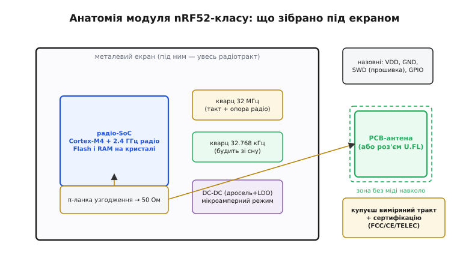
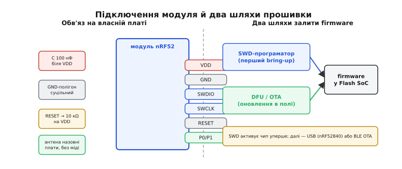

# 🔌 Модулі nRF52-класу: радіо із сертифікованою антеною «з коробки»

## Клас пристрою

**Модуль nRF52-класу** (*module / SoM, System-on-Module*) — це мала екранована плата, де радіо-SoC уже зібрано з усім ВЧ-обв'язком: PCB-антена або роз'єм U.FL, π-ланка узгодження (*matching*), ВЧ-кристал 32 МГц, годинниковий кристал 32.768 кГц, дросель і конденсатор DC-DC-регулятора, розв'язувальні ємності. Виробник виміряв тракт, налаштував узгодження й отримав **сертифікацію** (*regulatory certification*) — FCC, CE або TELEC — і саме це купують разом із чипом.

Важливо не сплутати цей клас із модулями на кшталт ESP32-WROOM: той самий жанр «модуль», але принципово інший зміст. WROOM — це ESP32 із зовнішньою Flash і радіо, до якого підключаються ззовні, як до периферії. nRF52-модуль **і є мікроконтролер**: весь ваш код виконується безпосередньо на SoC всередині модуля, жодного «хоста» над ним немає. Не сплутайте і з nRF24-класом — той лише трансивер без процесора, яким керує зовнішній МК по SPI; тут — зовсім інша архітектура.

Для радіо найдорожче й найризикованіше — антена разом із проходженням сертифікації; модуль продає це готовим. Саме це і означає «з коробки» з назви.

---

## Що під екраном (блок-схема плати)

Уявіть металеву кришку розміром із монету: вона і є «екран». Під нею — компактна екосистема, де кожен блок виконує конкретну радіо-функцію.

**Радіо-SoC** (Cortex-M4 + 2.4 ГГц радіо) — серце модуля. Усередині кристала вже є Flash і RAM, тому зовнішнього чипа пам'яті не потрібно — це відрізняє nRF52-клас від [RP2040/Pico](root:hw-arch/rp2040-pio), де Flash винесена окремою мікросхемою. SoC сам виконує прошивку, сам керує радіо.

**Два резонатори** — ВЧ-кристал 32 МГц і годинниковий 32.768 кГц. Перший задає тактування ядра і дає радіотракту потрібну точну опорну частоту. Другий — повільний і вкрай малоспоживний — буквально будить чип зі сну через задані інтервали. Без нього мікроамперне споживання просто недосяжне: ядро спить, але таймер на 32.768 кГц тихо відлічує секунди й піднімає систему рівно тоді, коли треба.

**DC-DC-дросель і LDO** — nRF52 має вбудований імпульсний DC-DC-конвертер, який різко скорочує споживання під час радіопередачі; дросель і конденсатор для цього регулятора виведені на плату модуля. Саме він відповідає за ту частину «мікроамперів», яку дає радіотракт.

**π-ланка узгодження (matching) і антена** — налаштована мережа із котушок і конденсаторів, що перетворює вихідний імпеданс SoC на стандартні 50 Ом антени. PCB-антена, доріжка-меандр або роз'єм IPEX/U.FL під зовнішню антену — залежно від конкретного модуля. Під антеною і в зоні 3–5 мм навколо неї — жодного шару міді: мідь змінює ефективну діелектричну проникність і розлаштовує резонанс, дальність падає. Це загальне правило для всіх радіо-модулів, яке однаково стосується і ESP32-WROOM.

**Металевий екран** — утримує паразитне випромінювання всередині, захищає від зовнішніх перешкод і є частиною доказової бази під час EMC-сертифікації.



*Під екраном: радіо-SoC (Cortex-M4 + 2.4 ГГц радіо, Flash і RAM на кристалі), ВЧ-кристал 32 МГц і годинниковий 32.768 кГц, вбудований DC-DC для мікроамперного режиму, π-ланка узгодження й антена (навколо неї — навмисно без міді). Назовні — лише живлення, GND, порт SWD і піни GPIO самого чипа; разом це і є виміряний тракт із готовою сертифікацією.*

> 🔧 **Навіщо це.** Зібраний і виміряний виробником радіотракт означає задекларовану дальність і складену сертифікацію. Самостійно розвести 2.4 ГГц-тракт і пройти випробування на відповідність — місяці роботи й реальний ризик провалу. Модуль продає цей результат готовим.

---

## Типова розпіновка

Виводи модуля — це переважно просто GPIO самого SoC плюс живлення і порт прошивки. Жодної «хост-шини» немає, бо МК і є сам модуль.

```
VDD         — живлення (типово 1.7–3.6 В; широкий діапазон — перевага для батарей)
GND         — спільна земля
SWDIO/SWCLK — порт прошивки й налагодження (SWD; через нього заливають firmware)
P0.xx/P1.xx — лінії GPIO (вони ж I2C/SPI/UART/ADC — призначаються в коді)
RESET       — скидання (часто це теж GPIO, налаштовуваний)
(VBUS/D+/D−)— якщо SoC із USB (nRF52840-клас): живлення й USB DFU
```

Контраст із модулями-периферіями (SD-карта, WROOM у ролі Wi-Fi-модема) разючий: у тих виводи — це інтерфейс до хоста, чітко зафіксований протоколом. Тут хоста немає: P0 і P1 — це ваші піни, і ви самі призначаєте на них I2C, SPI, UART або PWM у коді.

---

## Підключення на власній платі

Мінімум зовнішнього обв'язку модуля — це його головна практична перевага: весь ВЧ-тракт уже всередині.

Ззовні потрібно: VDD із розв'язувальними конденсаторами 100 нФ якомога ближче до пінів живлення; GND на суцільний полігон без переривань під модулем; SWDIO і SWCLK на 2-контактний SWD-роз'єм або хоча б на тестові площадки — без них чип неможливо прошити вперше; RESET із підтяжкою 10 кΩ до VDD, щоб лінія не висіла в повітрі; решта P0/P1 — за схемою периферії.

Правило антени: модуль кладеться краєм до краю власної плати так, щоб антена виходила за межу PCB, а під антеною і в зоні навколо неї — без шарів міді, без полігонів, без трас. Те саме правило діє для ESP32-WROOM і загалом для всіх радіо-модулів: мідь поряд з антеною розстроює її і зменшує дальність.



*Зліва — мінімальний обв'яз: VDD із bypass-конденсатором, GND на полігон, RESET із підтяжкою, P0/P1 вільно під периферію, антена за межею плати без міді навколо. Справа — два шляхи firmware: SWD-програматор (перший раз) і DFU без програматора (USB на nRF52840 або OTA по BLE).*

---

## «Перший байт» — як залити firmware

На відміну від SD-карти чи WROOM у ролі Wi-Fi-модема, тут немає «надіслати байт по шині» — модуль і є МК, а отже **перший крок — залити прошивку в сам чип**. Для цього є два шляхи.

**SWD-програматор** (заводський bring-up, перший раз): під'єднуєте SWDIO/SWCLK/GND/VDD до апаратного відлагоджувача (J-Link, nRF-DK або OpenOCD-сумісний), прошиваєте образ. Це канонічний шлях для bare-metal — без нього чип не активований.

**DFU без програматора** (оновлення в полі): бутлоадер приймає новий образ або через USB (на SoC із підтримкою USB, як nRF52840-клас) у режимі DFU, або OTA по BLE з іншого пристрою. Це частина зручності «з коробки»: раз прошив через SWD, далі оновлюєш бездротово. Як влаштовані [BLE-стек і GATT-профілі](root:com-protocol/ble-gatt) — окрема велика тема.

**Приклад (перший firmware: блимання як ознака життя).** Найперша корисна перевірка після прошивки — побачити, що ланцюг живий: живлення подано, SoC стартував, ваш код виконується.

:::tabs
```cpp
#include <stdint.h>
#include "nrf_gpio.h"   /* nRF5 SDK: nrfx або legacy nrf_gpio */

#define LED_PIN   17    /* P0.17 — типовий LED на багатьох nRF52-модулях */

static void delay_ms(uint32_t ms) {
    /* Проста затримка-заглушка; у реальному firmware — nrfx_coredep_delay */
    volatile uint32_t n = ms * 6400u;
    while (n--) __NOP();
}

int main(void) {
    /* Конфігуруємо пін як вихід */
    nrf_gpio_cfg_output(LED_PIN);

    while (1) {
        nrf_gpio_pin_toggle(LED_PIN);   /* інвертуємо: 0→1→0→… */
        delay_ms(500);
        /* Блимає = живлення, кварц 32 МГц, ядро й прошивка — живі.
           BLE-стек вмикається окремо поверх цього каркасу. */
    }
}
```
```micropython
from machine import Pin
import time

LED_PIN = 17   # P0.17 — типовий LED на багатьох nRF52-модулях

# Конфігуруємо пін як вихід
led = Pin(LED_PIN, Pin.OUT)

while True:
    led.toggle()          # інвертуємо: 0→1→0→…
    time.sleep_ms(500)
    # Блимає = живлення, кварц 32 МГц, ядро й прошивка — живі.
    # BLE-стек вмикається окремо поверх цього каркасу.
```
:::

Вийшло блимання — отже живлення, кварц, Cortex-M4 і ваша збірка разом із прошивкою через SWD справно працюють. Далі надбудовуєте BLE-стек і логіку застосунку.

---

## Типові граблі

- **Мідь і метал під антеною** — полігон землі, доріжка, корпус пристрою, акумулятор впритул до антени: дальність обвалюється незалежно від якості SoC. Дотримання зони відступу — це не рекомендація, а умова заявленої роботи.

- **Забутий порт SWD** — якщо розвести плату без доступу до SWDIO/SWCLK, прошити перший раз буде нема як. Лишайте хоч тестові площадки — п'ять хвилин пайки врятують від викиду партії.

- **DC-DC-дросель і конденсатор** — якщо плата підтримує DC-DC-режим, але дросель обраний неправильний або конденсатор відсутній, регулятор не вмикається і чип залишається на LDO з вищим споживанням. «Мікроамперів» на TX-сплеску ви не побачите.

- **Просідання живлення на сплеску TX** — пік струму в момент радіопередачі здатен скинути слабке джерело; bypass-конденсатор якомога ближче до VDD — та сама хвороба, що й у будь-якого вузла з різкими сплесками струму (від SD-карти до радіо). Подбайте про це заздалегідь, а не після першого таємничого перезапуску.

- **Підтяжка RESET** — RESET-пін, що висить у повітрі, дає нестабільний старт при перехідних процесах на живленні. Підтяжка 10 кΩ до VDD — це мінімальний обов'язковий захист.

- **Плутанина nRF24 ↔ nRF52** — nRF24-клас є виключно радіо-трансивером без процесора: ним керує зовнішній МК по SPI. nRF52-клас — повноцінний SoC, що сам виконує код. Не переплутайте при закупівлі й розведенні: схема підключення, логіка прошивки й уся архітектура — різні.

---

## Варіації класу

Лінійка nRF52 охоплює спектр від компактних низькоспоживних варіантів (nRF52810 — спрощена периферія, без USB) і масового nRF52832 до nRF52840-класу з більшим обсягом Flash і RAM, апаратним USB і вбудованою криптографією. Новіші nRF5340 і nRF54-класи мають двоядерну архітектуру з виділеним мережевим ядром. Антена — або PCB-доріжка на самому модулі, або роз'єм IPEX/U.FL для підключення зовнішньої антени з кращою дальністю: це спільне для всіх радіо-модулів-класів.

Ті самі чипи підтримують не лише BLE, а й Thread, Zigbee і власні протоколи Nordic — варто знати це до закупівлі, щоб не звузити вибір передчасно.

Хоч би яке сімейство ви взяли, купуєте ви не чип, а **сертифікований радіо-вузол** — так само, як із ESP32-модулями. Змінюються можливості SoC, але сенс покупки модуля лишається тим самим.
