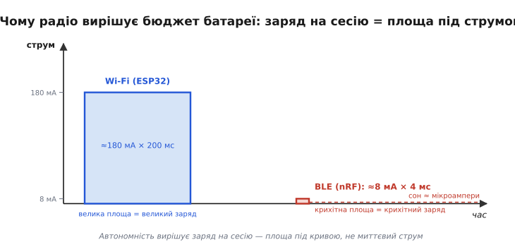
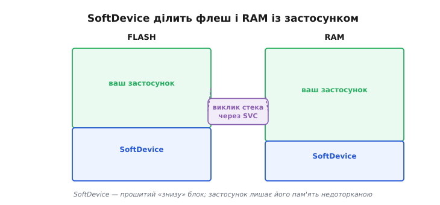
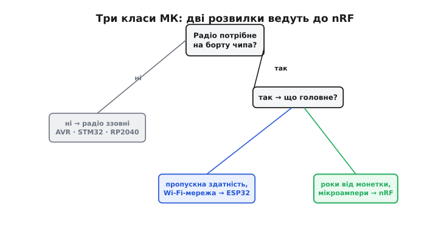

# nRF-клас

Більшість мікроконтролерів радіо не мають. [AVR-клас](topic:hw-arch/avr), [STM32-клас](topic:hw-arch/stm32), [RP2040](topic:hw-arch/rp2040-pio) — усі без передавача на кристалі. Це водночас їхня сила (чип дешевший, споживає менше) і їхня межа: щойно пристрою треба говорити бездротово, радіо доводиться доклеювати окремою мікросхемою. [ESP32 з його архітектурою](topic:hw-arch/esp32-architecture) пішов іншим шляхом і поставив на той самий кристал повноцінні Wi-Fi і Bluetooth — але за це доводиться платити струмом: навіть просто підтримуючи зв'язок із точкою доступу, ESP32 тягне десятки міліамперів, а в активному обміні — за сотню.

Є третій клас, де весь чип підпорядкований одній парі цілей: бездротовий зв'язок ближнього радіусу і споживання на рівні мікроамперів. Це **nRF-клас** (nRF — від *Nordic Radio Frequency*, серія радіо-SoC норвезької компанії Nordic Semiconductor). Тут радіо не доважок і не універсальний комбайн, а серце задуму: чип спить роками від крихітної батареї і прокидається на лічені мілісекунди, щоб передати маленький пакет.

> 🔧 **Навіщо це.** Цей клас обирають, коли пристрій носять на тілі або розкидають по великій площі, і він мусить жити роками від монетної батарейки, лише зрідка надсилаючи невеликий пакет поруч. Носимий датчик пульсу, маяк-«пінг» на складі, давач вологості в полі — ось ніша, де nRF не має рівних, а Wi-Fi-чип просто з'їсть батарею за тижні.

## Знайоме ядро, незвичний пріоритет

Усередині nRF — те саме [ядро Cortex-M](topic:hw-arch/cortex-m), що й у половини сучасних мікроконтролерів, і це принципово полегшує життя. NVIC, SysTick, CMSIS — увесь звичний апарат на місці; хто писав під STM32, той не вчить ядро наново. Конкретику видно по родинах: nRF52-серія несе одне ядро Cortex-M4 на 64 МГц, а новіша nRF53-серія (наприклад, nRF5340) — два ядра Cortex-M33, де одне віддане застосунку, а друге виділене суто під радіо.

Уся особливість не в самому ядрі, а в тому, навколо чого зібрано решту кристала. Радіоблок і керування живленням спроєктовані так, що активна передача триває лічені мілісекунди й тягне порядку 5–10 мА, а в глибокому сні чип опускається до часток мікроампера. У режимі System OFF nRF52832 споживає близько 0.3 мкА (300 нА) — це струм, за якого монетна батарея радше помре від власного саморозряду, ніж від навантаження. Слово SoC тут не випадкове: SoC (англ. *system on a chip*, «система на кристалі») означає, що процесор, пам'ять, радіоприймач і керування живленням сидять в одному корпусі, а не з'єднані доріжками на платі — саме ця інтеграція й дає змогу так агресивно гасити споживання.

Контраст із Wi-Fi-шляхом різкий не в цифрах налаштувань, а в самій постановці задачі. Асоціація з Wi-Fi-точкою займає сотні мілісекунд і потребує 150–300 мА; з'єднання BLE піднімається за мілісекунди й коштує одиниці міліамперів. BLE (англ. *Bluetooth Low Energy*, «Bluetooth низького споживання») від початку проєктувався під рідкісні короткі пакети, а не під потік даних — і саме під цей профіль заточено весь nRF.

## Скільки це коштує батареї

Найкраще різницю видно не на пікових струмах, а на **заряді** — добутку струму на час, бо саме заряд (у мА·год) випиває батарею. Високий, але миттєвий сплеск може коштувати менше за скромний, але довгий.



*Площа під кривою струму — це і є заряд на одну сесію. Високий і довгий Wi-Fi-сплеск забирає величезний заряд; короткий низький BLE-пакет — крихітний, а решту часу чип спить на мікроамперах.*

**Умова: давач прокидається раз на хвилину, вимірює і передає один невеликий пакет; решту часу спить.** Порахуймо для типового монетного елемента CR2032 (≈220 мА·год). Працюємо в А·с, тоді переводимо у звичні мА·год (1 мА·год = 3.6 А·с).

```
Сесія Wi-Fi (ESP32):  ~180 мА × 200 мс = 0.180 × 0.200 = 0.0360 А·с
Сесія BLE  (nRF):     ~8 мА  × 4 мс    = 0.008 × 0.004 = 0.000032 А·с

За добу — 1440 сесій (раз на хвилину):
  Wi-Fi:  1440 × 0.0360   = 51.84 А·с   = 51.84 / 3.6   = 14.4 мА·год/добу
  BLE:    1440 × 0.000032 = 0.046 А·с   = 0.046 / 3.6   ≈ 0.013 мА·год/добу
```

Сама лише передача вже відрізняється більш ніж у тисячу разів. Але для nRF головне попереду — це сон між сесіями. Якщо чип решту доби лежить у глибокому сні при 2 мкА:

```
Сон за добу:  86400 с × 2e-6 А = 0.1728 А·с = 0.1728 / 3.6 ≈ 0.048 мА·год/добу
Разом nRF:    0.013 (передача) + 0.048 (сон) ≈ 0.061 мА·год/добу

Запас ходу за зарядом:
  Wi-Fi (ESP32):  220 / 14.4   ≈ 15 діб
  nRF (BLE):      220 / 0.061  ≈ 3600 діб ≈ 10 років
```

Тут спрацьовує тверезе обмеження: понад десяток років «за зарядом» — це теорія, бо сам елемент CR2032 за ці роки помітно саморозряджається, і реальний строк осідає на кількох роках. Та навіть так розрив фундаментальний: тижні проти років. І це не пункт у налаштуваннях SDK, а архітектурне рішення, ухвалене на самому початку проєкту. За нього платять можливостями: BLE передає менше даних на меншу відстань (десятки метрів проти кілометрів Wi-Fi на відкритому просторі), не тягне відеопотік і вимагає поруч смартфон або BLE-шлюз замість звичного роутера. Прийнятні ці межі — і nRF дає роки автономності від монетки.

## SoftDevice: радіо, яке не треба писати

Сам кристал — це ще не готовий BLE-пристрій. Власне стек Bluetooth (хто з ким з'єднується, як діляться пакети, як шифрується канал) — величезний і складний шмат коду, який до того ж має пройти офіційну сертифікацію Bluetooth. Nordic вирішує це елегантно: дає **SoftDevice** (від англ. *soft* — програмний, і *device* — пристрій, тобто «програмний пристрій»: стек поводиться так, ніби це окремий апаратний вузол усередині чипа).

SoftDevice — це наперед скомпільований і прокваліфікований двійковий образ повного BLE-стека (GAP, GATT, ATT, Security Manager, L2CAP, Link Layer — усі рівні). Його прошивають у нижню частину флеш-пам'яті, а застосунок живе над ним і кличе стек через єдиний шлюз — інструкцію SVC процесора Cortex-M. Ключова умова: SoftDevice ділить флеш і RAM із застосунком, тож програма мусить лишити його ділянки пам'яті недоторканими — інакше стек ламається.



*SoftDevice — не бібліотека, яку компонують у власний бінарник, а окремий прошитий «знизу» блок флеш і RAM. Застосунок працює «над» ним і звертається до стека через інструкцію SVC, не чіпаючи його пам'яті.*

> 🔧 **Навіщо це.** Готовий сертифікований стек означає, що думати треба лише про свій застосунок, а не про відповідність радіо специфікації Bluetooth — пройти таку кваліфікацію самотужки коштувало б місяців роботи. Зворотний бік — пам'ять не вся ваша: під SoftDevice треба зарезервувати флеш і RAM, і про це слід пам'ятати ще на етапі планування прошивки.

## Куди nRF лягає серед класів МК

Вибір між класами зводиться до двох питань поспіль. Радіо потрібне просто на кристалі? Якщо ні — беруть AVR, STM32 чи RP2040 і за потреби доклеюють зовнішній радіомодуль. Якщо так — постає друге питання: що головніше, пропускна здатність і повноцінна IP-мережа чи роки автономної роботи від крихітної батареї.



*Дві розвилки ведуть до nRF. Немає радіо на борту — AVR/STM32/RP2040. Є радіо, але головне — пропускна здатність і Wi-Fi-мережа — ESP32. Є радіо, а головне — роки від монетки — nRF.*

Межі класів не такі гострі, як здається. [ESP32-C6 з родини ESP32](root:embedded/esp32-family) підтримує 802.15.4 (Thread, Zigbee) поряд із Wi-Fi і BLE — гібрид для випадків, де треба і мережева гнучкість, і ощадні mesh-мережі. Але nRF він не витісняє там, де вирішують мікроампери: ESP32-C6 у глибокому сні все одно споживає більше, ніж nRF у робочому режимі.

З іншого боку, сам nRF давно не лише про BLE. Ті самі чипи nRF52840 і nRF5340 несуть на борту Thread, Zigbee, NFC і власні протоколи Nordic — корисно знати це наперед, щоб не звужувати вибір передчасно. А фізичне втілення цього кристала майже завжди приходить не голою мікросхемою, а готовим радіо-вузлом.

> 🔌 У якому фізичному пакованні цей чип реально купують і ставлять на плату, чому для радіо-SoC модуль майже обов'язковий і як його під'єднати — у вставці [модулі nRF52-класу із сертифікованою антеною](topic:hw-arch/nrf-radio-mcu/api-nrf-modules.md).

Залізо задає межі можливого, та на практиці вибір мікроконтролера часто вирішує не сам кристал, а [екосистема навколо нього](topic:sys-bsystem/mcu-ecosystem) — інструменти, SDK, спільнота й готові бібліотеки.
