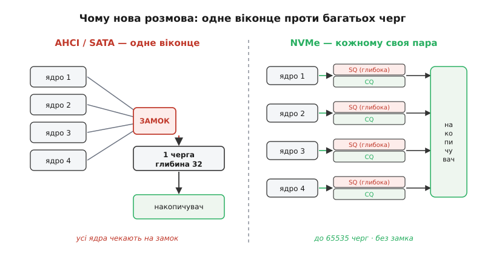
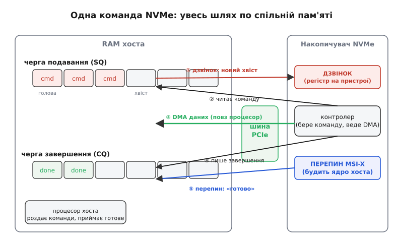

# NVMe

Усередині сучасного накопичувача сидить [флеш плюс контролер, що вдає диск](root:hw-arch/emmc-ssd): пам'ять NAND, яку керівна мікросхема ховає за простими секторами. Такий контролер віддає дані за **мікросекунди** — електронно, без жодного руху. А довгі роки ми зверталися до нього так само, як до жорсткого диска, що **фізично крутиться** й підводить головку до доріжки за **мілісекунди**. Різниця — тисячократна, і вся вона впиралася не в саму пам'ять, а в **розмову** між системою та накопичувачем: у протокол, який писали для повільного заліза. **NVMe** (*Non-Volatile Memory Express*, «експрес до енергонезалежної пам'яті») — це нова розмова, скроєна саме під швидку пам'ять. Не новий вид флеш і не новий контролер, а **домовленість**, як хост і накопичувач обмінюються командами так, щоб швидкий пристрій нарешті працював на повну.

Щоб побачити, навіщо взагалі знадобився новий протокол, треба зрозуміти, що стара розмова непомітно тягла на собі звички механічного диска — і саме ці звички душили флеш.

### Чому стара розмова душила флеш

Уяви чергу до єдиного віконця. Хоч скільки людей стоїть, обслуговують по одному, і всі чекають на того, хто попереду. Приблизно так влаштована стара розмова з накопичувачем — **AHCI** (*Advanced Host Controller Interface*), протокол, який писали для дисків на шині SATA. У ньому **одна** черга команд, і в ній вміщається лише **32** запити нараз. Для механічного диска це не вада: усе одно вузьке місце — це головка, яку треба фізично підвести до доріжки, а це мілісекунди. Поки одна головка совається, тримати про запас більше ніж кілька десятків команд немає сенсу — диск просто не встигне їх виконати швидше.

Але флеш **не має головки**. Усередині SSD — кілька кристалів NAND, кожен здатний працювати **паралельно** з іншими; контролер міг би вести десятки й сотні операцій одночасно. І тут стара розмова стає гамівною сорочкою: одна черга на 32 команди — це віконце, до якого шикуються всі ядра процесора. Мало того, що черга коротка — до неї ще й **б'ються**: щоб покласти команду, ядро мусить узяти спільний **замок** (*lock*), а поки воно тримає замок, решта ядер чекають. На звичайному диску цей замок нічого не коштував, бо черга й так порожня більшість часу. На швидкому SSD, куди сиплються сотні тисяч дрібних запитів за секунду, боротьба за єдиний замок і єдину чергу з'їдає більше часу, ніж сама робота пам'яті.


*Дві філософії поруч. Ліворуч — AHCI/SATA: усі ядра шикуються через спільний замок до єдиної черги завглибшки 32; хто взяв замок, того чекають решта. Праворуч — NVMe: кожне ядро дістає власну пару черг (подавання й завершення), глибоких і незалежних, без жодного замка; черг може бути до 65535. Перша схема годилася для повільного механічного диска, друга — під паралельний флеш.*

> 🔧 **Навіщо це.** Це пояснює дивну річ, яку легко побачити на практиці: перший SSD, який просто вставили на місце диска (по SATA), давав уже помітний виграш — бо зникли механічні затримки. Та коли той самий кристал NAND підключали новою розмовою (NVMe), виграш зростав ще в рази, **хоча пам'ять та сама**. Прискорила не пам'ять — прискорила розмова. Тому, обираючи накопичувач, дивляться не лише на тип флеш, а й на **інтерфейс**: SATA чи NVMe вирішує майже стільки ж, скільки самі комірки.

Отже, потрібна розмова без єдиного віконця й без спільного замка: багато черг, дуже глибоких, кожне ядро зі своєю. Саме це й будує NVMe.

### Головна ідея: дві сторони, що ділять спільну пам'ять

Як улаштувати обмін командами без замків і черг-віконець? NVMe робить хід, простий і потужний водночас: **хост і контролер спілкуються через кільцеві черги, що лежать у звичайній оперативній пам'яті хоста**. Не всередині накопичувача, а в RAM, до якої накопичувач має прямий доступ по швидкій шині [PCIe](root:com-devices/pcie). Обидві сторони бачать ту саму пам'ять — і домовляються, хто в яку клітинку пише, а хто читає.

Черги ходять **парами**. Одна — **черга подавання** (*Submission Queue*, SQ): у неї хост кладе команди «прочитай ось це», «запиши ось те». Друга — **черга завершення** (*Completion Queue*, CQ): у неї контролер кладе відповіді «зроблено, ось результат». Обидві — **кільцеві буфери** (*ring buffer*): масив клітинок, який пишуть по колу, і коли доходять до кінця — вертаються на початок. Кожна сторона тримає свій **вказівник**: хост знає, куди класти нову команду (**хвіст**, *tail*), контролер знає, звідки брати наступну (**голова**, *head*). Ніякого замка не треба — просто дві сторони рухають свої вказівники тим самим колом.


*Уся розмова на одному колі. Черги SQ і CQ лежать у RAM хоста; накопичувач тягнеться до них по PCIe. Хост записує команду в хвіст SQ і «дзвонить у дзвінок» (регістр на пристрої) — це єдиний сигнал у бік накопичувача. Контролер сам забирає команду, сам переносить дані прямим доступом до пам'яті (DMA), кладе запис-завершення в CQ і піднімає перепин (MSI-X). Хост опрацьовує завершення й дзвонить у дзвінок CQ, звільняючи місце. Дані течуть повз процесор — він лише роздає й приймає команди.*

Тут — суть відмінності від старого протоколу. Пар черг може бути **дуже багато**: специфікація дозволяє до **65 535** пар, і кожна вміщає до **65 536** команд. Це не описка на тлі старих 32 — це інша філософія. Кожне ядро процесора дістає **власну** пару черг і працює з нею, **не заважаючи іншим**: жодного спільного замка, жодного єдиного віконця. Скільки ядер — стільки незалежних потоків команд, і всі летять паралельно, як і кристали NAND усередині. (На практиці стільки черг не заводять — зазвичай від кількох до сотень, глибиною в десятки-тисячі; але важлива сама **свобода**: черг рівно стільки, скільки треба паралельності.)

Аналогія — **пошта з абонентськими скриньками** проти єдиного віконця. Стара розмова — одне віконце: усі стоять в одну чергу, і працівник обслуговує по черзі. NVMe — стіна скриньок: у кожного відправника **своя** скринька для листів (SQ) і своя для відповідей (CQ). Ти кидаєш листа у свою скриньку й **смикаєш за шнурок дзвінка** біля неї — листоноша (контролер) бачить, що в цій скриньці щось є, забирає, робить справу й кладе відповідь у твою скриньку відповідей. Ніхто ні за ким не стоїть; листоноша обходить усі скриньки, де дзвонили. Аналогія ламається в одному: справжня пошта має одного листоношу, а контролер SSD усередині **сам паралельний** — він може обслуговувати багато скриньок одночасно, бо всередині нього багато кристалів NAND. Саме тому багато черг — не показуха: вони живлять реальну паралельність заліза.

### Дзвінок і перепин: як сторони будять одна одну

Черги лежать у пам'яті — але як контролер **дізнається**, що в черзі з'явилася нова команда? Не крутити ж йому пам'ять безперервно. Тут працює **дзвінок** (*doorbell*) — крихітний регістр **на самому пристрої** (у його адресному просторі на шині PCIe). Коли хост поклав команду й зсунув свій хвіст, він записує нове значення хвоста в цей регістр — «дзень». Один-єдиний запис по шині будить контролер: «у черзі номер такий-то тепер стільки-то команд, забирай». Дзвінок — єдиний сигнал, який хост шле **в бік** накопичувача; усе інше — дані в спільній пам'яті.

У зворотний бік будить **перепин** (*interrupt*, переривання). Коли контролер дописав відповідь у чергу завершення, йому треба сказати хостові «готово», не змушуючи процесор виглядати результат у циклі. Він шле **перепин** — сигнал, що відриває ядро від поточної роботи й кличе обробник. NVMe користується сучасним різновидом — **MSI-X** (*Message Signaled Interrupts*), де перепин — це не окремий дріт, а звичайний запис у пам'ять по тій самій шині PCIe. Кожна черга завершення може мати **свій** вектор перепину, націлений на **своє** ядро. Тобто ядро, що подало команди, саме ж і дістає повідомлення про їх завершення — робота не гуляє між ядрами, кеш не холоне даремно.

> 🔧 **Навіщо це.** Дзвінок і перепин — це два боки одного принципу: **не марнувати процесор на очікування**. Замість крутити цикл «чи вже готово?» (це зжерло б ядро цілком), обидві сторони **сплять**, поки їх не покличуть: хост дзвонить пристрою лише коли є нова команда, пристрій перепиняє хост лише коли є готова відповідь. У прошивці, що керує накопичувачем, це прямо видно: ти налаштовуєш вектори MSI-X на потрібні ядра — і система тримає низьку затримку навіть під зливою дрібних запитів, бо ніхто нікого не «пасе», усі реагують на подію.

### Як команда проходить весь шлях

Складімо докупи. Простежмо одну команду читання від початку до кінця — саме ця послідовність і є серцем протоколу.

```
1. Хост будує команду в пам'яті: 64 байти.
   (код операції READ, номер простору імен, LBA-адреса,
    скільки блоків, і КУДИ в RAM покласти прочитане)
2. Хост кладе ці 64 байти у хвіст черги подавання (SQ),
   зсуває свій вказівник хвоста на 1.
3. Хост пише новий хвіст у регістр-ДЗВІНОК черги SQ  →  «дзень».
4. Контролер прокидається, читає команду з SQ по PCIe.
5. Контролер сам переносить дані ПРЯМИМ ДОСТУПОМ (DMA):
   тягне блоки з NAND і кладе прямо в задану область RAM.
   Процесор у цьому НЕ бере участі — дані течуть повз нього.
6. Контролер пише 16-байтний запис-ЗАВЕРШЕННЯ у чергу CQ:
   «команда така-то виконана, статус — успіх».
7. Контролер шле ПЕРЕПИН (MSI-X) на ядро цієї черги.
8. Хост-обробник читає завершення з CQ, віддає дані тому,
   хто просив, і пише новий вказівник у ДЗВІНОК черги CQ →
   звільняє клітинку в кільці.
```

Придивімося до трьох тонкощів, бо саме в них — характер NVMe.

Перше: **команда — це рівно 64 байти**, фіксований запис. Не потік команд змінної довжини, який треба розбирати на льоту, а акуратна структура сталого розміру. У ній лежить **код операції** (читати, писати, стерти, спорожнити кеш…), номер **простору імен** (про це нижче), логічна адреса блока (**LBA**, *Logical Block Address* — той самий пронумерований сектор, що його віддає контролер), кількість блоків і **вказівники на буфери в RAM**, куди складати чи звідки брати дані. Сталий розмір — це навмисне: контролер розбирає таку команду майже задарма, без блукання по байтах.

Друге, найважливіше: **дані йдуть повз процесор**. У кроці 5 контролер сам, **прямим доступом до пам'яті** ([DMA](root:hw-arch/dma), *Direct Memory Access*), перекладає блоки між NAND і оперативною пам'яттю. Процесор лише **сказав, куди** класти (вказівники в команді) — і вільний робити інше, поки контролер возить дані. Це докорінна відмінність від наївної розмови, де процесор сам гнав би кожен байт через себе. Тут він **роздає завдання**, а важку роботу перевезення бере на себе накопичувач.

Третє: одна відповідь може закривати **багато** команд. Хост не мусить дзвонити в дзвінок після кожної команди й контролер не мусить перепиняти після кожної відповіді — вони **гуртують**. Хост кладе десяток команд і дзвонить **раз**; контролер виконує їх у зручному порядку (не конче в тому, в якому подали!) і завершення складає гуртом, перепиняючи хост рідше. Це і є та паралельність, заради якої все затівалося: сотні команд «у польоті» одночасно, а сигналів-дзвінків і перепинів — мало.

**Приклад (як виглядає команда читання в пам'яті).** Ось спрощений запис-команда NVMe у прошивці на C — та сама 64-байтна структура, яку хост кладе в чергу подавання. Реальна структура має більше полів, але суть видно:

```c
// 64-байтний запис команди NVMe (спрощено)
typedef struct {
    uint8_t  opcode;      // 0x02 = READ, 0x01 = WRITE
    uint8_t  flags;
    uint16_t cmd_id;      // наш номер команди — впізнати відповідь у CQ
    uint32_t nsid;        // номер простору імен (namespace)
    uint64_t _reserved;
    uint64_t metadata_ptr;
    uint64_t data_ptr;    // КУДИ в RAM покласти прочитане (DMA-адреса)
    uint64_t data_ptr2;
    uint64_t lba;         // з якого логічного блока читати
    uint32_t length;      // скільки блоків (мінус 1)
    uint32_t dword12_15[4];
} nvme_cmd_t;             // рівно 64 байти

// покласти команду читання в чергу й подзвонити
void nvme_read(nvme_queue_t *q, uint64_t lba, uint32_t nblocks, void *dst) {
    nvme_cmd_t *slot = &q->sq[q->sq_tail];   // хвіст черги подавання
    memset(slot, 0, sizeof *slot);
    slot->opcode   = 0x02;                    // READ
    slot->cmd_id   = q->next_id++;
    slot->nsid     = 1;                        // простір імен №1
    slot->lba      = lba;
    slot->length   = nblocks - 1;              // 0 означає 1 блок
    slot->data_ptr = (uint64_t)(uintptr_t)dst; // сюди контролер покладе дані

    q->sq_tail = (q->sq_tail + 1) % q->sq_size; // зсув по колу
    *q->sq_doorbell = q->sq_tail;                // ДЗВІНОК: новий хвіст → «дзень»
}
```

Висновок прикладу: подати команду — це заповнити структуру й **записати одне число** в регістр-дзвінок. Уся паралельність, увесь виграш NVMe виростають з цієї дрібної, дешевої дії, яку кожне ядро робить **у своїй** черзі, нікого не чекаючи. Порівняй із «взяти спільний замок» старого протоколу — і видно, звідки береться швидкість.

### Простори імен: один накопичувач як кілька дисків

Ще одне поняття варте уваги, бо його часто видно в системі. Один фізичний накопичувач NVMe можна поділити на кілька **просторів імен** (*namespace*) — незалежних наборів логічних блоків, кожен зі своєю нумерацією від нуля. Для системи кожен простір імен виглядає як **окремий диск**: свій розмір, своя таблиця секторів. У команді номер простору (`nsid`) каже контролеру, до якого з цих «дисків» звертатися.

Навіщо це? Один потужний накопичувач у сервері можна нарізати на частини й **роздати** різним споживачам — скажімо, кільком віртуальним машинам, кожній свій простір, ізольований від сусідів. Або відвести окремий простір під дані, яким потрібні інші налаштування (розмір блока, захист). Простір імен — це не розділ файлової системи (той живе **всередині** одного набору блоків), а поділ **глибший**, на рівні самого протоколу: контролер тримає кілька незалежних адресних просторів і показує їх системі як окремі пристрої. Тому в системі видно `nvme0n1`, `nvme0n2` — один контролер (`nvme0`), а після `n` — номери просторів імен на ньому.

### Форм-фактор: те саме NVMe в різних корпусах

Легко сплутати протокол із формою планки, тож проговорімо межу. NVMe — це **розмова**, а не роз'єм. Ту саму розмову ведуть накопичувачі різного вигляду: маленька планка **M.2**, яку вставляють просто в материнську плату; серверні картки; зовнішні диски. Слово **PCIe** тут — про **дорогу**, якою біжать команди й дані: набір швидких послідовних ліній (*lanes*), кожна з парою диференційних проводів. Накопичувачу зазвичай дають кілька ліній (типово дві або чотири), і що їх більше та що новіше покоління PCIe — то ширша смуга. Отже, три різні поняття, які варто не плутати: **NVMe** — що сторони кажуть одна одній (протокол); **PCIe** — дорога, якою це передається (шина); **M.2** — форма планки й гніздо. Одне залізо може міняти форму, лишаючись тим самим NVMe по тій самій PCIe.

Тут криється пастка, на яку натрапляють у житті: гніздо **M.2 буває двох порід** — одні ведуть лінії PCIe (і тоді планка працює як NVMe), інші ведуть лише старі лінії SATA (і тоді планка тієї ж форми говорить старою розмовою AHCI, повільно). Форма однакова, а розмова — різна. Тому саму лише планку «під M.2» ще не досить купити: треба, щоб і планка, і гніздо вели **PCIe**, інакше швидкий протокол просто нема де розгорнути.

### Звідки взялася нова розмова

NVMe не впав з неба — його зробили навмисне, коли стало ясно, що старі протоколи тримають флеш за горло. Робочу групу зібрали навколо [історії про те, як народжувався стандарт](root:hw-arch/nvme-protocol/hist-nvme-origin.md): десятки компаній, перша версія специфікації вийшла на початку 2010-х, і відтоді розмова дорослішала — черги ставали гнучкішими, з'явилися нові набори команд. Головна думка, однак, лишилася тією самою від першого дня: дати швидкій пам'яті розмову без єдиного віконця й спільного замка, з багатьма чергами прямо в пам'яті хоста. Усе інше — надбудова над цією ідеєю.

Варто вловити й **межу самого протоколу**. NVMe не каже нічого про те, **як** контролер зберігає біти в NAND, як він [вирівнює знос чи прибирає сміття](root:hw-arch/emmc-ssd) — це кухня контролера, схована за логічними блоками. NVMe описує лише **розмову**: черги, дзвінки, перепини, формат команди. Через це той самий протокол ляже й на завтрашню пам'ять, ще швидшу за флеш, — бо він говорить у поняттях логічних блоків і черг, а не комірок. Саме ця акуратна межа — «протокол окремо, залізо окремо» — і робить NVMe тривким: пам'ять під ним може мінятися, а розмова лишається.

> 🔧 **Навіщо це.** Для того, хто пише прошивку чи драйвер, ця межа — практичне полегшення. Ти працюєш із накопичувачем у поняттях **команд і черг** (подай READ на такий-то LBA, дочекайся завершення), і тобі байдуже, який усередині кристал NAND чи як контролер розкидає знос. Уся складність пам'яті лишається **внизу**, за логічними блоками; твій код бачить чисту, паралельну, керовану чергами розмову. Це той самий поділ праці, що й у [контролері, який вдає диск](root:hw-arch/emmc-ssd), тільки піднятий на рівень вище — на рівень **як питати** накопичувач, а не як він улаштований усередині.

Отож NVMe — це не швидша пам'ять, а **швидша розмова** з пам'яттю: багато незалежних черг у спільній RAM, дзвінок у бік пристрою, перепин у бік хоста, дані повз процесор прямим доступом. Стара розмова тягла на собі звички механічного диска — одну коротку чергу під єдиним замком — і душила флеш, який усередині паралельний. NVMe зняв цю сорочку, і той самий кристал NAND ожив на повну. За кожним `nvme0n1` у системі стоїть саме ця проста, але переламна ідея: дати швидкому пристрою розмову, гідну його швидкості.
