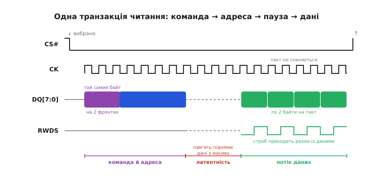
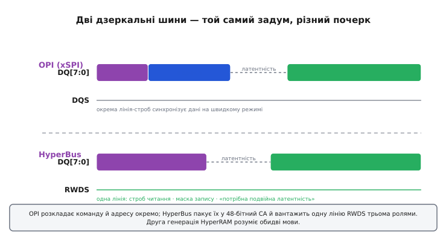

# OPI та HyperRAM

Уявімо мікроконтролер, якому забракло пам'яті. Внутрішньої статичної пам'яті на кристалі — сотні кілобайтів, а треба кадровий буфер на кольоровий екран (це вже мегабайти) або великий масив під оброблення сигналу. Класична відповідь — паралельна шина зовнішньої пам'яті: жмут ліній адреси, жмут ліній даних, кілька сигналів керування. Але паралельна шина пожирає ніжки: щоб під'єднати просту зовнішню пам'ять, треба **сорок із гаком** виводів — самих лише дротів. Для дрібного корпусу це неможливо, а на платі ці сорок доріжок ще й треба розвести без взаємних наведень.

Питання руба: чи можна віддавати той самий потік даних, але **вісьмома** дротами замість сорока? Виявляється, можна — якщо на цих восьми лініях працювати з подвоєною швидкістю й розумно розкласти в часі команду, адресу й дані. Саме це роблять два близькі, майже дзеркальні протоколи: **OPI** (англ. *Octal Peripheral Interface* — «восьмирозрядний периферійний інтерфейс») і **HyperBus** — а пам'ять, що ними спілкується, часто зветься **HyperRAM**. Обидва беруть ідею послідовної SPI-пам'яті й розганяють її так, що вона починає змагатися з паралельною — восьма частиною дротів.

## Звідки взялися вісім ліній

Щоб відчути суть, простежмо коротку еволюцію. Звичайна SPI-пам'ять — це один дріт даних туди, один назад, тактовий і вибір кристала. Дуже ощадливо на ніжки, але й повільно: біт за біт. Далі придумали гнати дані **чотирма** лініями воднораз — це **Quad-SPI** (четверна SPI), стандарт для флеш-пам'яті з програмою. Наступний крок очевидний: узяти **вісім** ліній даних — отримаємо **октальну** (лат. *octo* — «вісім») SPI, тобто OPI. Восьмирозрядна шина даних DQ[7:0] за один такт віддає цілий байт.

Але сама по собі ширина ще не диво — паралельна пам'ять давно має вісім і шістнадцять ліній даних. Другий, важливіший трюк — **подвійна швидкість передачі** (англ. *Double Data Rate*, DDR; у документації флеш-виробників її ще звуть DTR — *Double Transfer Rate*). Дані міняються не раз на такт, а **двічі** — на висхідному й на низхідному фронтах тактового сигналу. Тож за один період такту вісім ліній передають не один байт, а **два** — шістнадцять бітів. Ось де народжується швидкість: вісім тонких дротів на подвоєній частоті дають потік, як у ширшої паралельної шини.

> 🔧 **Навіщо це.** Коли обираєте мікроконтролер під пристрій із зовнішньою пам'яттю, першим ділом дивіться не на саму мікросхему пам'яті, а на те, який **послідовний** інтерфейс має контролер: простий SPI, Quad-SPI чи повноцінний октальний (у STM32 його звуть **OCTOSPI**). Октальний дає вам мегабайти зовнішньої пам'яті ціною десятка ніжок — там, де паралельна шина не влізла б у корпус. Немає октального контролера на кристалі — доведеться або задовольнитися повільнішим Quad, або брати чип із паралельним інтерфейсом зовнішньої пам'яті.

## Одна транзакція: команда, адреса, латентність, дані

Уся хитрість послідовних пам'ятей у тому, що по тих самих восьми лініях по черзі йдуть **різні речі** — спершу команда, тоді адреса, тоді дані. Розкладемо в часі одне читання, і стане видно, з чого складається транзакція.

Усе починається з опускання лінії **вибору кристала** (англ. *chip select*, CS# — [активний-низький](root:hw-digital/active-low), тобто «вибрано» = логічний нуль). Поки CS# унизу, триває одна транзакція; підняли — кінець. Далі по восьми лініях DQ хост висуває **команду** — код операції (читати, писати, читати регістр). В OPI команда шістнадцятибітна, і тут криється характерна деталь DDR-режиму: **той самий восьмибітний код надсилається на обох фронтах такту**, тож фізично проходять два однакові байти. Це виглядає надлишковим, але робить приймання стійкішим — приймач бачить код двічі й на різних фронтах.

Після команди йде **адреса** — куди в масиві звертаємось (типово 32 біти, чотири байти по лініях DQ). А тоді — найцікавіше й найважливіше для практики: **латентність** (англ. *latency* — «затримка»). Це пауза між тим, як хост договорив адресу, і тим, як пам'ять почала віддавати дані. Пауза не примха: усередині мікросхеми за цей час встигає спрацювати дешифрація адреси й підняти дані з масиву на вихід. Триває вона задане число тактів — і чим вища частота шини, тим **більше** тактів латентності треба закласти, бо фізичний час усередині мікросхеми той самий, а такти стали коротшими. Увесь цей час тактовий сигнал мусить **далі цокати** — інакше пам'ять «не дорахує» латентність.

І лише по латентності на лініях DQ народжуються **дані** — по два байти на такт, підряд, поки хост не підніме CS#. Один раз задавши адресу, можна читати цілий блок поспіль (це зветься **пакетним** читанням, англ. *burst* — «черга, залп»): адреса всередині нарощується сама.


*Уся транзакція живе між опусканням і підняттям CS#. Спершу по восьми лініях DQ хост висуває команду (той самий байт-код на обох фронтах такту), тоді адресу, тоді настає пауза-латентність — пам'ять усередині піднімає дані з масиву. Увесь цей час такт CK не спиняється. Нарешті DQ несуть самі дані: по байту на кожному фронті, два байти за період такту, підряд — доки хост тримає CS# унизу. Вісім тонких ліній на подвоєній швидкості віддають потік, як ширша паралельна шина.*

> 🔧 **Навіщо це.** Латентність — головне число, що плутають початківці. Задали замало тактів (понадіялися на «швидку» мікросхему на високій частоті) — і пам'ять фізично не встигає підняти дані, читається сміття, часто плаваюче й залежне від температури. Тому, налаштовуючи октальний контролер, беруть даташит саме цієї мікросхеми, знаходять потрібне число тактів латентності для вашої тактової частоти й ставлять **не менше**. Це пряма економія годин налагодження.

## HyperBus: майже те саме, лише лаконічніше

Тепер HyperBus. Його зробили з тією ж метою — багато даних малим числом ніжок, — але дрібка інакше, і різницю варто відчути. HyperBus теж має вісім ліній даних DQ[7:0] і теж DDR (два байти на такт). Сигналів усього близько дюжини: **CS#** (вибір кристала), тактовий (для нижчої напруги живлення — **диференційна** пара CK/CK#, тобто два дроти з протифазними рівнями, стійкіші до завад; про те, чому пара краща за один дріт, — [окрема тема](root:hw-analog/differential-signaling)), вісім ліній **DQ**, сигнал скидання **RESET#** і одна особлива лінія — **RWDS**.

Ось у цій лінії **RWDS** (англ. *Read-Write Data Strobe* — «строб даних читання-запису») і криється вся елегантність HyperBus. Це один дріт, що робить аж три різні роботи, залежно від фази транзакції:

- **Під час читання** він — **строб даних** (англ. *strobe* — «стробувальний імпульс»): пам'ять сама смикає RWDS у такт із тим, як виставляє байти, причому дані міняються **вирівняно з фронтами** RWDS. Хост ловить дані не за власним годинником, а за цим стробом, що прийшов **разом** із даними з тієї самої мікросхеми. Такий спосіб зветься **джерело-синхронним** (англ. *source-synchronous* — «синхронний від джерела»): годинник для приймача постачає той, хто віддає дані, тож обидва йдуть однією доріжкою й однаково затримуються. Це прибирає головний біль швидких шин — розбіжність між тактом і даними на довгій доріжці.
- **Під час запису** той самий RWDS стає **маскою байтів**: хост тримає його високим на тих байтах, які **не** треба писати. Так одним сигналом можна вписати, скажімо, лише один байт із пари, не чіпаючи сусіда, — зручно для невирівняних записів.
- А **під час фази команди-адреси** RWDS каже одну-єдину, але критичну річ — чи потрібна **додаткова латентність**. Про це — окремо, бо тут ховається природа HyperRAM.

Замість трьох окремих байтів команди й адреси HyperBus передає **єдиний пакет команди-адреси** (англ. *Command-Address*, CA) — 48 бітів, шість байтів, три слова, за **три такти** DDR. У цих сорока восьми бітах спаковано все: найстарший біт — читаємо чи пишемо, наступний — звертаємось до масиву пам'яті чи до регістра налаштувань, ще один — тип пакета (лінійний чи «загорнутий»), а решта — власне адреса. Компактно: три такти — і мікросхема знає про доступ усе.


*Обидві шини — вісім ліній даних і DDR, але розкладають транзакцію трохи інакше. OPI (зверху) шле команду й адресу окремими фазами по DQ; синхронізацію даних на швидкому режимі бере на себе окрема лінія-строб DQS. HyperBus (знизу) пакує команду й адресу в один 48-бітний пакет CA за три такти, а роль строба, маски запису й ознаки «потрібна додаткова латентність» покладає на єдину лінію RWDS. Різні почерки — та сама думка: багато даних малим числом ніжок. Друга генерація HyperRAM розуміє обидві мови.*

## Чому HyperRAM іноді «думає» довше

Тут — найцікавіше, і воно пояснює половину дивацтв HyperRAM. Наголос на слові **RAM** оманливий: усередині це **не** статична пам'ять, а **динамічна** (DRAM) — самопоновлювана. Її комірки — крихітні конденсатори, що поступово розряджаються, тож їх треба періодично **регенерувати** (освіжати заряд), інакше дані витечуть. Класична динамічна пам'ять вимагає, щоб цим клопотом займався зовнішній контролер зі складним протоколом. HyperRAM же ховає регенерацію **всередині себе** — тому її й звуть самопоновлюваною (англ. *self-refresh* — «самоосвіження»), а поводиться вона майже як звичайна статична: звернувся — прочитав. «Майже» — і саме в цьому «майже» вся сіль.

Регенерацію мікросхема робить сама, у паузах між зверненнями. Але що, як хост почав нове читання **саме тоді**, коли настав час освіжити той рядок? Виникає **збіг із регенерацією** (англ. *refresh collision* — «зіткнення з освіженням»): пам'ять мусить спершу дописати назад заряд рядка, а вже тоді віддавати дані. Їй потрібно трохи більше часу — і вона мусить якось попередити хост.

Ось де стає в пригоді RWDS. **Під час фази CA** пам'ять сама піднімає RWDS високо, якщо цього разу треба **подвоєну латентність** (бо саме йде регенерація), і лишає низько, якщо все звичайно. Хост читає цей рівень і розуміє: чекати одну латентність чи дві. Тому HyperRAM працює у двох режимах: **змінна латентність** (англ. *variable latency*) — коротка, коли можна, подвійна, коли збіг; і **фіксована латентність** (англ. *fixed latency*) — завжди закладаємо гірший випадок, зате час доступу передбачуваний. Перша швидша в середньому, друга простіша для планування.

> 🔧 **Навіщо це.** Практичний висновок про HyperRAM випливає прямо з її DRAM-нутра. По-перше, **не можна тримати CS# унизу як завгодно довго**: пам'ять мусить устигати вставляти регенерацію між зверненнями. Є граничний час утримання CS# унизу (в даташиті — *tCSM*, порядку кількох мікросекунд); один суцільний пакет має вкластися в нього, інакше рядки почнуть втрачати дані. Отже, довгий потік ділять на шматки. По-друге, при вимкненому живленні HyperRAM **забуває** вміст, як і будь-яка DRAM, — це буфер, а не сховище.

**Скільки даних віддає HyperRAM за секунду.** Порахуймо пропускну здатність другої генерації на тактовій частоті 200 МГц.

```
ширина шини даних   = 8 біт = 1 байт
фронтів на такт     = 2                (DDR: висхідний і низхідний)
байтів за такт      = 1 × 2 = 2 байти
тактова частота     = 200 МГц = 200 · 10⁶ тактів/с
потік               = 2 байти × 200 · 10⁶ = 400 · 10⁶ байт/с = 400 МБ/с
```

Висновок: вісім тонких ліній на 200 МГц у DDR дають **400 МБ/с** — стільки, скільки колись брали з широкої паралельної шини на добрий десяток ліній більше. Перша генерація HyperRAM ходила на 166 МГц і давала близько 333 МБ/с — та сама арифметика, менша частота. Саме таке співвідношення «швидкість на ніжку» й зробило ці шини стандартом для компактних пристроїв.

## Дві мови однієї пам'яті

Може здатися дивним, що є **два** схожі протоколи — HyperBus і OPI. Історично так і сталося: HyperBus виріс окремою гілкою, а октальну SPI розвивали виробники флеш-пам'яті як пряме розширення звичної Quad-SPI, і згодом її унормували як галузевий стандарт JEDEC (JESD251, «xSPI»). Хто, коли й навіщо запустив цю [лінію HyperBus та її стандартизацію](root:hw-arch/opi-hyperram/hist-hyperbus-lineage.md) — окрема історія; тут досить того, що дві родини якийсь час жили паралельно, поки не зійшлися в одній мікросхемі.

Розв'язали це просто й практично: **друга генерація HyperRAM розуміє обидві мови**. Та сама мікросхема озивається і на HyperBus, і на октальний SPI-протокол — виробник дає під це або два різні партномери, або перемикання режиму. А в мікроконтролері один і той самий контролер (той-таки STM32-івський OCTOSPI) уміє говорити обома. Тому на практиці різниця між HyperBus і OPI для розробника часто зводиться до кількох рядків налаштування, а не до вибору іншої мікросхеми чи іншого чипа.

## Як це виглядає в коді

Найкраще в октальних контролерах те, що після налаштування зовнішня пам'ять стає **звичайним діапазоном адрес** — її [відображають у пам'ять](root:hw-arch/external-memory-interface) процесора. Контролер сам перетворює звичайне звернення ядра за адресою на весь той танець CS#, команди, адреси, латентності й потоку даних. Ви пишете простий доступ до пам'яті — а на восьми ніжках народжується повна DDR-транзакція.

**Умова.** HyperRAM під'єднана до контролера OCTOSPI, налаштованого в режим прямого відображення в пам'ять із базовою адресою 0x9000_0000. Після ініціалізації працюємо з нею як зі звичайним масивом.

```c
#include <stdint.h>

// Після налаштування OCTOSPI на memory-mapped режим уся HyperRAM
// доступна як звичайна пам'ять за цією базовою адресою.
#define HYPERRAM_BASE  0x90000000u

void hyperram_demo(void) {
    volatile uint16_t *ram = (uint16_t *)HYPERRAM_BASE;

    ram[0]   = 0xBEEF;          // контролер сам зробить DDR-запис по 8 лініях
    ram[1000] = 0x1234;         // адреса всередині масиву — просто зміщення
    uint16_t back = ram[0];     // а це — DDR-читання; back == 0xBEEF
    (void)back;
}
```

Уся складність — команда, адреса, латентність, строб RWDS, регенерація DRAM — замкнена в кремнії контролера й мікросхеми. `ram[1000] = 0x1234` розгортається апаратно у повну транзакцію: контролер опускає CS#, висуває код запису й адресу по DQ, витримує латентність, жене два байти даних — мікросхема ловить їх за фронтами такту. Програміст цього не бачить; він лише один раз згодував контролеру правильні числа (насамперед — латентність) при старті.

> 🔧 **Навіщо це.** Саме відображення в пам'ять робить HyperRAM такою зручною під **кадровий буфер** дисплея чи великий робочий буфер під оброблення сигналу. Кадр можна заповнювати `memcpy` або просто записом у масив, а контролер жене слова на швидкості шини; для коду різниці з внутрішньою пам'яттю немає, крім того, що доступ трохи повільніший і об'єм — мегабайти. Пам'ятайте лише дві межі DRAM-нутра: вміст зникає без живлення, а надто довгий безперервний пакет може зіткнутися з регенерацією.

## Де це живе

OPI та HyperRAM — не вузька екзотика, а стандартна відповідь на питання «як дати мікроконтролеру мегабайти зовнішньої пам'яті, не витративши сорок ніжок на паралельну шину». На них тримаються компактні пристрої з кольоровими екранами (кадровий буфер у HyperRAM), вузли, де треба великий робочий буфер під оброблення дискретизованого сигналу чи зображення, плати, де програма лежить у зовнішній октальній флеш і виконується звідти напряму. Усюди принцип один: вісім тонких ліній на подвоєній швидкості віддають потік, як ширша паралельна шина, а весь клопіт — команда, адреса, латентність, джерело-синхронний строб, самопоновлення DRAM — захований у кремнії. Ви пишете звичайний доступ до масиву, а на восьми ніжках народжується повноцінна DDR-транзакція; уся хитрість у тому, що багато даних тут біжить дуже небагатьма дротами.
