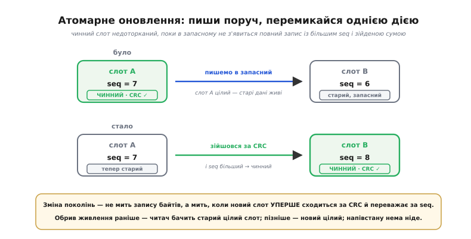
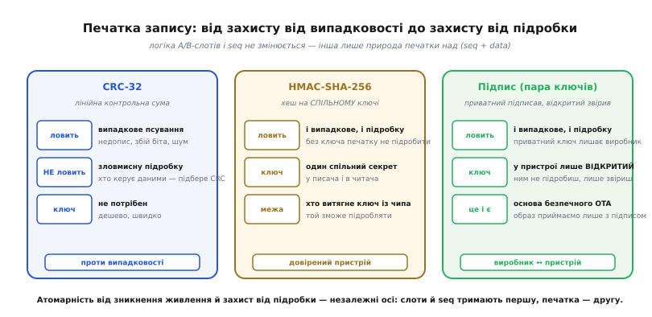

# ⚙️ Патерн атомарного оновлення на місці: двослотове сховище A/B

Пристрій у полі не має кнопки «зроби гарно». Живлення до нього приходить із зовнішнього світу — від акумулятора, що просів під навантаженням, від блока живлення, який смикнули з розетки, від автомобільної бортової мережі, що впала на пуску стартера. Просадка нижче робочого порога скидає мікроконтролер миттєво й **без попередження**: жодного сигналу «зараз вимкнуся», жодного шансу дописати те, що дописувалося. А код у цю мить міг саме зберігати щось у Flash — і зберіг наполовину.

Задача цього патерну — зробити так, щоб хоч би струм зник у **найгіршу** з можливих митей, на носії лишався цілий, читабельний стан. Не старий і не новий на вибір долі, а гарантовано один із двох: або повністю попередній, або повністю щойно записаний. Ніколи — покруч посередині.

Це не рідкісний крайній випадок, який трапляється раз на рік. Дешевий побутовий пристрій за життя переживає тисячі негречних вимкнень — його просто висмикують із розетки замість коректного завершення. Якщо кожне таке вимкнення має бодай малий шанс зіпсувати збережений стан, то за пару років у полі неминуче накопичиться пристрій, який не вмикається. Тому надійне оновлення на місці — не окраса, а умова виживання.

## Чому наївне «переписати на місці» ламається

Спробуймо найпряміший підхід і подивимось, де він падає. Хай у Flash відведено один блок під налаштування, і зберігаємо ми їх найочевиднішим способом:

```c
// НАЇВНО й НЕБЕЗПЕЧНО: єдина копія, переписувана на місці.
void config_save_naive(const Config *cfg) {
    flash_erase(CONFIG_ADDR);                 // (1) стерти старе
    flash_write(CONFIG_ADDR, cfg, sizeof(*cfg)); // (2) записати нове
}
```

Дві операції, і між ними — прірва. Розглянемо, що лежить у блоці, якщо струм зник у кожній із можливих точок:

```
момент зникнення струму      що в блоці після ввімкнення
───────────────────────────  ───────────────────────────────────────
після (1), до (2)            блок стертий: усі 0xFF — старого НЕМА,
                             нового НЕМА. Налаштування зникли геть.
посеред (2)                  перша частина — нові байти, решта — 0xFF.
                             Запис недописаний, а старого вже нема.
```

Обидва результати — катастрофа. У першому пристрій втратив налаштування безповоротно: стирання вже вбило стару копію, а нову записати не встигли. У другому в блоці лежить **розривний запис** (torn write) — półфабрикат, у якому початок від нового запису, а хвіст — стерті одиниці. Прочитавши таке, пристрій візьме частину полів із нового, частину — сміттям, і поведеться непередбачувано: не завантажиться, зациклиться, покаже маячню.

Корінь біди — **єдина копія, яку операція псує в проміжному стані**. Поки триває стирання-й-запис, чинних даних немає **ніде**: старі вже знищені, нові ще не готові. Будь-який обрив у цьому вікні лишає порожнечу або покруч. Скільки не переставляй кроки, доки копія одна й ми чіпаємо її на місці — вікно вразливості нікуди не дінеться.

> 🔧 **Навіщо це.** Той самий клас лиха ширший за Flash: будь-яка операція, задумана як неподільна, але зроблена з кількох кроків, між якими може втрутитися чужа сила, лишає стан напівзміненим. Тут чужа сила — раптове вимкнення; у багатопотоковому коді — інший потік. Спільний розбір: [атомарність і гонки](topic:sf-tasks/atomicity-races) — те, що ми хочемо бачити одним рухом, насправді робиться кількома, і зазор між ними — це вразливість.

## Ідея: пиши поруч, перемикайся однією перевірюваною дією

Розв'язок росте прямо з діагнозу. Якщо біда в тому, що ми псуємо єдину копію, — не тримаймо єдиної. Тримаймо **дві**, у двох окремих ділянках Flash, і домовмося: у будь-яку мить рівно одна з них — чинна, а друга — запасна, куди можна писати, не боячись зіпсувати робочі дані. Це і є двослотове сховище A/B: слот A і слот B, повні рівні за правами.

Оновлення тоді розпадається на три кроки, і жоден із них не чіпає чинну копію:

```
1. Знайти, який слот зараз чинний → писати будемо в ІНШИЙ.
2. Записати новий стан цілком у запасний слот.
   Чинний слот у цей час недоторканий — старі дані живі.
3. Оголосити запасний слот новим чинним — однією дією,
   яку читач уміє перевірити.
```

Уся сіль — у кроці 3. Перемикання «хто тепер чинний» не повинно залежати від того, чи встиг записатися крок 2. Воно має бути таким, щоб читач при старті сам, дивлячись лише на вміст Flash, безпомильно сказав: цей слот готовий і новіший, беру його; а той — недописаний, ігнорую. Тоді момент «зміни поколінь» — це не фізичний запис байтів (він триває й може обірватися), а мить, коли новий слот **уперше стає розпізнаваним як цілий і новіший**. До тієї миті чинний — старий слот; після — новий; проміжного стану, який читач сприйняв би як чинний-але-битий, не існує.

Щоб читач міг зробити цей висновок сам, кожен слот несе два службові поля поверх самих даних:

- **`seq`** — монотонний номер покоління. Хто новіший — у того `seq` більший. Саме за ним читач відрізняє свіжий запис від застарілого.
- **`crc`** — контрольна сума всього запису (і `seq`, і даних). Вона відповідає на питання «а запис узагалі цілий?»: недописаний або пошкоджений слот майже напевно дасть несходження суми, і читач його відкине.

Разом ці двоє дають властивість «усе-або-нічого». Недописаний слот провалює перевірку суми — його наче й нема. Чинним лишається той, що записався **до кінця** й має найбільший `seq` серед цілих. Обрив живлення до завершення кроку 2 — читач бачить лише старий цілий слот. Обрив після — бачить новий цілий слот. Обрив **посеред** кроку 2 — новий слот битий за сумою, читач мовчки бере старий. У всіх трьох випадках на виході — цілий стан.

Цю саму трійцю «пиши поруч + монотонний лічильник + контрольна сума» ви знайдете під капотом промислових рішень. В ESP-IDF (середовищі для чипів ESP32) вибір активного образу прошивки зберігається у крихітному розділі `otadata` з **двох** секторів Flash; кожен сектор несе структуру `esp_ota_select_entry_t` з полем `ota_seq` та його CRC; завантажувач читає обидва сектори, відкидає ті, де CRC не збігся, і серед решти бере той, у якого `ota_seq` більший. Це буквально патерн, який ми зараз зберемо, лише прикладений до вибору прошивки, а не налаштувань. *(Джерело: вихідний код Espressif ESP-IDF, `bootloader_common_ota_select_valid` / `esp_ota_ops.c`; статус — підтверджений документований факт.)*

## Робочий код: структура запису й запис у слот

Почнемо з форми запису. Це проста структура з корисним навантаженням між двома службовими полями:

```c
#include <stdint.h>
#include <string.h>
#include <stdbool.h>

typedef struct {
    uint32_t seq;     // номер покоління: більший = новіший
    Config   data;    // корисне навантаження (самі налаштування)
    uint32_t crc;     // CRC-32 усього, що вище (seq + data)
} Record;
```

Порядок полів тут не випадковий, і на цьому попадаються. `crc` стоїть **останнім** свідомо: контрольна сума має покривати весь запис, тож логічно, щоб вона лягала у Flash **після** того, як лягли дані, які вона захищає. Але сам порядок полів у структурі ще не гарантує порядку **фізичного** запису — про це окремо нижче, у пастках. Поки що тримаймо в голові: `crc` — печатка, її ставлять останньою.

Тепер два примітиви драйвера Flash, від яких ми відштовхуємось. Їхня реалізація залежить від конкретного чипа, тож тут — лише контракт:

```c
// Стерти слот повністю: після цього весь слот читається як 0xFF.
// Стирання йде цілими блоками — тому слот вирівняний по межі блоку.
void flash_erase_slot(int slot);

// Записати buf у слот від його початку. len має бути кратний
// зернистості запису чипа (див. пастку про вирівнювання).
void flash_write_slot(int slot, const void *buf, size_t len);

// Прочитати весь запис зі слоту в out.
void flash_read_slot(int slot, Record *out);
```

Адреси й розміри слотів фіксовані — два блоки Flash, вирівняні по межі стирання:

```c
#define SLOT_A     0
#define SLOT_B     1
#define SLOT_COUNT 2
```

Тепер серце запису. Знаходимо чинний слот, беремо **інший**, готуємо запис із номером на одиницю більшим, обчислюємо CRC й записуємо — усе в запасний слот, не торкаючись чинного:

```c
// Обчислити CRC-32 усього запису, крім самого поля crc.
static uint32_t record_crc(const Record *r) {
    // Сума покриває seq і data, але НЕ поле crc (останні 4 байти).
    return crc32(r, sizeof(Record) - sizeof(r->crc));
}

int config_save(const Config *cfg) {
    int cur = active_slot();          // чинний слот (0/1), або -1 якщо порожньо
    int next;
    uint32_t next_seq;

    if (cur < 0) {
        // Перший у житті запис: чинного ще нема. Пишемо в слот A,
        // з якого починається відлік поколінь.
        next     = SLOT_A;
        next_seq = 1;
    } else {
        next     = cur ^ 1;           // писати в ІНШИЙ слот
        next_seq = read_seq(cur) + 1; // на одне покоління новіший
    }

    Record r;
    memset(&r, 0, sizeof(r));         // занулити «дірки» вирівнювання структури
    r.seq  = next_seq;
    r.data = *cfg;
    r.crc  = record_crc(&r);          // печатка — в останню чергу

    flash_erase_slot(next);           // готуємо чистий запасний слот
    flash_write_slot(next, &r, sizeof(r)); // цілком записуємо новий запис
    // Аж ТЕПЕР новий запис існує повністю й проходитиме перевірку CRC.
    // Слот cur увесь цей час недоторканий — старі дані ані на мить не гинули.

    // Необов'язково, але корисно: перечитати й звірити CRC записаного,
    // щоб упіймати збій запису одразу, а не при наступному ввімкненні.
    Record check;
    flash_read_slot(next, &check);
    if (record_crc(&check) != check.crc) {
        return -1;                    // запис не вдався — чинним лишився cur
    }
    return 0;
}
```

Зверніть увагу на два дрібні, але важливі рішення. По-перше, `memset(&r, 0, ...)` перед заповненням: компілятор часто лишає у структурі **байти-дірки** для вирівнювання полів, і якщо їх не занулити, у CRC потрапить випадкове сміття зі стека — сума при читанні збіжиться (бо ми ж її від того самого сміття й рахували), але дві збірки того самого коду можуть покласти в дірки різне, і взаємна сумісність записів постраждає. Занулення робить запис детермінованим. По-друге, необов'язкове зчитування-й-звірка одразу після запису переносить виявлення збою з майбутнього (наступне ввімкнення) у теперішнє — краще дізнатися, що запис не вдався, поки код ще виконується й може відреагувати.

*Три кроки атомарного оновлення: чинний слот лишається цілим, поки в запасному не з'явиться повний, перевірюваний за CRC новий запис; перемикання поколінь — це мить, коли новий слот уперше проходить перевірку.*



## Робочий код: вибір чинного слоту при старті

Друга половина патерну — читач. При кожному ввімкненні код мусить, дивлячись лише на вміст Flash, безпомильно назвати чинний слот. Логіка проста рівно настільки, наскільки треба, і жодного стану поза самою Flash не потребує — це принципово, бо будь-який зовнішній «прапорець хто чинний» сам був би єдиною копією зі своєю власною проблемою атомарності.

```c
// Прочитати слот і сказати, чи він цілий (CRC зійшовся).
static bool slot_valid(int slot, Record *out) {
    flash_read_slot(slot, out);
    return record_crc(out) == out->crc;
}

// Повернути номер чинного слоту (0/1), або -1 якщо цілого нема
// (перший старт у житті пристрою, або обидва слоти пошкоджені).
int active_slot(void) {
    Record a, b;
    bool ok_a = slot_valid(SLOT_A, &a);
    bool ok_b = slot_valid(SLOT_B, &b);

    if (ok_a && ok_b) {
        // Обидва цілі — беремо новіший за seq.
        return seq_newer(a.seq, b.seq) ? SLOT_A : SLOT_B;
    }
    if (ok_a) return SLOT_A;   // цілий лише A
    if (ok_b) return SLOT_B;   // цілий лише B
    return -1;                 // цілого нема
}

// Прочитати seq чинного слоту (викликати лише коли active_slot() >= 0).
uint32_t read_seq(int slot) {
    Record r;
    flash_read_slot(slot, &r);
    return r.seq;
}
```

Функцію `seq_newer` ми поки написали як просте `a > b` в думці, але саме тут ховається перша серйозна тонкість — переповнення лічильника, — тож повернемось до неї трохи згодом і напишемо її правильно.

А тепер — головна перевірка на міцність. Пройдімося ще раз по всіх точках обриву живлення й переконаймося, що читач у кожній дає цілий стан:

```
де обірвався струм при config_save    що поверне active_slot() далі
────────────────────────────────────  ────────────────────────────────
до flash_erase_slot(next)             cur цілий, next старий-цілий →
                                      беремо новіший = cur (старий стан)
під час erase / початок write next    next напівстертий/недописаний →
                                      його CRC не зійдеться → беремо cur
запис next завершився повністю         next цілий, seq(next) > seq(cur) →
                                      беремо next (новий стан)
```

Жодного рядка, де читач узяв би недописаний слот. Властивість «усе-або-нічого» тримається не на везінні, а на тому, що недописаний слот **не може** пройти перевірку CRC, а отже, для читача його наче й нема. Зміна поколінь відбувається атомарно — не в процесі запису байтів, а в логічний момент «новий слот уперше зійшовся за CRC й переважає за seq».

> 🔧 **Навіщо це.** Готова, промислово перевірена реалізація такого сховища пар «ключ–значення» поверх Flash для мікроконтролерів вже існує — не треба щоразу писати з нуля. Що знати: [NVS](topic:sys-fw/nvs) — журнальне сховище, яке саме веде версії записів, розмазує знос по чипу й не руйнує цілісність при зникненні живлення. Свій двослотовий патерн пишуть, коли треба щось простіше й передбачуваніше за повноцінне сховище, або коли контролюєш кожен байт Flash вручну.

## Граничні випадки, на яких патерн ламається у полі

Основний кістяк надійний, але диявол — у деталях, і саме деталі відрізняють код, що працює на столі, від коду, що виживає роками в полі. Розберімо чотири випадки, кожен із яких колись когось «згорів».

### Рівні `seq` в обох слотах

Що, як обидва слоти цілі за CRC, але `seq` у них **однаковий**? У штатному житті цього не буває: кожен запис бере `seq = cur + 1`, тож слоти завжди різняться рівно на одиницю. Але уявіть виробничу лінію, де в обидва слоти залили той самий образ зі стартовим записом; або рідкісний збій, коли старий слот якимось чином не оновив свій `seq`. Якщо читач на рівних `seq` поведеться недетерміновано (сьогодні візьме A, завтра B), пристрій ставатиме то з одними даними, то з іншими — плаваюча вада, яку майже неможливо зловити.

Правило просте: **на рівних `seq` завжди вибирай той самий слот детермінованим тай-брейком.** Наприклад, менший номер слоту:

```c
if (ok_a && ok_b) {
    if (a.seq == b.seq) return SLOT_A;         // тай-брейк: завжди A
    return seq_newer(a.seq, b.seq) ? SLOT_A : SLOT_B;
}
```

Головне не *який саме* слот обрати, а щоб вибір був **завжди той самий** для того самого вмісту Flash. Детермінізм тут важливіший за «правильність»: обидва записи з рівним `seq` за задумом однакові, тож будь-який стабільний вибір коректний, а нестабільний — ні.

### Переповнення лічильника поколінь

`seq` росте на одиницю з кожним записом і колись **переповниться**. Для 32-бітного лічильника це станеться після 4 294 967 296 записів — на око «ніколи», але зробімо оцінку чесно, бо інтуїція тут обманює:

**Умова: пристрій пише налаштування що 10 секунд (агресивний, але реальний лічильник напрацювання).**

```
записів за добу : 86400 / 10        = 8640
записів за рік  : 8640 · 365        ≈ 3.15 · 10⁶
до переповнення : 2³² / (3.15·10⁶)  ≈ 1363 роки
```

Тобто для 32 біт переповнення справді нереальне — Flash зноситься на кілька порядків раніше. **Але** якщо лічильник узяти 8-бітним заради економії (`uint8_t seq`), картина інша: 256 записів за цих умов вичерпуються за 42 хвилини. І тоді питання «а що при переповненні» стає щоденним.

Пастка не в самому переповненні, а в тому, як його **порівнюють**. Наївне `a.seq > b.seq` ламається на стику: коли чинний слот має `seq = 0xFFFFFFFF`, наступний запис дасть `0x00000000`, і `0 > 0xFFFFFFFF` — хибне, тож читач вважатиме новий запис **старішим** за попередній і навічно застрягне на переповненому слоті. Правильно порівнювати не абсолютні значення, а **різницю за модулем**, як це роблять із номерами пакетів у мережевих протоколах (той самий прийом «serial number arithmetic»):

```c
// Чи a новіший за b, стійко до переповнення лічильника.
// Ідея: дивимось на РІЗНИЦЮ (a - b) у беззнаковій арифметиці.
// Якщо різниця «мала додатна» (менша за півперіоду) — a новіший.
// Обгортка через 0 обробляється автоматично: 0 - 0xFFFFFFFF = 1.
static bool seq_newer(uint32_t a, uint32_t b) {
    return (int32_t)(a - b) > 0;
}
```

Розберімо, чому це працює. Віднімання в беззнаковій арифметиці «загортається» саме так, як треба: `0x00000000 - 0xFFFFFFFF` дає `0x00000001`, тобто після приведення до знакового `int32_t` — додатну одиницю, і `seq_newer(0, 0xFFFFFFFF)` слушно каже «нуль новіший за максимум». Умова коректна, доки два порівнювані `seq` не розійшлися більше ніж на пів-періоду (2³¹ для 32 біт) — а в нашому патерні вони завжди різняться рівно на одиницю, тож запас колосальний.

> 🔧 **Навіщо це.** Цей самий трюк — порівнювати серійні номери за різницею, а не за абсолютом — стоїть під TCP (номери сегментів), під лічильниками кадрів у радіопротоколах, під версіями в реплікації баз даних. Скрізь, де є монотонний лічильник, що колись загорнеться, наївне `>` — прихована міна, а `(signed)(a - b) > 0` — знешкоджена.

### Переповнення й скидання: коли лічильник краще не крутити по колу

Є й радикальніша відповідь на переповнення: не давати лічильнику загортатися взагалі. Візьміть `uint64_t seq` — 2⁶⁴ записів не вичерпає жоден носій за будь-який мислимий строк служби (навіть мільярд записів за секунду вичерпував би його понад 500 років), тож обгортка стає суто теоретичною й тай-брейк на переповненні не потрібен. Ціна — зайві 4 байти на запис, що для сховища налаштувань зазвичай дрібниця. Коли Flash тісна й кожен байт на рахунку — беруть 32 біти з коректним `seq_newer`; коли місця вдосталь — 64 біти знімають цілий клас турбот. Обидва рішення законні; вибір — між чотирма байтами й одним граничним випадком.

### Захист від підробки: коли CRC недостатньо

Тепер найважливіше непорозуміння, яке коштує безпеки. CRC-32 чудово ловить **випадкове** пошкодження: недописаний слот, перевернутий космічним променем біт, збій шини. Але CRC **не захищає від зловмисної підробки** — і це не дрібна прискіпливість, а математичний факт.

CRC — лінійна функція. Хто контролює дані, той легко порахує, які біти підправити, щоб контрольна сума **зійшлася** для підмінених даних. Прочитайте це ще раз: зловмисник, що має доступ до Flash, може підмінити ваші налаштування (чи прошивку) на свої й **дописати правильний CRC**, і ваш читач прийме підробку як цілий, законний запис. CRC відповідає на питання «чи не спотворилося це випадково?», а не «чи це справді від того, кому я довіряю?». *(Це усталений факт криптографії: CRC не є криптографічно стійким і непридатний для автентифікації — див. будь-який підручник або, наприклад, розбори вразливості CRC до підробки при контрольованих даних; статус — твердо доведено.)*

Коли модель загроз включає зловмисника — а для прошивки, яку оновлюють «через повітря», включає майже завжди, — CRC треба **замінити**, а не доповнити. Дві сходинки захисту, залежно від того, що саме треба гарантувати:

- **Спільний секрет — HMAC.** Якщо і той, хто пише запис, і той, хто читає, володіють однаковим таємним ключем, підійде **код автентифікації повідомлення** на основі криптографічного хешу (HMAC, наприклад HMAC-SHA-256). Замість CRC у полі печатки лежить `HMAC(key, seq ‖ data)`. Підробити його без знання ключа обчислювально неможливо: зловмисник бачить дані, але не може порахувати правильну печатку. Мінус — ключ мусить бути на пристрої, а отже, хто фізично витягне його з чипа, зможе й підробляти. HMAC добре працює всередині довіреного пристрою (наприклад, захистити налаштування від псування чужою прошивкою), але погано — проти того, хто вже володіє залізом.

- **Асиметричний підпис.** Якщо той, хто **випускає** оновлення, і той, хто його **приймає**, — різні сторони (виробник підписує прошивку, пристрій перевіряє), потрібен **цифровий підпис**. Виробник тримає приватний ключ у себе й підписує образ; пристрій носить лише **відкритий** ключ і перевіряє підпис. Витягти відкритий ключ із пристрою марно — ним можна тільки перевіряти, а не підписувати. Це і є основа безпечного OTA: пристрій приймає новий образ, **тільки** якщо підпис сходиться під зашитим у нього відкритим ключем.

Ключове: місце печатки в записі те саме, змінюється лише **її природа** — від дешевого лінійного CRC (тільки проти випадковості) до криптографічного HMAC чи підпису (проти зловмисника). А **логіка A/B слотів і `seq` лишається незмінною**: два слоти, монотонний номер, перевірювана печатка. Атомарність від зникнення живлення й захист від підробки — ортогональні осі; патерн тримає першу однаково, хай яку печатку ви оберете для другої.

*Печатка запису — окрема від нього ось: CRC ловить лише випадкове псування; HMAC на спільному ключі й асиметричний підпис ловлять і зловмисну підробку.*



## Розширення до двох образів прошивки: OTA

Той самий скелет масштабується з «двох записів налаштувань» до «двох образів прошивки» — і саме так влаштоване безпечне оновлення «через повітря» (OTA, over-the-air). Замість двох маленьких слотів під `Config` — два великих розділи Flash під цілу прошивку, а замість крихітного `seq` — окремий крихітний запис-**вказівник**, який каже, з якого розділу вантажитись. Але з'являється нова, суто прошивкова тонкість, якої в налаштуваннях не було.

Різниця в тому, що записаний образ треба не просто «мати цілим», а **вміти виконуватись**. Прошивка може пройти CRC (тобто записалася без спотворень), але все одно виявитися непрацездатною: зависнути на старті, впасти в цикл перезавантажень, втратити зв'язок і не мати як прийняти виправлення. Тому наївне «переkey на новий образ, щойно він записався» недостатнє — треба ще й **пересвідчитись, що новий образ ожив**, перш ніж остаточно зробити його чинним. Інакше одне погане оновлення перетворює пристрій на цеглу, до якої вже не достукатись.

Звідси — трохи багатша схема поколінь, ніж просто `seq`. Кожен образ має не лише номер, а й **стан завантаження**, і перемикання йде у два такти:

```
стан образу     що означає
──────────────  ────────────────────────────────────────────────
NEW / PENDING   щойно записаний, ще не доведено, що працює
VALID           стартував і сам підтвердив, що живий
ABORTED         пробував стартувати кілька разів і не зміг
```

Хід оновлення: новий образ пишуть у запасний розділ і позначають `PENDING`; завантажувач бачить `PENDING`, пробує з нього стартувати й **тимчасово** робить його чинним; якщо образ ожив і встиг сам себе позначити `VALID` (наприклад, після успішного під'єднання до мережі — тобто довів, що не втратив зв'язку), — перемикання остаточне; якщо ж він мовчить після кількох спроб перезавантаження, завантажувач **відкочується** на попередній `VALID`-образ у сусідньому розділі. Так одне невдале оновлення **не може** зробити пристрій непіднімним: старий робочий образ увесь час лежить у сусідньому слоті недоторканим — рівно як старий слот налаштувань у нашому базовому патерні.

Саме так побудовані реальні системи. У безшовних оновленнях Android кожен із двох слотів (A і B) має атрибути `bootable` та `successful`: завантажувач вантажить новий слот лише як кандидата, а прапорець `successful` виставляється **вже з системи, що піднялась** і пройшла перевірку цілісності; якщо кілька спроб завантаження провалились, завантажувач сам позначає слот непіднімним і повертається на попередній справний. Кінцевий образ стає чинним не тоді, коли записався, а тоді, коли **довів, що вміє працювати**. *(Джерело: Android Open Source Project, документація A/B seamless updates; статус — підтверджений документований факт.)* В ESP-IDF це той самий принцип під іншими назвами: щойно записаний образ висить у стані «перевіряється», і прикладний код мусить викликати підтвердження (позначити образ дійсним) — інакше після перезавантаження спрацює відкіт на попередній.

> 🔧 **Навіщо це.** Різниця між «записалось» і «працює» — це те, що відділяє оновлення, яке можна безпечно розкотити на тисячу пристроїв у полі, від оновлення, яке перетворить частину з них на цеглу. Базовий A/B-патерн дає перше (цілісність запису); двотактне перемикання зі станом `PENDING`/`VALID` і відкотом додає друге (гарантію піднімності). Обидва спираються на один кістяк — два слоти й перевірюваний вказівник чинного.

## Пастки реалізації: місця, де все тихо ламається

Логіка патерну може бути бездоганною на папері, а код — падати у полі через три речі, які легко не помітити, бо на столі вони «якось працюють». Усі три — про те, як Flash поводиться фізично, а не як ми уявляємо.

### Часткове стирання: стерте — не завжди все 0xFF

Ми звикли думати про стирання як про миттєвий акт: був блок із даними — став блок із самих 0xFF. Насправді стирання блоку Flash триває **відчутний час** (десятки мілісекунд), і якщо струм зникне посеред нього, блок лишиться **напівстертим** — частина комірок уже одиниці, частина ще ні, а деякі — у нестійкому проміжному стані, який при читанні дає то так, то сяк.

Небезпека — думати, ніби «якщо CRC не зійшовся, слот стертий і чистий, можна одразу писати». Напівстертий слот **не** чистий: у ньому лишились нулі, а Flash не вміє писати одиниці без повного стирання. Спроба записати новий запис поверх напівстертого дасть покруч — нулі, що мали стати одиницями й не стали, зіпсують дані. Тому правило: **перед кожним записом у слот його безумовно стирають наново**, навіть якщо він виглядає порожнім. Стирання ідемпотентне — стерти вже стертий блок безпечно; а от покластися на «здається, він і так чистий» — ні. У нашому `config_save` це вже враховано: `flash_erase_slot(next)` викликається **завжди** перед записом, без жодних «а раптом не треба».

### Порядок запису: печатка мусить лягти останньою

Ми кладемо `crc` останнім полем структури — але це впорядковує байти лише в **пам'яті**. Чи ляже воно у Flash фізично останнім, залежить від драйвера: якщо `flash_write_slot` пише запис одним суцільним викликом від початку до кінця, порядок збережеться; але якщо драйвер (чи оптимізатор) розіб'є запис на частини й переставить їх, або якщо ви пишете поля окремими викликами, — печатка може лягти **раніше** за дані, які вона захищає.

Чому це смертельно: уявіть, що `crc` записалось, а `data` — ще ні, і тут обрив. У слоті лежить правильна контрольна сума над **недописаними** даними. Читач порахує CRC над тим, що є, — і якщо недописаний хвіст випадково дав ту саму суму (шанс малий, але для мільйонів пристроїв — неминучий), прийме покруч за цілий запис. Правило: **дані пишуться першими, печатка — фінальним, окремо впорядкованим записом.** Надійний спосіб — записати корисне навантаження (`seq` + `data`) одним викликом, дочекатися його завершення (у синхронному драйвері — просто повернення з функції; в асинхронному — явно опитати «запис завершено»), і лише тоді записати `crc` другим викликом. Тоді наявність правильної печатки **гарантує**, що все, що вона покриває, вже фізично у Flash.

Це та сама причина, чому промислові рішення на кшталт ESP-IDF тримають `ota_seq` та його CRC у структурі так, щоб печатка була останнім, що фіксує запис: доки печатка не лягла, запис для читача недійсний, і будь-який обрив до неї просто відкидає недороблений слот.

### Вирівнювання під зернистість Flash

Останнє й найпідступніше — **зернистість запису**. Flash пише не байтами, а порціями фіксованого розміру, вирівняними по своїх межах, і на сучасних чипах ця порція буває несподівано великою. На багатьох мікроконтролерах STM (STM32 родин F7, H7, H5) найменша одиниця запису — **подвійне слово, 64 біти**, і навіть більше: через вбудований код корекції помилок (ECC) фізично пишеться 72 біти (64 даних + 8 контрольних) за раз. Наслідок, який ламає наївний код: **кожне таке подвійне слово можна записати рівно один раз** після стирання — навіть якщо ви записали в нього самі одиниці (0xFF), другий запис у те саме подвійне слово вже неможливий без нового стирання блоку, бо він зіпсував би біти ECC. *(Джерело: STMicroelectronics, довідкові матеріали з програмування Flash STM32L4/F7/H7; статус — підтверджений документований факт.)*

Звідси два практичні висновки. По-перше, **розмір запису мусить бути кратний зернистості**: якщо ви передаєте у `flash_write_slot` кількість байтів, не кратну 8 (для 64-бітної зернистості), драйвер або доповнить хвіст, або відмовить, або — найгірше — тихо зіпсує сусідні байти. Тому структуру `Record` вирівнюють і **доповнюють** до кратності зернистості:

```c
// Розмір запису має бути кратний зернистості запису Flash.
// Для 64-бітної зернистості STM — кратний 8 байтам.
_Static_assert(sizeof(Record) % FLASH_WRITE_UNIT == 0,
               "Record must be padded to flash write granularity");
```

Такий `_Static_assert` ловить проблему на етапі компіляції — краще червона збірка, ніж загадкове псування в полі. По-друге, **не можна дописувати печатку в те саме подвійне слово, де закінчились дані**: якщо останнє слово даних неповне й ви думаєте «допишу CRC у той самий шматок» — на STM це не спрацює, бо слово вже записане. Печатку кладуть в **окреме, вирівняне** подвійне слово. У нашій структурі це виходить само собою, якщо `data` доповнене до межі зернистості перед полем `crc`, — тоді `crc` починається з чистого подвійного слова.

Ця остання пастка — чому один і той самий код атомарного оновлення, ідеально працюючи на чипі з побайтним записом, раптом псує дані на STM з 64-бітною зернистістю. Не логіка змінилась — змінилась фізика носія під нею. Тому перше, що з'ясовують перед реалізацією патерну на конкретному чипі: **яка зернистість запису, чи є ECC, і скільки разів можна писати в уже записане слово** (часто — жодного). Від цих трьох чисел залежить, як вирівнювати структуру й як розбивати запис на кроки.

## Що з усього цього забрати

Атомарне оновлення на місці зводиться до одного руху думки: **не псуй єдину копію — тримай дві й перемикайся однією перевірюваною дією.** Два слоти A/B, монотонний `seq` (хто новіший), перевірювана печатка над кожним записом (чи цілий). Читач при старті бере цілий слот із найбільшим `seq`, дивлячись лише на вміст Flash і нічого поза нею. Недописаний слот провалює печатку — його наче нема; чинним лишається той, що дописався до кінця. Хай струм зникне будь-якої миті — на носії завжди цілий стан, старий або новий, ніколи покруч.

Кістяк один, а нарощується під задачу по трьох незалежних осях. **Довговічність лічильника** — 32 біти з порівнянням за модулем (`(int32_t)(a-b) > 0`, стійко до переповнення) чи 64 біти, що не переповнюються за строк служби. **Природа печатки** — CRC проти випадкового псування, HMAC на спільному ключі чи асиметричний підпис проти зловмисної підробки; логіка слотів при цьому не змінюється ні на рядок. **Гарантія піднімності** для прошивки — двотактне перемикання `PENDING → VALID` з відкотом, щоб чинним ставав не той образ, що записався, а той, що довів, що вміє працювати; це і є ядро безпечного OTA.

І троє фізичних пасток, об які розбивається бездоганна логіка, якщо забути про носій: стирання триває в часі й може лишити слот напівстертим — тому стирай перед кожним записом безумовно; печатка мусить лягти у Flash **фізично останньою**, після даних, які вона покриває, — інакше правильна сума накриє недописане; а розмір і межі запису мусять бути кратні **зернистості** чипа (на STM — 64-бітне подвійне слово, записуване лише раз після стирання), бо та сама логіка, працюючи на побайтному носії, тихо псує дані на носії з грубою зернистістю. З'ясуй зернистість, ECC і дозволене число записів у слово **до** того, як писати код, — і патерн, простий у своєму ядрі, витримає тисячі негречних вимкнень, заради яких його й будують.
