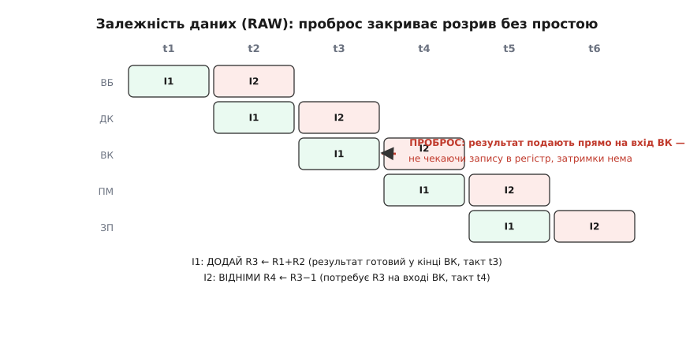

# Конфлікти конвеєра (дані, керування, ресурси)

Конвеєр робить схему швидшою підступним трюком: він не пришвидшує жодну окрему операцію, а лише **перекриває** їх у часі — поки одна річ проходить пізню станцію, наступна вже проходить ранню. У [процесорі чи в цифровому фільтрі](topic:hw-arch/pipeline) це дає в рази більшу пропускну здатність майже задарма. Але «майже» тут вагоме. Трюк тримається на мовчазному припущенні, що всі порції **незалежні** — течуть одна за одною, не заважаючи. Щойно ця незалежність ламається — наступна порція потребує того, що попередня ще не віддала, або обидві тягнуться до одного блока, або взагалі виявляється, що вибрані наперед порції не ті, — конвеєр збоїть. Такий момент, коли наступна операція **ризикує піти не так**, і зветься **конфлікт** (англ. *hazard* — небезпека, ризик; у контексті конвеєра — ситуація, що загрожує неправильним результатом).

І це не абстрактна прикрість. Конфлікт у конвеєрі — не «сповільнення», а **загроза видати хибне число**, якщо його не помітити й не знешкодити. Тому конвеєрну схему проєктують не як просту вервечку станцій, а разом з окремим наглядачем, що на кожному такті питає: «чи не назріває конфлікт?» — і, якщо назріває, або **переспрямовує** дані навпростець, або **гальмує** частину конвеєра, або **стирає** вже почату зайву роботу. Уся ця тема — про те, звідки конфлікти беруться в **залізі**, як їх помітити й чим із кожним боротися. Родів конфлікту рівно три, і ділять їх за тим, **чого саме** бракує: даних, певності про напрям виконання, або вільного апаратного блока.


*Той самий конвеєр з п'яти станцій, розділених регістрами під спільним тактом. Три роди конфлікту б'ють у різні місця: **даних** — коли пізня станція вже читає значення, яке рання ще не дорахувала; **ресурсу** — коли дві команди в один такт хочуть той самий блок; **керування** — коли перехід робить наперед вибрані команди недійсними. Кожен має свій механізм і свій спосіб лікування.*

## Спершу — з чого конвеєр складений у залізі

Щоб побачити, звідки беруться конфлікти, треба тримати в голові фізичну картину, а не лише діаграму зі стрілочками. Конвеєр — це ланцюг **комбінаційних ділянок** (шматків логіки без пам'яті), розділених **[регістрами](topic:hw-digital/register)** — рядами тригерів, що всі клацають від **[спільного такту](topic:hw-digital/clock-signal)**. На кожному фронті такту регістри одночасно **захоплюють** те, що стоїть на їхніх входах, і команда (чи відлік сигналу) робить один крок праворуч: вихід ділянки, обчислений за минулий такт, застигає в регістрі й стає входом наступної ділянки.

> 🔧 **Навіщо це.** Причина розрізати логіку регістрами — суто таймінгова. Довгий ланцюг вентилів має довгий [критичний шлях](topic:hw-digital/critical-path-and-slack), і такт мусить накрити всю його затримку — виходить повільно. Уставиш регістр посередині — кожна половина коротшає, і період можна майже вдвічі вкоротити. Конвеєр народжується саме з цієї потреби пришвидшити такт, а конфлікти — це та ціна, яку доводиться платити за розрізаний на шматки потік. Тому «звідки конфлікти» й «навіщо взагалі конвеєр» — це одне питання з двох боків.

Ключова деталь, з якої випливе все далі: у конвеєрі **одночасно живуть кілька команд**, кожна на своїй станції. Поки п'ята станція дописує результат першої команди, третя станція виконує другу, а перша станція вибирає п'яту. Вони існують **паралельно в різних регістрах** — і саме через це співіснування вони й можуть зіштовхнутися. У простій не-конвеєрній схемі команда сама-одна проходить увесь тракт, і зіштовхуватися їй ні з ким; конфлікти — плата виключно за паралельність.

Далі говоритиму мовою процесора — вибірка, декодування, виконання, доступ до пам'яті, запис результату (класичні п'ять станцій), — бо на ній конфлікти видно найгостріше. Але та сама механіка живе в будь-якому конвеєрі: у [конвеєрному АЦП](topic:hw-analog/pipeline-adc) станції обробляють відліки сигналу, у конвеєрному помножувачі цифрового фільтра — частинні добутки. Скрізь, де є регістри між станціями й кілька порцій у польоті, є й ці три роди конфлікту.

## Конфлікт даних: пізній читає те, чого ранній ще не написав

Найчастіший і найпростіший для розуміння. Уяви дві команди поспіль:

```
I1:  ДОДАЙ  R3 ← R1 + R2      // рахує нове R3
I2:  ВІДНІМИ R4 ← R3 − 1      // одразу ж читає R3
```

I2 потребує R3, яке щойно порахувала I1. Але в конвеєрі вони йдуть **із зсувом в один такт**: коли I2 добігає до станції виконання й тягнеться по R3, команда I1 ще тільки-но порахувала його на своїй станції виконання — і **ще не встигла записати** в регістровий файл (запис стається аж на останній станції, кількома тактами пізніше). Тобто нове значення R3 **фізично існує** — воно вже стоїть на виході суматора, — але в тому місці, звідки I2 звикла його брати (у регістрі), лежить **старе**. Прочитає I2 звідти — візьме застаріле число й порахує сміття.

Це і є **конфлікт даних** (англ. *data hazard*): наступна команда хоче прочитати результат попередньої **раніше**, ніж той доїхав до місця читання. Класично його звуть **RAW** (англ. *read after write* — читання після запису): порядок «спершу пише I1, потім читає I2» задано програмою, і конвеєр мусить його зберегти, хоч фізично встиг переплутати.

Найгрубіший спосіб полагодити — просто **зачекати**. Затримати I2 на стільки тактів, щоб I1 устигла дописати R3 у регістр, і аж тоді пустити I2 читати. Працює, але марнотратно: конвеєр стоїть, поки значення повзе до регістра й назад. Придивімося ж, у чому справжня біда — і рішення напросується саме.

Біда не в тому, що значення **немає**. Воно є — стоїть на виході станції виконання вже наступного такту. Біда лише в тому, що воно **не там, де його звикли брати**. А коли проблема суто в маршруті, лікують її не чеканням, а **новим маршрутом**.

### Проброс: подати результат навпростець

Рішення зветься **проброс**, або **обхід** (англ. *forwarding*, *bypassing* — переслати в обхід). Ідея елегантна: не змушуй I2 чекати, поки результат доїде до регістрового файла, — **простягни дріт** прямо з виходу станції виконання назад на її ж вхід, і подай свіже R3 туди безпосередньо, того ж такту, коли воно з'явилося. Регістровий файл узагалі не чіпаємо — значення бере коротшу дорогу.


*Діагональ кожної команди — її рух конвеєром. I1 має новий R3 готовим на виході станції виконання в кінці такту t3; I2 потребує R3 на **вході** тієї ж станції в такті t4. Розрив рівно в один такт — і проброс його закриває: дріт веде результат прямо з виходу на вхід, минаючи запис у регістр. Простою нема, конвеєр не гальмує.*

У залізі проброс — це **[мультиплексор](topic:hw-digital/multiplexer)** перед входом станції виконання. Наглядач за конфліктами щотакту порівнює номери регістрів: «чи не збігається регістр, який I2 хоче прочитати, з регістром, який щойно порахувала команда попереду?» Якщо збігається — мультиплексор перемикається й подає на вхід не старе значення з регістрового файла, а свіже з виходу попередньої станції. Один невеликий блок логіки-порівняння плюс кілька мультиплексорів — і найчастіший конфлікт розчиняється без єдиного втраченого такту. Цю схему детекції й проброс-мультиплексорів [збирають в окремий вузол — блок пробросу, з робочим кодом моделі](topic:hw-arch/pipeline-hazard/proj-hazard-detect-forward.md).

### Коли пробросу мало: конфлікт, який доводиться перечекати

Проброс закриває розрив, лише якщо результат **уже порахований** до того такту, коли він потрібен. Та є випадок, коли навіть цього не досягти. Найвідоміший — **завантаження з пам'яті**:

```
I1:  ЗАВАНТАЖ R3 ← [R1]       // читає з пам'яті — готово аж на станції пам'яті
I2:  ВІДНІМИ  R4 ← R3 − 1     // хоче R3 на станції виконання — на такт РАНІШЕ
```

Тут значення R3 приходить із пам'яті на **пізнішій** станції, ніж та, де його читає I2. Проброс не всесильний — він уміє повести дріт назад **у просторі**, але не вміє повести його назад **у часі**: результат просто ще не існує в потрібний момент. Лишається одне — **загальмувати** I2 рівно на один такт, щоб дати значенню народитися, а тоді вже пробросити. Цей вимушений простій на один такт зветься **завантаж-використай** (англ. *load-use hazard*) — єдиний конфлікт даних, який навіть із пробросом коштує такт.

Гальмування конвеєра в залізі роблять так: **тримають** регістри ранніх станцій — не дають їм захопити нове, тож команда «застрягає» на місці ще на такт, — а в проміжок, що звільнився далі по конвеєру, впускають **порожній такт**. Цей порожній прохід і звуть **бульбашка** (англ. *bubble* — бо в потоці ніби спливає повітряна порожнина). Бульбашка нічого не робить: проходить станції, нічого не пише, лише посуває реальні команди на такт пізніше.


*Ліворуч — **стоп**: I2 не має даних, тож її тримають зайвий такт, а в конвеєр упускають порожню бульбашку «—»; реальні команди зсуваються на такт пізніше. Праворуч — **змив**: перехід узято, вже вибрані наперед команди виявилися зайвими, їх позначають недійсними «×» і стирають з регістрів, а з наступного такту тече правильна ціль T.*

## Конфлікт ресурсу: двом треба той самий блок

Другий рід простіший за суттю, зате підступний тим, що ховається в **залізі**, а не в програмі. Уяви, що конвеєр на якомусь такті потребує звернутися до пам'яті **двічі одночасно**: одна станція саме вибирає нову команду (читає з пам'яті команд), а інша, пізніша, саме завантажує дані (читає з тієї ж пам'яті). Якщо пам'ять **одна** й має лише один порт читання — обидві станції тягнуться до одного дроту в один такт. Хтось мусить зачекати. Це **конфлікт ресурсу**, або **структурний конфлікт** (англ. *structural hazard* — від *structure*, будова: конфлікт закладений у самій будові заліза, у нестачі апаратного блока).

Причина завжди та сама: **блока фізично менше, ніж одночасних охочих**. Один порт пам'яті, один суматор, один помножувач, один порт запису в регістровий файл — а конвеєр так укладений, що дві команди в польоті хочуть його в один і той самий такт. На відміну від конфлікту даних, тут ідеться не про значення, а про **залізяку**: два сигнали не можуть їхати одним дротом воднораз.

Лікують структурний конфлікт двома шляхами, і вони протилежні за духом. Перший — **додати заліза**, прибравши саму нестачу. Класичний приклад — розділити пам'ять на дві: окрему для команд і окрему для даних (це і є [гарвардська будова, де тракти команд і даних фізично різні](topic:hw-arch/harvard-vs-vonneumann)). Тоді вибірка команди й завантаження даних ідуть **різними** портами й ніколи не сваряться. Так само ставлять другий порт запису в регістровий файл, окремий помножувач — усюди, де дублювання блока дешевше за втрату тактів. Більшість структурних конфліктів у процесорі саме так і **проєктують геть** заздалегідь: конвеєр укладають так, щоб у кожен такт кожен блок був потрібен щонайбільше одній станції.

Другий шлях — коли дублювати дорого — **розвести в часі**: лишити один блок, але не пускати до нього двох воднораз, а одного **загальмувати** тією ж бульбашкою, що й при конфлікті даних. Дешевше залізом, дорожче тактами. Вибір між «додати блок» і «перечекати» — класичний інженерний торг: скільки коштує зайвий порт проти того, як часто трапляється зіткнення й скільки тактів воно з'їдає.

> 🔧 **Навіщо це.** Структурний конфлікт — головна причина, чому серйозні процесори мають **роздільні кеші** команд і даних, а прості мікроконтролери на кшталт [ядер ARM Cortex-M](topic:hw-arch/cortex-m) — гарвардську шину з окремими портами. Це не примха: якби вибірка команд і доступ до даних ділили один порт, кожне звернення до пам'яті коштувало б зайвий такт-бульбашку, і весь виграш конвеєра танув би. Коли бачиш у характеристиці чипа «Harvard bus» чи «separate I/D» — це прямий наслідок боротьби зі структурним конфліктом, вбудований у будову ще на етапі проєкту.

## Конфлікт керування: перехід робить наперед вибране зайвим

Третій рід — найдорожчий, і саме він визначає, наскільки боляче конвеєру даються розгалуження. Конвеєр, щоб не простоювати, мусить **щотакту** вибирати нову команду — інакше рання станція байдикує. Тож він, не думаючи, тягне команди **підряд**, у порядку їхнього розташування в пам'яті. Але що робити, коли трапляється **перехід** (умовний стрибок, `if`, виклик, повернення)? Куди піде виконання, стане відомо аж тоді, коли команда переходу дійде до станції виконання й обчислить умову — а це кілька тактів по тому, як її вибрали. Увесь цей час конвеєр **уже вибирає** команди, що йдуть **за** переходом у пам'яті. І якщо перехід **узято** — виконання стрибає деінде, — то всі ці наперед вибрані команди виявляються **не тими**. Робота над ними вже почалася — і вона зайва.

Це **конфлікт керування**, або **конфлікт переходу** (англ. *control hazard*, *branch hazard*: невідомо, куди піде **керування** — потік виконання, — поки перехід не обчислився). Суть: конвеєр змушений **вгадувати наперед**, які команди вибирати, ще не знаючи напрямку, і платить за кожен неправильний здогад.

Коли з'ясувалося, що вгадано хибно, зіпсовану роботу треба **скасувати** — і то безслідно, ніби її й не було. Роблять це **змивом** (англ. *flush* — промивання, змив): усі наперед вибрані неправильні команди, що вже сидять у ранніх регістрах конвеєра, позначають **недійсними** й стирають — перетворюють на ті самі бульбашки. Ніякого сліду в регістрах чи пам'яті вони лишити не встигли (їх спинили до станцій, які щось записують), тож змив безпечний: конвеєр просто спорожнюється на кілька тактів і починає вибирати з правильного місця. Ті стерті такти й **є ціна** конфлікту керування — тим більша, чим глибший конвеєр (більше станцій устигли набратися хибних команд, поки перехід рахувався).

Тут криється неприємна закономірність: **що довший конвеєр — то дорожчий кожен промах**. У короткому конвеєрі мікроконтролера змив коштує один-два такти; у глибокому конвеєрі настільного процесора — з десяток. Тому глибокі конвеєри так бояться **непередбачуваних** розгалужень: один промах — і десяток тактів роботи в кошик.

Найпряміший спосіб пом'якшити — **вгадувати розумніше**. Замість тупо тягти команди підряд, процесор **[передбачає напрям переходу](topic:hw-arch/branch-prediction)**: тримає невеличку історію, куди цей самий перехід ходив минулого разу, і вибирає звідти. Вгадав — конвеєр летить далі без єдиної втрати; схибив — той самий змив, ті самі кілька тактів. Хороший передбачувач вгадує дев'ять переходів із десяти, тож середня ціна конфлікту керування падає в рази. Скільки саме тактів коштує промах і як із цього виводиться ефективна швидкодія — це вже [окрема арифметика штрафу за конфлікти](topic:hw-arch/pipeline/math-pipeline-hazards.md).

## Хто стежить: наглядач за конфліктами

Три роди конфлікту різні, але спосіб дати їм раду один: у залізі поряд із самим конвеєром сидить окремий блок логіки — його звуть **блок детекції конфліктів** (англ. *hazard detection unit*). Він не робить корисної роботи над даними; його єдина справа — щотакту дивитися, які команди де в конвеєрі стоять, і **приймати рішення** з трьох можливих:

- **пробросити** — якщо потрібне значення вже існує на виході якоїсь станції: перемкнути мультиплексор і подати його навпростець;
- **загальмувати** (уставити бульбашку) — якщо значення ще не готове (завантаж-використай) або бракує апаратного блока (структурний конфлікт): притримати ранні регістри на такт;
- **змити** — якщо перехід виявився взятим: стерти наперед вибрані команди й вибирати з правильної адреси.

По суті це невеликий **[скінченний автомат](topic:hw-digital/finite-state-machines)**, що читає стан конвеєра й керує засувками регістрів (тримати чи пускати), входами мультиплексорів (звідки брати значення) і сигналами скидання (що стерти). Уся хитрість конвеєра не в самих станціях — вони прості, — а саме в цьому наглядачі: він і перетворює наївну вервечку станцій на схему, що дає правильний результат навіть коли команди залежні, тягнуться до одного блока чи стрибають. Сама ідея такого нагляду й [її перші апаратні втілення народилися ще на світанку конвеєрних машин 1960-х](topic:hw-arch/pipeline-hazard/hist-hazard-origin.md).

**Приклад (порахуймо ціну трьох родів конфлікту).** Візьмімо п'ятистадійний конвеєр і короткий шматок, у якому трапляється по одному конфлікту кожного роду, і подивімося, скільки тактів вони коштують проти ідеалу. Порахуймо чесним обчисленням у прошивці.

```c
// Модель: 1000 команд, ідеал — по одній команді за такт (плюс короткий розгін).
// Порахуємо, скільки тактів украдуть три роди конфлікту.
int   n_instr   = 1000;
int   fill      = 4;         // розгін конвеєра (5 станцій → 4 такти на заповнення)

// 1) Конфлікт даних, тип завантаж-використай: проброс не встигає → 1 такт бульбашки.
//    Нехай кожна десята команда — саме такий випадок.
int   load_use  = n_instr / 10;      // 100 випадків
int   c_data    = load_use * 1;      // 100 тактів простою

// 2) Структурний конфлікт: припустимо, залізо спроєктоване з роздільними
//    портами, тож конфліктів ресурсу немає зовсім.
int   c_struct  = 0;                 // 0 тактів — прибрано будовою

// 3) Конфлікт керування: кожна п'ята команда — перехід; штраф змиву 2 такти;
//    передбачувач угадує 9 із 10, тобто хибить у 10% переходів.
int   branches  = n_instr / 5;       // 200 переходів
int   mispred   = branches / 10;     // 20 промахів
int   penalty   = 2;                 // такти змиву на промах
int   c_ctrl    = mispred * penalty; // 20 · 2 = 40 тактів

int   total     = fill + n_instr + c_data + c_struct + c_ctrl;
// 4 + 1000 + 100 + 0 + 40 = 1144 такти
float cpi       = (float)total / n_instr;   // 1144 / 1000 = 1.144
```

Висновок читається одразу. Ідеальний конвеєр дав би ~1004 такти (CPI ≈ 1); реальні конфлікти додали 140 — і майже всі вони з конфлікту даних (100) та керування (40), тоді як структурний з'їв нуль, бо його **прибрали ще на етапі проєкту** роздільними портами. Це типова картина: структурні конфлікти лікують будовою наперед, а конфлікти даних і керування лишаються щоденною ціною конвеєра, яку збивають пробросом і передбаченням, але до нуля не зводять.

> 🔧 **Навіщо це.** Звідси прямий висновок для того, хто пише прошивку, а не проєктує процесор. Дві речі в коді б'ють по конвеєру найдужче — і обидві під твоїм контролем. Перше: **непередбачувані `if` у гарячому циклі** множать конфлікти керування; якщо гілку можна замінити на арифметику без стрибка (маскою, умовним пересиланням), рваний потік стає рівним, і промахи зникають. Друге: **читання щойно завантаженого значення одразу наступною командою** — це конфлікт завантаж-використай на такт; переставивши команди так, щоб між завантаженням і використанням стояла корисна робота, ти віддаєш той такт справі, а не бульбашці. Розуміння трьох родів конфлікту — це і є вміння писати код, який лягає на конвеєр рівно, а не спотикається на ньому.

---

Коротко про головне: конвеєр пришвидшує схему, перекриваючи незалежні порції в часі, — і **конфлікт** виникає там, де незалежність ламається, загрожуючи неправильним результатом. Родів три, за тим, чого бракує. **Конфлікт даних** (RAW): пізня команда читає результат ранньої раніше, ніж той доїхав до регістра; лікують **пробросом** — дротом-обходом із виходу станції прямо на вхід, — а коли значення ще фізично не готове (завантаж-використай), доводиться на такт **загальмувати** бульбашкою. **Конфлікт ресурсу** (структурний): двом командам в один такт треба той самий блок (порт пам'яті, суматор); лікують **додаванням заліза** (роздільні порти, [гарвардська будова](topic:hw-arch/harvard-vs-vonneumann)) або, як дешевше, тим же гальмуванням. **Конфлікт керування**: перехід робить наперед вибрані команди зайвими; їх **змивають** (стирають з ранніх регістрів), а щоб рідше вгадувати хибно — **[передбачають напрям переходу](topic:hw-arch/branch-prediction)**, і що глибший конвеєр, то дорожчий кожен промах. Усім трьом дає раду один **блок детекції конфліктів** — невеликий автомат, що щотакту вирішує: пробросити, загальмувати чи змити, керуючи засувками регістрів і мультиплексорами. Структурні конфлікти зазвичай прибирають будовою наперед; конфлікти даних і керування лишаються щоденною ціною, яку збивають, але не зводять до нуля.
