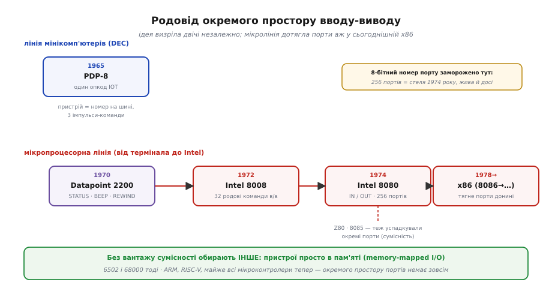

# 📜 Звідки взялися окремі команди вводу-виводу

Уявіть інженера 1965 року, який будує машину з жмені транзисторів. Пам'ять коштує шалено дорого, кожен провід на платі — це гроші й місце, а кожен код операції у крихітному наборі команд треба виривати з зубами в і без того тісного просторі. І от перед ним постає питання, з яким досі живе кожен процесор на світі: **як машині дотягтися до зовнішнього світу** — до перфострічки, до телетайпу, до реле, що клацає десь у стійці? У пам'яті цих речей немає. Пам'ять — це комірки з числами; телетайп — це не число, це подія в часі.

Відповідей на це питання історія дала дві, і вони народилися майже одночасно, у різних кутках індустрії, з різних міркувань. Одна відповідь — покласти пристрої просто в пам'ять, серед звичайних комірок. Друга — дати машині **другі двері**: окремий простір адрес із власними, спеціально для нього придуманими командами. Ця стаття — про те, звідки взялися ці другі двері, чому їх колись вважали розумним рішенням, і як вийшло, що вони й досі стирчать у кожному настільному процесорі — уже не тому, що потрібні, а тому, що їх нікуди діти.

## Дві машини, одна ідея — і жодна не в іншої не підглядала

Найспокусливіше — уявити пряму лінію: хтось один придумав окремий ввід-вивід, а решта переписали. Насправді ідея визріла **двічі, незалежно**, і це важливо, бо показує: думка була природною для своєї доби, а не примхою однієї людини.

Перша лінія — світ **мінікомп'ютерів**. Її вершина для нашої історії — **DEC PDP-8**, представлений 22 березня 1965 року за $18 500 (статус: усталено — дата й ціна збігаються в кількох незалежних джерелах, зокрема в Computer History Museum і Смітсонівському музеї). Це була перша по-справжньому комерційно успішна «міні»: понад 50 000 проданих машин, перша машина дешевше $20 000. Головним конструктором первісної версії був **Едсон де Кастро** (Edson de Castro), який згодом заснував Data General; архітектурну лінію PDP (PDP-4, 5, 6) вів **Ґордон Белл** (C. Gordon Bell). PDP-8 виріс із PDP-5 і з цілком конкретного замовлення: канадська ядерна лабораторія в Чолк-Рівер (Chalk River) хотіла компактну машину, щоб стежити за реактором.

Друга лінія — світ **мікропроцесорів**, і вона почалася зовсім не з Intel, а з термінала. Але перш ніж дійти до неї, придивімося, як окремий ввід-вивід виглядав у PDP-8, бо саме там видно його в найчистішому, майже кристалічному вигляді.

## PDP-8: одне слово, один опкод, увесь зовнішній світ

У PDP-8 було лише **вісім** базових команд. Не вісім сотень — вісім. Слово машини було 12-бітне, і три старші біти цього слова кодували, яка це з восьми команд. Сім опкодів пішли на звичну роботу: додати, зберегти, перейти, і таке інше. А **восьмий**, з кодом 6 (в октальному записі — увесь діапазон від 6000 до 6777), був відданий цілком одному — вводу-виводу. Він звався **IOT** — *Input/Output Transfer*, «передача вводу-виводу».

Ось де починається краса. Сам процесор про цей опкод майже нічого не знав. Він не мав переліку пристроїв, не мав команди «читати з диска» чи «писати на телетайп». Він робив дещо простіше й хитріше: коли траплялося слово з опкодом 6, процесор брав **середні шість бітів** цього слова й виставляв їх на шину як **номер пристрою** (0..77 в октальному — до 64 пристроїв), а **три молодші біти** — як три окремі імпульси-команди, що йшли до вибраного пристрою. Що ці імпульси означають — вирішував **сам пристрій**, а не процесор.

```
Слово IOT на PDP-8 (12 бітів):

  біти:  11 10  9 | 8  7  6  5  4  3 | 2  1  0
         [опкод 6]|[  номер пристрою ]|[ 3 імпульси ]
             ↑            ↑                  ↑
        «це ввід-    «до кого         «що зробити»
         вивід»       звертаюсь»    (визначає пристрій)
```

Тобто процесор давав лише **каркас**: ось адреса пристрою, ось три лінії, смикай. Уся семантика — «імпульс 1 означає „чи готовий ти?“, імпульс 2 — „віддай байт“, імпульс 4 — „очисти прапорець“» — жила **в самому пристрої**, у його логіці на платі. Для типового телетайпа один із цих бітів наказував процесору **пропустити наступну команду**, якщо пристрій готовий (це давало найпростішу перевірку готовності в циклі), а інший — перекинути слово між акумулятором і пристроєм.

> 🔧 **Навіщо це.** Тут у зародку видно всю філософію окремого простору вводу-виводу, яку потім успадкує x86. Пристрій адресується **не як комірка пам'яті**, а окремим номером на шині, і дотягтися до нього можна **лише** спеціальною командою (тут — IOT), а не звичайним читанням-записом. Дані течуть через **один-єдиний регістр** — акумулятор AC. Ці три риси — окремий номер, окрема команда, вузьке горлечко акумулятора — пройдуть крізь усю історію майже незмінними. Побачивши через десять років `IN AL, 0x60` на Intel, ви впізнаєте той самий кістяк.

Чому саме так? Не з якоїсь глибокої теорії, а з голої **ощадливості**. Віддати цілий восьмий опкод під ввід-вивід було дешево: не треба десятків окремих команд для кожного пристрою, не треба щоб процесор знав про пристрої взагалі. Пам'яті PDP-8 мав усього 4096 слів (12-бітна адреса — і по всьому), тож віддавати цих дорогоцінних комірок під пристрої було б марнотратством. Окремий канал для пристроїв розв'язував усе одним махом: пам'ять лишалася пам'яттю, пристрої мали свій світ, а коштувало це один опкод. Розумно — для 1965 року, для машини з жмені транзисторів.

## Термінал, який ніхто не мав за комп'ютер

Тепер друга лінія — і вона куди несподіваніша, бо починається там, де комп'ютера начебто й немає.

1970 року техаська фірма **Computer Terminal Corporation** (CTC), яку заснували **Філ Рей** (Phil Ray) і **Ґас Роше** (Gus Roche), випустила **Datapoint 2200** — програмований термінал. Не комп'ютер у їхньому розумінні, а «розумний» термінал: екран, клавіатура, касета — щоб сидіти й працювати з великою машиною десь віддалік. Але всередині це був повноцінний процесор. Набір команд для нього придумали **Віктор Пур** (Victor Poor) і **Гаррі Пайл** (Harry Pyle) — за легендою, що її переповідають самі учасники, на підлозі вітальні під час Дня подяки 1969 року, поки Пур доопрацьовував два тижні перед звільненням із попередньої фірми (статус: напівлегенда — обставини «на підлозі у вітальні» переповідають самі Пур і Пайл, документального підтвердження точної дати немає; але авторство набору команд за ними — усталено).

І ось ключове. CTC не хотіла паяти той процесор із розсипу мікросхем — це було громіздко. Вона звернулася до молодої **Intel**, щоб та вмістила увесь набір команд Datapoint 2200 в **один кристал**. Так народилася **Intel 8008** (квітень 1972-го) — фактично набір команд термінала Datapoint, перенесений у кремній. А з 8008 виросла 8080, а з неї — уся лінія x86. Тобто набір команд, що крутиться в мільярдах сьогоднішніх ПК і серверів, **тягнеться коренем до термінала 1970 року**, який спроєктували двоє інженерів на підлозі вітальні. Це ретельно задокументований факт (статус: усталено — детальне трасування зробив дослідник Кен Шіррифф (Ken Shirriff) за оригінальними документами; збігається з Вікіпедією й музейними джерелами).

Як Datapoint 2200 робив ввід-вивід? У нього були **команди під конкретні дії пристрою** — не абстрактні «читати порт», а буквально названі операції: `STATUS` (дізнатися стан вводу-виводу), `BEEP` і `CLICK` (пискнути, клацнути), `REWIND` (перемотати касету). Тобто ввід-вивід був зашитий у набір команд як перелік конкретних жестів, які машина вміла робити зі своїм залізом.

## Від «пискни» до «IN/OUT»: як Intel відшліфувала ідею

Коли Intel переносила набір Datapoint у 8008, вона зробила з цим вводом-виводом розумну річ: **узагальнила** його. Замість гнізда конкретних `BEEP` і `REWIND` вона дала **32 родові команди вводу-виводу** — вісім вхідних портів і двадцять чотири вихідних (`INP` читає з вхідного порту в акумулятор, `OUT` пише з акумулятора у вихідний порт; статус: усталено — за WikiChip і Вікіпедією). Пристрій більше не мусив мати власну іменовану команду — він просто чіплявся на номер порту, а процесор давав універсальні «прочитати з порту N» і «записати в порт N». Той самий крок абстракції, що його PDP-8 зробив своїм IOT, тільки з іншого боку: PDP-8 віддав пристрою три голі імпульси, а 8008 дав пронумеровані порти.

Наступний крок — **Intel 8080**, квітень 1974-го (статус: усталено). Її головним архітектором був **Федеріко Фаджін** (Federico Faggin), детальне проєктування вів **Масатосі Сіма** (Masatoshi Shima), долучився й **Стенлі Мейзор** (Stanley Mazor). 8080 стиснула ті 32 команди вводу-виводу з 8008 до **двох дзеркальних**: `IN` і `OUT`. Одна читає з порту в акумулятор, друга пише з акумулятора в порт. Звільнене місце в наборі команд пішло на корисніші речі. І — головне число нашої історії — номер порту став **8-бітним**, тобто портів стало рівно **256** (0..255).

Чому саме 256, чому 8 бітів? Бо це елегантно вміщалося в тісний формат команди. 8080 мав 16-бітну адресу пам'яті — усього 64 кілобайти на все. Якби пристрої довелося класти в цю саму пам'ять, кожен їхній регістр **відкушував** би комірку від і так крихітного простору. А окремий 8-бітний простір портів давав пристроям **власні** 256 адрес — і **жодної** комірки пам'яті на них не витрачалося. Плюс бонус схемотехніці: окремий сигнал на шині заздалегідь казав «це порт, не пам'ять», тож дешифратори адрес пристроїв виходили простішими.


*Окремий ввід-вивід визрів двічі незалежно: у мінікомп'ютерах DEC (PDP-8, опкод IOT) і в мікропроцесорній лінії, що почалася з термінала Datapoint 2200 — від іменованих команд пристрою через 32 родові команди 8008 до двох `IN`/`OUT` із 256 портами на 8080. Саме на 8080 заморозили 8-бітний номер порту, і звідти сумісність дотягла порти аж у сьогоднішній x86. Хто будував без вантажу минулого — 6502 і 68000 тоді, ARM і RISC-V тепер — обрав інше: пристрої просто в пам'яті.*

> 🔧 **Навіщо це.** Ось звідки ростуть дві дивні риси команд `IN`/`OUT`, які й сьогодні спантеличують того, хто вперше їх бачить. **Чому номер порту в короткій формі лише 8-бітний (0..255)?** Бо його розмір заморозили 1974 року, коли 256 портів здавалися розкішшю. **Чому дані ходять тільки через акумулятор?** Бо єдиний акумулятор спрощував кремній декодера ще в 8008, а він тягнеться від 8080. Це не інженерний вибір сьогодення — це закам'янілий відбиток тісноти сорокарічної давнини.

## Дорога, якою пішли не всі

Щоб побачити, що окремий ввід-вивід був **вибором**, а не єдиною можливістю, досить глянути на сусідів по епосі, які вибрали інакше.

Лінія Intel потягла ідею окремих портів далі: **Zilog Z80** (1976), спроєктований тим-таки Фаджіном, який пішов з Intel і заснував Zilog, був навмисне зроблений сумісним із 8080 — усі 8080-ні програми йшли на ньому без переробки. Тому Z80 успадкував і окремий простір вводу-виводу: ті самі 256 портів, окрема лінія на шині для звертань до вводу-виводу (статус: усталено). Так само й проміжна **Intel 8085**. Уся ця родина — 8080, 8085, Z80 — ділила один світогляд: пам'ять окремо, порти окремо.

А тепер сусіди, що зробили **навпаки**. **MOS 6502** (той, що в Apple II, Commodore, NES) і **Motorola 68000** (той, що в перших Macintosh і Amiga) окремого простору вводу-виводу **не мали зовсім**. У них пристрої жили просто **в пам'яті**, серед звичайних комірок: запис за певною адресою смикав реле, читання з іншої адреси давало байт із порту. Ніяких `IN`/`OUT` — той самий запис у пам'ять, що й усюди. Це називають **memory-mapped I/O**, і для програміста воно куди простіше: до пристрою застосовна вся сила звичайних команд, а не жалюгідні дві.

Отже, розвилка була справжня. Два табори, два світогляди, обидва працювали. І тут — найважливіший, найчесніший висновок цієї історії.

## Чому x86 досі тягне те, що давно нікому не потрібне

Коли Intel будувала **8086** (1978) — предка всіх сьогоднішніх x86, — вона свідомо тримала спадкоємність із 8080, щоб старий код і старі звички переносилися легко. Тому окремий простір портів із `IN`/`OUT` перекочував у 8086 як був. А далі спрацював залізний закон індустрії: **сумісність назад**. Кожне нове покоління x86 мусило виконувати код попереднього. І так простір портів, придуманий для 8-бітного кристала 1974 року з його 64 кілобайтами пам'яті, доїхав **донині** — у процесори з мільярдами адрес пам'яті, де все, що колись жило в портах, давно могло б спокійно лежати у звичайній пам'яті.

Ось де треба сказати прямо, без прикрас. **Окремий простір вводу-виводу зберігся в x86 не тому, що він кращий, а тому, що його нікуди діти.** Первісна причина — брак адрес — зникла ще в 1980-х. Технічної переваги над memory-mapped I/O в нього немає: доступ бідніший (лише читати й писати, лише через акумулятор), простір тісний і історично фрагментований, а на все, що процесор навчився робити з пам'яттю пізніше — кеш, захист, віртуальні адреси — окремі порти лягають погано, бо будувалося воно все навколо звертань до пам'яті. Це **історична інерція** в чистому вигляді: рішення пережило свою причину на півстоліття.

І саме тому нові архітектури його **не повторюють**. **ARM, RISC-V, MIPS** та практично всі сучасні мікроконтролери починали з чистого аркуша, без вантажу сумісності з 8080 — і жоден із них окремого простору портів не має. У них один простір адрес на все, і кожен регістр пристрою — просто адреса в ньому. Коли конструктор вільний, він не вибирає окремі порти. Їх вибирають тільки там, де мусять тягти минуле.

> 🔧 **Навіщо це.** Це рятує від дуже поширеної хиби — думки, ніби якщо щось є в архітектурі поважного x86, то воно там **навіщось потрібне** і, певно, швидше чи краще. З окремим простором портів усе навпаки: побачивши його, знайте, що дивитеся на **скам'янілість**, на слід родоводу, що тягнеться через 8080 і 8008 аж до термінала Datapoint 1970 року. Не шукайте в ньому переваг — їх немає; є лише історія, яку не можна викинути, не зламавши сумісності. Це, до речі, ідеальна ілюстрація того, чому набір команд процесора — [сталий контракт](root:hw-arch/isa), який десятиліттями несе рішення, зроблені за зовсім інших обставин.

## Що з усього цього варто винести

Історія окремих команд вводу-виводу — це історія про те, як **дешеве й розумне рішення своєї доби застигає й переживає власну причину**. Наприкінці 1960-х пам'ять коштувала дорого, адрес було мало, транзисторів обмаль, і віддати пристроям окремий канал — окремий опкод IOT на PDP-8 (1965), окремі порти на 8008 (1972), дві команди `IN`/`OUT` із 256 портами на 8080 (1974) — було чесно вигідно: пам'ять не витрачалася, кремній виходив простішим. Ідея визріла двічі незалежно — у світі мінікомп'ютерів DEC і в мікропроцесорній лінії, що несподівано почалася з термінала Datapoint 2200, а не з Intel.

Далі спрацювала сумісність. Z80 і 8085 успадкували порти від 8080; 8086 — від них; уся x86 — від 8086; і так простір портів доїхав до сьогоднішніх машин, де його первісна причина давно зникла. Тим часом ті, хто будував без вантажу минулого — 6502 і 68000 тоді, ARM і RISC-V тепер, — вибрали простіший шлях: пристрої просто в пам'яті. Тому головне, що варто тримати в голові, зустрівши `IN`/`OUT`: перед вами не інженерна перевага, а **музейний експонат під струмом** — рішення 1974 року, яке працює досі лише тому, що зламати його означало б зламати сумісність із півстоліттям коду.
