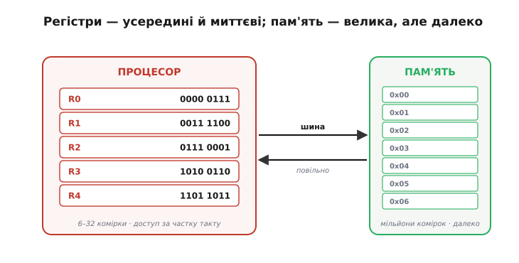
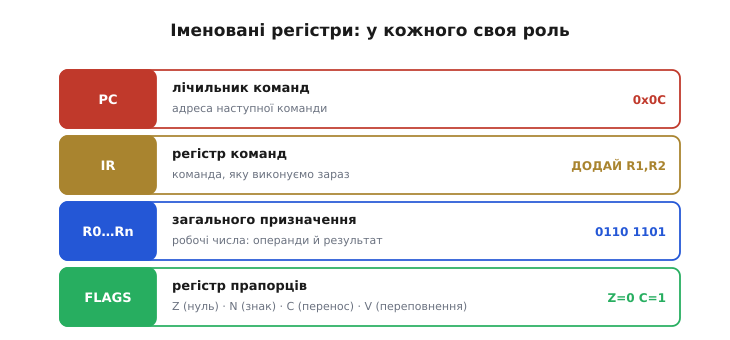
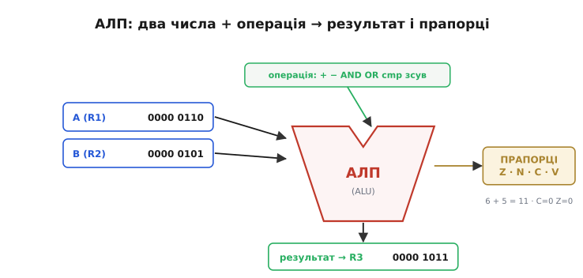
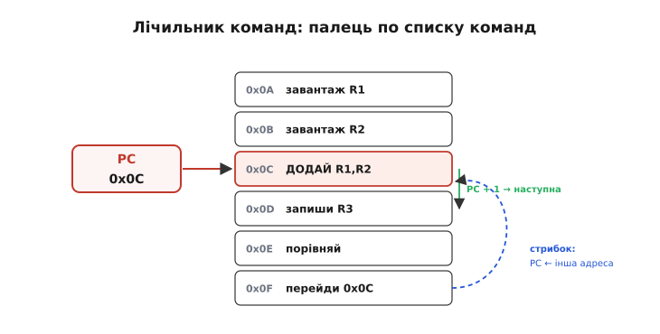
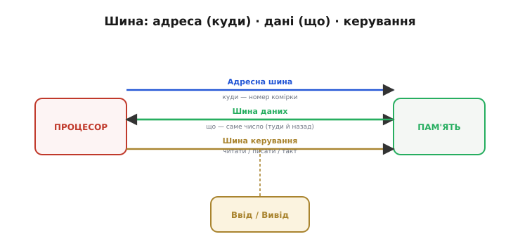
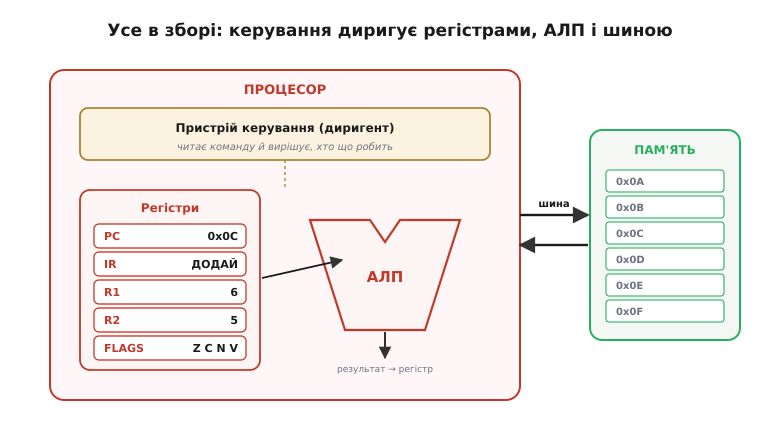

# Складові процесора

[Процесор виконує інструкції](root:hw-arch/what-is-processor) — лишається відкрити корпус і подивитися, **з чого** він зроблений, щоб це могти. На щастя, усі цеглинки прості й знайомі: тут зійдуться [суматор](root:hw-digital/combinational-circuits), [регістри](root:hw-digital/register), [лічильники](root:hw-digital/counters) і [прапорці переповнення](root:sf-lang/overflow-wraparound). Процесор — не якесь нове диво, а **розумна композиція** базових цифрових блоків. У ньому чотири головні органи: **регістри** (де тримати числа під рукою), **АЛП** (де їх рахувати), **лічильник команд** (де стежити за місцем у програмі) і **шина** (по чому спілкуватися з пам'яттю). Плюс п'ятий, диригент, — **пристрій керування**. Кожен орган простий сам по собі, а разом вони складаються в машину, що виконує накази.

### Регістри: надшвидкий записник процесора

**Регістри** (*register*, від латинського *regerere* — «заносити, записувати») — це крихітні комірки пам'яті **всередині** процесора, кожна завширшки в машинне слово, і їх **дуже мало**: від кількох до кількох десятків. [Регістр](root:hw-digital/register) — це група тригерів, що тримає слово. Питання — навіщо вони, якщо є велика пам'ять?


*Регістрів мало й вони крихітні, зате лежать **усередині** процесора, тож доступ до них — миттєвий, за частку такту. Пам'ять натомість величезна, але **далеко** й **повільна** — по неї треба йти через шину. Тому процесор тягне потрібні числа з пам'яті в регістри, виконує над ними обчислення **у регістрах**, і лише тоді відправляє результат назад у пам'ять. Регістри — це робочі «руки» процесора, його чернетка під рукою.*

Це прямий наслідок **вузького місця**: пам'ять велика, але до неї довго йти спільною шиною. Якби процесор щоразу лазив у пам'ять по кожне число, він би вічно простоював. Тож конструктори дали йому жменьку **миттєвих** комірок просто всередині, де й кипить уся гаряча робота. Образно: пам'ять — це бібліотека (величезна, та йти далеко), а регістри — кілька аркушів на столі перед вами (мало місця, зате все під рукою й одразу). Розумний працівник тримає на столі рівно те, з чим зараз працює, — так робить і процесор.

### Не всі регістри рівні: спеціальні ролі

Частина регістрів — просто **чернетки** для будь-яких чисел (їх звуть *регістрами загального призначення*). Та кілька мають **особливу** роботу, без якої машина не крутилася б.


*Кожен іменований регістр має свою роль. **PC** (*program counter*, лічильник команд) тримає адресу **наступної** команди — «де ми в програмі». **IR** (*instruction register*, регістр команд) тримає **поточну** команду, яку процесор саме виконує. **Регістри загального призначення** (R0…Rn, акумулятор) — робочі числа: операнди й результати. **FLAGS** (регістр прапорців) зберігає стан останнього обчислення: Z (нуль), N (знак), C (перенос), V (переповнення) — точно ті [прапорці переповнення](root:sf-lang/overflow-wraparound).*

Зверніть увагу, скільки простих блоків тут зібралося. **Прапорці** Z/N/C/V — це ті самі, що їх виставляє АЛП [при переповненні](root:sf-lang/overflow-wraparound); тут вони живуть в окремому регістрі стану. А **PC** — це по суті [лічильник](root:hw-digital/counters). Процесор не вигадує нових сутностей — він **перевикористовує** базові цифрові блоки, лише дає кожному чітку роль.

### АЛП: рахівниця процесора

**АЛП** (*ALU, Arithmetic Logic Unit*, арифметико-логічний пристрій; *arithmetic* — від грецького *arithmós*, «число», *logic* — від грецького *logikḗ*, «наука про міркування») — це орган, що власне **рахує**: додає, віднімає, порівнює, виконує логічні AND/OR/NOT, зсуває біти. Це і є «Млин» Беббіджа — частина, що меле числа.


*АЛП бере **два** числа (зазвичай із регістрів), пристрій керування каже їй, **яку** операцію зробити (+, −, AND, OR, порівняти, зсунути), і вона видає **результат** (назад у регістр) та **прапорці** Z/N/C/V (стан результату). На прикладі: 6 + 5 = 11. Усередині АЛП — [суматор](root:hw-digital/combinational-circuits) і [логічні вентилі](root:hw-digital/basic-gates); вона **комбінаційна**, тобто лише рахує «тут і зараз», нічого не пам'ятаючи між операціями.*

Ключова думка про АЛП — вона **нічого не пам'ятає** й нічого не вирішує. Це чиста [комбінаційна схема](root:hw-digital/combinational-circuits): подав на входи числа й код операції — миттєво дістав на виході результат, прибрав входи — результат зник. Пам'ять — це робота **регістрів**, рішення — робота **пристрою керування**, а АЛП лише **рахує**. Саме тому її входи завжди беруть із регістрів, а вихід кладуть назад у регістр: АЛП і регістри працюють у нерозлучній парі — одна рахує, інші тримають. До речі, **порівняти** два числа АЛП уміє тим самим відніманням: відніми B від A й глянь на прапорці — Z=1 означає рівність, а знак результату каже, що більше.

> 🔧 **Навіщо це.** Цей трюк «порівняння через віднімання» — фундамент усіх `if` і циклів. У машинному коді `if (a == b)` майже завжди компілюється у `cmp a, b` (те саме віднімання, тільки результат викидається — лишаються самі прапорці) і потім умовний стрибок за прапорцем Z. Тому, читаючи асемблер, ви постійно бачите пару «cmp → умовний перехід»: процесор не має окремої машинерії «порівняти», він позичає її в суматора АЛП.

### Лічильник команд: закладка в програмі

Як процесор пам'ятає, **котру** інструкцію виконувати наступною? За це відповідає **лічильник команд** — **PC** (*program counter*). Це спеціальний регістр, що тримає **адресу** наступної команди в пам'яті.


*PC — це «закладка» в програмі: він указує на комірку з наступною командою. Після того як процесор узяв команду, PC **сам додає 1** і вже вказує на наступну — звідси й береться природне виконання «по порядку». А **стрибок** (jump) — це просто запис **іншої** адреси в PC: щоб повторити цикл, кладемо в PC адресу його початку (тут 0x0C). PC — це буквально [лічильник](root:hw-digital/counters), лише лічить він не події, а кроки програми.*

Ось де стає конкретним те «місце в [списку команд процесора](root:hw-arch/what-is-processor)». Програма — список команд за адресами; PC — палець, що по ньому веде. Звичайний хід: виконав команду — PC++ — наступна. Це й дає виконання згори вниз **само собою**, без жодних зусиль: лічильник просто рахує далі. А вся магія циклів і розгалужень зводиться до **одного** трюку — записати в PC не наступну адресу, а іншу. «Перейди на початок циклу» — це `PC ← адреса початку`. «Якщо рівно, пропусти команду» — це умовна зміна PC залежно від прапорця Z. Уся структура програм тримається на цьому скромному лічильнику.

### Шина: спільні дроти до пам'яті

Лишається з'ясувати, **по чому** процесор спілкується з пам'яттю (і зі світом). По **шині** (*bus*, від латинського *omnibus* — «для всіх»: спільні дроти, доступні всім вузлам) — наборах спільних ліній.


*Шина — це три набори ліній. **Адресна** (*address bus*) каже, **куди** звертаємось — номер комірки пам'яті; її ширина задає, скільки пам'яті машина взагалі може адресувати. **Шина даних** (*data bus*) несе **саме число** — туди (записати) й назад (прочитати). **Шина керування** (*control bus*) передає сигнали «читати»/«писати» й такт. Тими самими дротами користуються й пам'ять, і пристрої вводу/виводу.*

Дві практичні дрібниці про шину. Перша: **ширина шини даних** — це і є [«розрядність»](root:sf-algorithms/bits-bytes-endianness). 8-бітна шина носить один байт за такт, 32-бітна — чотири; ось чому ширша шина (і слово) означає більшу пропускну здатність. Друга: шина **спільна** — і саме тому вона є тим **вузьким місцем**, про яке попереджав фон Нейман. І команди, і дані течуть тими самими дротами, тож процесор не може водночас брати інструкцію й возити дані — звідси затори, з якими інженери воюють кешами й хитрощами (а [архітектура з окремими шинами для коду й даних](root:embedded/von-neumann-harvard) знімає саме цей затор).

### Пристрій керування: диригент

П'ятий орган — **пристрій керування** (*control unit*; *control* — від старофранцузького *contrerole*, «звірятельний реєстр», звідки «перевіряти, керувати») — і є той диригент, що змушує решту працювати злагоджено.


*Повна картина: **пристрій керування** читає поточну команду (з IR), розуміє, що вона означає, і **диригує** рештою — каже PC рушити далі, обирає, які регістри подати на АЛП, задає АЛП операцію, командує шиною читати чи писати. **Регістри** тримають числа, **АЛП** їх рахує, **PC** стежить за місцем у програмі, **шина** возить усе до пам'яті. Кожен орган простий; разом вони й утворюють машину, що виконує інструкції.*

Точний порядок цих дій тут не головне — важливо побачити саму **анатомію**: п'ять простих частин, кожну з яких легко зрозуміти окремо (регістр — тригери; АЛП — суматор і вентилі; PC — лічильник; шина — дроти; керування — логіка, що декодує команду), з'єднані так, що разом вони вибирають команди з пам'яті й виконують їх. Жодної окремої «магії» — лише прості цеглинки в розумній композиції.

### Як органи працюють разом: один крок

Щоб анатомія ожила, простежмо один-єдиний крок на конкретному коді. Нехай у пам'яті лежить команда `ДОДАЙ R3, R1, R2` («поклади в R3 суму R1 і R2»), і саме на неї вказує PC.

**Умова:** R1 = 6, R2 = 5, PC = 0x0C, у комірці 0x0C — код команди `ДОДАЙ R3, R1, R2`. Що зроблять п'ять органів за цей крок:

:::tabs
```c
// Спрощена модель кроку процесора на C — кожен рядок робить один орган.
uint16_t IR  = mem[PC];        // шина: прочитати команду за адресою PC (0x0C)
PC = PC + 1;                    // лічильник команд: 0x0C -> 0x0D (наступна)

// пристрій керування розбирає IR -> операція ДОДАЙ, входи R1,R2, вихід R3
uint8_t  a   = R[1];           // регістри: подати операнд A = 6
uint8_t  b   = R[2];           // регістри: подати операнд B = 5
uint16_t res = a + b;          // АЛП: 6 + 5 = 11 (комбінаційно, за один такт)

R[3] = (uint8_t)res;           // регістри: записати результат, R3 = 11
FLAGS.Z = (R[3] == 0);         // прапорці: результат не нуль -> Z = 0
FLAGS.C = (res > 0xFF);        // прапорці: переносу за межі байта немає -> C = 0
```
```python
# Спрощена модель кроку процесора на Python — кожен рядок робить один орган.
IR = mem[PC]                   # шина: прочитати команду за адресою PC (0x0C)
PC = PC + 1                    # лічильник команд: 0x0C -> 0x0D (наступна)

# пристрій керування розбирає IR -> операція ДОДАЙ, входи R1,R2, вихід R3
a = R[1]                       # регістри: подати операнд A = 6
b = R[2]                       # регістри: подати операнд B = 5
res = a + b                    # АЛП: 6 + 5 = 11 (комбінаційно, за один такт)

R[3] = res & 0xFF              # регістри: записати результат у байт, R3 = 11
FLAGS.Z = (R[3] == 0)          # прапорці: результат не нуль -> Z = 0
FLAGS.C = (res > 0xFF)         # прапорці: переносу за межі байта немає -> C = 0
```
:::

Покрокове обчислення самого додавання:

```
A (R1) = 0000 0110   (6)
B (R2) = 0000 0101   (5)
       = ---------
R3     = 0000 1011   (11)   Z=0  C=0
```

Висновок: шина принесла команду, PC уже стереже наступну адресу, керування розклало команду на ролі, регістри подали числа й прийняли результат, АЛП порахувала, прапорці зафіксували стан. Жоден орган не робив нічого складного — уся «магія» в тому, як чисто вони поділили роботу. Один такий крок, повторений мільярди разів за секунду, і є виконанням програми.

> 🔧 **Навіщо це.** Ця анатомія — те, з чим ви зіткнетесь упритул, тільки-но візьметеся за мікроконтролер на нижчому рівні. **Регістри** — найшвидша пам'ять, і вся гаряча робота йде в них; асемблер та оптимізації компілятора — це саме про те, як ефективно «жонглювати» жменькою регістрів, не бігаючи зайвий раз у повільну пам'ять. **Прапорці** [Z/N/C/V](root:sf-lang/overflow-wraparound) — те, на чому тримаються всі `if` і цикли. **PC** — це «де виконується програма»; коли код «вилітає» в незрозуміле місце, це часто означає, що в PC потрапила хибна адреса. **Шина** та її ширина — це пряма межа швидкодії; розуміючи «вузьке місце», ви не дивуватиметеся, чому процесор із удвічі вищою частотою не завжди вдвічі швидший. Тримайте цю карту в голові — і робота мікроконтролера перестане бути чорною скринькою.

---

Отже, процесор складається з небагатьох простих органів — самих лише базових цифрових блоків. **Регістри** — крихітні надшвидкі комірки всередині процесора, робочий записник; серед них спеціальні: **PC** (адреса наступної команди), **IR** (поточна команда), регістри **загального призначення** (операнди/результати) і **FLAGS** ([прапорці Z/N/C/V](root:sf-lang/overflow-wraparound)). **АЛП** — [комбінаційна](root:hw-digital/combinational-circuits) «рахівниця»: бере два числа й код операції, видає результат і прапорці, нічого не пам'ятаючи. **Лічильник команд PC** — це [лічильник](root:hw-digital/counters), що тримає адресу наступної команди, сам +1 (звідси порядок), а «стрибок» — це запис іншої адреси в PC. **Шина** (адресна + даних + керування) сполучає процесор із пам'яттю й вводом-виводом; ширина шини даних — це [розрядність](root:sf-algorithms/bits-bytes-endianness), а її спільність — те саме «вузьке місце». Диригує всім **пристрій керування**. Як саме ці органи, такт за тактом, спільно виконують одну команду, докладно показує [цикл «вибірка → декодування → виконання»](root:hw-arch/fetch-decode-execute) — серцебиття процесора.
